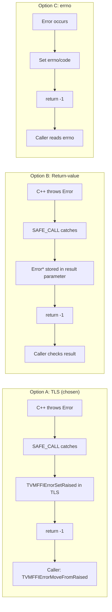

---
scope:
  - "0001-c-abi-layer"
  - "0006-error-handling"
---
# TLS-based Error Propagation Across C ABI

**TL;DR**: The decision to propagate errors across C ABI boundaries using thread-local storage (TLS) rather than return-value error objects or errno-style codes.

## Context
- The TVM FFI has deeply nested cross-language call chains: `Python -> C++ -> Python -> C++ -> ...`. Each boundary crossing goes through the C ABI.
- Errors must carry structured information: kind (e.g., "ValueError"), message, and a cross-language traceback.
- Three approaches were considered for error propagation:

Usecases:
- A Python user calls a C++ function that calls back into Python, which calls another C++ function that fails. The error must propagate back through all four boundary crossings without losing information.
- Compiler codegen emits sequences of FFI calls. With TLS errors, codegen only needs to check the return code after each call (not pass/check error parameters).

Design Decisions:
- **Use TLS for error storage**: `TVMFFIErrorSetRaised(error)` stores the error object in TLS. `TVMFFIErrorMoveFromRaised(&err)` retrieves and clears it. This decouples error storage from the function signature.
- **Three-way return code**: 0=success, -1=error stored in TLS (call MoveFromRaised), -2=frontend error already set (e.g., Python exception). The -2 code avoids double-handling: the frontend already knows about the error.
- **Error objects are first-class**: `ErrorObj` is a ref-counted Object with kind/message/backtrace. This enables backtrace accumulation across language boundaries via `update_backtrace` (with `kTVMFFIBacktraceUpdateModeAppend`). Backtrace strings are stored most-recent-call-first for efficient append-based construction.
- **`EnvErrorAlreadySet` sentinel**: A lightweight exception type (not `Error`) that signals "the frontend runtime already has the error — just return -2." This avoids constructing a redundant error object.

## Implementation Notes
- `TVMFFIErrorSetRaised` stores an `ObjectHandle` in `thread_local` storage. `TVMFFIErrorMoveFromRaised` retrieves it and sets the TLS slot to `nullptr`.
- `TVM_FFI_SAFE_CALL_BEGIN/END` macros form the exception boundary. `SAFE_CALL_END` has a catch hierarchy: `tvm::ffi::Error` -> `EnvErrorAlreadySet` -> `std::exception` (wrapped as InternalError).
- `TVM_FFI_CHECK_SAFE_CALL(func)` is the caller-side macro: calls `func`, checks return code, and re-throws the error if non-zero.
- The TLS approach introduces a dependency on platform TLS support, which is available on all target platforms (Linux, macOS, Windows, Emscripten).
- Alternative B (return-value) was rejected because it would require every function in a call chain to propagate the error through an additional parameter, significantly complicating codegen for the compiler backend.
- Alternative C (errno) was rejected because it cannot carry structured error objects (kind, message, traceback).

## Related Design Docs
- [0001-c-abi-layer.md](.knowledge/designs/0001-c-abi-layer.md)
- [0006-error-handling.md](.knowledge/designs/0006-error-handling.md)
- [0004-function-system.md](.knowledge/designs/0004-function-system.md)
