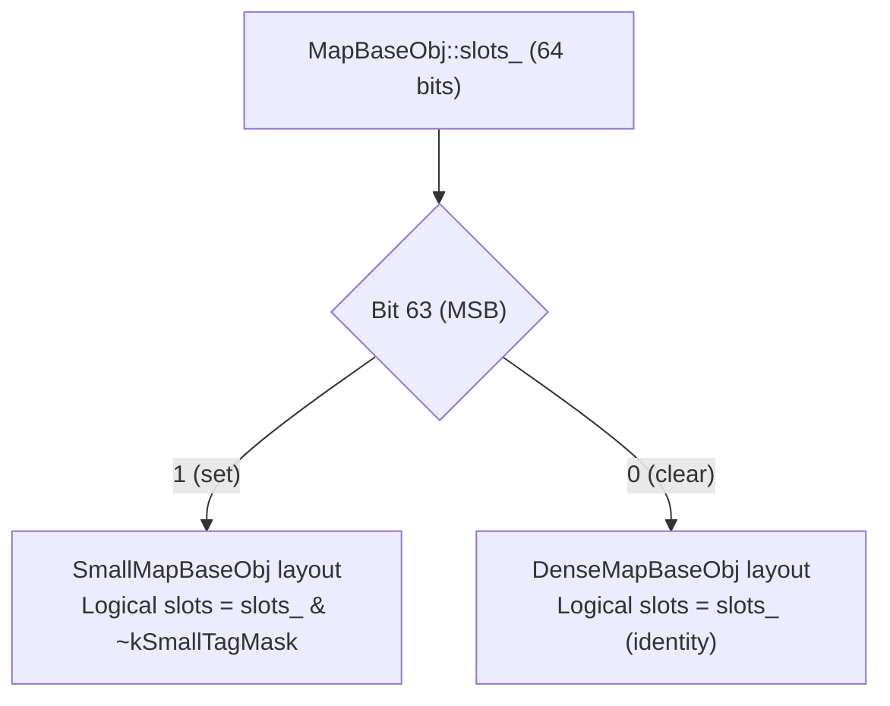

---
scope:
  - "0008-containers"
---
# Use MSB Tag Bit in slots_ for SmallMap/DenseMap Layout Discrimination

**TL;DR**: The decision to reserve bit 63 of `MapBaseObj::slots_` as a layout discriminator tag (MSB set = SmallMapBaseObj, MSB clear = DenseMapBaseObj), replacing the previous implicit convention that `slots_ <= kMaxSize` means small map. (Note: `slots_` is defined on `MapBaseObj`, the shared base class for `MapObj` and `DictObj`, as of 5a6b211.)

## Context
- `MapBaseObj` (the shared base for `MapObj` and `DictObj`) has two internal storage layouts: `SmallMapBaseObj` (linear scan, small capacity) and `DenseMapBaseObj` (open-addressing hash table, large capacity).
- Previously, dispatch between the two was based on comparing `slots_` against the compile-time constant `SmallMapBaseObj::kMaxSize`: `slots_ <= kMaxSize` meant small map.
- This tightly coupled the SmallMap/DenseMap transition point to a compile-time constant. Any future change to when the map transitions (e.g., adaptive sizing based on key type, or different thresholds for different workloads) would require changing the dispatch condition everywhere.
- The `TVM_FFI_DISPATCH_MAP` and `TVM_FFI_DISPATCH_MAP_CONST` macros, plus `InsertMaybeReHash`, all used the size-based comparison directly.

Usecases:
- Future flexibility in small map sizing (e.g., adaptive thresholds, different kMaxSize values for different map populations).
- Cleaner separation of concerns: the tag is a property of the object, not a derived property of a compile-time constant.
- Enabling potential future optimizations where a small map might have more slots than `kMaxSize` (e.g., a small map that grows without transitioning to dense layout).

Design Decisions:
- **`kSmallTagMask = 1ULL << 63`**: Bit 63 of `MapBaseObj::slots_` is reserved as the layout tag. MSB set means `SmallMapBaseObj` layout; MSB clear means `DenseMapBaseObj` layout.
- **`IsSmallMap()` method**: `return (slots_ & kSmallTagMask) != 0`. Replaces all `slots_ <= kMaxSize` comparisons.
- **`NumSlots()` accessors**: `SmallMapBaseObj::NumSlots()` masks off the tag (`slots_ & ~kSmallTagMask`); `DenseMapBaseObj::NumSlots()` returns `slots_` directly (MSB is always clear for dense maps). All internal code migrated from raw `slots_` reads to `NumSlots()`.
- **Private tag-setting methods**: `SetSlotsAndSmallLayoutTag(n)` sets `slots_ = (n & ~kSmallTagMask) | kSmallTagMask`; `SetSlotsAndDenseLayoutTag(n)` asserts MSB is clear and sets `slots_ = n`. These are called only at construction/resize time.

## Implementation Notes
- The tag is set at construction time by `SetSlotsAndSmallLayoutTag` / `SetSlotsAndDenseLayoutTag` and is immutable for the lifetime of the map (a map does not change layout except during `InsertMaybeReHash` transitions).
- ABI impact: The in-memory value of `slots_` for `SmallMapBaseObj` instances changes (MSB is now set). Code that reads `slots_` directly (e.g., serialization, memory inspection) must use `NumSlots()` for the logical count.
- The `TVM_FFI_DISPATCH_MAP` / `TVM_FFI_DISPATCH_MAP_CONST` macros now dispatch on `base->IsSmallMap()` instead of `base->slots_ <= SmallMapBaseObj::kMaxSize`.
- No behavioral change to the public `Map<K,V>` or `Dict<K,V>` API; the refactoring is entirely internal to `MapBaseObj`/`SmallMapBaseObj`/`DenseMapBaseObj`.

## Related Design Docs
- [0008-containers.md](../designs/0008-containers.md)
- [0006-container-data-pointer.md](../ADRs/0006-container-data-pointer.md) -- Prior evolution of `slots_` semantics
