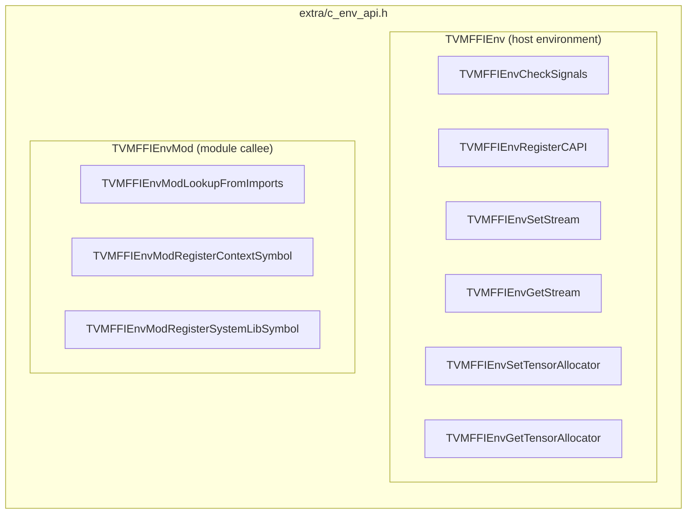

---
scope:
  - "0013-module-system"
  - "0001-c-abi-layer"
---
# Env C API Naming Convention: TVMFFIEnv vs TVMFFIEnvMod

**TL;DR**: The decision to split the `TVMFFIEnv*` C API namespace into two tiers -- `TVMFFIEnv` for general environment functions (signal checking, C API registration) and `TVMFFIEnvMod` for module-context functions (import lookup, context/system symbol registration) -- with both tiers relocated from core `c_api.h` to `extra/c_env_api.h`.

## Context
- The original `c_api.h` mixed general environment callbacks (`TVMFFIEnvCheckSignals`, `TVMFFIEnvRegisterCAPI`) with module-specific functions (`TVMFFIEnvLookupFromImports`, `TVMFFIEnvRegisterContextSymbol`, `TVMFFIEnvRegisterSystemLibSymbol`).
- All five functions shared the `TVMFFIEnv` prefix, making it unclear which functions relate to the host environment (Python signal checking, GIL management) and which relate to the module system (import resolution, symbol registration).
- The module-context functions are only relevant when the extra C++ API is enabled (`TVM_FFI_USE_EXTRA_CXX_API`), but were declared in the core header.

Usecases:
- A generated kernel calling `TVMFFIEnvModLookupFromImports` to resolve a dependency from its library context -- the `Mod` infix signals this is a module-side callee operation, not a host-side callback.
- A language runtime calling `TVMFFIEnvCheckSignals` or `TVMFFIEnvRegisterCAPI` to hook Python signal handling -- the bare `Env` prefix signals this is a general host environment integration.

Design Decisions:
- **Two-tier naming**: `TVMFFIEnv` prefix for functions that integrate with the host environment (language runtime callbacks); `TVMFFIEnvMod` prefix for functions used by module callees (generated code, library modules).
- **Relocation to `extra/c_env_api.h`**: All env C API functions moved out of core `c_api.h` to the extra header. This keeps the core C ABI header focused on fundamental operations (object lifecycle, function calls, type registration).
- **`TVMFFIEnvRegisterCAPI` signature change**: Parameter changed from `const TVMFFIByteArray*` to `const char*`, simplifying the call site for C code that typically has null-terminated strings.

Alternatives considered:
- **Keep flat `TVMFFIEnv` prefix for all functions**: Rejected because it conflates host-environment callbacks (signal checking, GIL management) with module-callee operations (import lookup, symbol registration). The two groups have different audiences (language runtime implementors vs. code generators), different lifecycle requirements, and should be independently discoverable.
- **Use separate headers (`c_env_host_api.h` and `c_env_mod_api.h`)**: Rejected as over-engineering. The two groups are small enough to share one header, and the naming prefix (`TVMFFIEnv` vs `TVMFFIEnvMod`) provides sufficient disambiguation. A single `c_env_api.h` keeps the include graph simpler.
- **Keep env functions in core `c_api.h` but add the `Mod` infix**: Rejected because the env functions depend on the extra C++ API (module system, EnvCAPIRegistry). Declaring them in core `c_api.h` creates a misleading impression that they are always available.

## Implementation Notes
- The rename is a **breaking C ABI change** at the linker level. Direct callers of the old names (`TVMFFIEnvLookupFromImports`, etc.) must update. Since these are primarily used by TVM-generated code (not end-user code), the blast radius is limited to the TVM compiler toolchain.
- `TVMFFIEnvRegisterCAPI` now takes `const char*` instead of `const TVMFFIByteArray*`, which is a source-level break. This simplifies usage from plain C but means callers no longer pass an explicit length.
- Implementation of `TVMFFIEnvCheckSignals` and `TVMFFIEnvRegisterCAPI` moved from `src/ffi/function.cc` to `src/ffi/extra/env_c_api.cc`. The `EnvCAPIRegistry` singleton class (managing Python signal/GIL callbacks) is unchanged in behavior.
- `src/ffi/testing.cc` also relocated to `src/ffi/extra/testing.cc`, further consolidating non-core code under the extra API gate.

## Related Design Docs
- [0013-module-system.md](../designs/0013-module-system.md) -- Module system design that produces the TVMFFIEnvMod functions
- [0001-c-abi-layer.md](../designs/0001-c-abi-layer.md) -- Core C ABI from which these functions were removed
- [0010-extra-api-isolation.md](../ADRs/0010-extra-api-isolation.md) -- Extra API isolation decision that motivated the relocation
