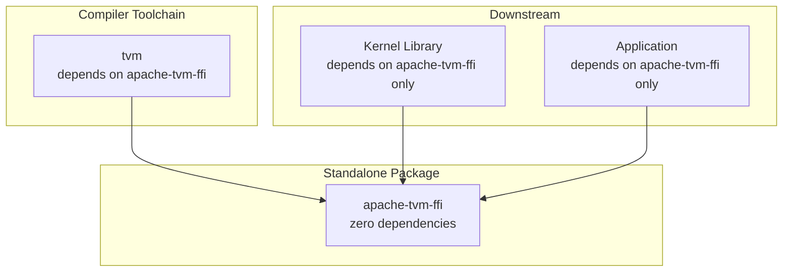

---
scope:
  - "0014-python-package"
---
# Standalone Zero-Dependency Python Package for TVM FFI

**TL;DR**
- Decouple the TVM FFI Python bindings into a standalone pip-installable package (`apache-tvm-ffi`) with zero runtime dependencies, enabling lightweight downstream consumption.
- The package includes the C++ shared library, Cython extension, headers, and CMake config -- everything needed for both Python and C++ consumers.

## Context
The TVM FFI provides the foundational cross-language infrastructure (type-erased values, packed functions, reference-counted objects, module loading) that both the compiler toolchain and downstream kernel libraries depend on. Prior to this decision, these Python bindings were embedded in the monolithic `tvm` package.

This created a problematic dependency chain: any project needing to call a compiled TVM kernel from Python had to install the full `tvm` package, including the compiler, scheduler, and all their transitive dependencies (e.g., numpy, scipy, attrs, psutil). For deployment scenarios -- edge devices, CI pipelines, production serving -- this heavyweight dependency was unacceptable.

Usecases:
- A kernel library author compiles a `.so` with TVM and wants users to load it with `pip install apache-tvm-ffi && python -c "import tvm_ffi; mod = tvm_ffi.load_module('kernel.so'); mod.my_kernel(x, y)"` -- no compiler toolchain needed.
- A downstream C++ project needs TVM FFI headers and library for linking but does not use the Python compiler APIs. `pip install apache-tvm-ffi && cmake -Dtvm_ffi_DIR=$(tvm-ffi-config --cmakedir) ..` suffices.
- CI/CD pipelines that test compiled kernels without rebuilding TVM from source.

Design Decisions:
- Extract `tvm_ffi` as a standalone Python package with `pyproject.toml`, zero `dependencies`, and `scikit-build-core` as the build backend.
- Ship the C++ shared library (`libtvm_ffi.so`), Cython extension (`core.*.so`), public headers (`include/tvm/ffi/`), and CMake config (`tvm_ffi-config.cmake`) inside the wheel.
- Provide a `tvm-ffi-config` CLI entry point that introspects the installed package to report paths -- this enables the CMake config to discover the library via `python -m tvm_ffi.config`.
- The compiler toolchain (`tvm` package) layers on top and declares `apache-tvm-ffi` as a dependency.

## Implementation Notes
- The package is named `apache-tvm-ffi` on PyPI but imports as `tvm_ffi` in Python.
- `scikit-build-core` orchestrates the CMake build with `-DTVM_FFI_BUILD_PYTHON_MODULE=ON`, which controls whether the Python-specific targets (Cython extension, wheel layout) are built.
- The `wheel.packages = ["python/tvm_ffi"]` directive maps the source `python/tvm_ffi/` into the wheel root as `tvm_ffi/`.
- `tvm-ffi-config` (registered via `[project.scripts]`) is the sole introspection mechanism. The CMake config file (`tvm_ffi-config.cmake`) shells out to `python -m tvm_ffi.config` to resolve include dirs, library paths, and DLPack headers.
- Minimum Python version is 3.9; minimum CMake version is 3.18.
- The zero-dependency constraint means `tvm_ffi` does not import numpy, torch, or any other library at the package level. Optional integration with these frameworks happens at call sites (e.g., DLPack conversion detects numpy/torch availability at runtime).

## Related Design Docs
- [0014-python-package.md](../designs/0014-python-package.md) -- full design of the `tvm_ffi` Python package, including traceback protocol and CMake config
- [0013-module-system.md](../designs/0013-module-system.md) -- Module class that `tvm_ffi.load_module` wraps
- [0004-function-system.md](../designs/0004-function-system.md) -- packed function calling convention consumed by the Cython bindings
