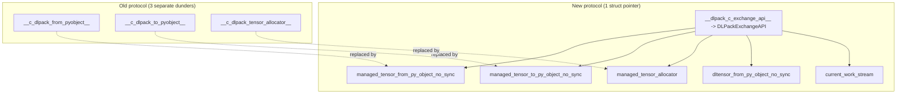

---
scope:
  - "0012-python-bindings"
  - "0014-stream-and-env-context"
---
# ADR-0015: Consolidate DLPack Dunders into Unified DLPackExchangeAPI Struct

**TL;DR**: Replace three separate class-attribute function pointers (`__c_dlpack_from_pyobject__`, `__c_dlpack_to_pyobject__`, `__c_dlpack_tensor_allocator__`) with a single `__dlpack_c_exchange_api__` attribute (renamed from `__dlpack_c_exchange_api__` in 5393647) pointing to a versioned `DLPackExchangeAPI` struct.

## Context

- The original DLPack C fast-path protocol used three separate integer attributes on tensor classes (e.g., `torch.Tensor`), each holding a function pointer cast to `int`. This was fragile: adding new capabilities required adding new dunder attributes, and stream querying was entangled with tensor export.
- DLPack proposal #175 introduced a unified struct-based API pattern.
- Stream querying (`env_stream`) was embedded in the export function's return values, making it impossible to query the stream independently of tensor conversion.

Usecases:
- Framework (torch, JAX, CuPy) tensor exchange at C speed without Python overhead
- Adding new capabilities (non-owning DLTensor, explicit stream query) without new dunders
- API versioning and evolution via chained `prev_api` headers

Design Decisions:
- Consolidate all DLPack exchange function pointers into a single `DLPackExchangeAPI` struct with a versioned header.
- Rename all functions to `_no_sync` variants to make explicit that callers handle stream synchronization.
- Extract stream querying into a dedicated `current_work_stream` function pointer on the struct.
- Add `dltensor_from_py_object_no_sync` for non-owning DLTensor access (avoids `DLManagedTensorVersioned` overhead).
- Each struct field is nullable (NULL means capability not provided), enabling incremental adoption.

**Alternative: Keep separate dunders, add new ones as needed**
- Pros: simpler per-attribute, no struct management
- Cons: unbounded growth of dunder attributes, no versioning, cannot add capabilities atomically

**Alternative: Nested dict/protocol object instead of C struct**
- Pros: more Pythonic, no raw pointer management
- Cons: per-access Python overhead defeats the purpose of the C fast-path (the entire point is zero-Python-overhead tensor exchange)

## Implementation Notes
- `DLPackExchangeAPIHeader` contains `version` (DLPackVersion) and `prev_api` pointer for linked-list chaining of future API revisions.
- `TVMFFIPyArgSetterFactory_` now checks `hasattr(arg_class, "__dlpack_c_exchange_api__")` (class-level, not instance-level).
- `TVMFFIPyCallContext` stores a single `dlpack_c_exchange_api: Ptr[DLPackExchangeAPI]` field instead of the previous 2-3 fields.
- The `_no_sync` naming convention signals that synchronization is the caller's responsibility via the separate `current_work_stream` function.
- Torch implementation: `TorchDLPackExchangeAPI` is a singleton struct populated either via prebuilt `torch_c_dlpack_ext` addon package (AOT path, priority) or JIT-compiled C++ via subprocess build in `_optional_torch_c_dlpack.py` (fallback). See [0017-torch-dlpack-addon.md](../designs/0017-torch-dlpack-addon.md).
- The exchange API is used bidirectionally: in the argument setter path (producer: `TVMFFIPyArgSetterDLPackExchangeAPI_`) and in the `from_dlpack` consumer path (`_from_dlpack_exchange_api()`, highest priority in `_from_dlpack_universal()`).
- Bool dtype uses `kDLBool` (code=6, bits=8) per DLPack spec, not the legacy `kDLUInt` (code=1, bits=1). Aligned in ae346ec.
- Transport type upgrade (7f3bb77): `__dlpack_c_exchange_api__` changed from `int` (raw pointer cast) to `PyCapsule` with name `"dlpack_exchange_api"`. Backward compatible: Cython consumer `_get_dlpack_exchange_api()` accepts both `int` (legacy) and `PyCapsule` (new). Loader auto-upgrades `int` to `PyCapsule` when detected from older AOT addons.

## Related Design Docs
- [0012-python-bindings.md](../designs/0012-python-bindings.md) -- DLPack fast-path section, from_dlpack consumer path
- [0014-stream-and-env-context.md](../designs/0014-stream-and-env-context.md) -- stream query now via struct
- [0017-torch-dlpack-addon.md](../designs/0017-torch-dlpack-addon.md) -- AOT/JIT addon infrastructure
