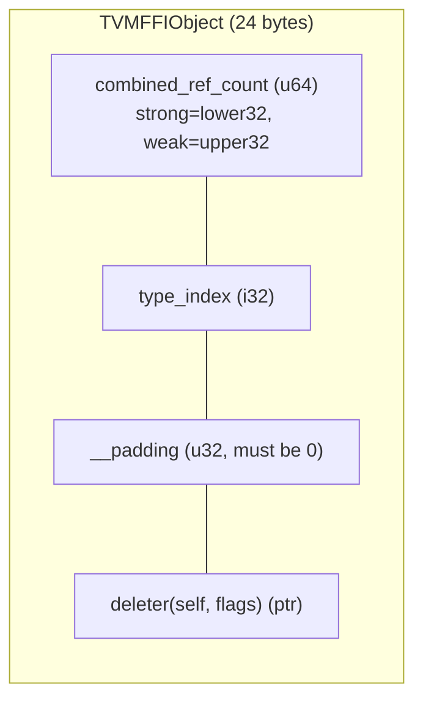

---
scope:
  - "0003-object-system"
  - "0001-c-abi-layer"
  - "0007-memory-allocation"
---
# Weak Reference Counting ABI Design

**TL;DR**: The decision to add weak reference counting to `TVMFFIObject` using a combined `uint64_t combined_ref_count` (u32 strong in lower bits + u32 weak in upper bits, 24 bytes total), with a bitmask-dispatched deleter separating destruction from deallocation. The layout evolved from separate fields through three commits (ca9c3d1 -> 13436f0 -> 43d13e8).

## Context
- Future cycle-breaking patterns (e.g., parent-child object graphs with back-references) require a way to hold non-owning references that can detect when the target has been destroyed, without preventing memory reclamation indefinitely.
- `std::weak_ptr` provides this semantic in standard C++, but the TVM FFI uses intrusive reference counting with a C ABI -- `std::weak_ptr` cannot cross that boundary.
- The existing `TVMFFIObject` header was 16 bytes with a single `int32_t ref_counter`. Adding weak counting requires expanding the header.

Usecases:
- Cycle-breaking in object graphs (e.g., IR nodes with parent pointers)
- Observer patterns where an object watches another without preventing its destruction
- Cache entries that should not keep objects alive

Design Decisions:
- **Combined u64 refcount**: A single `uint64_t combined_ref_count` stores strong count in the lower 32 bits and weak count in the upper 32 bits. This evolved through three stages: (1) ca9c3d1 added separate `int32_t ref_counter` + `uint32_t weak_ref_count` (16->24 bytes), (2) 13436f0 reordered to `uint32_t strong_ref_count` + `uint32_t weak_ref_count` packed at offset 0, (3) 43d13e8 merged both into `uint64_t combined_ref_count`. The combined layout enables the DecRef fast path to check both counters with a single atomic: `fetch_sub(kCombinedRefCountStrongOne)` followed by comparison against `kCombinedRefCountBothOne`.
- **Bitmask-dispatched deleter**: The deleter signature is `void(*)(TVMFFIObject*, int flags)` with `TVMFFIObjectDeleterFlagBitMask`. This separates object destruction (`kStrong`) from memory deallocation (`kWeak`). The common case (`kBoth`) handles both in one call when no outstanding weak references exist.
- **Initial combined_ref_count = kCombinedRefCountBothOne**: The "strong reference group" counts as one weak reference. When the last strong reference dies, this implicit weak reference is decremented. This avoids a separate check for "are there any weak refs?" -- the weak portion is always >= 1 while any strong refs exist.
- **CAS-based weak-to-strong promotion**: `WeakObjectPtr::lock()` uses a compare-and-swap loop on `combined_ref_count`, atomically incrementing the strong portion only if currently > 0. This is lock-free and avoids the ABA problem because strong counts are monotonically non-increasing once the object enters the destruction path.

## Implementation Notes
- `TVMFFIObjectFree` is renamed to `TVMFFIObjectDecRef` (symmetric with new `TVMFFIObjectIncRef`)
- `FObjectDeleter` typedef updated: `void (*)(void* obj, int flags)` (changed from `TVMFFIObject*` to `void*` in commit 24125d0 for Doxygen compatibility)
- Cython bindings (`base.pxi`, `object.pxi`, `dtype.pxi`) updated to use `TVMFFIObjectDecRef`
- `ObjAllocatorBase::make_object` initializes `combined_ref_count = kCombinedRefCountBothOne` and `__padding = 0`
- `WeakObjectPtr<T>` mirrors `std::weak_ptr` API: `lock()`, `expired()`, `use_count()`, `reset()`

**Alternatives rejected**:
- **Separate weak control block** (like `std::shared_ptr`): Would require an extra heap allocation per object, increasing memory overhead and cache pressure. The intrusive approach adds only 8 bytes to the existing header (16 -> 24).
- **Single-counter with destroy-on-zero, dealloc-on-last-weak**: More complex bookkeeping without the clean bitmask dispatch. The flag-based approach lets each allocator implement its own destruction/deallocation split cleanly.
- **u32 strong + u32 weak as separate fields**: This was the interim design (13436f0) before the combined u64 layout. Two separate atomics in DecRef required an extra atomic read of the weak counter on the strong-reaches-zero path. The combined layout eliminates this overhead. The u32 strong limit (2^32) is accepted as sufficient in practice.

## Related Design Docs
- [0003-object-system.md](../designs/0003-object-system.md) -- Object lifecycle, ObjectPtr, WeakObjectPtr
- [0001-c-abi-layer.md](../designs/0001-c-abi-layer.md) -- TVMFFIObject struct layout, deleter signature
- [0007-memory-allocation.md](../designs/0007-memory-allocation.md) -- FObjectDeleter, allocator header init, Deleter_ flag dispatch
