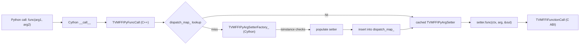

---
scope:
  - "0015-python-ffi-call-dispatch"
  - "0014-python-package"
---
# Type-Cached FFI Dispatch: Replace isinstance Chain with Per-Type Hash Map

**TL;DR**: The decision to replace the linear `isinstance` chain in `make_args()` with a C++ thread-local `PyTypeObject* -> TVMFFIPyArgSetter` hash map (`TVMFFIPyCallManager.dispatch_map_`), trading thread-local memory for O(1) argument conversion after the first call per type.

## Context
- The original `make_args()` function in Cython tested each argument against all known types in a linear isinstance chain. For n registered types, each argument conversion was O(n).
- Profiling showed that for hot FFI call paths (e.g., calling CUDA kernels repeatedly), the isinstance chain was the dominant overhead on the Python side.
- The dispatch decision for a given Python type is stable: once determined, the same setter function applies to all future values of the same type. This makes caching the natural optimization.
- Thread safety is a constraint: the cache must not require locking on the hot path.

Usecases:
- Calling CUDA kernels millions of times from Python with the same argument types (e.g., torch.Tensor, int, str). After the first call, all subsequent calls should have near-zero Python-side dispatch overhead.
- Passing heterogeneous argument types where the isinstance chain's position-sensitivity caused some types (e.g., those checked late) to be disproportionately slow.

Design Decisions:
- **Thread-local hash map**: Each thread maintains its own `std::unordered_map<PyTypeObject*, TVMFFIPyArgSetter>`. No locks on the hot path. The trade-off is per-thread memory usage proportional to the number of distinct Python types encountered by that thread.
- **Factory function on cache miss**: `TVMFFIPyArgSetterFactory_` (a Cython function) is called once per new type. It performs the isinstance-style checks, populates a `TVMFFIPyArgSetter` struct, and returns. The factory is the only place that runs the isinstance chain.
- **Type keep-alive for cache safety**: Rather than relying on the assumption that Python types are effectively immortal (which was proven incorrect for local/dynamic types), a `_DISPATCH_TYPE_KEEP_ALIVE` set is maintained that holds strong references to every type passed through the factory. This ensures `PyTypeObject*` pointer stability for the `dispatch_map_` cache. The set grows monotonically and is bounded by the number of distinct Python types ever used as FFI arguments (cfff30b).
- **C++ implementation**: The hash map and dispatch loop are in C++ (`tvm_ffi_python_helpers.h`), not Cython. This enables the GIL release boundary to be placed around the entire dispatch loop, and avoids Cython overhead for the inner loop.

Alternatives considered:
- **Keep isinstance chain, reorder by frequency**: Could move the most common types (int, float, Tensor) to the front. Rejected because even with optimal ordering, O(n) checks per argument remain, and the ordering is workload-dependent. The cache provides O(1) regardless of ordering.
- **Python-level type dispatch (singledispatch or dict)**: Use `functools.singledispatch` or a Python `dict[type, callable]` for dispatch. Rejected because: (1) Python dict lookup is slower than C++ `unordered_map` lookup (Python object protocol overhead), (2) still requires holding the GIL during dispatch, (3) cannot be integrated with the C++ GIL release boundary as cleanly.
- **Cython fused types or static dispatch**: Use Cython `fused` types for compile-time dispatch. Rejected because the set of argument types is open-ended (user-defined types, third-party tensor types) and cannot be enumerated at compile time.

## Implementation Notes
- The dispatch map is `std::unordered_map<PyTypeObject*, TVMFFIPyArgSetter>` stored in the thread-local `TVMFFIPyCallManager` singleton (accessed via `TVMFFIPyCallManager::ThreadLocal()`).
- Each `TVMFFIPyArgSetter` is a 40-byte struct containing a function pointer, and three optional DLPack speed-converter function pointers. It is copied by value into the map.
- The `SetArgument` method in `TVMFFIPyCallManager` performs the lookup: `auto it = dispatch_map_.find(Py_TYPE(arg))`. On miss, it calls the factory and inserts the result.
- Memory overhead: approximately `sizeof(entry) * num_unique_types_per_thread`. For typical workloads (< 50 types), this is a few KB per thread.
- The factory function (`TVMFFIPyArgSetterFactory_`) is Cython code that runs with the GIL held. The key insight is that it runs at most once per type per thread, amortizing the Python-level isinstance overhead.

## Related Design Docs
- [0015-python-ffi-call-dispatch.md](../designs/0015-python-ffi-call-dispatch.md) -- Full design of the dispatch system
- [0014-python-package.md](../designs/0014-python-package.md) -- Python package Cython layer
