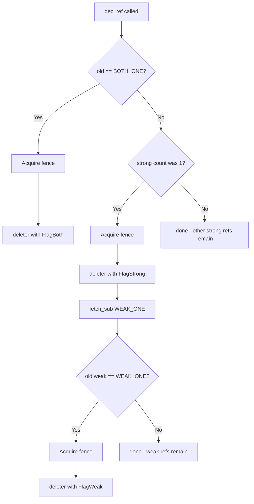

---
scope:
  - "0019-rust-bindings"
  - "0001-c-abi-layer"
---
# Native Rust Refcounting (No C API Calls for inc_ref/dec_ref)

**TL;DR**
- The Rust binding reimplements `inc_ref`/`dec_ref` in pure Rust (`object::unsafe_` module) rather than calling `TVMFFIObjectIncRef`/`TVMFFIObjectDecRef` through the C API.
- This eliminates FFI call overhead for the most frequent operation in the system, while using identical atomic ordering to the C++ implementation.

## Context
Reference counting is the single most frequent operation in the TVM FFI runtime — every `ObjectArc::clone()` calls `inc_ref`, every `ObjectArc::drop()` calls `dec_ref`. In a typical workload, these operations vastly outnumber function calls or object creation.

Usecases:
- Passing `ObjectArc` values through function call chains involves many clone/drop cycles per call (argument packing, result extraction, temporary refs). Each cycle would be an FFI boundary crossing if using the C API.
- Tight loops manipulating FFI objects (e.g., iterating over arrays, building computation graphs) generate extremely high refcount traffic.

Design Decisions:
- **Reimplement `inc_ref`/`dec_ref` in pure Rust** using `std::sync::atomic` operations with the same memory ordering as the C++ implementation. The refcount layout (`combined_ref_count: AtomicU64`, lower 32 bits = strong, upper 32 bits = weak) is part of the stable C ABI and will not change.

- The alternative — calling `TVMFFIObjectIncRef`/`TVMFFIObjectDecRef` — would require an `extern "C"` call for each operation, adding at minimum the cost of a function pointer indirection plus the inability to inline the fast path.

## Implementation Notes
- **Atomic ordering**: `inc_ref` uses `fetch_add(1, Relaxed)`. `dec_ref` uses `fetch_sub(STRONG_ONE, Relaxed)` followed by `fence(Acquire)` before any deleter call. This matches the C++ implementation exactly.
- **Three-phase dec_ref**: Fast path (last strong + last weak = `BOTH_ONE`), slow path (last strong, weak remains), and no-op path (other strong refs remain). The fast path is the common case and is branchless.
- **Deleter flags**: The deleter callback receives `FlagBoth` (destroy + free), `FlagStrong` (destroy only), or `FlagWeak` (free only), enabling two-phase destruction when weak references exist.
- Key signature: `pub unsafe fn inc_ref(handle: *mut TVMFFIObject)` and `pub unsafe fn dec_ref(handle: *mut TVMFFIObject)` in `tvm_ffi::object::unsafe_`.

Evidence: `2025-10-01-09477ce1.md` (09477ce) — `object.rs::unsafe_` module with full inc_ref/dec_ref implementations using identical atomic ordering to C++.

## Related Design Docs
- [0019-rust-bindings.md](../designs/0019-rust-bindings.md) — Rust binding architecture where this is implemented
- [0001-c-abi-layer.md](../designs/0001-c-abi-layer.md) — Defines the `TVMFFIObject` refcount layout and deleter protocol
- [ADR 0015](../ADRs/0015-weak-rc-abi-design.md) — Weak RC ABI design that defines the combined_ref_count layout
