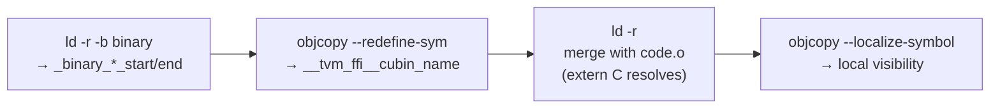

---
scope:
  - "0021-cubin-launcher"
  - "0013-module-system"
---
# Use `__tvm_ffi__cubin_<name>` Prefix for Embedded CUBIN Symbols with Post-Merge Localization

**TL;DR**: Embedded CUBIN binary data uses the `__tvm_ffi__cubin_<name>` symbol naming convention (double-underscore internal prefix) and symbols are localized via `objcopy --localize-symbol` after merging with the C++ object file to prevent cross-library conflicts.

## Context
When embedding CUBIN binary data into shared libraries via `ld -r -b binary`, the linker generates default symbols like `_binary_<filename>_start` and `_binary_<filename>_end`. These must be renamed to a project-specific convention and managed carefully to avoid:
- **Cross-library symbol collision**: If two shared libraries embed CUBINs with the same name, their symbols would conflict at link or load time.
- **Namespace inconsistency**: The project already has a two-tier symbol namespace: `__tvm_ffi_<name>` for user-exported functions, `__tvm_ffi__<name>` (double underscore) for internal well-known symbols.
- **Accidental extern visibility**: CUBIN data symbols should not be exported from the shared library's dynamic symbol table.

Usecases:
- Multiple shared libraries each embedding their own CUBIN kernels, loaded into the same process
- The `load_inline` workflow where each call produces an independent shared library with its own CUBIN

Design Decisions:
- **Symbol prefix `__tvm_ffi__cubin_<name>`**: Uses the double-underscore internal convention (matching `__tvm_ffi__library_bin`, `__tvm_ffi__library_ctx`, `__tvm_ffi__metadata_`). The `cubin_` infix distinguishes from other internal symbol categories.
- **Post-merge localization**: After `ld -r` merges the CUBIN object with the C++ object, `objcopy --localize-symbol` makes the CUBIN symbols local (file-scope). This means:
  - The C++ code's `extern "C"` declarations resolve during the relocatable link (`ld -r`), before localization.
  - After localization, the symbols are not visible to other object files or shared libraries, preventing cross-library conflicts.
  - The symbols remain accessible within the same translation unit via the already-resolved references.
- **Renaming via `objcopy --redefine-sym`**: The `ld`-generated `_binary_embedded_<name>_cubin_start` is renamed to `__tvm_ffi__cubin_<name>`, and `_binary_embedded_<name>_cubin_end` to `__tvm_ffi__cubin_<name>_end`.
- **`.note.GNU-stack` section added**: Marks the embedded object as having a non-executable stack, preventing linker warnings on hardened systems.

## Implementation Notes
- The embedding pipeline is implemented in `tvm_ffi.utils.embed_cubin` (Python CLI) and invoked by both `tvm_ffi_embed_cubin` (CMake) and the `load_inline` ninja build.
- Embedding pipeline steps: (1) `ld -r -b binary` to create CUBIN object, (2) `objcopy --add-section .note.GNU-stack`, (3) `objcopy --redefine-sym` to rename, (4) `ld -r` to merge with C++ object, (5) `objcopy --localize-symbol` to localize.
- The `.rodata` section flag (`--rename-section .data=.rodata,...`) ensures CUBIN data is placed in read-only memory.
- On the C++ side, `TVM_FFI_EMBED_CUBIN(name)` declares `extern "C" const char __tvm_ffi__cubin_<name>[]` and wraps it in an anonymous-namespace singleton.
- Evidence: d49effdb (initial embedding pipeline and macro design)

## Related Design Docs
- [0021-cubin-launcher.md](../designs/0021-cubin-launcher.md) -- Full CUBIN launcher design
- [0013-module-system.md](../designs/0013-module-system.md) -- Two-tier symbol namespace convention (`__tvm_ffi_` vs `__tvm_ffi__`)
