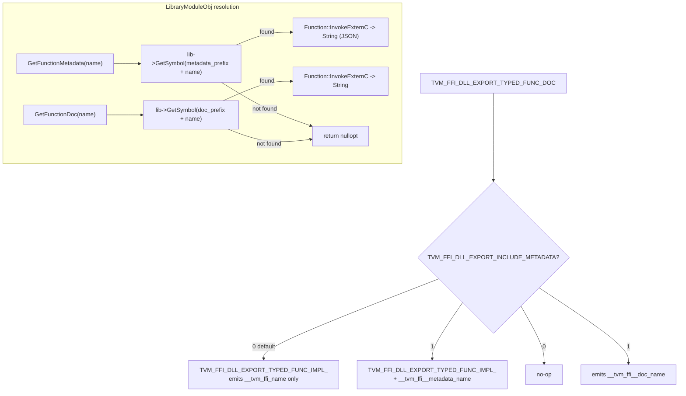

---
scope:
  - "0004-function-system"
  - "0013-module-system"
---
# Opt-in Metadata and Documentation Export for DLL Functions

**TL;DR**: Metadata (type schema) and documentation symbols are only emitted when `TVM_FFI_DLL_EXPORT_INCLUDE_METADATA=1` is set at compile time. Documentation is exported via a separate symbol from metadata, allowing independent stripping.

## Context
- DLL-exported FFI functions (`TVM_FFI_DLL_EXPORT_TYPED_FUNC`) need type schema information and documentation for tooling (stub generators, documentation extractors, Python introspection).
- Emitting metadata symbols unconditionally increases binary size (each metadata symbol includes `std::ostringstream`, JSON formatting, and `EscapeString` calls) and compilation time.
- Documentation strings can be large and are only needed by development tools, not production deployments.

Usecases:
- **Stub generation**: Load a module, iterate exported functions, retrieve type schemas, and generate Python `.pyi` stubs or documentation.
- **Runtime introspection**: `Module.get_function_metadata("name")` returns `{"type_schema": "..."}` enabling Python tools to validate call signatures at runtime.
- **Documentation tools**: `Module.get_function_doc("name")` retrieves embedded docstrings for API documentation generators.

Design Decisions:
- **Opt-in via preprocessor flag**: `TVM_FFI_DLL_EXPORT_INCLUDE_METADATA` defaults to 0. When 1, `TVM_FFI_DLL_EXPORT_TYPED_FUNC` emits a companion `__tvm_ffi__metadata_<name>` symbol, and `TVM_FFI_DLL_EXPORT_TYPED_FUNC_DOC` becomes active.
- **Separate metadata and doc symbols**: Metadata uses `__tvm_ffi__metadata_<name>` prefix; documentation uses `__tvm_ffi__doc_<name>` prefix. Both follow the internal double-underscore convention (`__tvm_ffi__`). This separation allows stripping docs independently from type schemas.
- **Same calling convention**: Both metadata and doc symbols use the standard `TVMFFISafeCallType` signature `(void*, TVMFFIAny*, int32_t, TVMFFIAny*) -> int`, returning a `String` result. This enables resolution and invocation via `Function::InvokeExternC` without special-casing.
- **JSON format for metadata**: Metadata returns `{"type_schema": "<escaped-json>"}` where the inner value is `FuncInfo::TypeSchema()`. This is extensible -- future keys can be added without breaking consumers.

## Implementation Notes
- `TVM_FFI_DLL_EXPORT_TYPED_FUNC_IMPL_` is an internal macro factored out of the original `TVM_FFI_DLL_EXPORT_TYPED_FUNC` to avoid code duplication between the metadata-on and metadata-off paths.
- `LibraryModuleObj` overrides `GetFunctionMetadata` and `GetFunctionDoc` to resolve the companion symbols via `lib_->GetSymbol` (without the `__tvm_ffi_` user prefix -- metadata/doc symbols use the raw `__tvm_ffi__metadata_`/`__tvm_ffi__doc_` internal prefix).
- Python `Module.get_function_metadata` parses the returned JSON string via `json.loads`; `Module.get_function_doc` returns the raw string.
- `build_inline` / `load_inline` in `tvm_ffi.cpp.extension` now generates `TVM_FFI_DLL_EXPORT_TYPED_FUNC_DOC` calls when a non-empty docstring is provided in the `functions` mapping, with C++ string literal escaping via `_escape_cpp_string_literal`.
- Metadata export can be enabled for inline modules by passing `extra_cflags=["-DTVM_FFI_DLL_EXPORT_INCLUDE_METADATA=1"]`.

## Related Design Docs
- [0004-function-system.md](../designs/0004-function-system.md) -- TVM_FFI_DLL_EXPORT_TYPED_FUNC macro, Function::InvokeExternC
- [0013-module-system.md](../designs/0013-module-system.md) -- ModuleObj::GetFunctionMetadata/GetFunctionDoc virtual interface, LibraryModuleObj overrides, symbol prefix constants
