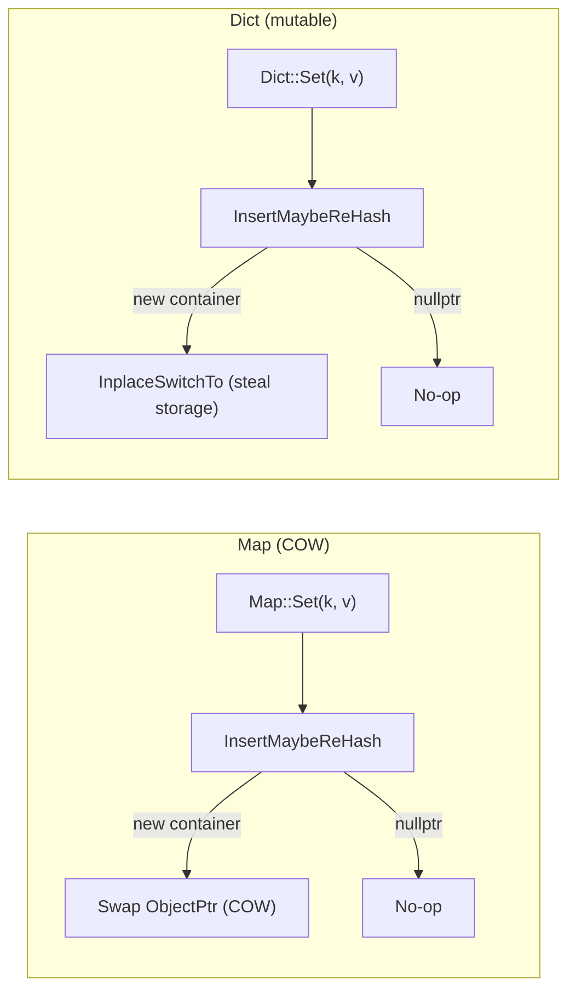

---
scope:
  - "0008-containers"
---
# Introduce Dict as Mutable Map Sharing MapBaseObj with Immutable Map

**TL;DR**: The decision to introduce `Dict<K,V>` / `DictObj` as a mutable dictionary container that shares the `MapBaseObj` base class with immutable `Map<K,V>`, using `InplaceSwitchTo` for rehash instead of COW, and enabling cross-conversion between Map and Dict via `MapTypeTraitsBase`.

## Context
- The FFI already had `Map<K,V>` (immutable, COW) and `List<T>` (mutable sequence), but lacked a mutable map container. Users needing in-place map mutation had to repeatedly create new `Map` instances, which is both inefficient and semantically misleading.
- The `MapBaseObj` hierarchy (extracted in 5a6b211) made it possible to share all hash-map machinery (`SmallMapBaseObj`, `DenseMapBaseObj`, `InsertMaybeReHash`, `CreateFromRange`, etc.) between distinct FFI type indices without code duplication.
- The key design tension: how to handle rehashing in a mutable container where multiple handles share the same `DictObj` identity. COW (as used by `Map`) changes the `ObjectPtr`, breaking reference identity.

Usecases:
- Imperative Python code that builds up a mapping incrementally: `d = Dict(); d["a"] = 1; d["b"] = 2`
- Shared-reference semantics where mutations are visible to all holders (e.g., passing a Dict into a function that populates it)
- Cross-language mutable mapping: C++ code can create a Dict, pass it to Python, and Python mutations are visible back in C++

Design Decisions:
- **`DictObj` inherits `MapBaseObj`** with type index `kTVMFFIDict = 76` and type key `"ffi.Dict"`. `sizeof(DictObj) == sizeof(MapBaseObj)` -- no additional fields.
- **`InplaceSwitchTo` for rehash**: When `InsertMaybeReHash<DictObj>` returns a new container (rehash occurred), `Dict::Set` calls `MapBaseObj::InplaceSwitchTo(new_container)` to steal the new container's storage into the existing `DictObj`. This preserves `ObjectPtr` identity across rehashes, so all handles continue pointing to the same object.
- **`InsertMaybeReHash` returns `ObjectPtr<Object>`** (changed from `void` + pointer-to-pointer). This lets callers decide how to apply the result: `Map` uses it for COW swap; `Dict` uses `InplaceSwitchTo`.
- **`MapTypeTraitsBase` CRTP** for shared TypeTraits: `TypeTraits<Map<K,V>>` accepts `kTVMFFIDict`, and `TypeTraits<Dict<K,V>>` accepts `kTVMFFIMap`. This enables seamless cross-conversion at the FFI boundary.
- **Python `Dict` as `MutableMapping`**: Full `__setitem__`, `__delitem__`, `pop`, `clear`, `update`, sentinel-based `get`.

## Implementation Notes
- `DictObj` body is nearly empty -- just type index, type key, and friend declarations. All operations are inherited from `MapBaseObj`.
- `InplaceSwitchTo` steals `data_`, `size_`, `slots_`, `data_deleter_` and (for DenseMapBaseObj) the iteration list head/tail from the other container, then resets the other container to empty state.
- Nine FFI global functions registered for Dict operations: `ffi.Dict`, `ffi.DictSize`, `ffi.DictGetItem`, `ffi.DictSetItem`, `ffi.DictCount`, `ffi.DictErase`, `ffi.DictClear`, `ffi.DictForwardIterFunctor`, `ffi.DictGetItemOrMissing`.
- Serialization (`extra/serialization.cc`), deep copy (`extra/deep_copy.cc`), repr print (`extra/repr_print.cc`), and structural equal/hash all updated to handle `kTVMFFIDict`.

### Alternatives considered

**Separate mutable map implementation (not sharing MapBaseObj)**:
- Would avoid the `InplaceSwitchTo` complexity.
- Rejected because it would duplicate all hash-map machinery (small map, dense map, rehash logic, iterators), violating DRY. The `MapBaseObj` extraction specifically enabled this sharing.

**COW-based Dict (same as Map but with mutable API)**:
- Would simplify the implementation (no `InplaceSwitchTo` needed).
- Rejected because COW breaks shared-reference semantics: `Dict d2 = d1; d2.Set(k, v)` would silently diverge `d1` and `d2`, which is confusing for a container intended to be mutable. The analogy to `List<T>` (which also mutates in place) was the deciding factor.

## Related Design Docs
- [0008-containers.md](../designs/0008-containers.md) -- Container design doc (updated with Dict section)
- [0012-msb-tag-map-layout.md](0012-msb-tag-map-layout.md) -- MSB tag layout used by MapBaseObj
- [0006-container-data-pointer.md](0006-container-data-pointer.md) -- data_/data_deleter_ on MapBaseObj
