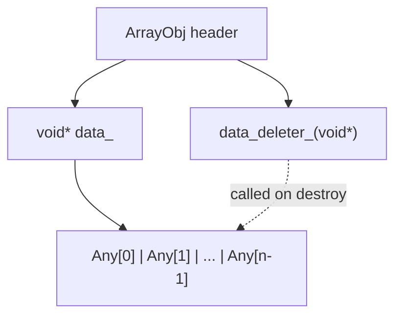

---
scope:
  - ".knowledge/designs/containers.md"
---
# ADR-007: Container Data Pointer Indirection and Cross-Library Deleter

**TL;DR**: Add explicit `void* data_` pointer and `void (*data_deleter_)(void*)` to `ArrayObj` and `MapObj`, decoupling element storage from the object header for ABI stability and cross-shared-library deallocation safety.

## Context
In the original design, `ArrayObj` and `MapObj` accessed their element storage via `InplaceArrayBase::AddressOf(0)`, tightly coupling the data region to the object header. This had two problems:

Usecases:
- Cross-shared-library usage: when a container is allocated in one shared library (e.g., a kernel module) and used in another (the main runtime), the data must be freed by the library that allocated it. Without a deleter, `delete[]` in the wrong library causes heap corruption when different libraries use different allocators.
- Future use cases: external buffers, data reallocation, and memory-mapped storage need the ability to decouple the data region from the object body.

Design Decisions:
- Add `void* data_` field to `ArrayObj` and `MapObj`. For inplace storage, `data_ = AddressOf(0)`.
- Add `void (*data_deleter_)(void*) = nullptr` callback. When non-null, called in the destructor to free the data.
- `SmallMapObj` uses `KVRawStorageType = struct { TVMFFIAny first; TVMFFIAny second; }` as the `InplaceArrayBase` template argument (instead of `KVType = pair<Any, Any>`) to prevent double destruction.
- `DenseMapObj::BlockDeleter` is a concrete `data_deleter_` that calls `delete[] static_cast<Block*>(data)`.
- `DenseMapObj` hash probing changes from `& (n_slots - 1)` to `% n_slots` (modulo), removing the implicit power-of-two slot count requirement.

## Alternatives

### A: Keep implicit inplace addressing
- Description: Continue computing data addresses from `InplaceArrayBase` without an explicit pointer.
- Pros: No extra field overhead (saves 16 bytes per container: 8 for pointer, 8 for deleter).
- Cons: Cannot support external/reallocated buffers; no way to ensure cross-library deallocation safety; every data access must go through the CRTP base class.
- Why rejected: Cross-shared-library heap corruption is a real production issue. The 16-byte overhead per container instance is negligible compared to the data it holds.

### B: Use std::function or virtual deleter
- Description: Store the deleter as `std::function<void(void*)>` or behind a virtual call.
- Pros: More flexible deleter (can capture state); familiar C++ pattern.
- Cons: `std::function` is 32+ bytes; virtual call adds vtable overhead; function pointer is the minimal C-compatible representation (8 bytes); the deleter never needs captured state -- it only needs the data pointer.
- Why rejected: The deleter is a simple free/delete operation. A raw function pointer is sufficient, C-compatible, and minimal in size.

## Implementation Notes
- `ArrayObj` destructor explicitly destroys each `Any` element via placement `~Any()` and then calls `data_deleter_` if non-null. This replaces reliance on `InplaceArrayBase` destruction.
- `SmallMapObj` destructor manually destroys each `KVType` entry's `first` and `second` `Any` fields, then calls `data_deleter_`. The `KVRawStorageType` as `InplaceArrayBase` template argument ensures the base class does not also attempt destruction.
- `ArrayObj::at()` now returns `const Any&` (reference) instead of `const Any` (value copy), improving performance for callers that were binding the result to a reference.
- `Tuple` construction simplified to delegate to `ArrayObj::Empty(sizeof...(Types))`.

## Related Design Docs
- `.knowledge/designs/containers.md` -- ArrayObj/MapObj data layout documentation
- `.knowledge/ADRs/004-insertion-order-map.md` -- Map insertion-order decision
