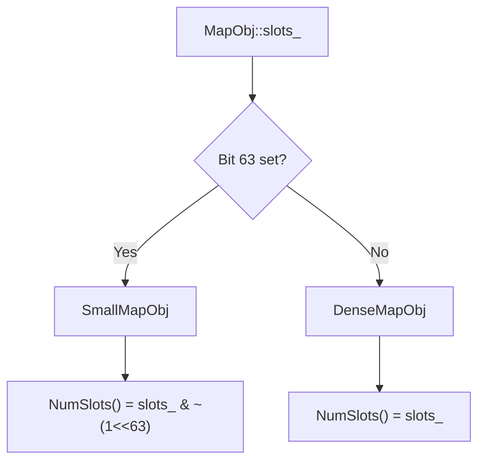

---
scope:
  - ".knowledge/designs/containers.md"
---
# ADR-010: MSB Tag in MapObj::slots_ for SmallMap/DenseMap Dispatch

**TL;DR**: Use bit 63 (MSB) of `MapObj::slots_` as a structural tag to distinguish SmallMap from DenseMap layout, replacing the previous value-range heuristic (`slots_ <= kMaxSize`).

## Context
`MapObj` uses a two-tier storage strategy: `SmallMapObj` for maps with up to 8 entries (linear scan) and `DenseMapObj` for larger maps (open-addressing hash table). All dispatch sites (`TVM_FFI_DISPATCH_MAP`, `InsertMaybeReHash`, `CopyFrom`, probing, load-factor checks) must determine which layout is in use.

Previously, the dispatch heuristic compared the raw `slots_` value against `SmallMapObj::kMaxSize` (8). This coupled the small/dense boundary to the slot count value, meaning any change to `kMaxSize` would require updating every dispatch site. It also made the invariant fragile: a DenseMap with exactly 8 slots would be misidentified as a SmallMap.

Usecases:
- Runtime dispatch at every Map operation (lookup, insert, iterate, copy).
- Future flexibility to change `kMaxSize` without cascading dispatch changes.

Design Decisions:
- Reserve bit 63 of `slots_` (`kSmallTagMask = 1ULL << 63`) as a SmallMap indicator. SmallMap instances always have MSB set; DenseMap instances always have MSB clear.
- Provide accessor API: `MapObj::IsSmallMap()` for dispatch, per-subclass `NumSlots()` for slot count (masks off tag), private `SetSlotsAnd{Small,Dense}LayoutTag()` for construction.
- Replace all raw `slots_` comparisons with the tag-based API.

## Alternatives

### A: Separate `bool is_small_` field
- Description: Add a dedicated `bool is_small_` field to `MapObj`.
- Pros: Completely explicit; no bit manipulation; readable.
- Cons: Adds 1 byte (+ 7 bytes padding) to every Map instance. With potentially millions of map objects in a large IR, the memory overhead is significant. Also changes the `MapObj` ABI layout (field offsets shift), which is equally ABI-breaking as the tag approach but with a larger footprint.
- Why rejected: The MSB of a `uint64_t` slot count will never be set in practice (no map will have 2^63 slots), so the tag bit is free. A separate field wastes memory and provides no additional benefit.

### B: Virtual dispatch via `MapObj` subclass vtable
- Description: Make `MapObj::count()`, `MapObj::at()`, etc. virtual, dispatching to SmallMapObj/DenseMapObj overrides.
- Pros: Standard C++ polymorphism; no tag management.
- Cons: Adds a vtable pointer (8 bytes per Map object) and virtual call overhead on every Map operation. The FFI `MapObj` is a standard-layout type (`TVM_FFI_DECLARE_STATIC_OBJECT_INFO`) that deliberately avoids C++ virtual methods for C ABI compatibility. Virtual dispatch would break the standard-layout guarantee and C interop.
- Why rejected: ABI incompatibility, memory overhead, and performance regression on the hot path.

## Implementation Notes
- `kSmallTagMask = static_cast<uint64_t>(1) << 63` is defined as a `static constexpr` on `MapObj`.
- `IsSmallMap()` is a single bitwise-AND test: `(slots_ & kSmallTagMask) != 0`.
- `SmallMapObj::NumSlots()` masks: `slots_ & ~kSmallTagMask`.
- `DenseMapObj::NumSlots()` returns `slots_` directly (MSB is guaranteed clear by `SetSlotsAndDenseLayoutTag` which asserts MSB==0).
- The `InsertMaybeReHash` transition logic uses two-level dispatch: `IsSmallMap() -> (NumSlots() < kMaxSize, NumSlots() == kMaxSize)` vs DenseMap path.
- This is **ABI-breaking**: any binary compiled against the old `slots_` encoding will misinterpret the tag bit.

## Related Design Docs
- `.knowledge/designs/containers.md` -- MapObj layout and dispatch documentation
- `.knowledge/ADRs/007-container-data-indirection.md` -- data_/data_deleter_ pattern that this refines
