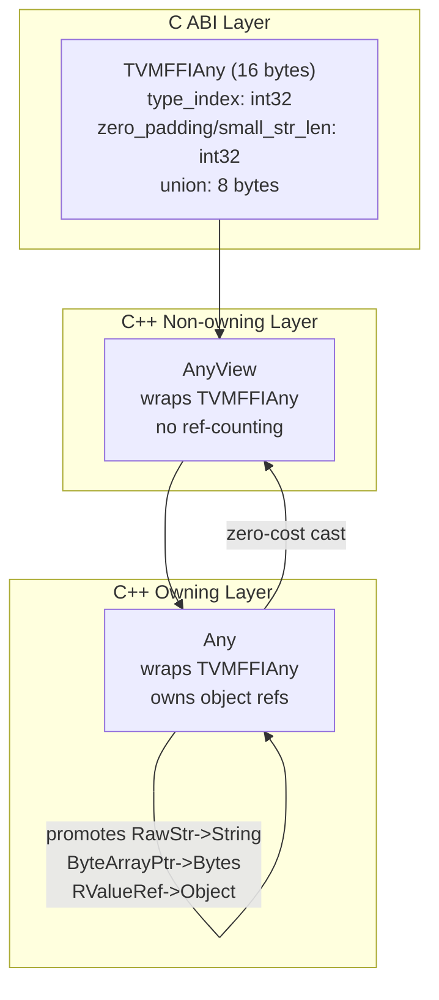

# Any/AnyView Value System

**TL;DR**.
- `Any` and `AnyView` are 16-byte tagged unions (`TVMFFIAny`) that serve as the universal wire format for all FFI calls -- every cross-language value passes through this representation.
- `AnyView` is a non-owning view (no ref-counting overhead); `Any` is an owning container that manages ref-counts for heap objects and promotes view-only types (RawStr, ByteArrayPtr) to owned objects.
- The type index partitions the value space into POD types `[0, 64)`, static objects `[64, 128)`, and dynamic objects `[128, +inf)`, enabling efficient dispatch without virtual calls.

## Problem Statement

### Background
- Cross-language FFI requires a single value representation that can carry integers, floats, pointers, strings, and heap objects uniformly.
- Prior approaches used boxed primitives (e.g., wrapping `int` in a heap object), wasting allocations for common POD values.
- Function arguments and return values cross C ABI boundaries, so the representation must be a plain C struct with no C++ features.

### Solution
- A 16-byte tagged union (`TVMFFIAny`) that stores POD values inline and ref-counted object pointers in the same slot.
- Two C++ wrappers: `AnyView` (non-owning, zero-cost) for function arguments, and `Any` (owning, ref-counted) for return values and storage.
- Type conversion is fully delegated to `TypeTraits<T>` specializations (see design record 0005), keeping the core value system independent of concrete types.

### Goals
- Store POD values (int, float, bool, DLDataType, DLDevice) without heap allocation.
- Store ref-counted objects without boxing overhead.
- Maintain a stable 16-byte C ABI layout across all platforms.
- Small-string optimization (SSO): strings up to 7 bytes stored inline in `TVMFFIAny` via `kTVMFFISmallStr`/`kTVMFFISmallBytes` type indices, avoiding heap allocation.

## Design

The value system forms a three-layer stack:



### Key Classes, Fields and Interfaces

```python
class TVMFFIAny:
    """C ABI 16-byte tagged union -- the wire format for all FFI values."""
    type_index: int32      # Invariant: determines which union member is active
    # union (4 bytes):
    zero_padding: uint32   # must be 0 for non-small-string types
    small_str_len: uint32  # length of small string (max 7); active when type_index is kTVMFFISmallStr/kTVMFFISmallBytes
    # union (8 bytes):
    #   v_int64: int64       -- integers, booleans
    #   v_float64: float64   -- floating-point
    #   v_ptr: void*         -- opaque pointers
    #   v_c_str: const char* -- raw C strings (view only)
    #   v_obj: TVMFFIObject* -- ref-counted heap objects
    #   v_dtype: DLDataType  -- data types
    #   v_device: DLDevice   -- devices
    #   v_bytes: char[8]     -- small inline string/bytes data (SSO)
    #   v_uint64: uint64     -- for hashing
    # Invariant: sizeof(TVMFFIAny) == 16
    # Invariant: for non-small-string types, zero_padding MUST be 0
    # Invariant: small_str_len <= 7
    # Invariant: type_index shares layout prefix with TVMFFIObject.type_index
    # Interacts with: TVMFFIObject (shared type_index offset enables layout aliasing)
    # Interacts with: BytesBaseCell (string.h) for dual small/large string representation

class AnyView:
    """Non-owning view of a type-erased value. No ref-counting."""
    data_: TVMFFIAny  # protected

    def type_index(self) -> int32: ...
    def reset(self) -> None: ...
        # Invariant: always sets v_int64=0 to clear union padding
    def as_(self, T: type) -> Optional[T]: ...
        # Interacts with: TypeTraits<T>.TryCastFromAnyView
    def cast(self, T: type) -> T: ...
        # Interacts with: TypeTraits<T>.TryCastFromAnyView; throws TypeError on failure
    # Invariant: sizeof(AnyView) == sizeof(TVMFFIAny) == 16
    # Extension: implicit constructors from any T where TypeTraits<T>.convert_enabled

class Any:
    """Owning type-erased value with ref-counting for objects."""
    data_: TVMFFIAny  # protected

    def type_index(self) -> int32: ...
    def reset(self) -> None: ...
        # Invariant: if type_index >= kTVMFFIStaticObjectBegin, calls DecRef before clearing
    def as_(self, T: type) -> Optional[T]: ...
    def cast(self) -> T: ...
        # When called on lvalue: view-convert via TryCastFromAnyView
        # When called on rvalue: try CheckAnyStrict + MoveFromAnyAfterCheck first
    def same_as(self, other: Any) -> bool: ...
        # Invariant: shallow comparison -- same type_index AND same zero_padding AND same v_int64
    # Invariant: sizeof(Any) == sizeof(TVMFFIAny) == 16
    # Invariant: converting AnyView -> Any promotes:
    #   RawStr -> String object (allocates)
    #   ByteArrayPtr -> Bytes object (allocates)
    #   RValueRef -> extracts object and sets source to nullptr
    # Extension: implicit constructors from any T where TypeTraits<T>.convert_enabled
    # Interacts with: TypeTraits<T>.MoveToAny, TypeTraits<T>.CheckAnyStrict

# InplaceConvertAnyViewToAny: the core promotion function
def InplaceConvertAnyViewToAny(data: TVMFFIAny_ptr) -> None:
    """Promotes a non-owning AnyView payload to an owning Any payload in-place."""
    # If type_index >= kTVMFFIStaticObjectBegin: IncRef the object pointer
    # If type_index == kTVMFFIRawStr: allocate String, replace pointer
    # If type_index == kTVMFFIByteArrayPtr: allocate Bytes, replace pointer
    # If type_index == kTVMFFIObjectRValueRef: move from source, set source to nullptr
    # Interacts with: ObjectUnsafe.IncRefObjectHandle, String ctor, Bytes ctor
```

### Type Index Ranges

| Range | Meaning | Examples |
|-------|---------|---------|
| `[0, 64)` | POD / special on-stack | None=0, Int=1, Bool=2, Float=3, OpaquePtr=4, DataType=5, Device=6, DLTensorPtr=7, RawStr=8, ByteArrayPtr=9, ObjectRValueRef=10, SmallStr=11, SmallBytes=12 |
| `[64, 128)` | Static objects (compile-time indices) | Object=64, Str=65, Bytes=66, Error=67, Function=68, Shape=69, Tensor=70, Array=71, Map=72, Module=73, OpaquePyObject=74 |
| `[128, +inf)` | Dynamic objects (runtime-allocated indices) | User-defined types |

### Contracts, Assumptions and Invariants
- **16-byte layout invariant**: `sizeof(TVMFFIAny) == sizeof(AnyView) == sizeof(Any) == 16`. This is enforced by `static_assert` and enables zero-cost reinterpret_cast between C and C++ layers.
- **RawStr never in Any**: `Any::type_index` is never `kTVMFFIRawStr` -- the AnyView->Any promotion converts it to an owned String object. This prevents dangling pointer bugs.
- **Padding zeroed on reset**: `AnyView::reset()` and `Any::reset()` always zero `v_int64` and `zero_padding` after setting `type_index = kTVMFFINone`, ensuring `same_as()` comparisons and hashing are well-defined.
- **Object ref-counting**: When `type_index >= kTVMFFIStaticObjectBegin`, `Any` calls `IncRef` on copy construction and `DecRef` on destruction/reset.
- **TVMFFIAny/TVMFFIObject layout sharing**: Both start with a `type_index: int32` field at the same offset. This allows the type_index to serve double duty -- identifying the value kind in `TVMFFIAny` and the object kind in `TVMFFIObject` header.

### Extension Points
- **Custom types via TypeTraits**: Any new C++ type can participate in the Any system by specializing `TypeTraits<T>` (see design record 0005).
- **Small-string optimization (active)**: Strings up to 7 bytes are stored inline in `TVMFFIAny.v_bytes` with length in `small_str_len`. Triggered by `kTVMFFISmallStr` (11) and `kTVMFFISmallBytes` (12) type indices. Backed by `BytesBaseCell` which manages the dual small/large representation transparently (see design record 0006).
- **Arena allocators**: The `InplaceConvertAnyViewToAny` function accepts an `extra_any_bytes` parameter for future extended Any objects.
- **Canonical downcast path**: `Any.cast<T>()` is the canonical downcast mechanism. The legacy `tvm::Downcast<T>` was removed from `ffi/cast.h`; `cast.h` now exports only `GetRef` and `GetObjectPtr`.

### Usage Examples

#### Storing and extracting POD values
**Context**: Basic type-erased value storage and retrieval in C++ code.
```cpp
// Store POD values -- no heap allocation
Any val = 42;                        // type_index = kTVMFFIInt, v_int64 = 42
Any fval = 3.14;                     // type_index = kTVMFFIFloat, v_float64 = 3.14
Any bval = true;                     // type_index = kTVMFFIBool, v_int64 = 1

// Extract values with type checking
int x = val.cast<int>();             // returns 42
double y = fval.cast<double>();      // returns 3.14
// Cross-type conversion supported by TypeTraits
double z = val.cast<double>();       // int -> double promotion, returns 42.0

// Store ref-counted object -- IncRef on copy, DecRef on destruction
Any str_val = String("hello");       // type_index = kTVMFFIStr, v_obj = String*
String s = str_val.cast<String>();   // extracts String (IncRef)
```

#### AnyView as zero-cost function arguments
**Context**: Passing values across FFI boundary without ref-counting overhead.
```cpp
void ProcessArgs(const AnyView* args, int32_t num_args, Any* result) {
    // AnyView does not IncRef -- zero overhead for function call arguments
    int a = args[0].cast<int>();
    int b = args[1].cast<int>();
    *result = a + b;  // Any assignment: stores int inline, no allocation
}
```

## Alternatives & Trade-offs
### Boxed primitives (rejected)
- Pros: Simpler implementation; uniform heap allocation for everything.
- Cons: Heap allocation for every int/float is expensive; defeats the purpose of FFI being a high-performance bridge.

### std::variant with fixed type list (rejected)
- Pros: Type-safe at compile time; no manual type tag management.
- Cons: Fixed type list cannot accommodate user-defined types at runtime; C++ only, no C ABI compatibility; larger than 16 bytes for many type combinations.

## Related Work
### Design Records
- `0002-object-system.md` -- Object/ObjectRef hierarchy that produces the object pointers stored in Any
- `0005-type-traits-protocol.md` -- TypeTraits<T> protocol that powers all Any <-> T conversions
- `0007-c-abi.md` -- The stable C ABI layer including TVMFFIAny struct definition

### Evidence Matrix
- 16-byte layout and type index ranges -> `commits/2025-05-06-7d34eb8abfe987bf0031e4d4ff479895d867a966.md` + `7d34eb8` + `TVMFFIAny`, `TVMFFITypeIndex`
- AnyView/Any ownership semantics -> `commits/2025-05-06-7d34eb8abfe987bf0031e4d4ff479895d867a966.md` + `7d34eb8` + `AnyView`, `Any`, `InplaceConvertAnyViewToAny`
- RawStr promotion invariant -> `commits/2025-05-06-7d34eb8abfe987bf0031e4d4ff479895d867a966.md` + `7d34eb8` + `InplaceConvertAnyViewToAny`
- SSO: zero_padding/small_str_len union, kTVMFFISmallStr/kTVMFFISmallBytes -> `commits/2025-08-04-49e2ed4a...md` + `49e2ed4` + `BytesBaseCell`, `kTVMFFISmallStr`
- Downcast removal, canonical Any.cast<T>() -> `commits/2025-08-08-4be1af73...md` + `4be1af7` + `Downcast` removed, `Any.cast<T>()`
- Static object index reorder (Shape=69, Tensor=70, Array=71, Map=72) -> `commits/2025-08-30-777cf8d5...md` + `777cf8d` + `TVMFFIStaticObjectKind`
- Cython make_args None zero-padding fix -> `commits/2025-08-31-3702e505...md` + `3702e50` + `make_args`, `v_int64 = 0`
- NDArray->Tensor rename, OpaquePyObject=74 added -> `commits/2025-09-06-3a551d83...md` + `3a551d8` + `kTVMFFITensor`; `commits/2025-09-05-91d69f06...md` + `91d69f0` + `kTVMFFIOpaquePyObject`
