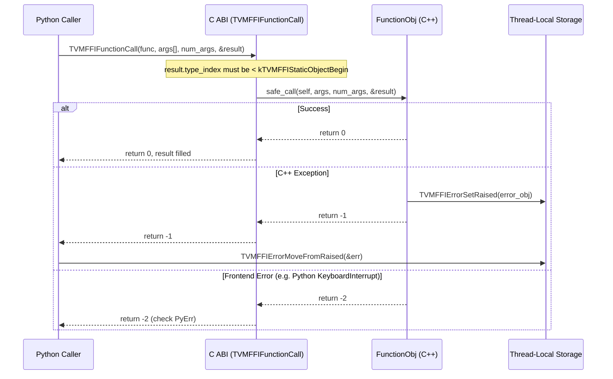

# FFI Stable C ABI Contract

**TL;DR**.
- Defines the binary-stable C ABI surface (`c_api.h`) that all language bindings target: 16-byte `TVMFFIAny` value layout, 24-byte `TVMFFIObject` heap header (with weak reference counting), packed function calling convention, and TLS-based error propagation.
- Every cross-language call flows through `TVMFFISafeCallType` which returns `0` (success), `-1` (error in TLS), or `-2` (frontend error). This design choice trades a TLS dependency for simplified error propagation in generated code.
- Type discrimination uses `TVMFFITypeIndex` enum: indices `[0, 64)` are on-stack POD values, `[64, 128)` are statically-assigned object types, `[128, +inf)` are dynamically-allocated at runtime.

## Problem Statement
### Background
- ML runtimes need to call functions across C++, Python, Rust, and generated code. A stable C ABI is required so that shared libraries compiled independently can interoperate without recompilation.
- Prior TVM FFI used a `TVMValue` + `type_code` pair (24+ bytes). The new design unifies into a 16-byte `TVMFFIAny` with embedded type discriminator.
- DLPack (`dlpack.h`) provides the tensor interchange format (`DLTensor`, `DLDataType`, `DLDevice`) consumed by this ABI.

### Solution
- A single 16-byte struct `TVMFFIAny` serves as the universal value container at the C boundary. All function arguments and return values are packed as `TVMFFIAny` arrays.
- Error propagation uses thread-local storage (TLS) rather than out-parameters, simplifying compiler codegen for call chains.

### Goals
- Stable binary interface across compiler versions and shared library boundaries.
- Support POD types (int64, float64, bool, DLDataType, DLDevice) and heap-allocated Object types in a single 16-byte cell.
- Zero-overhead for POD values (no heap allocation), reference-counted for Object values.
- Non-goals: backward compatibility with legacy `TVMValue` format (explicit translation via `LegacyTVMArgValueToFFIAny` required).

## Design

### End-to-End Cross-Language Call Flow



### Key Classes, Fields and Interfaces

```python
class TVMFFITypeIndex(IntEnum):
    """Runtime type discriminator. Shared by TVMFFIAny and TVMFFIObject."""
    # --- POD range: [0, 64) stored on-stack in TVMFFIAny ---
    kTVMFFIAny = -1           # Meta-index for reflection annotations only
    kTVMFFINone = 0            # null / None
    kTVMFFIInt = 1             # int64
    kTVMFFIBool = 2            # bool (stored as int64)
    kTVMFFIFloat = 3           # float64
    kTVMFFIOpaquePtr = 4       # void*
    kTVMFFIDataType = 5        # DLDataType
    kTVMFFIDevice = 6          # DLDevice
    kTVMFFIDLTensorPtr = 7     # DLTensor* (AnyView only)
    kTVMFFIRawStr = 8          # const char* (AnyView only, never in Any)
    kTVMFFIByteArrayPtr = 9    # TVMFFIByteArray* (AnyView only)
    kTVMFFIObjectRValueRef = 10 # R-value Object ref (AnyView only)
    kTVMFFISmallStr = 11       # Small string stored inline in TVMFFIAny.v_bytes (<=7 bytes)
    kTVMFFISmallBytes = 12     # Small bytes stored inline in TVMFFIAny.v_bytes (<=7 bytes)
    # Invariant: type_index < 64 means POD on-stack, no ref counting needed
    # Invariant: kTVMFFIRawStr can only appear in AnyView, never in owned Any
    # Invariant: SmallStr/SmallBytes are POD-range, no ref counting; small_str_len <= 7

    # --- Static Object range: [64, 128) pre-assigned at compile time ---
    kTVMFFIStaticObjectBegin = 64
    kTVMFFIObject = 64         # Base object
    kTVMFFIStr = 65            # String
    kTVMFFIBytes = 66          # Bytes
    kTVMFFIError = 67          # Error
    kTVMFFIFunction = 68       # Function
    # ---- simple C-ABI-only layouts (no C++ vtable/template dependency) ----
    kTVMFFIShape = 69          # Shape: layout = {TVMFFIObject, {int64_t*, size_t}}
    kTVMFFITensor = 70         # Tensor (was NDArray): layout = {TVMFFIObject, DLTensor}
    # ---- complex objects (require C++ vtable/templates) ----
    kTVMFFIArray = 71          # Array
    kTVMFFIMap = 72            # Map
    kTVMFFIModule = 73         # Module
    kTVMFFIOpaquePyObject = 74 # Opaque Python object wrapper
    kTVMFFIList = 75           # List (mutable sequence, 9513c2f8)
    kTVMFFIDict = 76           # Dict (mutable mapping, c1af3b33)
    # Invariant: Shape/Tensor have C-only layouts, grouped before C++-dependent Array/Map
    kTVMFFIStaticObjectEnd = 128  # End of static object range

    # --- Dynamic Object range: [128, +inf) allocated at runtime ---
    kTVMFFIDynObjectBegin = 128
    # Extension: user-defined types get indices >= 128 via TVMFFITypeGetOrAllocIndex

class TVMFFISEqHashKind(IntEnum):
    """Per-type structural comparison strategy. Stored in TVMFFITypeMetadata."""
    kUnsupported = 0        # Fallback to pointer equality
    kTreeNode = 1           # Compare all registered fields recursively
    kFreeVar = 2            # Variable binding
    kDAGNode = 3            # Tree + DAG memo tracking
    kConstTreeNode = 4      # Tree with pointer-equality fast accept
    kUniqueInstance = 5     # Singleton; pointer equality only
    # Interacts with: TVMFFITypeMetadata.structural_eq_hash_kind, Object._type_s_eq_hash_kind

class TVMFFIObjectDeleterFlagBitMask(IntEnum):
    """Bitmask flags passed to object deleter for two-phase deletion."""
    kTVMFFIObjectDeleterFlagBitMaskStrong = 1 << 0  # strong ref -> 0: call destructor
    kTVMFFIObjectDeleterFlagBitMaskWeak = 1 << 1    # weak ref -> 0: free memory
    kTVMFFIObjectDeleterFlagBitMaskBoth = 0x3        # common case: both at once
    # Invariant: exactly one of Strong, Weak, or Both is passed per deleter call
    # Interacts with: TVMFFIObject.deleter, details::SimpleObjAllocator::Handler::Deleter_

class TVMFFIObject:
    """C-level heap object header. First 24 bytes of every heap-allocated object."""
    combined_ref_count: uint64  # Packed: strong in lower 32 bits, weak in upper 32 bits
    # strong_ref_count = combined_ref_count & 0xFFFFFFFF
    # weak_ref_count = (combined_ref_count >> 32) & 0xFFFFFFFF
    type_index: int32          # Runtime type tag (at offset +8)
    __padding: uint32          # Padding for 8-byte alignment before deleter union (zero-initialized)
    deleter: Callable[[void_ptr, int], None]  # signature: (void*, int); or __ensure_align: int64
    # Invariant: 24 bytes total, 8-byte aligned (union ensures alignment)
    # Invariant: combined_ref_count packs strong+weak into single uint64 for single-atomic DecRef fast path
    # Invariant: strong portion >= 1 while object is strongly reachable
    # Invariant: weak portion initialized to 1 (sentinel for strong holder)
    # Invariant: type_index is NO LONGER at the same offset as TVMFFIAny.type_index
    # Interacts with: Object (C++ wrapper), TVMFFIObjectDecRef/TVMFFIObjectIncRef (C API)

class TVMFFIAny:
    """C-level type-erased value. 16 bytes total."""
    type_index: int32          # Type discriminator (TVMFFITypeIndex)
    # 4-byte union (was small_len):
    #   zero_padding: uint32   # Must be 0 for all non-small-string types
    #   small_str_len: uint32  # Length of inline string (max 7) when type_index is SmallStr/SmallBytes
    # 8-byte union:
    #   v_int64: int64         # integers, booleans
    #   v_float64: float64     # floats
    #   v_uint64: uint64       # unsigned view for hashing
    #   v_ptr: void*           # opaque pointers, DLTensor*
    #   v_c_str: const char*   # raw C-string (non-owning)
    #   v_obj: TVMFFIObject*   # ref-counted object pointer
    #   v_dtype: DLDataType    # data type
    #   v_device: DLDevice     # device info
    #   v_bytes: char[8]       # small string inline storage (active for SmallStr/SmallBytes)
    # Invariant: caller must init type_index to kTVMFFINone before passing as out-param
    # Invariant: if type_index >= kTVMFFIStaticObjectBegin, v_obj is ref-counted
    # Invariant: zero_padding must be 0 for all non-small-string types (ensures same_as/AnyEqual correctness)
    # Interacts with: AnyView/Any (C++ wrappers), TVMFFISafeCallType (calling convention)

# --- Safe Call Type (the universal calling convention) ---
def TVMFFISafeCallType(
    self: void_ptr,            # Function object handle
    args: TVMFFIAny_array,     # Input arguments
    num_args: int32,           # Argument count
    result: TVMFFIAny_ptr      # Output (must have type_index < kTVMFFIStaticObjectBegin on entry)
) -> int:
    """Return 0=success, -1=error in TLS, -2=frontend error."""
    # Interacts with: TVMFFIErrorSetRaised (on -1), EnvErrorAlreadySet (on -2)
    # Invariant: catches ALL exceptions at boundary, never leaks C++ exceptions across ABI
    ...

# --- Core C API Functions ---
def TVMFFIFunctionCall(func: ObjectHandle, args: TVMFFIAny_array,
                       num_args: int32, result: TVMFFIAny_ptr) -> int: ...
    # Interacts with: TVMFFISafeCallType (delegates to func->safe_call)

def TVMFFIFunctionSetGlobal(name: ByteArray, f: ObjectHandle, allow_override: int) -> int: ...
    # Interacts with: global function registry (thread-safe singleton map)
    # Invariant: name must be unique unless allow_override=1

def TVMFFIFunctionGetGlobal(name: ByteArray, out: ObjectHandle_ptr) -> int: ...
    # Interacts with: global function registry
    # Returns: out=NULL if not found, 0 return code

# --- TLS Error Propagation ---
def TVMFFIErrorSetRaised(error: ObjectHandle) -> None: ...
    # Invariant: stores error in TLS, only one error can be pending at a time

def TVMFFIErrorMoveFromRaised(result: ObjectHandle_ptr) -> None: ...
    # Invariant: clears TLS after move (ownership transfer)
    # Interacts with: TVMFFIErrorSetRaised (producer/consumer pair)

# --- Type System ---
def TVMFFITypeGetOrAllocIndex(
    type_key: ByteArray, static_type_index: int32, type_depth: int32,
    num_child_slots: int32, child_slots_can_overflow: int32,
    parent_type_index: int32
) -> int32: ...
    # Interacts with: TVMFFITypeInfo global table
    # Extension: pass static_type_index=-1 for dynamic allocation (>= 128)
    # Invariant: called exactly once per type (cached via static local)

def TVMFFIGetTypeInfo(type_index: int32) -> TVMFFITypeInfo: ...
    # Returns: pointer to global type info table entry

# --- Type Metadata Registration ---
def TVMFFITypeRegisterMetadata(type_index: int32, metadata: TVMFFITypeMetadata) -> int: ...
    # Interacts with: TVMFFITypeInfo.metadata (was extra_info)
    # Invariant: registered at most once per type_index

def TVMFFITypeRegisterField(type_index: int32, info: TVMFFIFieldInfo) -> int: ...
    # Interacts with: TVMFFITypeInfo.fields[]

def TVMFFITypeRegisterMethod(type_index: int32, info: TVMFFIMethodInfo) -> int: ...
    # Interacts with: TVMFFITypeInfo.methods[]

# --- TypeAttr Column System ---
def TVMFFITypeRegisterAttr(type_index: int32, attr_name: TVMFFIByteArray, value: TVMFFIAny) -> int: ...
    # Registers a per-type attribute in a named column array
    # Invariant: (type_index, attr_name) can only be set once
    # Extension: pass type_index=kTVMFFINone to create empty column

def TVMFFIGetTypeAttrColumn(attr_name: TVMFFIByteArray) -> TVMFFITypeAttrColumn: ...
    # Returns: pointer to column, or NULL if attr_name not registered

# TVMFFITypeAttrColumn struct (updated c85fd42d):
#   data: Ptr[TVMFFIAny]     — indexed by (type_index - begin_index)
#   size: int32_t            — was size_t; narrowed to int32
#   begin_index: int32_t     — NEW: starting type index; currently always 0
#   Valid range: [begin_index, begin_index + size)
#   Access: data[type_index - begin_index] iff begin_index <= type_index < begin_index + size
#   Invariant: begin_index = 0 for now (TODO(1.0): sparse column support)

# --- Object Ref Counting (C API) ---
def TVMFFIObjectIncRef(obj: ObjectHandle) -> int: ...
    # Explicit strong reference count increment
    # Interacts with: Object.IncRef

def TVMFFIObjectDecRef(obj: ObjectHandle) -> int: ...
    # Strong reference count decrement (renamed from TVMFFIObjectFree)
    # Two-phase: destructor on strong=0, memory free on weak=0
    # Interacts with: Object.DecRef, TVMFFIObjectDeleterFlagBitMask

# --- Backtrace (renamed from Traceback) ---
def TVMFFIBacktrace(filename: str, lineno: int, func: str, cross_ffi_boundary: int) -> TVMFFIByteArray: ...
    # Renamed from TVMFFITraceback
    # Returns most-recent-call-first order (storage convention changed for O(1) append)
    # cross_ffi_boundary=0: stop backtrace at FFI boundary (default for TVM_FFI_THROW)
    # cross_ffi_boundary=1: capture across FFI boundary (full Python-C++-Python trace)
    # Interacts with: BacktraceStorage, DetectFFIBoundary

class TVMFFIBacktraceUpdateMode(IntEnum):
    """Mode for updating error backtrace."""
    kTVMFFIBacktraceUpdateModeReplace = 0
    kTVMFFIBacktraceUpdateModeAppend = 1
    # Interacts with: TVMFFIErrorCell.update_backtrace, Error.UpdateBacktrace

def TVMFFIErrorCreate(kind: TVMFFIByteArray, message: TVMFFIByteArray,
                      backtrace: TVMFFIByteArray, out: Ptr[TVMFFIObjectHandle]) -> int: ...
    # Changed: returns int (0=success, nonzero=failure) instead of TVMFFIObjectHandle
    # Catches std::bad_alloc to avoid recursive error creation during OOM
    # Interacts with: Python Error.__init__, ErrorObjFromStd

# --- Global Function Registration with Metadata ---
def TVMFFIFunctionSetGlobalFromMethodInfo(info: TVMFFIMethodInfo, allow_override: int) -> int: ...
    # Interacts with: GlobalFunctionTable.Entry (stores metadata alongside function)

# --- Opaque Object Creation ---
def TVMFFIObjectCreateOpaque(
    handle: void_ptr,
    type_index: int32,         # must be kTVMFFIOpaquePyObject (for now)
    deleter: Callable[[void_ptr], None],
    out: TVMFFIObjectHandle_ptr,
) -> int:
    """Create a ref-counted opaque object wrapping an external handle."""
    # Invariant: type_index must be kTVMFFIOpaquePyObject (others raise RuntimeError)
    # Invariant: deleter called exactly once when strong ref count reaches 0
    # Interacts with: OpaqueObjectImpl (src/ffi/object.cc), make_object<OpaqueObjectImpl>
    # Extension: add new opaque type indices by relaxing the type_index check
    ...

def TVMFFIOpaqueObjectGetCellPtr(obj: TVMFFIObjectHandle) -> TVMFFIOpaqueObjectCell:
    """Inline accessor: get opaque cell from object handle (offset = sizeof(TVMFFIObject))."""
    # Interacts with: TVMFFIOpaqueObjectCell.handle
    ...

# --- DLPack Tensor Interop (renamed from NDArray) ---
# --- Static Handle Lifecycle (25c25aec) ---
def TVMFFIHandleInitOnce(
    handle_addr: Ptr[void_ptr],
    init_func: Callable[[Ptr[void_ptr]], int],
) -> int: ...
    # Thread-safe double-checked locking initialization.
    # Fast path: atomic acquire-load of *handle_addr; returns 0 immediately if non-null.
    # Slow path: locks a static std::mutex, rechecks, calls init_func(&result),
    #            atomic release-stores result into *handle_addr.
    # Invariant: init_func MUST write a non-NULL pointer to *result and return 0 on success,
    #            OR call TVMFFIErrorSetRaisedFromCStr and return non-zero on failure.
    # Invariant: *handle_addr must initially be nullptr; subsequent calls are idempotent.
    # Interacts with: TVMFFIErrorSetRaisedFromCStr (error propagation)
    # Extension: enables DSLs without C++ static-init support to lazily init opaque handles

def TVMFFIHandleDeinitOnce(
    handle_addr: Ptr[void_ptr],
    deinit_func: Callable[[void_ptr], int],
) -> int: ...
    # Atomic swap deinit: exchanges *handle_addr with nullptr (acq_rel);
    # calls deinit_func only if old value was non-null.
    # Invariant: deinit_func called at most once even with concurrent deinit calls.
    # Interacts with: TVMFFIErrorSetRaisedFromCStr (if deinit_func sets an error)

# --- Tensor View Creation (8888eb4b) ---
def TVMFFITensorCreateUnsafeView(
    source: TVMFFIObjectHandle,
    prototype: Ptr[const_DLTensor],
    out: Ptr[TVMFFIObjectHandle],
) -> int: ...
    # Creates a view tensor sharing source's data, with metadata from prototype.
    # Invariant: prototype.data must point into memory owned by source
    # Invariant: prototype.strides must not be null
    # Interacts with: TensorObjFromNDAlloc<ViewNDAlloc> (retains source via ObjectPtr)

# --- DLPack Tensor Interop (renamed from NDArray) ---
def TVMFFITensorFromDLPack(from_: DLManagedTensor, require_alignment: int,
                           require_contiguous: int) -> TVMFFIObjectHandle: ...
    # Was: TVMFFINDArrayFromDLPack
def TVMFFITensorToDLPack(from_: TVMFFIObjectHandle) -> DLManagedTensor: ...
    # Was: TVMFFINDArrayToDLPack
def TVMFFITensorFromDLPackVersioned(from_: DLManagedTensorVersioned, require_alignment: int,
                                    require_contiguous: int) -> TVMFFIObjectHandle: ...
    # Was: TVMFFINDArrayFromDLPackVersioned
def TVMFFITensorToDLPackVersioned(from_: TVMFFIObjectHandle) -> DLManagedTensorVersioned: ...
    # Was: TVMFFINDArrayToDLPackVersioned

# --- Version Query API (f0058a9) ---
TVM_FFI_VERSION_MAJOR: int = 0  # Bumped on ABI-breaking changes during RFC stage
TVM_FFI_VERSION_MINOR: int = 1
TVM_FFI_VERSION_PATCH: int = 0
# Invariant: these compile-time macros are the single source of truth for TVMFFIGetVersion

class TVMFFIVersion:
    """C struct for version query results. 3 x uint32."""
    major: uint32
    minor: uint32
    patch: uint32
    # Interacts with: TVMFFIGetVersion (sole producer)

def TVMFFIGetVersion(out_version: Ptr[TVMFFIVersion]) -> None: ...
    # Interacts with: TVM_FFI_VERSION_MAJOR/MINOR/PATCH (compile-time source)
    # Invariant: signature is declared stable across ALL C ABI versions -- never changes
    # Extension: language bindings (Python, Rust) can wrap this for runtime version checks
```

### Contracts, Assumptions and Invariants
- **Layout invariants**: `TVMFFIAny` is 16 bytes (`sizeof(AnyView) == sizeof(TVMFFIAny)` is `static_assert`-ed). `TVMFFIObject` is 24 bytes (grown from 16 to accommodate weak reference counting). All field accessors that compute offsets from `TVMFFIObject` use `sizeof(TVMFFIObject)` and must account for the 24-byte header.
- **Out-param initialization**: Callers must set `result->type_index` to a value `< kTVMFFIStaticObjectBegin` before calling any function that writes to `result`. Violating this leaks ref-counted objects.
- **TLS error single-slot**: Only one error can be pending in TLS at a time. `TVMFFIErrorMoveFromRaised` clears the slot.
- **Return code semantics**: `0` = success, `-1` = error object in TLS (fetch with `MoveFromRaised`), `-2` = frontend environment error (e.g., Python `KeyboardInterrupt` pending).

### Extension Points
- **Dynamic type indices**: Types with `static_type_index = -1` get runtime-allocated indices starting at 128. Any language binding can register new types via `TVMFFITypeGetOrAllocIndex`.
- **DLPack integration**: `TVMFFITensorFromDLPack` / `TVMFFITensorToDLPack` (renamed from `TVMFFINDArray*`) allow zero-copy tensor exchange with external frameworks.
- **Opaque objects**: `TVMFFIObjectCreateOpaque` creates ref-counted wrappers around arbitrary external handles (currently `kTVMFFIOpaquePyObject` for Python objects). Extensible to new opaque type indices.
- **Environment C API registration**: `TVMFFIEnvRegisterCAPI` (now in `extra/c_env_api.h`, signature `const char*` not `TVMFFIByteArray*`) lets frontends inject symbols (e.g., Python signal checking). Module-scoped env APIs use `TVMFFIEnvMod*` prefix.
- **TypeAttr columns**: `TVMFFITypeRegisterAttr` / `TVMFFIGetTypeAttrColumn` enable extensible per-type attributes indexed by type_index. Column access uses `begin_index` offset: `data[type_index - begin_index]` (c85fd42d). `size` is `int32_t` (narrowed from `size_t`).
- **Small string accessor**: `TVMFFISmallBytesGetContentByteArray` reads inline small string content as `TVMFFIByteArray` for language bindings.
- **Version query**: `TVMFFIGetVersion` returns `TVMFFIVersion` (major/minor/patch). This symbol is guaranteed stable across all future ABI versions -- the one function whose signature can never change. Enables runtime compatibility detection.
- **Static handle lifecycle**: `TVMFFIHandleInitOnce` / `TVMFFIHandleDeinitOnce` enable thread-safe lazy initialization and teardown of opaque handles for DSLs without C++ static-init support. Uses double-checked locking (init) and atomic swap (deinit).
- **Tensor view creation**: `TVMFFITensorCreateUnsafeView` creates non-owning view tensors sharing the source tensor's data buffer, enabling strided views and transpositions.

### Usage Examples

#### Cross-Language Function Call (C API Level)
**Context**: A Python binding calls a C++ registered function through the C ABI.
```c
// Prepare arguments
TVMFFIAny args[2];
args[0].type_index = kTVMFFIInt;
args[0].v_int64 = 10;
args[1].type_index = kTVMFFIInt;
args[1].v_int64 = 20;

// Prepare result (MUST init type_index)
TVMFFIAny result;
result.type_index = kTVMFFINone;

// Call through C ABI
int ret = TVMFFIFunctionCall(func_handle, args, 2, &result);
if (ret == -1) {
    TVMFFIObjectHandle err;
    TVMFFIErrorMoveFromRaised(&err);
    // handle error...
} else if (ret == 0) {
    // success: result.v_int64 == 30
}
```

## Implementation Notes
- `TVMFFIObject` uses a `union { deleter; int64_t __ensure_align; }` to guarantee 8-byte alignment on all platforms, critical for pointer tagging and ABI compatibility. The header is 24 bytes: `combined_ref_count(8) + type_index(4) + __padding(4) + deleter(8)`. The `combined_ref_count` packs strong (lower 32 bits) and weak (upper 32 bits) ref counts into a single `uint64_t`, enabling single-atomic `DecRef` fast path where the common case (no external weak refs) completes with one fewer atomic operation. `__padding` is zero-initialized during allocation for memory hygiene.
- Object field accessors (`TVMFFIBytesGetByteArrayPtr`, `TVMFFIFunctionGetCellPtr`, etc.) compute offsets from the `TVMFFIObject` header using `sizeof(TVMFFIObject)` pointer arithmetic (now 24 bytes). This is the canonical way bindings access object internals.
- The `zero_padding`/`small_str_len` union (formerly `small_len`) supports small-string optimization: strings <= 7 bytes are stored inline in `v_bytes` with `type_index = kTVMFFISmallStr/kTVMFFISmallBytes`. All `TypeTraits<T>::CopyToAnyView`/`MoveToAny` must zero `zero_padding` for non-small-string types to ensure `same_as()` and `AnyEqual` correctness.
- **Core/extra API split**: Core `c_api.h` contains only ABI-essential APIs (object, function, error, DLPack, dtype, type reflection, `TVMFFIStringFromByteArray`/`TVMFFIBytesFromByteArray` (043d9f64), version query (`TVMFFIGetVersion`, f0058a9)). The `DLPackManagedTensorAllocator` typedef (renamed from `DLPackTensorAllocator`, 9829dec) is now defined in upstream `dlpack.h` and removed from `c_api.h`. Environment-specific APIs (`TVMFFIEnvCheckSignals`, `TVMFFIEnvRegisterCAPI`, `TVMFFIEnvMod*`, `TVMFFIEnvSetStream`/`TVMFFIEnvGetStream` (renamed from `SetCurrentStream`/`GetCurrentStream`, f81ab9c), `TVMFFIEnvSetDLPackManagedTensorAllocator`/`TVMFFIEnvGetDLPackManagedTensorAllocator` (renamed from `TVMFFIEnvSet/GetTensorAllocator`, f679fe5), `TVMFFIEnvTensorAlloc` (new, f679fe5)) live in `extra/c_env_api.h`.

## Alternatives & Trade-offs
### TLS Error Propagation vs. Out-Parameter Errors
- Pros of TLS: Simpler codegen for call chains (no need to thread error pointers through every call). Matches Python/Java exception model. Single return value simplifies ABI.
- Cons of TLS: Requires TLS runtime support. Single error slot means nested calls must clear errors before re-entering.
### 16-byte Any vs. Previous TVMValue+type_code (24+ bytes)
- Pros of 16-byte: Cache-friendly. Fits in two registers on 64-bit platforms. Unified storage eliminates separate type_code management.
- Cons: 8-byte union limits inline storage (small strings limited to <= 7 bytes). `zero_padding` field must be zeroed by all TypeTraits implementations.

## Evidence
| Commit | Scope | Contribution |
|--------|-------|-------------|
| 7d34eb8 | ffi/c-api | Introduced entire C ABI surface (`c_api.h`) |
| 1a856886 | ffi/c-api | Added TVMFFIFieldFlagBitMask, renamed TVMFFIRegisterTypeField -> TVMFFITypeRegisterField |
| a419ed17 | ffi/c-api | Added TVMFFITypeExtraInfo, metadata (was type_schema), size/alignment fields |
| 837800e7 | ffi/c-api | Changed type_ancestors from int32* to TVMFFITypeInfo** |
| 9445fe73 | ffi/c-api | Added TVMFFISEqHashKind enum, SEqHash field flags |
| 162d6009 | ffi/c-api | Introduced TypeAttr column system, renamed to TVMFFITypeMetadata |
| 0966c368 | ffi/c-api | Renamed type keys from `object.*` to `ffi.*`, StaticTypeKey constants |
| 49e2ed4a | ffi/c-api, ffi/containers | Added kTVMFFISmallStr/kTVMFFISmallBytes, `zero_padding`/`small_str_len` union, `TVMFFISmallBytesGetContentByteArray` |
| 538bef49 | ffi/module | Added kTVMFFIModule (73) to StaticTypeKey/TypeIndex |
| 023ea448 | ffi/c-api, ffi/extra | Reorganized C API: moved env APIs to extra, `TVMFFIEnvMod*` rename |
| 0daaffed | ffi/c-env-api | Added `TVMFFIStreamHandle`, stream context APIs (now `TVMFFIEnvSetStream`/`TVMFFIEnvGetStream`) |
| 777cf8d | ffi/c-api | Reordered static type indices (Shape=69, NDArray=70 before Array=71, Map=72), renamed `override` -> `allow_override` |
| ca9c3d1 | ffi/c-api, ffi/object | Grew TVMFFIObject to 24 bytes, added weak_ref_count/strong_ref_count, two-phase deleter, TVMFFIObjectDecRef/IncRef |
| 2d41a51 | ffi/traceback | Added `cross_ffi_boundary` parameter to `TVMFFITraceback` |
| 91d69f0 | ffi/c-api, ffi/object | Added `kTVMFFIOpaquePyObject` (74), `TVMFFIObjectCreateOpaque`, `TVMFFIOpaqueObjectCell` |
| 3a551d8 | ffi/c-api, ffi/containers | Renamed NDArray->Tensor: `kTVMFFITensor`, `TVMFFITensor{From,To}DLPack{,Versioned}` |
| 24125d0 | ffi/c-api | Changed `FObjectDeleter` signature from `(TVMFFIObject*, int)` to `(void*, int)` |
| 6f020c11 | ffi/error, ffi/c-api | Renamed traceback->backtrace, reversed storage order, `TVMFFIBacktraceUpdateMode` enum, `TVMFFIErrorCreate` safety |
| 13436f01 | ffi/c-api, ffi/object | Reordered `TVMFFIObject` header: ref counts first (u32), aligning with torch ABI |
| 98cb8af4 | ffi/c-api, ffi/object | Renamed `type_acenstors`->`type_ancestors` (typo fix) |
| bdad2184 | ffi/object, ffi/c-api | Registered `OpaquePyObject` as builtin type index (`StaticTypeKey::kTVMFFIOpaquePyObject`) |
| 43d13e86 | ffi/c-api, ffi/object | Packed strong/weak ref counts into `combined_ref_count: uint64` for single-atomic DecRef fast path |
| 4fe8b2b7 | ffi/c-api, ffi/function | Moved `cpp_call` into `TVMFFIFunctionCell`, removed `ImportedFunctionObjImpl` |
| 935a5a07 | ffi/c-api, ffi/reflection | Renamed `type_schema` to `metadata` in `TVMFFIFieldInfo`/`TVMFFIMethodInfo`; added `ModuleObj::GetFunctionDoc` |
| 9829dec | ffi/c-api | Removed `DLPackTensorAllocator` typedef and `DLManagedTensorVersioned` fwd decl from `c_api.h` (now upstream `dlpack.h`); renamed to `DLPackManagedTensorAllocator` |
| f0058a9 | ffi/c-api | Added `TVMFFIGetVersion`, `TVMFFIVersion` struct, `TVM_FFI_VERSION_*` compile-time macros |
| 25c25aec | ffi/c-api | Added `TVMFFIHandleInitOnce`/`TVMFFIHandleDeinitOnce` for thread-safe DSL handle lifecycle |
| 8888eb4b | ffi/c-api, ffi/containers | Added `TVMFFITensorCreateUnsafeView` for strided tensor views |
| b648c5d6 | ffi/c-api | Added `kTVMFFIFieldFlagBitMaskReprOff = 1 << 6` to TVMFFIFieldFlagBitMask for repr field exclusion |
| c85fd42d | ffi/c-api, ffi/reflection | `TVMFFITypeAttrColumn.begin_index` (int32), `size` narrowed to int32 from size_t |
| c1af3b33 | ffi/c-api, ffi/containers | Added `kTVMFFIDict = 76` type index |
| 49a5d71a | ffi/c-api | `kDLMAIA = 17` added to DLDeviceType; `kDLTrn` renumbered 17 -> 18 |
| 577b2949 | ffi/c-api | Version bump TVM_FFI_VERSION_PATCH 9 -> 10 |
| plus 3 supporting commits | ffi/c-env-api | Renamed `TVMFFIEnvSet/GetTensorAllocator` to DLPack-aligned names; added `TVMFFIEnvTensorAlloc` |

## Related Design Docs & ADRs
- [0002-any-value-system.md](0002-any-value-system.md) -- C++ wrappers (`Any`/`AnyView`) over the C ABI types
- [0004-function-system.md](0004-function-system.md) -- `Function` system built on `TVMFFISafeCallType`
- [0005-error-protocol.md](0005-error-protocol.md) -- Error handling protocol using TLS mechanism defined here
- [0007-reflection.md](0007-reflection.md) -- Reflection subsystem using TVMFFITypeInfo fields/methods
- [0009-structural-eq-hash.md](0009-structural-eq-hash.md) -- Structural equality using TVMFFISEqHashKind and TypeAttr columns
- [0011-module-system.md](0011-module-system.md) -- Module system, stream context, and env API extensions
- [0012-python-package.md](0012-python-package.md) -- Python bindings that consume this C ABI
