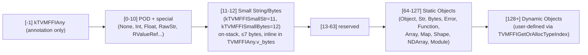

# TVM FFI Stable C ABI

**TL;DR**
- Defines the wire-stable, language-agnostic boundary between TVM FFI and all language bindings (Python, Rust, C). All inter-language communication is funneled through this ABI.
- The ABI is intentionally **incompatible** with the prior TVM packed-func ABI; static type indices occupy [64, 127], dynamic user-defined types start at 128 (`kTVMFFIDynObjectBegin`).
- Every exported symbol carries the `TVM_FFI_DLL` visibility attribute; on platforms without shared libraries, inline C++ helpers (`TVMFFIObjectGetTypeIndex`, `TVMFFIBytesGetByteArrayPtr`, etc.) handle byte-offset computation so non-C++ bindings can skip the DLL for layout-only queries.

## Problem Statement

### Background
A language runtime (Python, Rust) needs to pass values to and receive values from a compiled TVM computation graph without depending on C++ headers. A stable, versioned C-only interface solves this: it can be called from ctypes/cffi (Python), the Rust `extern "C"` block, or any other FFI mechanism.

### Solution
A single header `c_api.h` exposes all wire types as C structs, a type-index enum, and a set of `TVM_FFI_DLL`-decorated functions. The C++ layer translates between these wire types and the richer C++ types internally.

### Goals
- Language-agnostic, forward-compatible boundary.
- Minimal C types: three core structs (`TVMFFIObject`, `TVMFFIAny`, `TVMFFIByteArray`) plus per-subsystem cells.
- Non-goal: hide C++ RTTI or vtable layout — Object inheritance is tracked via the explicit `TVMFFITypeInfo` registry.

## Design

### Wire Types and Type Index Enum

The entire type space is encoded by the 32-bit `TVMFFITypeIndex` (aka `int32_t`):

```python
class TVMFFITypeIndex(IntEnum):
    # Sentinel: used only in reflection field annotations, never in Any.type_index
    kTVMFFIAny         = -1

    # --- Section: On-stack POD / special [0, 64) ---
    kTVMFFINone        = 0   # null / Python None
    kTVMFFIInt         = 1
    kTVMFFIBool        = 2
    kTVMFFIFloat       = 3
    kTVMFFIOpaquePtr   = 4
    kTVMFFIDataType    = 5   # DLDataType
    kTVMFFIDevice      = 6   # DLDevice
    kTVMFFIDLTensorPtr = 7   # raw DLTensor* (borrow only)
    kTVMFFIRawStr      = 8   # const char* — AnyView only, NEVER in Any
    kTVMFFIByteArrayPtr= 9   # TVMFFIByteArray* borrow
    kTVMFFIObjectRValueRef = 10  # R-value ref to ObjectRef (consumed once)
    kTVMFFISmallStr   = 11   # on-stack string, up to 7 bytes (sizeof(int64_t) − 1)
    kTVMFFISmallBytes = 12   # on-stack bytes, up to 7 bytes
    # Invariant: indices 11/12 are in the POD range [0,64) — NOT heap-allocated objects
    # Invariant: small string content is stored in TVMFFIAny.v_bytes; length in small_str_len

    # --- Section: Static Objects [64, 128) ---
    # Invariant: Objects with type_index in this range have compile-time-known layout
    kTVMFFIStaticObjectBegin = 64
    kTVMFFIObject     = 64
    kTVMFFIStr        = 65   # layout = { TVMFFIObject, TVMFFIByteArray, ... }
    kTVMFFIBytes      = 66
    kTVMFFIError      = 67   # layout = { TVMFFIObject, TVMFFIErrorCell, ... }
    kTVMFFIFunction   = 68   # layout = { TVMFFIObject, TVMFFIFunctionCell, ... }
    # Reordered in commit 777cf8d: simple C-ABI objects (Shape, Tensor) precede complex C++ objects (Array, Map)
    # Before reorder: Array=69, Map=70, Shape=71, NDArray=72, Module=73
    kTVMFFIShape      = 69   # layout = { TVMFFIObject, TVMFFIShapeCell, ... }
    kTVMFFITensor     = 70   # layout = { TVMFFIObject, DLTensor, ... }  (was kTVMFFINDArray, renamed in commit 3a551d8)
    kTVMFFIArray      = 71
    kTVMFFIMap        = 72
    kTVMFFIModule     = 73
    kTVMFFIOpaquePyObject = 74  # layout = { TVMFFIObject, TVMFFIOpaqueObjectCell }  (added commit 91d69f0)
    kTVMFFIList           = 75  # mutable sequence; shares TVMFFISeqCell layout with Array (added commit 9513c2f8)
    kTVMFFIDict           = 76  # mutable map; shares SmallMap/DenseMap base with Map (added commit c1af3b33)
    kTVMFFIStaticObjectEnd      # sentinel, value >= 77

    # --- Section: Dynamic Objects [128, ∞) ---
    # Invariant: Allocated at runtime via TVMFFIGetOrAllocTypeIndex
    kTVMFFIDynObjectBegin = 128
```

### Core Structs

```python
# Wire layout — fixed across all platforms and languages:

class TVMFFIObjectDeleterFlagBitMask(IntEnum):
    """Bitmask passed to deleter function to distinguish destructor vs. memory-free. (added commit ca9c3d1)"""
    kTVMFFIObjectDeleterFlagBitMaskStrong = 1 << 0  # strong_ref_count → 0: call destructor
    kTVMFFIObjectDeleterFlagBitMaskWeak   = 1 << 1  # weak_ref_count → 0: free memory
    kTVMFFIObjectDeleterFlagBitMaskBoth   = 0x3     # common fast-path: both at once
    # Interacts with: FObjectDeleter, SimpleObjAllocator::Deleter_

class TVMFFIObject:          # C struct — 24 bytes (was 16 bytes before commit ca9c3d1)
    """Header for all heap-allocated FFI objects."""
    # Layout history:
    #   pre-ca9c3d1:  16 bytes; ref_counter(u64 at offset 0) + type_index(i32 at 8)
    #   ca9c3d1:      24 bytes; strong_ref_count(u32) | weak_ref_count(u32) + type_index at offset 8
    #   13436f0:      strong_ref_count narrowed u64→u32; layout reordered to offset 0
    #   43d13e86:     two u32 fields merged into one combined_ref_count(u64) at offset 0
    combined_ref_count: uint64_t  # offset 0 — packed: strong=low 32 bits, weak=high 32 bits
    # strong_ref_count = combined_ref_count & 0xFFFFFFFF
    # weak_ref_count   = (combined_ref_count >> 32) & 0xFFFFFFFF
    # Initial value: kCombinedRefCountBothOne = 0x0000000100000001 (strong=1, weak=1)
    # Increment/decrement units:
    #   kCombinedRefCountStrongOne = 1          # lower 32 bits
    #   kCombinedRefCountWeakOne   = 1 << 32    # upper 32 bits
    # DecRef fast path: one atomic fetch-sub on combined_ref_count detects both→0 simultaneously
    type_index: int32_t         # offset 8  — (was at offset 0 pre-13436f0)
    __padding: uint32_t         # offset 12 — explicitly zeroed at allocation (commit f9179ec2)
    deleter: Callable[[void*, int], None]  # offset 16 — called with TVMFFIObjectDeleterFlagBitMask flags
    # Signature changed: TVMFFIObject* -> void* in commit 24125d0; callers must static_cast
    # Invariant: sizeof(TVMFFIObject) == 24 (enforced by static_assert in type_traits.h)
    # Invariant: combined_ref_count at offset 0; struct total size is unchanged at 24 bytes
    # Invariant: __padding is always 0 after make_object<T> (commit f9179ec2)
    # Invariant: deleter is set by make_object<T>() before any ref is given out
    # Invariant: every new object starts with combined_ref_count = kCombinedRefCountBothOne
    # DROPPED: type_index no longer shares a prefix with TVMFFIAny.type_index (commit 13436f0)
    # Interacts with: ObjectPtr<T> (IncRef/DecRef), WeakObjectPtr<T> (IncWeakRef/DecWeakRef)
    # Interacts with: make_object<T>() (sets deleter + type_index)

class TVMFFIAny:             # C struct — 16 bytes on all platforms
    """On-stack type-erased value. Shared with AnyView/Any in C++."""
    type_index: int32_t      # Same type_index space as TVMFFIObject
    # Bytes 4–7 (second word): union — MUST be zero for all non-small-string values
    zero_padding:  uint32_t  # MUST be 0 for all values except small strings
    small_str_len: uint32_t  # valid when type_index ∈ {kTVMFFISmallStr, kTVMFFISmallBytes}
    # (zero_padding and small_str_len share the same 4 bytes — union)
    # OLD field name: small_len: int32_t (removed; replaced by this union)
    # REMOVED in commit c100338d: v_char32[2] union member (small UCS4 string storage) was removed.
    # No external code used this field; the union is now slightly smaller.
    # Invariant: zero_padding MUST be set to 0 whenever writing a non-small-string value;
    #            enforced across all TypeTraits<T>::CopyToAnyView overloads
    # union (8 bytes, must be zeroed for kTVMFFINone):
    v_int64:   int64_t       # kTVMFFIInt, kTVMFFIBool
    v_float64: float64_t     # kTVMFFIFloat
    v_ptr:     void*         # kTVMFFIOpaquePtr
    v_c_str:   const char*   # kTVMFFIRawStr
    v_obj:     TVMFFIObject* # kTVMFFIObject..kTVMFFIModule, dynamic types
    v_dtype:   DLDataType    # kTVMFFIDataType (padding bytes are ALWAYS zeroed)
    v_device:  DLDevice      # kTVMFFIDevice
    v_bytes:   char[8]       # small string content (≤7 bytes); length in small_str_len
    v_uint64:  uint64_t      # used for structural hashing and small-string fast hash
    # Invariant: type_index and v_int64 are ALWAYS zeroed for kTVMFFINone
    # Invariant: DLDataType padding bytes are zeroed before use (commit 076ac23e)
    # Invariant: zero_padding is 0 for ALL non-small-string values (enforced since commit 49e2ed4)
    # Interacts with: AnyView/Any (C++ wrappers), TypeTraits (conversion dispatch)
    # Interacts with: AnyHash, AnyEqual — small and heap strings with same content compare equal

class TVMFFIByteArray:       # C struct — pointer + size_t (8 or 12 bytes)
    """Non-owning reference to byte data. Backing for String/Bytes/field names."""
    data: const char*
    size: size_t
    # Note: size_t matches pointer width; layout differs on 32 vs 64 bit

class TVMFFISeqCell:         # shared between Array and List objects (added commit 9513c2f8)
    """C ABI cell layout for sequential containers. Follows TVMFFIObject in both Array and List.
    Array (kTVMFFIArray=71) and List (kTVMFFIList=75) share this layout.
    """
    capacity: int64_t                        # allocated slot count (may exceed size)
    size:     int64_t                        # number of live elements
    data:     TVMFFIAny*                     # heap-allocated array of TVMFFIAny elements
    data_deleter: Callable[[void*], None]    # frees data pointer; NULL for embedded small-array
    # Invariant: sizeof(TVMFFIObject) + sizeof(TVMFFISeqCell) verified by static_assert
    # Invariant: data_deleter is NULL when data is embedded in object tail (small-array opt)
    # Invariant: Array objects are immutable after construction; List objects are mutable in-place
    # Interacts with: SeqBaseObj (C++), ArrayObj, ListObj, TVMFFIGetSeqCellPtr (inline accessor)

class TVMFFIShapeCell:       # { const int64_t*, size_t }  — follows TVMFFIObject in Shape
class TVMFFIErrorCell:
    kind:             TVMFFIByteArray
    message:          TVMFFIByteArray
    backtrace:        TVMFFIByteArray   # renamed from traceback in commit 6f020c1; stored most-recent-call-first
    update_backtrace: Callable[[TVMFFIObjectHandle, TVMFFIByteArray*, int32_t], None]
    # param update_mode: TVMFFIBacktraceUpdateMode (0=replace, 1=append) — added commit 6f020c1
    # Interacts with: Error C++ class (reads via TVMFFIErrorGetCellPtr)

class TVMFFIBacktraceUpdateMode(IntEnum):
    """Update mode for backtrace append (commit 6f020c1)."""
    kTVMFFIBacktraceUpdateModeReplace = 0  # replace entire backtrace content
    kTVMFFIBacktraceUpdateModeAppend  = 1  # append frames without reallocation
    # Invariant: backtrace bytes stored most-recent-call-first
class TVMFFIFunctionCell:
    """C struct storing C ABI and optional C++ call pointers for a Function object."""
    safe_call: TVMFFISafeCallType  # C ABI boundary — catches exceptions, returns int
    cpp_call:  void*               # NEW (commit 4fe8b2b7): C++ fast path; NULL for non-C++ functions
    # Invariant: cpp_call is NULL for ExternCFunctionObjImpl (external C callbacks)
    # Invariant: caller must share the same C++ exception ABI when calling cpp_call directly
    # Interacts with: FunctionObj.CallPacked (dispatches on cpp_call != NULL)
    # ABI note: cpp_call field added in version 0.1.0b12 — binary-breaking change for consumers
    #           who compiled against an earlier TVMFFIFunctionCell layout

class TVMFFIFieldInfo:
    """C struct — one entry per registered field in TVMFFITypeInfo.fields[]."""
    name:                    TVMFFIByteArray   # field name
    doc:                     TVMFFIByteArray   # docstring (unstructured prose)
    metadata:                TVMFFIByteArray   # focused structured JSON (nullable)
    # RENAMED from type_schema in commit 935a5a07; rationale: doc=unstructured/large, metadata=compact JSON
    flags:                   int64_t           # kTVMFFIFieldFlagBitMask* OR'd bits
    size:                    int64_t           # sizeof(T) for this field
    alignment:               int64_t           # alignof(T) for this field
    offset:                  int64_t           # offset from (char*)TVMFFIObjectHandle; was byte_offset
    getter:                  TVMFFIFieldGetter # fn(field_ptr, result_ptr) -> int
    setter:                  TVMFFIFieldSetter # fn(field_ptr, value_ptr) -> int
    default_value_or_factory: TVMFFIAny       # valid when kTVMFFIFieldFlagBitMaskHasDefault set
    # RENAMED from default_value in commit 5e564cdf (adding DefaultFactory support).
    # C ABI struct layout is unchanged (same field, same offset).
    # Flag bits:
    #   kTVMFFIFieldFlagBitMaskWritable           = 1 << 0  — writable (setter allowed)
    #   kTVMFFIFieldFlagBitMaskHasDefault         = 1 << 1  — default_value_or_factory is valid
    #   kTVMFFIFieldFlagBitMaskIsStaticMethod     = 1 << 2  — for methods (no self ptr)
    #   kTVMFFIFieldFlagBitMaskSEqHashIgnore      = 1 << 3  — skip in structural eq/hash
    #   kTVMFFIFieldFlagBitMaskSEqHashDef         = 1 << 4  — enters free-var def region
    #   kTVMFFIFieldFlagBitMaskDefaultFromFactory = 1 << 5  — default_value_or_factory holds a factory Function; call it per-construction (commit 5e564cdf)
    #   kTVMFFIFieldFlagBitMaskReprOff            = 1 << 6  — field excluded from ReprPrint (commit 6b39efbf)
    #   kTVMFFIFieldFlagBitMaskCompareOff         = 1 << 7  — field excluded from RecursiveEq/Lt/Le/Gt/Ge (commit 6b39efbf)
    #   kTVMFFIFieldFlagBitMaskHashOff            = 1 << 8  — field excluded from RecursiveHash (commit 6b39efbf)
    #   kTVMFFIFieldFlagBitMaskInitOff            = 1 << 9  — field excluded from auto-generated __ffi_init__ (commit 6b39efbf)
    #   kTVMFFIFieldFlagBitMaskKwOnly             = 1 << 10 — field is keyword-only in auto-generated __ffi_init__ (commit 6b39efbf)
    # Invariant: when DefaultFromFactory is set, HasDefault must also be set
    # Invariant: metadata is nullable (data=nullptr, size=0 means absent)
    # Invariant: offset is relative to (char*)TVMFFIObjectHandle, NOT subclass base
    # Interacts with: ObjectDef<T> (populates), FieldGetter/FieldSetter (runtime use), SetFieldToDefault

class TVMFFIMethodInfo:
    """C struct — one entry per registered method in TVMFFITypeInfo.methods[]."""
    name:        TVMFFIByteArray   # method name
    doc:         TVMFFIByteArray   # docstring (unstructured prose)
    metadata:    TVMFFIByteArray   # focused structured JSON (nullable)
    # RENAMED from type_schema in commit 935a5a07 — same semantic split as TVMFFIFieldInfo
    flags:       int64_t           # kTVMFFIFieldFlagBitMaskIsStaticMethod etc.
    method:      TVMFFIAny         # Function handle
    # Interacts with: ObjectDef<T>.def/def_static, TVMFFIFunctionSetGlobalFromMethodInfo

class TVMFFITypeMetadata:
    """Per-type static metadata: doc, size, creator, structural eq/hash kind.
    Renamed from TVMFFITypeExtraInfo (commit 162d6009).
    """
    doc:                     TVMFFIByteArray      # optional docstring
    total_size:              int32_t              # sizeof(ConcreteClass); 0 if variable
    creator:                 TVMFFIObjectCreator  # nullable factory ptr
    structural_eq_hash_kind: TVMFFISEqHashKind    # default: kTVMFFISEqHashKindUnsupported
    # Invariant: creator may be called with no args; caller must set all fields after creation
    # Interacts with: TVMFFITypeInfo.metadata, TVMFFITypeRegisterMetadata, MakeObjectFromPackedArgs

TVMFFIObjectCreator = Callable[[TVMFFIObjectHandle*], int]
# fn(result) → 0 (success) | nonzero (error in TLS)

class TVMFFITypeAttrColumn:
    """Column-array of TVMFFIAny values, one slot per registered type_index.
    Used for named per-type attribute dispatch (e.g., __s_equal__, __s_hash__).
    begin_index field added in commit c85fd42df for sparse range-bounded storage.
    """
    data:        const TVMFFIAny*  # array of `size` slots; slots not set are kTVMFFINone
    size:        size_t            # current capacity (grows as new types register)
    begin_index: int32_t           # NEW (commit c85fd42df): first type_index this column covers;
                                   # accessing type_index < begin_index treated as null
    # Invariant: accessing index >= begin_index + size treated as null (no value)
    # Invariant: accessing index < begin_index treated as null (sparse optimization)
    # Interacts with: TVMFFIGetTypeAttrColumn, TypeAttrColumn C++ wrapper, TypeAttrDef<T>

class TVMFFITypeInfo:
    """Runtime type registration record — const pointers; self-referential for O(1) ancestor access."""
    type_index: int32_t
    type_depth: int32_t
    type_key: TVMFFIByteArray
    type_key_hash: uint64_t
    type_ancestors: const TVMFFITypeInfo**  # pointer array; [i] = ancestor at depth i
    # Invariant: type_ancestors[0] = root Object TypeInfo; length = type_depth (self excluded)
    # Changed from int32_t* (commit 837800e7) — enables O(1) ancestor traversal
    num_fields: int32_t
    num_methods: int32_t
    fields: const TVMFFIFieldInfo*    # const (was mutable before commit a419ed17)
    methods: const TVMFFIMethodInfo*  # const
    metadata: const TVMFFITypeMetadata*  # nullable; was extra_info (renamed in commit 162d6009)
    # Interacts with: TVMFFIGetTypeInfo(), ForEachFieldInfo(), IsObjectInstance<T>()

class TVMFFISEqHashKind(IntEnum):
    """Per-type structural comparison/hash strategy. Stored in TVMFFITypeMetadata."""
    kTVMFFISEqHashKindUnsupported    = 0  # throws TypeError in StructuralEqual/Hash
    kTVMFFISEqHashKindTreeNode       = 1  # recurse over reflected fields; custom attrs override
    kTVMFFISEqHashKindFreeVar        = 2  # symbolic variable: map-or-pointer equality
    kTVMFFISEqHashKindDAGNode        = 3  # recurse fields; record mapping to detect sharing
    kTVMFFISEqHashKindConstTreeNode  = 4  # tree with no free-var children; ptr equality fast path
    kTVMFFISEqHashKindUniqueInstance = 5  # singleton; always pointer equality
    # Note: kTVMFFISEqHashKindCustomTreeNode = 6 was briefly added then removed (commits
    # 2ec11f5f, 59a837eb); custom dispatch now via TypeAttrColumn("__s_equal__/__s_hash__")
```

### Inline Layout Accessors (C++ helpers)

Objects with static type indices have predictable memory layouts. Bindings can use these without calling DLL functions:

```python
# Each returns a pointer at: (char*)obj + sizeof(TVMFFIObject)
def TVMFFIBytesGetByteArrayPtr(obj: void*) -> TVMFFIByteArray*: ...   # for String/Bytes
def TVMFFIErrorGetCellPtr(obj: void*) -> TVMFFIErrorCell*: ...
def TVMFFIFunctionGetCellPtr(obj: void*) -> TVMFFIFunctionCell*: ...
def TVMFFIShapeGetCellPtr(obj: void*) -> TVMFFIShapeCell*: ...
def TVMFFINDArrayGetDLTensorPtr(obj: void*) -> DLTensor*: ...
def TVMFFIObjectGetTypeIndex(obj: void*) -> int32_t: ...              # reads header_.type_index
```

### Exported DLL Functions

```python
# Object lifetime
def TVMFFIObjectDecRef(obj: TVMFFIObjectHandle) -> int: ...
# Decrements strong ref count; replaces TVMFFIObjectFree (removed in commit ca9c3d1)
# When strong_ref_count → 0: calls deleter(obj, kStrong); if weak_ref_count also == 1: calls with kBoth instead
def TVMFFIObjectIncRef(obj: TVMFFIObjectHandle) -> int: ...
# Increments strong ref count; new in commit ca9c3d1 (callers needed explicit IncRef for weak→strong promotion)

# Type system
def TVMFFITypeKeyToIndex(type_key: TVMFFIByteArray*, out: int32_t*) -> int: ...
def TVMFFIGetTypeInfo(type_index: int32_t) -> TVMFFITypeInfo*: ...
def TVMFFIGetOrAllocTypeIndex(
    type_key: TVMFFIByteArray*, static_type_index: int32_t,
    type_depth: int32_t, num_child_slots: int32_t,
    child_slots_can_overflow: int32_t, parent_type_index: int32_t
) -> int32_t: ...
# Invariant: idempotent — subsequent calls with same type_key return same index

# Function / calling
def TVMFFIFunctionCreate(handle: void*, safe_call: TVMFFISafeCallType,
                         deleter: Callable, out: TVMFFIObjectHandle*) -> int: ...
def TVMFFIFunctionCall(func: TVMFFIObjectHandle, args: TVMFFIAny*,
                       num_args: int32_t, result: TVMFFIAny*) -> int: ...
    # Invariant: caller MUST set result->type_index = kTVMFFINone before calling
    # Returns: 0=ok, -1=error (fetch via TVMFFIErrorMoveFromRaised), -2=frontend env error
def TVMFFIFunctionSetGlobal(name: TVMFFIByteArray*, f: TVMFFIObjectHandle, allow_override: int) -> int: ...
# Parameter renamed from 'override' to 'allow_override' in commit 777cf8d (clarity; ABI unchanged)
def TVMFFIFunctionGetGlobal(name: TVMFFIByteArray*, out: TVMFFIObjectHandle*) -> int: ...
def TVMFFIFunctionSetGlobalFromMethodInfo(
    method_info: const TVMFFIMethodInfo*, allow_override: int) -> int: ...
# Extends TVMFFIFunctionSetGlobal with full TVMFFIMethodInfo metadata storage
# Interacts with: GlobalFunctionTable::Entry, GlobalDef builder
def TVMFFIAnyViewToOwnedAny(any_view: TVMFFIAny*, out: TVMFFIAny*) -> int: ...

# Error handling (TLS-based)
def TVMFFIErrorMoveFromRaised(result: TVMFFIObjectHandle*) -> None: ...
def TVMFFIErrorSetRaised(error: TVMFFIObjectHandle) -> None: ...
def TVMFFIErrorSetRaisedFromCStr(kind: const char*, message: const char*) -> None: ...
# Renamed from TVMFFIErrorSetRaisedByCStr (commit a419ed17, pure cosmetic rename)
def TVMFFIErrorCreate(kind: TVMFFIByteArray*, message: TVMFFIByteArray*,
                      traceback: TVMFFIByteArray*) -> TVMFFIObjectHandle: ...

# Environment (MOVED to extra/c_env_api.h — no longer in core c_api.h since commit 023ea44)
# def TVMFFIEnvCheckSignals() -> int: ...   # NOW in extra/c_env_api.h (extra-only)
# def TVMFFIEnvRegisterCAPI(name: const char*, symbol: void*) -> int: ...  # NOW in extra/c_env_api.h
# See design-records/0012-env-api.md for the full extra/ env API

# Reflection (type registration)
def TVMFFIRegisterTypeField(type_index: int32_t, info: TVMFFIFieldInfo*) -> int: ...
def TVMFFITypeRegisterMetadata(type_index: int32_t,
                               metadata: const TVMFFITypeMetadata*) -> int: ...
# Renamed from TVMFFITypeRegisterExtraInfo (commit 162d6009)
# Invariant: raises RuntimeError if metadata already set for type_index
def TVMFFITypeRegisterAttr(type_index: int32_t,
                           attr_name: const TVMFFIByteArray*,
                           attr_value: const TVMFFIAny*) -> int: ...
# type_index == kTVMFFINone: ensures column exists without setting a value
# Invariant: raises RuntimeError if attr already set for (type_index, attr_name)
def TVMFFIGetTypeAttrColumn(attr_name: const TVMFFIByteArray*) -> const TVMFFITypeAttrColumn*: ...
# Returns NULL if column not found
# Interacts with: TypeAttrColumn C++ wrapper, StructEqualHandler/StructuralHashHandler

# String/Bytes construction from raw bytes (added commit 043d9f647677)
def TVMFFIStringFromByteArray(input: TVMFFIByteArray*, out: TVMFFIAny*) -> int: ...
    # Reinterprets byte array as UTF-8; writes kTVMFFISmallStr=11 (≤7 bytes, inline in out.v_bytes)
    # or kTVMFFIStr=65 (heap String object) into out.
    # Invariant: caller must set out.type_index = kTVMFFINone before calling.
    # Interacts with: TypeTraits<String>::MoveToAny, TVMFFIAny small-string inline storage

def TVMFFIBytesFromByteArray(input: TVMFFIByteArray*, out: TVMFFIAny*) -> int: ...
    # Reinterprets byte array as Bytes; writes kTVMFFISmallBytes=12 or kTVMFFIBytes=66.
    # Invariant: caller must set out.type_index = kTVMFFINone before calling.
    # Interacts with: TypeTraits<Bytes>::MoveToAny

# Handle lifecycle — thread-safe static init/deinit (added commit 25c25aec)
def TVMFFIHandleInitOnce(handle_addr: void**, init_func: Callable[[void**], int]) -> int: ...
    # Thread-safe one-shot initialization of *handle_addr.
    # Fast path: atomic acquire-load; if *handle_addr != nullptr, returns 0 immediately.
    # Slow path: acquires a process-global static mutex (shared across ALL callers in libtvm_ffi),
    #            double-checks *handle_addr under lock, calls init_func(*handle_addr) if still NULL.
    # Invariant: init_func MUST store a non-NULL pointer in *result; returning 0 with *result=NULL is an error.
    # Invariant: init_func failure (nonzero) leaves *handle_addr as NULL; error in TLS via TVMFFIErrorSetRaisedFromCStr.
    # Invariant: atomic store-release ensures visibility to future load-acquires in other threads.
    # Caveat: single shared mutex → concurrent inits of DIFFERENT handles are serialized; avoid at hot startup paths.
    # Interacts with: TVMFFIHandleDeinitOnce (paired deinit), 0025-handle-lifecycle (extended design)
    # Extension: DSL runtimes (Rust, Go, Julia) can use this instead of std::call_once (which requires C++ ABI)

def TVMFFIHandleDeinitOnce(handle_addr: void**, deinit_func: Callable[[void*], int]) -> int: ...
    # Thread-safe one-shot deinitialization of *handle_addr.
    # Atomically exchanges *handle_addr with nullptr; calls deinit_func only if old value was non-NULL.
    # Invariant: *handle_addr is set to nullptr BEFORE deinit_func is called (prevents double-free).
    # Invariant: if *handle_addr is already nullptr, deinit_func is NOT called; returns 0 (idempotent).
    # Interacts with: TVMFFIHandleInitOnce (paired init), 0025-handle-lifecycle

# Tensor view (added commit 8888eb4b)
def TVMFFITensorCreateUnsafeView(
    source: TVMFFIObjectHandle,    # source Tensor whose data buffer is shared
    prototype: const DLTensor*,    # shape, strides, byte_offset, dtype, device, data ptr
    out: TVMFFIObjectHandle*,      # output Tensor handle
) -> int: ...
    # Creates a Tensor sharing source's data buffer with custom shape/strides/offset.
    # "Unsafe" because callee does NOT verify that prototype.data points into source's memory.
    # Invariant: prototype.strides MUST be non-null (ICHECK_NOTNULL in constructor).
    # Invariant: caller must ensure source outlives the view (ViewNDAlloc holds ObjectPtr to source).
    # Interacts with: TensorObjFromNDAlloc<ViewNDAlloc>, ViewNDAlloc (captures source ObjectPtr),
    #                 Tensor::as_strided (C++ wrapper calls this)
    # Use via: Tensor::as_strided() or TensorView::as_strided() (safer C++ wrappers)

# DLPack interop
def TVMFFINDArrayFromDLPack(from_: DLManagedTensor*, require_alignment: int32_t,
                             require_contiguous: int32_t, out: TVMFFIObjectHandle*) -> int: ...
def TVMFFINDArrayToDLPack(from_: TVMFFIObjectHandle, out: DLManagedTensor**) -> int: ...
def TVMFFINDArrayFromDLPackVersioned(from_: DLManagedTensorVersioned*, ...) -> int: ...
def TVMFFINDArrayToDLPackVersioned(from_: TVMFFIObjectHandle, ...) -> int: ...

# DLPack tensor allocator (added commit f81ab9c25ae4, typedef position fixed commit c100338d)
# typedef int (*DLPackTensorAllocator)(
#     DLTensor* prototype, DLManagedTensorVersioned** out,
#     void* error_ctx, void (*SetError)(void* error_ctx, const char* kind, const char* message)
# )
# NOTE: typedef lives INSIDE extern "C" block (fixed in commit c100338d; was outside before).
# DLManagedTensorVersioned forward-decl added alongside it.
# Interacts with: TVMFFIEnvSetTensorAllocator / TVMFFIEnvGetTensorAllocator (0012-env-api)

# Dtype utilities
def TVMFFIDataTypeFromString(str_: TVMFFIByteArray*, out: DLDataType*) -> int: ...
def TVMFFIDataTypeToString(dtype: DLDataType*, out: TVMFFIAny*) -> int: ...
# Signature change: out parameter type is now TVMFFIAny* (was TVMFFIObjectHandle*).
# Output may be a small string (kTVMFFISmallStr) or heap string (kTVMFFIStr).

# Backtrace (noexcept — used at startup/exit)
# Renamed from TVMFFITraceback in commit 6f020c1.
def TVMFFIBacktrace(filename: const char*, lineno: int, func: const char*,
                    cross_ffi_boundary: int) -> TVMFFIByteArray*: ...
# 4th parameter added in commit 2d41a51:
#   cross_ffi_boundary=0 → stop backtrace at FFI boundary (default for Python→C++ calls)
# Returns backtrace in most-recent-call-FIRST order (reversed vs. pre-6f020c1)
#   cross_ffi_boundary=1 → full stack trace (used by segfault handler TVMFFISegFaultHandler)
# Breaking change: any caller previously passing 3 args must be updated.
# Interacts with: TracebackStorage.stop_at_boundary, DetectFFIBoundary() (was ShouldStopTraceback)
```

### Return Code Convention

```python
# Every TVM_FFI_DLL function returns int unless noted:
# 0   → success
# -1  → error: call TVMFFIErrorMoveFromRaised to retrieve the Error object
# -2  → frontend error already set (e.g., Python exception): re-raise in the binding
```

### Type Index Ranges (diagram)



## Key Classes, Fields and Interfaces

```python
# TVMFFISafeCallType — the C function pointer type for all cross-ABI calls:
TVMFFISafeCallType = Callable[
    [void* handle, const TVMFFIAny* args, int32_t num_args, TVMFFIAny* result], int32_t
]
# First parameter renamed from `self` to `handle` (commit 11a4a02d, cosmetic only — ABI unchanged).
# Invariant: result->type_index must be kTVMFFINone on entry
# Returns: 0=ok, -1=C++ Error stored in TLS, -2=frontend error
# Interacts with: FunctionObj.safe_call, TVMFFIFunctionCreate, TVM_FFI_SAFE_CALL macros

# Visibility macros (include/tvm/ffi/base_details.h):
# TVM_FFI_DLL          — standard visibility (dllexport/dllimport on Windows; default on Unix)
# TVM_FFI_DLL_EXPORT   — always export (never import); used for TVM_FFI_DLL_EXPORT_TYPED_FUNC
# TVM_FFI_WEAK         — weak symbol attribute for optional/overrideable exports
# TVM_FFI_EXTRA_CXX_API — marks C++ API symbols in extra/ subsystem (not C ABI proper)
# Interacts with: CMake TVM_FFI_USE_EXTRA_CXX_API option (gates extra/ compilation)
```

## Contracts, Assumptions and Invariants

- `Any::type_index` is NEVER `kTVMFFIRawStr`; only `AnyView` may carry raw C-strings.
- `TVMFFIObject` and `TVMFFIAny` share the same `type_index` field at byte offset 0 — this is the fundamental trick enabling single-dispatch over both on-stack values and heap objects.
- Dynamic type indices (≥128) are allocated at first call to `TVMFFIGetOrAllocTypeIndex`; subsequent calls return the same index.
- The caller of `TVMFFIFunctionCall` MUST zero/reset `result->type_index` before the call. Failure to do so can cause the callee to double-free an object already sitting in that slot.
- `TVMFFIByteArray` layout differs on 32 vs 64-bit platforms (size_t width) — non-C++ bindings must handle this carefully.
- Static type indices [64, 127] have compile-time-known struct layouts accessible via the inline `TVMFFI*GetCellPtr` helpers without a DLL call.
- `TVMFFIObject` is 24 bytes (was 16 before commit ca9c3d1). Any code that hardcodes `sizeof(TVMFFIObject)` or computes `kTVMFFINDArray` offsets from it must be recompiled. `static_assert(sizeof(TVMFFIObject) == 24)` is enforced in `type_traits.h`. The separate `strong_ref_count`/`weak_ref_count` uint32 fields were merged into one `combined_ref_count` uint64 in commit 43d13e86; external code referencing those fields by name must be updated. Total struct size is unchanged at 24 bytes.
- `TVMFFIAny.v_char32[2]` was removed in commit c100338d. Any C code referencing `value.v_char32` will fail to compile. The field was never populated by any production code.
- Compiler codegen targets (pure-C packed functions) follow the `ReadDLTensorPtr` pattern to handle both `kTVMFFIDLTensorPtr` (raw borrow pointer) and `kTVMFFITensor` (Object-wrapped DLTensor at offset `sizeof(TVMFFIObject)`) uniformly. See `examples/quick_start/src/add_one_c.c` as the canonical reference. The `tvm-ffi-config --cflags` CLI flag (added commit c100338d) prints `-I` paths without `-std=c++17`, enabling pure-C consumers.
- `TVMFFIObjectFree` was removed in commit ca9c3d1; use `TVMFFIObjectDecRef` for strong DecRef and `TVMFFIObjectIncRef` for explicit strong IncRef.
- The deleter function now receives `int flags` (bitmask of `TVMFFIObjectDeleterFlagBitMask`). A deleter must handle `kStrong` (destructor only), `kWeak` (free memory only), and `kBoth` (both) independently.
- `TVMFFITypeAttrColumn` is now used for behavioral dispatch in `StructuralEqual`/`StructuralHash` (not just metadata), raising the criticality of correct column registration order. Columns should be pre-created via `EnsureTypeAttrColumn` before any type tries to register an entry.
- `DLDataType` padding bytes inside `TVMFFIAny.v_dtype` are always zeroed before use, ensuring deterministic structural hashing across platforms.
- All static type indices in `kTVMFFITypeIndex` enum MUST have a corresponding `ReserveBuiltinTypeIndex` call in `TypeTable::InitBuiltins()`. Missing registration (e.g., `kTVMFFIDLTensorPtr` was missing until commit 82bc7b6) causes silent failures when typed functions receive values of that type.
- `bool` dtype mapping (commit ae346ec): `{kDLBool=6, bits=8, lanes=1}` per DLPack spec. The old mapping `{kDLUInt=1, bits=1}` was non-standard. Python `DataTypeCode.BOOL = 6` added.
- dtype literal constants (commit 408aa78): `tvm_ffi.bool`, `tvm_ffi.int8`..`int64`, `tvm_ffi.uint8`..`uint64`, `tvm_ffi.float16`..`float64`, `tvm_ffi.bfloat16`, `tvm_ffi.float8_*`, `tvm_ffi.float4_e2m1fnx2` are module-level constants. Note: `tvm_ffi.bool` shadows Python built-in `bool` within the namespace (follows numpy 2.0 convention).
- `TVMFFIFieldInfo.offset` (formerly `byte_offset`) is always relative to `(char*)TVMFFIObjectHandle`, not to the C++ subclass allocation base.
- `TVMFFITypeInfo.type_ancestors[i]` is a `TVMFFITypeInfo*` pointer (not `int32_t`) since commit 837800e7. To get the ancestor's type index, dereference: `type_ancestors[i]->type_index`.

### Extension Points
- New static object types cannot be added without modifying the `TVMFFITypeIndex` enum (a breaking ABI change). New **user-defined** types use the dynamic range (≥128) via `TVMFFIGetOrAllocTypeIndex`.
- New DLL exports can be added in a backward-compatible way; bindings should use weak symbol / late-binding fallbacks for optional exports.
- `TVMFFIEnvRegisterCAPI` (now in `extra/c_env_api.h`) allows a frontend (Python) to register its own symbols (e.g., `PyErr_CheckSignals`) so the C++ runtime can call back into the frontend without a hard link dependency. See `0012-env-api.md`.
- Named per-type attribute dispatch via `TVMFFITypeRegisterAttr` / `TVMFFIGetTypeAttrColumn` — allows any subsystem to attach behavior columns (e.g., `__s_equal__`, `__s_hash__`) to types without modifying the core C ABI.
- `TVM_FFI_EXTRA_CXX_API` marks C++ APIs implemented in `.cc` files that are optional (guarded by CMake `TVM_FFI_USE_EXTRA_CXX_API`). These live in `include/tvm/ffi/extra/` and their inputs/outputs use only `Any`/`ObjectRef` for ABI stability.

### Usage Examples

#### Cross-layer call from pure C (no C++ headers)
**Context**: a Rust or Python ctypes binding calling a globally registered TVM function.

```c
// 1. Look up function by name
TVMFFIByteArray name = {"my.add", 6};
TVMFFIObjectHandle func_handle = NULL;
TVMFFIFunctionGetGlobal(&name, &func_handle);  // func_handle != NULL on success

// 2. Prepare arguments
TVMFFIAny args[2];
args[0].type_index = kTVMFFIInt; args[0].zero_padding = 0; args[0].v_int64 = 3;
args[1].type_index = kTVMFFIInt; args[1].zero_padding = 0; args[1].v_int64 = 4;
// zero_padding MUST be 0 for all non-small-string values (renamed from small_len)

// 3. Prepare result (MUST pre-zero!)
TVMFFIAny result;
result.type_index = kTVMFFINone; result.v_int64 = 0;

// 4. Call
int rc = TVMFFIFunctionCall(func_handle, args, 2, &result);
if (rc == -1) {
    TVMFFIObjectHandle err = NULL;
    TVMFFIErrorMoveFromRaised(&err);
    // read TVMFFIErrorGetCellPtr(err)->message ...
    TVMFFIObjectDecRef(err);   // was TVMFFIObjectFree before commit ca9c3d1
} else {
    // result.type_index == kTVMFFIInt, result.v_int64 == 7
}

// 5. Free function handle
TVMFFIObjectDecRef(func_handle);   // was TVMFFIObjectFree before commit ca9c3d1
```

### Version Query API (commit f0058a9)

```python
# C ABI version introspection (include/tvm/ffi/c_api.h)
class TVMFFIVersion:
    """Runtime version struct returned by TVMFFIGetVersion."""
    major: int  # uint32_t — TVM_FFI_VERSION_MAJOR (currently 0)
    minor: int  # uint32_t — TVM_FFI_VERSION_MINOR (currently 1)
    patch: int  # uint32_t — TVM_FFI_VERSION_PATCH (currently 0)
    # Interacts with: TVMFFIGetVersion (fills struct from compile-time macros)

def TVMFFIGetVersion(out_version: TVMFFIVersion) -> None:
    """Fill out_version with the ABI version baked into the shared library.
    Guaranteed stable across ALL future versions of the C ABI — safe first function to call.
    """
    # Interacts with: TVM_FFI_VERSION_MAJOR/MINOR/PATCH compile-time macros
    # Invariant: values always match the macros compiled into libtvm_ffi_shared.so
    # Extension: callers can use this for version compatibility checks at load time

# Compile-time macros (also in c_api.h):
# TVM_FFI_VERSION_MAJOR = 0   # incremented on ABI-breaking changes during RFC stage
# TVM_FFI_VERSION_MINOR = 1
# TVM_FFI_VERSION_PATCH = 0
# Versioning policy: 0.X.Y during RFC stage; semantic versioning after stabilization
```

### Endianness Detection (commit ed47043b)

```python
# Preprocessor chain in include/tvm/ffi/endian.h:
# 1. if defined(TVM_FFI_CMAKE_LITTLE_ENDIAN): use CMake-provided value
# 2. elif __APPLE__ or _WIN32: TVM_FFI_LITTLE_ENDIAN = 1
# 3. elif __GLIBC__ or __ANDROID__ or __RISCV__ or __MUSL__: include <endian.h>
#    (__MUSL__ added in commit ed47043b for Alpine/musl-libc support)
# 4. elif __FreeBSD__ or __OpenBSD__: include <sys/endian.h>
# CMake sets TVM_FFI_CMAKE_LITTLE_ENDIAN=0|1 via CMAKE_CXX_BYTE_ORDER when available.
```

## Implementation Notes
- All C++ inline helpers in `c_api.h` are `inline` functions inside an `#ifdef __cplusplus` guard, so pure-C builds only get the struct definitions and DLL prototypes.
- DLPack types (`DLDataType`, `DLDevice`, `DLManagedTensor`) are vendored in `3rdparty/dlpack`; `c_api.h` includes `<dlpack/dlpack.h>` directly.
- On Windows, `TVM_FFI_DLL` switches between `__declspec(dllexport)` and `__declspec(dllimport)` based on the `TVM_FFI_EXPORTS` macro; on Unix it uses `__attribute__((visibility("default")))`.

## Alternatives & Trade-offs

### Alternative A: Python-style opaque handle only (no TVMFFIAny union)
- Pros: Simpler C API; all values are heap objects.
- Cons: Every integer or float must be heap-allocated; terrible performance for tensor computation where scalar arguments are ubiquitous.

### Alternative B: Embed C++ vtable pointer in wire struct
- Pros: Enables virtual dispatch across DLL boundary.
- Cons: C++ ABI is not stable across compilers/versions; defeats the language-independence goal.

## Related Design Docs & ADRs
- `.knowledge/design-records/0002-object-system.md` — `TVMFFIObject` wire struct, ref counting
- `.knowledge/design-records/0003-any-anyview.md` — `TVMFFIAny` usage in C++
- `.knowledge/design-records/0004-function-system.md` — packed calling convention
- `.knowledge/design-records/0005-error-system.md` — TLS error slot, return code -1/-2
- `.knowledge/design-records/0011-module-system.md` — `kTVMFFIModule = 73`, `TVMFFIEnvMod*` C ABI symbols
- `.knowledge/design-records/0012-env-api.md` — extra/ env C API (stream context, Python callbacks)
- `.knowledge/design-records/0025-handle-lifecycle.md` — extended design for `TVMFFIHandleInitOnce`/`TVMFFIHandleDeinitOnce`

## Evidence Matrix

| Commit | Contribution |
|--------|-------------|
| ca9c3d1 | TVMFFIObject 24-byte layout; combined_ref_count; TVMFFIObjectDecRef/IncRef replace ObjectFree |
| 4fe8b2b7 | TVMFFIFunctionCell.cpp_call added; ExternCFunctionObjNullHandleImpl |
| 777cf8d | Type index reordering (Shape=69, Tensor=70, Array=71); allow_override param rename |
| 043d9f647 | TVMFFIStringFromByteArray / TVMFFIBytesFromByteArray |
| 25c25aec | TVMFFIHandleInitOnce / TVMFFIHandleDeinitOnce — thread-safe static handle lifecycle |
| 8888eb4b | TVMFFITensorCreateUnsafeView — C ABI entry for creating strided Tensor views |
| plus 5 supporting commits | c_api.h dtype utils, TVMFFIBacktrace, TVMFFIGetVersion, endianness detection, TypeAttrColumn |
