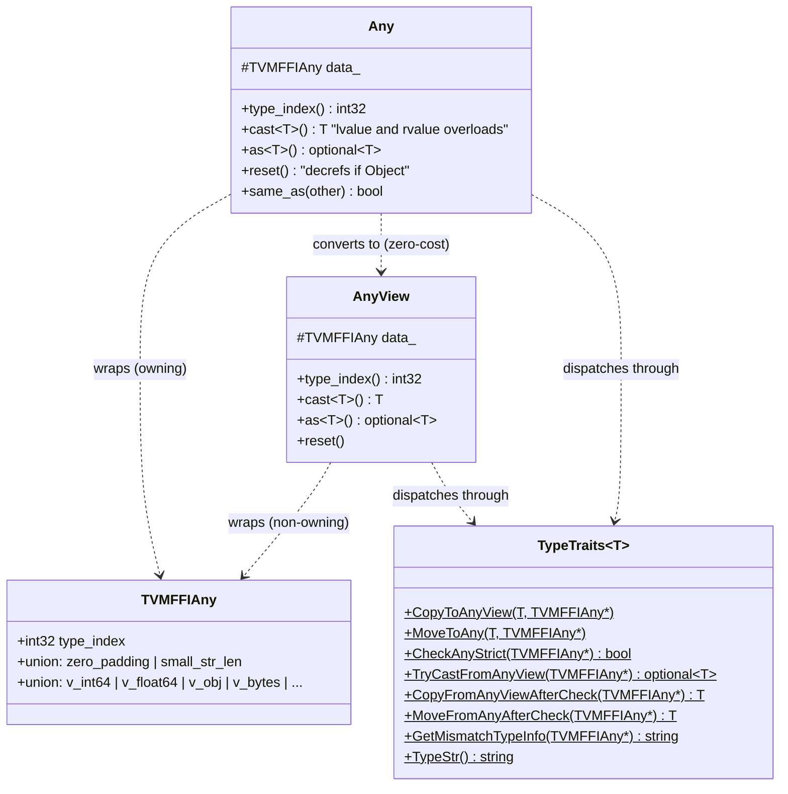

# FFI Type-Erased Value System (Any/AnyView)

**TL;DR**.
- `AnyView` is a non-owning 16-byte type-erased value view; `Any` is an owning 16-byte container that manages reference counts for Object values. Both share the same `TVMFFIAny` memory layout.
- Conversion between C++ types and `Any`/`AnyView` is driven by `TypeTraits<T>` -- a compile-time protocol with 8 required methods (`CopyToAnyView`, `MoveToAny`, `CheckAnyStrict`, `TryCastFromAnyView`, etc.).
- The key design insight: `AnyView` to `Any` conversion is not a simple copy -- it must handle ownership transfer for non-owning types (`kTVMFFIRawStr` becomes owned `String`, `kTVMFFIObjectRValueRef` moves the object, `kTVMFFIByteArrayPtr` becomes owned `Bytes`).

## Problem Statement
### Background
- The FFI needs a single value type that can hold any value (POD integers, floats, strings, or heap-allocated objects) and be passed across language boundaries via the C ABI's `TVMFFIAny` struct.
- C++ code needs type-safe access to these erased values without runtime overhead for common operations.
- Two ownership modes are needed: non-owning views for function arguments (caller keeps values alive) and owning containers for return values and storage.

### Solution
- `AnyView` wraps `TVMFFIAny` as a non-owning view. It can be constructed from any `TypeTraits`-enabled type via implicit conversion. It does not manage reference counts.
- `Any` wraps `TVMFFIAny` as an owning container. It increments reference counts for Object values on copy, decrements on destruction.
- `TypeTraits<T>` is the compile-time dispatch mechanism that controls how any C++ type converts to/from the erased representation.

### Goals
- Zero-cost conversion for POD types (int, float, bool).
- Automatic ref-count management for Object types.
- Extensible: any user type can participate by specializing `TypeTraits<T>`.
- Small-string optimization is now implemented: strings <= 7 bytes are stored inline in `TVMFFIAny.v_bytes` with `kTVMFFISmallStr`/`kTVMFFISmallBytes` type indices. See [0006-containers.md](0006-containers.md) for details.

## Design



### Key Classes, Fields and Interfaces

```python
class AnyView:
    """Non-owning type-erased value view. Same layout as TVMFFIAny (16 bytes)."""
    data_: TVMFFIAny  # protected
    # Invariant: does NOT own references. Caller must keep source values alive.
    # Invariant: sizeof(AnyView) == sizeof(TVMFFIAny) == 16 (static_assert enforced)

    def __init__(self):
        self.data_.type_index = kTVMFFINone
        self.data_.v_int64 = 0   # Invariant: padding always zeroed

    def __init__(self, value: T):  # implicit, for any TypeTraits-enabled T
        TypeTraits[T].CopyToAnyView(value, self.data_)
        # Interacts with: TypeTraits<T>::CopyToAnyView

    def cast(self, T) -> T:
        opt = TypeTraits[T].TryCastFromAnyView(self.data_)
        if not opt: raise TypeError(...)
        return opt.value()
        # Interacts with: TypeTraits<T>::TryCastFromAnyView

    def try_cast(self, T) -> Optional[T]:
        """Conversion-allowing cast: returns T if conversion is possible (e.g., int -> float)."""
        return TypeTraits[T].TryCastFromAnyView(self.data_)

    def as(self, T) -> Optional[T]:
        """Strict reinterpret: returns T only if exact type match (no conversions)."""
        if TypeTraits[T].CheckAnyStrict(self.data_):
            return TypeTraits[T].CopyFromAnyViewAfterCheck(self.data_)
        return None
        # Invariant: as<float>() on int-valued Any returns None (no int->float conversion)

    def type_index(self) -> int32: return self.data_.type_index

class Any:
    """Owning type-erased value container. Same layout as TVMFFIAny (16 bytes)."""
    data_: TVMFFIAny  # protected
    # Invariant: if type_index >= kTVMFFIStaticObjectBegin, v_obj is ref-counted and owned
    # Invariant: sizeof(Any) == sizeof(TVMFFIAny) == 16 (static_assert enforced)

    def __init__(self):
        self.data_.type_index = kTVMFFINone
        self.data_.v_int64 = 0

    def __init__(self, value: T):  # implicit, for any TypeTraits-enabled T
        TypeTraits[T].MoveToAny(move(value), self.data_)
        # Interacts with: TypeTraits<T>::MoveToAny

    def __init__(self, view: AnyView):  # convert view to owned
        self.data_ = view.data_
        InplaceConvertAnyViewToAny(self.data_)  # key ownership transfer
        # Interacts with: Object.IncRef (for object types), String ctor (for raw strings)

    def __del__(self):
        self.reset()  # decrements ref if holding an Object

    def reset(self):
        if self.data_.type_index >= kTVMFFIStaticObjectBegin:
            Object.DecRef(self.data_.v_obj)
        self.data_.type_index = kTVMFFINone
        self.data_.v_int64 = 0

    def cast(self, T) -> T:  # lvalue version
        return TypeTraits[T].TryCastFromAnyView(self.data_).value()

    def cast(self, T) -> T:  # rvalue version (move semantics)
        if TypeTraits[T].CheckAnyStrict(self.data_):
            return TypeTraits[T].MoveFromAnyAfterCheck(self.data_)  # zero-copy move
        # fallback to conversion
        return TypeTraits[T].TryCastFromAnyView(self.data_).value()

    def __eq__(self, other: Any) -> bool:
        return self.data_.type_index == other.type_index and self.data_.v_int64 == other.v_int64

    # Extension: operator AnyView() is zero-cost (just copies TVMFFIAny bits)

def InplaceConvertAnyViewToAny(data: TVMFFIAny) -> None:
    """Critical ownership-transfer logic for AnyView-to-Any conversion."""
    if data.type_index >= kTVMFFIStaticObjectBegin:
        Object.IncRef(data.v_obj)               # borrow -> own
    elif data.type_index == kTVMFFIRawStr:
        temp = String(data.v_c_str)              # copy raw str to owned String
        data.type_index = kTVMFFIStr
        data.v_obj = move(temp)
    elif data.type_index == kTVMFFIByteArrayPtr:
        temp = Bytes(data.v_ptr)                 # copy to owned Bytes
        data.type_index = kTVMFFIBytes
        data.v_obj = move(temp)
    elif data.type_index == kTVMFFIObjectRValueRef:
        obj = data.v_ptr                         # move rvalue ref
        data.type_index = obj.type_index
        data.v_obj = move(obj)
    # Invariant: after this call, data is safe to use as an owned Any
```

#### TypeTraits Protocol

```python
class TypeTraits(Generic[T]):
    """Compile-time protocol controlling type <-> Any conversion."""
    convert_enabled: bool = True        # can this type be used with Any/AnyView?
    storage_enabled: bool = True        # can this type be stored in containers?
    field_static_type_index: int32      # type index for reflection annotations

    @staticmethod
    def CopyToAnyView(src: T, result: TVMFFIAny) -> None: ...
        # Writes type_index + value to result. Non-owning: no ref counting.

    @staticmethod
    def MoveToAny(src: T, result: TVMFFIAny) -> None: ...
        # Writes type_index + value to result. Owning: transfers ownership.
        # Interacts with: Object.IncRef for ObjectRef types

    @staticmethod
    def CheckAnyStrict(src: TVMFFIAny) -> bool: ...
        # Returns True if src was produced by MoveToAny of this exact type.
        # Invariant: strict type check (int stored in Any fails CheckAnyStrict<float>)
        # Renamed from: CheckAnyStorage

    @staticmethod
    def TryCastFromAnyView(src: TVMFFIAny) -> Optional[T]: ...
        # Returns value if conversion is possible (may involve implicit casts).
        # Example: int64 in Any can be TryCast to float64
        # Renamed from: TryConvertFromAnyView

    @staticmethod
    def CopyFromAnyViewAfterCheck(src: TVMFFIAny) -> T: ...
        # Zero-copy extraction after CheckAnyStrict returns True (lvalue path).
        # Renamed from: CopyFromAnyStorageAfterCheck

    @staticmethod
    def MoveFromAnyAfterCheck(src: TVMFFIAny) -> T: ...
        # Zero-copy extraction after CheckAnyStrict returns True (rvalue path).
        # Renamed from: MoveFromAnyStorageAfterCheck

    @staticmethod
    def TypeStr() -> str: ...
        # Human-readable type name for error messages.

    # Extension: specialize TypeTraits<T> for any new C++ type to enable FFI participation

# Built-in specializations:
# TypeTraits<int/int64>:  type_index=kTVMFFIInt, stores in v_int64
# TypeTraits<bool>:       type_index=kTVMFFIBool, stores in v_int64 (allows implicit int->bool)
# TypeTraits<float/double>: type_index=kTVMFFIFloat, stores in v_float64
# TypeTraits<void*>:      type_index=kTVMFFIOpaquePtr, stores in v_ptr
# TypeTraits<DLDevice>:   type_index=kTVMFFIDevice, stores in v_device
# TypeTraits<DLTensor*>:  type_index=kTVMFFIDLTensorPtr, AnyView only (storage_enabled=false)
# TypeTraits<ObjectRef>:  type_index from object, stores v_obj pointer
# TypeTraits<Optional<T>>: None or delegated to TypeTraits<T>
```

### Contracts, Assumptions and Invariants
- **Layout identity**: `sizeof(AnyView) == sizeof(Any) == sizeof(TVMFFIAny) == 16`. This enables zero-cost reinterpret casts between the C and C++ representations in function call paths.
- **CheckAnyStrict vs TryCastFromAnyView**: `CheckAnyStrict` is strict (returns true only for exact type match after `MoveToAny`). `TryCastFromAnyView` allows implicit conversions (e.g., int to float). Containers use `CheckAnyStrict` to decide if recursive conversion is needed.
- **AnyView-only types**: `kTVMFFIRawStr`, `kTVMFFIByteArrayPtr`, `kTVMFFIDLTensorPtr`, and `kTVMFFIObjectRValueRef` can only appear in `AnyView`, never in `Any`. The `InplaceConvertAnyViewToAny` function handles conversion.
- **Padding zeroing**: `v_int64 = 0` is set on reset/construction to ensure consistent hashing and comparison behavior.
- **uint64_t overflow check** (86bbddfd): `TypeTraits<Int>::CopyToAnyView` for unsigned types >= 64 bits rejects values exceeding `INT64_MAX` by throwing `OverflowError`. This prevents silent wrapping of large `uint64_t`/`size_t` values to negative `int64_t`. Hash values that legitimately span the full uint64 range must use explicit bitcast to `int64_t` before storage.

### Extension Points
- **Custom TypeTraits**: Any C++ type can participate in FFI by specializing `TypeTraits<T>`. Set `use_default_type_traits_v<T> = false` and implement the full protocol.
- **FallbackOnlyTraitsBase**: For types that can only be converted from (not stored in) `Any`, derive from `FallbackOnlyTraitsBase<T, FallbackTypes...>` and implement `ConvertFallbackValue`.
- **ObjectRefWithFallbackTraitsBase**: For ObjectRef types that accept fallback conversions. Note: `String` and `Bytes` no longer use this (they are no longer ObjectRef subclasses; see [0006-containers.md](0006-containers.md)).

### Usage Examples

#### Type-Erased Value Storage and Retrieval
**Context**: Storing and extracting values in the type-erased container.
```cpp
// POD values: zero overhead, no heap allocation
Any a = 42;                   // type_index = kTVMFFIInt, v_int64 = 42
Any b = 3.14;                 // type_index = kTVMFFIFloat, v_float64 = 3.14
int x = a.cast<int>();        // x == 42
double y = a.cast<double>();  // y == 42.0 (implicit int->float conversion)

// Object values: automatic ref counting
Any c = String("hello");      // type_index = kTVMFFIStr, v_obj = ref-counted StringObj
String s = c.cast<String>();  // extracts with IncRef

// Move semantics for zero-copy extraction
String s2 = std::move(c).cast<String>();  // MoveFromAnyAfterCheck: no IncRef/DecRef
```

## Implementation Notes
- `Any` copy constructor increments ref count for Object values. Move constructor steals the pointer and zeroes the source. Both use copy-and-swap idiom for exception safety.
- `AnyHash` and `AnyEqual` provide string-aware hashing and per-type extensible dispatch (39d9b2b4):
  - Short strings: hash via type_index + content bytes.
  - Static object types: check `TVMFFITypeAttrColumn["__any_hash__"][type_index]`. Two dispatch modes: (a) `kTVMFFIOpaquePtr` holding `int64_t(*)(const Any&)` for zero-overhead fast path, or (b) `kTVMFFIFunction` for flexibility via `cpp_call`/`safe_call`.
  - Fallback: `StableHashCombine(type_index, v_uint64)` (pointer identity).
  - `AnyEqual` follows the same column lookup pattern with `"__any_equal__"`.
  - Register per-type overrides via `TypeAttrDef<T>().attr("__any_hash__", reinterpret_cast<void*>(&fn))`.
  - `MoveFromSafeCallRaised()` / `SetSafeCallRaised()` extracted to `error.h` as shared helpers for safe_call error propagation in hash/equal dispatch.
- The rvalue `cast()` overload on `Any` checks `CheckAnyStrict` first for fast-path extraction, then falls back to `TryCastFromAnyView` for conversions.

## Alternatives & Trade-offs
### Non-owning AnyView vs. Always-owning Any
- Pros of split design: Function arguments can use `AnyView` (no ref counting overhead on the hot call path). Only return values and storage need `Any`.
- Cons: Two types to reason about. The `InplaceConvertAnyViewToAny` function is subtle and handles multiple edge cases.
### TypeTraits Protocol vs. Virtual Dispatch
- Pros of TypeTraits: All dispatch resolved at compile time. Zero runtime overhead for type conversions. SFINAE enables/disables operations per type.
- Cons: Requires template specialization for each new type. Error messages on trait violation are template errors.

## Evidence
| Commit | Scope | Contribution |
|--------|-------|-------------|
| 7d34eb8 | ffi/any, ffi/type-traits | Introduced Any/AnyView and TypeTraits protocol |
| 37a2e7c5 | ffi/any | Split `as` (strict) from `try_cast`/`cast` (converting); renamed 4 TypeTraits methods |
| f7311e49 | ffi/type-traits | Added enum TypeTraits specialization |
| 49e2ed4a | ffi/any, ffi/type-traits | Small-string optimization: TypeTraits<String/Bytes> rewritten, `zero_padding` invariant, cross-type SmallStr/Str equality |
| 39d9b2b4 | ffi/any, ffi/reflection | Per-type `__any_hash__`/`__any_equal__` dispatch via TypeAttr columns; `MoveFromSafeCallRaised`/`SetSafeCallRaised` extracted to error.h |

## Related Design Docs & ADRs
- [0001-c-abi.md](0001-c-abi.md) -- C-level `TVMFFIAny` struct that `Any`/`AnyView` wrap
- [0003-object-system.md](0003-object-system.md) -- Object ref counting consumed by `Any`
- [0004-function-system.md](0004-function-system.md) -- Functions accept `AnyView*` args, return `Any`
- [0007-reflection.md](0007-reflection.md) -- TypeAttr column system powers `__any_hash__`/`__any_equal__` per-type dispatch
