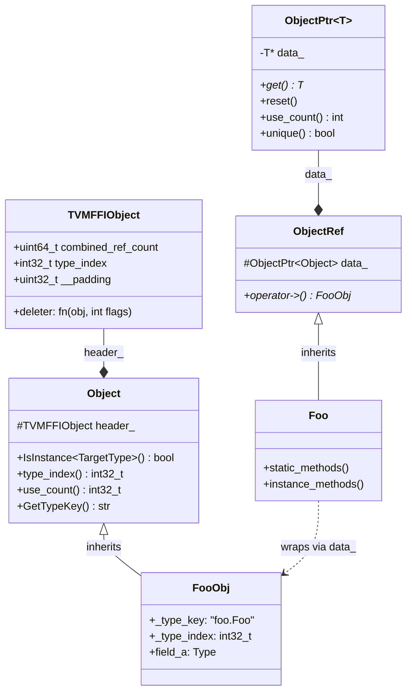

# Object System

**TL;DR**
- Provides `Object` (base heap node), `ObjectPtr<T>` (RAII ref-counting smart pointer), and `ObjectRef` (user-facing value wrapper) — the three-layer pattern that all TVM FFI object types follow.
- Type-checking uses a **fast slot range** check first (`IsInstance` is O(1) for the common case), falling back to the global `TVMFFITypeInfo` ancestry table only when the slot range overflows.
- Two declaration macros encode the type's slot reservation and static vs. dynamic index choice; `make_object<T>()` wires up the type index and deleter at construction time so no virtual dispatch is needed.

## Problem Statement

### Background
A machine learning framework needs a polymorphic heap-object system that:
1. Works without C++ RTTI (which is unstable across DLL boundaries).
2. Supports fast `IsInstance<T>` checks for deeply nested type hierarchies (IR nodes, operators, schedules).
3. Is accessible from C (via `TVMFFIObjectHandle`) without exposing C++ internals.

### Solution
Every object begins with a `TVMFFIObject` header (16 bytes) containing `type_index`, `ref_counter`, and `deleter`. The `Object` C++ class wraps this header and provides `IsInstance`, `use_count`, and `GetTypeKey`. Subclasses declare their type info via macros; `make_object<T>` fills in the header fields at allocation time.

### Goals
- Minimal header: `type_index` + atomic `ref_counter` + `deleter` function pointer.
- `IsInstance<T>` in O(1) for typical hierarchies via child-slot fast path.
- Compile-time static type indices for built-in types; runtime-allocated indices for user-defined types.
- Non-goal: multiple inheritance in the object hierarchy (single-parent tree only).

## Design

### Three-Layer Pattern



### Key Classes, Fields and Interfaces

```python
class Object:
    """Base for all ref-counted heap objects. First 24 bytes = TVMFFIObject header (was 16 before commit ca9c3d1)."""
    header_: TVMFFIObject   # protected; first field, at byte offset 0

    # --- Instance methods ---
    def IsInstance(self, TargetType: type) -> bool:
        # Fast path: TargetType._type_index <= header_.type_index <= _type_index + child_slots
        # Slow path: check TVMFFITypeInfo.type_ancestors[] table
        # Interacts with: TVMFFIGetTypeInfo (slow path), TargetType._type_child_slots
        ...
    def type_index(self) -> int32_t: return header_.type_index
    def use_count(self) -> uint64_t:
        # Returns strong count = low 32 bits of combined_ref_count (commit 43d13e86)
        return AtomicLoadRelaxed(header_.combined_ref_count) & kCombinedRefCountMaskUInt32
    def GetTypeKey(self) -> str: ...   # expensive: calls TVMFFIGetTypeInfo

    # --- Class-level constants (every subclass MUST define) ---
    _type_key: str          # Unique string identifier, e.g. "ffi.Function" (was "object.*" before commit 0966c368)
    _type_index: int32_t    # kTVMFFIDynObjectBegin(-1) means dynamic alloc at runtime
    _type_final: bool       # True means no further subclasses (enables IsInstance short-circuit)
    _type_child_slots: int  # Number of consecutive type indices reserved for children
    _type_child_slots_can_overflow: bool  # If True, extra children spill into slow path
    _type_depth: int32_t    # depth in inheritance tree (Object=0)
    _type_mutable: bool = False  # True = mutable container (e.g. List, Dict); affects copy semantics

    # Structural equality/hash kind (used by StructuralEqual/StructuralHash):
    _type_s_eq_hash_kind: TVMFFISEqHashKind = kTVMFFISEqHashKindUnsupported
    # Subclasses set this to opt in: e.g. _type_s_eq_hash_kind = kTVMFFISEqHashKindTreeNode
    # Stored in TVMFFITypeMetadata.structural_eq_hash_kind at registration time

    # REMOVED flags (no longer on Object base class):
    # _type_has_method_visit_attrs — removed (commit da476230)
    # _type_has_method_sequal_reduce — removed (commit e52aed53)
    # _type_has_method_shash_reduce  — removed (commit e52aed53)

    # --- Combined ref-count constants (commit 43d13e86) ---
    # kCombinedRefCountStrongOne:   uint64_t = 1         # increment/decrement unit for strong counter
    # kCombinedRefCountWeakOne:     uint64_t = 1 << 32   # increment/decrement unit for weak counter
    # kCombinedRefCountBothOne:     uint64_t = (1 << 32) | 1  # initial value (strong=1, weak=1)
    # kCombinedRefCountMaskUInt32:  uint64_t = (1 << 32) - 1  # mask to isolate strong count

    # --- Private ---
    def IncRef(self) -> None:
        AtomicFetchAdd(header_.combined_ref_count, kCombinedRefCountStrongOne, RELAXED)
    def DecRef(self) -> None:
        # Single atomic covers common path (commit 43d13e86 — was two atomics before)
        count_before = AtomicFetchSub(header_.combined_ref_count, kCombinedRefCountStrongOne, RELEASE)
        if count_before == kCombinedRefCountBothOne:
            # Fast path: strong=1→0 and weak=1→0 simultaneously — destructor + free in one call
            AtomicThreadFence(ACQUIRE)
            header_.deleter(header_, kTVMFFIObjectDeleterFlagBitMaskBoth)
        elif (count_before & kCombinedRefCountMaskUInt32) == kCombinedRefCountStrongOne:
            # Strong=1→0, but weak>1 — destructor only; memory freed later by DecWeakRef
            header_.deleter(header_, kTVMFFIObjectDeleterFlagBitMaskStrong)
            if AtomicFetchSub(header_.combined_ref_count, kCombinedRefCountWeakOne, RELEASE) == kCombinedRefCountWeakOne:
                AtomicThreadFence(ACQUIRE)
                header_.deleter(header_, kTVMFFIObjectDeleterFlagBitMaskWeak)
    # Interacts with: ObjectPtr<T> (calls IncRef/DecRef), make_object<T>

    # Weak reference management (new in commit ca9c3d1, merged counter in commit 43d13e86):
    def IncWeakRef(self) -> None:
        AtomicFetchAdd(header_.combined_ref_count, kCombinedRefCountWeakOne, RELAXED)
    def DecWeakRef(self) -> None:
        if AtomicFetchSub(header_.combined_ref_count, kCombinedRefCountWeakOne, RELEASE) == kCombinedRefCountWeakOne:
            AtomicThreadFence(ACQUIRE)
            header_.deleter(header_, kTVMFFIObjectDeleterFlagBitMaskWeak)

    def TryPromoteWeakPtr(self) -> bool:
        # CAS loop on combined_ref_count: atomically increment strong (low 32 bits) from > 0 only
        # Returns False if object is already destroyed (strong count == 0)
        # Used by WeakObjectPtr.lock() to safely race with concurrent DecRef
        # Concurrent weak count changes (upper 32 bits) do NOT interfere with the strong CAS
        old = AtomicLoad(header_.combined_ref_count, RELAXED)
        while (old & kCombinedRefCountMaskUInt32) != 0:
            if CAS(header_.combined_ref_count, old, old + kCombinedRefCountStrongOne, ACQ_REL):
                return True
            old = AtomicLoad(header_.combined_ref_count, RELAXED)
        return False
    # Interacts with: WeakObjectPtr<T>.lock(), ObjectPtr<T> (calls IncRef/DecRef), make_object<T>

class ObjectPtr(Generic[T]):
    """RAII smart pointer for Object subclasses. Analogous to std::shared_ptr."""
    data_: T*   # raw pointer to Object subclass; nullptr → empty

    def get(self) -> T*: return data_
    def reset(self) -> None:
        if data_: data_.DecRef(); data_ = nullptr
    def use_count(self) -> int: ...
    def unique(self) -> bool: return use_count() == 1
    # Invariant: data_->ref_counter >= 1 while any ObjectPtr<T> holds it
    # Interacts with: Object.IncRef/DecRef, make_object<T> (transfers ownership)
    # Extension: ObjectPtr<Base> can be constructed from ObjectPtr<Derived>

class WeakObjectPtr(Generic[T]):
    """Non-owning weak reference to an Object; parallel to ObjectPtr<T>. New in commit ca9c3d1."""
    data_: T*   # raw pointer; does NOT increment strong_ref_count; increments weak_ref_count only

    def __init__(self, strong: ObjectPtr[T]) -> None:
        # Calls Object::IncWeakRef; weak_ref_count starts at 1 for every new object
        # Interacts with: Object.IncWeakRef
    def lock(self) -> Optional[ObjectPtr[T]]:
        # Returns strong ObjectPtr if object still alive; uses TryPromoteWeakPtr CAS
        # Returns None if strong_ref_count already reached 0
        # Invariant: returned ObjectPtr already holds incremented strong_ref_count
        # Interacts with: Object::TryPromoteWeakPtr
    def expired(self) -> bool:
        # True iff strong_ref_count == 0
    def reset(self) -> None:
        # Calls Object::DecWeakRef; if weak_ref_count reaches 0, memory is freed
    def use_count(self) -> int:
        # Returns strong_ref_count (0 if expired)
    # Extension: WeakObjectPtr<Derived> implicitly converts to WeakObjectPtr<Base>
    # Interacts with: ObjectPtr<T> (lock returns), Object.DecWeakRef/IncWeakRef

class ObjectRef:
    """User-facing RAII wrapper. Produced by TVM_FFI_DEFINE_OBJECT_REF_METHODS_NULLABLE or _NOTNULLABLE macro."""
    data_: ObjectPtr[Object]   # protected

    def __init__(self, tag: UnsafeInit) -> None:
        """Null-init constructor. Added in commit 472e10c."""
        self.data_ = nullptr
        # Invariant: caller must assign data_ before first use

    def defined(self) -> bool: return data_ != nullptr
    def same_as(self, other: ObjectRef) -> bool: return data_ == other.data_
    def operator_arrow(self) -> FooObj*: return static_cast[FooObj*](data_.get())
    def as_(self, T: type) -> Optional[T]:
        # Updated in commit 472e10c: no longer calls T(data_) directly
        # Now: ref = T(UnsafeInit{}); ref.data_ = data_; return ref
        ...
    # Interacts with: Any/AnyView (ObjectRef → Any via TypeTraits), make_object<T>
    # Extension: subclass ObjectRef to create the user-facing Foo type

struct UnsafeInit:
    """Tag type for explicitly unsafe null-init of any ObjectRef subtype. Added in commit 472e10c.
    Used in controlled teardown/init paths where the caller will immediately assign data_.
    """
    # Invariant: only pass to constructors in controlled paths
    # Interacts with: ObjectRef(UnsafeInit), all TVM_FFI_DEFINE_*_OBJECT_REF_METHODS macros,
    #                 ObjectCreatorUnsafeInit<T> (reflection/registry.h)

class ObjectUnsafe:
    """Friend struct in details:: namespace. Provides raw access to ObjectRef internals."""
    @staticmethod
    def ObjectRefFromObjectPtr(T: type, ptr: ObjectPtr[Object]) -> T:
        """Canonical factory for constructing any ObjectRef subtype from raw ObjectPtr.
        Replaces all direct T(ObjectPtr<Object>) call sites since commit 472e10c.
        """
        ref = T(UnsafeInit{})
        ref.data_ = ptr
        return ref
        # Invariant: ptr's runtime type_index must be compatible with T::ContainerType
        # Interacts with: cast.h (GetRef, GetObjectPtr), type_traits.h, function_details.h, optional.h
```

### Macro Expansions

The macro set was streamlined in commit a08fa6eb. The new naming scheme is:
- `TVM_FFI_DECLARE_OBJECT_INFO(TypeKey, T, P)` — standard non-final class; sets `_type_key = TypeKey` then calls `_PREDEFINED_TYPE_KEY` variant
- `TVM_FFI_DECLARE_OBJECT_INFO_FINAL(TypeKey, T, P)` — sets `_type_child_slots=0, _type_final=true`
- `TVM_FFI_DECLARE_OBJECT_INFO_STATIC(TypeKey, T, P)` — static index (built-in types); returns `_type_index` directly from `RuntimeTypeIndex()`
- `TVM_FFI_DECLARE_OBJECT_INFO_PREDEFINED_TYPE_KEY(T, P)` — for root/predefined types where `_type_key` is already set by the caller

Old names removed: `TVM_FFI_DECLARE_BASE_OBJECT_INFO`, `TVM_FFI_DECLARE_FINAL_OBJECT_INFO`, `TVM_FFI_DECLARE_STATIC_OBJECT_INFO`.

**IMPORTANT — Auto-registration change (commit 9ac31216)**: Before commit 9ac31216, `TVM_FFI_DECLARE_OBJECT_INFO_STATIC` injected `static inline int32_t _register_type_index = _GetOrAllocRuntimeTypeIndex()` which silently registered the type when the header was included. After commit 9ac31216, this field is **removed**; `_GetOrAllocRuntimeTypeIndex()` runs lazily and `RuntimeTypeIndex()` returns the compile-time constant directly. **Consequence**: custom objects MUST be explicitly registered via `reflection::ObjectDef<T>()` or a direct `_GetOrAllocRuntimeTypeIndex()` call in a `.cc` file — otherwise `IsA<T>()` and `as<T>()` casts will silently fail.

For the dynamic variant `TVM_FFI_DECLARE_OBJECT_INFO`, the `static inline int32_t _type_index` field is also removed; `RuntimeTypeIndex()` now calls `_GetOrAllocRuntimeTypeIndex()` on each call (lazy, idempotent).

Built-in depth-1 types are all pre-registered in `TypeTable::TypeTable()` constructor via `ReserveDepthOneObjectTypeIndex`, which is a thin wrapper around `GetOrAllocTypeIndex` with `type_depth=1, parent=kTVMFFIObject`.

```python
# TVM_FFI_DECLARE_OBJECT_INFO("foo.Foo", FooObj, ParentObj)
# Injects _type_key at declare time; then generates:
class FooObj:
    _type_key: str = "foo.Foo"  # now set by DECLARE macro, not caller

    @staticmethod
    def RuntimeTypeIndex() -> int32_t:
        return _GetOrAllocRuntimeTypeIndex()

    @staticmethod
    def _GetOrAllocRuntimeTypeIndex() -> int32_t:
        # Sets tindex (maybe_unused) = TVMFFIGetOrAllocTypeIndex(...)
        # Returns FooObj._type_index (compile-time constant for static types)
        # NOTE: no longer stored as static inline field — lazy only
        ...

    # REMOVED in commit 9ac31216 (dynamic):
    # static inline int32_t _type_index = _GetOrAllocRuntimeTypeIndex()  ← DLL-load-time side effect GONE

# TVM_FFI_DECLARE_OBJECT_INFO_STATIC("ffi.Function", FunctionObj, Object)
# Used for built-in types with compile-time-known static indices.
# RuntimeTypeIndex() returns _type_index directly (no dynamic allocation).
# REMOVED in commit 9ac31216: static inline int32_t _register_type_index = _GetOrAllocRuntimeTypeIndex()

# TypeTable explicit builtin registration (commit 9ac31216):
# TypeTable() constructor now calls ReserveDepthOneObjectTypeIndex for all 10 depth-1 builtins:
# Str, Bytes, Error, Function, Shape, Tensor, Array, Map, Module, OpaquePyObject
# Previously only OpaquePyObject was explicitly registered; others relied on the removed static field.

# StaticTypeKey new entry (commit 9ac31216):
# StaticTypeKey::kTVMFFIError = "ffi.Error"  ← was inline string literal in error.h

# TypeTable::GetRegisteredTypeKeys() (commit 8fcd924):
# Returns Array<String> of all type keys currently in the global TypeTable.
# Registered as global function: "ffi.GetRegisteredTypeKeys"
# Python wrapper: tvm_ffi.registry.get_registered_type_keys() -> list[str]
# Primary use case: stub generation querying C++-registered types
# Interacts with: TypeTable::Global(), tvm_ffi.stub (codegen enumerates all types)

# TVM_FFI_DEFINE_OBJECT_REF_METHODS_NULLABLE(Foo, ParentRef, FooObj)
# Replaces TVM_FFI_DEFINE_OBJECT_REF_METHODS + TVM_FFI_DEFINE_MUTABLE_OBJECT_REF_METHODS.
# _type_is_nullable = true. operator->() and get() return mutable ptr when _type_mutable=true.
# Generates (updated in commit 472e10c):
class Foo(ParentRef):
    def __init__(self): super().__init__()                     # default (nullptr)
    def __init__(self, ptr: ObjectPtr[FooObj]): ...            # typed ObjectPtr
    def __init__(self, tag: UnsafeInit): super().__init__(tag) # null-init for controlled paths
    def __init__(self, other: Foo): ...                        # copy
    def operator_arrow(self) -> FooObj*:
        # Returns FooObj* (mutable) if _type_mutable=true, else const FooObj*
        # Determined by std::conditional_t<_type_mutable, FooObj*, const FooObj*>
        return static_cast[FooObj*](self.data_.get())

# TVM_FFI_DEFINE_OBJECT_REF_METHODS_NOTNULLABLE(Foo, ParentRef, FooObj)
# Replaces TVM_FFI_DEFINE_NOTNULLABLE_OBJECT_REF_METHODS + TVM_FFI_DEFINE_MUTABLE_NOTNULLABLE.
# _type_is_nullable = false; no default constructor.
# ObjectPtr<Object> constructor REMOVED (commit 472e10c): use ObjectUnsafe::ObjectRefFromObjectPtr<Foo>(ptr).
class Foo(ParentRef):
    def __init__(self, tag: UnsafeInit): super().__init__(tag) # null-init only
    # Used for: Shape, AccessPath, Function, Error, Module, and other non-nullable refs
    # Interacts with: TypeTraits<T>::CheckAnyStrict checks _type_is_nullable
```

### make_object Factory

```python
def make_object(T: type, *args, **kwargs) -> ObjectPtr[T]:
    """Allocate and initialize a T on the heap, wiring up the Object header."""
    # Allocation: SimpleObjAllocator.Handler.New uses AlignedAlloc<alignof(T)>(sizeof(T))
    # since commit 6fb42a77 (replaced StorageType wrapper struct)
    obj: T* = AlignedAlloc[alignof(T)](sizeof(T))
    new (obj) T(*args, **kwargs)  # placement-new
    # Wire up header:
    obj.header_.type_index = T._GetOrAllocRuntimeTypeIndex()
    obj.header_.__padding = 0           # explicitly zeroed (commit f9179ec2)
    obj.header_.combined_ref_count = kCombinedRefCountBothOne  # strong=1, weak=1 (commit 43d13e86)
    # Previously: strong_ref_count=0, weak_ref_count=0 then IncRef both (pre-43d13e86)
    obj.header_.deleter = ObjDeleter[T]  # deleter takes (void*, int flags)
    ptr = ObjectPtr[T].__from_raw(obj)
    return ptr
    # Interacts with: T._GetOrAllocRuntimeTypeIndex (sets type_index),
    #                 AlignedAlloc / AlignedFree (SimpleObjAllocator.details::),
    #                 ObjectPtr (takes ownership)
    # Invariant: after make_object, combined_ref_count == kCombinedRefCountBothOne (strong=1, weak=1)
```

### IsInstance Fast Path

```python
def IsObjectInstance(TargetType: type, object_type_index: int32_t) -> bool:
    # Restructured to chained if-constexpr/else-if to eliminate dead branches at compile time
    # (commit 837800e7).
    if TargetType == Object:
        return True                        # Fast path 1: Object accepts everything
    elif TargetType._type_final:
        # Fast path 2: exact match only (branch eliminated at compile time when _type_final=True)
        return object_type_index == TargetType.RuntimeTypeIndex()
    else:
        target_idx = TargetType.RuntimeTypeIndex()
        # Fast path 3: slot range check O(1)
        if target_idx <= object_type_index <= target_idx + TargetType._type_child_slots:
            return True
        # Slow path: only compiled when _type_child_slots_can_overflow
        # Uses direct pointer dereference — no TVMFFIGetTypeInfo() call
        info = TVMFFIGetTypeInfo(object_type_index)
        if info.type_depth <= TargetType._type_depth:
            return False
        # type_ancestors is now TVMFFITypeInfo** (pointer array, not int32_t*) since commit 837800e7
        return info.type_ancestors[TargetType._type_depth].type_index == target_idx
    # Interacts with: TVMFFITypeInfo.type_ancestors (pointer array, direct deref in slow path)
    #                 _type_child_slots (fast path gate)
```

## Contracts, Assumptions and Invariants

- `TVMFFIObject` header is always the **first** field of every `Object` subclass — the C ABI relies on `(char*)obj == (char*)&obj.header_` being true.
- `make_object<T>` is the only legal way to create a new object; direct `new T()` skips header initialization and produces an unusable object.
- `WeakObjectPtr::lock()` may return `nullptr` even when the object pointer itself is non-null — strong_ref_count can reach 0 between the load and the CAS. Always check the return value of `lock()`.
- The `implicit weak` invariant: every `ObjectPtr`-held object starts with `weak_ref_count = 1`. This means even objects with no explicit `WeakObjectPtr` always trigger `kBoth` in the common fast path (one atomic decrement covers both destructor and free).
- `ObjectRef.data_` is nullable; callers must check `defined()` before dereferencing.
- Single-parent inheritance only: the ancestor table is a flat array indexed by depth, not a DAG.
- A `_type_final = true` class uses exact-match `IsInstance` and costs zero table lookups. Use it for leaf types.
- `_type_child_slots_can_overflow = false` means child types that exceed the slot budget will NOT be detected by `IsInstance` from the parent class — a logic bug if misused.
- **TypeTable immortal singleton (commit 4206f16)**: `TypeTable::Global()` is heap-allocated via `static TypeTable* inst = new TypeTable()` and intentionally never freed by the C++ runtime. This guarantees validity through all global/static destructors at program shutdown, preventing use-after-free when other destructors call into the type table. Memory is reclaimed by the OS at process exit. The old `static TypeTable inst` pattern was vulnerable to LIFO static destructor ordering.

### Extension Points
- Define a new FFI object type by: inheriting `Object`, using `TVM_FFI_DECLARE_OBJECT_INFO("key", FooObj, ParentObj)` (or the `_STATIC`/`_FINAL` variants), wrapping with `ObjectRef` + `TVM_FFI_DEFINE_OBJECT_REF_METHODS_NULLABLE` (or `_NOTNULLABLE`). Since commit a08fa6eb, `_type_key` is injected by the `DECLARE` macro — no separate assignment needed.
- Increase `_type_child_slots` on frequently-subclassed base types to keep `IsInstance` in the fast path.
- **Registration is now explicit (commit 9ac31216)**: after declaring the macro, add `reflection::ObjectDef<FooObj>()` inside a `TVM_FFI_STATIC_INIT_BLOCK()` in a `.cc` file. Do not rely on header include order for registration.

### Usage Examples

#### Define and instantiate a new FFI object type (C++)
**Context**: creating a custom IR node that participates in the TVM object system.

```cpp
// 1. Define the data node (Obj)
//    New macro set (commit a08fa6eb): _type_key injected by DECLARE macro, no separate assignment.
class MyNodeObj : public Object {
 public:
  int value;
  // Old style (removed): static constexpr const char* _type_key = "my.MyNode";
  //                       TVM_FFI_DECLARE_FINAL_OBJECT_INFO(MyNodeObj, Object);
  // New style:
  TVM_FFI_DECLARE_OBJECT_INFO_FINAL("my.MyNode", MyNodeObj, Object);
  // ^ expands to: _type_key = "my.MyNode"; _type_child_slots=0; _type_final=true;
  //               + RuntimeTypeIndex() + _GetOrAllocRuntimeTypeIndex()
};

// 2. Define the ref wrapper (nullable — callers may hold null MyNode)
class MyNode : public ObjectRef {
 public:
  explicit MyNode(int value) {
    auto node = make_object<MyNodeObj>();
    node->value = value;
    data_ = node;
  }
  // Old: TVM_FFI_DEFINE_OBJECT_REF_METHODS(MyNode, ObjectRef, MyNodeObj)
  // New:
  TVM_FFI_DEFINE_OBJECT_REF_METHODS_NULLABLE(MyNode, ObjectRef, MyNodeObj);
  // ^ emits: default ctor, ObjectPtr<MyNodeObj> ctor, UnsafeInit ctor,
  //          copy/move/assign, operator->() returning const MyNodeObj*
};

// 3. Use it
MyNode n(42);
assert(n->value == 42);
assert(n->IsInstance<MyNodeObj>());   // true — exact match (final type, _type_final=true)
assert(n->IsInstance<Object>());       // true — slot check passes
```

#### WeakObjectPtr — breaking cyclic object references
**Context**: holding a non-owning reference that doesn't prevent destruction (new in commit ca9c3d1).

```cpp
// Create a strong reference
ObjectPtr<TIntObj> strong = make_object<TIntObj>(42);

// Obtain a weak reference (does NOT keep object alive)
WeakObjectPtr<TIntObj> weak(strong);

// Promote back to strong while object is alive
ObjectPtr<TIntObj> locked = weak.lock();  // returns non-null ObjectPtr
assert(locked->value == 42);
assert(strong.use_count() == 2);

// Drop all strong refs; weak ref remains, but destructor fires
strong.reset();
locked.reset();
assert(weak.expired());
assert(weak.lock() == nullptr);  // memory still alive until weak.reset()
// Memory freed when weak.reset() or ~WeakObjectPtr fires (weak_ref_count → 0)
```

Custom deleter showing two-phase lifecycle (signature changed to `void*` in commit 24125d0;
`AlignedFree` replaces `delete StorageType*` since commit 6fb42a77):
```cpp
static void Deleter_(void* objptr, int flags) {
    T* tptr = ObjectUnsafe::RawObjectPtrFromUnowned<T>(static_cast<TVMFFIObject*>(objptr));
    if (flags & kTVMFFIObjectDeleterFlagBitMaskStrong) {
        tptr->T::~T();   // destructor: release owned resources
    }
    if (flags & kTVMFFIObjectDeleterFlagBitMaskWeak) {
        // Old (pre-6fb42a77): delete reinterpret_cast<StorageType*>(tptr)
        details::AlignedFree(static_cast<void*>(tptr));  // free raw aligned memory
    }
}
```

#### Cross-layer: pass an Object to Python via Any
**Context**: returning a C++ object from a registered function so Python can receive it.

```cpp
// New function-style syntax (commit 7b813f8bc6a5):
TVM_FFI_STATIC_INIT_BLOCK() {
    namespace refl = tvm::ffi::reflection;
    refl::GlobalDef().def("my.create_node", []() -> MyNode {
        return MyNode(99);
    });
}
// Old style (removed): TVM_FFI_STATIC_INIT_BLOCK({ ... });
// Python: node = tvm_ffi.get_global_func("my.create_node")()
// The MyNode is boxed into Any (type_index = MyNodeObj.RuntimeTypeIndex())
// and Python sees it as an ObjectRef wrapping a MyNodeObj
```

## Implementation Notes
- `TVMFFIObject` header is 24 bytes (was 16 before commit ca9c3d1). Layout evolution: ca9c3d1 added weak_ref_count(u32) at offset 4; 13436f0 narrowed strong from u64→u32; 43d13e86 merged both into `combined_ref_count(u64)` at offset 0 (strong=low 32 bits, weak=high 32 bits). The `type_index` field is at offset 8 and no longer shares a prefix with `TVMFFIAny.type_index`. `__padding` at offset 12 is always zero after construction (commit f9179ec2).
- `ObjectPtr::IncRef` uses relaxed atomic increment (add kCombinedRefCountStrongOne=1 to combined_ref_count). `DecRef` uses a single atomic fetch-sub on the full 64-bit word; the common case (strong=1 and weak=1) is detected by comparing the old value to `kCombinedRefCountBothOne` in one branch — no separate weak counter read needed (commit 43d13e86 optimization). An acquire fence is issued only when the strong count reaches 0.
- When the strong count drops to 0 and weak was also 1 (`count_before == kCombinedRefCountBothOne`): the deleter is called once with `kBoth` to destructor + free in one shot (fast path). Otherwise only `kStrong` fires; the deferred `kWeak` fires when the last `WeakObjectPtr` is destroyed.
- `SimpleObjAllocator` uses `details::AlignedAlloc<alignof(T)>(size)` (commit 6fb42a77) instead of `new StorageType()`. For array objects (`ArrayHandler`), allocation size is rounded to `alignof(ArrayType)` instead of `sizeof(ArrayType)`, saving up to `sizeof(ArrayType)-alignof(ArrayType)` bytes per allocation. `AlignedFree(void*)` is the paired free function.
- `TryPromoteWeakPtr` uses a CAS loop: loads `strong_ref_count`, and if non-zero atomically increments it. This prevents a race where two threads simultaneously try to lock the same weak pointer.
- `_type_depth` is computed at define-time by counting inheritance steps from `Object`; it's used to index into the `type_ancestors[]` pointer array during slow-path `IsInstance`.
- `TVMFFITypeInfo.type_ancestors` is `const TVMFFITypeInfo**` (pointer array, not `int32_t*`). The slow path dereferences `type_ancestors[depth]->type_index` directly without calling `TVMFFIGetTypeInfo()`.
- All built-in type keys use the `"ffi.*"` namespace prefix (e.g., `"ffi.Function"`, `"ffi.Array"`). The old `"object.*"` prefix was renamed in commit 0966c368. User-defined types use `"my.*"` or any other prefix.
- The `ObjectUnsafe` friend struct in `details::` provides raw access to `data_` internals needed by `Any`, `AnyView`, and `ObjectDef`. Since commit 472e10c, `ObjectUnsafe::ObjectRefFromObjectPtr<T>()` is the canonical path for constructing any `ObjectRef` subtype from a raw `ObjectPtr<Object>`.
- `_type_mutable` (new flag) distinguishes mutable containers (`List`, `Dict`) from immutable ones. It affects copy-on-write behavior and structural equality semantics.
- `SimpleObjAllocator` moved from `tvm::ffi::` to `tvm::ffi::details::` (commit 24125d0). `make_object<T>` remains at `tvm::ffi::` (unchanged API).
- `FObjectDeleter` signature changed from `void (*)(TVMFFIObject* obj, int flags)` to `void (*)(void* obj, int flags)` in commit 24125d0. Callers must `static_cast<TVMFFIObject*>` the `void*` parameter.
- All `tvm::` namespace aliases for FFI types (`tvm::make_object`, `tvm::GetRef`, `tvm::GetObjectPtr`) were removed in commit e9d2946. The canonical form is `tvm::ffi::make_object`, `tvm::ffi::GetRef`, `tvm::ffi::GetObjectPtr`.
- `ObjectCreatorUnsafeInit<T>` (commit 472e10c) fills `TVMFFIFieldInfo.creator` for types that have `explicit T(UnsafeInit)` but no default constructor. This enables JSON deserialization and `MakeObjectFromPackedArgs` for such types.

## Alternatives & Trade-offs

### Alternative A: C++ RTTI (`dynamic_cast`)
- Pros: Zero boilerplate; standard.
- Cons: RTTI is not stable across DLL boundaries, disabled in many embedded/mobile toolchains, and doesn't support cross-language type-checking.

### Alternative B: Virtual type() method on every node
- Pros: No external registry.
- Cons: vtable cost on every object; not accessible from C; slow for deep hierarchies without fast-slot trick.

## Related Design Docs & ADRs
- `.knowledge/design-records/0001-c-abi.md` — `TVMFFIObject` wire layout, `TVMFFITypeInfo`
- `.knowledge/design-records/0003-any-anyview.md` — how `ObjectRef` is boxed into `Any`
- `.knowledge/design-records/0006-reflection.md` — `ObjectDef<T>` uses `TVMFFIFieldInfo.offset` (relative to Object header at offset-0) to register fields via the three-builder pattern
