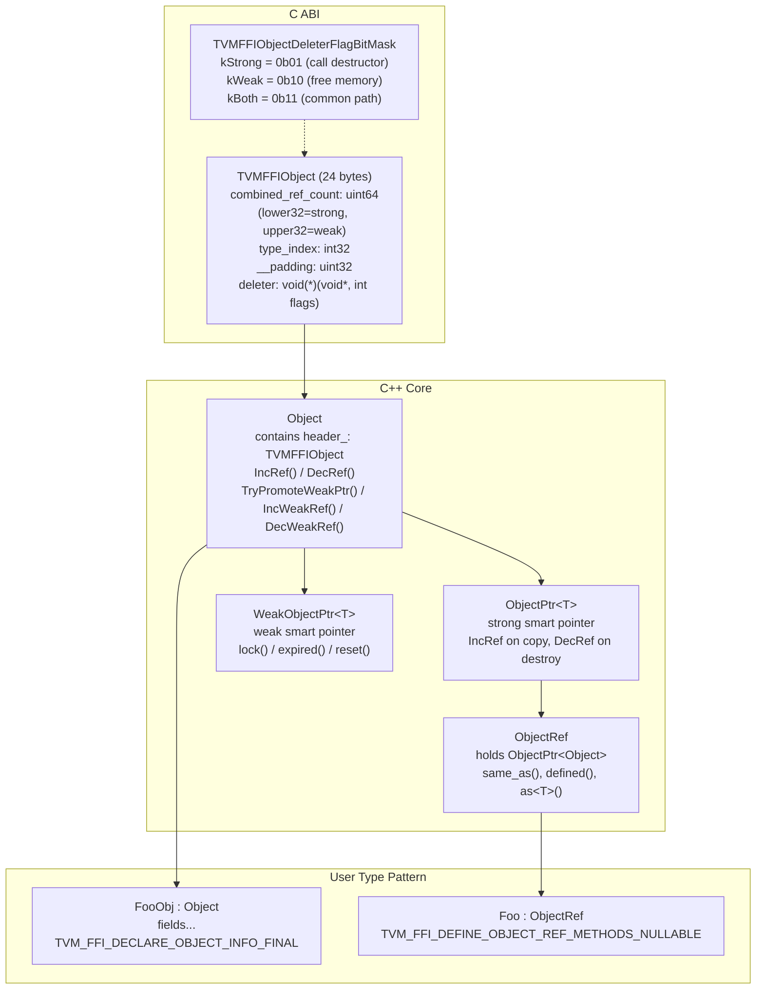
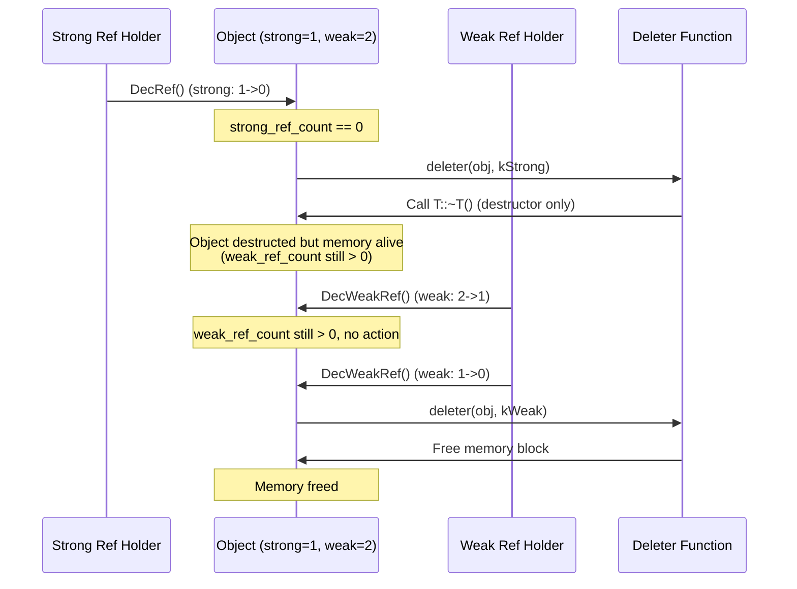
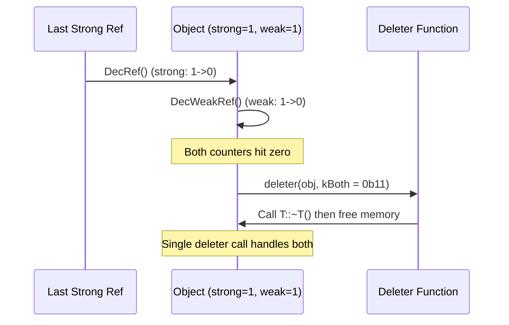

# Object System

**TL;DR**.
- The object system provides intrusive ref-counted heap objects with a single-inheritance type hierarchy, runtime type checking via an ancestor table, and compile-time child-slot optimization for O(1) `IsInstance` checks.
- Three core classes form the pattern: `Object` (data class with 24-byte header), `ObjectPtr<T>` (intrusive strong smart pointer), and `ObjectRef` (user-facing reference wrapper). `WeakObjectPtr<T>` provides weak references with CAS-based promotion. New types follow the `FooObj`+`Foo` convention.
- Macros (`TVM_FFI_DECLARE_OBJECT_INFO_FINAL`, `TVM_FFI_DECLARE_OBJECT_INFO`, `TVM_FFI_DEFINE_OBJECT_REF_METHODS_NULLABLE`) auto-generate type registration, runtime type index allocation, and ref wrapper boilerplate. Mutable/immutable pointer dispatch is auto-derived from `_type_mutable` via `std::conditional_t`, eliminating the old four-way mutable/immutable macro matrix.

## Problem Statement

### Background
- FFI needs heap-allocated objects that can be shared across C++, Python, and Rust with deterministic lifetime management.
- Virtual dispatch is undesirable for type checking -- it adds vtable overhead and does not work across DLL boundaries.
- Type hierarchies must be extensible at runtime (user-defined types get indices at load time) while core types have fixed indices for performance.

### Solution
- Every heap object embeds a 24-byte `TVMFFIObject` header (`combined_ref_count`, `type_index`, `__padding`, `deleter`) as its first field. The header packs strong and weak reference counters into a single `uint64 combined_ref_count` (lower 32 bits = strong, upper 32 bits = weak; `43d13e8`), enabling single-atomic deletion fast path. The flag-based deleter protocol (`TVMFFIObjectDeleterFlagBitMask`) uses the combined counter to detect the common case (both counts == 1) with one atomic fetch-sub. Note: `type_index` is at offset 8, NOT at offset 0 -- there is no layout aliasing with `TVMFFIAny`.
- A global type table maps type indices to `TVMFFITypeInfo` structs containing ancestry arrays, enabling O(1) `IsInstance` for types within reserved child slots and O(depth) fallback via ancestor lookup.
- `ObjectPtr<T>` provides RAII strong ref-counting; `WeakObjectPtr<T>` provides weak references with CAS-based promotion. `ObjectRef` wraps `ObjectPtr` for ergonomic use. Macros generate all boilerplate.

### Goals
- Deterministic ref-counted lifetime management across language boundaries.
- O(1) `IsInstance` for common type checks (via child-slot reservation).
- Extensible type hierarchy with runtime index allocation.
- Non-goal: multiple inheritance; garbage collection.

## Design



### Two-Phase Deletion Protocol

When strong and weak references coexist, deletion happens in two phases:



When no weak references exist (common case), both flags fire simultaneously:



### Key Classes, Fields and Interfaces

```python
class TVMFFIObjectDeleterFlagBitMask(IntEnum):
    """Bitmask controlling which deletion actions the deleter should perform."""
    kStrong = 1 << 0   # strong RC hit 0: call destructor (T::~T())
    kWeak = 1 << 1     # weak RC hit 0: free memory block (delete storage)
    kBoth = 0b11       # both hit 0 simultaneously (common single-call path)
    # Invariant: deleter is always called with at least one bit set
    # Interacts with: SimpleObjAllocator::Deleter_, custom allocator deleters

class TVMFFIObject:
    """24-byte C ABI object header. Embedded as first field of every heap object."""
    combined_ref_count: uint64   # offset 0 -- Packed strong (lower 32) + weak (upper 32) ref counts
    type_index: int32            # offset 8 -- Runtime type tag
    __padding: uint32            # offset 12 -- Explicitly zeroed (f9179ec)
    deleter: Callable[[void_ptr, int], None]  # offset 16 -- flags: TVMFFIObjectDeleterFlagBitMask
    # Invariant: sizeof(TVMFFIObject) == 24
    # Invariant: strong_ref_count = combined_ref_count & 0xFFFFFFFF
    # Invariant: weak_ref_count = (combined_ref_count >> 32) & 0xFFFFFFFF
    # Note: deleter takes void* (not TVMFFIObject*) since 24125d0
    # Invariant: make_object sets combined_ref_count = kCombinedRefCountBothOne at allocation
    # Invariant: __padding explicitly set to 0 for deterministic memory (f9179ec)

# Combined ref count constants (tvm::ffi::details namespace):
kCombinedRefCountWeakOne: uint64 = 1 << 32       # One weak ref
kCombinedRefCountStrongOne: uint64 = 1            # One strong ref
kCombinedRefCountBothOne: uint64 = (1 << 32) | 1  # Both counts at one
kCombinedRefCountMaskUInt32: uint64 = 0xFFFFFFFF  # Lower 32-bit mask

class Object:
    """Base class of all ref-counted heap objects."""
    header_: TVMFFIObject  # protected

    # Static class-level metadata:
    _type_key: ClassVar[str] = "ffi.Object"
    _type_index: ClassVar[int32] = kTVMFFIObject  # 64
    _type_final: ClassVar[bool] = False
    _type_child_slots: ClassVar[int] = 0
    _type_child_slots_can_overflow: ClassVar[bool] = True
    _type_depth: ClassVar[int32] = 0

    def IsInstance(self, TargetType: type) -> bool: ...
        # Interacts with: details.IsObjectInstance, TVMFFIGetTypeInfo
    def type_index(self) -> int32: ...
    def use_count(self) -> uint64: ...
        # Invariant: atomic relaxed load of header_.combined_ref_count masked to lower 32 bits
    def unique(self) -> bool: ...
        # Returns use_count() == 1

    # --- Weak reference primitives ---
    def TryPromoteWeakPtr(self) -> bool:
        """CAS loop: increment strong_ref_count only if > 0."""
        # Returns False if object is dead (strong_ref_count == 0)
        # Invariant: atomic CAS prevents race between concurrent promotions and DecRef
        # Interacts with: WeakObjectPtr.lock()

    def IncWeakRef(self) -> None:
        """Atomically increment weak_ref_count."""
        # Interacts with: WeakObjectPtr constructors

    def DecWeakRef(self) -> None:
        """Atomically decrement weak_ref_count. If hits 0, call deleter(kWeak)."""
        # Interacts with: WeakObjectPtr destructor, Object.DecRef (chains weak dec)

    # Extension: subclass with TVM_FFI_DECLARE_OBJECT_INFO_FINAL or TVM_FFI_DECLARE_OBJECT_INFO

class ObjectPtr[T]:
    """Intrusive smart pointer with RAII ref-counting."""
    data_: Object_ptr = None  # private

    def get(self) -> T_ptr: ...
    def reset(self) -> None: ...
        # Invariant: calls data_.DecRef() then sets data_ = nullptr
    def use_count(self) -> int: ...
    def unique(self) -> bool: ...
    # Invariant: IncRef (strong) on copy construction, DecRef (strong) on destruction
    # Invariant: move construction transfers ownership (no ref-count change)
    # Interacts with: Object.IncRef, Object.DecRef, make_object<T>

class WeakObjectPtr[T]:
    """Weak smart pointer -- does not affect strong RC; mirrors std::weak_ptr."""
    data_: Object_ptr = None  # private, holds raw Object pointer via weak RC

    def lock(self) -> ObjectPtr[T]:
        """CAS-based promotion: returns strong ObjectPtr if alive, else nullptr."""
        # Interacts with: Object.TryPromoteWeakPtr() (CAS loop on strong_ref_count)
        # Invariant: if strong_ref_count == 0, returns nullptr; never dangling

    def expired(self) -> bool:
        """Returns True if strong_ref_count == 0 or data_ == nullptr."""

    def reset(self) -> None:
        """Release the weak reference (calls Object.DecWeakRef())."""

    def use_count(self) -> int:
        """Returns current strong ref count (debug only)."""

    def swap(self, other: WeakObjectPtr[T]) -> None: ...

    # Constructors: from ObjectPtr[T], WeakObjectPtr[T] (copy/move), nullptr, base class ptr
    # Invariant: IncWeakRef on construction, DecWeakRef on destruction
    # Invariant: WeakObjectPtr destruction never triggers the strong-path destructor
    # Interacts with: Object.IncWeakRef, Object.DecWeakRef

class UnsafeInit:
    """Tag type for explicitly unsafe null-initialization of ObjectRef types.
    Used in controlled scenarios (reflection, FFI bridging) where a non-nullable
    Ref must be temporarily null before being populated."""
    # Invariant: UnsafeInit-constructed refs MUST be assigned before use
    # Interacts with: all TVM_FFI_DEFINE_*_OBJECT_REF_METHODS macros,
    #   ObjectUnsafe::ObjectRefFromObjectPtr, ReflectionDefBase::ObjectCreatorUnsafeInit
    # Extension: any new ObjectRef subclass accepts UnsafeInit via the macro

class ObjectRef:
    """User-facing reference wrapper holding ObjectPtr<Object>."""
    data_: ObjectPtr[Object]  # protected

    def __init__(self, tag: UnsafeInit) -> None:
        """Null-initialize data_. Must only be used in controlled init paths."""
        ...
    def same_as(self, other: ObjectRef) -> bool: ...
        # Invariant: pointer identity comparison
    def defined(self) -> bool: ...
    def as_(self, ObjectType: type) -> Optional[ObjectType]: ...
        # Returns pointer if IsInstance succeeds, else nullptr/nullopt
    def type_index(self) -> int32: ...
    def use_count(self) -> int: ...
    # Interacts with: ObjectPtr, Any/AnyView via TypeTraits<ObjectRef>
    # Extension: subclass with TVM_FFI_DEFINE_OBJECT_REF_METHODS_NULLABLE(Name, ParentRef, ObjType)

class ObjectUnsafe:
    """Internal helper for unsafe object operations."""
    @staticmethod
    def ObjectRefFromObjectPtr(ptr: ObjectPtr[Object]) -> T:
        """Canonical bridge: create typed ObjectRef from erased ObjectPtr.
        Constructs via UnsafeInit{} then assigns data_."""
        # Invariant: ptr must be valid or nullptr (for nullable types only)
        # Interacts with: ObjectRef(UnsafeInit), type_traits, cast.h, optional.h
        ...

def make_object(T: type, *args) -> ObjectPtr[T]:
    """Allocate and initialize a heap object."""
    # 1. SimpleObjAllocator::Handler<T>::New: placement new on aligned storage
    # 2. Set header_.strong_ref_count = 1
    # 3. Set header_.weak_ref_count = 1 (sentinel: ensures memory survives until last weak ref)
    # 4. Set header_.type_index = T.RuntimeTypeIndex()
    # 5. Set header_.deleter = Handler::Deleter_ (flag-based: kStrong -> destruct, kWeak -> free)
    # 6. Return ObjectPtr wrapping raw pointer (no IncRef -- already at 1)
    # Interacts with: SimpleObjAllocator, TVMFFIGetOrAllocTypeIndex
    # Invariant: strong_ref_count starts at 1; weak_ref_count starts at 1 (sentinel for DecRef chain)
    # Invariant: ObjectPtr takes ownership without extra IncRef
```

### Macro Expansions

```python
# TVM_FFI_DECLARE_OBJECT_INFO_FINAL(TypeKey, TypeName, ParentType) expands to:
#   static constexpr const char* _type_key = TypeKey  # folded into declare macro (a08fa6e)
#   static constexpr int _type_child_slots = 0
#   static constexpr bool _type_final = True
#   + TVM_FFI_DECLARE_OBJECT_INFO(TypeKey, TypeName, ParentType)

# TVM_FFI_DECLARE_OBJECT_INFO(TypeKey, TypeName, ParentType) expands to:
#   static constexpr const char* _type_key = TypeKey
#   + TVM_FFI_DECLARE_OBJECT_INFO_PREDEFINED_TYPE_KEY(TypeName, ParentType)

# TVM_FFI_DECLARE_OBJECT_INFO_PREDEFINED_TYPE_KEY(TypeName, ParentType) expands to:
#   static constexpr int32 _type_depth = ParentType._type_depth + 1
#   static int32 _GetOrAllocRuntimeTypeIndex():
#       static_assert(not ParentType._type_final)
#       type_key = TVMFFIByteArray(TypeName._type_key)
#       tindex = TVMFFIGetOrAllocTypeIndex(
#           type_key, -1,  # -1 means allocate dynamically
#           TypeName._type_depth, TypeName._type_child_slots,
#           TypeName._type_child_slots_can_overflow,
#           ParentType._GetOrAllocRuntimeTypeIndex())
#       return tindex
#   static int32 RuntimeTypeIndex(): return _GetOrAllocRuntimeTypeIndex()
#   # NOTE: since 9ac3121, there is NO static inline variable that auto-triggers registration.
#   # Dynamic types MUST explicitly call ObjectDef<T>() or _GetOrAllocRuntimeTypeIndex() in a .cc file.

# TVM_FFI_DECLARE_OBJECT_INFO_STATIC(TypeKey, TypeName, ParentType) expands to:
#   static constexpr const char* _type_key = TypeKey
#   # TypeKey can be a string literal or StaticTypeKey::kXxx constant
#   # _GetOrAllocRuntimeTypeIndex returns TypeName::_type_index (compile-time constant)
#   # Static types (depth-1) are centrally pre-registered in TypeTable constructor
#   #   via ReserveDepthOneObjectTypeIndex (9ac3121)
#   # Used for core types with compile-time fixed indices (String, Error, Function, etc.)
#   # StaticTypeKey::kTVMFFIError = "ffi.Error" added in 9ac3121

# TVM_FFI_DEFINE_OBJECT_REF_METHODS_NULLABLE(TypeName, ParentType, ObjectName) expands to:
#   TypeName() = default                                       # default ctor
#   explicit TypeName(ObjectPtr<ObjectName> n): ParentType(n)  # typed ObjectPtr ctor
#   explicit TypeName(UnsafeInit tag): ParentType(tag)         # null-init ctor
#   # default copy/move constructors and assignment
#   using __PtrType = conditional_t<ObjectName::_type_mutable, ObjectName*, const ObjectName*>
#   __PtrType operator->() const                               # typed access (mutable/const auto-derived)
#   __PtrType get() const
#   static constexpr bool _type_is_nullable = true
#   using ContainerType = ObjectName                           # type alias for traits
#   # Invariant: ObjectName::_type_mutable drives const/mutable ptr dispatch (a08fa6e)
#
# TVM_FFI_DEFINE_OBJECT_REF_METHODS_NOTNULLABLE(TypeName, ParentType, ObjectName):
#   explicit TypeName(UnsafeInit tag): ParentType(tag)         # null-init ctor only
#   # NO default ctor (non-nullable cannot be default-constructed)
#   using __PtrType = conditional_t<ObjectName::_type_mutable, ObjectName*, const ObjectName*>
#   static constexpr bool _type_is_nullable = false
#
# Note: ObjectPtr<Object> (erased) constructors removed in 472e10c.
# Internal bridging now uses ObjectUnsafe::ObjectRefFromObjectPtr<T>().
# Note: Old macros (TVM_FFI_DECLARE_FINAL_OBJECT_INFO, TVM_FFI_DEFINE_OBJECT_REF_METHODS,
#   TVM_FFI_DEFINE_MUTABLE_*) removed in a08fa6e. Mutable variants absorbed into
#   NULLABLE/NOTNULLABLE via _type_mutable flag.
```

### IsInstance Algorithm

```python
def IsObjectInstance(TargetType: type, object_type_index: int32) -> bool:
    """O(1) for final types, O(1) for types within child slots, O(depth) fallback."""
    # Path 1: TargetType is Object -> always true
    if TargetType is Object:
        return True

    # Path 2: TargetType is final -> exact index match
    if TargetType._type_final:
        return object_type_index == TargetType.RuntimeTypeIndex()

    # Path 3: check child-slot range [target_index, target_index + child_slots + 1)
    target_index = TargetType.RuntimeTypeIndex()
    if TargetType._type_child_slots != 0:
        if target_index <= object_type_index < target_index + TargetType._type_child_slots + 1:
            return True

    # Path 4: exact match
    if object_type_index == target_index:
        return True

    # Path 5: overflow not allowed -> reject
    if not TargetType._type_child_slots_can_overflow:
        return False

    # Path 6: parent index > child index invariant -> reject
    if object_type_index < target_index:
        return False

    # Path 7: ancestor table lookup (runtime type info)
    type_info = TVMFFIGetTypeInfo(object_type_index)
    return (type_info.type_depth > TargetType._type_depth
            and type_info.type_ancestors[TargetType._type_depth] == target_index)
    # Interacts with: TVMFFIGetTypeInfo, TVMFFITypeInfo.type_ancestors
```

### Contracts, Assumptions and Invariants
- **Single inheritance**: The type hierarchy is a tree. Each type has exactly one parent. `TVMFFITypeInfo.type_ancestors[depth]` stores the ancestor at each depth level.
- **Parent index < child index**: A parent type's index is always smaller than any child's index. This enables early rejection in `IsInstance`.
- **Flag-based deleter**: `make_object<T>` sets `header_.deleter` to a flag-dispatching function. When called with `kStrong`, it calls `T::~T()` (destructor only). When called with `kWeak`, it frees the memory block. When called with `kBoth` (common path: no weak refs outstanding), it does both in a single call. This replaces the old single-action deleter pattern.
- **Combined ref count starts at both-one**: `make_object` initializes `combined_ref_count = kCombinedRefCountBothOne` (strong=1 in lower 32 bits, weak=1 in upper 32 bits; `43d13e8`). `DecRef` checks `count_before_sub == kCombinedRefCountBothOne` with a single atomic to detect the common case (both counters going to zero simultaneously), avoiding a separate atomic read of the weak counter. The sentinel weak count of 1 ensures that when strong hits 0 with outstanding weak refs, `DecRef` chains into `DecWeakRef`.
- **Padding explicitly zeroed**: `__padding` field at offset 12 is set to 0 during allocation for deterministic memory (`f9179ec`).
- **Object header size and alignment**: `TVMFFIObject` is 24 bytes and 8-byte aligned via the `__ensure_align` union member.
- **Raw aligned allocation**: `SimpleObjAllocator` uses `AlignedAlloc<align>(size)` / `AlignedFree(data)` for object memory management (`6fb42a7`), replacing the old `StorageType` wrapper pattern. Array allocation computes exact aligned size instead of rounding to `StorageType` multiples.

### Extension Points
- **Custom allocators**: The `ObjAllocatorBase<Derived>` CRTP pattern allows swapping in arena allocators or thread-local object pools. Currently only `details::SimpleObjAllocator` (new/delete) is used (moved to `details::` namespace in `24125d0`).
- **Inplace array objects**: `make_inplace_array_object<ArrayType, ElemType>` allocates extra trailing storage for inline array elements (used by `ArrayObj`).
- **New object types**: Define `FooObj : Object` + `Foo : ObjectRef` with the appropriate macros. Dynamic types get indices >= 128.
- **TypeTable heap-allocated singleton**: `TypeTable::Global()` returns a deliberately-leaked heap-allocated singleton (`static TypeTable* inst = new TypeTable()`), ensuring the type table outlives all other static destructors and preventing use-after-free crashes during program shutdown (`4206f16`).

### Usage Examples

#### Defining a custom object type
**Context**: The standard pattern for adding a new user-defined object to the FFI system.
```cpp
// Step 1: Define the data class (Obj suffix convention)
class MyNodeObj : public Object {
 public:
  String name;
  int64_t value;
  // Generates: _type_key="test.MyNode", _type_final=true, _type_child_slots=0,
  //   RuntimeTypeIndex(), _GetOrAllocRuntimeTypeIndex() (registers in global table)
  TVM_FFI_DECLARE_OBJECT_INFO_FINAL("test.MyNode", MyNodeObj, Object);
};

// Step 2: Define the reference wrapper (no Obj suffix)
class MyNode : public ObjectRef {
 public:
  // Generates: default ctor, ObjectPtr ctor, operator->(), get(), ContainerType alias
  // __PtrType is const MyNodeObj* (since _type_mutable defaults to false)
  TVM_FFI_DEFINE_OBJECT_REF_METHODS_NULLABLE(MyNode, ObjectRef, MyNodeObj);
};

// Step 3: Create and use
auto node_ptr = make_object<MyNodeObj>();  // ref_counter=1, type_index allocated
node_ptr->name = String("hello");
node_ptr->value = 42;
MyNode node_ref(std::move(node_ptr));     // transfers ownership
bool is_obj = node_ref->IsInstance<Object>();  // true (Object is ancestor)
```

#### Using WeakObjectPtr for non-owning observation
**Context**: Holding a reference to an object without preventing its destruction.
```cpp
ObjectPtr<MyNodeObj> strong = make_object<MyNodeObj>();  // strong=1, weak=1
strong->name = String("hello");

WeakObjectPtr<MyNodeObj> weak(strong);  // weak count incremented to 2

// lock() succeeds while strong ref exists
ObjectPtr<MyNodeObj> locked = weak.lock();  // CAS promotes; strong=2
assert(locked->name.operator std::string() == "hello");

// After all strong refs are released, lock() returns nullptr
strong.reset();   // strong=1 (locked still holds)
locked.reset();   // strong=0 -> destructor called, weak=2->1 (sentinel consumed)
assert(weak.expired());
assert(weak.lock() == nullptr);
// weak destructor: weak=1->0 -> deleter(kWeak) -> memory freed
```

## Alternatives & Trade-offs
### Virtual dispatch for type checking (rejected)
- Pros: Standard C++ pattern; no global type table needed.
- Cons: vtable pointers are DLL-specific (break cross-DLL IsInstance); adds 8 bytes per object; cannot extend type hierarchy at runtime.

### std::shared_ptr (rejected)
- Pros: Standard library; well-tested.
- Cons: Control block is separate allocation (+16 bytes overhead); no runtime type checking; no child-slot optimization; cannot share across C ABI boundary.

## Related Work
### Design Records
- `0001-any-anyview-value-system.md` -- Any/AnyView stores ObjectRef via TypeTraits, using the shared type_index layout
- `0003-function-system.md` -- FunctionObj inherits from Object; Function is an ObjectRef
- `0005-type-traits-protocol.md` -- ObjectRefTypeTraitsBase bridges Object system with Any
- `0007-c-abi.md` -- TVMFFIObject header and TVMFFIGetOrAllocTypeIndex API
- `0008-reflection.md` -- ReflectionDef registers field accessors on Object types

### Evidence Matrix
- Object/ObjectRef/ObjectPtr hierarchy -> `commits/2025-05-06-7d34eb8abfe987bf0031e4d4ff479895d867a966.md` + `7d34eb8` + `Object`, `ObjectRef`, `ObjectPtr`
- IsInstance via child-slot optimization -> `commits/2025-05-06-7d34eb8abfe987bf0031e4d4ff479895d867a966.md` + `7d34eb8` + `IsObjectInstance`
- make_object allocator pattern -> `commits/2025-05-06-7d34eb8abfe987bf0031e4d4ff479895d867a966.md` + `7d34eb8` + `make_object`, `SimpleObjAllocator`
- Macro expansions -> `commits/2025-05-06-7d34eb8abfe987bf0031e4d4ff479895d867a966.md` + `7d34eb8` + `TVM_FFI_DECLARE_FINAL_OBJECT_INFO`
- Weak RC, WeakObjectPtr, split counters, flag-based deleter -> `commits/2025-09-01-ca9c3d10bb9640bffb972302f7064e49e592a526.md` + `ca9c3d1` + `WeakObjectPtr`, `TVMFFIObjectDeleterFlagBitMask`, `TryPromoteWeakPtr`
- UnsafeInit tag, typed ObjectPtr ctors, ObjectUnsafe::ObjectRefFromObjectPtr -> `commits/2025-09-08-472e10c4...md` + `472e10c` + `UnsafeInit`, `ObjectUnsafe::ObjectRefFromObjectPtr`
- FObjectDeleter void* signature, SimpleObjAllocator moved to details:: -> `commits/2025-09-07-24125d0a...md` + `24125d0` + `FObjectDeleter`, `details::SimpleObjAllocator`
- Macro rename: unified naming, auto-const/mutable via _type_mutable -> `commits/2025-09-09-a08fa6eb...md` + `a08fa6e` + `TVM_FFI_DECLARE_OBJECT_INFO_FINAL`, `TVM_FFI_DEFINE_OBJECT_REF_METHODS_NULLABLE`
- Remove static inline auto-registration, explicit ObjectDef required, ReserveDepthOneObjectTypeIndex, StaticTypeKey::kTVMFFIError -> `commits/2025-10-14-9ac31216...md` + `9ac3121` + `ReserveDepthOneObjectTypeIndex`, `ObjectDef`
- Free-threaded Python 3.14t, OpaquePyObject hierarchy fix -> `commits/2025-10-10-b64b46f3...md` + `b64b46f` + `OpaquePyObject`, free-threaded Python
- TypeTable heap-allocated singleton to avoid static destruction order issues -> `commits/2025-10-15-4206f16e...md` + `4206f16` + `TypeTable::Global()`
