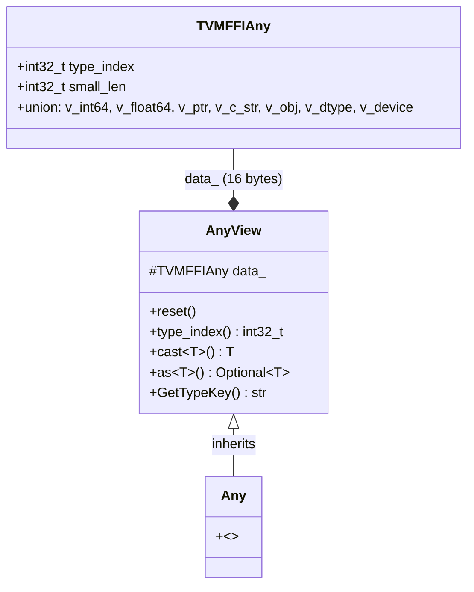
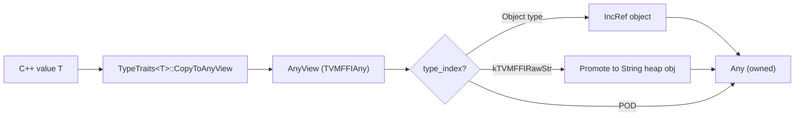

# Any and AnyView — Type-Erased Value System

**TL;DR**
- `AnyView` is a non-owning 16-byte type-erased value (copy-trivial, like `TVMFFIAny`). `Any` extends it with ownership: it ref-counts objects and promotes `kTVMFFIRawStr` to a `String` heap object.
- `Any::type_index` is NEVER `kTVMFFIRawStr`; only `AnyView` may hold raw C-strings. This is the central ownership invariant of the system.
- Conversion between a C++ type `T` and `Any`/`AnyView` is dispatched via `TypeTraits<T>`, a customization-point struct that must be specialized for any new type entering the FFI.

## Problem Statement

### Background
Packed function calls require passing heterogeneous arguments (int, float, String, Array, custom objects) through a single uniform argument array. Before this design, TVM used `TVMValue` + `TVMArgTypeCode`, which required separate arrays and could not express ownership semantics in the type code.

### Solution
`TVMFFIAny` unifies the type code and value into a single 16-byte struct. `AnyView` wraps it with C++ ergonomics (constructors, `cast<T>()`, etc.) but no ownership. `Any` adds ownership: on destruction it decrements ref counts; on construction from `AnyView`, it promotes raw strings to owned `String` objects. Any value that fits in 8 bytes (int, float, opaque pointer, DLDataType, DLDevice) is stored inline — no heap allocation.

### Goals
- Zero-cost for POD values: `AnyView view = 42` stores in the union, no heap alloc.
- Uniform argument passing: all packed-function arg arrays are `const AnyView*`.
- Ownership clarity: `AnyView` = borrow, `Any` = own. No implicit copies.
- Non-goal: support mutable views into object fields (use `ReflectionDef` for that).

## Design

### Class Hierarchy



### Key Classes, Fields and Interfaces

```python
class AnyView:
    """Non-owning 16-byte type-erased value. Backed by TVMFFIAny.
    Copy/move are trivial (just memcpy of the 16-byte struct).
    """
    data_: TVMFFIAny     # protected; directly reinterpretable as TVMFFIAny

    def reset(self) -> None:
        data_.type_index = kTVMFFINone; data_.v_int64 = 0
        # Invariant: always zeroes the padding (v_int64) even for non-int types

    def type_index(self) -> int32_t: return data_.type_index

    # Implicit construction from any T with TypeTraits<T>::convert_enabled == True:
    def __init__(self, value: T) -> None:
        TypeTraits[T].CopyToAnyView(value, &data_)
        # Interacts with: TypeTraits<T>.CopyToAnyView (dispatch by type)

    def as(self, T: type) -> T:
        """Strict non-coercing extraction — only succeeds if stored exactly as T.
        Uses TypeTraits<T>::CheckAnyStrict (formerly CheckAnyStorage, renamed commit 37a2e7c5).
        Raises TypeError if the stored type_index is not the exact storage type for T.
        """
        if not TypeTraits[T].CheckAnyStrict(&data_):
            raise TypeError(f"Cannot cast {GetTypeKey()} to {TypeTraits[T].TypeStr()}: strict check failed")
        return TypeTraits[T].CopyFromAnyStorageAfterCheck(&data_)
        # Interacts with: TypeTraits<T>.CheckAnyStrict, CopyFromAnyStorageAfterCheck

    def try_cast(self, T: type) -> Optional[T]:
        """Coercing conversion — uses TypeTraits<T>::TryCastFromAnyView (renamed from TryConvertFromAnyView).
        May apply numeric coercions (e.g., int → float). Non-throwing.
        """
        return TypeTraits[T].TryCastFromAnyView(&data_)
        # Interacts with: TypeTraits<T>.TryCastFromAnyView (coercion dispatch)

    def cast(self, T: type) -> T:
        """Coercing conversion — same as try_cast but throws TypeError on failure."""
        result = TypeTraits[T].TryCastFromAnyView(&data_)
        if not result:
            raise TypeError(f"Cannot convert {GetTypeKey()} to {TypeTraits[T].TypeStr()}")
        return result.value()
        # Interacts with: TypeTraits<T>.TryCastFromAnyView, Error system

    def GetTypeKey(self) -> str:
        return TypeIndexToTypeKey(data_.type_index)
        # Interacts with: TVMFFIGetTypeInfo (global type registry)

    # Invariant: kTVMFFIRawStr is allowed in AnyView
    # Interacts with: TypeTraits (conversion dispatch), Any (ownership promotion)


class Any(AnyView):
    """Owning 16-byte type-erased value.
    Extends AnyView with ref-counting for object types and raw-string promotion.
    """

    def __del__(self) -> None:
        # Release ownership:
        if data_.type_index >= kTVMFFIStaticObjectBegin:
            ObjectPtr.DecRef(data_.v_obj)
        # kTVMFFIObjectRValueRef is consumed on construction, so no action here

    def __init__(self, view: AnyView) -> None:
        # InplaceConvertAnyViewToAny:
        if view.type_index() == kTVMFFIRawStr:
            # Promote raw C-string to heap-allocated String object
            data_ = String(view.data_.v_c_str)._as_any()
        elif view.type_index() == kTVMFFIObjectRValueRef:
            # Move-from: steal the ObjectRef, mark source as None
            data_ = view.data_  # steal
            view.data_.type_index = kTVMFFINone
        elif view.type_index() >= kTVMFFIStaticObjectBegin:
            # Object: IncRef
            data_ = view.data_
            ObjectPtr.IncRef(data_.v_obj)
        else:
            data_ = view.data_  # POD: copy-by-value

    # Invariant: Any::type_index is NEVER kTVMFFIRawStr after construction
    # Invariant: kTVMFFIObjectRValueRef is consumed exactly once (move semantics)
    # Interacts with: String (raw-string promotion), ObjectPtr (IncRef on assign)

    def as_rvalue(self, T: type) -> T:
        """Rvalue overload for Any — moves the stored value out, leaving Any as kTVMFFINone.
        Prevents unnecessary IncRef+DecRef round-trip when consuming an Any.
        """
        result = TypeTraits[T].MoveFromAnyAfterCheck(&data_)
        data_.type_index = kTVMFFINone
        return result
        # Interacts with: TypeTraits<T>.MoveFromAnyAfterCheck (renamed from MoveFromAnyStorageAfterCheck)

# Namespace aliases (added in commit 192f196e for ergonomic use):
# tvm::Any    → tvm::ffi::Any
# tvm::AnyView → tvm::ffi::AnyView
# These are top-level aliases in the tvm:: namespace for TVM downstream code.

class RValueRef(Generic[T]):
    """Marks an ObjectRef for move-into-Any without IncRef.
    Encoded as kTVMFFIObjectRValueRef in the AnyView.
    """
    value_: T   # Invariant: moved-from after AnyView construction
    # Interacts with: Any.__init__ (kTVMFFIObjectRValueRef path)
```

### Type Conversion Flow



## Contracts, Assumptions and Invariants

- `Any::type_index` is NEVER `kTVMFFIRawStr`. Any factory function that receives an `AnyView` with `kTVMFFIRawStr` **must** promote it to a `String` object.
- `kTVMFFIObjectRValueRef` in an `AnyView` is consumed exactly once: the first `Any` that reads it steals the underlying pointer and sets the source to `kTVMFFINone`. Reading it a second time is a bug.
- `AnyView` may be bitwise-copied freely (it is not RAII). It must not outlive the value it views (dangling `kTVMFFIRawStr` or expired `ObjectPtr` are UB).
- For POD types (int, float, bool), `type_index` equality comparison is sufficient for type-checking; no table lookup needed.
- Result slots in packed function calls: callee receives `Any* rv` pre-initialized with `kTVMFFINone`. Writing to it with an object type stores the pointer directly (caller's `Any` destructor will DecRef on cleanup).

### Extension Points
- To make a new C++ type `MyType` passable as `Any`, specialize `TypeTraits<MyType>` implementing `CopyToAnyView`, `TryCastFromAnyView`, `TypeStr`, `CheckAnyStrict`, `CopyFromAnyStorageAfterCheck`. Set `convert_enabled = true` and `storage_enabled = true`.
- To allow container element storage (e.g., `Array<MyType>`), `CheckAnyStrict` must correctly distinguish "freshly stored as MyType" from "stored as something else but convertible" — it is stricter than `TryCastFromAnyView`.
- The `as<T>()` strict path calls `CheckAnyStrict` + `CopyFromAnyStorageAfterCheck`; the `cast<T>()`/`try_cast<T>()` coercing path calls `TryCastFromAnyView`.
- **Per-type AnyHash/AnyEqual customization** (commit 39d9b2b4): `AnyHash` and `AnyEqual` consult two `TypeAttrColumn` slots (`"__any_hash__"` and `"__any_equal__"`) for registered Object types (`type_index >= kTVMFFIStaticObjectBegin`). Each slot accepts either a raw C function pointer (`kTVMFFIOpaquePtr` — zero-allocation fast path) or a `Function` object (`kTVMFFIFunction`). Register via `TVMFFITypeRegisterAttr("__any_hash__", type_index, fn)`. This is distinct from `RecursiveHash`/`RecursiveEq` (see `0031-dataclass-ops.md`) and `StructuralHash`/`StructuralEqual` (see `0009-structural-eq-hash.md`): `__any_hash__` controls the default behavior of `std::hash<Any>` and Python's `hash()` on FFI objects, not deep structural comparison.

### Usage Examples

#### Using AnyView and Any in C++
**Context**: passing arguments through a packed function boundary.

```cpp
// AnyView: non-owning, zero-cost for POD
AnyView view_int = 42;          // TypeTraits<int>::CopyToAnyView → v_int64=42
AnyView view_str = "hello";     // TypeTraits<const char*>::CopyToAnyView → kRawStr + v_c_str

// Any: owning (promotes kRawStr to String, IncRefs objects)
Any owned_int = view_int;       // POD → copied, no heap alloc
Any owned_str = view_str;       // kRawStr → promoted to String object

// Strict extraction: as<T>() — only succeeds if stored exactly as T (CheckAnyStrict)
int v = view_int.as<int>();               // ok: stored as kTVMFFIInt
// view_int.as<float>() → TypeError (strict: int stored as int, not float)

// Coercing conversion: try_cast<T>() → std::optional; cast<T>() → T or TypeError
std::optional<float> opt = view_int.try_cast<float>();  // Some(42.0) — int→float coercion
float f = view_int.cast<float>();                        // 42.0 — coercing

// String extraction
String s = owned_str.cast<String>();        // TypeTraits<String>::TryCastFromAnyView
```

#### R-value move into Any
**Context**: avoiding IncRef+DecRef round-trip when constructing an Any from a temporary.

```cpp
Array<int> arr = {1, 2, 3};
// Move arr into Any without extra ref-count churn:
Any moved = RValueRef<Array<int>>(std::move(arr));
// arr is now empty; moved holds the sole reference to the Array
```

## Implementation Notes
- `InplaceConvertAnyViewToAny` is implemented inside `Any`'s move/copy constructors from `AnyView`. The name appears in comments as a conceptual label.
- `AnyView` constructor templates use `std::enable_if_t<TypeTraits<T>::convert_enabled>` to prevent implicit conversion of unregistered types — compile error rather than silent wrong behavior.
- `TVMFFIAny` is 16 bytes on all platforms (4+4+8); `AnyView` is exactly one `TVMFFIAny` (no vtable, no padding). This size is tested in the C++ unit tests.
- The `AnyUnsafe` friend struct provides `MoveAnyToTVMFFIAny` and `CopyFromTVMFFIAny` for reflection's getter/setter implementations.
- **Downcast removal (commit 4be1af7)**: `ffi::Downcast(Any)` overloads were removed from `include/tvm/ffi/cast.h`. The canonical replacement is `any_value.cast<T>()` (coercing). `cast.h` now only provides `GetRef<T>` and `GetObjectPtr<T>` helpers. ObjectRef `Downcast` was moved to `tvm/node/` for backward compat outside `ffi/`.
- `TVMFFIAny.zero_padding` (bytes 4–7) must be zeroed for all non-small-string values since commit 49e2ed4. The `same_as()` comparison checks `zero_padding` in addition to `type_index` and `v_int64`.
- `String` stored in an `Any` may have type index `kTVMFFISmallStr = 11` (short, on-stack) or `kTVMFFIStr = 65` (heap). Code that checks for `kTVMFFIStr` exclusively must also accept `kTVMFFISmallStr`. Use `TypeTraits<String>::CheckAnyStrict` which handles both.

## Alternatives & Trade-offs

### Alternative A: Separate type-code array (prior TVM design)
- Pros: Simpler struct; type code and value decoupled.
- Cons: Two arrays to pass; type code can drift from value; harder to express ownership.

### Alternative B: `std::any` / `std::variant`
- Pros: Standard library; no custom code.
- Cons: Not C-compatible; ABI unstable across compilers; `std::any` heap-allocates for types >16 bytes; no cross-language interop.

## Related Design Docs & ADRs
- `.knowledge/design-records/0001-c-abi.md` — `TVMFFIAny` wire layout, type index ranges
- `.knowledge/design-records/0002-object-system.md` — `ObjectRef` boxing into `Any`
- `.knowledge/design-records/0008-type-traits.md` — `TypeTraits<T>` protocol, specialization guide
- `.knowledge/design-records/0004-function-system.md` — `AnyView*` argument arrays in packed calls
