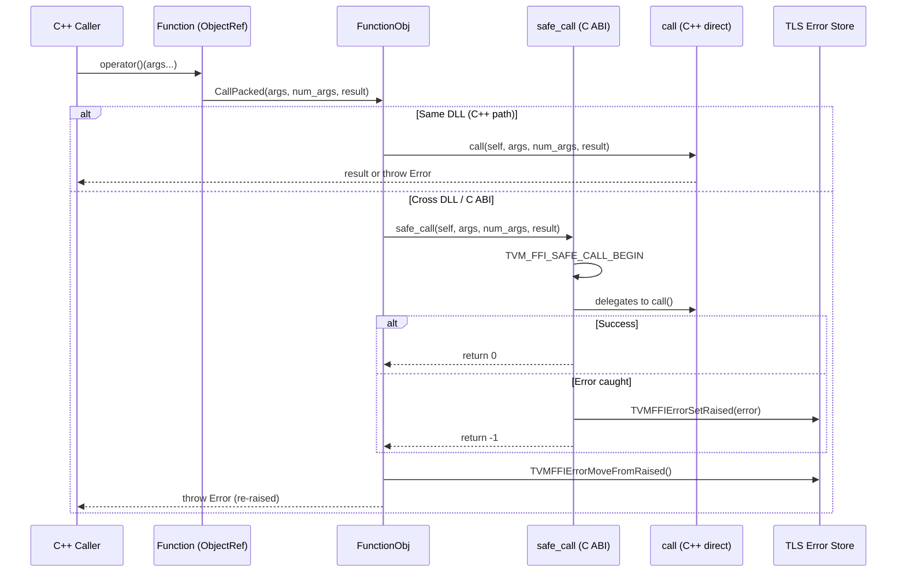
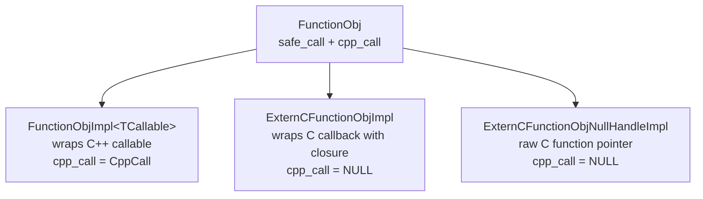

# Function System

**TL;DR**.
- `FunctionObj` is a packed callable object with a dual-path calling convention: a C-ABI `safe_call` entry (catches exceptions, returns error codes) and an optional C++ `cpp_call` entry (propagates exceptions directly, stored as `void*` in `TVMFFIFunctionCell`; `4fe8b2b`). `CallPacked` uses `cpp_call` when non-null, otherwise falls back to `safe_call` via `CppCallDedirectToSafeCall`.
- `Function` is the user-facing `ObjectRef` wrapper. It provides `FromPacked` (raw packed signature), `FromTyped` (auto-converts typed args via TypeTraits), and `FromExternC` (wraps C callbacks; supports null handle/deleter for raw function pointers via `ExternCFunctionObjNullHandleImpl`).
- The global function registry (via `reflection::GlobalDef`) maps string names to `Function` objects with full metadata, enabling cross-language function discovery without link-time dependencies.

## Problem Statement

### Background
- Cross-language FFI requires a single callable abstraction that works identically from C, C++, Python, and Rust.
- C++ exceptions cannot cross DLL boundaries or C ABI boundaries safely, so a safe calling convention is needed.
- Developers want type-safe function signatures in C++ while the wire protocol uses type-erased packed arguments.

### Solution
- `FunctionObj` inherits from `TVMFFIFunctionCell` which stores two entry points: `safe_call` (C ABI, catches exceptions) and `cpp_call` (C++, `void*` to avoid C++ dependency in C header; `4fe8b2b`). `CallPacked` uses `cpp_call` when non-null, falling back to `safe_call` via a branchless conditional.
- `Function::FromTyped` wraps typed callables by auto-converting arguments via `TypeTraits` and `details::unpack_call`.
- A global string-keyed registry allows any language to register and discover functions at runtime.

### Goals
- Zero-overhead calls within the same DLL (direct C++ path).
- Safe exception propagation across DLL/language boundaries (via `safe_call` + TLS error).
- Automatic argument conversion from packed `AnyView[]` to typed C++ parameters.
- Non-goal: overload resolution; function schema introspection at this layer.

## Design



### Key Classes, Fields and Interfaces

```python
class FunctionObj(Object):
    """Packed function object with dual C/C++ call paths."""
    _type_index: ClassVar[int32] = kTVMFFIFunction  # 68
    _type_key: ClassVar[str] = "ffi.Function"

    safe_call: TVMFFISafeCallType  # inherited from TVMFFIFunctionCell
        # C ABI entry: int safe_call(void* self, const TVMFFIAny* args, int32 num_args, TVMFFIAny* result)
        # Returns: 0=success, -1=error in TLS, -2=frontend error
        # Invariant: result.type_index must be < kTVMFFIStaticObjectBegin before call
        # Interacts with: TVM_FFI_SAFE_CALL_BEGIN/END, TLS error store

    cpp_call: void_ptr  # inherited from TVMFFIFunctionCell (4fe8b2b)
        # Optional C++ direct call: void(*)(FunctionObj*, AnyView*, int32, Any*)
        # NULL for functions not originally created in C++ (ExternC, etc.)
        # Invariant: cpp_call is NULL for non-C++ functions
        # Interacts with: CallPacked (uses cpp_call when non-null)

    def CallPacked(self, args: AnyView_ptr, num_args: int32, result: Any_ptr) -> None:
        """Dispatch to cpp_call if set, otherwise fall back to safe_call."""
        # Uses branchless conditional: cpp_call ? reinterpret_cast<FCall>(cpp_call) : CppCallDedirectToSafeCall
        # Interacts with: Function.operator(), PackedArgs
    # Extension: subclass FunctionObj for custom callable implementations

class Function(ObjectRef):
    """Type-erased callable with packed calling convention."""

    def __call__(self, *args: Any) -> Any:
        """Pack args into AnyView[], call FunctionObj.CallPacked, return result."""
        # 1. Allocate AnyView[N] on stack
        # 2. PackedArgs.Fill(arr, args...) -- each arg converted via TypeTraits
        # 3. FunctionObj.CallPacked(arr, N, &result)
        # Interacts with: PackedArgs.Fill, AnyView implicit constructors

    @staticmethod
    def FromPacked(callable: Callable[[AnyView_ptr, int32, Any_ptr], None]) -> Function:
        """Wrap a raw packed-signature callable."""
        # Creates FunctionObjImpl<TCallable> internally
        # Invariant: callable signature must match (AnyView*, int32, Any*) -> void
        #            OR (PackedArgs, Any*) -> void
        # Interacts with: FunctionObjImpl, make_object

    @staticmethod
    def FromTyped(callable: Callable[..., R]) -> Function:
        """Wrap a typed callable, auto-converting args via TypeTraits."""
        # 1. Introspects callable via details::FunctionInfo<TCallable>
        # 2. Wraps in lambda: (AnyView* args, int32 n, Any* rv) ->
        #      details::unpack_call<R>(index_seq, callable, args, n, rv)
        # 3. Each arg[i] converted via TypeTraits<ArgType>::TryCastFromAnyView
        # 4. Return value converted via TypeTraits<R>::MoveToAny
        # Interacts with: TypeTraits<T>, details::unpack_call, FunctionInfo

    @staticmethod
    def FromExternC(self: void_ptr, safe_call: TVMFFISafeCallType,
                    deleter: Callable) -> Function:
        """Wrap a C-style callback into a Function."""
        # If self=nullptr and deleter=nullptr: creates ExternCFunctionObjNullHandleImpl (lightweight)
        # Otherwise: creates ExternCFunctionObjImpl (with closure support)
        # cpp_call is set to NULL for both (C callbacks don't have C++ entry)
        # Interacts with: ExternCFunctionObjImpl, ExternCFunctionObjNullHandleImpl (4fe8b2b)

    @staticmethod
    def InvokeExternC(handle: void_ptr, safe_call: TVMFFISafeCallType, *args: Args) -> Any:
        """Directly invoke a C-ABI safe_call function pointer without creating a Function object.
        Zero heap allocation -- all work done on the stack. (9186b44)"""
        # 1. Allocate AnyView[max(N,1)] on stack
        # 2. PackedArgs::Fill(arr, args...)
        # 3. safe_call(handle, arr, N, &result)
        # 4. TVM_FFI_CHECK_SAFE_CALL for error propagation
        # Interacts with: PackedArgs::Fill, TVM_FFI_CHECK_SAFE_CALL, TVMFFISafeCallType
        # Invariant: handle is typically nullptr for __tvm_ffi_* exported symbols

    # Removed: ImportFromExternDLL (4fe8b2b) -- cross-DLL calls now handled by cpp_call=NULL fallback

    @staticmethod
    def GetGlobal(name: str) -> Optional[Function]:
        """Lookup a function in the global registry by name."""
        # Interacts with: TVMFFIFunctionGetGlobal (C API)

    @staticmethod
    def GetGlobalRequired(name: str) -> Function:
        """Lookup or throw ValueError if not found."""

    @staticmethod
    def SetGlobal(name: str, func: Function, override: bool = False) -> None:
        """Register a function in the global registry."""
        # Interacts with: TVMFFIFunctionSetGlobal (C API)

    @staticmethod
    def ListGlobalNames() -> List[str]:
        """Return all registered global function names."""
        # Uses: ffi.FunctionListGlobalNamesFunctor (itself a global func)

class TypedFunction[R, *Args]:
    """Compile-time typed wrapper around Function."""
    packed_: Function  # private

    def __call__(self, *args: Args) -> R:
        """Call with type-checked arguments, auto-convert return value."""
        # Delegates to packed_(...args)
        # Casts result via std::move(res).cast<R>()
        # Interacts with: Function.operator(), TypeTraits<R>
    # Extension: construct from any lambda matching R(Args...) signature

# Global function registration (via GlobalDef, replaces removed TVM_FFI_REGISTER_GLOBAL):
# TVM_FFI_STATIC_INIT_BLOCK() {
#   reflection::GlobalDef()
#     .def("name", callable)
#       -> Function::FromTyped(callable)
#       -> TVMFFIFunctionSetGlobalFromMethodInfo (C API, stores metadata)
# }
#
# TVM_FFI_DLL_EXPORT_TYPED_FUNC(ExportName, Function):
#   extern "C" TVM_FFI_DLL_EXPORT int __tvm_ffi_##ExportName(void* self, const TVMFFIAny* args,
#       int32_t num_args, TVMFFIAny* result) {  # args now const (4fe8b2b)
#     TVM_FFI_SAFE_CALL_BEGIN();
#     unpack_call<RetType>(Function, args, num_args, result);
#     TVM_FFI_SAFE_CALL_END();
#   }
#   // Note: C symbol is __tvm_ffi_<ExportName> (not bare ExportName) since 40e8a51.
#   // Interacts with: Library::GetSymbolWithSymbolPrefix (prepends symbol::tvm_ffi_symbol_prefix)
#
# When TVM_FFI_DLL_EXPORT_INCLUDE_METADATA == 1 (ac7bf68):
#   Also exports: __tvm_ffi__metadata_##ExportName -> returns JSON {"type_schema": "..."}
#   Interacts with: FunctionInfo<T>::TypeSchema(), EscapeString
#
# TVM_FFI_DLL_EXPORT_TYPED_FUNC_DOC(ExportName, DocString) (ac7bf68):
#   extern "C" int __tvm_ffi__doc_##ExportName(...) { return String(DocString); }
#   // Only exported when TVM_FFI_DLL_EXPORT_INCLUDE_METADATA == 1
#   // Interacts with: Module::GetFunctionDoc() for runtime doc retrieval
```

### FunctionInfo Template Specialization Hierarchy

`FunctionInfo<T>` uses SFINAE to deduce the argument types and return type for function schema generation:

```python
# FunctionInfo SFINAE dispatch (include/tvm/ffi/function_details.h):
#
# Primary template (lambdas, functors with operator()):
#   FunctionInfo<T, void> : FunctionInfoHelper<decltype(&T::operator())>
#   Note: FunctionInfoHelper strips the implicit 'this' pointer from operator()
#
# Free functions:
#   FunctionInfo<R(Args...), void> : FuncFunctorImpl<R, Args...>
#   FunctionInfo<R(*)(Args...), void> : FuncFunctorImpl<R, Args...>
#   FunctionInfo<R(&)(Args...), void> : FuncFunctorImpl<R, Args...>   # (a23c5a0)
#
# Object-derived class member functions (pointer semantics for self):
#   FunctionInfo<R(Class::*)(Args...), enable_if<is_base_of<Object, Class>>>
#       : FuncFunctorImpl<R, Class*, Args...>                  # (368af82)
#   FunctionInfo<R(Class::*)(Args...) const, enable_if<is_base_of<Object, Class>>>
#       : FuncFunctorImpl<R, const Class*, Args...>            # (368af82)
#
# ObjectRef-derived class member functions (value semantics for self):  (7b57a46)
#   FunctionInfo<R(Class::*)(Args...), enable_if<is_base_of<ObjectRef, Class>>>
#       : FuncFunctorImpl<R, Class, Args...>
#   FunctionInfo<R(Class::*)(Args...) const, enable_if<is_base_of<ObjectRef, Class>>>
#       : FuncFunctorImpl<R, const Class, Args...>
#
# Invariant: ObjectRef is NOT derived from Object, so SFINAE cleanly partitions
#            the two specialization sets without ambiguity.
# Invariant: FunctionInfoHelper (for lambdas) strips 'this'; only raw FunctionInfo
#            for member pointers includes Class*/Class in the type pack.
# Interacts with: Function::FromTyped, GlobalDef::def_method, ObjectDef.def()
# Interacts with: FuncFunctorImpl::TypeSchema() for JSON schema generation (28fe3cc)

class FuncFunctorImpl[R, *Args]:
    @staticmethod
    def TypeSchema() -> str:
        """Return JSON schema for the function signature. (28fe3cc)"""
        # Format: {"type":"ffi.Function","args":[<return_type>,<arg1_type>,...]}
        # args[0] is always the return type
        # Interacts with: TypeSchemaImpl for each arg/return type
    @staticmethod
    def Sig() -> str:
        """Return human-readable function signature string."""
```

### FunctionObj Implementations Hierarchy



### Contracts, Assumptions and Invariants
- **Result initialization**: Caller must set `result->type_index` to a value `< kTVMFFIStaticObjectBegin` before calling `safe_call`. FunctionObj.SafeCall asserts this via `TVM_FFI_ICHECK_LT`.
- **Cross-DLL safety**: Functions from external DLLs have `cpp_call = NULL`, so `CallPacked` automatically falls back to `safe_call` which catches C++ exceptions and stores them in TLS. The caller retrieves the error via `TVMFFIErrorMoveFromRaised` and re-throws. The removed `ImportFromExternDLL` / `ImportedFunctionObjImpl` / `RedirectCallToSafeCall` pattern (`4fe8b2b`) is replaced by this simpler `cpp_call` null-check mechanism.
- **Argument lifetime**: `PackedArgs::Fill` stores `AnyView` references to arguments. The caller must ensure all arguments are alive during the entire call. Passing temporaries that destruct before the call completes is a common pitfall.

### Extension Points
- **Custom FunctionObj implementations**: Subclass `FunctionObj` and set the `safe_call` and optionally `cpp_call` function pointers. Set `cpp_call = NULL` for implementations that only provide C-ABI calling convention.
- **Registry-based discovery**: Any language binding can call `TVMFFIFunctionGetGlobal` to discover functions registered from any other language.
- **Method registration**: `Registry::set_body_method(&T::method)` wraps member functions, automatically binding the first argument as `self`.

### Usage Examples

#### Registering and calling a global function (C++ -> registry -> C++)
**Context**: The most common pattern -- register a typed C++ function, then call it from anywhere via the global registry.
```cpp
// Registration (static initializer time) via GlobalDef
TVM_FFI_STATIC_INIT_BLOCK() {
  reflection::GlobalDef()
      .def("mymath.Add", [](int a, int b) -> int { return a + b; });
}

// Lookup and call
Function f = Function::GetGlobalRequired("mymath.Add");
int result = f(3, 4).cast<int>();  // result == 7

// Typed wrapper for compile-time safety
TypedFunction<int(int, int)> typed_add = f;
int result2 = typed_add(3, 4);  // no .cast needed
```

#### Wrapping a raw C-ABI function pointer
**Context**: When loading a C-style exported function without closure support.
```cpp
int testing_add1(int x) { return x + 1; }
TVM_FFI_DLL_EXPORT_TYPED_FUNC(testing_add1, testing_add1);

// FromExternC with nullptr handle/deleter creates lightweight ExternCFunctionObjNullHandleImpl
Function fadd1 = Function::FromExternC(nullptr, __tvm_ffi_testing_add1, nullptr);
int result = fadd1(1).cast<int>();  // result == 2
// cpp_call is NULL, so CallPacked routes through safe_call automatically
```

#### Zero-allocation direct invocation of a C-ABI symbol (9186b44)
**Context**: Calling an exported C symbol without creating a Function object.
```cpp
// Given: extern "C" int __tvm_ffi_add(void*, const TVMFFIAny*, int32_t, TVMFFIAny*);
// Lightweight typed wrapper -- no heap allocation, all on the stack
inline int add(int a, int b) {
  return tvm::ffi::Function::InvokeExternC(nullptr, __tvm_ffi_add, a, b).cast<int>();
}
```

## Alternatives & Trade-offs
### Single call path (safe_call only)
- Pros: Simpler implementation; one path to maintain.
- Cons: Exception catching overhead on every call, even within the same DLL. The `try/catch` block is measurably expensive for hot paths.

### Virtual function dispatch
- Pros: Standard C++ pattern; compiler can devirtualize in some cases.
- Cons: vtable pointers are DLL-specific and break across shared library boundaries; no C ABI compatibility.

## Related Work
### Design Records
- `0001-any-anyview-value-system.md` -- AnyView/Any are the argument and return types for all function calls
- `0002-object-system.md` -- FunctionObj inherits from Object; Function is an ObjectRef
- `0004-error-propagation.md` -- Error propagation protocol used by safe_call boundary
- `0005-type-traits-protocol.md` -- TypeTraits powers auto-conversion in FromTyped
- `0007-c-abi.md` -- TVMFFISafeCallType and TVMFFIFunctionCell are the C ABI definitions

### Evidence Matrix
- Dual call path design -> `commits/2025-05-06-7d34eb8abfe987bf0031e4d4ff479895d867a966.md` + `7d34eb8` + `FunctionObj`, `safe_call`, `call`
- Global registry mechanism -> `commits/2025-05-06-7d34eb8abfe987bf0031e4d4ff479895d867a966.md` + `7d34eb8` + `TVM_FFI_REGISTER_GLOBAL`, `Function::SetGlobal`
- Cross-DLL import pattern -> `commits/2025-05-06-7d34eb8abfe987bf0031e4d4ff479895d867a966.md` + `7d34eb8` + `ImportFromExternDLL`, `ImportedFunctionObjImpl`
- Auto-unpacking via TypeTraits -> `commits/2025-05-06-7d34eb8abfe987bf0031e4d4ff479895d867a966.md` + `7d34eb8` + `FromTyped`, `unpack_call`
- DLL export symbol prefix __tvm_ffi_ -> `commits/2025-09-06-40e8a519...md` + `40e8a51` + `tvm_ffi_symbol_prefix`, `__tvm_ffi_##ExportName`
- FuncFunctorImpl::TypeSchema, Metadata class, type schema injection -> `commits/2025-10-03-28fe3cc7...md` + `28fe3cc` + `FuncFunctorImpl::TypeSchema`, `Metadata`
- FunctionInfo member pointer fix (Class* in schema) -> `commits/2025-10-07-368af824...md` + `368af82` + `FunctionInfo`, `FuncFunctorImpl<R, Class*, Args...>`
- FunctionInfo SFINAE for ObjectRef member pointers -> `commits/2025-10-14-7b57a466...md` + `7b57a46` + `FunctionInfo<ObjectRef::MemFn>`, `enable_if<is_base_of<ObjectRef>>`
- Function::InvokeExternC zero-allocation direct call -> `commits/2025-10-14-9186b44d...md` + `9186b44` + `Function::InvokeExternC`
- FunctionInfo function reference specialization R(&)(Args...) -> `commits/2025-10-22-a23c5a0350fc...md` + `a23c5a0` + `FunctionInfo<R(&)(Args...)>`
