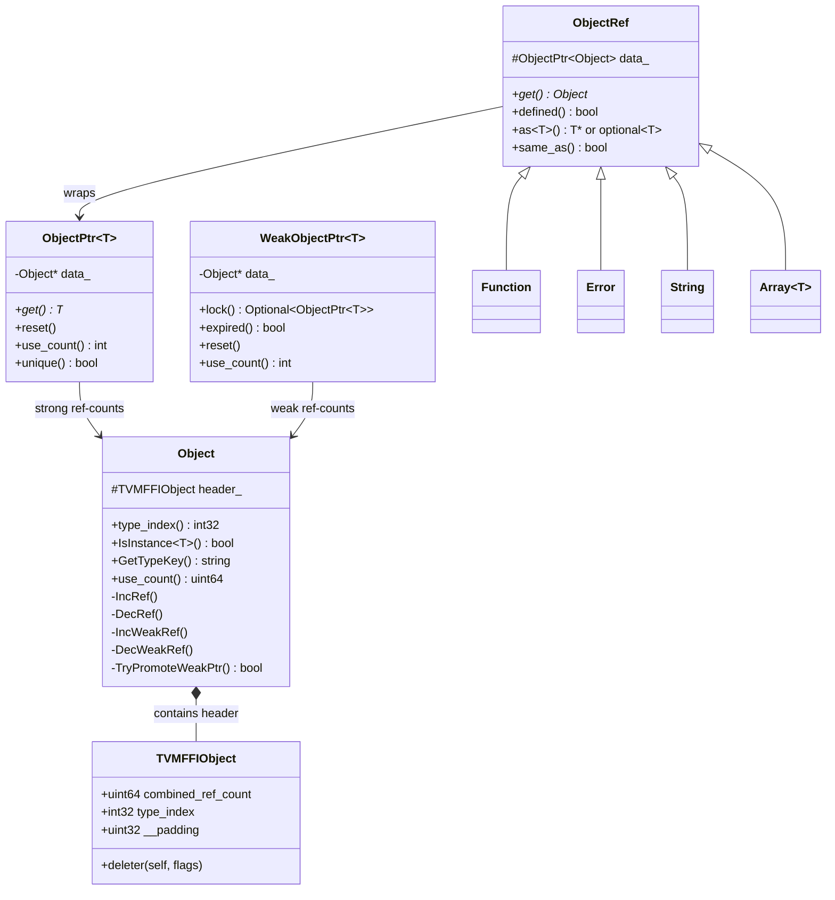

# FFI Object System (Object/ObjectRef/ObjectPtr)

**TL;DR**.
- The FFI object system is built on a quad: `Object` (data class with `TVMFFIObject` header), `ObjectRef` (non-owning handle), `ObjectPtr<T>` (intrusive strong ref-counted smart pointer), and `WeakObjectPtr<T>` (weak smart pointer). Every heap-allocated FFI value is an `Object`.
- Runtime type checking uses a two-tier `IsInstance` protocol: fast range check via pre-allocated child slots, with fallback to an ancestor table for dynamically-registered types. Single inheritance only (the type hierarchy is a tree).
- `make_object<T>(args...)` is the canonical factory that allocates, constructs, and initializes the `TVMFFIObject` header (`combined_ref_count = kCombinedRefCountBothOne`, type_index, deleter) in a single call.
- Two-phase deletion protocol: destructor runs when strong count hits zero, memory freed when weak count also hits zero. Common path (no weak refs) optimized via single-atomic `DecRef`: comparing `combined_ref_count` against `kCombinedRefCountBothOne` in one atomic subtract+compare, avoiding the second atomic load of the weak counter.

## Problem Statement
### Background
- The FFI needs a uniform heap object model visible to C, C++, Python, and Rust. Objects must be reference-counted (shared across languages), runtime-typed (cross-language `isinstance` checks), and extensible (user-defined types).
- Prior systems used external ref counting or garbage collection. Intrusive ref counting avoids extra allocations and integrates with the C ABI's `TVMFFIObject` header.

### Solution
- Every heap object begins with a `TVMFFIObject` header (`combined_ref_count` + type_index + __padding + deleter, 24 bytes). The `combined_ref_count` packs strong (lower 32 bits) and weak (upper 32 bits) ref counts into a single `uint64_t`.
- `ObjectPtr<T>` manages strong ref counts via `IncRef`/`DecRef` atomics. `WeakObjectPtr<T>` manages weak ref counts via `IncWeakRef`/`DecWeakRef`.
- `ObjectRef` wraps `ObjectPtr<Object>` and provides a safe handle with `as<T>` and `IsInstance` support.
- Runtime type information is stored in a global `TVMFFITypeInfo` table, populated on first access via `TVMFFITypeGetOrAllocIndex`.

### Goals
- Single-inheritance type hierarchy with efficient `IsInstance` checks.
- Pluggable allocators (currently `SimpleObjAllocator` using `AlignedAlloc`/`AlignedFree`).
- Cross-DLL safety via type-specific deleters.
- Weak references via `WeakObjectPtr<T>` with CAS-based promotion to strong.
- Non-goal: multiple inheritance, cycle collection.

## Design



### Key Classes, Fields and Interfaces

```python
class Object:
    """Base of all heap-allocated FFI objects."""
    header_: TVMFFIObject  # protected; 24-byte C-compatible header
    # Invariant: header_ is the FIRST field (address of Object == address of header_)
    # Invariant: single inheritance only (type hierarchy is a tree, not DAG)

    # Static type metadata (overridden by subclasses via macros):
    _type_key: str = "object.Object"       # unique string identifier
    _type_index: int32 = kTVMFFIObject      # static type index (or kTVMFFIDynObject for dynamic)
    _type_depth: int32 = 0                  # depth in inheritance tree
    _type_final: bool = False               # True if no subclasses allowed in type system
    _type_child_slots: int32 = 0            # reserved contiguous index slots for children
    _type_child_slots_can_overflow: bool = True  # allow children beyond reserved slots
    _type_mutable: bool = False               # gates non-const raw pointer extraction from Any
    _type_s_eq_hash_kind: TVMFFISEqHashKind = kUnsupported  # structural comparison mode
    # Extension: set _type_mutable=True for types with def_rw fields
    # Extension: set _type_s_eq_hash_kind to enable reflection-based structural comparison

    def __init__(self):
        self.header_.combined_ref_count = 0
        self.header_.deleter = None
        # Invariant: make_object sets combined_ref_count=kCombinedRefCountBothOne, type_index, and deleter

    def IsInstance(self, TargetType) -> bool:
        return IsObjectInstance[TargetType](self.header_.type_index)
        # Interacts with: IsObjectInstance template (see below)

    def type_index(self) -> int32:
        return self.header_.type_index

    # --- Combined ref count constants (details:: namespace) ---
    # kCombinedRefCountStrongOne: uint64 = 1             # increment for one strong ref
    # kCombinedRefCountWeakOne: uint64 = 1 << 32         # increment for one weak ref
    # kCombinedRefCountBothOne: uint64 = (1 << 32) | 1   # initial value: one strong + one weak
    # kCombinedRefCountMaskUInt32: uint64 = 0xFFFFFFFF    # mask to extract strong count

    def use_count(self) -> uint64:
        return atomic_load_relaxed(self.header_.combined_ref_count) & kCombinedRefCountMaskUInt32
        # Returns strong ref count only (lower 32 bits of combined_ref_count)

    def IncRef(self):  # private
        atomic_add_relaxed(self.header_.combined_ref_count, kCombinedRefCountStrongOne)
        # Note: +1 on uint64 only touches lower 32 bits (no carry into weak)
        # Interacts with: ObjectPtr copy constructor, AnyView-to-Any conversion

    def DecRef(self):  # private -- optimized two-phase deletion
        count_before = atomic_sub_release(self.header_.combined_ref_count, kCombinedRefCountStrongOne)
        if count_before == kCombinedRefCountBothOne:
            # FAST PATH: both counters were 1, single atomic tells us both are now 0
            # No separate weak counter read needed
            fence_acquire()
            self.header_.deleter(self.header_, kBoth)
        elif (count_before & kCombinedRefCountMaskUInt32) == kCombinedRefCountStrongOne:
            # Strong was 1 (now 0), but weak > 1: external weak refs exist
            fence_acquire()
            self.header_.deleter(self.header_, kStrong)
            # Decrement weak sentinel
            self.DecWeakRef()
        # Interacts with: ObjectPtr destructor/reset, Any destructor
        # Invariant: fast path avoids the second atomic entirely (was: decrement strong, then load weak)
        # Invariant: deleter is type-specific (set by allocator), never virtual dispatch

    def TryPromoteWeakPtr(self) -> bool:  # private
        """CAS loop on combined_ref_count; checks strong portion via mask."""
        old = atomic_load_relaxed(self.header_.combined_ref_count)
        while (old & kCombinedRefCountMaskUInt32) != 0:
            new = old + kCombinedRefCountStrongOne
            if atomic_cmpxchg(self.header_.combined_ref_count, old, new):
                return True
        return False
        # Interacts with: WeakObjectPtr.lock()

    def IncWeakRef(self):  # private
        atomic_add_relaxed(self.header_.combined_ref_count, kCombinedRefCountWeakOne)
        # Interacts with: WeakObjectPtr copy constructor

    def DecWeakRef(self):  # private
        if atomic_sub_release(self.header_.combined_ref_count, kCombinedRefCountWeakOne) == kCombinedRefCountWeakOne:
            fence_acquire()
            self.header_.deleter(self.header_, kWeak)  # free memory only
        # Interacts with: WeakObjectPtr destructor/reset, Object.DecRef slow path

class ObjectPtr(Generic[T]):
    """Intrusive ref-counted smart pointer."""
    data_: Object = None  # private, raw pointer
    # Invariant: data_ is either None or points to Object with ref_counter >= 1
    # Invariant: copy increments ref, move steals pointer and nulls source
    # Interacts with: Object.IncRef/DecRef

    def __init__(self, raw: Object):  # private, increments ref
        self.data_ = raw
        if self.data_ is not None:
            self.data_.IncRef()

    def __del__(self):
        self.reset()

    def reset(self):
        if self.data_ is not None:
            self.data_.DecRef()
            self.data_ = None

    def get(self) -> T:
        return static_cast[T](self.data_)

class ObjectRef:
    """Non-owning handle wrapper. Base of all typed ref classes."""
    data_: ObjectPtr[Object]  # protected
    # Extension: subclass with TVM_FFI_DEFINE_OBJECT_REF_METHODS_NULLABLE macro

    _type_is_nullable: bool = True  # can this ref be null?

    def defined(self) -> bool:
        return self.data_ is not None

    def get(self) -> Object:
        return self.data_.get()

    def as(self, ObjectType) -> Optional[ObjectType]:
        """Runtime downcast. Returns None on type mismatch."""
        if self.data_ is not None and self.data_.IsInstance[ObjectType.ContainerType]():
            return ObjectUnsafe.ObjectRefFromObjectPtr[ObjectType](self.data_)
        return None
        # Interacts with: IsObjectInstance, TVMFFIGetTypeInfo, UnsafeInit
        # Note: uses UnsafeInit + direct data_ assignment instead of ObjectType(self.data_)

    def same_as(self, other: ObjectRef) -> bool:
        return self.data_ == other.data_  # pointer identity

class WeakObjectPtr(Generic[T]):
    """Weak smart pointer. Does not prevent destruction, only prevents memory deallocation."""
    data_: Object = None  # private raw pointer
    # Invariant: data_ is either None or points to Object whose memory is still allocated
    # Invariant: copy/move increments/transfers weak ref count (not strong)
    # Interacts with: Object.IncWeakRef/DecWeakRef/TryPromoteWeakPtr

    def __init__(self, source: Union[ObjectPtr[T], WeakObjectPtr[T], None]):
        # From ObjectPtr: copies pointer and increments weak_ref_count
        # From WeakObjectPtr: copies pointer and increments weak_ref_count
        ...

    def __del__(self):
        self.reset()

    def lock(self) -> Optional[ObjectPtr[T]]:
        """Promote to strong pointer if object still alive."""
        if self.data_ is None:
            return None
        if self.data_.TryPromoteWeakPtr():
            return ObjectPtr[T].from_owned(self.data_)
        return None
        # Invariant: only succeeds if strong_ref_count > 0 at CAS point

    def expired(self) -> bool:
        return self.data_ is None or self.data_.use_count() == 0

    def reset(self):
        if self.data_ is not None:
            self.data_.DecWeakRef()
            self.data_ = None

    def use_count(self) -> int:
        """Returns strong ref count (not weak), for debug/test only."""
        if self.data_ is not None:
            return self.data_.use_count()
        return 0

    # Full value semantics: copy ctor, move ctor, copy assign, move assign, swap
    # Supports base-class conversions (WeakObjectPtr[Derived] -> WeakObjectPtr[Base])

class UnsafeInit:
    """Tag type requesting unsafe initialization (data_ = nullptr).
    Each ObjectRef type must provide an explicit T(UnsafeInit) constructor.
    Only for controlled internal scenarios; never use in normal user code."""
    pass
    # Interacts with: all ObjectRef subclass constructors (generated by TVM_FFI_DEFINE_*_OBJECT_REF_METHODS)
    # Interacts with: ObjectUnsafe::ObjectRefFromObjectPtr
    # Invariant: using this tag leaves the ref in null/uninitialized state

class ObjectUnsafe:
    """Friend struct with privileged access to ObjectRef internals."""
    @staticmethod
    def ObjectRefFromObjectPtr(ptr: ObjectPtr[Object]) -> T:
        """Construct any ObjectRef T from an ObjectPtr via UnsafeInit + direct data_ assignment."""
        ref = T(UnsafeInit())
        ref.data_ = ptr  # or std::move(ptr)
        return ref
        # Interacts with: ObjectRef.as(), Optional.value(), TypeTraits cast paths, GetRef, RValueRef
        # Invariant: caller must guarantee ptr's pointee is-a T.ContainerType

    @staticmethod
    def ObjectPtrFromOwned(handle: TVMFFIObjectHandle) -> ObjectPtr[T]:
        """Wrap a raw C handle into ObjectPtr without incrementing ref count."""
        ...
```

#### IsInstance Protocol

```python
def IsObjectInstance(TargetType, object_type_index: int32) -> bool:
    """Two-tier runtime type check."""
    # Tier 1: If TargetType is Object, always True
    if TargetType is Object:
        return True

    # Tier 2: If TargetType is final, exact match only
    if TargetType._type_final:
        return object_type_index == TargetType.RuntimeTypeIndex()

    # Tier 3: Fast range check using reserved child slots
    target_idx = TargetType.RuntimeTypeIndex()
    if TargetType._type_child_slots != 0:
        # Children are allocated in [target_idx, target_idx + child_slots + 1)
        if target_idx <= object_type_index < target_idx + TargetType._type_child_slots + 1:
            return True
    else:
        if object_type_index == target_idx:
            return True

    # Tier 4: Overflow check -- bail if not allowed
    if not TargetType._type_child_slots_can_overflow:
        return False

    # Tier 5: Fallback -- walk ancestor table (pointer-based for O(1) lookup)
    # Invariant: parent index is always smaller than child index
    if object_type_index < target_idx:
        return False
    type_info = TVMFFIGetTypeInfo(object_type_index)
    return (type_info.type_depth > TargetType._type_depth
            and type_info.type_ancestors[TargetType._type_depth].type_index == target_idx)
    # Interacts with: TVMFFITypeInfo.type_ancestors (TypeInfo** pointers, not int32* indices)
```

#### Object Allocation

```python
def make_object(T, *args) -> ObjectPtr[T]:
    """Canonical factory for heap objects."""
    # 1. Allocate aligned storage via AlignedAlloc
    storage = AlignedAlloc[alignof(T)](sizeof(T))  # platform-portable aligned allocation
    ptr = placement_new(storage, T, *args)
    # 2. Initialize FFI header
    ffi_ptr = ptr.header_
    ffi_ptr.combined_ref_count = kCombinedRefCountBothOne  # one strong + one weak sentinel
    ffi_ptr.type_index = T.RuntimeTypeIndex()
    ffi_ptr.__padding = 0  # zero-initialized for memory hygiene
    ffi_ptr.deleter = type_specific_deleter[T]  # accepts (void*, int) for two-phase deletion
    # 3. Return smart pointer (no additional IncRef -- already 1)
    return ObjectPtr[T].from_owned(ptr)
    # Interacts with: details::SimpleObjAllocator, details::AlignedAlloc/AlignedFree
    # Invariant: deleter signature is (void*, int), casts internally to TVMFFIObject*
    # Invariant: deleter calls T::~T() on kStrong flag, AlignedFree on kWeak flag, both on kBoth
    # Invariant: weak portion=1 sentinel enables single-atomic DecRef fast path
    # Extension: replace SimpleObjAllocator with arena/pool allocator

# --- Allocation primitives (details:: namespace) ---

def AlignedAlloc(size: int) -> void_ptr:
    """Allocate aligned memory. Template parameter: align (power of 2)."""
    # Platform dispatch:
    #   MSVC: _aligned_malloc(size, align)
    #   Non-MSVC, align <= alignof(max_align_t): std::malloc(size)
    #   Non-MSVC, align > alignof(max_align_t): posix_memalign(&ptr, align, size)
    # Invariant: throws std::bad_alloc on failure (never returns nullptr)
    # Interacts with: SimpleObjAllocator::Handler::New, ArrayHandler::New
    ...

def AlignedFree(data: void_ptr) -> None:
    """Free aligned memory. Platform dispatch: MSVC uses _aligned_free, others use std::free."""
    # Interacts with: SimpleObjAllocator deleter functions
    ...
```

### Contracts, Assumptions and Invariants
- **Header-first layout**: `Object::header_` must be the first member (24 bytes). Pointer arithmetic `(Object*)obj == (TVMFFIObject*)&obj->header_` is assumed by C API accessors and `ObjectUnsafe` helpers.
- **Single inheritance**: The type hierarchy is a strict tree. `type_ancestors[depth]` stores the ancestor at each depth level. No diamond inheritance.
- **Type index uniqueness**: Each type has exactly one `type_index`, assigned once via `_GetOrAllocRuntimeTypeIndex()` (cached in a `static` local variable).
- **Deleter non-virtuality**: The deleter stored in `TVMFFIObject` takes `(void*, int)` (changed from `(TVMFFIObject*, int)`) and internally casts to the concrete type. It calls `T::~T()` explicitly (not `virtual ~Object()`). This is critical for cross-DLL safety: each DLL provides its own deleter that knows the exact type.
- **Two-phase deletion with single-atomic fast path**: `DecRef` subtracts `kCombinedRefCountStrongOne` from `combined_ref_count` and compares the result. If `count_before == kCombinedRefCountBothOne`, both strong and weak were 1, so both are now 0 -- the deleter is called with `kBoth` in a single atomic operation (no second read of the weak counter). If only strong was 1 but weak > 1, the deleter is called with `kStrong`, then the sentinel weak ref is decremented.
- **Weak ref sentinel**: `make_object` initializes the weak portion of `combined_ref_count` to 1 (via `kCombinedRefCountBothOne`) to represent the strong holder's implicit weak reference. This sentinel enables the single-atomic fast path.

### Extension Points
- **Allocator replacement**: The `ObjAllocatorBase<Derived>` CRTP pattern allows arena allocators or object pools. Replace `details::SimpleObjAllocator` with a custom allocator that implements `Handler<T>::New()` and `Handler<T>::Deleter()`.
- **In-place array objects**: `make_inplace_array_object<ArrayType, ElemType>(num_elems, args...)` allocates variable-length objects (e.g., `ArrayObj` with inline element storage).
- **Child slot reservation**: Set `_type_child_slots` on base classes to reserve contiguous index ranges for fast `IsInstance` checks on subtypes.

### Usage Examples

#### Defining a New Object Type
**Context**: Creating a custom data type with the Object/ObjectRef pattern.
```cpp
// Step 1: Data class with TVMFFIObject header (via Object base)
class MyNodeObj : public Object {
 public:
  String name;
  int value;
  TVM_FFI_DECLARE_OBJECT_INFO_FINAL("test.MyNode", MyNodeObj, Object);
  // Macro expansion generates:
  //   static constexpr const char* _type_key = "test.MyNode";  (absorbed)
  //   static const constexpr int _type_child_slots = 0;
  //   static const constexpr bool _type_final = true;
  //   static int32_t _GetOrAllocRuntimeTypeIndex() { /* registers type */ }
  //   static int32_t RuntimeTypeIndex() { return _GetOrAllocRuntimeTypeIndex(); }
};

// Step 2: Ref wrapper for safe handle semantics
class MyNode : public ObjectRef {
 public:
  TVM_FFI_DEFINE_OBJECT_REF_METHODS_NULLABLE(MyNode, ObjectRef, MyNodeObj);
  // Macro expansion generates:
  //   using __PtrType = std::conditional_t<MyNodeObj::_type_mutable, MyNodeObj*, const MyNodeObj*>;
  //   MyNode() = default;
  //   explicit MyNode(ObjectPtr<MyNodeObj> n) : ObjectRef(n) {}
  //   __PtrType operator->() const { ... }
  //   const MyNodeObj* get() const { ... }
  //   using ContainerType = MyNodeObj;
};

// Step 3: Create and use
ObjectPtr<MyNodeObj> ptr = make_object<MyNodeObj>();
ptr->name = String("example");
ptr->value = 42;
MyNode ref(ptr);  // ref-counted handle
assert(ref->name.data() == "example");
```

#### Using WeakObjectPtr for Non-Owning References
**Context**: Holding a reference to an object without preventing its destruction (e.g., caches, observer patterns).
```cpp
#include <tvm/ffi/object.h>

// Create a strong pointer
ObjectPtr<MyNodeObj> strong = make_object<MyNodeObj>();
strong->value = 42;

// Create a weak pointer (increments weak_ref_count, not strong)
WeakObjectPtr<MyNodeObj> weak(strong);

// Lock to promote back to strong (CAS-based, thread-safe)
ObjectPtr<MyNodeObj> locked = weak.lock();
assert(locked != nullptr && locked->value == 42);
assert(strong.use_count() == 2);  // strong + locked

// Drop all strong refs: destructor runs, but memory stays until weak dies
strong.reset();
locked.reset();
assert(weak.expired());             // object destroyed
assert(weak.lock() == nullptr);     // promotion fails
// weak.reset() or ~WeakObjectPtr frees memory (deleter with kWeak flag)
```

## Implementation Notes
- `Object::IncRef` uses relaxed atomic add of `kCombinedRefCountStrongOne` on `combined_ref_count`. `Object::DecRef` uses a release-only atomic subtract with a conditional acquire fence. The fast path checks `count_before == kCombinedRefCountBothOne` -- if true, both strong and weak are now zero in a single atomic operation, and the deleter is called with `kBoth`. The slow path (external weak refs exist) calls `kStrong` then decrements the weak sentinel.
- `ObjectUnsafe` is a friend struct providing internal helpers (`GetHeader`, `ObjectPtrFromOwned`, `MoveObjectRefToTVMFFIObjectPtr`, `ObjectRefFromObjectPtr<T>`) used by the `Any` system, function call paths, and `ObjectRef::as<T>()`. These are not part of the public API. `ObjectRefFromObjectPtr<T>` constructs a typed ref via `UnsafeInit` + direct `data_` assignment, replacing the old `T(ObjectPtr<Object>)` constructor pattern.
- The `details::SimpleObjAllocator` uses `AlignedAlloc<alignof(T)>(sizeof(T))` and `AlignedFree(data)` for memory management (replacing C++ `new`/`delete`). `Handler<T>::Deleter_` takes `(void* objptr, int flags)` and dispatches: `kStrong` calls `T::~T()`, `kWeak` calls `AlignedFree`, `kBoth` does both. `ArrayHandler<ArrayType, ElemType>` computes exact allocation size `sizeof(ArrayType) + sizeof(ElemType) * num_elems`, rounded up to `alignof(ArrayType)` boundary, reducing waste compared to the old `std::aligned_storage` slot-based approach.

## Alternatives & Trade-offs
### Intrusive vs. External Ref Counting
- Pros of intrusive: No separate control block allocation. Object pointer is the only handle needed. Compatible with C ABI (ref count in header). Weak references supported via inline `weak_ref_count` in the 24-byte header.
- Cons: Object must inherit from `Object` base class. Header size (24 bytes) slightly larger than minimal (16 bytes without weak ref support).
### Static Child Slots vs. Pure Dynamic Lookup
- Pros of static slots: O(1) `IsInstance` for common cases (e.g., checking if something is an `Expr` subtype). Avoids global table lookup.
- Cons: Wastes index space if slot count is overestimated. Requires up-front knowledge of type hierarchy breadth.

## Evidence
| Commit | Scope | Contribution |
|--------|-------|-------------|
| 7d34eb8 | ffi/object, ffi/memory | Introduced Object/ObjectRef/ObjectPtr, make_object, type hierarchy |
| 1a856886 | ffi/object | Added `_type_mutable` flag |
| d5209f0c | ffi/object | Optimized DecRef atomics (release-only + conditional acquire) |
| 837800e7 | ffi/object | Changed type_ancestors from int32* to TypeInfo** |
| 0966c368 | ffi/object | Renamed type keys from `object.*` to `ffi.*` |
| 9445fe73 | ffi/object | Added `_type_s_eq_hash_kind` convention |
| ca9c3d1 | ffi/object, ffi/memory | Added WeakObjectPtr, two-phase deletion, grew TVMFFIObject to 24 bytes |
| 91d69f0 | ffi/object | Added `OpaqueObjectImpl` with multiple-inheritance cell layout for opaque Python objects |
| 472e10c | ffi/object | Introduced `UnsafeInit` tag, `ObjectUnsafe::ObjectRefFromObjectPtr`, tightened ObjectRef constructors |
| 24125d0 | ffi/object | Changed `FObjectDeleter` signature to `(void*, int)`, moved `SimpleObjAllocator` to `details::` |
| 13436f01 | ffi/c-api, ffi/object | Reordered TVMFFIObject header: ref counts first (u32), type_index moved to offset +8 |
| 98cb8af4 | ffi/object | Renamed `type_acenstors`->`type_ancestors` (typo fix) |
| 43d13e86 | ffi/object, ffi/memory | Packed ref counts into `combined_ref_count: uint64` for single-atomic DecRef fast path |
| 6fb42a77 | ffi/memory | Replaced `new`/`delete` with `AlignedAlloc`/`AlignedFree` in `SimpleObjAllocator`; exact array allocation sizing |
| f9179ec2 | ffi/memory | Zero-initialized `__padding` in `TVMFFIObject` header during allocation |

## Related Design Docs & ADRs
- [0001-c-abi.md](0001-c-abi.md) -- `TVMFFIObject` C-level header that `Object` wraps
- [0002-any-value-system.md](0002-any-value-system.md) -- `Any` manages ref counts for Object values
- [0008-object-macros.md](0008-object-macros.md) -- Macro expansions for object declaration
- [0007-reflection.md](0007-reflection.md) -- Reflection uses byte offsets from Object header
