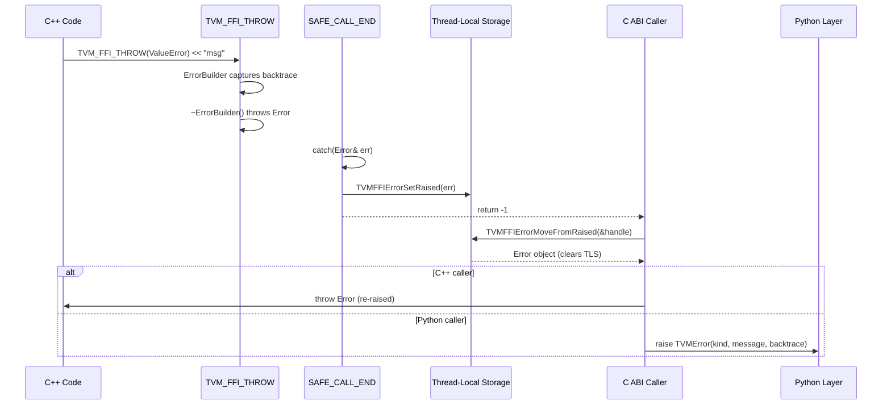

# Error Propagation Protocol

**TL;DR**.
- Errors are object-based (`ErrorObj` with kind/message/backtrace fields) rather than string-based, enabling structured cross-language error handling with rich diagnostics.
- The TLS (thread-local storage) propagation protocol allows errors to cross C ABI boundaries: throw -> `TVM_FFI_SAFE_CALL_END` catches -> `TVMFFIErrorSetRaised` stores in TLS -> caller checks return code -> `TVMFFIErrorMoveFromRaised` retrieves -> re-throw.
- `TVM_FFI_THROW(ErrorKind)` is a stream-based macro that captures file/line/function backtrace at the throw site and constructs the error via an `ErrorBuilder` whose destructor throws.
- Backtraces are stored in most-recent-call-first order internally; `Error::TracebackMostRecentCallLast()` reverses for Python-style display. `TVMFFIBacktraceUpdateMode` enum controls replace vs. append semantics.

## Problem Statement

### Background
- C++ exceptions cannot cross C ABI boundaries or DLL boundaries safely (different runtimes may have incompatible exception handling).
- Error messages in FFI systems need to carry structured information (kind, message, backtrace) to produce useful diagnostics in the calling language (e.g., Python backtraces that include C++ stack frames).
- Traditional C error handling (return codes + `errno`) loses error context and cannot carry rich error objects.

### Solution
- `ErrorObj` stores structured error data (kind, message, backtrace) as a ref-counted FFI object, following the standard Object pattern.
- At C ABI boundaries, `TVM_FFI_SAFE_CALL_END` catches C++ `Error` exceptions and stores them in thread-local storage via `TVMFFIErrorSetRaised`. The callee returns an error code (-1 or -2).
- The caller checks the return code, retrieves the error from TLS via `TVMFFIErrorMoveFromRaised`, and either re-throws it (C++) or translates it to a native exception (Python).

### Goals
- Structured error objects that survive C ABI boundary crossings.
- Traceback accumulation across language boundaries (C++ -> Python -> C++ chains).
- Support for frontend signal interrupts (`EnvErrorAlreadySet` error kind; since `b1611e0`, unified into the Error system — no more separate return code -2).
- Error cause chaining via `cause_chain` and `extra_context` fields on `ErrorObj` (`4c712ca`).
- Exception-free error handling via `Expected<T>` (`0a9d4b6`).
- Non-goal: exception specifications; checked exceptions; error recovery strategies.

## Design



### Key Classes, Fields and Interfaces

```python
class TVMFFIErrorCell:
    """C ABI layout for error data, follows TVMFFIObject header."""
    kind: TVMFFIByteArray          # e.g., "ValueError", "RuntimeError", "InternalError"
    message: TVMFFIByteArray       # Human-readable error description
    backtrace: TVMFFIByteArray     # Stack trace string
    update_backtrace: Callable[[TVMFFIObjectHandle, TVMFFIByteArray_ptr], None]
        # Allows appending/updating backtrace across language boundaries
    cause_chain: Optional[TVMFFIObjectHandle]  # owned, nullable; error chain (4c712ca)
    extra_context: Optional[TVMFFIObjectHandle]  # owned, nullable; additional info (4c712ca)
    # Invariant: layout is { TVMFFIObject header, TVMFFIErrorCell }
    # Invariant: cause_chain and extra_context are DecRef'd in ~ErrorObj()
    # Interacts with: TVMFFIErrorGetCellPtr (C API accessor)

class ErrorObj(Object):
    """Error object class inheriting Object + TVMFFIErrorCell layout."""
    _type_index: ClassVar[int32] = kTVMFFIError  # 67
    _type_key: ClassVar[str] = "ffi.Error"
    # Inherits kind, message, backtrace from TVMFFIErrorCell
    # Interacts with: ErrorObjFromStd (std::string-backed concrete impl)

class Error(ObjectRef, Exception):
    """C++ exception wrapping ErrorObj for cross-language error propagation."""

    def __init__(self, kind: str, message: str, backtrace: str,
                 cause_chain: Optional["Error"] = None,
                 extra_context: Optional[ObjectRef] = None) -> None:
        """Create error with ErrorObjFromStd backing store. (4c712ca added cause/context)"""
        # Interacts with: make_object<ErrorObjFromStd>

    def kind(self) -> str: ...
    def message(self) -> str: ...
    def cause_chain(self) -> Optional["Error"]:
        """Get the cause chain of the error. (4c712ca)"""
        ...
    def extra_context(self) -> Optional[ObjectRef]:
        """Get extra context attached to the error. (4c712ca)"""
        ...
    def backtrace(self) -> str: ...
    def UpdateBacktrace(self, backtrace: TVMFFIByteArray_ptr, update_mode: int) -> None:
        """Update backtrace with replace or append semantics."""
        # Interacts with: ErrorObj.update_backtrace function pointer
        # update_mode: 0=Replace, 1=Append (TVMFFIBacktraceUpdateMode enum)
    def TracebackMostRecentCallLast(self) -> str:
        """Reverse backtrace lines for Python-style display (most recent call last)."""
        # Invariant: reverses line order; preserves individual line content
    def what(self) -> str:
        """Format as 'Traceback...\nKind: message' using TracebackMostRecentCallLast()."""
        # Uses thread_local string to avoid dangling pointer from what()
    # Invariant: Error is both ObjectRef (for FFI transport) and std::exception (for C++ throw/catch)
    # Interacts with: TVM_FFI_THROW, TVM_FFI_SAFE_CALL_END

class EnvErrorAlreadySet(Error):
    """Error subclass indicating the frontend (e.g., Python) already has an error set."""
    # Since b1611e0: unified into Error system with kind="EnvErrorAlreadySet"
    # SAFE_CALL_END now returns -1 (same as all other errors); no more -2
    # Interacts with: TVMFFIEnvCheckSignals (checks for Python signals like Ctrl-C)

class ErrorBuilder:
    """Stream-based error constructor. Destructor throws the error."""
    kind_: str
    stream_: ostringstream
    backtrace_: str
    log_before_throw_: bool

    def __del__(self) -> None:  # [[noreturn]] ~ErrorBuilder()
        """Construct Error from accumulated message and throw it."""
        # 1. error = Error(kind_, stream_.str(), backtrace_)
        # 2. if log_before_throw_: stderr << error.what()
        # 3. throw error
    def stream(self) -> ostringstream: ...
    # Invariant: destructor always throws (marked [[noreturn]])
    # Interacts with: TVM_FFI_THROW macro, TVM_FFI_LOG_AND_THROW macro

# Macro expansion (pseudocode for TVM_FFI_THROW):
# TVM_FFI_THROW(ErrorKind)
#   expands to:
#     ErrorBuilder("ErrorKind", TVMFFIBacktrace(__FILE__, __LINE__, __func__, 0), false).stream()
#   Usage: TVM_FFI_THROW(ValueError) << "x must be > 0, got " << x;
#   The ErrorBuilder temporary's destructor fires at statement end, throwing the Error.
#   Note: 4th arg cross_ffi_boundary=0 stops backtrace at FFI boundary (2d41a51)

# Macro expansion (pseudocode for TVM_FFI_CHECK):
# TVM_FFI_CHECK(cond, ErrorKind)  (327e8cc, ae06434)
#   expands to:
#     if (!(cond)) TVM_FFI_THROW(ErrorKind) << "Check failed: (" #cond << ") is false: "
#   Usage: TVM_FFI_CHECK(value >= 0, ValueError) << "must be non-negative, got " << value;
#   Interacts with: TVM_FFI_THROW, ErrorBuilder
#   Extension: use for user-facing checks where InternalError (from TVM_FFI_ICHECK) is too generic

# Macro expansion (pseudocode for TVM_FFI_SAFE_CALL_BEGIN/END):
# TVM_FFI_SAFE_CALL_BEGIN()
#   expands to: try {
# TVM_FFI_SAFE_CALL_END()
#   expands to:
#     return 0;  // success
#     } catch (const Error& err) {
#         SetSafeCallRaised(err);  // stores in TLS
#         return -1;
#     } catch (const EnvErrorAlreadySet&) {
#         return -2;               // frontend already has error
#     } catch (const std::exception& ex) {
#         SetSafeCallRaised(Error("InternalError", ex.what(), ""));
#         return -1;
#     }

# Macro expansion (pseudocode for TVM_FFI_CHECK_SAFE_CALL):
# TVM_FFI_CHECK_SAFE_CALL(func_call)
#   expands to:
#     int ret_code = func_call;
#     if (ret_code == -2) throw EnvErrorAlreadySet();
#     if (ret_code == -1) throw MoveFromSafeCallRaised();  // retrieves from TLS

# C API for TLS error management:
def TVMFFIErrorSetRaised(error: TVMFFIObjectHandle) -> None:
    """Store error in TLS for retrieval by caller."""
    # Interacts with: thread-local error variable
def TVMFFIErrorMoveFromRaised(result: TVMFFIObjectHandle_ptr) -> None:
    """Move error out of TLS into result, clearing TLS."""
    # Invariant: clears the TLS slot after retrieval
class TVMFFIBacktraceUpdateMode:
    """Enum for backtrace update semantics."""
    kTVMFFIBacktraceUpdateModeReplace = 0  # Replace entire backtrace
    kTVMFFIBacktraceUpdateModeAppend = 1   # Append frames to existing backtrace
    # Interacts with: Error::UpdateBacktrace, TVMFFIErrorCell.update_backtrace

def TVMFFIErrorCreate(kind: TVMFFIByteArray_ptr, message: TVMFFIByteArray_ptr,
                      backtrace: TVMFFIByteArray_ptr, out: TVMFFIObjectHandle_ptr) -> int:
    """Create an error object. Returns 0 on success, nonzero on failure (e.g. MemoryError)."""
    # Invariant: on failure, does NOT set TLS error (avoids recursion in error creation)

def TVMFFIErrorSetRaisedFromCStrParts(kind: const_char_ptr, num_parts: int32,
                                       parts: const_char_ptr_array) -> None:
    """Create and set error from C string kind + multiple message parts concatenated. (550e92f)"""
    # Concatenates parts[0..num_parts] into a single message string
    # Invariant: all parts must be valid C strings (null-terminated)
    # Extension: useful for C code that constructs error messages piecewise without sprintf
    # Interacts with: TVMFFIErrorSetRaised (stores the created error in TLS)

def TVMFFIBacktrace(filename: str, lineno: int, func: str, cross_ffi_boundary: int) -> TVMFFIByteArray_ptr:
    """Get stack backtrace. Result is in most-recent-call-first order."""
    # Invariant: result valid until next call to TVMFFIBacktrace on same thread

def TVMFFIErrorCreateWithCauseAndExtraContext(
    kind: TVMFFIByteArray_ptr, message: TVMFFIByteArray_ptr, backtrace: TVMFFIByteArray_ptr,
    cause_chain: TVMFFIObjectHandle, extra_context: TVMFFIObjectHandle,
    out: TVMFFIObjectHandle_ptr) -> int:
    """Create an error with cause chain and extra context. (4c712ca)"""
    # Interacts with: TVMFFIErrorCreate, ErrorObj ownership protocol

class Unexpected[E: Error]:
    """Wrapper for explicit error construction in Expected. (0a9d4b6)"""
    def __init__(self, error: E) -> None: ...
    def error(self) -> E: ...

class Expected[T]:
    """Exception-free error handling container, like Rust Result<T, Error> or C++23 std::expected. (0a9d4b6)"""
    # Invariant: T cannot be Error (use Error directly)
    def __init__(self, value: T) -> None: ...         # success path
    def __init__(self, error: Error) -> None: ...      # error path
    def __init__(self, unexpected: Unexpected[E]) -> None: ...  # explicit error
    def is_ok(self) -> bool: ...
    def is_err(self) -> bool: ...
    def has_value(self) -> bool: ...   # alias for is_ok()
    def value(self) -> T: ...          # throws contained error if is_err()
    def error(self) -> Error: ...      # throws RuntimeError if is_ok()
    def value_or(self, default: T) -> T: ...
    # Interacts with: Any (stores T or Error internally), TypeTraits<Expected<T>>
    # Extension: combine with Function::CallExpected<T> for exception-free FFI calls
```

### Contracts, Assumptions and Invariants
- **TLS error slot is single-entry**: Only one error can be stored at a time. `TVMFFIErrorSetRaised` overwrites any existing error. `TVMFFIErrorMoveFromRaised` clears the slot atomically.
- **Return code semantics**: 0 = success, -1 = error stored in TLS (retrieve with `MoveFromRaised`). Error code -2 was removed (`b1611e0`); `EnvErrorAlreadySet` is now a proper `Error` with `kind="EnvErrorAlreadySet"` stored in TLS like any other error.
- **ErrorBuilder destructor always throws**: The `~ErrorBuilder()` destructor is `[[noreturn]]`. This is safe because ErrorBuilder is always created as a temporary in the `TVM_FFI_THROW` macro expansion. MSVC warnings for throwing destructors are suppressed with `#pragma`.
- **Traceback mutability**: The `update_backtrace` function pointer on ErrorCell allows the backtrace to be appended to as the error propagates through language layers (e.g., adding Python frames on top of C++ frames).
- **std::exception fallback**: `TVM_FFI_SAFE_CALL_END` catches generic `std::exception` and wraps it as `InternalError`, ensuring no exception escapes the C ABI boundary.

### Extension Points
- **Custom error kinds**: Error kinds are strings, not enums. Any string can be used (e.g., `"ValueError"`, `"RuntimeError"`, `"TypeError"`, `"InternalError"`). New kinds require no code changes.
- **Frontend signal integration**: `TVMFFIEnvCheckSignals()` hooks into the frontend runtime (e.g., Python's `PyErr_CheckSignals`). Long-running C++ functions should call this periodically and throw `EnvErrorAlreadySet` if it returns non-zero.
- **Backtrace storage order**: Backtraces are stored in most-recent-call-first order. `Error::TracebackMostRecentCallLast()` reverses for Python-style display. This enables efficient append during error propagation (new frames are always at the front).
- **Backtrace backends**: `TVMFFIBacktrace(filename, lineno, func, cross_ffi_boundary)` is configurable via `TVM_FFI_USE_LIBBACKTRACE`. When enabled, it captures native stack traces; when disabled, it falls back to file/line/func. The `cross_ffi_boundary` parameter (int) controls whether the backtrace stops at the FFI boundary (`0`, default for `TVM_FFI_THROW`) or crosses it (`1`, used by segfault handlers). Internally, `ShouldStopTraceback` was renamed to `DetectFFIBoundary`, which matches against Python ABI symbols (`slot_tp_call`, `PyObject*`) and library-provided boundary symbols.

### Usage Examples

#### Throwing and catching a structured error
**Context**: C++ code that validates inputs and throws a rich error with backtrace.
```cpp
void Validate(int x) {
  if (x < 0) {
    TVM_FFI_THROW(ValueError) << "Expected non-negative, got " << x;
    // ErrorBuilder captures: kind="ValueError", backtrace=<file:line:func>
    // Destructor throws Error("ValueError", "Expected non-negative, got -1", backtrace)
  }
}

// Catching at a safe_call boundary (generated by TVM_FFI_SAFE_CALL_BEGIN/END):
int SafeValidate(void* self, const TVMFFIAny* args, int32_t n, TVMFFIAny* result) {
  TVM_FFI_SAFE_CALL_BEGIN();
  int x = AnyView::CopyFromTVMFFIAny(args[0]).cast<int>();
  Validate(x);
  TVM_FFI_SAFE_CALL_END();
  // On error: Error caught, stored in TLS, returns -1
}
```

## Alternatives & Trade-offs
### String-only error propagation (rejected)
- Pros: Simpler; no need for error objects or TLS.
- Cons: Loses structured information (kind vs. message vs. backtrace); cannot update backtrace across language boundaries; string parsing is fragile.

### Return error objects directly through arguments (rejected)
- Pros: No TLS dependency; more explicit error flow.
- Cons: Complicates every C API signature (extra out-param); harder for compiler codegen to chain calls; the TLS design simplifies `safe_call` signatures.

## Related Work
### Design Records
- `0003-function-system.md` -- safe_call/call dual path uses this error protocol at DLL boundaries
- `0001-any-anyview-value-system.md` -- Error is an Object stored in Any when needed
- `0002-object-system.md` -- ErrorObj follows the Object + Cell layout pattern
- `0007-c-abi.md` -- TVMFFIErrorCell, TVMFFIErrorSetRaised, TVMFFIErrorMoveFromRaised are C ABI surface

### Evidence Matrix
- TLS error propagation protocol -> `commits/2025-05-06-7d34eb8abfe987bf0031e4d4ff479895d867a966.md` + `7d34eb8` + `ErrorObj`, `TVMFFIErrorSetRaised`, `TVMFFIErrorMoveFromRaised`
- ErrorBuilder stream pattern -> `commits/2025-05-06-7d34eb8abfe987bf0031e4d4ff479895d867a966.md` + `7d34eb8` + `TVM_FFI_THROW`, `ErrorBuilder`
- Safe call macros -> `commits/2025-05-06-7d34eb8abfe987bf0031e4d4ff479895d867a966.md` + `7d34eb8` + `TVM_FFI_SAFE_CALL_BEGIN`, `TVM_FFI_SAFE_CALL_END`
- EnvErrorAlreadySet protocol -> `commits/2025-05-06-7d34eb8abfe987bf0031e4d4ff479895d867a966.md` + `7d34eb8` + `EnvErrorAlreadySet`, `TVMFFIEnvCheckSignals`
- TVMFFIBacktrace cross_ffi_boundary, DetectFFIBoundary rename -> `commits/2025-08-24-2d41a5115...md` + `2d41a51` + `TVMFFIBacktrace`, `cross_ffi_boundary`, `DetectFFIBoundary`
- traceback->backtrace rename, TVMFFIBacktraceUpdateMode, Error::TracebackMostRecentCallLast, TVMFFIErrorCreate ABI change -> `commits/2025-09-22-6f020c11c...md` + `6f020c1` + `TVMFFIBacktrace`, `TVMFFIBacktraceUpdateMode`, `Error::TracebackMostRecentCallLast()`
- TVMFFIErrorSetRaisedFromCStrParts C API -> `commits/2025-10-13-550e92fc...md` + `550e92f` + `TVMFFIErrorSetRaisedFromCStrParts`
- Error cause chaining (cause_chain, extra_context) -> `commits/2026-01-11-4c712ca3ec72ad18...md` + `4c712ca` + `TVMFFIErrorCreateWithCauseAndExtraContext`, `Error::cause_chain()`
- EnvErrorAlreadySet unification into Error.kind -> `commits/2026-02-03-b1611e0cf669518d...md` + `b1611e0` + `EnvErrorAlreadySet` as Error subclass, removes -2 error code
- Expected<T> exception-free error handling -> `commits/2026-02-06-0a9d4b681cb017e9...md` + `0a9d4b6` + `Expected<T>`, `Unexpected<E>`, `Function::CallExpected<T>`
