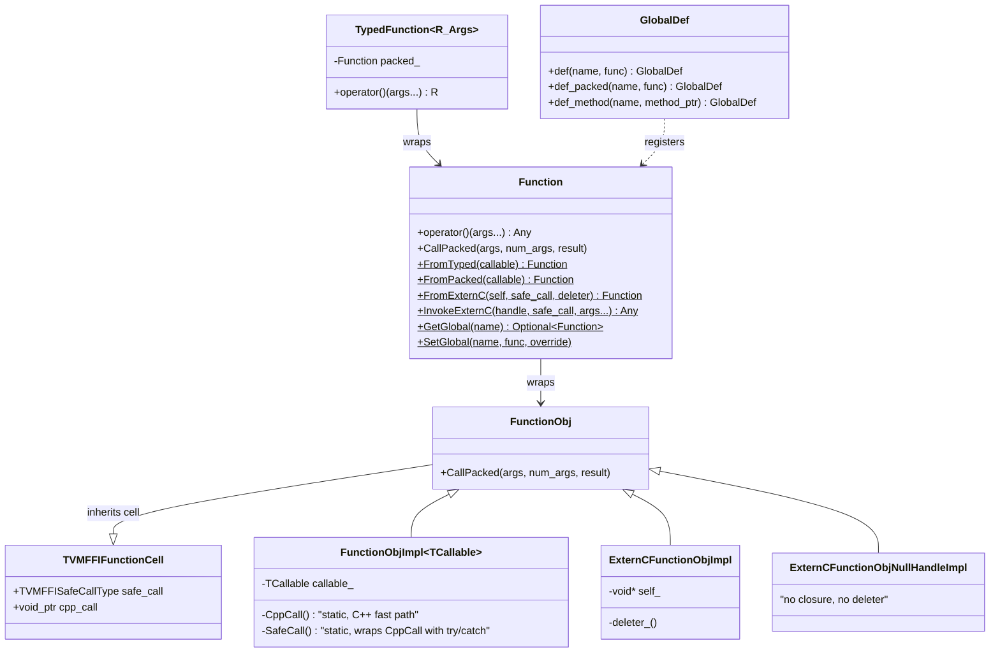

# FFI Function System

**TL;DR**.
- `FunctionObj` is a heap object with `safe_call` (C ABI entry, catches exceptions, returns error code) and `cpp_call` (C++ fast-path, stored in `TVMFFIFunctionCell` as `void*`). When `cpp_call` is non-NULL, `CallPacked` uses it directly; when NULL (C-origin functions), it falls back to `safe_call` via `CppCallDedirectToSafeCall`. `Function` is the ObjectRef wrapper providing `operator()`, global registry access, and construction from typed/packed callables.
- Global function registration has migrated from the macro-based `TVM_FFI_REGISTER_GLOBAL` / `Function::Registry` pattern to the reflection-integrated `refl::GlobalDef` builder inside `TVM_FFI_STATIC_INIT_BLOCK`. The old `Function::Registry` class and `TVM_FFI_REGISTER_GLOBAL` macro have been removed.
- The global registry internally stores `GlobalFunctionTable::Entry` objects (an Object subclass carrying `TVMFFIMethodInfo` metadata: name, doc, metadata) rather than raw function pointers, enabling metadata-rich function lookup.

## Problem Statement
### Background
- The FFI needs a universal callable abstraction that works across C, C++, Python, and Rust. Functions must be passable as values, storable in the global registry, and callable from any language binding.
- Different construction paths exist: C++ lambdas, C-style callbacks, and raw C function pointers with no closure handle.

### Solution
- `FunctionObj` inherits from both `Object` (for ref counting) and `TVMFFIFunctionCell` (for C ABI access to `safe_call`).
- Three construction patterns: `FromTyped` (typed C++ callables auto-wrapped into packed format), `FromPacked` (already in packed format), and `FromExternC` (raw C function pointers, with optional closure handle and deleter).
- The global registry maps string names to `Function` handles, enabling cross-language function lookup. Registration uses `refl::GlobalDef` inside `TVM_FFI_STATIC_INIT_BLOCK`.

### Goals
- Type-erased calling convention: all functions accept `(AnyView*, int32_t, Any*)`.
- Safe exception boundary at every cross-language call.
- Compile-time type checking via `TypedFunction<R(Args...)>`.
- Non-goal: function overloading in the **global registry** (registry is 1:1 name to function). However, method-level overloading is supported via `OverloadObjectDef` in the reflection subsystem (see [0007-reflection](0007-reflection.md)).

## Design



### Key Classes, Fields and Interfaces

```python
class TVMFFIFunctionCell:
    """C-level function cell accessible from any language binding."""
    safe_call: TVMFFISafeCallType  # C ABI entry: (handle, args, num_args, result) -> int
    cpp_call: void_ptr             # C++ fast-path entry; NULL for non-C++ functions
    # Invariant: cpp_call is NULL for functions not originally created in C++
    # Invariant: when non-NULL, cpp_call has signature void(const FunctionObj*, const AnyView*, int32, Any*)
    # Interacts with: FunctionObj.CallPacked (reads cpp_call), FunctionObjImpl (sets cpp_call)

class FunctionObj(Object, TVMFFIFunctionCell):
    """Backing object for type-erased functions."""
    # Inherits safe_call and cpp_call from TVMFFIFunctionCell
    # Interacts with: Function (ref wrapper), global registry

    _type_index = kTVMFFIFunction  # static type index 68
    _type_key = "ffi.Function"     # renamed from "object.Function"

    def CallPacked(self, args: AnyView_array, num_args: int32, result: Any) -> None:
        # Branchless select between cpp_call and CppCallDedirectToSafeCall
        call_ptr = reinterpret_cast[FCall](self.cpp_call) if self.cpp_call else CppCallDedirectToSafeCall
        call_ptr(self, args, num_args, result)
        # Invariant: if cpp_call is NULL, falls back to safe_call via CppCallDedirectToSafeCall
        # Interacts with: CppCallDedirectToSafeCall (private), TVM_FFI_CHECK_SAFE_CALL

# --- Construction Patterns ---

class FunctionObjImpl(Generic[TCallable], FunctionObj):
    """Wraps a C++ callable (lambda, functor) into FunctionObj."""
    callable_: TCallable  # mutable storage; was TStorage (removed 889bfb36)
    # Invariant: static_assert(is_same_v<TCallable, remove_cv_t<remove_reference_t<TCallable>>>)
    # Invariant: TCallable must be a bare value type (no const, no reference)
    # Invariant: copy constructor and copy assignment are deleted
    # Sets cpp_call = CppCall (static method), safe_call = SafeCall (moved from FunctionObj)
    # Constructor: variadic forwarding (84c5bdbc, replaced dual rvalue/lvalue overloads):
    #   __init__(*args: Args)  # forwards to callable_(std::forward<Args>(args)...)
    # Interacts with: Function.FromPacked, Function.FromTyped, Function.FromPackedInplace
    # Extension: TCallable can be any type convertible to void(AnyView*, int32, Any*)

    def GetCallable(self) -> "TCallable*": ...
        # Returns pointer to internal callable for post-construction mutation
        # Interacts with: Function.FromPackedInplace, OverloadObjectDef

class ExternCFunctionObjImpl(FunctionObj):
    """Wraps a C-style callback (void*, safe_call, deleter) with closure handle."""
    self_: void_ptr
    deleter_: Callable[[void_ptr], None]
    # cpp_call = nullptr (always uses safe_call path)
    # Interacts with: Function.FromExternC (when self != nullptr or deleter != nullptr)

class ExternCFunctionObjNullHandleImpl(FunctionObj):
    """Optimized wrapper for raw C function pointers with no closure handle or deleter."""
    # cpp_call = nullptr, no self_, no deleter_ overhead
    # Interacts with: Function.FromExternC (when self == nullptr and deleter == nullptr)

class Function(ObjectRef):
    """Type-erased callable with packed calling convention."""
    # Interacts with: FunctionObj, AnyView/Any, global registry

    def __call__(self, *args: Args) -> Any:
        args_pack = AnyView[len(args)]
        PackedArgs.Fill(args_pack, *args)
        result = Any()
        self.get().CallPacked(args_pack, len(args), result)
        return result
        # Interacts with: FunctionObj.CallPacked (C++ path, may throw)

    @staticmethod
    def FromTyped(callable: TCallable) -> Function:
        """Wrap a typed C++ callable into packed format.
        Renamed from FromUnpacked. Uses forwarding reference (889bfb36):
        TCallable&& with std::forward; FunctionInfo<decay_t<TCallable>> for type introspection."""
        # Uses FunctionInfo<decay_t<TCallable>> to infer arg count and types
        # Generates unpacking code: args[i].cast<ArgType_i>() for each arg
        # Return value: if non-void, *rv = result
        # Interacts with: details::unpack_call, FunctionInfo

    @staticmethod
    def FromPacked(callable: TCallable) -> Function:
        """Wrap a callable already in packed format (AnyView*, int32, Any*).
        Uses forwarding reference (889bfb36): TCallable&& with SFINAE guard
        (!is_same_v<decay_t<TCallable>, Function>) to prevent hijacking copy/move."""
        # Also accepts (PackedArgs, Any*) signature
        func = make_object[FunctionObjImpl[decay_t[TCallable]]](std.forward(callable))
        return Function(func)

    @staticmethod
    def FromPackedInplace(TCallable, *args) -> "tuple[Function, TCallable*]":
        """Construct Function + return pointer to internal callable for later mutation (84c5bdbc).
        The callable's lifetime is managed by the returned Function."""
        # static_assert: TCallable == decay_t<TCallable>
        # static_assert: TCallable is invocable with (AnyView*, int32, Any*)
        # Interacts with: FunctionObjImpl<TCallable>.GetCallable()
        # Interacts with: OverloadObjectDef (primary consumer: needs pointer to register overloads)
        ...

    @staticmethod
    def InvokeExternC(handle: void_ptr, safe_call: TVMFFISafeCallType, *args: Args) -> Any:
        """Directly invoke an extern 'C' SafeCall function without constructing a FunctionObj.
        Packs args into AnyView[], calls safe_call directly, checks error code, returns result."""
        # Interacts with: PackedArgs.Fill (arg packing), TVM_FFI_CHECK_SAFE_CALL (error propagation)
        # Invariant: safe_call must follow SafeCall convention (return 0 on success)
        # Invariant: handle is typically nullptr for exported symbols
        # Extension: wrap any __tvm_ffi_* exported symbol into a typed inline function
        ...

    def CallExpected(self, T: type = Any, *args) -> "Expected[T]":
        """Call function without throwing; returns Expected<T> (0a9d4b6).
        Uses safe_call (C ABI path) instead of cpp_call to catch all exceptions."""
        # On ret_code==0: try_cast result to T, then to Error
        # On ret_code!=0: wraps error from MoveFromSafeCallRaised()
        # Interacts with: FunctionObj.safe_call, details::MoveFromSafeCallRaised()
        # Interacts with: Any.try_cast<T>(), Any.try_cast<Error>()
        # Invariant: never throws (all exceptions caught by safe_call boundary)
        # Extension: use for error-as-value semantics in hot loops or Rust interop
        ...

    @staticmethod
    def GetGlobal(name: str) -> Optional[Function]:
        """Look up function in global registry. Returns None if not found."""
        # Interacts with: TVMFFIFunctionGetGlobal C API

    @staticmethod
    def SetGlobal(name: str, func: Function, override: bool = False) -> None:
        """Register function in global registry."""
        # Interacts with: TVMFFIFunctionSetGlobal C API
        # Invariant: name must be unique unless override=True

# --- Python-side Function Construction (Cython) ---

# Function.__from_extern_c__(c_symbol, *, keep_alive_object=None) -> Function
#   Construct a Function from a raw C function pointer (as int).
#   c_symbol cast to TVMFFISafeCallType; keep_alive_object ref-counted.
#   Interacts with: TVMFFIFunctionCreate C API, TVMFFIPyObjectDeleter

# Function.__from_mlir_packed_safe_call__(mlir_packed_symbol, *, keep_alive_object=None) -> Function
#   Construct a Function from an MLIR packed safe call pointer (void(void**)).
#   TVMFFIPyMLIRPackedSafeCall adapts MLIR packed convention to FFI safe call.
#   Interacts with: TVMFFIPyMLIRPackedSafeCall (C++ adapter in tvm_ffi_python_helpers.h)

# --- FunctionInfo SFINAE Dispatch for Member Function Pointers ---

# FunctionInfo<R (Class::*)(Args...), enable_if<is_base_of<Object, Class>>>
#     -> FuncFunctorImpl<R, Class*, Args...>          # Object: self by pointer
# FunctionInfo<R (Class::*)(Args...) const, enable_if<is_base_of<Object, Class>>>
#     -> FuncFunctorImpl<R, const Class*, Args...>    # Object const: self by const pointer
# FunctionInfo<R (Class::*)(Args...), enable_if<is_base_of<ObjectRef, Class>>>
#     -> FuncFunctorImpl<R, Class, Args...>           # ObjectRef: self by value
# FunctionInfo<R (Class::*)(Args...) const, enable_if<is_base_of<ObjectRef, Class>>>
#     -> FuncFunctorImpl<R, const Class, Args...>     # ObjectRef const: self by const value
#
# FunctionInfo<R (&)(Args...), void>
#     -> FuncFunctorImpl<R, Args...>                  # function reference (a23c5a0)
#     # Covers: decltype of parenthesized function name, constexpr auto& references
#     # Without this, TVM_FFI_DLL_EXPORT_TYPED_FUNC((FuncName)) fails at compile time
#
# Invariant: ObjectRef is NOT derived from Object -- no SFINAE ambiguity
# Invariant: Self-parameter convention matches GetMethod dispatch
# Extension: any new callable form whose decltype is not covered needs a new FunctionInfo specialization

class TypedFunction(Generic[R, Args]):
    """Compile-time type-checked wrapper around Function."""
    packed_: Function  # internal storage

    def __call__(self, *args: Args) -> R:
        if R is void:
            self.packed_(*args)
        else:
            result = self.packed_(*args)
            return move(result).cast[R]()
        # Interacts with: Function.__call__, Any.cast

    # Extension: construct from lambda with matching signature

# --- Global Function Registration (via reflection::GlobalDef) ---

class GlobalDef(ReflectionDefBase):
    """Reflection-integrated builder for global function registration.
    Replaces the removed Function::Registry class and TVM_FFI_REGISTER_GLOBAL macro."""
    # Interacts with: TVMFFIFunctionSetGlobalFromMethodInfo C API
    # Interacts with: Function.FromTyped, Function.FromPacked

    def def_(self, name: str, func: Callable, *extra) -> GlobalDef:
        """Register a typed global function with metadata (doc, metadata)."""
        # Wraps func via Function.FromTyped(func, name), then calls RegisterFunc
        # Interacts with: Function.FromTyped, TVMFFIMethodInfo
        ...

    def def_packed(self, name: str, func: Callable, *extra) -> GlobalDef:
        """Register a packed-format global function with metadata."""
        # Wraps func via Function.FromPacked(func), then calls RegisterFunc
        ...

    def def_method(self, name: str, method_ptr, *extra) -> GlobalDef:
        """Expose a class method as a global function (self becomes first arg)."""
        # Dispatches: ObjectRef methods -> pass-by-value, Object methods -> pass-by-pointer
        # Interacts with: ReflectionDefBase.GetMethod

    def RegisterFunc(self, name: str, func: Function, *extra) -> None:
        """Fill TVMFFIMethodInfo and call TVMFFIFunctionSetGlobalFromMethodInfo."""
        # Invariant: name must be unique (override=0)
        # Interacts with: TVMFFIFunctionSetGlobalFromMethodInfo

# Registration now uses TVM_FFI_STATIC_INIT_BLOCK:
# TVM_FFI_STATIC_INIT_BLOCK() {
#   refl::GlobalDef()
#       .def("my.add", [](int a, int b) -> int { return a + b; })
#       .def("my.mul", [](int a, int b) -> int { return a * b; });
# }

# GlobalFunctionTable::Entry (Object subclass holding TVMFFIMethodInfo):
# The registry stores Entry objects (not raw Function*), enabling metadata
# (name, doc, metadata, flags) to be accessible via the C API.

# --- DLL Export Macros: Metadata and Documentation (ac7bf680) ---

# Compile-time flag (default 0; user sets to 1 to enable metadata export):
# #define TVM_FFI_DLL_EXPORT_INCLUDE_METADATA 0

# When TVM_FFI_DLL_EXPORT_INCLUDE_METADATA == 1:
# TVM_FFI_DLL_EXPORT_TYPED_FUNC(ExportName, Function) additionally expands to:
#   extern "C" __tvm_ffi__metadata_<ExportName> -> returns JSON string with type_schema
# Interacts with: FunctionInfo<decltype(Function)>::TypeSchema() for schema generation
# Interacts with: LibraryModuleObj::GetFunctionMetadata (consumer of this symbol)

# TVM_FFI_DLL_EXPORT_TYPED_FUNC_DOC(ExportName, DocString) expands to:
#   extern "C" __tvm_ffi__doc_<ExportName> -> returns docstring
# Interacts with: LibraryModuleObj::GetFunctionDoc (consumer of this symbol)
# Extension: use with any function previously exported via TVM_FFI_DLL_EXPORT_TYPED_FUNC
```

### Contracts, Assumptions and Invariants
- **Dual entry point invariant**: Every `FunctionObj` has `safe_call` (C ABI boundary, catches exceptions) and `cpp_call` (C++ fast path, NULL for non-C++ functions). `CallPacked` selects between `cpp_call` (when non-NULL) and `CppCallDedirectToSafeCall` (when NULL). Cross-DLL functions naturally use the safe path since their `cpp_call` is NULL.
- **Registry uniqueness**: `SetGlobal` fails if a name is already registered unless `override=true`. Registration happens at static initialization via `TVM_FFI_STATIC_INIT_BLOCK`.
- **Metadata-rich entries**: The global registry stores `GlobalFunctionTable::Entry` objects (with `TVMFFIMethodInfo` metadata) rather than raw function pointers. Internal storage uses `Map<String, Any>` (not `std::unordered_map`).

### Extension Points
- **Custom method registration**: `GlobalDef::def_method` supports both `ObjectRef` methods (pass by value) and `Object` methods (pass by pointer). This enables OOP-style function registration.
- **PackedArgs alternative**: Functions can accept `(PackedArgs, Any*)` instead of `(AnyView*, int32_t, Any*)` -- `FromPacked` auto-wraps the former into the latter.
- **Metadata traits**: Extra args to `GlobalDef::def` (strings, `InfoTrait` subclasses such as `Metadata`) attach doc, metadata to the `TVMFFIMethodInfo`.

### Usage Examples

#### Register and Call Global Functions (Current API)
**Context**: Defining functions using the current `GlobalDef` builder and calling from C++.
```cpp
// Registration (at static init time via TVM_FFI_STATIC_INIT_BLOCK)
TVM_FFI_STATIC_INIT_BLOCK() {
  namespace refl = tvm::ffi::reflection;
  refl::GlobalDef()
      .def("MyAdd", [](int a, int b) -> int { return a + b; }, "add two ints")
      .def("MyMul", [](int a, int b) -> int { return a * b; });
}

// C++ call
Function f = Function::GetGlobalRequired("MyAdd");
int result = f(1, 2).cast<int>();  // result == 3

// Type-safe wrapper
TypedFunction<int(int, int)> typed_add = f;
int r2 = typed_add(10, 20);  // r2 == 30, compile-time checked
```

### Evolution Timeline
| Commit | Change | Significance |
|--------|--------|--------------|
| 7d34eb8 | Introduced FunctionObj, Function, TypedFunction, Registry, TVM_FFI_REGISTER_GLOBAL | Foundation |
| 110b8f91 | Renamed `FromUnpacked` -> `FromTyped` | API naming alignment |
| a419ed17 | Added `TVMFFIFunctionSetGlobalFromMethodInfo`, `GlobalFunctionTable::Entry` (metadata-rich registry) | Registry enrichment |
| b3332881 | Introduced `refl::GlobalDef` builder | Registration modernization |
| 26b68b02 | Removed `Function::Registry` class and `TVM_FFI_REGISTER_GLOBAL` macro | Migration completion |
| 4fe8b2b7 | Unified dual entry points: `call` -> `cpp_call` in `TVMFFIFunctionCell`; removed `ImportedFunctionObjImpl`/`RedirectCallToSafeCall`; added `ExternCFunctionObjNullHandleImpl` | Entry point unification |
| 935a5a07 | Renamed `type_schema` to `metadata` in `TVMFFIMethodInfo`; added `ModuleObj::GetFunctionDoc` | Metadata stabilization |
| 889bfb36 | Perfect forwarding for TCallable&& across all Function construction paths; SFINAE guards; removed TStorage alias | Construction efficiency |
| ac7bf680 | Added `TVM_FFI_DLL_EXPORT_INCLUDE_METADATA` flag and `TVM_FFI_DLL_EXPORT_TYPED_FUNC_DOC` macro | DSO metadata export |

## Implementation Notes
- `TVM_FFI_SAFE_CALL_BEGIN/END` macros define the try/catch block. The catch clauses handle `Error` (set in TLS, return -1) and `std::exception` (wrap as InternalError, return -1). `EnvErrorAlreadySet()` now returns `Error`, caught by the `Error&` clause (b1611e0). The `-2` return code is no longer produced.
- `TVM_FFI_CHECK_SAFE_CALL` checks return code: any non-zero throws the TLS error. No longer special-cases `-2`.
- `Function::CallExpected<T>()` uses `safe_call` directly to catch exceptions and return `Expected<T>` (0a9d4b6).
- `details::unpack_call` uses `std::index_sequence` to generate compile-time argument unpacking. Each argument is wrapped as `ArgValueWithContext<tuple_element_t<I, PackedArgs>>`, a template class whose non-template `operator TypeWithoutCR()` conversion avoids ambiguity with target types that have template constructors (e.g., `std::optional<T>`). The `ArgTypeSupported<T>` compile-time check whitelists `T`, `const T`, `const T&`, and `T&&` qualifiers while rejecting `T&` (non-const lvalue ref) (583e4b73).
- `GlobalDef::RegisterFunc` fills a `TVMFFIMethodInfo` struct (name, doc, metadata, flags, method) and passes it to `TVMFFIFunctionSetGlobalFromMethodInfo`, which creates a `GlobalFunctionTable::Entry` object in the registry.

## Alternatives & Trade-offs
### cpp_call + safe_call vs. Safe-Call Only
- Pros of dual: C++ callers avoid the overhead of try/catch on every call (the `cpp_call` path is exception-transparent). Cross-DLL and C-origin functions naturally use `safe_call` via `cpp_call = nullptr`.
- Cons: Two function pointers per object. `CallPacked` requires a conditional branch (though branchless via pointer select).
### GlobalDef vs. Old TVM_FFI_REGISTER_GLOBAL Macro
- Pros of GlobalDef: Carries metadata (doc, metadata) alongside the function. Integrates with the reflection system. Supports chaining. Enables runtime introspection of registered functions.
- Cons: Slightly more verbose for simple registrations. Requires `TVM_FFI_STATIC_INIT_BLOCK` wrapper.
### Decision Record: Migration from Macro to Reflection Registration
- **Drivers**: The old `Function::Registry` + macro pattern could not carry metadata (doc, metadata) and was disconnected from the reflection system. The registry stored raw function pointers, preventing introspection.
- **Alternative A (retained macro with metadata)**: Extend `TVM_FFI_REGISTER_GLOBAL` to accept extra args. Rejected: macro syntax limits prevented clean doc/schema attachment.
- **Alternative B (adopted: GlobalDef builder)**: Fluent builder in `TVM_FFI_STATIC_INIT_BLOCK` that fills `TVMFFIMethodInfo` and registers via `TVMFFIFunctionSetGlobalFromMethodInfo`. Adopted: consistent with `ObjectDef` pattern, supports arbitrary metadata traits.

## Evidence
| Commit | Scope | Contribution |
|--------|-------|-------------|
| 7d34eb8 | ffi/function | Introduced FunctionObj, Function, TypedFunction, Registry |
| 110b8f91 | ffi/function | Renamed `FromUnpacked` to `FromTyped` |
| a419ed17 | ffi/function | Added metadata-rich `GlobalFunctionTable::Entry`, `TVMFFIFunctionSetGlobalFromMethodInfo` |
| b3332881 | ffi/function | Introduced `refl::GlobalDef` builder |
| 26b68b02 | ffi/function | Removed `Function::Registry` and `TVM_FFI_REGISTER_GLOBAL` macro |
| Plus 2 supporting commits (192f196e, 8a009885) for legacy cleanup |
| 4fe8b2b7 | ffi/function | Unified dual entry points: `call` replaced by `TVMFFIFunctionCell::cpp_call`; removed `ImportedFunctionObjImpl`/`RedirectCallToSafeCall`; added `ExternCFunctionObjNullHandleImpl` |
| 935a5a07 | ffi/function, ffi/reflection | Renamed `type_schema` to `metadata` in all method info structs |
| 28fe3cc7 | ffi/reflection, ffi/type-traits | Added `TypeSchema<T>` compile-time JSON schema generation for all `TypeTraits<T>` specializations; `Metadata` class for user key-value attachment |
| 368af824 | ffi/function | Fixed member function schema to include `self`/`this` as first argument |
| 7b57a466 | ffi/function | Added `FunctionInfo` SFINAE specializations for `ObjectRef` member function pointers (by-value self) |
| a1536474 | python/ffi-bindings | Added `Function.__from_extern_c__` Python construction from raw C symbol |
| f6303b23 | python/ffi-bindings | Added `Function.__from_mlir_packed_safe_call__` for MLIR JIT interop |
| 9186b44d | ffi/function | Added `Function::InvokeExternC` zero-allocation direct invocation |
| a23c5a0 | ffi/function, ffi/type-traits | Added `FunctionInfo<R (&)(Args...)>` specialization for function reference types |
| 583e4b73 | ffi/function | `ArgValueWithContext` refactored from non-template class to template class; added `ArgTypeSupported` qualifier constraint |
| 889bfb36 | ffi/function | Perfect forwarding (`TCallable&&` + `std::forward`) across FunctionObjImpl, FromPacked, FromTyped, TypedFunction; SFINAE self-type guards; static_assert on TCallable; removed TStorage |
| ac7bf680 | ffi/function, ffi/module | `TVM_FFI_DLL_EXPORT_INCLUDE_METADATA` flag, `TVM_FFI_DLL_EXPORT_TYPED_FUNC_DOC` macro, `symbol::tvm_ffi_doc_prefix`, `_escape_cpp_string_literal` |
| b1611e0 | ffi/error, ffi/function, ffi/c-api | Unified `EnvErrorAlreadySet` to Error factory; removed -2 from safe-call boundary |
| 0a9d4b6 | ffi/error, ffi/function, ffi/type-traits | Added `Function::CallExpected<T>()` for exception-free calling; `Expected<T>` type |

## Related Design Docs & ADRs
- [0001-c-abi.md](0001-c-abi.md) -- `TVMFFISafeCallType` and `TVMFFIFunctionCall` C API
- [0002-any-value-system.md](0002-any-value-system.md) -- Arguments are `AnyView`, returns are `Any`
- [0005-error-protocol.md](0005-error-protocol.md) -- Error handling at safe_call boundary
- [0007-reflection.md](0007-reflection.md) -- `ReflectionDefBase` that `GlobalDef` inherits from
