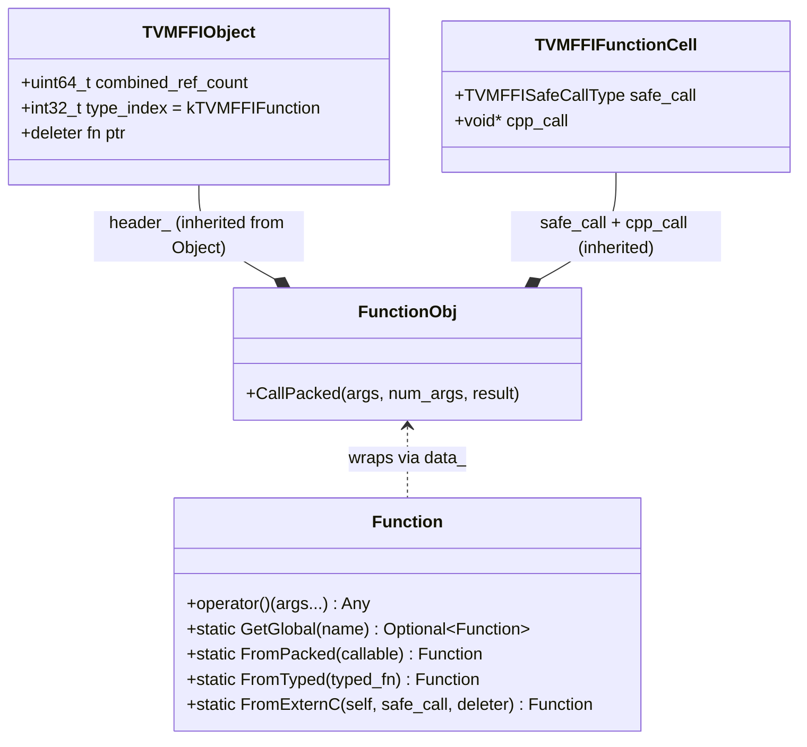
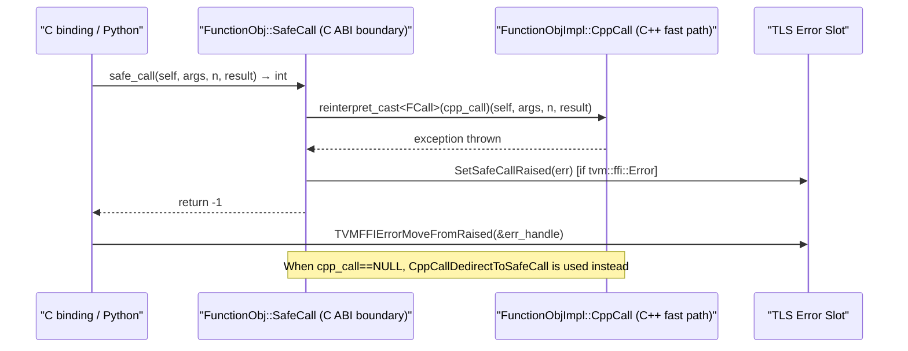

# Function System — Packed Calling Convention and Global Registry

**TL;DR**
- `Function` (an `ObjectRef` over `FunctionObj`) is the universal callable in TVM FFI. Its packed calling convention `(const AnyView* args, int32_t num_args, Any* rv)` enables cross-language invocation with zero virtual dispatch.
- Three factory paths: `FromPacked` (manual arg handling), `FromTyped` (typed lambda, auto-generates arity check + `TypeTraits`-based unpacking), and `TVMFFIFunctionCreate` (C ABI path for non-C++ bindings).
- A string-keyed global registry accessible via `Function::GetGlobal` / `TVMFFIFunctionSetGlobal` enables cross-language function discovery without linking. Registration is done via `reflection::GlobalDef().def(name, fn)` inside `TVM_FFI_STATIC_INIT_BLOCK` (the legacy `TVM_FFI_REGISTER_GLOBAL` macro was removed).

## Problem Statement

### Background
A compiler framework needs functions callable from C++, Python, and Rust. Mechanisms like `std::function` are not C-compatible; raw function pointers don't capture state; and exposing C++ vtables crosses DLL boundaries unsafely.

### Solution
`FunctionObj` inherits from `TVMFFIFunctionCell` which stores `safe_call` (C ABI boundary, catches exceptions) and `cpp_call` (C++ fast path, void* reinterpret-cast to `FCall`; NULL for non-C++ functions). The two-pointer layout means C bindings use `safe_call` while C++ code dispatches via `cpp_call` when non-NULL. `CallPacked` selects the call path branchlessly: `(cpp_call ? reinterpret_cast<FCall>(cpp_call) : CppCallDedirectToSafeCall)(this, args, n, rv)`. Typed lambdas are automatically wrapped via template expansion in `FromTyped`. (Prior to commit 4fe8b2b7, the C++-internal pointer was `FunctionObj::call: FCall` — a typed field outside the C ABI struct. The merge into `TVMFFIFunctionCell.cpp_call: void*` narrows the C++/C boundary.)

### Goals
- Single calling convention usable from C, C++, Python, Rust.
- Typed entry points via `FromTyped` without runtime overhead.
- Global registry accessible from any language with no link-time dependencies.
- Non-goal: async or coroutine-based invocation.

## Design

### Object Layout



### Key Classes, Fields and Interfaces

```python
TVMFFISafeCallType = Callable[
    [void* handle, const TVMFFIAny* args, int32_t num_args, TVMFFIAny* result], int32_t
]
# First parameter renamed from `self` to `handle` (commit 11a4a02d, cosmetic only — same ABI).
# Returns: 0=ok, -1=error in TLS, -2=frontend error already set

FCall = Callable[[FunctionObj*, AnyView*, int32_t, Any*], None]
# Typed C++ callable pointer stored as void* in TVMFFIFunctionCell.cpp_call

class FunctionObj(Object, TVMFFIFunctionCell):
    """Object container backing ffi::Function.
    Layout: TVMFFIObject (24B) | TVMFFIFunctionCell {safe_call, cpp_call} | callable storage
    OLD (pre-4fe8b2b7): TVMFFIFunctionCell had only safe_call; FunctionObj had a separate `call: FCall`.
    NEW (commit 4fe8b2b7): cpp_call lives in TVMFFIFunctionCell (C ABI struct); FunctionObj.call removed.
    """
    # Inherited from TVMFFIFunctionCell (C ABI struct):
    safe_call: TVMFFISafeCallType  # C ABI boundary — catches exceptions → returns -1/-2
    cpp_call:  void*               # C++ fast path — typed FCall; NULL for non-C++ functions

    def CallPacked(self, args: AnyView*, num_args: int32_t, result: Any*) -> None:
        # Branchless conditional dispatch (commit 4fe8b2b7):
        call_ptr: FCall = (reinterpret_cast[FCall](self.cpp_call)
                           if self.cpp_call else CppCallDedirectToSafeCall)
        call_ptr(self, args, num_args, result)
        # Interacts with: CppCallDedirectToSafeCall (fallback), FunctionObjImpl.CppCall (hot path)

    @staticmethod
    def CppCallDedirectToSafeCall(func: FunctionObj*, args: AnyView*, num_args: int32_t, rv: Any*) -> None:
        """Fallback when cpp_call is NULL: redirect through safe_call, then check error code."""
        TVM_FFI_CHECK_SAFE_CALL(func.safe_call(func, args, num_args, rv))
        # Interacts with: TVM_FFI_CHECK_SAFE_CALL macro, ErrorObj TLS slot

    _type_index: int32_t = kTVMFFIFunction
    _type_key: str = "ffi.Function"  # was "object.Function" (renamed in commit 0966c368)


class Function(ObjectRef):
    """User-facing RAII wrapper for FunctionObj."""

    def __init__(self, callable: TCallable) -> None:
        # enable_if: decay_t<TCallable> != Function  (prevents shadowing copy/move constructor)
        # CHANGED (commit 889bfb36): gains enable_if guard + std::forward to avoid copies
        # Interacts with: FromPacked(std::forward<TCallable>(...))

    @staticmethod
    def FromPacked(callable: TCallable) -> Function:
        """Wrap a raw packed callable. Caller handles arg/result manually.
        CHANGED (commit 889bfb36): parameter is now TCallable&& (was TCallable by value).
        Callable is forwarded via std::forward<TCallable>, enabling move-only callables.
        """
        impl = make_object[FunctionObjImpl[decay_t[TCallable]]](forward[TCallable](callable))
        return Function(impl)
        # Interacts with: FunctionObjImpl<TCallable> (stores callable, wires call ptr)
        # Invariant: captures callable by value in FunctionObjImpl — no dangling reference risk

    @staticmethod
    def FromPacked(callable: Callable[[PackedArgs, Any*], None]) -> Function:
        """Overload accepting PackedArgs view."""
        ...

    @staticmethod
    def FromTyped(typed_fn: TCallable) -> Function:
        """Auto-generate arity check + TypeTraits-based arg unpacking.
        For a typed_fn(a: A, b: B) -> R, generates:
            def packed(args: AnyView*, n: int, rv: Any*):
                assert n == 2
                a = args[0].cast[A]()
                b = args[1].cast[B]()
                *rv = typed_fn(a, b)
        CHANGED (commit 889bfb36): parameter is now TCallable&& (was TCallable by value).
        Uses FunctionInfo<decay_t<TCallable>> (not TCallable) for schema — preserves typed dispatch.
        Callable captured via std::forward into the generated packed wrapper.
        Comment: "always captured by value to avoid dangling reference".
        Renamed from FromUnpacked (commit 110b8f91).
        """
        # Interacts with: TypeTraits<A>, TypeTraits<B>, TypeTraits<R> (packing result)
        # Interacts with: FunctionInfo<decay_t<TCallable>> (schema generation)

    def __call__(self, *args) -> Any:
        # Pack args into AnyView array via PackedArgsSetter
        arg_buf: AnyView[N]  # stack-allocated
        PackedArgsSetter(arg_buf).Apply(*args)
        result: Any  # pre-initialized to kTVMFFINone
        func_obj = data_.get()
        func_obj.CallPacked(arg_buf, N, &result)
        return result
        # Interacts with: PackedArgs (arg buffer), AnyView TypeTraits (packing)
        # Invariant: result must be kTVMFFINone before call

    @staticmethod
    def GetGlobal(name: str) -> Optional[Function]:
        """Look up a globally registered function by name."""
        handle: TVMFFIObjectHandle = None
        TVMFFIFunctionGetGlobal(name_bytes, &handle)
        if handle is None: return None
        return Function(ObjectPtr.from_handle(handle))
        # Interacts with: TVMFFIFunctionGetGlobal (C ABI)

    @staticmethod
    def SetGlobal(name: str, func: Function, override: bool = False) -> None:
        TVMFFIFunctionSetGlobal(name_bytes, func.handle(), override)


class PackedArgs:
    """Read-only view over a contiguous AnyView array."""
    data_: AnyView*
    size_: int32_t

    def __getitem__(self, i: int) -> AnyView: return data_[i]
    def size(self) -> int: return size_
    def Slice(self, begin: int, end: int = -1) -> PackedArgs: ...

    @staticmethod
    def Fill(data: AnyView*, *args) -> None:
        """Pack C++ values into the AnyView array. Used by Function.__call__."""
        for i, arg in enumerate(args):
            data[i] = AnyView(arg)   # TypeTraits dispatch
    # Interacts with: Function.__call__ (provides arg buffer)


class TypedFunction(Generic[R, Args]):
    """Statically-typed thin wrapper over Function.
    Carries argument and return-type information at compile time.
    """
    packed_: Function

    def __call__(self, *args: Args) -> R:
        result: Any = packed_(*args)
        return result.cast[R]()
    # Interacts with: Function (underlying packed dispatch), TypeTraits<R> (result cast)
```

### Global Registration: GlobalDef (current) and removed TVM_FFI_REGISTER_GLOBAL

`TVM_FFI_REGISTER_GLOBAL` and `Function::Registry` were **removed** (commit 26b68b02). The canonical registration idiom is now `reflection::GlobalDef` inside `TVM_FFI_STATIC_INIT_BLOCK`.

**`TVM_FFI_STATIC_INIT_BLOCK` syntax** changed in commit 7b813f8bc6a5: the block body now follows the macro invocation like a function body (instead of being passed as a macro argument). On GCC/Clang the expansion uses `__attribute__((constructor))` for a real named function (debugger-visible); on MSVC it uses a lambda-in-static-initializer trick.

```python
# CURRENT canonical form (commit 7b813f8bc6a5):
# TVM_FFI_STATIC_INIT_BLOCK() { refl::GlobalDef().def("op.name", fn); }
#
# GCC/Clang expansion:
#   __attribute__((constructor)) static void __TVMFFIStaticInitFunc<N>() {
#       refl::GlobalDef().def("op.name", fn);
#   }
#
# MSVC expansion:
#   static void __TVMFFIStaticInitFunc<N>();
#   [[maybe_unused]] static inline int __TVMFFIStaticInitReg<N> = []() {
#       __TVMFFIStaticInitFunc<N>(); return 0;
#   }();
#   static void __TVMFFIStaticInitFunc<N>() {
#       refl::GlobalDef().def("op.name", fn);
#   }
#
# OLD style (removed): TVM_FFI_STATIC_INIT_BLOCK({ refl::GlobalDef().def(...); });
# Old expansion: static inline int __TVMFFIStaticInitReg_N = ([]() { ...; return 0; })();
#
# Invariant: The macro MUST be followed immediately by a { ... } block.
# Invariant: Each usage site gets a unique function name via __COUNTER__.
# Interacts with: GlobalDef (registers globals), ObjectDef (registers types),
#                 TypeAttrDef (registers per-type attributes)

TVM_FFI_STATIC_INIT_BLOCK() {
    namespace refl = tvm::ffi::reflection;
    refl::GlobalDef()
        .def("op.name", typed_fn)         # wraps via Function::FromTyped
        .def_packed("op.raw", packed_fn)  # wraps via Function::FromPacked
        .def_method("op.method", &Class::method);  # exposes class method
}
# Interacts with: GlobalDef::_register_func → TVMFFIFunctionSetGlobalFromMethodInfo (C ABI)
# Invariant: registrations happen at static init time (before main)

class GlobalDef(ReflectionDefBase):
    """Chained builder for global function registration (reflection/registry.h).
    Sibling to ObjectDef. Introduced in commit b333288; TVM_FFI_REGISTER_GLOBAL removed in 26b68b02.
    """
    def def_(self, name: str, func: Callable, *extra) -> GlobalDef:
        """Register a typed callable (auto-unpacked via Function::FromTyped)."""
        # Interacts with: TVMFFIFunctionSetGlobalFromMethodInfo (C ABI), GlobalFunctionTable

    def def_packed(self, name: str, func: Callable, *extra) -> GlobalDef:
        """Register a packed callable (manual AnyView* handling)."""
        # Interacts with: Function::FromPacked, GlobalFunctionTable

    def def_method(self, name: str, func: MethodPtr, *extra) -> GlobalDef:
        """Expose a class method pointer as a global function (self as first arg).
        ObjectRef subclass: receiver by value (Class). Object subclass: receiver as const pointer (const Class*).
        The generated schema includes the receiver type as argument[0] (commit 368af824 bugfix).
        """
        # Interacts with: ReflectionDefBase::GetMethod_ (ObjectRef vs Object dispatch)
        # Interacts with: FunctionInfo<R (Class::*)(Args...)> — schema includes receiver as first arg

# REMOVED (replaced by GlobalDef):
# TVM_FFI_REGISTER_GLOBAL("op.name").set_body_typed(fn)
# Function::Registry class, .set_body_typed, .set_body_packed, .set_body_method
```

### FunctionInfo Member-Pointer Specializations (SFINAE)

`FunctionInfo<R (Class::*)(Args...)>` drives schema generation and `FromTyped` argument unpacking for registered class methods. Since commit 7b57a46, there are four SFINAE branches depending on whether `Class` derives from `Object` or `ObjectRef`:

```python
# include/tvm/ffi/function_details.h

# Branch 1: Object-derived mutable — receiver as raw pointer
# FunctionInfo<R (Class::*)(Args...), enable_if_t<is_base_of_v<Object, Class>>>
#   : FuncFunctorImpl[R, Class*, Args...]

# Branch 2: Object-derived const — receiver as const raw pointer
# FunctionInfo<R (Class::*)(Args...) const, enable_if_t<is_base_of_v<Object, Class>>>
#   : FuncFunctorImpl[R, const Class*, Args...]

# Branch 3: ObjectRef-derived mutable — receiver by value
# FunctionInfo<R (Class::*)(Args...), enable_if_t<is_base_of_v<ObjectRef, Class>>>
#   : FuncFunctorImpl[R, Class, Args...]

# Branch 4: ObjectRef-derived const — receiver by value (const)
# FunctionInfo<R (Class::*)(Args...) const, enable_if_t<is_base_of_v<ObjectRef, Class>>>
#   : FuncFunctorImpl[R, const Class, Args...]

# Free function specializations (three forms):
# FunctionInfo<R(Args...), void>        → FuncFunctorImpl[R, Args...]   (plain function type)
# FunctionInfo<R(*)(Args...), void>     → FuncFunctorImpl[R, Args...]   (pointer to function)
# FunctionInfo<R(&)(Args...), void>     → FuncFunctorImpl[R, Args...]   (lvalue reference to function)
#   The R(&)(Args...) form was MISSING before commit a23c5a03; passing a named free function
#   as an lvalue reference to reflection or Function::FromTyped caused a compile error.
#   All three forms delegate identically to FuncFunctorImpl.
#
# Invariant: ObjectRef is NOT a subtype of Object; the two branches are mutually exclusive.
# Invariant: schema "args" list begins with the receiver type (receiver is arg[0]);
#            Python schema for ObjectRef::MemFn is Callable[[ObjectRef], R] — not Callable[[ObjectRef*], R].
# Before commit 368af824: schema omitted self entirely (bug).
# Before commit 7b57a46: single branch used Class* for all cases (wrong for ObjectRef).
```

### TVM_FFI_DLL_EXPORT_TYPED_FUNC — Exporting C++ Functions as C ABI Symbols

For exporting typed C++ functions as standalone loadable symbols (e.g., in a kernel library):

```python
# TVM_FFI_DLL_EXPORT_TYPED_FUNC(ExportName, Function)
# Wraps a typed callable into a C ABI safe_call symbol. Expands to (updated commit 40e8a51, args const in 4fe8b2b7):
# extern "C" {
#   TVM_FFI_DLL_EXPORT int __tvm_ffi_##ExportName(
#       void* handle, const TVMFFIAny* args, int32_t n, TVMFFIAny* result) {
#       // const added to args in commit 4fe8b2b7 to match TVMFFISafeCallType convention
#     TVM_FFI_SAFE_CALL_BEGIN();
#     tvm::ffi::details::unpack_call<RetType>(..., Function, args, n, result);
#     TVM_FFI_SAFE_CALL_END();
#   }
# }
# When TVM_FFI_DLL_EXPORT_INCLUDE_METADATA=1 (commit ac7bf680): ALSO exports:
#   TVM_FFI_DLL_EXPORT const char* __tvm_ffi__metadata_##ExportName(...) {
#     return "{\"type_schema\": \"<FuncInfo::TypeSchema() JSON>\"}";
#   }
# CHANGED in commit 40e8a51: symbol name was bare ExportName; now __tvm_ffi_##ExportName
# Interacts with: TVM_FFI_DLL_EXPORT (always-export variant of TVM_FFI_DLL, commit 192f196e),
#                 FunctionInfo<T>, unpack_call (TypeTraits dispatch),
#                 Library::GetSymbolWithSymbolPrefix (prepends __tvm_ffi_ at lookup time)
# Invariant: ExportName and Function must be different identifiers

# TVM_FFI_DLL_EXPORT_INCLUDE_METADATA (commit ac7bf680)
# Compile-time toggle (default: 0 = off).
# When set to 1, TVM_FFI_DLL_EXPORT_TYPED_FUNC additionally emits:
#   __tvm_ffi__metadata_<ExportName> → packed-call returning JSON String {"type_schema": "..."}
# Interacts with: FuncInfo::TypeSchema() (0019-type-schema), EscapeString
#
# METADATA STRING ALLOCATION INVARIANT (commit dcacb98d):
# Both __tvm_ffi__metadata_* and __tvm_ffi__doc_* getters use TVMFFIStringFromByteArray
# (a libtvm_ffi C ABI function) to construct the returned String, NOT the local tvm::ffi::String
# constructor. This guarantees the String object is owned by libtvm_ffi, not the loading .so.
# If the loading .so unloads while the String is still live, the String's deleter remains valid
# (it lives in the long-lived libtvm_ffi). Before this fix, the deleter pointed into the
# loading .so's memory — a use-after-free hazard.
#
# In other words: general data objects in a loaded module must still respect the module-lifetime
# invariant (Module must outlive all objects whose deleters reside in that .so); this fix
# specifically exempts metadata/docstring Strings from that constraint.

# TVM_FFI_DLL_EXPORT_TYPED_FUNC_DOC(ExportName, DocString) (commit ac7bf680)
# When TVM_FFI_DLL_EXPORT_INCLUDE_METADATA=1: exports __tvm_ffi__doc_<ExportName>
#   returning DocString as a packed-call String via TVMFFIStringFromByteArray.
# When TVM_FFI_DLL_EXPORT_INCLUDE_METADATA=0: expands to nothing (no-op).
# Invariant: MUST be paired with a corresponding TVM_FFI_DLL_EXPORT_TYPED_FUNC call for ExportName.
# Invariant: returned String allocated in libtvm_ffi (via TVMFFIStringFromByteArray) —
#            see metadata string allocation invariant above.
# Interacts with: tvm_ffi_doc_prefix ("__tvm_ffi__doc_") in extra/module.h,
#                 Module.get_function_doc() on the Python side.
# Extension: add documentation to any kernel library export without breaking the function ABI.
#
# Usage (commit ac7bf680 example):
#   #define TVM_FFI_DLL_EXPORT_INCLUDE_METADATA 1
#   #include <tvm/ffi/function.h>
#   int AddOne(int x) { return x + 1; }
#   TVM_FFI_DLL_EXPORT_TYPED_FUNC(add_one, AddOne);
#   TVM_FFI_DLL_EXPORT_TYPED_FUNC_DOC(add_one, "Add one to an integer.");
```

### FunctionObj Implementation Classes

```python
class FunctionObjImpl(Generic[TCallable], FunctionObj):
    """Most common case: wraps a C++ callable (lambda, functor). Most function creations use this.
    Invariant: TCallable must not be cv-qualified or a reference type.
    Enforced via: static_assert(TCallable == remove_cv_t<remove_reference_t<TCallable>>).
    (CHANGED commit 889bfb36: TStorage alias removed; constraint now via static_assert.)
    """
    callable_: TCallable   # stored by value; mutable to allow stateful lambdas

    def __init__(self, callable: TCallable) -> None:  # rvalue overload: takes TCallable&&
        ...
    def __init__(self, callable: const TCallable) -> None:  # lvalue overload: takes const TCallable&
        ...
    # CHANGED (commit 889bfb36): two overloads replace the single copy-by-value constructor.
    # Benefit: move-only callables (lambdas capturing unique_ptr) can now be wrapped without copying.

        self.safe_call = SafeCall
        self.cpp_call = reinterpret_cast[void*](CppCall)  # wired at construction (commit 4fe8b2b7)

    @staticmethod
    def CppCall(func: FunctionObj*, args: AnyView*, num_args: int32_t, result: Any*) -> None:
        # Was named Call() before commit 4fe8b2b7
        cast[FunctionObjImpl](func).callable_(args, num_args, result)

    @staticmethod
    def SafeCall(handle: void*, args: TVMFFIAny*, num_args: int32_t, result: TVMFFIAny*) -> int:
        # Calls CppCall via cpp_call cast (was: called self.call directly before commit 4fe8b2b7)
        TVM_FFI_SAFE_CALL_BEGIN()
        TVM_FFI_ICHECK_LT(result.type_index, kTVMFFIStaticObjectBegin)
        self = cast[FunctionObj*](handle)
        reinterpret_cast[FCall](self.cpp_call)(self, cast[AnyView*](args), num_args, cast[Any*](result))
        TVM_FFI_SAFE_CALL_END()


class ExternCFunctionObjImpl(FunctionObj):
    """Wraps a C-style callback (from TVMFFIFunctionCreate / FromExternC with non-null handle)."""
    self_: void*
    safe_call_: TVMFFISafeCallType
    deleter_: Callable[[void*], None]

    def __init__(self, self_: void*, safe_call: TVMFFISafeCallType, deleter: Callable):
        self.safe_call = SafeCall
        self.cpp_call = nullptr  # external C function — no C++ call path

    def __del__(self):
        if self.deleter_: self.deleter_(self.self_)  # null guard (commit 4fe8b2b7)

    @staticmethod
    def SafeCall(handle: void*, args: TVMFFIAny*, num_args: int32_t, rv: TVMFFIAny*) -> int:
        self = reinterpret_cast[ExternCFunctionObjImpl*](handle)
        return self.safe_call_(self.self_, args, num_args, rv)
    # Interacts with: TVMFFIFunctionCreate C ABI


class ExternCFunctionObjNullHandleImpl(FunctionObj):
    """NEW (commit 4fe8b2b7): Specialization for raw C function pointer with null handle + null deleter."""
    def __init__(self, safe_call: TVMFFISafeCallType):
        self.safe_call = safe_call
        self.cpp_call = nullptr
    # Interacts with: Function.FromExternC (dispatches here when self==nullptr, deleter==nullptr)

# REMOVED (commit 4fe8b2b7):
# class RedirectCallToSafeCall — CRTP helper base
# class ImportedFunctionObjImpl — wrapped cross-DLL FunctionObj via safe_call
# Function.ImportFromExternDLL — cross-DLL function import (replaced by direct cpp_call=NULL path)


class Function(ObjectRef):
    # ... (GetGlobal, SetGlobal, FromPacked, FromTyped unchanged) ...

    @staticmethod
    def FromExternC(self: void*, safe_call: TVMFFISafeCallType,
                    deleter: Callable[[void*], None]) -> Function:
        """Factory for C-ABI callbacks.
        NEW (commit 4fe8b2b7): if self==nullptr and deleter==nullptr → ExternCFunctionObjNullHandleImpl
                               otherwise → ExternCFunctionObjImpl (unchanged)
        """
        # Interacts with: ExternCFunctionObjNullHandleImpl, ExternCFunctionObjImpl

    @staticmethod
    def InvokeExternC(handle: void*, safe_call: TVMFFISafeCallType, *args) -> Any:
        """Invoke a SafeCall-convention symbol directly without constructing a Function object.
        Zero-allocation path: packs args into stack-allocated AnyView[] via PackedArgs::Fill,
        calls safe_call directly, returns result as Any.
        # Invariant: safe_call must conform to TVMFFISafeCallType; handle is nullptr for __tvm_ffi_ symbols
        # Invariant: error propagated via TVM_FFI_CHECK_SAFE_CALL (maps -1 to C++ exception)
        # Use when: one-shot call, no need to store/pass the callable as a value
        # Prefer FromExternC when: the symbol must be stored, passed around, or called repeatedly
        # Interacts with: PackedArgs::Fill (arg packing), TVM_FFI_CHECK_SAFE_CALL, AnyView/Any
        """


# ─── Python-side Function factory methods (function.pxi) ──────────────────────

class Function(Object):  # Python Cython class
    @staticmethod
    def __from_extern_c__(
        c_symbol: int,
        *,  # keyword-only (commit f6303b23)
        keep_alive_object: Any | None = None
    ) -> Function:
        """Construct a Python Function from a raw C safe_call pointer.

        c_symbol : int
            Integer representation of a TVMFFISafeCallType function pointer.
            ABI: (void* handle, const TVMFFIAny* args, int32_t num_args, TVMFFIAny* result) -> int32_t
            The handle (first arg) is ignored by the callee.
        keep_alive_object : object
            Optional Python closure kept alive for the Function's lifetime.
            Py_INCREF'd on successful creation; released via TVMFFIPyObjectDeleter on GC.

        # Interacts with: TVMFFIFunctionCreate (C ABI factory)
        # Interacts with: TVMFFIPyObjectDeleter (cleanup for keep_alive_object on Function destroy)
        # Invariant: cpp_call == NULL for all extern-C functions (no C++ fast path)
        # Invariant: if TVMFFIFunctionCreate fails and keep_alive_object is not None, Py_DECREF is called
        # Extension: pass any Python object as keep_alive_object — engine, module, ctypes CDLL, etc.
        """

    @staticmethod
    def __from_mlir_packed_safe_call__(
        mlir_packed_symbol: int,
        *,
        keep_alive_object: Any | None = None
    ) -> Function:
        """Construct a Function from an MLIR execution-engine packed safe-call symbol.

        MLIR packed calling convention: void(*)(void**)
        Packed args layout: [&handle, &args_ptr, &num_args, &rv_ptr, &ret_code]

        # Interacts with: TVMFFIPyMLIRPackedSafeCallCreate (C++ helper in tvm_ffi_python_helpers.h)
        # Interacts with: TVMFFIFunctionCreate (wraps the adapter as a standard Function)
        # Invariant: mlir_packed_symbol must match void(void**) signature
        # Extension: intended as Python-layer helper; may be superseded if MLIR adds extern C support
        """


# ─── TVMFFIPyMLIRPackedSafeCall adapter (tvm_ffi_python_helpers.h) ─────────────

class TVMFFIPyMLIRPackedSafeCall:
    """Bridges MLIR packed safe call convention (void(void**)) to TVMFFISafeCallType."""
    mlir_packed_safe_call_: Callable[[void**], None]  # void(*)(void**)
    keep_alive_object_: PyObject*
    # Invariant: keep_alive_object_ refcount incremented on construction, decremented in destructor

    @staticmethod
    def Invoke(func: void*, args: const TVMFFIAny*, num_args: int32_t, rv: TVMFFIAny*) -> int:
        # MLIR packed args layout: packed[0]=&handle, [1]=&args, [2]=&num_args, [3]=&rv, [4]=&ret_code
        # Interacts with: TVMFFIFunctionCell (stored as safe_call slot)

    @staticmethod
    def Deleter(self: void*) -> None: ...

# C ABI shims exposed to Cython:
def TVMFFIPyMLIRPackedSafeCallCreate(mlir_packed_safe_call: void*, keep_alive: PyObject*) -> void*: ...
def TVMFFIPyMLIRPackedSafeCallInvoke(self: void*, args: const TVMFFIAny*, num_args: int32_t, rv: TVMFFIAny*) -> int: ...
def TVMFFIPyMLIRPackedSafeCallDeleter(self: void*) -> None: ...


```

### Safe Call Boundary Protocol



## Contracts, Assumptions and Invariants

- The `result` `Any*` passed into a packed call **must** have `type_index == kTVMFFINone` on entry. The callee writes into it; if it already held an object, the previous DecRef is skipped → leak.
- `GlobalDef().def(name, fn)` registrations are global singletons initialized before `main` via `TVM_FFI_STATIC_INIT_BLOCK`. Calling `TVMFFIFunctionSetGlobal` with `override=0` on an already-registered name raises `ValueError`.
- `safe_call` and `call` pointers MUST be wired consistently by `FunctionObjImpl`: `safe_call` catches exceptions and stores them in TLS; `call` propagates via C++ throw.
- `TypedFunction<R(Args...)>::operator()` adds a `cast<R>()` which throws `TypeError` if the packed function returns a wrong type — this is the primary runtime type-safety check for typed wrappers.
- `ArgTypeSupported<T>` constraint (commit 583e4b7): C++ exported function argument types are restricted to: value `T`, const-value `const T`, const-lvalue-ref `const T&`, and rvalue-ref `T&&`. Non-const lvalue ref `T&` and `const T&&` are explicitly rejected (compile-time error). `ArgValueWithContext` is now a class template `ArgValueWithContext<Type>` with a non-template conversion operator, fixing compilation with `std::optional<T>` and similar template-constructor types.

### Extension Points
- Use `GlobalDef().def(name, fn)`, `.def_packed(name, fn)`, or `.def_method(name, &Class::method)` to register different flavors of global function.
- Add new calling conventions (e.g., async) by subclassing `FunctionObjImpl` and wiring a different `call` pointer.
- `TVMFFIEnvRegisterCAPI` allows the Python runtime to register `PyErr_CheckSignals` so long-running C++ functions can check for Ctrl-C.
- `TVM_FFI_DLL_EXPORT_TYPED_FUNC(ExportName, Func)` exports a typed function as a C-linkage `safe_call` symbol for standalone loadable kernel libraries.
- JIT execution engines: use `Function.__from_extern_c__(sym, keep_alive_object=engine)` to wrap a raw function pointer; use `Function.__from_mlir_packed_safe_call__(sym, keep_alive_object=engine)` for MLIR packed-call convention.
- One-shot extern C calls: use `Function::InvokeExternC(handle, safe_call, args...)` for zero-allocation single invocations where no `Function` object is needed.

### Usage Examples

#### Register and call a global function (C++ → any language)
**Context**: a C++ op implementation exposed to Python via the global registry.

```cpp
// In C++ (registration at static init time — current canonical form, commit 7b813f8bc6a5):
TVM_FFI_STATIC_INIT_BLOCK() {
  namespace refl = tvm::ffi::reflection;
  refl::GlobalDef()
      .def("my.add", [](int a, int b) -> int { return a + b; });
}
// Old style (removed): TVM_FFI_STATIC_INIT_BLOCK({ ... });

// In C++ (calling it):
Function f = Function::GetGlobal("my.add").value();
Any result = f(3, 4);      // PackedArgsSetter packs ints, result.cast<int>() == 7

// In Python (same global registry):
// add = tvm_ffi.get_global_func("my.add")
// result = add(3, 4)  # → 7
```

#### Creating a function from a C callback (non-C++ binding)
**Context**: Rust or ctypes binding registering a function into TVM FFI.

```c
int my_safe_call(void* self, const TVMFFIAny* args, int32_t n, TVMFFIAny* result) {
    result->type_index = kTVMFFIInt;
    result->v_int64 = args[0].v_int64 + args[1].v_int64;
    return 0;
}
void my_deleter(void* self) {}   // nothing to free

TVMFFIObjectHandle func_handle;
TVMFFIFunctionCreate(NULL, my_safe_call, my_deleter, &func_handle);

TVMFFIByteArray name = {"my.add_c", 8};
TVMFFIFunctionSetGlobal(&name, func_handle, /*override=*/0);
TVMFFIObjectFree(func_handle);
```

#### Wrapping a JIT function pointer from Python (extern C path)
**Context**: LLVM JIT engine returns a raw function pointer as integer.

```python
import sys, tvm_ffi

# 1. Get the symbol address (as int) from a JIT engine or testing.cc
add_one_sym = tvm_ffi.get_global_func("testing.get_add_one_c_symbol")()

# 2. Wrap without keep_alive
fadd_one = tvm_ffi.Function.__from_extern_c__(add_one_sym)
assert fadd_one(1) == 2

# 3. Wrap with keep_alive (prevents engine GC while function lives)
engine = [1, 2, 3]  # stand-in for llvmlite.ExecutionEngine
base_rc = sys.getrefcount(engine)
fadd_one = tvm_ffi.Function.__from_extern_c__(add_one_sym, keep_alive_object=engine)
assert sys.getrefcount(engine) == base_rc + 1  # engine ref held
fadd_one = None
assert sys.getrefcount(engine) == base_rc       # released on GC
```

#### Wrapping an MLIR execution engine symbol
**Context**: MLIR execution engine exposes `void(*)(void**)` packed-call symbols.

```python
import tvm_ffi

mlir_sym_addr = engine.lookup_packed("my_kernel")  # returns int (pointer as integer)
f = tvm_ffi.Function.__from_mlir_packed_safe_call__(
    mlir_sym_addr,
    keep_alive_object=engine,  # prevents engine GC while f is alive
)
result = f(arg0, arg1)  # calls via TVMFFIPyMLIRPackedSafeCall::Invoke
```

#### Zero-allocation one-shot extern C call (C++ only)
**Context**: Kernel code that calls an extern C symbol once without needing a Function object.

```cpp
extern "C" int __tvm_ffi_testing_add1(
    void* handle, const TVMFFIAny* args, int32_t num_args, TVMFFIAny* result);

// No FunctionObj allocation — stack only:
int result = tvm::ffi::Function::InvokeExternC(nullptr, __tvm_ffi_testing_add1, 1).cast<int>();
// vs. FromExternC (allocates FunctionObj, use when storing):
Function f = Function::FromExternC(nullptr, __tvm_ffi_testing_add1, nullptr);
```

## Implementation Notes
- `PackedArgsSetter` iterates over variadic template args, calling `TypeTraits<T>::CopyToAnyView` for each into a stack-allocated `AnyView[]`. For small argument counts (≤6), this is entirely stack-allocated.
- The `TVM_FFI_CHECK_SAFE_CALL(func)` macro wraps safe-call returns: -2 re-throws `EnvErrorAlreadySet`, -1 moves from TLS error slot and rethrows as `tvm::ffi::Error`.
- `GlobalFunctionTable` stores `Entry` objects (Object subclass carrying `TVMFFIMethodInfo`) rather than plain `Function*`, enabling name lookup + type schema queries from the Python stub generator.
- `TypedFunction<R(Args...)>` is the statically-typed wrapper; it calls `cast<R>()` on the result which is the primary runtime type-safety check for typed wrappers.

## Alternatives & Trade-offs

### Alternative A: `std::function<Any(AnyView*, int)>`
- Pros: Standard, type-safe.
- Cons: Not C-compatible; unstable ABI across DLLs; no `safe_call` separation.

### Alternative B: vtable-based dispatch (virtual call)
- Pros: Familiar OOP pattern.
- Cons: Requires C++ ABI; can't be called from pure C; two indirections (vtable lookup + call).

## Related Design Docs & ADRs
- `.knowledge/design-records/0001-c-abi.md` — `TVMFFISafeCallType`, return code convention
- `.knowledge/design-records/0003-any-anyview.md` — `AnyView*` argument arrays, `Any` result
- `.knowledge/design-records/0005-error-system.md` — TLS error slot, `TVM_FFI_SAFE_CALL_BEGIN/END`
- `.knowledge/design-records/0008-type-traits.md` — `TypeTraits` used in `FromTyped` arg unpacking
- `.knowledge/design-records/0019-type-schema.md` — `TypeSchema<T>` trait, `FuncFunctorImpl::TypeSchema()`

## Evidence Matrix

| Commit | Contribution |
|--------|-------------|
| 4fe8b2b7 | Introduces cpp_call in TVMFFIFunctionCell; ExternCFunctionObjNullHandleImpl; FromExternC two-branch dispatch |
| 26b68b02 | Removes TVM_FFI_REGISTER_GLOBAL; GlobalDef becomes canonical |
| 7b813f8bc | TVM_FFI_STATIC_INIT_BLOCK block-body syntax; GNU/MSVC dual expansion |
| a15364746 | Python Function.__from_extern_c__ factory; TVMFFIPyObjectDeleter pattern; deleter ABI fix |
| f6303b23 | Python Function.__from_mlir_packed_safe_call__; TVMFFIPyMLIRPackedSafeCall adapter; keep_alive_object keyword-only |
| 9186b44d | Function::InvokeExternC zero-allocation static method |
| 368af824 | Fixes FunctionInfo member-pointer schema to include self as first arg |
| 7b57a46 | SFINAE split in FunctionInfo for ObjectRef vs Object receiver type |
| 583e4b7 | ArgTypeSupported<T> constraint; ArgValueWithContext becomes class template; supported qualifiers: T, const T, const T&, T&& |
| dcacb98d | Fixes metadata/docstring getters in TVM_FFI_DLL_EXPORT_TYPED_FUNC/_DOC: route String construction through TVMFFIStringFromByteArray so returned String is owned by libtvm_ffi, not the loading .so |
| plus 2 supporting commits | 11a4a02d (TVMFFISafeCallType handle param rename), b333288 (GlobalDef introduction) |
