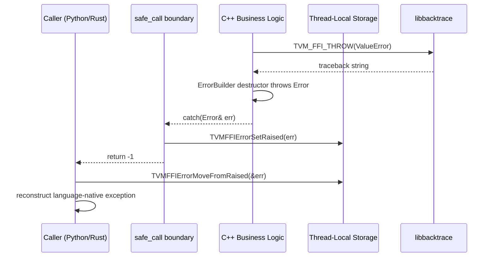

# FFI Error Handling Protocol

**TL;DR**.
- Errors are object-based: `ErrorObj` is a heap object with `kind`, `message`, `backtrace`, optional `cause_chain`, and optional `extra_context` fields. `Error` is the ObjectRef that also inherits `std::exception` for C++ interop.
- Error propagation across the C ABI uses thread-local storage (TLS): C++ exceptions are caught at the `safe_call` boundary, stored via `TVMFFIErrorSetRaised`, and retrieved by the caller via `TVMFFIErrorMoveFromRaised`. All errors now use return code `-1`; the legacy `-2` code for `EnvErrorAlreadySet` has been removed from C++ (Python retains backward compat temporarily).
- `TVM_FFI_THROW(ErrorKind) << "message"` is the primary error-raising macro. `Expected<T>` provides an exception-free alternative: `Function::CallExpected<T>()` returns either a value or an `Error` without throwing.
- Backtraces are stored in **most-recent-call-first** order for O(1) append during error propagation. `Error::TracebackMostRecentCallLast()` reverses for Python-style display.

## Problem Statement
### Background
- C++ exceptions cannot cross the C ABI boundary (undefined behavior). The FFI needs a mechanism to propagate structured errors (with kind, message, and traceback) across language boundaries while maintaining exception semantics within C++.
- Frontend languages (Python) may have their own pending errors (e.g., `KeyboardInterrupt`). The FFI must signal this without conflating it with C++ errors.

### Solution
- `TVM_FFI_SAFE_CALL_BEGIN/END` macros wrap every ABI-crossing function with a try/catch that converts exceptions to TLS-stored error objects with return code -1.
- `EnvErrorAlreadySet()` is now an inline factory function returning `Error("EnvErrorAlreadySet", "", "")`, unified into the object-based error system (b1611e0). Previously it was a separate `std::exception` subclass with return code -2.
- `TVM_FFI_THROW` uses the `ErrorBuilder` pattern: a temporary object whose destructor throws, allowing `<<` streaming for message construction.
- `Expected<T>` provides exception-free error handling: holds either a success `T` or an `Error`, analogous to Rust `Result<T, E>` / C++23 `std::expected` (0a9d4b6).

### Goals
- Structured errors with kind (e.g., "ValueError", "TypeError"), message, and traceback.
- Lossless propagation across C++/Python/Rust boundaries.
- Support for frontend signal checking (`TVMFFIEnvCheckSignals`).
- Non-goal: error recovery (errors are always fatal at the call boundary; retry is up to the caller).

## Design



### Key Classes, Fields and Interfaces

```python
class ErrorObj(Object, TVMFFIErrorCell):
    """Heap object holding structured error information."""
    kind: TVMFFIByteArray      # e.g., "ValueError", "TypeError", "InternalError"
    message: TVMFFIByteArray   # human-readable error message
    backtrace: TVMFFIByteArray # stack trace (most-recent-call-first order)
    update_backtrace: Callable[[ObjectHandle, ByteArray, int32], None]  # mutable backtrace update
    cause_chain: TVMFFIObjectHandle      # Optional: chained cause error (4c712ca)
    extra_context: TVMFFIObjectHandle    # Optional: opaque context object (4c712ca)
    # Invariant: ByteArrays point to data owned by the concrete subclass (ErrorObjFromStd)
    # Invariant: backtrace stored in most-recent-call-first order for O(1) append
    # Invariant: cause_chain and extra_context are nullptr when not attached
    # Invariant: backward compatible -- cause_chain/extra_context appended after existing fields
    # Interacts with: TVMFFIErrorCell (C ABI layout), Error (ref wrapper)

    _type_index = kTVMFFIError  # static type index 67
    _type_key = "object.Error"

class ErrorObjFromStd(ErrorObj):
    """Concrete error implementation owning string data."""
    kind_data_: str       # owns the kind string
    message_data_: str    # owns the message string
    backtrace_data_: str  # owns the backtrace string (mutable via UpdateBacktrace)
    # Interacts with: Error constructor, TVMFFIErrorCreate C API
    # The ByteArray pointers in ErrorObj point into these std::string buffers

class Error(ObjectRef, std.exception):
    """Managed reference to ErrorObj. Throwable as C++ exception."""
    # Interacts with: ErrorObj, TVM_FFI_THROW macro, TVM_FFI_SAFE_CALL_END

    def __init__(self, kind: str, message: str, backtrace: str,
                 cause_chain: Optional[Error] = None,
                 extra_context: Optional[ObjectRef] = None):
        """Construct error with optional cause chain and extra context (4c712ca)."""
        self.data_ = make_object[ErrorObjFromStd](kind, message, backtrace)
        # Ownership of cause_chain and extra_context transferred to ErrorObj
        # Interacts with: ErrorObjFromStd, ObjectUnsafe::MoveObjectRefToTVMFFIObjectPtr

    def kind(self) -> str: ...
    def message(self) -> str: ...
    def backtrace(self) -> str: ...
        # Returns backtrace in most-recent-call-first order (storage order)

    def cause_chain(self) -> Optional[Error]:
        """Get the cause chain of the error object (4c712ca)."""
        # Returns std::nullopt if no cause is attached
        # Interacts with: ErrorObj.cause_chain, ObjectUnsafe::ObjectRefFromObjectPtr

    def extra_context(self) -> Optional[ObjectRef]:
        """Get the extra context of the error object (4c712ca)."""
        # Returns std::nullopt if no context is attached
        # Interacts with: ErrorObj.extra_context, ObjectUnsafe::ObjectRefFromObjectPtr

    def TracebackMostRecentCallLast(self) -> str:
        """Reverse backtrace to most-recent-call-last for Python-style display."""
        # Interacts with: Error.what() (uses this for display)

    def FullMessage(self) -> str:
        """Get full formatted error: traceback + kind + message."""
        return f"Traceback (most recent call last):\n{self.TracebackMostRecentCallLast()}{self.kind()}: {self.message()}\n"
        # Returns: "Traceback (most recent call last):\n{traceback}{kind}: {message}\n"
        # Invariant: always allocates a new std::string (no TLS dependency)
        # Interacts with: TracebackMostRecentCallLast(), ErrorObj.kind, ErrorObj.message

    def what(self) -> str:  # const char*, noexcept
        """std::exception interface. Returns message only (no traceback, no kind)."""
        return self.data_.message.data
        # Invariant: returned pointer is valid for lifetime of the Error object
        # Invariant: never throws (true noexcept)
        # Interacts with: ErrorObj.message (ByteArray pointing into ErrorObjFromStd.message_data_)

    def UpdateBacktrace(self, backtrace: ByteArray, update_mode: int) -> None:
        """Update backtrace with replace or append semantics."""
        # update_mode: kTVMFFIBacktraceUpdateModeReplace or kTVMFFIBacktraceUpdateModeAppend
        # Interacts with: TVMFFIBacktraceUpdateMode enum, ErrorObjFromStd.UpdateBacktrace

def EnvErrorAlreadySet() -> Error:
    """Factory: create an Error with kind 'EnvErrorAlreadySet' (b1611e0).
    Replaced the former struct EnvErrorAlreadySet : std::exception.
    Call syntax unchanged: `throw EnvErrorAlreadySet()` still works because
    the factory returns an Error, which is throwable."""
    return Error("EnvErrorAlreadySet", "", "")
    # Interacts with: Error constructor, TVMFFIEnvCheckSignals callers
    # Invariant: returned Error propagated via TLS (return -1), NOT return -2
    # Invariant: callers that caught EnvErrorAlreadySet& must now catch Error&
    #   and inspect error.kind() == "EnvErrorAlreadySet"
    # Extension: Python binding checks error.kind for "EnvErrorAlreadySet" on -1 path

# --- Error Construction ---

class ErrorBuilder:
    """Stream-based error construction. Throws in destructor."""
    kind_: str
    backtrace_: str
    stream_: ostringstream
    log_before_throw_: bool

    def __init__(self, kind: str, backtrace: ByteArray, log_before_throw: bool): ...

    def __del__(self):  # [[noreturn]]
        error = Error(self.kind_, self.stream_.str(), self.traceback_)
        if self.log_before_throw_:
            stderr.write(error.FullMessage())
        raise error
        # Invariant: destructor always throws (never returns normally)

    def stream(self) -> ostringstream: return self.stream_

# Macro: TVM_FFI_THROW(ErrorKind)
# Expands to:
#   ErrorBuilder("ErrorKind", TVMFFIBacktrace(__FILE__, __LINE__, __func__), false).stream()
# Usage: TVM_FFI_THROW(ValueError) << "expected " << x << " got " << y;
# The ErrorBuilder is a temporary. The << operators write to its stream.
# When the statement ends, the temporary is destroyed, which throws the Error.

# Macro: TVM_FFI_LOG_AND_THROW(ErrorKind)
# Same but with log_before_throw=true (for startup errors that won't be caught)

# Macro: TVM_FFI_CHECK(cond, ErrorKind)
# Expands to:
#   if (!(cond)) TVM_FFI_THROW(ErrorKind) << "Check failed: (" #cond << ") is false: "
# Usage: TVM_FFI_CHECK(value >= 0, ValueError) << "must be non-negative, got " << value;
# Interacts with: TVM_FFI_THROW, ErrorBuilder
# Invariant: condition is evaluated first; ErrorKind is a bare identifier (not a string)
# Contrast: TVM_FFI_ICHECK(x) always throws InternalError; TVM_FFI_CHECK lets caller pick the kind

# --- Exception Boundary Macros ---

# TVM_FFI_SAFE_CALL_BEGIN():
#   try {

# TVM_FFI_SAFE_CALL_END() (updated b1611e0):
#   return 0;
#   } catch (Error& err) { SetSafeCallRaised(err); return -1; }
#     catch (std::exception& ex) { SetSafeCallRaised(Error("InternalError", ex.what())); return -1; }
#   Note: EnvErrorAlreadySet() now returns Error, caught by the Error& clause.
#   The -2 return code is no longer produced by C++.

# TVM_FFI_CHECK_SAFE_CALL(func) (updated b1611e0):
#   int ret = func;
#   if (ret != 0) throw MoveFromSafeCallRaised();
#   Note: the moved error may have kind "EnvErrorAlreadySet"; callers inspect kind.

# --- Part-based error construction (550e92fc) ---

def TVMFFIErrorSetRaisedFromCStrParts(
    kind: str, message_parts: list[str], num_parts: int32
) -> None:
    """Set a raised error in TLS from concatenated string parts.
    NULL parts are silently skipped. Two-pass: first computes total_len,
    then pre-reserves and appends. Motivated by DSL compilers reusing
    common error message fragments to reduce binary size."""
    # Interacts with: SafeCallContext TLS (same slot as TVMFFIErrorSetRaised)
    # Interacts with: TVMFFIBacktrace (captures backtrace at call site)
    # Invariant: NULL entries in message_parts are silently skipped
    # Invariant: message is pre-reserved to total_len for single allocation

# --- C API: Error with cause chain (4c712ca) ---

def TVMFFIErrorCreateWithCauseAndExtraContext(
    kind: TVMFFIByteArray, message: TVMFFIByteArray, backtrace: TVMFFIByteArray,
    cause_chain: TVMFFIObjectHandle,       # nullable
    extra_context: TVMFFIObjectHandle,     # nullable
    out: Ptr[TVMFFIObjectHandle],
) -> int: ...
    # Returns 0 on success, -1 on std::bad_alloc
    # Interacts with: ErrorObjFromStd, ObjectUnsafe::ObjectPtrFromUnowned
    # Invariant: cause_chain and extra_context handles are borrowed (not consumed)
    # Extension: language bindings use this to construct errors with chained causes

# --- Exception-free error handling (0a9d4b6) ---

class Unexpected(Generic[E]):
    """Wrapper to explicitly construct an Expected in the error state."""
    error_: E
    # Invariant: E must derive from Error (static_assert enforced)
    def __init__(self, error: E): ...
    def error(self) -> E: ...
    # Interacts with: Expected<T> (implicit conversion from Unexpected<E>)

class Expected(Generic[T]):
    """Exception-free error handling container: holds either T or Error.
    Analogous to Rust Result<T, Error> / C++23 std::expected."""
    data_: Any  # holds either T or Error internally
    # Invariant: T cannot be Error (static_assert: "Expected<Error> is not allowed")

    def __init__(self, value: T): ...       # implicit, success path
    def __init__(self, error: Error): ...   # implicit, error path
    def __init__(self, unexpected: Unexpected[E]): ...  # from Unexpected wrapper

    def is_ok(self) -> bool: ...
        # Interacts with: Any.as<Error>() -- checks error first to handle T being a base of Error
        # Invariant: checks for Error before T to correctly classify Expected<ObjectRef>
    def is_err(self) -> bool: ...
    def has_value(self) -> bool: ...  # alias for is_ok()

    def value(self) -> T: ...
        # Invariant: throws the contained Error if is_err()
        # Interacts with: Any.cast<T>(), Any.cast<Error>()
    def error(self) -> Error: ...
        # Invariant: throws RuntimeError("Bad expected access") if is_ok()
    def value_or(self, default_value: T) -> T: ...

    # TypeTraits<Expected<T>> specialization:
    # - CopyToAnyView/MoveToAny: unwraps to inner T or Error (transparent to ABI)
    # - CheckAnyStrict: true if inner is T or Error
    # - TryCastFromAnyView: reconstructs Expected from Any holding T or Error
    # - TypeStr: "Expected<{T}>"
    # - TypeSchema: {"type":"Expected","args":[{T_schema},{"type":"ffi.Error"}]}
    # Interacts with: TypeTraits<T>, TypeTraits<Error>
    # Extension: no new type index needed -- Expected unwraps transparently
```

### Contracts, Assumptions and Invariants
- **TLS single-slot**: Only one error can be pending per thread. `TVMFFIErrorMoveFromRaised` clears the slot (move semantics). Nested calls must check errors before re-entering.
- **Return code semantics**: `0` = success, `-1` = Error in TLS. The legacy `-2` code (frontend error) is no longer produced by C++ (b1611e0); `EnvErrorAlreadySet` now flows through `-1` as an Error with `kind == "EnvErrorAlreadySet"`. Python retains backward compat for legacy `-2` temporarily.
- **Error cause chaining**: `Error` objects can carry an optional `cause_chain` (another Error) and `extra_context` (any ObjectRef) for structured error provenance (4c712ca). Both fields are appended after existing `TVMFFIErrorCell` fields for backward compatibility.
- **Backtrace storage order**: Backtraces are stored in most-recent-call-first order. This makes appending frames during error propagation O(1) string append. `Error::TracebackMostRecentCallLast()` reverses for Python-style display.
- **Backtrace mutability**: `update_backtrace` with `TVMFFIBacktraceUpdateMode` allows replace or append semantics when language bindings add frames.
- **TVMFFIErrorCreate safety**: Returns `int` (0=success) instead of `TVMFFIObjectHandle`. Catches `std::bad_alloc` to avoid recursive error creation during OOM.
- **ErrorBuilder throw-in-destructor**: The `ErrorBuilder` destructor is `[[noreturn]]` and `noexcept(false)`. This is intentional and correct as the destructor is called during expression statement cleanup, not during stack unwinding from another exception.

### Extension Points
- **Custom error kinds**: Any string can be an error kind (e.g., "ValueError", "ShapeError", "AttributeError"). No enum restriction. Language bindings map these to native exception types.
- **Frontend signal checking**: `TVMFFIEnvCheckSignals()` returns non-zero if a signal (e.g., Ctrl-C) is pending. Long-running C++ code should periodically check this and throw `EnvErrorAlreadySet()` (which now returns an Error, not a separate exception type).
- **Check macros**: Three tiers of conditional assertion macros (35cbc32):
  - `TVM_FFI_CHECK_*(x, y, ErrorKind)`: Generic parameterized checks. `TVM_FFI_CHECK_LT`, `_GT`, `_LE`, `_GE`, `_EQ`, `_NE`, `_NOTNULL` accept an explicit `ErrorKind`. `TVM_FFI_CHECK(cond, ErrorKind)` for single-condition checks.
  - `TVM_FFI_ICHECK_*(x, y)`: `InternalError`-hardcoded aliases. `TVM_FFI_ICHECK(x)`, `TVM_FFI_ICHECK_EQ(x, y)`, etc. are thin wrappers around `TVM_FFI_CHECK_*(x, y, InternalError)`.
  - `TVM_FFI_DCHECK_*(x, y)`: Debug-only variants stripped when `NDEBUG` is defined. Forward to `TVM_FFI_ICHECK_*` in debug builds. `TVM_FFI_DCHECK_NOTNULL(x)` evaluates `x` even in release (returns value), all other DCHECK variants are pure no-ops in release.
  - Note: `TVM_FFI_ICHECK_BINARY_OP` was removed and replaced by `TVM_FFI_CHECK_BINARY_OP(name, op, x, y, ErrorKind)` (internal implementation macro).
- **Exception-free calling**: `Function::CallExpected<T>()` returns `Expected<T>` instead of throwing. Use this when the caller wants error-as-value semantics (e.g., in Rust interop or hot loops where exception overhead matters). Functions can also return `Expected<T>` directly from their typed signature.

### Usage Examples

#### Throwing and Catching Errors Across the ABI
**Context**: C++ code throws an error that Python catches.
```cpp
// C++ side: throw a structured error with traceback
void ValidateInput(int x) {
  if (x < 0) {
    TVM_FFI_THROW(ValueError) << "expected positive, got " << x;
    // Captures stack trace via libbacktrace
    // Constructs Error("ValueError", "expected positive, got -1", "<traceback>")
    // Throws the Error object
  }
}

// At the safe_call boundary (automatic via TVM_FFI_SAFE_CALL_BEGIN/END):
// catch (Error& err) -> TVMFFIErrorSetRaised(err), return -1
// Python binding: ret = TVMFFIFunctionCall(...); if ret == -1: fetch error, raise

// C++ side: check macros for internal assertions
TVM_FFI_ICHECK_GE(num_args, 2) << "expected at least 2 arguments";
// If check fails: throws InternalError with formatted message
```

#### Parameterized CHECK Macros and DCHECK Suite (35cbc32)
**Context**: Using error-kind-specific checks and debug-only assertions.
```cpp
// Generic parameterized check: any error kind
TVM_FFI_CHECK_EQ(x, expected, ValueError) << "bad input value";
TVM_FFI_CHECK_GE(size, 0, ValueError) << "size must be non-negative";
TVM_FFI_CHECK_NOTNULL(ptr, TypeError) << "pointer must not be null";

// InternalError aliases (unchanged behavior, thin wrappers):
TVM_FFI_ICHECK_EQ(x, y) << "internal mismatch";

// Debug-only checks (stripped in release builds):
TVM_FFI_DCHECK_GE(index, 0) << "negative index";
TVM_FFI_DCHECK_NOTNULL(ptr);  // no-op in NDEBUG, but evaluates ptr in both modes
```

#### Error Cause Chaining (4c712ca)
**Context**: Attach a root cause error to a new error for structured provenance.
```cpp
Error original_error("TypeError", "bad input type", "test0");
Error chained("ValueError", "validation failed", "test1",
              /*cause_chain=*/original_error, /*extra_context=*/std::nullopt);

auto opt_cause = chained.cause_chain();
assert(opt_cause.has_value());
assert(opt_cause->kind() == "TypeError");
assert(!chained.extra_context().has_value());
```

#### Exception-Free Function Calling via Expected<T> (0a9d4b6)
**Context**: Call a function that may fail without using try/catch.
```cpp
auto throwing_func = [](int a) -> int {
  if (a < 0) TVM_FFI_THROW(ValueError) << "Negative value not allowed";
  return a * 2;
};
Function func = Function::FromTyped(throwing_func);

// Exception-free path via CallExpected
Expected<int> ok = func.CallExpected<int>(5);
assert(ok.is_ok() && ok.value() == 10);

Expected<int> err = func.CallExpected<int>(-1);
assert(err.is_err() && err.error().kind() == "ValueError");

// Functions can also return Expected directly
auto safe_divide = [](int a, int b) -> Expected<int> {
  if (b == 0) return Error("ValueError", "Division by zero", "");
  return a / b;
};
```

### Evolution Timeline
| Commit | Change | Significance |
|--------|--------|--------------|
| 7d34eb8 | Error/ErrorObj, TVM_FFI_THROW, safe-call macros, TLS propagation | Foundation |
| 6f020c11 | Renamed traceback->backtrace, reversed storage order | Storage optimization |
| 4bccb3ed | Error::what() returns message-only; FullMessage() added | TLS-free exception display |
| 4c712ca | cause_chain, extra_context fields on ErrorObj | Structured error provenance |
| b1611e0 | EnvErrorAlreadySet unified to Error.kind factory | Single error code path (-1 only) |
| 0a9d4b6 | Expected<T>, Unexpected<E>, Function::CallExpected<T>() | Exception-free error handling |

## Implementation Notes
- `TVMFFIBacktrace` (renamed from `TVMFFITraceback`) is implemented via libbacktrace on Linux/macOS and a fallback on Windows (`backtrace_win.cc`). It captures the call stack at the throw site and returns a `TVMFFIByteArray*` pointing to a thread-local buffer. Backtrace frames are stored most-recent-call-first.
- `TVM_FFI_USE_LIBBACKTRACE` (default 1) and `TVM_FFI_BACKTRACE_ON_SEGFAULT` (default 1) control traceback behavior. The latter installs a SIGSEGV handler that prints a backtrace before aborting.
- `Error::what()` returns `obj->message.data` directly (pointer into `ErrorObjFromStd.message_data_`), making it `noexcept` and TLS-free. Callers needing the full formatted output (traceback + kind + message) use `Error::FullMessage()`, which allocates a new `std::string` each call. This split improves compatibility with LLVM JIT and removes a TLS dependency from the header (4bccb3ed).

## Alternatives & Trade-offs
### Object-Based Errors vs. Error Code + String
- Pros of object-based: First-class values that can be stored, inspected, and passed across languages. Traceback is structured (updateable by each language layer).
- Cons: Heap allocation on every error. Error paths are not performance-critical, so this is acceptable.
### TLS Error Propagation vs. Out-Parameter
- Pros of TLS: Cleaner codegen (no error pointer in every function signature). Matches exception model of C++/Python.
- Cons: Thread-affine (errors cannot be transferred across threads). Only one pending error per thread.

## Evidence
| Commit | Scope | Contribution |
|--------|-------|-------------|
| 7d34eb8 | ffi/error | Introduced Error/ErrorObj, TVM_FFI_THROW, safe-call macros, TLS error propagation |
| 6f020c11 | ffi/error, ffi/c-api | Renamed traceback->backtrace, reversed storage order, `TVMFFIBacktraceUpdateMode`, `TVMFFIErrorCreate` safety |
| 327e8cc6 | ffi/error | Added `TVM_FFI_CHECK(ErrorKind, cond)` macro for user-specified error kinds |
| ae06434d | ffi/error | Swapped `TVM_FFI_CHECK` parameter order to `(cond, ErrorKind)` for condition-first consistency |
| 550e92fc | ffi/c-api, ffi/error | Added `TVMFFIErrorSetRaisedFromCStrParts` for part-based error message construction |
| 4bccb3ed | ffi/error | `Error::what()` returns message-only; new `FullMessage()` for formatted output; removed TLS from `what()` |
| 4c712ca | ffi/error, ffi/c-api | Added `cause_chain` and `extra_context` fields to Error; `TVMFFIErrorCreateWithCauseAndExtraContext` C API |
| b1611e0 | ffi/error, ffi/function, ffi/c-api | Unified `EnvErrorAlreadySet` from struct to factory; removed -2 return code from C++ safe-call |
| 0a9d4b6 | ffi/error, ffi/function, ffi/type-traits | Added `Expected<T>`, `Unexpected<E>`, `Function::CallExpected<T>()` for exception-free error handling |
| 35cbc327 | ffi/error | `TVM_FFI_CHECK_*` family with explicit ErrorKind, `TVM_FFI_DCHECK_*` debug-only suite, removed `ICHECK_BINARY_OP` |

Plus 3 supporting commits: ae30cd6 (dtype parser bounds fix), e1bd421 (DLPack error propagation fix), 668ce83 (metadata empty check fix).

## Related Design Docs & ADRs
- [0001-c-abi.md](0001-c-abi.md) -- TLS error API (`TVMFFIErrorSetRaised`/`MoveFromRaised`)
- [0004-function-system.md](0004-function-system.md) -- `safe_call` boundary that catches errors
