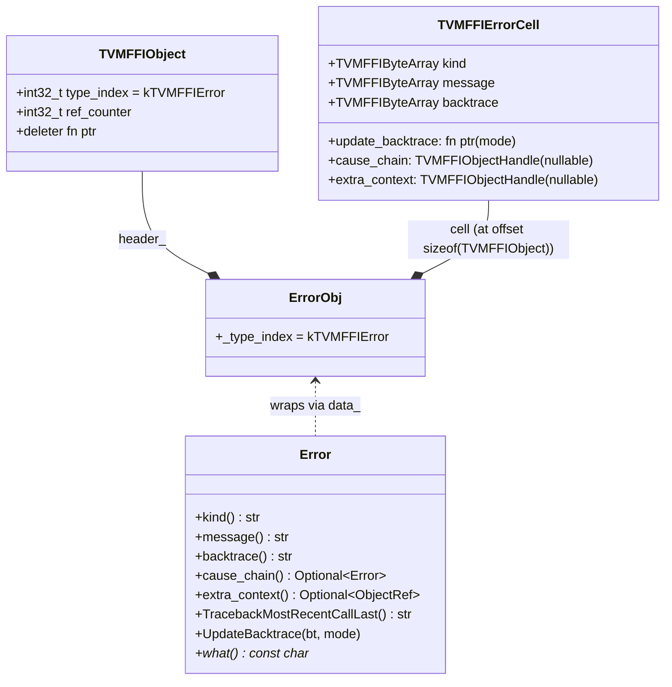
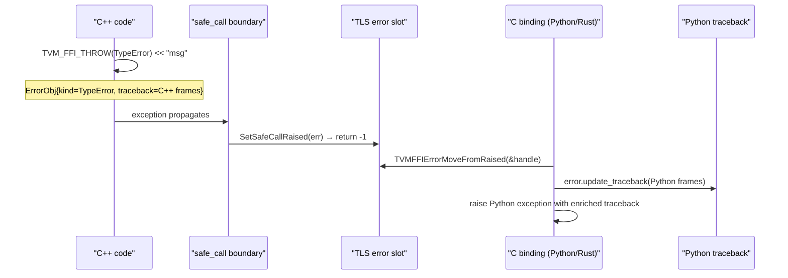

# Error System — Structured Error Propagation and TLS Slot

**TL;DR**
- `ErrorObj` is an `Object` subclass storing structured `{kind, message, backtrace}` fields and an `update_backtrace` callback (renamed from `traceback` / `update_traceback` in commit 6f020c1). `Error` is its C++ `ObjectRef` + `std::exception` dual, making it throwable in C++ and passable across language boundaries.
- A TLS (thread-local storage) error slot bridges the C++ exception world and the C ABI world: `TVM_FFI_SAFE_CALL_END()` catches C++ exceptions and serializes them into TLS; the C caller retrieves the error via `TVMFFIErrorMoveFromRaised`.
- `EnvErrorAlreadySet()` is a factory function (commit b1611e0; was a standalone `std::exception` subclass before) returning `Error(kind="EnvErrorAlreadySet")`. It signals "the frontend (e.g., Python) has already recorded an error." The C ABI return code -2 is removed from the C++ side; Python retains backward-compat -2 handling with a TODO to remove.
- Backtrace is stored **most-recent-call-first** internally (commit 6f020c1); `TracebackMostRecentCallLast()` reverses lines for Python-style rendering. `TVMFFIBacktraceUpdateMode` enum supports `kReplace` and `kAppend` modes for incremental frame accumulation.

## Problem Statement

### Background
Cross-language error propagation is notoriously hard. C++ exceptions cannot cross DLL boundaries reliably. Python has its own exception mechanism. Rust uses `Result<T, E>`. A naïve approach (returning error strings) loses structured information (kind vs. message vs. traceback).

### Solution
`ErrorObj` is a heap-allocated object (ref-counted like all FFI objects) holding the full structured error. A TLS slot holds the "current raised error" — filled by `TVM_FFI_SAFE_CALL_END` when an exception crosses the C ABI boundary. The frontend binding calls `TVMFFIErrorMoveFromRaised` to take ownership of the error object after detecting a -1 return code.

The `update_traceback` function pointer on `ErrorObj` allows different language bindings to append their own traceback segments as the error propagates upward through the call stack.

### Goals
- Structured errors: kind (e.g., "TypeError"), message, traceback — each as a separate field.
- Cross-language propagation: C++ throw → C ABI → Python exception with full traceback.
- Enrichable tracebacks: each layer (C++, Python) can append its frame information.
- Non-goal: stack-unwinding semantics outside C++ (other languages handle their own unwinding).

## Design

### Error Object Structure



### Key Classes, Fields and Interfaces

```python
class ErrorObj(Object, TVMFFIErrorCell):
    """Heap-allocated structured error.
    Layout: TVMFFIObject (24B) | TVMFFIErrorCell (kind + message + backtrace + update_backtrace)
    """
    # Inherited from TVMFFIErrorCell (all TVMFFIByteArray = pointer + size_t):
    kind:             TVMFFIByteArray    # error kind string, e.g. "TypeError"
    message:          TVMFFIByteArray    # human-readable error message
    backtrace:        TVMFFIByteArray    # accumulated stack frames (most-recent-call-first, commit 6f020c1)
    update_backtrace: Callable[[TVMFFIObjectHandle, TVMFFIByteArray*, int32_t], None]
    # ^ called by each language binding layer to append its backtrace segment
    # param update_mode: TVMFFIBacktraceUpdateMode (0=replace, 1=append)
    cause_chain:  TVMFFIObjectHandle  # nullable; optional chained cause Error (commit 4c712ca)
    extra_context: TVMFFIObjectHandle  # nullable; opaque object, e.g. Python exception (commit 4c712ca)
    # Invariant: both fields DecRef'd in ~ErrorObj() destructor (owned by ErrorCell)

    _type_index: int32_t = kTVMFFIError
    _type_key: str = "ffi.Error"  # was "object.Error" before commit 0966c368

    # Interacts with: TVMFFIErrorGetCellPtr (C binding reads cell at fixed offset)
    # Interacts with: Error::UpdateTraceback (C++ wrapper calls update_traceback)
    # Interacts with: details::ObjectUnsafe::DecRefObjectHandle (destructor for cause_chain/extra_context)
    # Extension: subclass ErrorObj (e.g., ErrorObjFromStd) to own string data


class ErrorObjFromStd(ErrorObj):
    """Concrete subclass that owns the string data (std::string storage)."""
    kind_data_:     str   # std::string owning kind
    message_data_:  str   # std::string owning message
    backtrace_data_: str  # std::string owning backtrace; update_backtrace modifies this

    @staticmethod
    def UpdateBacktrace(self: TVMFFIObjectHandle, bt: TVMFFIByteArray*, mode: int32_t) -> None:
        obj = cast[ErrorObjFromStd*](self)
        if mode == kTVMFFIBacktraceUpdateModeAppend:
            obj.backtrace_data_ += str(bt)           # O(1) append without realloc
        else:
            obj.backtrace_data_ = str(bt)            # kReplace: full overwrite
        obj.backtrace = TVMFFIByteArray{obj.backtrace_data_.data(), obj.backtrace_data_.size()}


class Error(ObjectRef, std_exception):
    """C++ exception + ObjectRef wrapping ErrorObj.
    Throwable in C++ (inherits std::exception); passable as Any (inherits ObjectRef).
    """
    def __init__(self, kind: str, message: str, backtrace: str,
                 cause_chain: Optional[Error] = None,
                 extra_context: Optional[ObjectRef] = None) -> None:
        data_ = make_object[ErrorObjFromStd](kind, message, backtrace)
        # If cause_chain/extra_context provided, set via TVMFFIErrorCreateWithCauseAndExtraContext
        # (commit 4c712ca)

    def kind(self) -> str: ...
    def message(self) -> str: ...
    def backtrace(self) -> str: ...         # most-recent-call-first order
    def cause_chain(self) -> Optional[Error]: ...    # nullable; commit 4c712ca
    def extra_context(self) -> Optional[ObjectRef]: ...  # nullable; commit 4c712ca
    def TracebackMostRecentCallLast(self) -> str:
        # Reverses lines for Python-style rendering (commit 6f020c1)
        ...

    def what(self) -> const char*:
        # Returns ONLY the error message (commit 4bccb3e changed this)
        # Before: returned full formatted traceback via thread_local std::string
        # After: returns obj->message.data directly — no allocation, noexcept-safe
        # Invariant: returned pointer valid as long as Error object alive
        # Invariant: no TLS used — safe for LLVM JIT environments
        return obj.message.data

    def FullMessage(self) -> str:
        # NEW (commit 4bccb3e): Returns the full error representation
        # Format: "Traceback (most recent call last):\n" + backtrace + kind + ": " + message + "\n"
        # Allocates a new std::string on each call
        # Use for logging/printing; ErrorBuilder uses this
        # Interacts with: TracebackMostRecentCallLast(), ErrorObj.kind, ErrorObj.message
        return ("Traceback (most recent call last):\n" +
                TracebackMostRecentCallLast() + kind() + ": " + message() + "\n")

    def UpdateBacktrace(self, bt: TVMFFIByteArray*, mode: int32_t) -> None:
        cast[ErrorObj*](data_.get()).update_backtrace(data_.get(), bt, mode)

    # Interacts with: TVM_FFI_SAFE_CALL_END (catches and stores in TLS),
    #                 TVMFFIErrorMoveFromRaised (C binding retrieves from TLS)
    # Invariant: data_ is never nullptr (TVM_FFI_DEFINE_NOTNULLABLE_OBJECT_REF_METHODS)


def EnvErrorAlreadySet() -> Error:
    """Factory function returning Error(kind='EnvErrorAlreadySet').
    Commit b1611e0: replaced standalone std::exception subclass with this factory.
    The returned Error flows through the standard TLS error slot like any other error.
    The C ABI -2 return code is removed from C++ (Python retains backward compat).
    """
    return Error("EnvErrorAlreadySet", "", "")
    # Usage: if TVMFFIEnvCheckSignals() != 0: throw EnvErrorAlreadySet()
    # Interacts with: Error object system, TLS error slot, TVM_FFI_SAFE_CALL_BEGIN/END
    # Invariant: error.kind == "EnvErrorAlreadySet" triggers raise_existing_error() in Python
```

### Safe Call Boundary Protocol

```python
# TVM_FFI_SAFE_CALL_BEGIN() — marks entry into C ABI boundary
# TVM_FFI_SAFE_CALL_END()   — catches exceptions and converts to return codes

# Expanded form:
def safe_call_boundary(func: FunctionObj*, args, n, result) -> int:
    try:
        # ... body ...
        return 0
    except Error as err:
        # Store structured Error in TLS slot (includes EnvErrorAlreadySet errors)
        details.SetSafeCallRaised(err)
        return -1
    # NOTE: commit b1611e0 removed the separate EnvErrorAlreadySet catch block.
    # EnvErrorAlreadySet is now a standard Error with kind="EnvErrorAlreadySet",
    # caught by the Error handler above.
    except std.exception as ex:
        # Wrap plain std::exception in an InternalError
        details.SetSafeCallRaised(Error("InternalError", ex.what(), ""))
        return -1

# On the caller side, TVM_FFI_CHECK_SAFE_CALL(func):
def check_safe_call(ret: int) -> None:
    if ret != 0:
        raise details.MoveFromSafeCallRaised()  # moves Error from TLS; throws
    # NOTE: -2 return code removed from C++ (commit b1611e0).
    # Python retains backward-compat -2 handling and also checks error.kind == "EnvErrorAlreadySet".
```

### Throw and Check Macros

```python
# TVM_FFI_THROW(ErrorKind) << "message"
# Expands to:
def throw_error(kind: str, message: str) -> Never:
    traceback = TVMFFITraceback(__FILE__, __LINE__, __PRETTY_FUNCTION__)
    builder = ErrorBuilder(kind, traceback, log_before_throw=False)
    builder.stream() << message   # appends to ostringstream
    # ErrorBuilder.__del__() throws: Error(kind, stream.str(), traceback)

# TVM_FFI_LOG_AND_THROW(ErrorKind) << "message"
# Same but also writes to stderr before throwing (log_before_throw=True)

# TVM_FFI_ALWAYS_LOG_BEFORE_THROW — compile-time flag (commit 076ac23e)
# When defined, ALL TVM_FFI_THROW calls also log to stderr, even without LOG_AND_THROW.
# Used to diagnose crashes in environments where exceptions are swallowed before printing.
# Interacts with: ErrorBuilder (sets log_before_throw=True regardless of macro used)

# TVM_FFI_ICHECK(cond) — internal assertion (always throws InternalError):
# if (!(cond)) TVM_FFI_THROW(InternalError) << "Check failed: (" #cond ") is false: "
# Use for programmer-assertion failures (logic bugs).

# TVM_FFI_CHECK(cond, ErrorKind) — user-facing validation (throws caller-specified kind):
# Added commit 327e8cc6; argument order swapped to condition-first in commit ae06434d.
# if (!(cond)) TVM_FFI_THROW(ErrorKind) << "Check failed: (" #cond ") is false: "
# cond:      boolean expression (evaluated first)
# ErrorKind: any unquoted error type name (e.g. ValueError, IndexError, RuntimeError)
# Interacts with: TVM_FFI_THROW (underlying macro)
# Invariant: message stream after << appends context to the "Check failed" prefix
# Extension: new error kinds need no code changes — just pass a different identifier
#
# Contrast with TVM_FFI_ICHECK:
#   TVM_FFI_ICHECK(x)           — always InternalError — for programmer assertions
#   TVM_FFI_CHECK(cond, Kind)   — caller-chosen kind   — for user-input validation
#
# HISTORY: argument order was (ErrorKind, cond) in commit 327e8cc6; swapped to (cond, ErrorKind)
#          in commit ae06434d to align with C assert(expr) and TVM_FFI_ICHECK(x) conventions.
#          Old form silently mis-compiles (ErrorKind becomes unevaluated bool; cond becomes type token).
#
# Usage:
#   TVM_FFI_CHECK(value >= 0, ValueError) << "Value must be non-negative, got " << value;
#   TVM_FFI_CHECK(index < size, IndexError) << "Index " << index << " out of bounds";
```

### Traceback Enrichment Flow



### Traceback Collection

```python
# TVMFFITraceback(__FILE__, __LINE__, func_sig) → TVMFFIByteArray*
# Backend: libbacktrace (default) or addr2line fallback
# Configured by:
#   TVM_FFI_USE_LIBBACKTRACE = 1      # compile flag
#   TVM_FFI_BACKTRACE_ON_SEGFAULT = 1 # installs SIGSEGV handler
```

## Contracts, Assumptions and Invariants

- `TVMFFIErrorCreate` (DLL function) returns a raw `TVMFFIObjectHandle` rather than following the standard return-code convention — this is because it's used inside error-handling loops where normal error propagation would create infinite recursion.
- `EnvErrorAlreadySet` is now a standard `Error(kind="EnvErrorAlreadySet")` stored in the TLS error slot like any other error (commit b1611e0). Python checks `error.kind == "EnvErrorAlreadySet"` to trigger `raise_existing_error()`. The -2 return code is removed from C++ but retained in Python with backward-compat TODO.
- `ErrorObj.cause_chain` and `ErrorObj.extra_context` (commit 4c712ca) are nullable handle fields DecRef'd in `~ErrorObj()`. When present, `cause_chain` holds a chained cause Error; `extra_context` holds an opaque object (e.g., Python exception).
- `ErrorObjFromStd::update_traceback` mutates the `traceback` field in place. Multiple calls from different language layers accumulate frames.
- `Error::what()` returns `obj->message.data` directly (commit 4bccb3e) — no allocation, no TLS, noexcept-safe. Code expecting the full traceback from `what()` must switch to `Error::FullMessage()`.
- The TLS error slot holds at most one error at a time; if a -1 return is ignored and another function raises, the slot is overwritten (previous error lost).
- **CPython reference cycle invariant (commit 6ccbdb6b)**: `_with_append_backtrace` MUST NOT retain `py_error` or `tb` in its frame's locals after returning. If they do, the traceback chain creates a cycle: `frame.locals → py_error → __traceback__ → TracebackType → f_back chain → outer frame`, which CPython's refcount GC cannot collect without invoking the cyclic collector. Enforced via explicit `del py_error, tb` in the `finally` block. Similarly, `TracebackManager.append_traceback` wraps frame construction in a nested helper function so the `FrameType` object is never bound as a local variable in the enclosing frame, removing that arm of the cycle.

### Extension Points
- Add new error kinds by passing a different string to `TVM_FFI_THROW(MyKind)` — no code changes required, only a string convention.
- Custom traceback providers: replace `TVMFFITraceback` implementation at compile time via `TVM_FFI_USE_LIBBACKTRACE=0`.
- Python binding registers `PyErr_CheckSignals` via `TVMFFIEnvRegisterCAPI` so TVM functions can be interrupted with Ctrl-C by periodically calling `TVMFFIEnvCheckSignals()` and throwing `EnvErrorAlreadySet()` (now returns `Error(kind="EnvErrorAlreadySet")`) if it returns non-zero.
- `Expected<T>` (0028-expected-type): an exception-free alternative to the TLS error slot. `Function::CallExpected<T>()` wraps the `safe_call` result in `Expected<T>` instead of throwing.

### Usage Examples

#### Throwing and catching structured errors (C++)
**Context**: an operation that validates its arguments and produces a structured error.

```cpp
void Divide(int a, int b) {
    if (b == 0) {
        TVM_FFI_THROW(ValueError) << "Division by zero: " << a << " / " << b;
    }
    // ...
}

try {
    Divide(5, 0);
} catch (const tvm::ffi::Error& e) {
    std::string kind = e.kind();      // "ValueError"
    std::string msg  = e.message();   // "Division by zero: 5 / 0"
    const char* w    = e.what();      // message only (commit 4bccb3e)
    std::string full = e.FullMessage(); // full "Traceback...\nKind: message\n"
}
```

#### Cross-language error propagation: C++ → Python
**Context**: a Python script calls a TVM FFI function that raises an error.

```python
# Python (conceptual; actual binding code in cython/):
handle = TVMFFIFunctionGetGlobal(b"my.op")
result = TVMFFIAny()
rc = TVMFFIFunctionCall(handle, args, n, byref(result))
if rc == -1:
    err_handle = ctypes.c_void_p()
    TVMFFIErrorMoveFromRaised(byref(err_handle))
    cell = TVMFFIErrorGetCellPtr(err_handle)   # TVMFFIErrorCell at fixed offset
    kind = cell.kind.data[:cell.kind.size].decode()
    msg  = cell.message.data[:cell.message.size].decode()
    # Enrich with Python traceback:
    py_tb = traceback.format_stack()
    TVMFFIErrorCell.update_traceback(err_handle, py_tb_bytes)
    raise TVMError(kind + ": " + msg)
elif rc == -2:
    pass  # Python exception already set, propagate normally
```

## Implementation Notes
- `ErrorBuilder`'s destructor is `[[noreturn]]` and throws. MSVC requires a pragma to suppress warning C4722 on this pattern.
- `details::SetSafeCallRaised` is responsible for both storing the error in TLS and calling `TVMFFIErrorSetRaised(error)` (the C ABI path).
- libbacktrace integration is conditional: `#if TVM_FFI_USE_LIBBACKTRACE`. On Windows and embedded platforms it falls back to a no-op or addr2line.
- `TVMFFIErrorSetRaisedFromCStr` (renamed from `TVMFFIErrorSetRaisedByCStr` in commit a419ed17) is the C ABI entry point for setting a raw-string error without boxing it into an ErrorObj first. Used by catch-all handlers in non-C++ language bindings.
- `TVMFFIErrorSetRaisedFromCStrParts(kind, const char** parts, int32_t num_parts)` (commit 550e92fc) is the multi-part variant: accepts an array of C-string parts, skips NULL entries, concatenates the rest, and stores in the TLS error slot. Avoids duplicating repeated substrings (e.g., function signatures) across many error messages. Internal implementation: `SafeCallContext::SetRaisedByCstrParts` pre-sizes a `std::string` via `strlen` sum then appends all non-NULL parts. Backtrace frame filter excludes this function symbol, consistent with `TVMFFIErrorSetRaisedFromCStr`. Usage pattern from C caller: `const char* parts[] = {"prefix: ", nullptr, " suffix"}; TVMFFIErrorSetRaisedFromCStrParts("TypeError", parts, 3);` → message = "prefix:  suffix" (NULL skipped).
- `TVM_FFI_ALWAYS_LOG_BEFORE_THROW` is a compile-time opt-in for always logging before throw. It does NOT change the exception semantics — it only ensures stderr output appears before the throw, useful in crash-report pipelines.

## Alternatives & Trade-offs

### Alternative A: Return error string directly from DLL functions
- Pros: Simple; no TLS dependency.
- Cons: Loses structured error (kind, traceback); can't chain enrichment across layers; requires caller to allocate string buffer.

### Alternative B: Throw std::exception across DLL boundary
- Pros: Native C++ idiom.
- Cons: C++ exceptions are ABI-unstable across DLL/SO boundaries; not supported on all platforms; not accessible from C, Rust, or Python.

## Related Design Docs & ADRs
- `.knowledge/design-records/0001-c-abi.md` — `TVMFFIErrorCell`, `TVMFFIErrorCreate`, `TVMFFIErrorMoveFromRaised`
- `.knowledge/design-records/0002-object-system.md` — `ErrorObj` inherits `Object`, `make_object`
- `.knowledge/design-records/0004-function-system.md` — `TVM_FFI_SAFE_CALL_BEGIN/END` in `FunctionObj::SafeCall`
- `.knowledge/design-records/0028-expected-type.md` — `Expected<T>` exception-free error handling (alternative to TLS error slot)

## Evidence Matrix

| Commit | Contribution |
|--------|-------------|
| 4bccb3e | Error::what() returns message-only (removes TLS); adds Error::FullMessage() for full traceback+kind |
| 227bdd0 | TVMFFIEnvTensorAlloc error propagation: checks ret_code before dl_tensor pointer (preserves TLS error message) |
| 6ccbdb6b | Fixes CPython reference cycle in traceback enrichment: del py_error, tb in finally; nested create() in append_traceback to avoid frame retention |
| 4c712ca | Extends TVMFFIErrorCell with cause_chain and extra_context fields; adds TVMFFIErrorCreateWithCauseAndExtraContext C ABI function; ErrorObj destructor DecRefs new handles |
| b1611e0 | Replaces EnvErrorAlreadySet standalone struct with Error(kind="EnvErrorAlreadySet") factory function; removes -2 return code from C++ TVM_FFI_SAFE_CALL_END |
