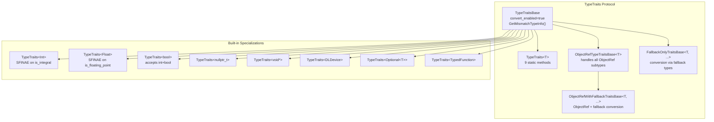

# TypeTraits Protocol

**TL;DR**.
- `TypeTraits<T>` is a compile-time specialization interface that defines how any C++ type `T` converts to/from the `Any`/`AnyView` value system. Every type that participates in FFI must provide a `TypeTraits` specialization.
- The protocol separates strict storage checking (`CheckAnyStrict`) from permissive view conversion (`TryCastFromAnyView`), enabling containers like `Array<T>` to enforce element type invariants while function arguments accept compatible conversions (e.g., int-to-float).
- Built-in specializations cover POD types (int, float, bool, void*, DLDevice, DLDataType), all ObjectRef subtypes (via `ObjectRefTypeTraitsBase`), `Optional<T>`, `TypedFunction<R(Args...)>`, and raw C strings.

## Problem Statement

### Background
- The `Any`/`AnyView` value system stores type-erased values as a 16-byte tagged union. Converting between concrete C++ types and this representation requires per-type logic.
- Different contexts need different conversion strictness: function arguments should be permissive (accept int where float is expected), but container storage should be strict (Array<float> must contain exactly floats, not ints).
- Adding new types to the FFI system should not require modifying core code.

### Solution
- `TypeTraits<T>` is a template struct with static methods for bidirectional conversion. The default (unspecialized) template has `convert_enabled = false`, so unregistered types fail at compile time.
- Two conversion paths: `CheckAnyStrict` + `MoveFromAnyAfterCheck` for strict storage (containers), and `TryCastFromAnyView` for permissive conversion (function arguments).
- `ObjectRefTypeTraitsBase<T>` provides a shared implementation for all ObjectRef subtypes, using `IsInstance` for type checking.

### Goals
- Enable any C++ type to participate in the `Any` value system via template specialization.
- Separate strict (storage) and permissive (conversion) type checking.
- Zero runtime overhead for POD types (inline storage, no allocations).
- Non-goal: runtime type trait registration; dynamic dispatch for conversion.

## Design



### Key Classes, Fields and Interfaces

```python
class TypeTraits[T]:
    """Protocol: 9 static methods defining T <-> Any conversion and schema generation."""

    convert_enabled: ClassVar[bool] = False  # default; True when specialized
    storage_enabled: ClassVar[bool] = False  # True if T can be stored in containers
    field_static_type_index: ClassVar[int32]  # type index for reflection field annotations

    @staticmethod
    def CopyToAnyView(src: T, result: TVMFFIAny_ptr) -> None:
        """Write T into a TVMFFIAny as a non-owning view."""
        # Sets result.type_index and the appropriate union member
        # Invariant: does NOT IncRef for objects (view semantics)
        # Interacts with: AnyView implicit constructor

    @staticmethod
    def MoveToAny(src: T, result: TVMFFIAny_ptr) -> None:
        """Move T into a TVMFFIAny as an owning value."""
        # For POD: same as CopyToAnyView
        # For ObjectRef: moves ownership (no IncRef, source becomes null)
        # Interacts with: Any constructor, Any assignment

    @staticmethod
    def CheckAnyStrict(src: TVMFFIAny_ptr) -> bool:
        """Strict check: does src store exactly the result of MoveToAny<T>?"""
        # For int: src.type_index == kTVMFFIInt (exact match)
        # For bool: src.type_index == kTVMFFIBool (exact match)
        # For ObjectRef<T>: IsInstance<T::ContainerType>(src.type_index)
        # Invariant: CheckAnyStrict=True implies MoveFromAnyAfterCheck succeeds
        # Interacts with: Array<T>, container invariant enforcement

    @staticmethod
    def CopyFromAnyViewAfterCheck(src: TVMFFIAny_ptr) -> T:
        """Extract T from storage after CheckAnyStrict returned True."""
        # For POD: read union member, cast to T
        # For ObjectRef: wrap v_obj in ObjectPtr (IncRef)

    @staticmethod
    def MoveFromAnyAfterCheck(src: TVMFFIAny_ptr) -> T:
        """Move T out of storage, clearing src to nullptr."""
        # For POD: same as Copy (trivially copyable)
        # For ObjectRef: take ownership of v_obj, set src to None

    @staticmethod
    def TryCastFromAnyView(src: TVMFFIAny_ptr) -> Optional[T]:
        """Permissive conversion: try to convert src to T, possibly with type coercion."""
        # For float: accepts kTVMFFIFloat, kTVMFFIInt, kTVMFFIBool (promotion)
        # For bool: accepts kTVMFFIBool, kTVMFFIInt
        # For ObjectRef<T>: accepts any object where IsInstance<T::ContainerType> is True
        # Returns None if conversion impossible
        # Interacts with: AnyView.cast<T>(), AnyView.as_<T>()

    @staticmethod
    def GetMismatchTypeInfo(source: TVMFFIAny_ptr) -> str:
        """Return readable type name when conversion fails (for error messages)."""
        # Default: TypeIndexToTypeKey(source.type_index)

    @staticmethod
    def TypeStr() -> str:
        """Return the type name string for error messages and reflection."""
        # e.g., "int", "float", "bool", "object.Function", "Optional<int>"

    @staticmethod
    def TypeSchema() -> str:
        """Return a JSON schema string for T. (28fe3cc)"""
        # e.g., '{"type":"int"}', '{"type":"Optional","args":[{"type":"ffi.String"}]}'
        # Delegates to details::TypeSchemaImpl<T> (compile-time JSON generation)
        # Interacts with: details::TypeSchemaImpl, StaticTypeKey constants
        # Invariant: parallels TypeStr() but produces structured JSON instead of display strings

# Key distinction:
# CheckAnyStrict is STRICT -- used by containers to enforce element types
# TryCastFromAnyView is PERMISSIVE -- used by function arguments for convenience
#
# Example: Any stores int(42)
#   TypeTraits<float>::CheckAnyStrict -> False (type_index is kTVMFFIInt, not kTVMFFIFloat)
#   TypeTraits<float>::TryCastFromAnyView -> Some(42.0) (int-to-float promotion)
#
# This means Array<float> rejects int elements, but a function f(float x) accepts int arguments.
```

### ObjectRefTypeTraitsBase

```python
class ObjectRefTypeTraitsBase[TObjRef]:
    """Shared TypeTraits implementation for all ObjectRef subtypes."""
    field_static_type_index: ClassVar[int32] = kTVMFFIObject

    @staticmethod
    def CopyToAnyView(src: TObjRef, result: TVMFFIAny_ptr) -> None:
        # If nullable and not defined: write nullptr
        # Otherwise: write v_obj pointer with src's type_index
        # Invariant: does NOT IncRef (view semantics)

    @staticmethod
    def MoveToAny(src: TObjRef, result: TVMFFIAny_ptr) -> None:
        # If nullable and not defined: write nullptr
        # Otherwise: move ObjectPtr out of src (no IncRef, src becomes null)

    @staticmethod
    def CheckAnyStrict(src: TVMFFIAny_ptr) -> bool:
        # If nullable: kTVMFFINone is valid
        # Check: type_index >= kTVMFFIStaticObjectBegin AND IsInstance<ContainerType>
        # Interacts with: IsObjectInstance (from object system design 0002)

    @staticmethod
    def TryCastFromAnyView(src: TVMFFIAny_ptr) -> Optional[TObjRef]:
        # If nullable: kTVMFFINone -> return null ObjectRef
        # Requires: IsInstance check on runtime type
        # Returns: ObjectRef wrapping the pointer (IncRef)
    # Extension: derive ObjectRefWithFallbackTraitsBase to add auto-conversion from POD types
```

### Contracts, Assumptions and Invariants
- **CheckAnyStrict consistency**: `CheckAnyStrict` must be consistent with `MoveToAny`: if `MoveToAny(x, dst)` is called, then `CheckAnyStrict(dst)` must return True. This invariant ensures containers can verify their element types.
- **Permissive conversion hierarchy**: `TryCastFromAnyView` for numeric types follows: bool is-a int (both accept kTVMFFIBool), int accepts kTVMFFIInt and kTVMFFIBool, float accepts kTVMFFIFloat, kTVMFFIInt, and kTVMFFIBool. No implicit narrowing (float-to-int).
- **StrictBool vs bool**: `TypeTraits<bool>` accepts int-to-bool conversion; `TypeTraits<StrictBool>` rejects it. Use `StrictBool` when implicit int-to-bool would cause bugs (especially as a `FallbackType` in `FallbackOnlyTraitsBase`).
- **DLTensor* is view-only**: `TypeTraits<DLTensor*>` has `storage_enabled = false` and `MoveToAny` throws. Use NDArray for owned tensor storage. `TryCastFromAnyView` accepts both kTVMFFIDLTensorPtr and kTVMFFINDArray (extracts DLTensor from NDArray via known offset).
- **Nullable ObjectRef**: When `TObjRef::_type_is_nullable` is True, `CheckAnyStrict` and `TryCastFromAnyView` accept `kTVMFFINone`. Non-nullable ObjectRefs reject None.

### Extension Points
- **Custom type specialization**: Specialize `TypeTraits<MyType>` to enable any C++ type in the Any system. Implement all 8 methods. Set `convert_enabled = true`, `storage_enabled = true`.
- **Fallback conversion chains**: `FallbackOnlyTraitsBase<T, F1, F2, ...>` tries converting through fallback types in order. Useful for types that can be constructed from multiple other types. Define `ConvertFallbackValue(FallbackType) -> T` for each.
- **ObjectRef with fallback**: `ObjectRefWithFallbackTraitsBase<T, F1, ...>` first tries ObjectRef conversion, then falls back to constructing from other types.
- **SFINAE-based specializations**: The built-in int and float traits use `std::enable_if_t<std::is_integral_v<T>>` and `std::is_floating_point_v<T>`, automatically covering all integer sizes and float/double. The enum specialization uses a two-phase `is_integeral_enum_v<T>` helper to avoid evaluating `std::underlying_type_t<T>` before enum-ness is confirmed, fixing a hard error on GCC 8.x (`5fba9e8`).
- **Standalone String/Bytes specializations**: `TypeTraits<String>` and `TypeTraits<Bytes>` are standalone specializations (no longer derived from `ObjectRefWithFallbackTraitsBase`) that handle the dual small/large representation introduced by SSO. Their `field_static_type_index` is `kTVMFFIAny` (the union type) since the stored type index can be either `kTVMFFISmallStr` or `kTVMFFIStr` (likewise for Bytes). `CheckAnyStrict` accepts both small and large type indices; `TryCastFromAnyView` additionally accepts `kTVMFFIRawStr` for String and `kTVMFFIByteArrayPtr` for Bytes.

### Usage Examples

#### Adding a custom type to the Any system
**Context**: Registering a new enum type so it can be passed through FFI boundaries.
```cpp
enum class MyEnum : int32_t { kFoo = 0, kBar = 1 };

template <>
struct TypeTraits<MyEnum> : public TypeTraitsBase {
  static constexpr int32_t field_static_type_index = TypeIndex::kTVMFFIInt;

  static void CopyToAnyView(const MyEnum& src, TVMFFIAny* result) {
    result->type_index = TypeIndex::kTVMFFIInt;
    result->v_int64 = static_cast<int64_t>(src);
  }
  static void MoveToAny(MyEnum src, TVMFFIAny* result) { CopyToAnyView(src, result); }
  static bool CheckAnyStrict(const TVMFFIAny* src) {
    return src->type_index == TypeIndex::kTVMFFIInt;
  }
  static MyEnum CopyFromAnyViewAfterCheck(const TVMFFIAny* src) {
    return static_cast<MyEnum>(src->v_int64);
  }
  static MyEnum MoveFromAnyAfterCheck(TVMFFIAny* src) {
    return CopyFromAnyViewAfterCheck(src);
  }
  static std::optional<MyEnum> TryCastFromAnyView(const TVMFFIAny* src) {
    if (src->type_index == TypeIndex::kTVMFFIInt) {
      return static_cast<MyEnum>(src->v_int64);
    }
    return std::nullopt;
  }
  static std::string TypeStr() { return "MyEnum"; }
};

// Now MyEnum works in Any, AnyView, Function args, and containers:
Any val = MyEnum::kBar;
MyEnum e = val.cast<MyEnum>();
```

## Alternatives & Trade-offs
### Runtime type trait registration (rejected)
- Pros: No need for template specialization; types can be registered dynamically.
- Cons: Runtime dispatch overhead on every conversion; type errors become runtime failures instead of compile-time failures; harder to optimize.

### Single conversion path (no CheckAnyStrict/TryCastFromAnyView split)
- Pros: Simpler protocol (fewer methods to implement).
- Cons: Cannot distinguish between strict container storage and permissive argument conversion. Either containers would accept wrong types or function arguments would reject valid conversions.

## Related Work
### Design Records
- `0001-any-anyview-value-system.md` -- Any/AnyView uses TypeTraits for all type conversions
- `0002-object-system.md` -- ObjectRefTypeTraitsBase bridges the Object system with TypeTraits
- `0003-function-system.md` -- FromUnpacked uses TypeTraits to auto-convert function arguments
- `0006-containers.md` -- Array<T> uses CheckAnyStrict to enforce element type invariants

### Evidence Matrix
- TypeTraits protocol (8 methods) -> `commits/2025-05-06-7d34eb8abfe987bf0031e4d4ff479895d867a966.md` + `7d34eb8` + `TypeTraits`, `TypeTraitsBase`
- CheckAnyStrict vs TryCastFromAnyView distinction -> `commits/2025-05-06-7d34eb8abfe987bf0031e4d4ff479895d867a966.md` + `7d34eb8` + `CheckAnyStrict`, `TryCastFromAnyView`
- ObjectRefTypeTraitsBase for ObjectRef subtypes -> `commits/2025-05-06-7d34eb8abfe987bf0031e4d4ff479895d867a966.md` + `7d34eb8` + `ObjectRefTypeTraitsBase`, `IsObjectInstance`
- FallbackOnlyTraitsBase chain -> `commits/2025-05-06-7d34eb8abfe987bf0031e4d4ff479895d867a966.md` + `7d34eb8` + `FallbackOnlyTraitsBase`, `ObjectRefWithFallbackTraitsBase`
- Standalone TypeTraits<String>/TypeTraits<Bytes> -> `commits/2025-08-04-49e2ed4a...md` + `49e2ed4` + `TypeTraits_String`, `TypeTraits_Bytes`, `BytesBaseCell`
- TypeSchema() as 9th method on TypeTraits protocol -> `commits/2025-10-03-28fe3cc7...md` + `28fe3cc` + `TypeSchema`, `TypeSchemaImpl`
- GCC 8.x enum SFINAE fix (is_integeral_enum_v) -> `commits/2025-10-04-5fba9e8f...md` + `5fba9e8` + `is_integeral_enum_v`, `TypeTraits<IntEnum>`
- TypeTraits<TensorView> non-owning view specialization -> `commits/2025-10-01-1ec62367...md` + `1ec6236` + `TypeTraits<TensorView>`, `storage_enabled=false`
