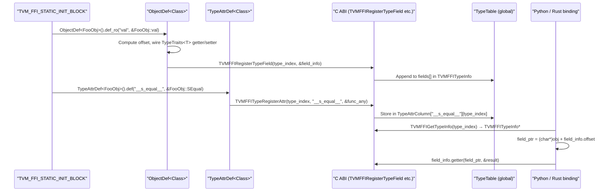
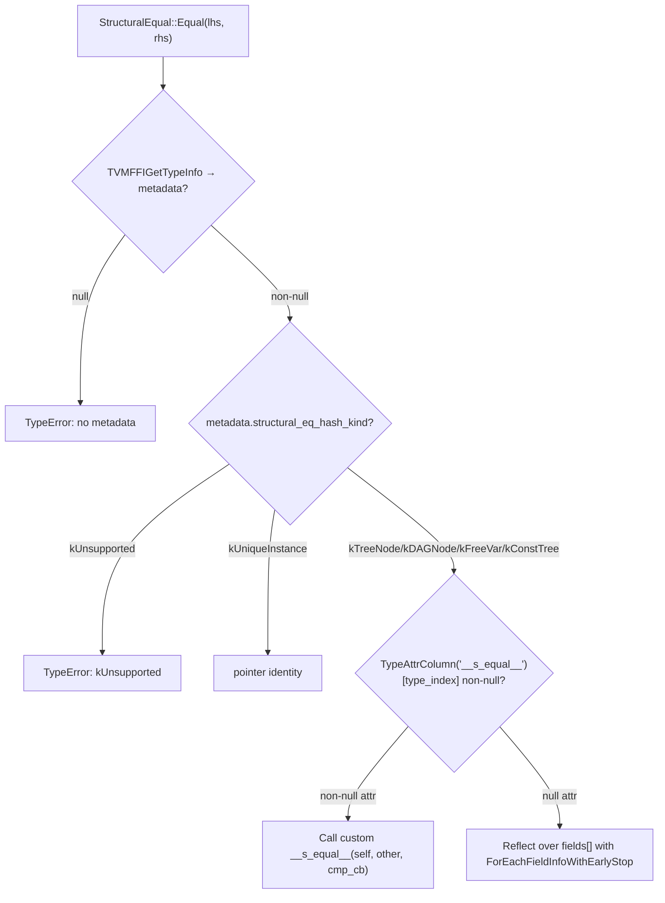

# Reflection System — Field, Method, Global, and TypeAttr Registration

**TL;DR**
- `ObjectDef<Class>` (template builder replacing the old `ReflectionDef`) auto-derives `type_index` and `type_key` from its template parameter and exposes a chained `def_ro/def_rw/def/def_static` API for registering field and method reflections on any `Object` subtype.
- `GlobalDef` mirrors `ObjectDef`'s interface for globally registered functions; `TypeAttrDef<Class>` registers named per-type attributes (functions or constants) in a column-array store keyed by type index.
- All registration happens inside `TVM_FFI_STATIC_INIT_BLOCK` (replacing the old `TVM_FFI_REFLECTION_DEF` macro), running at static init time before `main()`.
- Byte offsets in `TVMFFIFieldInfo` are always **relative to the `Object` header** (i.e., `(char*)TVMFFIObjectHandle`), not to the C++ subclass allocation base — this allows C and Python bindings to access fields without knowing the C++ class layout.

## Problem Statement

### Background
Language bindings (Python, Rust) need to read and write fields of C++ `Object` subclasses, call methods, look up globally registered functions, and dispatch structural equality/hash — all without including C++ headers. A registration-based approach lets C++ code advertise its API surface once at startup; all other languages query it at runtime.

### Solution
Three builder types are instantiated in static initializer blocks:
- `ObjectDef<Class>` — registers fields and methods for a type.
- `GlobalDef` — registers global functions.
- `TypeAttrDef<Class>` — registers named per-type attributes (used by the structural eq/hash system and user extensions).

Each builder calls C ABI registration functions (`TVMFFIRegisterTypeField`, `TVMFFIFunctionSetGlobalFromMethodInfo`, `TVMFFITypeRegisterAttr`) which store the metadata in global tables. Bindings query the tables at runtime via `TVMFFIGetTypeInfo` and `TVMFFIGetTypeAttrColumn`.

### Goals
- Language-agnostic field/method/global access via the C ABI.
- Automatic `type_index`/`type_key` derivation — no manual passing.
- Byte offset stability relative to `TVMFFIObjectHandle`.
- A named per-type attribute store decoupled from the static field/method table.
- Non-goal: dynamic registration after `main()` starts (all registrations happen at static init time).

## Design

### Registration Flow



### Key Classes, Fields and Interfaces

```python
class ReflectionDefBase:
    """Shared base for ObjectDef and GlobalDef. Provides GetMethod_ helper."""
    type_index_: int32_t
    type_key_: const char*

    @staticmethod
    def GetMethod_(func: MethodPtr, Class: type) -> Function:
        """Convert a class method pointer to a packed Function.
        ObjectRef subclass: receiver by value. Object subclass: receiver as const pointer.
        Wraps via Function::FromTyped; inserts self as first arg.
        """
        # Interacts with: Function::FromTyped, TypeTraits dispatch


class ObjectDef(Generic[Class], ReflectionDefBase):
    """Builder for registering field + method accessors for a C++ Object subtype.
    Template form of old ReflectionDef — auto-derives type_index and type_key.
    """
    # Constructed as: ObjectDef<MyObjClass>()
    # Class must satisfy: Class::_GetOrAllocRuntimeTypeIndex() is callable

    def def_ro(self, name: str, field_ptr: T_Class_member, *extra) -> ObjectDef[Class]:
        """Register a readonly field accessor. Setter returns error if called."""
        RegisterField(name, field_ptr, readonly=True, extra=extra)
        return self
        # Interacts with: TVMFFIRegisterTypeField, FieldGetter/FieldSetter<T>

    def def_rw(self, name: str, field_ptr: T_Class_member, *extra) -> ObjectDef[Class]:
        """Register a read-write field accessor."""
        RegisterField(name, field_ptr, readonly=False, extra=extra)
        return self

    def def_(self, name: str, func: Callable, *extra) -> ObjectDef[Class]:
        """Register an instance method (self is first arg)."""
        # Wraps via GetMethod_<Class>(func) → Function::FromTyped
        # Interacts with: TVMFFITypeRegisterMethod (or TVMFFIFunctionSetGlobalFromMethodInfo?)
        ...

    def def_static(self, name: str, func: Callable, *extra) -> ObjectDef[Class]:
        """Register a static method (no self arg)."""
        # flags: kTVMFFIFieldFlagBitMaskIsStaticMethod
        ...

    def RegisterField(self, name: str, field_ptr: T Class::*, readonly: bool, extra: tuple) -> None:
        info = TVMFFIFieldInfo()
        info.name = TVMFFIByteArray{name}
        info.doc = extract_doc(extra)               # if DocString extra provided (optional; see 0013)
        info.metadata = extract_metadata(extra)    # RENAMED from type_schema (commit 935a5a07): focused JSON
        info.flags = kTVMFFIFieldFlagBitMaskWritable if not readonly else 0
        info.flags |= extract_flags(extra)          # e.g., AttachFieldFlag::SEqHashDef
        info.size = sizeof(T)
        info.alignment = alignof(T)
        info.offset = GetFieldByteOffsetToObject[Class, T](field_ptr)
        info.getter = FieldGetter[T]
        info.setter = FieldSetter[T]
        if has_default_value(extra):
            info.flags |= kTVMFFIFieldFlagBitMaskHasDefault
            info.default_value = AnyView(get_default_value(extra))
        TVMFFIRegisterTypeField(type_index_, &info)
        # Interacts with: GetFieldByteOffsetToObject, TypeTraits<T> getter/setter


# refl::init<Args...> — struct-based constructor tag (commit fc2630f, refactored from commit c01dadf)
# REPLACES: refl::init<T, Args...> free function (removed in commit fc2630f)
class init(Generic[*Args]):
    """Tag struct passed to ObjectDef.def() to register a __ffi_init__ constructor.
    Class type is deduced from the enclosing ObjectDef<Class> context — NOT a parameter.
    Replaces the old free function form where T was an explicit template argument.
    """
    # Invariant: Class must be constructible with Args...
    # Interacts with: ObjectDef.def(init<Args...>), make_object<Class>(args...)
    # Extension: pass optional docstring as extra arg: .def(init<...>(), "docstring")
    @staticmethod
    def execute(*args: Args) -> ObjectRef:  # template<typename Class> — deduced by ObjectDef
        return ObjectRef(make_object[Class](*args))

# ObjectDef.def(init<Args...>) overload (commit fc2630f)
# Alongside existing def(name, func) and def_static(name, func):
class ObjectDef(Generic[Class]):
    INIT_METHOD_NAME: str = "__ffi_init__"  # private constant (was kInitMethodName, commit f0145b40)

    def def_(self, init_func: init[*Args], *extra) -> ObjectDef[Class]:
        """Register a __ffi_init__ static method from an init<Args...> tag.
        Equivalent to: .def_static(INIT_METHOD_NAME, &init<Args...>::execute<Class>, extra...)
        """
        # Interacts with: RegisterMethod, TypeInfo.__ffi_init__, c_class decorator (0017)
        return self

# OLD calling convention (REMOVED in commit fc2630f):
#   refl::ObjectDef<TestIntPairObj>()
#       .def_static("__ffi_init__", refl::init<TestIntPairObj, int64_t, int64_t>)
# NEW calling convention:
#   refl::ObjectDef<TestIntPairObj>()
#       .def(refl::init<int64_t, int64_t>())
# Convention: "__ffi_init__" is the canonical name for the reflected constructor static method
#   (renamed from "__create__" in commit c01dadf, made implicit in commit fc2630f)


class GlobalDef(ReflectionDefBase):
    """Chained builder for global function registration. Sibling to ObjectDef.
    Replaces TVM_FFI_REGISTER_GLOBAL + Function::Registry (removed in commit 26b68b02).
    """
    def def_(self, name: str, func: Callable, *extra) -> GlobalDef:
        """Register a typed callable via Function::FromTyped."""
        # Interacts with: TVMFFIFunctionSetGlobalFromMethodInfo, GlobalFunctionTable

    def def_packed(self, name: str, func: Callable, *extra) -> GlobalDef:
        """Register a packed callable (manual AnyView* handling)."""
        # Interacts with: Function::FromPacked, GlobalFunctionTable

    def def_method(self, name: str, func: MethodPtr, *extra) -> GlobalDef:
        """Expose a class method pointer as a global function."""
        # Interacts with: ReflectionDefBase::GetMethod_, TVMFFIFunctionSetGlobalFromMethodInfo


class TypeAttrDef(Generic[Class]):
    """Builder for registering named per-type attributes for Object subclass.
    Each attribute occupies one column in a column-array store indexed by type_index.
    Used by structural eq/hash, stub generator, and user extensions.
    """
    type_index_: int32_t
    type_key_: const char*

    def def(self, name: const char*, func: Func) -> TypeAttrDef:
        """Register a Function as a named attribute for Class.
        func is wrapped via GetMethod<Class> then packed into AnyView for storage.
        """
        # Interacts with: TVMFFITypeRegisterAttr, ReflectionDefBase::GetMethod<Class>
        # Invariant: raises RuntimeError if attr already set for (type_index_, name)

    def attr(self, name: const char*, value: T) -> TypeAttrDef:
        """Register a constant value as a named attribute."""
        # Interacts with: TVMFFITypeRegisterAttr, AnyView(value)


class TypeAttrColumn:
    """C++ accessor wrapping a TVMFFITypeAttrColumn*.
    Constructed by name; looks up the column via TVMFFIGetTypeAttrColumn.
    """
    def __init__(self, attr_name: str_view) -> None:
        # Invariant: raises RuntimeError if column not present
        # Use EnsureTypeAttrColumn first if the column may not exist yet
        ...

    def __getitem__(self, type_index: int32_t) -> AnyView:
        """Return the attribute value for type_index; returns null AnyView if out of range."""
        # Interacts with: TVMFFITypeAttrColumn.data[], TVMFFIGetTypeAttrColumn


def EnsureTypeAttrColumn(name: str_view) -> None:
    """Guarantee the named column exists (no value set). Idempotent.
    Called in TVM_FFI_STATIC_INIT_BLOCK before any TypeAttrDef registrations.
    """
    # Calls TVMFFITypeRegisterAttr(kTVMFFINone, name, nullptr) as sentinel


# ---- Python TypeAttr bridge (commit 4edf4f3) ----

# python/tvm_ffi/cython/object.pxi
def _lookup_type_attr(type_index: int, attr_key: str) -> Any:
    """Look up a per-type attribute value from the C++ TypeAttr registry.
    Returns None if the attribute is not set for this type_index.
    # Backed by C ABI: TVMFFIGetTypeAttrColumn(attr_key) → column, then column[type_index]
    # Invariant: returns None if column is NULL or type_index out of range
    # Use cases: stubgen, dataclass __repr__, __metadata__ per-type annotations
    # Interacts with: TypeAttrDef<T>.def(attr_key, value), TVMFFIGetTypeAttrColumn C ABI
    """
    ...


# ---- Field accessors ----

def GetFieldByteOffsetToObject(Class: type, T: type, field_ptr) -> int64_t:
    """Compute byte offset of a field relative to the Object header (char*)TVMFFIObjectHandle."""
    field_offset_to_class = addressof(nullptr.*field_ptr)    # member pointer offset
    object_offset_to_subclass = ObjectUnsafe.GetObjectOffsetToSubclass[Class]()
    return field_offset_to_class - object_offset_to_subclass
    # Invariant: result is from (char*)obj_handle, not from (char*)subclass_ptr
    # Interacts with: ObjectUnsafe (knows Object header position within Class)
    # Supports base-class member pointers (e.g., Class=DerivedObj, field in BaseObj)


def FieldGetter(T: type, field: void*, result: TVMFFIAny*) -> int:
    """TypeTraits-backed getter wired into TVMFFIFieldInfo.getter."""
    # TVM_FFI_SAFE_CALL_BEGIN/END wrapping:
    *result = AnyUnsafe.MoveAnyToTVMFFIAny(Any(*cast[T*](field)))
    return 0
    # Interacts with: TypeTraits<T> (boxing T into Any), AnyUnsafe


def FieldSetter(T: type, field: void*, value: TVMFFIAny*) -> int:
    """TypeTraits-backed setter wired into TVMFFIFieldInfo.setter.
    Special case: T == Any → direct memcpy, no cast round-trip.
    """
    # TVM_FFI_SAFE_CALL_BEGIN/END wrapping:
    if T == Any:
        *cast[Any*](field) = AnyView.CopyFromTVMFFIAny(*value)  # direct, no cast
    else:
        *cast[T*](field) = AnyView.CopyFromTVMFFIAny(*value).as[T]()
    return 0
    # Interacts with: TypeTraits<T> (unboxing Any → T), AnyView


# ---- Field iteration ----

def ForEachFieldInfo(type_info: TVMFFITypeInfo*, callback: Callable[[TVMFFIFieldInfo*], None]) -> None:
    """Iterate all registered fields for a type, including inherited fields, in parent-to-child order.
    Added in commit 837800e7 alongside the type_ancestors ptr-array change.
    """
    # Traverses type_info.type_ancestors[1..type_depth-1] then type_info.fields[]
    # Invariant: skips index 0 (root Object, no registered fields)
    # Interacts with: TVMFFITypeInfo.type_ancestors (pointer array)


def ForEachFieldInfoWithEarlyStop(
    type_info: TVMFFITypeInfo*,
    callback: Callable[[TVMFFIFieldInfo*], bool]
) -> bool:
    """Variant of ForEachFieldInfo that stops early when callback returns False.
    Added in commit 69f2484f for StructuralEqual field comparison.
    """
    ...


# ---- Extra traits ----

class AttachFieldFlag(FieldInfoTrait):
    """Trait to OR a bit-mask flag into TVMFFIFieldInfo.flags at registration time.
    Passed as *extra argument to ObjectDef::def_ro/def_rw.
    """
    @staticmethod
    def SEqHashDef() -> AttachFieldFlag:
        """Sets kTVMFFIFieldFlagBitMaskSEqHashDef — field enters free-var def region."""
        ...
    @staticmethod
    def SEqHashIgnore() -> AttachFieldFlag:
        """Sets kTVMFFIFieldFlagBitMaskSEqHashIgnore — skip this field in structural eq/hash."""
        ...
    # Interacts with: TVMFFIFieldInfo.flags, StructuralEqual/Hash (dispatch on flags)


class InfoTrait(FieldInfoTrait):
    """Base for the new lowercase field trait DSL introduced in commit 6b39efbf.
    All subclasses implement Apply(TVMFFIFieldInfo*) to set flag bits.
    """
    def Apply(self, info: TVMFFIFieldInfo) -> None: ...
    # Interacts with: ObjectDef::RegisterField (calls Apply on each extra arg of type InfoTrait)

class repr(InfoTrait):
    """Exclude field from repr output. Lowercase alias / rename of old class Repr (commit 6b39efbf).
    BREAKING: old refl::Repr(false) → now refl::repr(false).
    """
    def __init__(self, show: bool): ...
    def Apply(self, info: TVMFFIFieldInfo) -> None:
        # if not show: info.flags |= kTVMFFIFieldFlagBitMaskReprOff  (1<<6)

class compare(InfoTrait):
    """Exclude field from RecursiveEq/Lt/Le/Gt/Ge comparisons (commit 6b39efbf)."""
    def __init__(self, include: bool = True): ...
    def Apply(self, info: TVMFFIFieldInfo) -> None:
        # if not include: info.flags |= kTVMFFIFieldFlagBitMaskCompareOff  (1<<7)
    # Interacts with: ObjectGraphDFS (CompareTraversal), RecursiveEq/Lt/Le/Gt/Ge

class hash(InfoTrait):
    """Exclude field from RecursiveHash computation (commit 6b39efbf)."""
    def __init__(self, include: bool = True): ...
    def Apply(self, info: TVMFFIFieldInfo) -> None:
        # if not include: info.flags |= kTVMFFIFieldFlagBitMaskHashOff  (1<<8)
    # Interacts with: ObjectGraphDFS (HashTraversal), RecursiveHash

class init_trait(InfoTrait):
    """init(false) per-field: excludes field from auto-generated __ffi_init__ (commit 6b39efbf).
    Note: init<> (zero-arg template) and init(bool) use CTAD: init(bool) deduces to init<>.
    Dual role:
      - As InfoTrait (per-field): init(false) sets kTVMFFIFieldFlagBitMaskInitOff
      - As ObjectDef ctor arg: init(false) suppresses auto-init for the entire type
      - As zero-arg template init<>(): registers a zero-arg constructor (existing behavior)
    """
    def __init__(self, include: bool = True): ...
    def Apply(self, info: TVMFFIFieldInfo) -> None:
        # if not include: info.flags |= kTVMFFIFieldFlagBitMaskInitOff  (1<<9)

class kw_only(InfoTrait):
    """Mark field as keyword-only in auto-generated __ffi_init__ (commit 6b39efbf)."""
    def __init__(self, is_kw_only: bool = True): ...
    def Apply(self, info: TVMFFIFieldInfo) -> None:
        # if is_kw_only: info.flags |= kTVMFFIFieldFlagBitMaskKwOnly  (1<<10)
    # Interacts with: MakeInit (builds __ffi_init__ from reflection), _make_init_signature (Python)

class default_value(DefaultValue):
    """Lowercase alias for DefaultValue (commit 6b39efbf)."""
    ...

class default_factory(FieldInfoTrait):
    """Provides a factory (Callable[[], T]) as field default (commit 6b39efbf).
    Sets kTVMFFIFieldFlagBitMaskDefaultFromFactory and populates TVMFFIFieldInfo.default_value_or_factory.
    Used to prevent mutable-default aliasing (e.g., factory: []() { return Array<T>{}; }).
    """
    # RENAMED TVMFFIFieldInfo member: default_value → default_value_or_factory (commit 5e564cdfb)
    # Interacts with: TVMFFIFieldInfo.default_value_or_factory, SetFieldToDefault
    def Apply(self, info: TVMFFIFieldInfo) -> None:
        # info.flags |= kTVMFFIFieldFlagBitMaskDefaultFromFactory  (1<<5)
        # info.default_value_or_factory = AnyView(factory_function)


class DefaultValue(Generic[T]):
    """Trait providing a static default field value for ObjectDef registration.
    Passed as *extra argument to ObjectDef::def_rw.
    Sets kTVMFFIFieldFlagBitMaskHasDefault and populates TVMFFIFieldInfo.default_value_or_factory.
    RENAMED (commit 5e564cdfb): TVMFFIFieldInfo.default_value → default_value_or_factory.
    """
    # Interacts with: TVMFFIFieldInfo.default_value_or_factory, SetFieldToDefault, MakeInit


class FieldInfoTrait:
    """Base trait class for extra arguments to def_ro/def_rw.
    Subclasses: AttachFieldFlag, DefaultValue, DefaultFactory, InfoTrait (and its subclasses).
    """
    ...


# ---- SetFieldToDefault (commit 5e564cdfb) ----

def SetFieldToDefault(type_info: TVMFFITypeInfo*, obj: void*, field_info: TVMFFIFieldInfo*) -> None:
    """Apply default value or call default_factory to initialize a field.
    Called by MakeInit when a field has a C++ default.
    # if kTVMFFIFieldFlagBitMaskDefaultFromFactory: call factory, store result
    # else: copy static default_value_or_factory to field
    # Invariant: only called for fields with kTVMFFIFieldFlagBitMaskHasDefault
    # Interacts with: TVMFFIFieldInfo.default_value_or_factory, FieldSetter
    """


# ---- Auto-init via ObjectDef destructor (commit 6b39efbf) ----
# When ObjectDef<Class> destructor fires (at end of TVM_FFI_STATIC_INIT_BLOCK scope):
# If no explicit refl::init<Args...>() was registered for Class:
#   RegisterAutoInit(type_index_) is called
#   → MakeInit(type_index_) builds a __ffi_init__ from reflection metadata
#   → Registered with TVMFFITypeRegisterMethod, metadata includes auto_init=True
# If init(false) was passed to ObjectDef constructor: auto-init suppressed entirely.

def MakeInit(type_index: int32_t) -> Function:
    """Build a packed __ffi_init__ from reflection metadata (commit 6b39efbf).
    # Interacts with: TVMFFIGetTypeInfo, ForEachFieldInfo, TVMFFIObjectCreator
    # Invariant: type must have metadata.creator != nullptr
    # Supports: positional required args, optional args, kw_only fields, KWARGS sentinel
    # Invariant: function metadata includes auto_init=True key
    """

def RegisterAutoInit(type_index: int32_t) -> None:
    """Call MakeInit and register result as __ffi_init__ with auto_init=True metadata.
    # Interacts with: TVMFFITypeRegisterMethod, type_attr.kInit ("__ffi_init__")
    # Called by ObjectDef<Class> destructor when no explicit init<> was registered
    """

# ---- TypeAttr column new fields (commit c85fd42df) ----
class TVMFFITypeAttrColumn:
    """C ABI struct for a per-type attribute column.
    CHANGED (commit c85fd42df): added begin_index: int32_t; size changed from size_t to int32_t.
    """
    data: const TVMFFIAny*    # column data array starting at begin_index
    begin_index: int32_t      # NEW: first type_index stored in data[] (enables sparse storage)
    size: int32_t             # number of entries in data[] (was size_t before commit c85fd42df)
    # Invariant: data[type_index - begin_index] for begin_index <= type_index < begin_index + size
    # Invariant: data[i] is kTVMFFINone if no attribute registered for that type
    # Interacts with: TypeAttrColumn.__getitem__ (C++ accessor), TVMFFIGetTypeAttrColumn (C ABI)


# ---- Object construction from reflection ----

def MakeObjectFromPackedArgs(type_index: int32_t, args: AnyView*, n: int32_t) -> ObjectRef:
    """Construct an Object by calling its TVMFFITypeMetadata.creator, then applying
    packed positional args to fields with kTVMFFIFieldFlagBitMaskWritable set,
    matching by position in the fields[] array.
    Registered as global function: "ffi.reflection.MakeObjectFromPackedArgs".
    NOTE: moved to src/ffi/extra/reflection_extra.cc (extra-only) since commit f4ede98.
    """
    # Invariant: type_index is int32_t in the packed arg (no bool/int coercion)
    # Invariant: now compiled only under TVM_FFI_USE_EXTRA_CXX_API
    # Interacts with: TVMFFITypeMetadata.creator, TVMFFIFieldInfo.setter


class ObjectCreator:
    """Reflection-driven factory: constructs a registered Object subtype from a
    Map<String, Any> of named field→value pairs (since commit 7cb9273).
    Complementary to MakeObjectFromPackedArgs (positional); this uses named fields.
    Located in tvm::ffi::reflection namespace; header: include/tvm/ffi/reflection/creator.h.
    """
    def __init__(self, type_key: str_view) -> None:
        """Look up type; raise RuntimeError if no metadata or no creator."""
        # Interacts with: TVMFFIGetTypeInfo, TypeKeyToIndex
        # Invariant: type must have TVMFFITypeMetadata.creator != nullptr

    def __call__(self, fields: Map[String, Any]) -> Any:
        """1. Call metadata.creator() to allocate default-constructed object.
        2. ForEachFieldInfo: apply provided value or default_value (if HasDefault flag);
           raise TypeError if a required field is absent.
        3. Verify no extra unknown keys in fields.
        Returns ObjectRef wrapping the constructed object.
        """
        # Interacts with: TVMFFITypeMetadata.creator, ForEachFieldInfo
        # Interacts with: TVMFFIFieldInfo.setter, kTVMFFIFieldFlagBitMaskHasDefault
        # Invariant: all required fields must appear; no unknown keys permitted
        # Extension: types opt in by registering a zero-arg default constructor
        # Primary user: JSON graph deserializer (see 0010-json-serialization.md)
```

### Macro: TVM_FFI_STATIC_INIT_BLOCK

```python
# TVM_FFI_STATIC_INIT_BLOCK({ ... body ... })
# Expands to (base_details.h):
static inline int __TVMFFIStaticInitReg_N = ([]() {
    # ... body ...
    return 0;
})();
# Invariant: body runs exactly once before main(); safe for global table writes
# Replaces: TVM_FFI_REFLECTION_DEF (specialized macro, now removed)
# Interacts with: ObjectDef<T>, GlobalDef, TypeAttrDef<T>, EnsureTypeAttrColumn
```

### Structural Eq/Hash Dispatch via TypeAttrColumn



The custom `__s_equal__` and `__s_hash__` protocol:
```python
# Custom equal (registered via TypeAttrDef<T>().def("__s_equal__", &T::SEqual)):
def __s_equal__(
    self: ObjectRefType,
    other: ObjectRefType,
    cmp: TypedFunction[bool(AnyView lhs, AnyView rhs, bool def_region, AnyView field_name)]
) -> bool:
    # def_region=True temporarily enables map_free_vars_ in the handler
    ...

# Custom hash (registered via TypeAttrDef<T>().def("__s_hash__", &T::SHash)):
def __s_hash__(
    self: ObjectRefType,
    init_hash: uint64_t,
    hash: TypedFunction[uint64_t(AnyView val, uint64_t init_hash, bool def_region)]
) -> uint64_t:
    # hash callback calls StableHashCombine(init_hash, HashAny(val)) internally
    ...
# Note: kTVMFFISEqHashKindCustomTreeNode=6 was briefly added (commit 2ec11f5f) then
# removed (commit 59a837eb). The current unified pattern uses kTVMFFISEqHashKindTreeNode
# plus TypeAttrDef registration, making the enum value unnecessary.
```

### Evolution Timeline

| Period | Design |
|--------|--------|
| Original | `ReflectionDef(type_index, type_key)`, `def_readonly/def_readwrite`, `TVMFFIFieldFlagBitMask*` constants without `k` prefix, `TVM_FFI_REFLECTION_DEF` macro, `byte_offset` field |
| Commit a419ed17 | `ObjectDef<Class>` (auto-derives type/key), `def_ro/def_rw/def/def_static`, `TVM_FFI_STATIC_INIT_BLOCK`, `TVMFFIFieldInfo` gains `type_schema/size/alignment`, `offset` replaces `byte_offset`, renamed flag constants with `k` prefix, `TVMFFITypeExtraInfo` introduced, `TVMFFIFunctionSetGlobalFromMethodInfo` |
| Commit b333288 | `GlobalDef` introduced alongside `ObjectDef` (replaces `TVM_FFI_REGISTER_GLOBAL`) |
| Commit 837800e7 | `ForEachFieldInfo` and `ForEachFieldInfoWithEarlyStop`; `type_ancestors` changed to pointer array |
| Commit 162d6009 | `TVMFFITypeExtraInfo` → `TVMFFITypeMetadata`, `TypeAttrDef<Class>`, `TypeAttrColumn`, `EnsureTypeAttrColumn`, `TVMFFITypeRegisterAttr/TVMFFIGetTypeAttrColumn` |
| Commit 9445fe73 | `AttachFieldFlag::SEqHashDef/SEqHashIgnore` traits; `_type_s_eq_hash_kind`; `MakeObjectFromPackedArgs` |
| Commit 59a837eb | Unified custom structural-eq/hash via TypeAttrColumn only (kCustomTreeNode removed) |
| Commit 3fc0391e | `extra/` subsystem; `StructuralEqual/Hash` headers moved to `extra/`; `AccessKind` renamed |
| Commit e9094866 | `ReflectionDefBase` extracted; base-class member pointer support in def_ro/rw |
| Commit e95b43b0 | `reflection.h` split into `registry.h` (builders) + `accessor.h` (TypeAttrColumn) |
| Commit 8eaefe0 | `__data_to_json__`/`__data_from_json__` TypeAttrColumns added (JSON graph serialization protocol) |
| Commit 7cb9273 | `ObjectCreator` (named-field construction from `Map<String,Any>`) added to `include/tvm/ffi/reflection/creator.h` |
| Commit f4ede98 | `MakeObjectFromPackedArgs` + AccessPath reflection moved to `src/ffi/extra/reflection_extra.cc` (extra-only) |
| Commit 4edf4f3 | `_lookup_type_attr` Python bridge for `TVMFFIGetTypeAttrColumn`; enables Python-side TypeAttr queries |
| Commit 5e564cdfb | `DefaultFactory` trait; `TVMFFIFieldInfo.default_value` renamed `default_value_or_factory`; `kTVMFFIFieldFlagBitMaskDefaultFromFactory = 1<<5`; `SetFieldToDefault` free function |
| Commit 6b39efbf381e | New lowercase InfoTrait subclasses: `refl::repr` (renamed from `Repr`), `refl::compare`, `refl::hash`, `refl::kw_only`, `refl::init(bool)`, `refl::default_value`, `refl::default_factory`; 4 new flag bits: `CompareOff(1<<7)`, `HashOff(1<<8)`, `InitOff(1<<9)`, `KwOnly(1<<10)`; `ObjectDef<T>` destructor auto-generates `__ffi_init__` via `RegisterAutoInit`; `MakeInit`/`RegisterAutoInit` in `reflection/init.h` |
| Commit c85fd42df | `TVMFFITypeAttrColumn.begin_index: int32_t` added; `size` changed from `size_t` to `int32_t`; enables sparse range-bounded column storage |

## Contracts, Assumptions and Invariants

- `GetFieldByteOffsetToObject` subtracts `ObjectUnsafe::GetObjectOffsetToSubclass<Class>()` — handles the case where `Object` is not the first base class (e.g., `ErrorObj` inherits from both `Object` and `TVMFFIErrorCell`).
- `field_static_type_index` (via `TypeToFieldStaticTypeIndex<T>`) is a best-effort static hint for the serializer; `kTVMFFIAny` means "unknown."
- Field getter/setter wrap in `TVM_FFI_SAFE_CALL_BEGIN/END` so type errors produce structured `TypeError` objects.
- `TVMFFITypeRegisterAttr` for an already-registered `(type_index, attr_name)` pair raises `RuntimeError` (double-registration guard added in commit a5a08b25).
- `TypeAttrColumn` raises `RuntimeError` on construction if the named column does not exist — call `EnsureTypeAttrColumn` first to pre-allocate it.
- Base-class member pointers are supported in `def_ro/def_rw` (e.g., `Class=DerivedObj`, `field_ptr = &BaseObj::field`) since commit e9094866. The offset computation in `GetFieldByteOffsetToObject` handles the subclass chain correctly.
- `MakeObjectFromPackedArgs` reads the `type_index` argument as a bare `int32_t` (not coerced from bool). A type_index passed as bool would misroute.

### Failure Modes
- Registering a field with `def_ro` after `main()` starts: the global TypeTable may have been queried already by bindings, producing stale field counts. Always register in `TVM_FFI_STATIC_INIT_BLOCK`.
- `EnsureTypeAttrColumn` called after a `TypeAttrDef` has already registered into that column: idempotent — the column already exists, no error.
- `__s_equal__`/`__s_hash__` registered for a type without setting `_type_s_eq_hash_kind` to a non-zero kind: `StructuralEqual` will throw `TypeError` (kUnsupported check runs before TypeAttr dispatch).

### Extension Points
- Add a new field trait by subclassing `FieldInfoTrait` and handling it in `ObjectDef::RegisterField`.
- Add new column-based type behavior (e.g., a custom printer) by calling `EnsureTypeAttrColumn("my.printer")` at init time and registering per-type values via `TypeAttrDef<T>().def("my.printer", ...)`.
- `MakeObjectFromPackedArgs` (positional) and `ObjectCreator` (named-field, commit 7cb9273) support reflection-based construction. Types opt in by registering a constructor via `TVMFFITypeMetadata.creator`. Three-way creator selection in `ObjectDef<Class>::init()` (updated commit 472e10c): (1) `is_default_constructible<Class>` -> `ObjectCreatorDefault<Class>`; (2) `is_constructible<Class, UnsafeInit>` -> `ObjectCreatorUnsafeInit<Class>` (new); (3) otherwise no creator. `ObjectCreatorUnsafeInit` enables JSON deserialization for types that lack a default constructor but accept `UnsafeInit`. `ObjectCreator` is preferred for deserialization; `MakeObjectFromPackedArgs` for packed-call construction.
- `__data_to_json__`/`__data_from_json__` TypeAttrColumns (introduced in commit 8eaefe0 for JSON graph serialization) are canonical examples of the new-column TypeAttr extension pattern alongside `__s_equal__`/`__s_hash__`. See `0010-json-serialization.md` for the protocol.

### Usage Examples

#### Full object registration pattern (fields + methods + TypeAttr)
**Context**: a C++ IR node participating in reflection, structural equality, and Python bindings.

```cpp
class TFuncObj : public Object {
 public:
  Array<TVar> params;
  Array<ObjectRef> body;
  String comment;

  static constexpr TVMFFISEqHashKind _type_s_eq_hash_kind = kTVMFFISEqHashKindTreeNode;
  static constexpr const char* _type_key = "test.Func";
  TVM_FFI_DECLARE_FINAL_OBJECT_INFO(TFuncObj, Object);

  bool SEqual(const TFuncObj* other,
              ffi::TypedFunction<bool(AnyView, AnyView, bool, AnyView)> cmp) const {
    if (!cmp(params, other->params, /*def_region=*/true, "params")) return false;
    if (!cmp(body,   other->body,   /*def_region=*/false, "body"))   return false;
    return true;  // comment intentionally excluded
  }

  uint64_t SHash(uint64_t init_hash,
                 ffi::TypedFunction<uint64_t(AnyView, uint64_t, bool)> hash) const {
    uint64_t h = hash(params, init_hash, /*def_region=*/true);
    h           = hash(body,   h,         /*def_region=*/false);
    return h;
  }
};

TVM_FFI_STATIC_INIT_BLOCK({
  namespace refl = tvm::ffi::reflection;
  // Field registration
  refl::ObjectDef<TFuncObj>()
      .def_ro("params",  &TFuncObj::params,  refl::AttachFieldFlag::SEqHashDef())
      .def_ro("body",    &TFuncObj::body)
      .def_ro("comment", &TFuncObj::comment, refl::AttachFieldFlag::SEqHashIgnore());
  // Custom structural eq/hash via TypeAttr
  refl::TypeAttrDef<TFuncObj>()
      .def("__s_equal__", &TFuncObj::SEqual)
      .def("__s_hash__",  &TFuncObj::SHash);
});

// Usage:
TVar x = TVar("x"), y = TVar("y");
TFunc fa = TFunc({x}, {x}, "a"), fb = TFunc({y}, {y}, "b");
assert(refl::StructuralEqual()(fa, fb));  // true — alpha-equivalent; comment ignored
assert(refl::StructuralHash()(fa) == refl::StructuralHash()(fb));
```

#### Reading a type attribute column (C++)
```cpp
// Pre-allocate column (e.g., in library init):
refl::EnsureTypeAttrColumn("my_lib.printer");

// Later, register a value for a specific type:
refl::TypeAttrDef<MyObj>().def("my_lib.printer", &MyObj::Print);

// Read it back:
refl::TypeAttrColumn printer_col("my_lib.printer");
AnyView fn_val = printer_col[MyObj::RuntimeTypeIndex()];
if (!fn_val.IsNone()) {
    auto print_fn = fn_val.cast<Function>();
    print_fn(obj_instance);
}
```

#### Iterating all inherited fields
```cpp
const TVMFFITypeInfo* info = TVMFFIGetTypeInfo(DerivedObj::RuntimeTypeIndex());
reflection::ForEachFieldInfo(info, [](const TVMFFIFieldInfo* f) {
    // f->name, f->offset, f->getter — available for all ancestor fields
    std::cout << std::string_view(f->name.data, f->name.size) << "\n";
});
// Order: parent fields first, then child fields (parent-to-child)
```

## Implementation Notes
- `ReflectionDefBase::GetMethod_` for an `Object*` receiver inserts a raw const pointer as first arg; for `ObjectRef` receiver, inserts by `const Class&` reference (commit d5d2d12 fixes an earlier bug where `const Class` by value caused unnecessary ObjectRef copy and spurious ref-count increment/decrement in method wrappers).
- `TVMFFIFunctionSetGlobalFromMethodInfo` stores a full `TVMFFIMethodInfo` entry in the `GlobalFunctionTable` (each entry is itself an `Object` subclass `Entry`), enabling name lookup + type schema queries from the Python stub generator.
- The `registry.h` / `accessor.h` split (commit e95b43b0) separates write-side builders (`ObjectDef`, `GlobalDef`, `TypeAttrDef`) from read-side accessors (`TypeAttrColumn`, `ForEachFieldInfo`).

## Alternatives & Trade-offs

### Alternative A: Pybind11-style per-class module
- Pros: Compile-time type safety; no registration boilerplate.
- Cons: Requires C++ at binding site; not C-compatible; separate per-type Python module.

### Alternative B: Code-generated serialization (protobuf)
- Pros: Extremely efficient; schema-versioned.
- Cons: Separate schema files; code-gen step; not suitable for dynamic runtime types.

### Decision Record: Column-Array vs. Per-Type Side Table for TypeAttr

**Decision drivers**: per-type attributes need O(1) lookup by type_index at hot paths (structural equal/hash dispatch for every node comparison), must coexist with the existing field/method registration without changing `TVMFFITypeInfo` layout per-attribute.

**Alternative A: Extend TVMFFITypeInfo with a map<string, Any>**
- Pros: Self-contained; type info carries all its attributes.
- Cons: Changes the C ABI struct on every new attribute (binary break); map allocation per type even when no attrs.

**Alternative B: Column-array store keyed by attr name**
- Pros: O(1) random access by type_index (contiguous array); no TVMFFITypeInfo struct change; columns are sparse (only types that register fill the slot).
- Cons: Two-level indirection (name → column pointer → type_index array); column must be pre-created before type registration.
- **Chosen**: Better cache locality for hot dispatch (the structural-eq/hash path indexes `TVMFFITypeAttrColumn.data[type_index]` once per comparison), and the pre-creation requirement is easily satisfied by `EnsureTypeAttrColumn` at library init time.

## Related Design Docs & ADRs
- `.knowledge/design-records/0001-c-abi.md` — `TVMFFIFieldInfo`, `TVMFFIMethodInfo`, `TVMFFITypeMetadata`, `TVMFFITypeAttrColumn`, `TVMFFITypeRegisterAttr`, `TVMFFIGetTypeAttrColumn`
- `.knowledge/design-records/0002-object-system.md` — `Object` header offset invariant, `_type_s_eq_hash_kind`
- `.knowledge/design-records/0003-any-anyview.md` — getter/setter use `AnyView.as<T>()`
- `.knowledge/design-records/0008-type-traits.md` — `TypeToFieldStaticTypeIndex`, `TypeTraits` getter/setter dispatch
- `.knowledge/design-records/0009-structural-eq-hash.md` — `StructuralEqual`/`StructuralHash` that consume `TypeAttrColumn`
