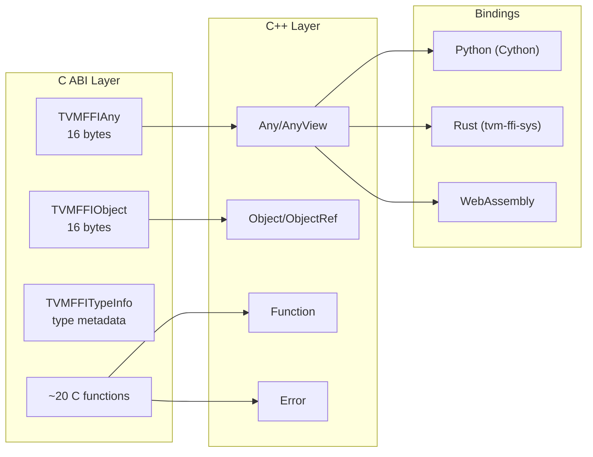

# Stable C ABI

**TL;DR**.
- The C ABI (`c_api.h`) defines the stable binary interface for all cross-language and cross-DLL interactions. All data structures are plain C structs, all functions use C linkage, and error handling uses return codes + TLS.
- The foundational C structs -- `TVMFFIAny` (16-byte value), `TVMFFIObject` (24-byte object header with `uint32` strong/weak reference counts packed first, `type_index` at offset 8), and `TVMFFITypeInfo` (type metadata with `type_ancestors` array) -- define the binary layout. Note: `TVMFFIObject` and `TVMFFIAny` do NOT share a layout prefix (type_index is at different offsets).
- The ABI surface includes ~20 C functions covering object lifecycle (`TVMFFIObjectIncRef`/`TVMFFIObjectDecRef`), function create/call, global registry, error handling, type registration, DLPack tensor interop, and dtype string conversion.

## Problem Statement

### Background
- C++ APIs cannot serve as stable ABIs: name mangling, exception handling, vtable layout, and template instantiation all vary across compilers and platforms.
- FFI systems need a binary interface that works identically across C, C++, Python (via ctypes/Cython), Rust (via FFI), and WebAssembly (via Emscripten).
- The interface must be minimal (few functions) but complete (support the full FFI value system).

### Solution
- A single C header (`c_api.h`) with `extern "C"` linkage defines all cross-boundary types and functions.
- Data layout is fixed: `TVMFFIAny` is exactly 16 bytes (starts with `type_index: int32` at offset 0), `TVMFFIObject` is exactly 24 bytes (starts with `strong_ref_count: uint32` at offset 0, `type_index` at offset 8). These two structs do NOT share a layout prefix.
- Error handling avoids return-value overloading: functions return 0 for success, -1/-2 for error, and the error object is stored/retrieved via TLS functions.

### Goals
- Platform-independent binary layout (Windows, Linux, macOS, WebAssembly).
- Single header dependency for language bindings.
- Minimal function count while covering the full value/object/function/error system.
- Non-goal: backward compatibility with pre-FFI TVM APIs; stable across major version bumps.

## Design



### Key Structs and Layout

```python
class TVMFFIAny:
    """16-byte tagged union: the wire format for all FFI values."""
    # Offset 0: type_index (int32) -- shared with TVMFFIObject
    # Offset 4: union (4 bytes):
    #   zero_padding: uint32   -- must be 0 for non-small-string types
    #   small_str_len: uint32  -- length of inline string (max 7) for kTVMFFISmallStr/kTVMFFISmallBytes
    # Offset 8: union (8 bytes):
    #   v_int64: int64       -- integers, booleans
    #   v_float64: float64   -- floating-point numbers
    #   v_ptr: void*         -- opaque pointers
    #   v_c_str: const char* -- raw C strings (view only)
    #   v_obj: TVMFFIObject* -- ref-counted heap objects
    #   v_dtype: DLDataType  -- data types
    #   v_device: DLDevice   -- devices
    #   v_bytes: char[8]     -- small inline bytes
    #   v_uint64: uint64     -- for hashing
    # Note: v_char32 field removed in c100338
    # Invariant: sizeof(TVMFFIAny) == 16
    # Invariant: type_index at offset 0 matches TVMFFIObject.type_index at offset 0

class TVMFFIObjectDeleterFlagBitMask(IntEnum):
    """Bitmask controlling which deletion actions the deleter should perform."""
    kStrong = 1 << 0   # strong RC hit 0: call destructor
    kWeak = 1 << 1     # weak RC hit 0: free memory block
    kBoth = 0b11       # both hit 0 simultaneously (common single-call path)

class TVMFFIObject:
    """24-byte object header: first field of every heap object."""
    # Offset 0: type_index (int32) -- shared with TVMFFIAny
    # Offset 4: weak_ref_count (uint32) -- weak reference count (uint32 to keep header at 24 bytes)
    # Offset 8: strong_ref_count (uint64) -- main reference count
    # Offset 16: union (8 bytes):
    #   deleter: void(*)(void*, int flags) -- flags: TVMFFIObjectDeleterFlagBitMask (void* since 24125d0)
    #   __ensure_align: int64 -- forces 8-byte alignment
    # Invariant: sizeof(TVMFFIObject) == 24 (was 16 before weak RC support)
    # Invariant: 8-byte aligned via __ensure_align union member
    # Invariant: make_object sets strong_ref_count=1, weak_ref_count=1 at allocation

class TVMFFIByteArray:
    """Byte array used by String and Bytes objects."""
    data: const_char_ptr  # pointer to char data
    size: size_t          # byte length (excludes null terminator for strings)
    # Note: size_t varies between 32/64-bit platforms

class TVMFFIShapeCell:
    """Shape data for Shape objects."""
    data: const_int64_ptr  # pointer to int64 elements
    size: size_t           # number of dimensions

class TVMFFIErrorCell:
    """Error data following TVMFFIObject header."""
    kind: TVMFFIByteArray
    message: TVMFFIByteArray
    traceback: TVMFFIByteArray
    update_traceback: Callable[[TVMFFIObjectHandle, TVMFFIByteArray_ptr], None]

class TVMFFIFunctionCell:
    """Function data following TVMFFIObject header."""
    safe_call: TVMFFISafeCallType
        # int safe_call(void* self, TVMFFIAny* args, int32 num_args, TVMFFIAny* result)

class TVMFFIFieldInfo:
    """Reflection field metadata."""
    name: TVMFFIByteArray
    field_static_type_index: int32     # type index hint for serialization
    readonly: int32                     # boolean flag
    byte_offset: int64                  # offset from Object* to field address
    getter: TVMFFIFieldGetter           # int getter(void* field_addr, TVMFFIAny* result)
    setter: TVMFFIFieldSetter           # int setter(void* field_addr, TVMFFIAny* value)
    # Interacts with: ReflectionDef (C++ builder), TVMFFIRegisterTypeField (C API)

class TVMFFIMethodInfo:
    """Reflection method metadata."""
    name: TVMFFIByteArray
    method: TVMFFIObjectHandle          # Function object (first arg is self)

class TVMFFITypeInfo:
    """Runtime type metadata for the type hierarchy."""
    type_index: int32
    type_depth: int32
    type_key: TVMFFIByteArray
    type_key_hash: uint64              # cached hash for structural hashing
    type_ancestors: int32_ptr          # type_ancestors[depth] = ancestor type_index
    num_fields: int32
    num_methods: int32
    fields: TVMFFIFieldInfo_ptr
    methods: TVMFFIMethodInfo_ptr
    # Interacts with: TVMFFIGetTypeInfo, TVMFFIGetOrAllocTypeIndex
    # Invariant: single-inheritance tree; parent index < child index
```

### C API Functions

```python
# --- Object Lifecycle ---
def TVMFFIObjectDecRef(obj: TVMFFIObjectHandle) -> int:
    """Decrement strong reference count. Calls destructor when strong hits 0; frees when weak also hits 0."""
    # Returns: 0=success, nonzero=error
    # Note: renamed from TVMFFIObjectFree (ca9c3d1)

def TVMFFIObjectIncRef(obj: TVMFFIObjectHandle) -> int:
    """Increment strong reference count (caller must already hold a strong reference)."""
    # Returns: 0=success, nonzero=error

# --- Function System ---
def TVMFFIFunctionCreate(self: void_ptr, safe_call: TVMFFISafeCallType,
                         deleter: Callable, out: TVMFFIObjectHandle_ptr) -> int:
    """Create a Function from C callbacks."""

def TVMFFIFunctionCall(func: TVMFFIObjectHandle, args: TVMFFIAny_ptr,
                       num_args: int32, result: TVMFFIAny_ptr) -> int:
    """Call a Function with packed args."""
    # Invariant: caller must set result.type_index < kTVMFFIStaticObjectBegin

def TVMFFIFunctionSetGlobal(name: TVMFFIByteArray_ptr, f: TVMFFIObjectHandle,
                            allow_override: int) -> int:
    """Register a function in the global registry."""

def TVMFFIFunctionGetGlobal(name: TVMFFIByteArray_ptr,
                            out: TVMFFIObjectHandle_ptr) -> int:
    """Lookup a global function. out=NULL if not found."""

def TVMFFIAnyViewToOwnedAny(any_view: TVMFFIAny_ptr, out: TVMFFIAny_ptr) -> int:
    """Convert a non-owning AnyView to an owning Any (IncRef, promote RawStr, etc.)."""

# --- Error Handling ---
def TVMFFIErrorSetRaised(error: TVMFFIObjectHandle) -> None:
    """Store error in TLS."""

def TVMFFIErrorMoveFromRaised(result: TVMFFIObjectHandle_ptr) -> None:
    """Move error out of TLS, clearing the slot."""

def TVMFFIErrorSetRaisedByCStr(kind: const_char_ptr, message: const_char_ptr) -> None:
    """Convenience: create and set error from C strings."""

def TVMFFIErrorSetRaisedFromCStrParts(kind: const_char_ptr, num_parts: int32,
                                       parts: const_char_ptr_array) -> None:
    """Create and set error from kind + multiple message C string parts concatenated. (550e92f)"""
    # Interacts with: TVMFFIErrorSetRaised

def TVMFFIErrorCreate(kind: TVMFFIByteArray_ptr, message: TVMFFIByteArray_ptr,
                      traceback: TVMFFIByteArray_ptr) -> TVMFFIObjectHandle:
    """Create an error object (does not set in TLS)."""

# Note: TVMFFIEnvCheckSignals and TVMFFIEnvRegisterCAPI moved to extra/c_env_api.h
def TVMFFIEnvCheckSignals() -> int:
    """Check for frontend signals (e.g., Python Ctrl-C). 0=ok, nonzero=signal."""
    # Location: extra/c_env_api.h (was c_api.h)

# --- Type System ---
def TVMFFIGetOrAllocTypeIndex(type_key: TVMFFIByteArray_ptr, static_type_index: int32,
                              type_depth: int32, num_child_slots: int32,
                              child_slots_can_overflow: int32,
                              parent_type_index: int32) -> int32:
    """Register or lookup a type in the global type table."""
    # If static_type_index >= 0: use that index (for core types)
    # If static_type_index == -1: allocate dynamically (for user types)

def TVMFFIGetTypeInfo(type_index: int32) -> TVMFFITypeInfo_ptr:
    """Get type metadata by index."""

def TVMFFITypeKeyToIndex(type_key: TVMFFIByteArray_ptr, out_tindex: int32_ptr) -> int:
    """Convert type key string to type index."""

def TVMFFIRegisterTypeField(type_index: int32, info: TVMFFIFieldInfo_ptr) -> int:
    """Register a reflection field for a type."""

# --- DLPack Tensor Interop (renamed NDArray->Tensor in 3a551d8) ---
def TVMFFITensorFromDLPack(from_: DLManagedTensor_ptr, require_alignment: int32,
                           require_contiguous: int32, out: TVMFFIObjectHandle_ptr) -> int:
    """Create Tensor from DLPack v1 tensor."""
def TVMFFITensorToDLPack(from_: TVMFFIObjectHandle, out: DLManagedTensor_ptr_ptr) -> int:
    """Export Tensor as DLPack v1 tensor."""
def TVMFFITensorFromDLPackVersioned(from_: DLManagedTensorVersioned_ptr, ...) -> int:
    """Create Tensor from DLPack v2 tensor."""
def TVMFFITensorToDLPackVersioned(from_: TVMFFIObjectHandle, ...) -> int:
    """Export Tensor as DLPack v2 tensor."""

# --- String/Bytes Construction (043d9f6) ---
def TVMFFIStringFromByteArray(input_: TVMFFIByteArray_ptr, out: TVMFFIAny_ptr) -> int:
    """Create an owned String from byte array data. May produce SmallStr (SSO) or heap Str."""
    # Invariant: out->type_index must be kTVMFFINone before call

def TVMFFIBytesFromByteArray(input_: TVMFFIByteArray_ptr, out: TVMFFIAny_ptr) -> int:
    """Create an owned Bytes from byte array data. May produce SmallBytes (SSO) or heap Bytes."""
    # Invariant: out->type_index must be kTVMFFINone before call

# --- DLPack Tensor Allocator (f81ab9c, renamed 9829dec, f679fe5) ---
# C-style function pointer typedef (inside extern "C" block):
# Renamed: DLPackTensorAllocator -> DLPackManagedTensorAllocator (9829dec)
# The typedef is no longer in c_api.h; comes from DLPack headers now.
DLPackManagedTensorAllocator = Callable[
    [DLTensor_ptr, DLManagedTensorVersioned_ptr_ptr, void_ptr, SetErrorFn],
    int  # 0 success, -1 failure
]
    # Interacts with: TVMFFIEnvSetDLPackManagedTensorAllocator, TVMFFIEnvGetDLPackManagedTensorAllocator
    # Invariant: must call SetError on failure

# --- DLPackExchangeAPI struct (22a78943, replaces separate DLPack dunder attributes) ---
class DLPackExchangeAPIHeader:
    """Versioned header for DLPack exchange API struct."""
    version: DLPackVersion          # major, minor
    prev_api: Optional[DLPackExchangeAPIHeader_ptr]  # linked-list chain for versioned API extension

class DLPackExchangeAPI:
    """Unified struct bundling 5 function pointers for DLPack exchange. (22a78943)"""
    header: DLPackExchangeAPIHeader
    managed_tensor_allocator: Optional[DLPackManagedTensorAllocator]
    managed_tensor_from_py_object_no_sync: Optional[DLPackManagedTensorFromPyObjectNoSync]
    managed_tensor_to_py_object_no_sync: Optional[DLPackManagedTensorToPyObjectNoSync]
    dltensor_from_py_object_no_sync: Optional[DLPackDLTensorFromPyObjectNoSync]  # non-owning conversion
    current_work_stream: Optional[DLPackCurrentWorkStream]  # explicit stream query
    # Invariant: all function pointers are noexcept (return int error code)
    # Invariant: prev_api enables versioned API chaining
    # Interacts with: __c_dlpack_exchange_api__ dunder attribute (class-level, not instance-level)
    # Replaces: separate __c_dlpack_from_pyobject__, __c_dlpack_to_pyobject__, __c_dlpack_tensor_allocator__ dunders

# --- Opaque Object (91d69f0) ---
def TVMFFIObjectCreateOpaque(handle: void_ptr, type_index: int32,
                              deleter: Callable[[void_ptr], None],
                              out: TVMFFIObjectHandle_ptr) -> int:
    """Create an opaque object with custom deleter. Lifetime managed as Object."""
    # Invariant: type_index must be kTVMFFIOpaquePyObject (74)
    # Invariant: deleter is called exactly once when strong ref count hits 0

class TVMFFIOpaqueObjectCell:
    """Object cell for opaque object, follows TVMFFIObject header."""
    handle: void_ptr  # For Python: PyObject*

def TVMFFIOpaqueObjectGetCellPtr(obj: TVMFFIObjectHandle) -> TVMFFIOpaqueObjectCell_ptr:
    """Get opaque cell pointer from object handle (header-offset arithmetic)."""

# --- Inline Accessors (C++ only, header-defined) ---
def TVMFFIObjectGetTypeIndex(obj: TVMFFIObjectHandle) -> int32: ...
def TVMFFIBytesGetByteArrayPtr(obj: TVMFFIObjectHandle) -> TVMFFIByteArray_ptr: ...
    # Returns pointer at offset sizeof(TVMFFIObject) from obj
def TVMFFIErrorGetCellPtr(obj: TVMFFIObjectHandle) -> TVMFFIErrorCell_ptr: ...
def TVMFFIFunctionGetCellPtr(obj: TVMFFIObjectHandle) -> TVMFFIFunctionCell_ptr: ...
def TVMFFIShapeGetCellPtr(obj: TVMFFIObjectHandle) -> TVMFFIShapeCell_ptr: ...
def TVMFFITensorGetDLTensorPtr(obj: TVMFFIObjectHandle) -> DLTensor_ptr: ...
def TVMFFIOpaqueObjectGetCellPtr(obj: TVMFFIObjectHandle) -> TVMFFIOpaqueObjectCell_ptr: ...
    # All cell accessors use: (char*)obj + sizeof(TVMFFIObject)
```

### Contracts, Assumptions and Invariants
- **Struct size invariants**: `sizeof(TVMFFIAny) == 16`, `sizeof(TVMFFIObject) == 24`. Both are platform-independent and enforced by `static_assert`. The shared `type_index` at offset 0 enables aliasing. TVMFFIObject grew from 16 to 24 bytes to accommodate split strong/weak reference counts (`ca9c3d1`).
- **Cell layout contract**: For typed objects (String, Error, Function, Shape, NDArray), the type-specific data ("cell") begins immediately after the `TVMFFIObject` header at offset 24 (was 16). All cell accessors use `(char*)obj + sizeof(TVMFFIObject)`.
- **Visibility macro**: `TVM_FFI_DLL` controls symbol visibility. On Windows: `__declspec(dllexport/dllimport)`. On Unix: `__attribute__((visibility("default")))`. On Emscripten: `EMSCRIPTEN_KEEPALIVE`.
- **Return code convention**: All C API functions that can fail return `int` (0=success, -1=error in TLS, -2=frontend error). Exceptions: `TVMFFIErrorSetRaised` and `TVMFFIErrorMoveFromRaised` are void (used in the error handling path itself), `TVMFFIErrorCreate` returns the handle directly, `TVMFFIGetOrAllocTypeIndex` returns the type index directly.
- **TVMFFIByteArray platform variance**: `size_t` is 4 bytes on 32-bit and 8 bytes on 64-bit platforms. Bindings must account for this when computing struct offsets.
- **Traceback function**: `TVMFFITraceback(filename, lineno, func, cross_ffi_boundary)` returns a `const TVMFFIByteArray*` to a TLS-allocated string. The 4th parameter `cross_ffi_boundary` (int) controls whether traceback stops at FFI boundary (0) or crosses it (1). The pointer is valid until the next call to `TVMFFITraceback` on the same thread.

### Extension Points
- **Environment registration**: `TVMFFIEnvRegisterCAPI(name, symbol)` (in `extra/c_env_api.h`) allows language bindings to register C-level symbols (e.g., Python's `PyErr_CheckSignals`) for use by the FFI runtime. Signature uses `const char*` for name (changed from `TVMFFIByteArray*`).
- **Stream context**: `TVMFFIEnvSetStream`/`TVMFFIEnvGetStream` (in `extra/c_env_api.h`) provide per-device, per-thread stream tracking via `TVMFFIStreamHandle` (opaque `void*`). Backed by thread-local `EnvContext` class (renamed from `StreamContext` in `f81ab9c`).
- **Tensor allocator context**: `TVMFFIEnvSetDLPackManagedTensorAllocator`/`TVMFFIEnvGetDLPackManagedTensorAllocator` (in `extra/c_env_api.h`, renamed from `TVMFFIEnvSetTensorAllocator`/`TVMFFIEnvGetTensorAllocator` in `f679fe5`) enable C++ library code to allocate tensors using the caller's framework allocator. `TVMFFIEnvTensorAlloc` (`f679fe5`) provides a high-level allocation path that returns a fully-constructed `ffi::Tensor` (not raw `DLManagedTensorVersioned`), keeping metadata allocation inside `libtvm_ffi` to avoid module unloading order problems.
- **Version query API**: Compile-time macros `TVM_FFI_VERSION_MAJOR`/`MINOR`/`PATCH` and runtime `TVMFFIGetVersion(out: TVMFFIVersion*)` function (`f0058a9`) enable libraries to query the linked FFI version. `TVMFFIVersion` is a 12-byte struct of 3x `uint32_t`.
- **Module-scoped env APIs**: Module-related C API symbols use `TVMFFIEnvMod*` prefix: `TVMFFIEnvModLookupFromImports`, `TVMFFIEnvModRegisterContextSymbol`, `TVMFFIEnvModRegisterSystemLibSymbol` (all in `extra/c_env_api.h`). See design record 0011.
- **Small string C accessor**: `TVMFFISmallBytesGetContentByteArray(value)` extracts byte array from inline small string/bytes values.
- **DLPack versioning**: Both v1 (`DLManagedTensor`) and v2 (`DLManagedTensorVersioned`) are supported for Tensor interop, enabling compatibility with older and newer DLPack consumers.
- **Opaque PyObject protocol**: `kTVMFFIOpaquePyObject` (74) is the first "foreign object" kind in the type index enum. `TVMFFIObjectCreateOpaque` creates lifecycle-managed opaque objects with a custom deleter, enabling arbitrary `PyObject*` round-tripping through the FFI.
- **DataType string conversion**: `TVMFFIDataTypeFromString`/`TVMFFIDataTypeToString` provide portable dtype printing for all languages.

### Usage Examples

#### Calling FFI from a C binding
**Context**: A C-only binding (no C++) that creates a function and calls it through the C ABI.
```c
// Create a function from C callbacks
int my_add(void* self, const TVMFFIAny* args, int32_t num_args, TVMFFIAny* result) {
  result->type_index = kTVMFFIInt;
  result->v_int64 = args[0].v_int64 + args[1].v_int64;
  return 0;  // success
}

TVMFFIObjectHandle func;
TVMFFIFunctionCreate(NULL, my_add, NULL, &func);

// Register globally
TVMFFIByteArray name = {"my.add", 6};
TVMFFIFunctionSetGlobal(&name, func, 0);

// Call it
TVMFFIAny args[2] = {{.type_index = kTVMFFIInt, .v_int64 = 3},
                      {.type_index = kTVMFFIInt, .v_int64 = 4}};
TVMFFIAny result = {.type_index = kTVMFFINone};
int ret = TVMFFIFunctionCall(func, args, 2, &result);
// ret == 0, result.v_int64 == 7

TVMFFIObjectDecRef(func);
```

## Alternatives & Trade-offs
### C++ ABI with extern "C" wrappers (rejected)
- Pros: Richer API possible; templates and overloads.
- Cons: C++ ABI is not stable across compilers; name mangling varies; exceptions cannot cross ABI boundary.

### Protocol Buffers / FlatBuffers for value exchange (rejected)
- Pros: Well-defined schemas; language-independent serialization.
- Cons: Serialization/deserialization overhead on every function call; unnecessary for in-process communication; no zero-copy for tensors.

## Related Work
### Design Records
- `0001-any-anyview-value-system.md` -- TVMFFIAny is the C ABI representation of Any/AnyView
- `0002-object-system.md` -- TVMFFIObject is the C ABI representation of the object header
- `0003-function-system.md` -- TVMFFISafeCallType and TVMFFIFunctionCell define function objects at C level
- `0004-error-propagation.md` -- TVMFFIErrorCell, TVMFFIErrorSetRaised, TVMFFIErrorMoveFromRaised
- `0006-containers.md` -- TVMFFIByteArray, TVMFFIShapeCell define container data layouts
- `0008-reflection.md` -- TVMFFIFieldInfo, TVMFFIMethodInfo, TVMFFIRegisterTypeField

### Evidence Matrix
- TVMFFIAny/TVMFFIObject 16-byte layout -> `commits/2025-05-06-7d34eb8abfe987bf0031e4d4ff479895d867a966.md` + `7d34eb8` + `TVMFFIAny`, `TVMFFIObject`
- C API function surface -> `commits/2025-05-06-7d34eb8abfe987bf0031e4d4ff479895d867a966.md` + `7d34eb8` + `TVMFFIFunctionCall`, `TVMFFIFunctionSetGlobal`
- Cell layout pattern -> `commits/2025-05-06-7d34eb8abfe987bf0031e4d4ff479895d867a966.md` + `7d34eb8` + `TVMFFIBytesGetByteArrayPtr`, `TVMFFIErrorGetCellPtr`
- DLPack interop -> `commits/2025-05-06-7d34eb8abfe987bf0031e4d4ff479895d867a966.md` + `7d34eb8` + `TVMFFINDArrayFromDLPack`, `TVMFFINDArrayToDLPack`
- SSO layout: zero_padding/small_str_len union -> `commits/2025-08-04-49e2ed4a...md` + `49e2ed4` + `TVMFFISmallBytesGetContentByteArray`
- Stream context C API -> `commits/2025-08-19-0daaffed...md` + `0daaffed` + `TVMFFIEnvSetStream`, `TVMFFIEnvGetCurrentStream`
- Env/module C API relocation and renaming -> `commits/2025-08-20-023ea448...md` + `023ea44` + `TVMFFIEnvMod*` prefix
- Weak RC, 24-byte header, flag-based deleter, TVMFFIObjectDecRef/IncRef -> `commits/2025-09-01-ca9c3d10...md` + `ca9c3d1` + `TVMFFIObjectDeleterFlagBitMask`, `WeakObjectPtr`
- Static object enum reorder, allow_override rename, GetFunctionMetadata -> `commits/2025-08-30-777cf8d5...md` + `777cf8d` + `TVMFFIStaticObjectKind`
- TVMFFITraceback cross_ffi_boundary parameter -> `commits/2025-08-24-2d41a511...md` + `2d41a51` + `TVMFFITraceback`
- NDArray->Tensor rename in C ABI -> `commits/2025-09-06-3a551d83...md` + `3a551d8` + `TVMFFITensorFromDLPack`, `kTVMFFITensor`
- OpaquePyObject support, TVMFFIObjectCreateOpaque -> `commits/2025-09-05-91d69f06...md` + `91d69f0` + `kTVMFFIOpaquePyObject`, `TVMFFIOpaqueObjectCell`
- FObjectDeleter void* signature -> `commits/2025-09-07-24125d0a...md` + `24125d0` + `FObjectDeleter`
- TVMFFIStringFromByteArray/TVMFFIBytesFromByteArray, constructor call path -> `commits/2025-09-13-043d9f64...md` + `043d9f6` + `TVMFFIStringFromByteArray`
- DLPackTensorAllocator, EnvContext, TVMFFIEnvSetTensorAllocator -> `commits/2025-09-12-f81ab9c2...md` + `f81ab9c` + `DLPackTensorAllocator`, `EnvContext`
- v_char32 removal, tvm-ffi-config --cflags -> `commits/2025-09-14-c100338d...md` + `c100338` + `TVMFFIAny`
- Plus 5 supporting commits: `db98729` (stream protocol), `4dee97f` (DLPack rename), `38d2cda` (setter refactor), `315f4bb` (SystemLib fix), `7b813f8` (static init block)
- DLPackExchangeAPI struct, __c_dlpack_exchange_api__ dunder -> `commits/2025-10-11-22a78943...md` + `22a78943` + `DLPackExchangeAPI`, `__c_dlpack_exchange_api__`
- TVMFFIErrorSetRaisedFromCStrParts -> `commits/2025-10-13-550e92fc...md` + `550e92f` + `TVMFFIErrorSetRaisedFromCStrParts`
- DLPackTensorAllocator -> DLPackManagedTensorAllocator rename -> `commits/2025-10-15-9829dec9...md` + `9829dec` + `DLPackManagedTensorAllocator`
- Tensor allocator C API rename + TVMFFIEnvTensorAlloc + Tensor::FromEnvAlloc -> `commits/2025-10-16-f679fe54...md` + `f679fe5` + `TVMFFIEnvTensorAlloc`, `Tensor::FromEnvAlloc`
- Version query API (TVMFFIGetVersion, TVMFFIVersion, version macros) -> `commits/2025-10-18-f0058a9e...md` + `f0058a9` + `TVMFFIGetVersion`, `TVM_FFI_VERSION_MAJOR`
