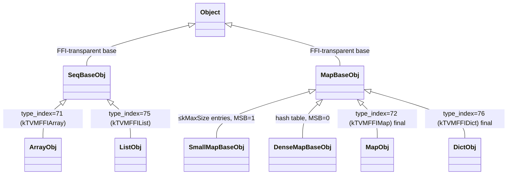

# Container Library — Array, List, Map, Dict, String, Bytes, Shape, Tensor, Tuple, Variant

**TL;DR**
- TVM FFI provides ten container types with fixed static type indices. `Array<T>` (index 71) and `Map<K,V>` (index 72) are immutable/copy-on-write. `List<T>` (index 75) and `Dict<K,V>` (index 76) are their mutable, shared-reference siblings introduced in commits 9513c2f8 and c1af3b33. `String` and `Bytes` are value types backed by `details::BytesBaseCell` with small-string optimization. `Tensor` embeds `DLTensor` inline for zero-copy DLPack interop.
- The immutable/mutable pair idiom: `Array` copies on write; `List` mutates in-place on the shared `ListObj`. `Map` copies on write; `Dict` mutates in-place via `MapBaseObj::InplaceSwitchTo`. Both mutable types accept the immutable type as a secondary type index (`kOtherTypeIndex`) enabling cross-conversion.
- `SeqBaseObj` (commit 9513c2f8) and `MapBaseObj` (commit 5a6b2116) are FFI-transparent shared bases holding all sequence and map implementation respectively; concrete subtypes (`ArrayObj`, `ListObj`, `MapObj`, `DictObj`) inherit and provide only the `type_index`. Factory methods for maps are templatized on `MapObjType`.
- `MISSING` sentinel (formerly `ffi.MapGetMissingObject`) renamed to `ffi.GetInvalidObject` in commit 86c4042d and relocated from `container.py` to `core.pyx` for earlier initialization.

## Problem Statement

### Background
ML frameworks need to pass structured data (lists of shapes, maps of named arguments, tensors) through the FFI without re-boxing every value. The prior TVM design had separate list/map types for packed args vs. IR nodes. This design unifies them: the same `Array<T>` works as a function argument, an IR attribute, and a Python list.

### Solution
Eight container types are built on the same `Object`/`ObjectRef` foundation. They share the `TVMFFIAny` representation (their type indices are in the static range) so they can appear directly in `Any` without boxing overhead. Each container stores `Any` elements internally, but `Array<T>` enforces that all elements satisfy `TypeTraits<T>::CheckAnyStrict`.

### Goals
- Uniform: containers are `ObjectRef` values — passable as `Any` like any other object.
- Zero-copy DLPack: `NDArray` wraps a `DLTensor` at a fixed byte offset; no data copy needed.
- Type-safe containers: `Array<T>` / `Variant<T...>` enforce element types at insertion time.
- Non-goal: mutable in-place update for `Array` or `Map` (use `List`/`Dict` for mutability — provided by the Python layer).

## Design

### Container Type Index Summary

```python
# All containers: type_index ∈ [kTVMFFIStaticObjectBegin=64, ...]
kTVMFFIStr      = 65  # String:  TVMFFIObject + TVMFFIByteArray + char data[] (inline)
kTVMFFIBytes    = 66  # Bytes:   TVMFFIObject + TVMFFIByteArray + byte data[] (inline)
kTVMFFIError    = 67  # Error:   TVMFFIObject + TVMFFIErrorCell
kTVMFFIFunction = 68  # Function: TVMFFIObject + TVMFFIFunctionCell
# Reordered in commit 777cf8d: simple C-ABI objects (Shape, NDArray) now precede complex C++ objects (Array, Map)
# Before reorder (pre-777cf8d): Array=69, Map=70, Shape=71, NDArray=72
kTVMFFIShape    = 69  # Shape:   TVMFFIObject + TVMFFIShapeCell{int64_t*, size_t}
kTVMFFITensor   = 70  # Tensor (was NDArray before commit 3a551d8): TVMFFIObject + DLTensor (inline, not ptr)
kTVMFFIArray    = 71  # Array<T>: TVMFFIObject + TVMFFISeqCell{data*, size, capacity, data_deleter}
kTVMFFIMap      = 72  # Map<K,V>: TVMFFIObject + map internals (via MapBaseObj)
kTVMFFIModule   = 73  # Module:  TVMFFIObject + module internals
kTVMFFIOpaquePyObject = 74  # OpaquePyObject: wraps arbitrary Python objects
kTVMFFIList     = 75  # List<T>: TVMFFIObject + TVMFFISeqCell{data*, size, capacity, data_deleter}
                       # Added in commit 9513c2f8; type_key = "ffi.List"
kTVMFFIDict     = 76  # Dict<K,V>: TVMFFIObject + MapBaseObj internals
                       # Added in commit c1af3b33; type_key = "ffi.Dict"
# Type keys: all built-in containers use "ffi.*" prefix
# e.g., "ffi.Array", "ffi.List", "ffi.Map", "ffi.Dict", "ffi.String", "ffi.Tensor"

# Python ABC mapping (as of commit 778613316):
# Array  -> collections.abc.Sequence        (immutable, CoW)
# List   -> collections.abc.MutableSequence (mutable, shared-ref)
# Map    -> collections.abc.Mapping         (immutable, CoW)
# Dict   -> collections.abc.MutableMapping  (mutable, shared-ref)
```

### Key Classes, Fields and Interfaces

```python
class BytesBaseCell:
    """Internal backing cell for String and Bytes (details:: namespace).
    Dual small/large storage: strings ≤7 bytes stored on-stack; longer strings are heap-allocated.
    NOT for direct use — access only via String/Bytes public API.
    """
    data_: TVMFFIAny  # Invariant: type_index ∈ {kTVMFFINone, kTVMFFISmallStr=11, kTVMFFIStr=65,
                      #                           kTVMFFISmallBytes=12, kTVMFFIBytes=66}
    # kTVMFFINone = null/uninitialized — used by Optional<String/Bytes> to represent nullopt

    def data(self) -> const char*:
        # small path (11/12): returns data_.v_bytes (inline in TVMFFIAny)
        # large path (65/66): returns TVMFFIBytesGetByteArrayPtr(data_.v_obj)->data
    def size(self) -> size_t:
        # small path: returns data_.small_str_len
        # large path: returns TVMFFIBytesGetByteArrayPtr(data_.v_obj)->size

    kMaxSmallBytesLen: int = 7  # sizeof(int64_t) - 1

    def InitSpaceForSize(self, size: int, small_type_index: int, large_type_index: int) -> char*:
        """Choose small or large path; return pointer for caller to write content."""
    def InitFromStd(self, other: std.string, large_type_index: int) -> None:
        """Move from std::string; always produces heap-backed form (BytesObjStdImpl)."""
    # Interacts with: TypeTraits<String>, TypeTraits<Bytes>, Optional<String/Bytes>


class String:
    """Immutable UTF-8 string. VALUE TYPE — not ObjectRef (since commit 49e2ed4).
    Small strings (≤7 bytes) are on-stack; large strings heap-allocate StringObj (kTVMFFIStr=65).
    Heap objects still accessible from C via TVMFFIBytesGetByteArrayPtr(handle).
    Internal heap types: details::StringObj, details::BytesObjBase (commit f9d2bff8).
    """
    data_: BytesBaseCell  # private; default-init = kTVMFFISmallStr, small_str_len=0

    def data(self) -> const char*: ...   # null-terminated, valid for object lifetime
    def c_str(self) -> const char*: ...  # alias for data()
    def size(self) -> size_t: ...
    def length(self) -> size_t: ...      # alias for size()
    def __init__(self) -> None: ...      # empty string, on-stack (kTVMFFISmallStr, len=0)
    def __init__(self, s: const char*) -> None: ...  # chooses small or large path
    def __init__(self, ba: TVMFFIByteArray) -> None: ...  # avoids intermediate std::string copy
    def __init__(self, other: std.string&&) -> None: ...  # always large (BytesObjStdImpl)
    def __eq__(self, other: str) -> bool: ...   # content equality, not pointer equality

    # Search and substring API (commit bd12b26a):
    npos: ClassVar[int] = static_cast[size_t](-1)  # sentinel for "not found"

    def find(self, s: String | str, pos: size_t = 0) -> size_t:
        """Find first occurrence of s starting at pos. Returns npos if not found.
        Delegates to std::string_view::find (zero-copy).
        """
        # Invariant: returns npos (size_t(-1)) when not found — NOT -1 as signed int
        # Interacts with: std::string_view::find (computed from BytesBaseCell data/size)

    def find(self, s: const char*, pos: size_t, count: size_t) -> size_t:
        """Find first occurrence of s[0:count] starting at pos."""

    def substr(self, pos: size_t = 0, count: size_t = npos) -> String:
        """Return new String with content [pos, pos+count). Throws std::out_of_range if pos > size().
        count is clamped to remaining length if pos+count > size().
        """
        # Invariant: pos <= size() required; throws std::out_of_range otherwise
        # Invariant: result is a fresh String (small or large path based on result length)
        # Interacts with: BytesBaseCell.InitSpaceForSize (allocates result storage)

    # Interacts with: BytesBaseCell, TypeTraits<String>, Optional<String>, AnyHash, AnyEqual
    # Invariant: TypeTraits<String>::field_static_type_index == kTVMFFIAny (not kTVMFFIStr)
    #            because the type may be either small or large in any given TVMFFIAny
    # Extension: TypeTraits<const char*>.TryCastFromAnyView handles kTVMFFIStr/SmallStr → raw str


class Bytes:
    """Arbitrary byte array. VALUE TYPE — not ObjectRef (since commit 49e2ed4).
    Same small/large dual layout as String; differs only in type index (12 vs 11 for small,
    66 vs 65 for large).
    """
    data_: BytesBaseCell  # default-init = kTVMFFISmallBytes

    def data(self) -> const char*: ...
    def size(self) -> size_t: ...
    def memequal(self, other: Bytes) -> bool:
        """Byte-by-byte equality comparison. Used in structural eq for Bytes values."""
        # Interacts with: StructEqualHandler::CompareAny (kTVMFFIBytes/kTVMFFISmallBytes branch)


class Optional_String:
    """Optional<String> specialization: null state is kTVMFFINone inside BytesBaseCell,
    NOT a separate bool flag (unlike ObjectRef-based Optional).
    """
    data_: String  # BytesBaseCell with type_index == kTVMFFINone signals nullopt
    def has_value(self) -> bool: ...
    def value(self) -> String: ...  # raises if null
    def value_or(self, default: String) -> String: ...
    # Interacts with: BytesBaseCell(std::nullopt) initialization


class ShapeView:
    """NEW (commit 8ca0719f): Non-owning view over a contiguous int64_t shape array.
    Backed by TVMFFIShapeCell{const int64_t*, size_t}. No heap allocation.
    Use in preference to Shape when only reading shape data.
    """
    # Constructors:
    # ShapeView()                                    — empty (nullptr, 0)
    # ShapeView(const int64_t* data, size_t size)   — from raw pointer + size
    # ShapeView(std::initializer_list<int64_t>)      — from literal list
    # ShapeView(Shape)                               — implicit conversion (Shape → ShapeView)

    def data(self) -> const int64_t*: ...
    def size(self) -> size_t: ...
    def __getitem__(self, idx: size_t) -> int64_t: ...  # unchecked
    def at(self, idx: size_t) -> int64_t: ...           # bounds-checked; raises IndexError on OOB
    def begin(self) -> const int64_t*: ...
    def end(self) -> const int64_t*: ...
    def empty(self) -> bool: ...
    def front(self) -> int64_t: ...
    def back(self) -> int64_t: ...
    def Product(self) -> int64_t: ...  # product of all dims; used for Tensor.numel()
    # Invariant: data pointer is borrowed — caller must ensure backing array outlives ShapeView
    # Interacts with: Shape (implicit conversion Shape→ShapeView via operator ShapeView()),
    #                 FillStridesFromShape, Shape::StridesFromShape,
    #                 TensorObjFromNDAlloc, TensorObjFromDLPack, Tensor::shape(), Tensor::strides()
    # Extension: pass ShapeView anywhere a read-only shape sequence is needed


class Shape(ObjectRef):
    """Immutable integer shape (for tensor dimensions).
    Layout: TVMFFIObject (24B) | TVMFFIShapeCell{const int64_t*, size_t} | int64_t data[]
    Accessible from C via TVMFFIShapeGetCellPtr(handle).
    Implicit conversion to ShapeView via operator ShapeView().
    """
    def __init__(self, other: ShapeView) -> None: ...  # construct from view (copies data); NEW commit 8ca0719f
    def __cast_to_ShapeView__(self) -> ShapeView: ...  # implicit; operator ShapeView()

    def __getitem__(self, i: int) -> int64_t: ...  # unchecked (bounds check removed in commit 8ca0719f)
    def at(self, i: int) -> int64_t: ...           # bounds-checked
    def size(self) -> size_t: ...
    def data(self) -> const int64_t*: ...
    # Invariant: data pointer is contiguous int64_t array, valid for object lifetime

    @staticmethod
    def StridesFromShape(shape: ShapeView) -> Shape:
        # NEW signature (commit 8ca0719f): accepts ShapeView (was raw pointer + ndim)
        # Computes C-order strides: strides[ndim-1]=1, strides[i]=strides[i+1]*shape[i+1]
        ...

    # Interacts with: ShapeView (implicit cast), FillStridesFromShape, TensorObj tail allocation


def FillStridesFromShape(shape: ShapeView, out_strides: int64_t*) -> None:
    """NEW (commit 8ca0719f): Fill pre-allocated strides buffer from ShapeView (C-order, last dim=1).
    # Invariant: out_strides must point to a buffer of at least shape.size() int64_t elements
    # Interacts with: TensorObjFromNDAlloc, TensorObjFromDLPack (tail-alloc path)
    """


class TensorObj(Object, DLTensor):
    """Private storage backing Tensor. DLTensor is embedded inline at offset 24.
    CHANGED LAYOUT (commit 8ca0719f): shape_data_, strides_data_, cached_dl_managed_tensor_versioned_ REMOVED.
    Shape and strides are now stored inline in a tail allocation immediately after the concrete subclass.
    Destructor removed (was needed only for cached_dl_managed_tensor_versioned_).
    """
    # REMOVED fields (pre-8ca0719f):
    #   shape_data_: Optional[Shape]   — lazy-cached owning Shape for DLTensor::shape
    #   strides_data_: Optional[Shape] — lazy-cached owning Shape for DLTensor::strides
    #   cached_dl_managed_tensor_versioned_: atomic[DLManagedTensorVersioned*] — cached DLPack export
    #
    # NEW layout invariant:
    #   TensorObjFromNDAlloc<A>:
    #     alloc = make_inplace_array_object<TensorObjFromNDAlloc<A>, int64_t>(ndim * 2, ...)
    #     DLTensor::shape   → tail bytes [sizeof(Self), sizeof(Self) + ndim * 8)
    #     DLTensor::strides → tail bytes [sizeof(Self) + ndim * 8, sizeof(Self) + ndim * 16)
    #   TensorObjFromDLPack<T> with strides==nullptr:
    #     alloc = make_inplace_array_object<TensorObjFromDLPack<T>, int64_t>(ndim, ...)
    #     DLTensor::strides → tail bytes [sizeof(Self), sizeof(Self) + ndim * 8)
    # Invariant: DLTensor::shape and DLTensor::strides always point into the object's own tail memory
    # Interacts with: make_inplace_array_object<T, int64_t>(num_extra, ...) for tail allocation
    _type_key: str = "ffi.Tensor"  # was "ffi.NDArray" before commit 3a551d8

class Tensor(ObjectRef):
    """N-dimensional array with DLPack interop. Renamed from NDArray in commit 3a551d8.
    Layout: TVMFFIObject (24B) | DLTensor (inline, not a pointer!) | tail int64_t[]
    Accessible from C via TVMFFITensorGetDLTensorPtr(handle) -> DLTensor*.
    API MIGRATION (commit 0dcd4d2): operator->() removed; all access is via typed methods.
    TVM_FFI_DEFINE_OBJECT_REF_METHODS_NULLABLE macro replaced by inline explicit ctors.
    """
    # Constructors (explicit, replacing macro expansion — commit 0dcd4d2):
    def __init__(self) -> None: ...                             # default (null)
    def __init__(self, n: ObjectPtr[TensorObj]) -> None: ...    # from ObjectPtr
    def __init__(self, tag: UnsafeInit) -> None: ...            # UnsafeInit escape hatch
    # _type_is_nullable: bool = True (constexpr)

    # ─── Named accessor methods (replace operator->() dereference) ───
    def data_ptr(self) -> void*: ...      # DLTensor::data (commit 8ca0719f)
    def ndim(self) -> int32_t: ...        # DLTensor::ndim (commit 8ca0719f)
    def dtype(self) -> DLDataType: ...    # DLTensor::dtype
    def device(self) -> DLDevice: ...     # DLTensor::device (commit 0dcd4d2: was only via operator->())
    def shape(self) -> ShapeView:
        """Non-owning view into tail-allocated shape int64_t[]. Commit 8ca0719f: was -> Shape (lazy-cached)."""
        # Invariant: valid for the Tensor's lifetime but NOT beyond
        ...
    def strides(self) -> ShapeView:
        """Non-owning view into tail-allocated strides int64_t[]. Commit 8ca0719f: was -> Shape (lazy-cached)."""
        # Invariant: DLTensor::strides may be nullptr iff ndim == 0 (DLPack spec allows this; fix commit 4fefeb0f)
        # Returns ShapeView(nullptr, 0) when ndim == 0 — safe to use as empty view
        # Invariant: valid for the Tensor's lifetime but NOT beyond
        ...

    # ─── Per-index accessors (commit 0dcd4d2; signature updated commit 573d76f2) ───
    def size(self, idx: int64_t) -> int64_t: ...
        # Changed from size_t to int64_t (commit 573d76f2): supports negative indexing
        # idx < 0 wraps: shape[ndim + idx], e.g., size(-1) = last dimension
        # Invariant: -ndim <= idx < ndim; throws IndexError for out-of-bounds (commit e54d15d7)
        # Pre-e54d15d7: OOB idx silently accessed invalid memory (UB). Now always raises IndexError.
    def stride(self, idx: int64_t) -> int64_t: ...
        # Changed from size_t to int64_t (commit 573d76f2): supports negative indexing
        # idx < 0 wraps: strides[ndim + idx]
        # Invariant: -ndim <= idx < ndim; throws IndexError for out-of-bounds (commit e54d15d7)
    def byte_offset(self) -> uint64_t: ...         # get()->byte_offset
    def numel(self) -> int64_t: ...                # shape().Product() (commit 8ca0719f)

    # ─── Aten-style aliases (commit 573d76f2) ───
    def dim(self) -> int32_t: ...          # alias for ndim(); mirrors torch.Tensor.dim()
    def sizes(self) -> ShapeView: ...      # alias for shape(); mirrors torch.Tensor.sizes()
    def is_contiguous(self) -> bool: ...   # alias for IsContiguous(); mirrors torch.Tensor.is_contiguous()
    # Interacts with: DSL code expecting torch-compatible tensor API surface

    # ─── Escape hatch for DLPack interop ───
    def GetDLTensorPtr(self) -> const DLTensor*: ...  # replaces operator->(); for DLPack interop only
    # Invariant: prefer named accessors in new code; GetDLTensorPtr is for legacy/interop paths

    def IsContiguous(self) -> bool: ...
    def IsAligned(self, alignment: int) -> bool:
        """True if data pointer is aligned to `alignment` bytes. Added in commit 1b824e8."""
        ...

    @staticmethod
    def FromDLPack(tensor: DLManagedTensor*, require_alignment: int = 0,
                   require_contiguous: bool = False) -> Tensor:
        # TVMFFITensorFromDLPack: adopts ownership; if src strides==nullptr, computes + tail-stores strides
        # (commit 8ca0719f: strides stored inline instead of in strides_data_ Optional<Shape>)
        ...
    def ToDLPack(self) -> DLManagedTensor*:
        # TVMFFITensorToDLPack: creates a fresh DLManagedTensor each call (no caching)
        # Commit 8ca0719f: removed cached_dl_managed_tensor_versioned_ CAS caching; each call allocates fresh
        ...
    @staticmethod
    def FromDLPackVersioned(tensor: DLManagedTensorVersioned*, require_alignment: int = 0,
                            require_contiguous: bool = False) -> Tensor: ...

    # ─── Strided view / strided allocation (commit 8888eb4b) ─────────────────
    def as_strided(
        self,
        shape: ShapeView,
        strides: ShapeView,
        element_offset: Optional[int64_t] = None,  # std::nullopt → 0
    ) -> Tensor:
        """Return a new Tensor sharing this tensor's data buffer with custom shape/strides/offset.
        Uses ViewNDAlloc: an NDAlloc whose AllocData is a no-op (shares source buffer)
        and which keeps the source Tensor alive via an ObjectPtr<TensorObj>.

        # Invariant: element_offset >= 0 (ICHECK_GE); units = dtype elements, not bytes
        # Invariant: for direct-address devices (CPU, CUDA managed, ROCm): byte_offset is folded
        #            into data pointer and set to 0; for non-direct-address: byte_offset retained
        # Invariant: caller is responsible that element_offset + shape[i]*stride[i] stays in buffer bounds
        # Interacts with: TVMFFITensorCreateUnsafeView (C ABI entry point, called internally)
        # Interacts with: IsDirectAddressDevice (decides byte_offset folding)
        # Interacts with: GetDataSize (converts element_offset to byte_offset)
        """

    @staticmethod
    def FromNDAllocStrided(
        alloc: TNDAlloc,
        shape: ShapeView,
        strides: ShapeView,
        dtype: DLDataType,
        device: DLDevice,
        *extra_args,
    ) -> Tensor:
        """Allocate a new Tensor with custom strides (e.g., column-major).
        # Invariant: shape.size() == strides.size() (ValueError otherwise)
        # Interacts with: TensorObjFromNDAlloc<TNDAlloc> prototype-taking constructor
        # Interacts with: make_inplace_array_object<TensorObjFromNDAlloc<A>, int64_t>(ndim*2, ...)
        """

    # Invariant: shape()/strides() return views into tail memory; valid for Tensor's lifetime
    # Invariant: callers that previously stored shape() as Shape still compile (implicit Shape(ShapeView) ctor)
    #            but must NOT use the Shape after the Tensor is destroyed (dangling ShapeView)
    # Interacts with: TypeTraits<Tensor> (type index kTVMFFITensor=70), kTVMFFITensor (ABI tag)
    # Interacts with: ShapeView (returned by shape/strides), make_inplace_array_object


class TensorView:
    """Non-owning view of a DLTensor (commit 1ec6236). Stores a BY-VALUE copy of DLTensor struct.
    Stack-allocated: no heap allocation, no ref-count. Recommended argument type for kernel ops.
    Wire type index: kTVMFFIDLTensorPtr = 7 (same as raw DLTensor*).
    TypeTraits<TensorView>: storage_enabled = False (convert-only, NOT storable in Any).
    """
    tensor_: DLTensor  # by-value copy of the DLTensor struct; NOT a pointer
    # Invariant: tensor_.data, tensor_.shape, tensor_.strides MUST outlive this TensorView
    # Invariant: tensor_ is a valid DLTensor at construction time (ICHECK at construction)
    # Invariant: strides may be nullptr iff ndim == 0 (DLPack spec; fix commit 4fefeb0f)
    # NOT promotable to owning Tensor — Tensor&& constructor is deleted

    def __init__(self, tensor: Tensor) -> None:
        # ICHECK(tensor.defined()); copies the DLTensor struct from Tensor's TensorObj
        ...
    def __init__(self, tensor: "DLTensor*") -> None:
        # ICHECK(tensor != nullptr); copies the DLTensor struct value
        ...
    # Tensor&& (rvalue from owned Tensor) = delete — prevents accidental dangling views

    def shape(self) -> ShapeView: ...
    def strides(self) -> ShapeView:
        # Invariant: strides may be nullptr iff ndim == 0 (fix commit 4fefeb0f)
        # Returns ShapeView(nullptr, 0) for zero-ndim tensors
        ...
    def data_ptr(self) -> void*: ...
    def ndim(self) -> int: ...
    def dtype(self) -> DLDataType: ...
    def device(self) -> DLDevice: ...             # commit 0dcd4d2: was only via operator->()
    def size(self, idx: size_t) -> int64_t: ...   # tensor_.shape[idx] (commit 0dcd4d2)
        # Invariant: -ndim <= idx < ndim; throws IndexError for OOB (commit e54d15d7)
    def stride(self, idx: size_t) -> int64_t: ... # tensor_.strides[idx] (commit 0dcd4d2)
        # Invariant: -ndim <= idx < ndim; throws IndexError for OOB (commit e54d15d7)
    def byte_offset(self) -> uint64_t: ...        # tensor_.byte_offset (commit 0dcd4d2)
    def numel(self) -> int64_t: ...               # shape().Product() (commit 0dcd4d2)
    def IsContiguous(self) -> bool: ...

    # REMOVED (commit 0dcd4d2): const DLTensor* operator->() const — eliminated entirely for TensorView
    # Replacement in TypeTraits<TensorView>::CopyToAnyView: was src.operator->(), now &(src.tensor_)
    # tensor_ field accessed via 'friend struct TypeTraits<TensorView, ...>'

    # TypeTraits<TensorView> specialization:
    # field_static_type_index = kTVMFFIDLTensorPtr = 7
    # storage_enabled = False   — cannot be stored in Any (no MoveToAny/MoveFromAny)
    # convert_enabled = True    — can appear as AnyView (e.g., function argument)
    #
    # CopyToAnyView(tv, out):
    #   out.type_index = kTVMFFIDLTensorPtr
    #   out.v_ptr = &tv.tensor_     # stores pointer to the by-value DLTensor copy
    #
    # TryCastFromAnyView(src) coercion table:
    #   kTVMFFIDLTensorPtr  → TensorView(static_cast<DLTensor*>(src.v_ptr))
    #   kTVMFFITensor       → TensorView(TVMFFITensorGetDLTensorPtr(src.v_obj))
    #   otherwise           → nullopt
    # Dual-accept: Python tvm_ffi.Tensor (kTVMFFITensor) coerces to TensorView implicitly.
    # StaticTypeKey::kTVMFFIDLTensorPtr = "DLTensor*" (added to object.h in commit 1ec6236)
    # Interacts with: Tensor (implicit conversion source), AnyView, TypeTraits protocol (0008)
    # Extension: pass TensorView anywhere a read-only tensor argument is needed in kernels


# ─── Free functions for Tensor/TensorView (commit 0dcd4d2) ───────────────────

def GetDataSize(tensor: Tensor) -> size_t:
    """Returns tensor.numel() * dtype_element_size(tensor.dtype()).
    # Interacts with: StructuralHashHandler::HashTensor, StructEqualHandler::CompareTensor
    """

def GetDataSize(tensor: TensorView) -> size_t:
    """Same as above for TensorView."""


# ─── Python Tensor.strides property (commit 83770118) ────────────────────────

# python/tvm_ffi/cython/tensor.pxi
def _make_strides_from_shape(shape: tuple) -> tuple[int, ...]:
    """Compute C-order (row-major) strides from a shape tuple.
    last dimension stride = 1; strides[i] = strides[i+1] * shape[i+1]
    # Invariant: shape must be a non-empty tuple of ints; for ndim=0, returns ()
    # Interacts with: Tensor.strides property (calls this when DLTensor.strides == NULL)
    """

class Tensor_Python(Object):  # Python Cython class (tensor.pxi)
    @property
    def strides(self) -> tuple[int, ...]:
        """Strides of this array as a Python tuple of integers.
        # Semantics: if DLTensor.strides == NULL (C-contiguous), computes C-order strides
        #            via _make_strides_from_shape. Non-null strides are read directly.
        # Invariant: always returns a usable tuple; never None or empty for ndim>0
        # Note: Python diverges from C++: C++ strides() returns ShapeView(nullptr,0) for ndim==0;
        #       Python strides property always returns () for ndim==0 via the fallback
        """

# DLPack submodule updated from v1.1 to v1.2 in commit 83770118.


def IsDirectAddressDevice(device: DLDevice) -> bool:
    """True if device uses direct memory-address mapping for alignment checks.
    Device types: <=kDLCUDAHost, kDLCUDAManaged, kDLROCM, kDLROCMHost qualify.
    Added in commit 1b824e8; extracted from inline logic in IsAligned.
    """
    # Interacts with: Tensor.IsAligned(), IsAligned() free function


class TVMFFISeqCell:
    """C ABI struct shared by ArrayObj and ListObj. Registered in c_api.h between
    [TVMFFISeqCell.begin] / [TVMFFISeqCell.end] markers.
    """
    data: void*                           # pointer to Any[] buffer
    size: int64_t                         # number of live elements
    capacity: int64_t                     # allocated slots
    data_deleter: Callable[[void*], None] | None
    # Invariant: if data_deleter is None, buffer lives in-object (ArrayObj inplace allocation)
    # Invariant: if data_deleter is set, buffer is heap-allocated (ListObj)
    # Accessible from C via TVMFFISeqCellGetPtr(handle)


class SeqBaseObj(Object, TVMFFISeqCell):
    """Transparent base (no type index) shared by ArrayObj and ListObj (commit 9513c2f8).
    Provides the full sequence implementation; concrete subtypes supply only the type_index.
    NOT registered in the FFI type system — FFI-transparent like BytesObjBase.
    """
    # Core API (available on both ArrayObj and ListObj):
    def size(self) -> int64_t: ...
    def capacity(self) -> int64_t: ...
    def empty(self) -> bool: ...
    def at(self, i: int64_t) -> Any: ...         # bounds-checked
    def __getitem__(self, i: int64_t) -> Any: ...  # see ArrayObj for negative-index invariant
    def front(self) -> Any: ...
    def back(self) -> Any: ...
    def begin(self) -> iterator: ...
    def end(self) -> iterator: ...
    def clear(self) -> None: ...
    def SetItem(self, i: int64_t, item: Any) -> None: ...
    def pop_back(self) -> None: ...
    def erase(self, idx: int64_t) -> None: ...
    def erase(self, first: int64_t, last: int64_t) -> None: ...
    def insert(self, idx: int64_t, item: Any) -> None: ...
    def Reverse(self) -> None: ...
    def resize(self, n: int64_t) -> None: ...
    # Invariant: destructor calls Any::~Any() on each live element
    # Interacts with: TypeTraits<Array<T>>, TypeTraits<List<T>>, SeqTypeTraitsBase


class ArrayObj(SeqBaseObj):
    """Internal storage for Array<T>. Direct C++ access.
    Pre-commit 5a6b2116: also inherited details::InplaceArrayBase<ArrayObj, TVMFFIAny> (CRTP).
    Post-commit 5a6b2116: InplaceArrayBase removed; inplace data pointer computed via direct cast.
    Bounds checking (commit ec56178e): operator[] and SetItem now reject negative indices.
    """
    def __getitem__(self, i: int) -> Any:
        # Invariant: 0 <= i < size_; throws IndexError if i < 0 OR i >= size_
        # Previously only checked i >= size_ — negative index silently caused UB (pre ec56178e)
        # Interacts with: TVM_FFI_THROW(IndexError)
    def SetItem(self, i: int, item: Any) -> None:
        # Same bounds invariant as __getitem__: rejects both negative and overlarge indices
    # Inplace allocation: data points into ArrayObj's own tail memory
    # Post-5a6b2116: data = reinterpret_cast<char*>(p.get()) + sizeof(ArrayObj)
    # Pre-5a6b2116:  data = p->AddressOf(0)  (via InplaceArrayBase CRTP)


class ListObj(SeqBaseObj):
    """Heap-buffered mutable sequence. type_index = kTVMFFIList = 75 (commit 9513c2f8).
    _type_final = True — no further subclassing.
    """
    # Invariant: data_deleter = RawDataDeleter (always non-null after construction)
    # Invariant: capacity doubles on growth (kIncFactor=2, initial capacity=kInitSize=4)
    # WARNING: reference cycles are possible — not collected by ref-counting alone
    #          Structural-equal, structural-hash, JSON writer all use cycle detection sets
    # Interacts with: List<T>, TypeTraits<List<T>>, SeqTypeTraitsBase

    @staticmethod
    def CreateRepeated(n: int64_t, val: Any) -> ObjectPtr[ListObj]: ...
    @staticmethod
    def Empty(n: int64_t = 4) -> ObjectPtr[ListObj]: ...  # heap-allocates buffer


class SeqTypeTraitsBase(ObjectRefTypeTraitsBase):
    """CRTP traits base shared by TypeTraits<Array<T>> and TypeTraits<List<T>>.
    Derived must provide:
      kPrimaryTypeIndex: int32_t  — kTVMFFIArray (71) or kTVMFFIList (75)
      kOtherTypeIndex:  int32_t  — the sibling type; accepted by TryCastFromAnyView
    """
    # Key behavior: TryCastFromAnyView accepts kOtherTypeIndex via element-wise copy conversion
    # Interacts with: std::vector<T> TypeTraits which accepts both ARRAY and LIST type indices
    @staticmethod
    def CheckAnyStrict(src: TVMFFIAny*) -> bool: ...
    @staticmethod
    def TryCastFromAnyView(src: TVMFFIAny*) -> Optional[SeqRef]: ...


class List(Generic[T], ObjectRef):
    """Mutable contiguous sequence. Not thread-safe — external synchronization required.
    Unlike Array, List mutates in-place on the shared ListObj (no copy-on-write).
    """
    def push_back(self, item: T) -> None: ...
    def emplace_back(self, *args) -> None: ...
    def insert(self, position: iterator, val: T) -> None: ...
    def pop_back(self) -> None: ...
    def erase(self, position: iterator) -> None: ...
    def erase(self, first: iterator, last: iterator) -> None: ...
    def resize(self, n: int64_t) -> None: ...
    def reserve(self, n: int64_t) -> None: ...
    def clear(self) -> None: ...
    def Set(self, i: int64_t, value: T) -> None: ...
    def GetListObj(self) -> ListObj*: ...
    # Invariant: mutations are immediately visible to all aliases (shared DictObj/ListObj)
    # Invariant: TypeTraits<List<T>>.kOtherTypeIndex = kTVMFFIArray → List accepts Array in
    # Interacts with: SeqTypeTraitsBase, ListObj, container.cc FFI functions

# Python List (python/tvm_ffi/container.py)
@register_object("ffi.List")
class List_Python(core.Object, MutableSequence[T]):
    def __init__(self, input_list: Iterable[T] = ()) -> None: ...
    def __getitem__(self, idx: SupportsIndex | slice) -> T | list[T]: ...
    def __setitem__(self, index: SupportsIndex | slice, value) -> None: ...
    def __delitem__(self, index: SupportsIndex | slice) -> None: ...
    def insert(self, index: int, value: T) -> None: ...
    def append(self, value: T) -> None: ...
    def pop(self, index: int = -1) -> T: ...
    def extend(self, values: Iterable[T]) -> None: ...  # delegates to slice assignment
    def reverse(self) -> None: ...
    def clear(self) -> None: ...
    def __add__(self, other: Iterable[T]) -> List[T]: ...
    def __radd__(self, other: Iterable[T]) -> List[T]: ...
    # Extension: slice assignment copies replacement first when self-aliased (guards in-place corruption)
    # Interacts with: _ffi_api.ListReplaceSlice, _ffi_api.ListAppend, _ffi_api.ListPop, etc.


class Array(Generic[T], ObjectRef):
    """Immutable indexed container of T.
    Internal storage: ArrayObj with explicit data_ pointer + data_deleter_ (commit 7e0a4b35).
    All elements satisfy TypeTraits<T>::CheckAnyStrict — guaranteed at insertion time.
    """
    def __getitem__(self, i: int) -> T:
        raw: AnyView = data_[i]     # reads Any at index i
        return TypeTraits[T].CopyFromAnyStorageAfterCheck(raw)
    def size(self) -> int: ...
    def __len__(self) -> int: return size()

    def emplace_back(self, *args) -> None:
        """In-place construction at end via CopyOnWrite + EmplaceInit."""
        # Interacts with: ArrayObj.EmplaceInit, ArrayObj::CopyOnWrite
        ...

    # Copy constructor for different element type:
    @staticmethod
    def from_range(iter, T=Any) -> Array[T]:
        # Converts each element to T via TypeTraits, validates CheckAnyStrict
        ...
    # Invariant: TypeTraits<T>::CheckAnyStrict(elem) is True for all elem in storage
    # Interacts with: TypeTraits<T> (CheckAnyStrict, CopyFromAnyStorageAfterCheck)
    # Extension: Any element type T with storage_enabled TypeTraits

# --- Python layer (container.py) ---
# Array is parameterized as Sequence[T] (commit df58a05); Map as Mapping[K,V].

class Array(core.Object, Sequence[T]):   # Python class in python/tvm_ffi/container.py
    """Immutable FFI array, generic over T (commit df58a05)."""
    def __init__(self, input_list: Iterable[T]) -> None: ...  # widened from Sequence to Iterable (commit 54f527f)
    @overload
    def __getitem__(self, idx: SupportsIndex, /) -> T: ...
    @overload
    def __getitem__(self, idx: slice, /) -> list[T]: ...
    # Slice returns list[T] (commit 90dba57 restored historic convention; was Array[T] in df58a05)
    # Uses operator.index() for strict SupportsIndex protocol
    # Uses slice.indices(length) for correct negative-index arithmetic
    def __add__(self, other: Iterable[T]) -> Array[T]: ...   # concat (commit 54f527f)
    def __radd__(self, other: Iterable[T]) -> Array[T]: ...  # reverse concat
    def __iter__(self) -> Iterator[T]: ...
    def __len__(self) -> int: ...
    def __contains__(self, value: object) -> bool:
        """Return True if any element is structurally equal to value (commit 5bc7fcde).
        Delegates to ffi.ArrayContains global function which uses AnyEqual for comparison.
        """
        # Interacts with: _ffi_api.ArrayContains → C++ "ffi.ArrayContains" global
        # Interacts with: AnyEqual (structural equality, 0009-structural-eq-hash)
    def __bool__(self) -> bool:
        """Return True if array is non-empty (commit 46ab6448)."""
        # Invariant: bool(Array([])) == False; bool(Array([x])) == True
        # Interacts with: __len__
    # Invariant: __add__/__radd__ return new Array, never mutate self
    # Interacts with: _ffi_api.ArrayGetItem, getitem_helper


class MapBaseObj(Object):
    """FFI-transparent base holding all hash-map implementation (commit 5a6b2116).
    No type_index — invisible to the FFI type system like BytesObjBase.
    Pre-5a6b2116: this was MapObj itself. Post-5a6b2116: MapObj is a thin final subclass.
    Subclasses MUST satisfy: sizeof(SubClass) == sizeof(MapBaseObj) (enforced by static_assert).
    """
    size_: uint64_t
    slots_: uint64_t
    # IMPORTANT: MSB of slots_ is a layout-type tag (since commit 03e8a6b):
    #   MSB=1 → SmallMapBaseObj; MSB=0 → DenseMapBaseObj
    # Callers MUST use IsSmallMap() and NumSlots() — NOT raw slots_
    kSmallTagMask: uint64_t = 1 << 63  # class constant; MSB reserved for layout tag

    def IsSmallMap(self) -> bool:
        return (self.slots_ & kSmallTagMask) != 0
        # Interacts with: TVM_FFI_DISPATCH_MAP macro, MapBaseObj::CopyFrom, InsertMaybeReHash

    def size(self) -> int: ...
    def count(self, key: Any) -> int: ...
    def at(self, key: Any) -> Any: ...       # throws KeyError if missing
    def find(self, key: Any) -> iterator: ...
    def erase(self, position_or_key) -> None: ...
    def clear(self) -> None: ...

    def InplaceSwitchTo(self, other: ObjectPtr[Object]) -> None:
        """Steal storage from `other` into `self` in-place (added commit c1af3b33 for Dict).
        Handles small→small, small→dense, dense→dense transfers.
        Used by Dict.Set after rehash so all aliases still see the updated storage.
        # Invariant: after call, other is empty; self holds other's data
        """

    # Templatized factory methods (MapObjType ∈ {MapObj, DictObj} — must be MapBaseObj subclass)
    @staticmethod
    def Empty(MapObjType) -> ObjectPtr[Object]: ...
    @staticmethod
    def CreateFromRange(first: IterType, last: IterType, MapObjType) -> ObjectPtr[Object]: ...
    @staticmethod
    def InsertMaybeReHash(kv: KVType, map: ObjectPtr[Object]) -> ObjectPtr[Object]:
        # Returns non-null only when rehash allocates a new container
        # Caller must check: if result is non-null, call InplaceSwitchTo (Dict) or reassign data_ (Map)
        ...
    @staticmethod
    def CopyFrom(from_: MapBaseObj*, MapObjType) -> ObjectPtr[Object]: ...
    # Interacts with: MapObj (final subclass), DictObj (final subclass), Map<K,V>, Dict<K,V>


class SmallMapBaseObj(MapBaseObj):
    """Inplace array-backed map for ≤ kMaxSize entries. Renamed from SmallMapObj in commit 5a6b2116."""
    # Invariant: MSB of slots_ == 1 (IsSmallMap() returns True)
    kMaxSize: int  # threshold for promotion to DenseMapBaseObj
    def NumSlots(self) -> uint64_t:
        return self.slots_ & ~kSmallTagMask  # mask off MSB to get actual slot count
    def SetSlotsAndSmallLayoutTag(self, n: uint64_t) -> None:
        # slots_ = (n & ~kSmallTagMask) | kSmallTagMask


class DenseMapBaseObj(MapBaseObj):
    """Open-addressing hash table backing for large maps. Renamed from DenseMapObj in commit 5a6b2116."""
    # Invariant: MSB of slots_ == 0 (IsSmallMap() returns False)
    def NumSlots(self) -> uint64_t:
        return self.slots_  # MSB guaranteed clear; identity function
    def SetSlotsAndDenseLayoutTag(self, n: uint64_t) -> None:
        # TVM_FFI_ICHECK((n & kSmallTagMask) == 0) << "DenseMap expects MSB clear"


class MapObj(MapBaseObj):
    """Concrete immutable Map type registered in the FFI type system. Final subclass since commit 5a6b2116.
    type_index = TypeIndex::kTVMFFIMap (= 72)
    _type_final = True
    Inherits all API from MapBaseObj; adds no new fields.
    sizeof(MapObj) == sizeof(MapBaseObj) (verified by static_assert).
    """
    # Interacts with: Map<K,V> (public CoW ObjectRef wrapper)


class DictObj(MapBaseObj):
    """Concrete mutable Dict type registered in the FFI type system (added commit c1af3b33).
    type_index = TypeIndex::kTVMFFIDict (= 76)
    _type_final = True
    Inherits all API from MapBaseObj; adds no new fields.
    sizeof(DictObj) == sizeof(MapBaseObj) (verified by static_assert).
    """
    # Interacts with: Dict<K,V> (public mutable-reference ObjectRef wrapper)
    # Invariant: all Dict aliases sharing same DictObj see mutations immediately (no CoW)


# TVM_FFI_DISPATCH_MAP macro (pseudocode):
# OLD: if base->slots_ <= SmallMapBaseObj::kMaxSize → SmallMapBaseObj; else → DenseMapBaseObj
# NEW: if base->IsSmallMap() → SmallMapBaseObj; else → DenseMapBaseObj
# Interacts with: MapBaseObj::erase, CopyFrom, InsertMaybeReHash, all Map<K,V>/Dict<K,V> public ops


class Map(Generic[K, V], ObjectRef):
    """Insertion-ordered hash map.
    Keys and values stored as Any internally. Two backing subtypes: SmallMapObj (small
    array-backed) and DenseMapObj (hash table). Dispatch via IsSmallMap() MSB tag.
    Maintains insertion order (unlike std::unordered_map).
    """
    def __getitem__(self, key: K) -> V: ...
    def get(self, key: K, default: V = None) -> Optional[V]: ...
    def __contains__(self, key: K) -> bool: ...
    def keys(self) -> Iterable[K]: ...
    def values(self) -> Iterable[V]: ...
    def items(self) -> Iterable[Tuple[K, V]]: ...
    def size(self) -> int: ...
    # Invariant: insertion order is preserved across all operations
    # Invariant: DenseMapObj::At() throws KeyError (not IndexError) since commit c88110e
    #   — critical for Map.get() to catch missing keys correctly
    # Non-goal: mutable update after construction (use Dict for mutability)

# --- Python layer (container.py) ---
# Map is parameterized as Mapping[K, V] (commit df58a05).

class Map(core.Object, Mapping[K, V]):   # Python class in python/tvm_ffi/container.py
    """Immutable FFI map, generic over K, V (commit df58a05)."""
    @overload
    def get(self, key: K) -> V | None: ...
    @overload
    def get(self, key: K, default: _DefaultT) -> V | _DefaultT: ...
    # Map.get CHANGED (commit 438f6439): no longer uses try/except KeyError.
    # NEW: calls _ffi_api.MapGetItemOrMissing(self, key); returns default iff MISSING.same_as(ret)
    # Invariant: no exception raised for missing keys; only one FFI round-trip per call
    # Interacts with: _ffi_api.MapGetItemOrMissing, MISSING module-level sentinel
    def __bool__(self) -> bool:
        """Return True if map is non-empty (commit 46ab6448)."""
        # Invariant: bool(Map({})) == False; bool(Map({"a": 1})) == True
        # Interacts with: __len__
    def keys(self) -> KeysView[K]: ...
    def values(self) -> ValuesView[V]: ...
    def items(self) -> ItemsView[K, V]: ...
    # ItemsView.__contains__ CHANGED (commit 438f6439): uses map.get(key, MISSING) + identity check
    # ItemsView.__contains__ was missing in ABC, added commit df58a05

MISSING: ObjectRef
# Module-level singleton in core.pyx (relocated from container.py in commit 86c4042d).
# = _get_global_func("ffi.GetInvalidObject", False)()   (C++ function renamed in commit 86c4042d)
# Initialized once in core.pyx after Function registration — earlier than container.py import
# Re-exported from container.py via: from .core import MISSING
# Invariant: same ObjectRef instance for process lifetime; use MISSING.same_as(ret) not ==
# Interacts with: Map.get, Dict.get, ItemsView.__contains__, MapGetItemOrMissing C++ function

# C++ registered globals:
# "ffi.GetInvalidObject"       → () -> ObjectRef    — returns static MISSING singleton (renamed from
#                                                      "ffi.MapGetMissingObject" in commit 86c4042d)
# "ffi.MapGetItemOrMissing"    → (MapObj*, Any) -> Any  — returns value or MISSING on miss
# "ffi.DictGetItemOrMissing"   → (DictObj*, Any) -> Any — returns value or MISSING on miss (commit c1af3b33)


class Dict(Generic[K, V], ObjectRef):
    """Mutable insertion-ordered hash map (added commit c1af3b33).
    All aliases sharing the same DictObj see mutations immediately — no copy-on-write.
    Backed by same DenseMapBaseObj/SmallMapBaseObj infrastructure as Map.
    """
    def at(self, key: K) -> V: ...                    # raises KeyError on miss
    def __getitem__(self, key: K) -> V: ...            # alias for at()
    def Set(self, key: K, value: V) -> None: ...       # in-place mutation; rehash via InplaceSwitchTo
    def Get(self, key: K) -> Optional[V]: ...          # exception-free lookup (returns nullopt on miss)
    def erase(self, key: K) -> None: ...
    def clear(self) -> None: ...
    def size(self) -> int: ...
    def count(self, key: K) -> int: ...
    def begin(self) -> iterator: ...
    def end(self) -> iterator: ...
    def find(self, key: K) -> iterator: ...
    # Invariant: K and V must satisfy details::storage_enabled_v<T>
    # Invariant: TypeTraits<Dict<K,V>>.kPrimaryTypeIndex = kTVMFFIDict (76)
    # Invariant: TypeTraits<Dict<K,V>>.kOtherTypeIndex   = kTVMFFIMap  (72)
    #            → enables cross-conversion: pass Dict where Map is expected (and vice versa)
    # Interacts with: DictObj, MapBaseObj::InsertMaybeReHash, MapBaseObj::InplaceSwitchTo

# Python Dict (python/tvm_ffi/container.py)
@register_object("ffi.Dict")
class Dict_Python(core.Object, MutableMapping[K, V]):
    def __init__(self, input_dict: Mapping[K, V] | None = None) -> None: ...
    def __getitem__(self, k: K) -> V: ...
    def __setitem__(self, k: K, v: V) -> None: ...     # calls ffi.DictSetItem
    def __delitem__(self, k: K) -> None: ...
    def __contains__(self, k: object) -> bool: ...
    def __len__(self) -> int: ...
    def get(self, key: K, default=None): ...
    def pop(self, key: K, *args): ...
    def keys(self) -> KeysView[K]: ...                 # uses DictForwardIterFunctor
    def values(self) -> ValuesView[V]: ...
    def items(self) -> ItemsView[K, V]: ...
    # Interacts with: _ffi_api.DictSetItem, DictGetItem, DictErase, DictSize, DictForwardIterFunctor
    # Interacts with: _ffi_api.DictGetItemOrMissing (for .get()), MISSING sentinel


class Tuple(ObjectRef):
    """Fixed-size heterogeneous sequence of Any values.
    Supports C++17 structured bindings via std::tuple_size/std::tuple_element specializations.
    """
    def __getitem__(self, i: int) -> Any: ...
    def size(self) -> int: ...
    # Invariant: size is fixed at construction time

    # Lvalue get (commit 5569e44): returns by value copy — safe regardless of ref count
    def get_I_lvalue(self) -> Ti: ...
    # Rvalue get (commit 5569e44): moves element only if unique() (ref count == 1); else copies
    def get_I_rvalue(self) -> Ti: ...

    # ADL-friendly free get<I>(t) — required for C++17 structured bindings
    # Placed in tvm::ffi namespace for ADL lookup
    # std specializations:
    #   std::tuple_size<Tuple<T...>>::value == sizeof...(T)
    #   std::tuple_element<I, Tuple<T...>>::type == T_I
    # Interacts with: Any, AnyView, Array<Any>
    # Extension: add new element types via TypeTraits<T> specialization


class Variant(Generic[*Types], ObjectRef):
    """Compile-time union of ObjectRef types.
    Dual-storage design (commit 296e2f7e):
    - When all types in Types are ObjectRef subclasses (all_object_ref_v<Types...> = True):
      VariantBase<true> — ObjectRef-backed storage; the stored data_ IS the ObjectRef.
    - Otherwise: VariantBase<false> — Any-backed storage, validates type at construction.
    Type-safe: construction validates the stored type is in Types.
    """
    def __init__(self, value: Any_of_Types) -> None:
        # ObjectRef-backed path: direct ObjectPtr assignment (no boxing overhead)
        # Any-backed path: TypeTraits<T>::CheckAnyStrict for one of T in Types
        ...
    def get(self, T: type) -> Optional[T]:
        if TypeTraits[T].CheckAnyStrict(data_):
            return TypeTraits[T].CopyFromAnyStorageAfterCheck(data_)
        return None
    # Interacts with: TypeTraits<T> for each T in Types, CheckAnyStrict
    # Invariant: stored value's type_index must match one type in Types at construction
    # Extension: add types to Types list at compile time to widen the union
```

### Container Layout Diagram

```mermaid
graph TB
    subgraph "Small String / Bytes (11/12) — on-stack, ≤7 bytes"
        SS["TVMFFIAny: {type_index=11/12, small_str_len, v_bytes[8]}"]
    end
    subgraph "Large String / Bytes (65/66) — heap-allocated"
        SH["TVMFFIObject (16B)"]
        SA["TVMFFIByteArray: {data*, size}"]
        SD["char data[] (inline)"]
        SH --> SA --> SD
    end
    subgraph "Shape (69)"
        SHH["TVMFFIObject (16B)"]
        SHC["TVMFFIShapeCell: {int64_t*, size}"]
        SHD["int64_t data[] (inline)"]
        SHH --> SHC --> SHD
    end
    subgraph "Tensor (70, was NDArray)"
        NH["TVMFFIObject (24B)"]
        DL["DLTensor (inline, ~80B)"]
        ND["int64_t tail[] — shape and strides (inline, commit 8ca0719f)"]
        NH --> DL --> ND
    end
    subgraph "Array (71) / List (75) — shared TVMFFISeqCell layout"
        AH["TVMFFIObject (16B)"]
        AD["TVMFFISeqCell: data* | size | capacity | data_deleter"]
        AH --> AD
    end
    subgraph "Map (72) / Dict (76) — shared MapBaseObj layout"
        MH["TVMFFIObject (16B)"]
        MD["MapBaseObj: size_ | slots_ (MSB=layout tag)"]
        MH --> MD
    end
```





## Contracts, Assumptions and Invariants

- `Array<T>` stores elements as `Any` internally. The invariant `TypeTraits<T>::CheckAnyStrict(elem)` is true for all elements. This means `Array<int>` stores `kTVMFFIInt` Any values, not boxed `Integer` objects.
- `List<T>` has the same element-type invariant as `Array<T>` but mutations happen in-place on the shared `ListObj` (no copy-on-write). All `List` aliases point to the same `ListObj`; mutation through one handle is immediately visible to all others.
- `Dict<K,V>` has the same shared-reference semantics as `List<T>`: all aliases share one `DictObj`. When `Dict::Set` triggers a rehash, `MapBaseObj::InplaceSwitchTo` swaps storage in-place so all aliases still see the new storage.
- `TVMFFISeqCell.data_deleter` is non-null for `ListObj` (heap-allocated buffer) and may be non-null for `ArrayObj` when the buffer was externally allocated. When null for `ArrayObj`, the buffer lives inline in the object's tail allocation.
- `ArrayObj.data_` post-commit 5a6b2116 is computed via `reinterpret_cast<char*>(p.get()) + sizeof(ArrayObj)`. `InplaceArrayBase` CRTP helper was removed — the inplace layout is unchanged.
- `ArrayObj.data_` normally points to its own inplace allocation (post-5a6b2116: direct cast; pre: `AddressOf(0)`), but may point to an externally-allocated buffer when `data_deleter_` is non-null. Both paths are ABI-safe for cross-DLL use (commit 7e0a4b35).
- `MapBaseObj.slots_` MSB is a layout-type tag (1 = SmallMapBaseObj, 0 = DenseMapBaseObj) since commit 03e8a6b. Any code that read `slots_` directly to compare against the old `SmallMapObj::kMaxSize` threshold is broken. Always use `IsSmallMap()` to discriminate and `NumSlots()` to read the actual slot count.
- `DenseMapBaseObj.slots_` (via `NumSlots()`) is the actual slot count (not count-1 as before commit 7e0a4b35). Ring probing uses `% NumSlots()` (correct modular wrap).
- `sizeof(MapObj) == sizeof(DictObj) == sizeof(MapBaseObj)` enforced by `static_assert`. Any subclass of `MapBaseObj` must maintain this invariant; the factory methods rely on it to stamp a different `type_index` without changing allocation size.
- `Tensor`'s `DLTensor` is embedded **inline** (not a pointer) at `sizeof(TVMFFIObject)` = 24 bytes from the handle. The inline accessor `TVMFFITensorGetDLTensorPtr` simply adds this offset. (Renamed from `NDArray`/`TVMFFINDArrayGetDLTensorPtr` in commit 3a551d8.)
- `DLTensor.strides` is non-null for TVM FFI-created tensors with `ndim > 0` (commit ca95b41). `TensorObjFromNDAlloc` computes C-order strides; `TensorObjFromDLPack` fills in computed strides only when the source had `strides == nullptr && ndim > 0`. **Exception (commit 4fefeb0f):** `strides == nullptr` is allowed when `ndim == 0` — the DLPack spec explicitly permits this. `strides()` returns `ShapeView(nullptr, 0)` (valid empty view) in this case. Code that asserted `strides != nullptr` unconditionally is broken for zero-dim DLPack tensors.
- `from_dlpack` / `Tensor::FromDLPack` default to permissive import: `require_alignment=0` (skip check) and `require_contiguous=False` (skip check) since commit 1b824e8. Callers who need strict validation must pass explicit parameters.
- `String` comparison with `const char*` is done by value (strcmp-like), not by identity. Two different `String` objects with the same content compare equal.
- `Map` preserves insertion order — this is a deliberate choice (and a behavioral difference from `std::unordered_map`) to ensure deterministic serialization.
- `Variant<T...>` construction raises `TypeError` if the provided value doesn't match any of `T...`. This check uses `TypeTraits<T>::CheckAnyStrict` for each candidate.
- `Bytes` and `String` have identical memory layout; they differ only in `type_index` (66 vs 65). The `TypeTraits` dispatch uses the type_index to distinguish them.
- `StringObj`, `BytesObj`, and `BytesObjBase` are in the `details::` namespace (commit f9d2bff8). External code should use `String`/`Bytes` (public value types) only — they are no longer `ObjectRef` subclasses since commit 49e2ed4.
- `String` and `Bytes` are VALUE TYPES (not `ObjectRef`) since commit 49e2ed4. `TVM_FFI_DEFINE_NOTNULLABLE_OBJECT_REF_METHODS` is removed for them. Code that called `ObjectRef::defined()`, `get()`, or `as<SomeObj>()` directly on a `String` must be updated.
- Small strings and heap strings with identical content compare equal (`AnyEqual` normalizes both forms). `TypeTraits<String>::field_static_type_index == kTVMFFIAny` (not `kTVMFFIStr`) because the storage form is not known statically.
- `Optional<String>` uses `kTVMFFINone` inside `BytesBaseCell` to represent null state — not a separate bool flag. This is a third `Optional` specialization alongside `std::optional` fallback and `ObjectRef`-pointer-null.
- `StableHashBytes` uses an aligned fast-path for 8-byte aligned data (commit ba0ea87d), producing the same hash as the byte-by-byte path but faster.
- `IterAdapter` and `ReverseIterAdapter` (commit 14f3c82): `reference` typedef is `const ResultType` (value, not reference), `pointer` is `const ResultType*`. `operator*()` returns by value since `Converter::convert()` produces temporaries — returning `ResultType&` was UB (dangling reference). This conforms to the InputIterator named requirement and works correctly with `std::make_move_iterator`.
- `Tuple::get<I>() &&` (rvalue overload, commit 5569e44): moves the I-th element only if `unique()` (ref count == 1); otherwise copies. C++17 structured bindings supported via `std::tuple_size`/`std::tuple_element` specializations and ADL-friendly free `get<I>(t)`.
- `ArrayObj::operator[]` and `ArrayObj::SetItem` reject negative indices with `IndexError` (commit `ec56178e`). Previously only `i >= size_` was checked; `i < 0` silently converted to a huge positive and accessed out-of-bounds memory.
- `Tensor::size(idx)` and `Tensor::stride(idx)` (and their `TensorView` equivalents) enforce `-ndim <= idx < ndim` with `IndexError` (commit `e54d15d7`). Pre-fix, out-of-bounds access was silent UB.
- `String::substr(pos, count)` throws `std::out_of_range` if `pos > size()`. `String::find(...)` returns `String::npos` (not -1) when not found.
- `Array.__contains__(v)` uses `AnyEqual` (structural equality), not Python identity (`is`). Two structurally equal objects that are not the same Python instance will both match.

### Failure Modes
- `Array<T>[i]` where the element at index `i` was stored as a different type `U` (e.g., someone bypassed the type-safe constructor): `CheckAnyStrict` will return false for T → `CopyFromAnyStorageAfterCheck` is UB. In practice this requires unsafe C++ code to produce.
- `Array[-1]` from C++ code: before commit `ec56178e`, silently caused OOB read. After: raises `IndexError`. Python `Array.__getitem__(-1)` still works (Python layer converts to positive index before the C++ call).
- `Tensor` from `TVMFFITensorFromDLPack` with `require_alignment > actual alignment` -> returns -1 (error via TLS slot), Tensor is null. Note: default `require_alignment=0` now disables check (commit 1b824e8).
- `Map` key lookup with a key not present → raises `KeyError` (via `TVM_FFI_THROW`).
- `TensorView` constructed from a `Tensor` that is later destroyed: `TensorView.data_ptr()` / `shape()` / `strides()` return dangling pointers. Mitigation: never store `TensorView` across call boundaries; use it only as a function argument within a single call frame.
- `Tensor::strides()` or `TensorView::strides()` on a tensor obtained via `FromDLPack` where source had `strides == nullptr` and `ndim > 0`: pre-commit `4fefeb0f`, this only occurred for zero-ndim; post-fix, `ndim > 0` still triggers the computed-strides path (tail allocation). Zero-ndim case now returns `ShapeView(nullptr, 0)` safely.

### Extension Points
- Add new container-like types by allocating a dynamic type index (≥128) and implementing `TypeTraits` with `storage_enabled = true`.
- `Variant<T...>` can be extended to additional types by changing the template parameter list (compile-time only).
- DLPack interop for versioned tensors (`DLManagedTensorVersioned`) supported via `TVMFFITensorFromDLPackVersioned`.

### Usage Examples

#### Building and accessing an Array in C++
**Context**: passing a list of integers through the FFI.

```cpp
// Build from initializer list
Array<int> arr = {1, 2, 3, 4};
int v = arr[2];  // → 3; TypeTraits<int>::CopyFromAnyStorageAfterCheck

// Pass through Any
Any a = arr;   // IncRef; type_index = kTVMFFIArray
Array<int> arr2 = a.cast<Array<int>>();  // TypeTraits<Array<int>> extracts + validates
```

#### Tensor ↔ DLPack round-trip
**Context**: exchanging a tensor with a framework that uses DLPack (e.g., PyTorch, JAX).

```cpp
// C++ typed API — create and access strides
Tensor t = Tensor::FromNDAlloc(CPUNDAlloc(), Shape({2, 3}),
                                DLDataType{kDLFloat, 32, 1}, DLDevice{kDLCPU, 0});
Shape strides = t.strides();  // {3, 1} — C-contiguous row-major (always populated since commit ca95b41)

// From DLPack (permissive defaults since commit 1b824e8)
DLManagedTensor* dlm = /* PyTorch tensor */;
TVMFFIObjectHandle handle;
TVMFFITensorFromDLPack(dlm, /*require_alignment=*/0, /*require_contiguous=*/0, &handle);

// Access data
DLTensor* tensor = TVMFFITensorGetDLTensorPtr(handle);
// tensor->data, tensor->shape, tensor->strides — strides always non-null

// Convert back to DLPack
DLManagedTensor* out;
TVMFFITensorToDLPack(handle, &out);
```

```python
# Python: permissive import (default) + manual validation
import tvm_ffi, torch
pt = torch.randn(3, 4).t()  # non-contiguous
t = tvm_ffi.from_dlpack(pt)  # succeeds with relaxed defaults
assert isinstance(t, tvm_ffi.Tensor)  # was NDArray before commit 3a551d8
# Explicit strict mode: tvm_ffi.from_dlpack(pt, require_contiguous=True) raises RuntimeError
```

#### TensorView for kernel op signatures (C++ → Python cross-layer)
**Context**: registering a kernel that accepts tensors without taking ownership, callable from Python with tvm_ffi.Tensor.

```cpp
// C++: register kernel using TensorView — accepts raw DLTensor* and owned Tensor
void AddOne(tvm::ffi::TensorView x, tvm::ffi::TensorView y) {
    TVM_FFI_ICHECK(x->ndim == 1) << "x must be a 1D tensor";
    float* x_data = static_cast<float*>(x->data);
    float* y_data = static_cast<float*>(y->data);
    for (int64_t i = 0; i < x.shape()[0]; ++i) {
        y_data[i] = x_data[i] + 1.0f;
    }
}
TVM_FFI_DLL_EXPORT_TYPED_FUNC(__tvm_ffi_AddOne, AddOne);
```

```python
# Python: tvm_ffi.Tensor (kTVMFFITensor=70) is implicitly coerced to TensorView at call site
import tvm_ffi
mod = tvm_ffi.load_module("add_one_cpu.so")
add_one = mod["AddOne"]
x = tvm_ffi.Tensor(...)   # owning Tensor
y = tvm_ffi.Tensor(...)
add_one(x, y)   # Tensor coerced via kTVMFFITensor → TensorView (TryCastFromAnyView)
```

#### TensorView zero-ndim null strides (before/after commit 4fefeb0f)
**Context**: handling 0-dimensional tensors from external DLPack producers.

```cpp
// BEFORE (pre-4fefeb0f): crashes on zero-ndim external tensor
DLManagedTensor* ext = ...;   // ext->dl_tensor.ndim == 0, strides == nullptr
Tensor t = Tensor::FromDLPack(ext);  // BUG: fell through to strides-compute path
t.strides();  // abort: TVM_FFI_ICHECK(strides != nullptr) fired

// AFTER (post-4fefeb0f): zero-ndim wraps as-is
Tensor t = Tensor::FromDLPack(ext);   // strides==nullptr && ndim==0 → wrap directly
ShapeView sv = t.strides();           // returns ShapeView(nullptr, 0) — valid empty view
assert(sv.size() == 0);               // true — no strides for a scalar
```

#### String and Map from Python (via Any)
```cpp
// In C++
TVM_FFI_STATIC_INIT_BLOCK({
    namespace refl = tvm::ffi::reflection;
    refl::GlobalDef().def("my.process", [](Map<String, Array<int>> config) -> String {
        Array<int> values = config.at("key");
        return String("done");
    });
});

// In Python
process = tvm_ffi.get_global_func("my.process")
result = process({"key": [1, 2, 3]})  # → "done"
```

#### List — mutable shared-reference semantics (C++ → Python)
**Context**: List mutates in-place; all aliases see changes; Dict works identically.

```cpp
// C++: register a function that mutates a List in-place
TVM_FFI_STATIC_INIT_BLOCK({
    namespace refl = tvm::ffi::reflection;
    refl::GlobalDef().def("my.append_one", [](List<int64_t> lst) -> void {
        lst.push_back(42);  // mutates the shared ListObj
    });
});
```

```python
# Python: demonstrate shared-reference semantics
import tvm_ffi
lst = tvm_ffi.List([1, 2, 3])
alias = lst                  # same ListObj

append_one = tvm_ffi.get_global_func("my.append_one")
append_one(lst)
assert len(lst) == 4         # mutation visible through original handle
assert len(alias) == 4       # mutation visible through alias (same ListObj)

# Dict: same pattern
d = tvm_ffi.Dict({"a": 1})
alias_d = d
d["b"] = 2
assert "b" in alias_d        # DictObj mutation visible through alias
```

#### Dict — cross-conversion with Map
```python
# Dict accepts Map inputs (kOtherTypeIndex = kTVMFFIMap):
import tvm_ffi
m = tvm_ffi.Map({"x": 10, "y": 20})
d = tvm_ffi.Dict(m)          # element-wise copy from MapObj to DictObj
d["z"] = 30                  # in-place mutation
assert d["x"] == 10
assert "z" not in m          # m is immutable (Map CoW) — not affected by Dict mutation
```

### Evolution Timeline

| Version | Commit | Key Change |
|---------|--------|------------|
| v1 | pre-9513c2f8 | `ArrayObj` and `MapObj` as standalone types; Array=71, Map=72. No mutable sequence or mutable map. |
| v2 | 9513c2f8 | `SeqBaseObj`/`TVMFFISeqCell` extracted as shared sequence base; `List<T>` (kTVMFFIList=75) added as mutable sibling of `Array`. `std::vector<T>` TypeTraits accepts both ARRAY and LIST. |
| v3 | 5a6b2116 | `MapBaseObj`/`DenseMapBaseObj`/`SmallMapBaseObj` extracted; `DenseMapObj`→`DenseMapBaseObj`, `SmallMapObj`→`SmallMapBaseObj`. `MapObj` becomes thin final subclass. Factory methods templatized on `MapObjType`. `InplaceArrayBase` CRTP removed from `ArrayObj`. |
| v4 | c1af3b33 | `Dict<K,V>` (kTVMFFIDict=76) added as mutable map. `MapBaseObj::InplaceSwitchTo` added for in-place storage transfer after rehash. `InsertMaybeReHash` return-value contract changed. |
| v5 | 86c4042d | `ffi.MapGetMissingObject` renamed to `ffi.GetInvalidObject`; `MISSING` singleton relocated from `container.py` to `core.pyx` for earlier availability. |
| v6 | 778613316 | Python stub/type schema: Array/List/Map/Dict emit distinct `Sequence`/`MutableSequence`/`Mapping`/`MutableMapping` annotations instead of collapsed `list`/`dict`. |

## Implementation Notes
- `Array<Any>` is the special case where all `CheckAnyStrict` constraints are trivially satisfied (Any accepts everything). This is used for heterogeneous lists.
- `List<Any>` behaves similarly but is mutable; it is used when callers need to accumulate results dynamically.
- `Map` uses a `std::vector<std::pair<Any, Any>>` plus a hash index internally for O(1) lookup with insertion-order iteration.
- `Dict` shares the same DenseMapBaseObj/SmallMapBaseObj hash table implementation as Map; the only difference is the type_index and the absence of CoW in `Dict::Set`.
- The `container_details.h` header contains shared internals for `Array` and `Map` (growing logic, hash map implementation).
- `Shape` is specialized for the common case of small integer shapes: the `int64_t[]` data is allocated inline in the same allocation as the `TVMFFIObject` header, avoiding a second heap allocation.
- **Cycle detection**: `List` (unlike `Array`) can form reference cycles. JSON writer, serializer, structural-equal, and structural-hash all carry an `unordered_set<const void*>` for cycle detection when traversing `ListObj` (added in commit 9513c2f8).
- **Cython Tensor return ownership protocol** (commit 70927743): `make_tensor_from_chandle(chandle, dlpack_to)` in `tensor.pxi` converts a C `TVMFFIObjectHandle` to a Python `Tensor`. After `c_dlpack_to_pyobject()` succeeds, `TVMFFIObjectDecRef(chandle)` MUST be called to transfer ownership to the `DLManagedTensorVersioned`; failing to do so is a persistent +1 ref-count leak per function call returning a Tensor. On the exception path, `dlpack.deleter(dlpack)` MUST be called to free the intermediate `DLManagedTensorVersioned`.

## Alternatives & Trade-offs

### Alternative A: Boxed containers (every element is a heap Object)
- Pros: Uniform — all elements are `ObjectRef`.
- Cons: Each scalar (int, float) needs a heap allocation; terrible for `Array<int>` used in shape computations.

### Alternative B: Separate typed containers per element type (e.g., `IntArray`, `FloatArray`)
- Pros: No type erasure overhead.
- Cons: Combinatorial explosion; not extensible to user-defined element types.

## Namespace Convention

All FFI container types are accessed exclusively through `tvm::ffi::` as of commit e9d2946. The `tvm::Array`, `tvm::Map`, `tvm::String`, `tvm::Bytes`, `tvm::Optional`, `tvm::Variant`, `tvm::make_object`, `tvm::GetRef`, and `tvm::GetObjectPtr` aliases were removed. The canonical form is `tvm::ffi::Array<T>`, `tvm::ffi::String`, etc.

## Related Design Docs & ADRs
- `.knowledge/design-records/0001-c-abi.md` — inline layout accessors for each container; `kTVMFFISmallStr = 11`, `kTVMFFISmallBytes = 12`; `TVMFFISeqCell`; `kTVMFFIList=75`, `kTVMFFIDict=76`
- `.knowledge/design-records/0002-object-system.md` — Array/List/Map/Dict/Shape/Tensor/Module are ObjectRef subclasses
- `.knowledge/design-records/0003-any-anyview.md` — containers are passable as Any; String/Bytes use kTVMFFIAny as field_static_type_index
- `.knowledge/design-records/0008-type-traits.md` — `CheckAnyStrict` for elements; `TypeTraits<String>` accepts both small and large type indices; `SeqTypeTraitsBase`/`MapTypeTraitsBase` for dual-type-index cross-conversion
- `.knowledge/design-records/0009-structural-eq-hash.md` — cycle detection for List; StructuralKey for Map/Dict keys
- `.knowledge/design-records/0011-module-system.md` — `kTVMFFIModule = 73` (Module type in static range)
- `.knowledge/design-records/0014-opaque-pyobject.md` — `kTVMFFIOpaquePyObject = 74` (extends static type index range)
- `.knowledge/design-records/0019-type-schema.md` — TypeSchema distinct origins: Array/List/Map/Dict (not collapsed list/dict) since commit 778613316

## Evidence Matrix

| Commit | Contribution |
|--------|-------------|
| 9513c2f8a57f | List<T> (kTVMFFIList=75); SeqBaseObj/TVMFFISeqCell as shared sequence base; SeqTypeTraitsBase CRTP |
| 5a6b211612c4 | MapBaseObj extracted; DenseMapBaseObj/SmallMapBaseObj renames; MapObj becomes thin subclass |
| c1af3b337645 | Dict<K,V> (kTVMFFIDict=76); MapBaseObj::InplaceSwitchTo; InsertMaybeReHash return-value contract |
| 86c4042d66bf | ffi.GetInvalidObject (renamed from MapGetMissingObject); MISSING relocated to core.pyx |
| bd12b26ac36a | String::find(), String::substr(), String::npos (size_t(-1)); delegates to std::string_view |
| 5bc7fcdebd0f | Array.__contains__ via ffi.ArrayContains global; uses AnyEqual |
| ec56178e587a | ArrayObj::operator[] and SetItem: reject negative indices (IndexError) |
| e54d15d71c64 | Tensor::size(idx) and stride(idx), TensorView same: enforce bounds, throw IndexError |
| 5569e44 | Tuple: structured bindings via ADL get<I>(), std::tuple_size/element; rvalue get with move semantics |
| 778613316790 | TypeSchema/stub-gen: Array/List/Map/Dict origins emit Sequence/MutableSequence/Mapping/MutableMapping |
| plus 3 supporting commits | IterAdapter ref/pointer fix, Array.__bool__/Map.__bool__, Tensor inline tail layout (8ca0719f) |
