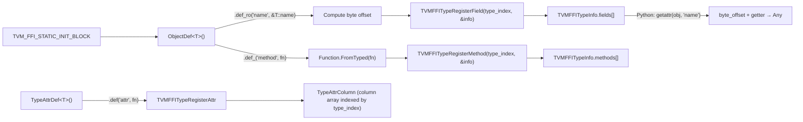

# FFI Reflection Subsystem

**TL;DR**.
- The reflection subsystem enables cross-language field/method access on Object types without per-type C API functions. `ObjectDef<T>` is the primary builder for registering fields (`def_ro`/`def_rw`), instance methods (`def_`), static methods (`def_static`), default values, and docstrings. Registration populates the global `TVMFFITypeInfo` table.
- Field access uses byte-offset arithmetic: each registered field stores its byte offset from the Object header, plus typed getter/setter function pairs. `ForEachFieldInfo` iterates fields in parent-to-child order traversing the ancestor chain via `type_ancestors` pointers.
- The **TypeAttr column system** provides per-type extensible attributes (functions or constants) keyed by string name, looked up by type index at O(1) cost. `TypeAttrDef<T>` registers attributes; `TypeAttrColumn` reads them.

## Problem Statement
### Background
- The FFI object system has typed fields in C++ that Python and other bindings cannot access without hand-written per-type accessor functions.
- A general mechanism is needed to expose object fields, methods, and arbitrary per-type attributes to all language bindings using only the C API.
- The system evolved from simple field-only reflection (`TVM_FFI_REFLECTION_DEF`) through a nanobind-style API to the current `ObjectDef<T>` builder with metadata, TypeAttr columns, and inheritance support.

### Solution
- Each Object type registers its fields and methods via `ObjectDef<T>()` inside `TVM_FFI_STATIC_INIT_BLOCK`.
- Field information is stored in `TVMFFIFieldInfo` structs within the global `TVMFFITypeInfo` table.
- Per-type attributes are stored in column arrays indexed by `type_index`, enabling O(1) lookup for operations like structural equality dispatch.

### Goals
- Cross-language field/method access via C API only.
- Support for default values, docstrings, bitmask flags, and type schemas on fields/methods.
- Extensible per-type attributes via the TypeAttr column system.
- Non-goal: computed/virtual properties (only direct member fields are reflectable).

## Design



### Key Classes, Fields and Interfaces

```python
# --- C ABI Field/Method Descriptors ---

class TVMFFIFieldFlagBitMask(IntEnum):
    """Bitmask flags for field/method metadata."""
    kWritable = 1 << 0             # Field is read-write
    kHasDefault = 1 << 1           # Field has a default value
    kIsStaticMethod = 1 << 2       # Method is static (no self)
    kSEqHashIgnore = 1 << 3        # Field excluded from structural eq/hash
    kSEqHashDef = 1 << 4           # Field enters def region (free var mapping)
    kDefaultFromFactory = 1 << 5   # default_value_or_factory holds factory fn, not static value (5e564cdf)
    kReprOff = 1 << 6             # field excluded from generic repr output (b648c5d6)
    kCompareOff = 1 << 7          # field excluded from RecursiveEq/Lt/Le/Gt/Ge (6b39efbf)
    kHashOff = 1 << 8             # field excluded from RecursiveHash (6b39efbf)
    kInitOff = 1 << 9             # field excluded from auto-generated __ffi_init__ (6b39efbf)
    kKwOnly = 1 << 10             # keyword-only argument in __ffi_init__ (6b39efbf)
    kSetterIsFunctionObj = 1 << 11 # setter holds FunctionObj handle, not raw fn ptr (4bb487e)
    # Interacts with: TVMFFIFieldInfo.flags, TVMFFIMethodInfo.flags
    # Interacts with: ReprPrinter.GenericRepr (skips fields with kReprOff) (0023-repr-print)
    # Interacts with: RecursiveEq/Lt/Hash (skips fields with kCompareOff/kHashOff) (0024-dataclass-ops)
    # Interacts with: MakeInit (skips fields with kInitOff; marks kKwOnly as keyword-only) (0024-dataclass-ops)
    # Extension: new flag bits can be added by extending this enum

class TVMFFIFieldInfo:
    """C-level field descriptor stored in the global type table."""
    name: TVMFFIByteArray
    doc: TVMFFIByteArray              # docstring
    metadata: TVMFFIByteArray      # JSON type schema
    field_static_type_index: int32    # type hint
    flags: int64                      # bitmask of TVMFFIFieldFlagBitMask
    size: int64                       # sizeof(T)
    alignment: int64                  # alignof(T)
    offset: int64                     # byte offset from Object header
    getter: TVMFFIFieldGetter         # fn(field_addr, result) -> int
    setter: void_ptr                  # void* (was TVMFFIFieldSetter; changed in 4bb487e)
    # When flags & kSetterIsFunctionObj (bit 11) OFF: cast to TVMFFIFieldSetter fn ptr
    # When flags & kSetterIsFunctionObj (bit 11) ON: cast to TVMFFIObjectHandle (FunctionObj)
    # Use CallFieldSetter() for correct dispatch
    default_value_or_factory: TVMFFIAny  # valid when flags & kHasDefault; holds static value or factory fn (5e564cdf)
    # When flags & kDefaultFromFactory: holds Function(() -> Any) — call to get fresh default
    # When not kDefaultFromFactory: holds static AnyView default (as before)
    # Invariant: offset is relative to the Object header, computed as:
    #   field_offset_in_class - object_header_offset_in_class
    # Invariant: setter is always set (even for readonly fields) for serialization
    # Interacts with: TVMFFITypeInfo.fields[], TVMFFITypeRegisterField

class TVMFFIMethodInfo:
    """C-level method descriptor."""
    name: TVMFFIByteArray
    doc: TVMFFIByteArray
    metadata: TVMFFIByteArray
    flags: int64                      # bitmask (kIsStaticMethod)
    method: TVMFFIAny                 # Function object
    # Invariant: first arg to instance methods is always self
    # Interacts with: TVMFFITypeInfo.methods[], TVMFFITypeRegisterMethod

class TVMFFITypeMetadata:
    """Per-type metadata for reflection (renamed from TVMFFITypeExtraInfo)."""
    total_size: int32                 # sizeof(Class) in bytes
    structural_eq_hash_kind: TVMFFISEqHashKind  # per-type comparison mode
    creator: TVMFFIObjectCreator      # optional factory function
    doc: TVMFFIByteArray              # optional docstring
    # Interacts with: TVMFFITypeInfo.metadata, TVMFFITypeRegisterMetadata
    # Invariant: registered at most once per type_index

class TVMFFITypeInfo:
    """Runtime type information for each registered Object type."""
    type_index: int32
    type_depth: int32
    type_key: TVMFFIByteArray
    type_key_hash: uint64
    type_ancestors: Pointer[Pointer[TVMFFITypeInfo]]  # direct pointers to ancestor TypeInfo
    num_fields: int32
    fields: const_TVMFFIFieldInfo_ptr
    num_methods: int32
    methods: const_TVMFFIMethodInfo_ptr
    metadata: const_TVMFFITypeMetadata_ptr  # renamed from extra_info
    # Invariant: type_ancestors[d] points directly to ancestor's TypeInfo at depth d
    # Invariant: type_ancestors[0] is always root Object's TypeInfo
    # Interacts with: IsObjectInstance, ForEachFieldInfo, ObjectDef registration

# --- C++ Registration API ---

class ReflectionDefBase:
    """Base class providing shared reflection utilities for ObjectDef and GlobalDef."""

    @staticmethod
    def FieldGetter(field: void_ptr, result: TVMFFIAny_ptr) -> int: ...
        # TVM_FFI_SAFE_CALL_BEGIN/END wrapped

    @staticmethod
    def FieldSetter(field: void_ptr, value: TVMFFIAny_ptr) -> int: ...
        # TVM_FFI_SAFE_CALL_BEGIN/END wrapped

    @staticmethod
    def ObjectCreatorDefault(result: TVMFFIObjectHandle_ptr) -> int: ...
        # Interacts with: make_object<T>()
        # Invariant: T must be default-constructible; guarded by if constexpr

    @staticmethod
    def WrapFunction(func: Func) -> Func:
        """Identity for generic callables; wraps member-function-pointers into lambdas (84c5bdbc)."""
        # Interacts with: OverloadObjectDef.GetOverloadMethod (uses WrapFunction independently)
        # Interacts with: GetMethod (composes WrapFunction + Function.FromTyped)

    @staticmethod
    def GetMethod(name: str, func: MemberFuncPtr) -> Function:
        """WrapFunction then Function.FromTyped. Used by ObjectDef (non-overload path)."""
        # static_assert: Class must derive from ObjectRef or Object
        # Interacts with: Function.FromTyped(), WrapFunction

class ObjectDef(ReflectionDefBase, Generic[Class]):
    """Builder for registering type reflection metadata."""
    type_index_: int32
    type_key_: str

    def __init__(self, *extra_args):
        self.type_index_ = Class._GetOrAllocRuntimeTypeIndex()
        self.type_key_ = Class._type_key
        self.RegisterExtraInfo(*extra_args)  # registers TVMFFITypeMetadata
        # Interacts with: TVMFFITypeRegisterMetadata

    def def_ro(self, name: str, field_ptr: MemberPointer[BaseClass, T], *extra) -> ObjectDef:
        """Register a read-only field (supports inherited fields from base classes)."""
        # static_assert: is_base_of_v<BaseClass, Class>
        self.RegisterField(name, field_ptr, readonly=True, extra)
        return self
        # Interacts with: TVMFFITypeRegisterField, FieldInfoTrait.Apply

    def def_rw(self, name: str, field_ptr: MemberPointer[BaseClass, T], *extra) -> ObjectDef:
        """Register a read-write field. Only for types with _type_mutable = true."""
        # Invariant: static_assert(Class._type_mutable)
        self.RegisterField(name, field_ptr, readonly=False, extra)
        return self

    def def_(self, name: str, func, *extra) -> ObjectDef:
        """Register an instance method."""
        # Interacts with: TVMFFITypeRegisterMethod, Function.FromTyped
        ...

    def def_static(self, name: str, func, *extra) -> ObjectDef:
        """Register a static method (no self parameter)."""
        ...

# --- TypeAttr Column System ---

class TVMFFITypeAttrColumn:
    """Column array storing one named attribute across all types (updated c85fd42d)."""
    data: const_TVMFFIAny_ptr  # indexed by (type_index - begin_index)
    size: int32_t              # number of entries; narrowed from size_t to int32 (c85fd42d)
    begin_index: int32_t       # NEW (c85fd42d): starting type index; currently always 0
    # Invariant: valid range = [begin_index, begin_index + size)
    # Access: data[type_index - begin_index] iff begin_index <= type_index < begin_index + size
    # Invariant: data[offset] is null for types that haven't registered this attr
    # Extension: begin_index enables future sparse column support (TODO 1.0)

class TypeAttrDef(Generic[Class]):
    """Builder for registering per-type attributes."""

    def def_(self, name: str, func: Callable) -> TypeAttrDef:
        """Register a function-valued type attribute."""
        # Interacts with: ReflectionDefBase.GetMethod, TVMFFITypeRegisterAttr
        ...

    def attr(self, name: str, value: T) -> TypeAttrDef:
        """Register a constant-valued type attribute."""
        # Interacts with: TVMFFITypeRegisterAttr
        ...

class TypeAttrColumn:
    """C++ accessor for reading a type attribute column by name."""

    def __init__(self, attr_name: str): ...
        # Raises RuntimeError if column not found

    def __getitem__(self, type_index: int32) -> AnyView: ...
        # offset = type_index - column.begin_index
        # Returns null AnyView if offset < 0 or offset >= column.size (c85fd42d)
        # Interacts with: TVMFFITypeAttrColumn.data, begin_index

def EnsureTypeAttrColumn(name: str) -> None:
    """Create an empty column if it doesn't exist yet."""
    # Calls TVMFFITypeRegisterAttr(kTVMFFINone, name, nullptr)

# --- Runtime Accessor Helpers (accessor.h) ---

class FieldGetter:
    """Convenience wrapper for reading a field from any Object."""
    def __init__(self, type_key: str, field_name: str): ...
    def __init__(self, field_info: TVMFFIFieldInfo): ...
    def __call__(self, obj: Object) -> Any: ...
        # addr = cast[char_ptr](obj) + field_info_.offset
        # field_info_.getter(addr, result)

class FieldSetter:
    """Convenience wrapper for writing a field to any Object."""
    def __init__(self, type_key: str, field_name: str): ...
    def __call__(self, obj: Object, value: AnyView) -> None: ...
        # Invariant: caller must ensure field is writable (flags & kWritable)

def CallFieldSetter(field_info: TVMFFIFieldInfo, field_addr: void_ptr, value: AnyView) -> None:
    """Centralized setter dispatch (4bb487e).
    # When bit 11 (kTVMFFIFieldFlagBitSetterIsFunctionObj) is OFF: casts setter to TVMFFIFieldSetter
    # When bit 11 is ON: casts setter to TVMFFIObjectHandle (FunctionObj), calls TVMFFIFunctionCall
    # Interacts with: TVMFFIFieldInfo.setter (void*), TVMFFIFunctionCall
    """

def GetFieldInfo(type_key: str, field_name: str) -> TVMFFIFieldInfo: ...
def GetMethodInfo(type_key: str, method_name: str) -> TVMFFIMethodInfo: ...
def GetMethod(type_key: str, method_name: str) -> Function: ...

def ForEachFieldInfo(type_info: TVMFFITypeInfo, callback: Callable[[TVMFFIFieldInfo], None]) -> None:
    """Visit each field info (parent-to-child order) via ancestor pointer chain."""
    # Invariant: callback must return void (enforced by static_assert)
    # Invariant: skips depth-0 ancestor (root Object)
    # Interacts with: TypeInfo.type_depth, TypeInfo.type_ancestors (TypeInfo** pointers)

def ForEachFieldInfoWithEarlyStop(type_info: TVMFFITypeInfo,
                                   callback: Callable[[TVMFFIFieldInfo], bool]) -> bool:
    """Like ForEachFieldInfo but callback returns bool. Returns True on early stop."""
    # Extension: use for search-style iteration

def MakeObjectFromPackedArgs(type_key: str, *kv_pairs) -> ObjectRef:
    """Create an object by type key and set fields from key-value packed args."""
    # Registered as global function 'ffi.MakeObjectFromPackedArgs'
    # Interacts with: TVMFFITypeMetadata.creator, TVMFFITypeInfo.fields[].setter
    # Interacts with: ancestor chain traversal for inherited fields
    # Invariant: args.size() must be odd (type_key + N key-value pairs)

class ObjectCreator:
    """Higher-level factory: creates objects from type key + Map<String, Any>.
    Complements MakeObjectFromPackedArgs (packed-args style) with map-based style."""
    # Interacts with: TVMFFITypeMetadata.creator, ForEachFieldInfo, TVMFFIFieldInfo.setter
    # Invariant: type must have reflection registered (metadata != None)
    # Invariant: type must have a default constructor (metadata.creator != None)
    # Extension: supports any type registered via ObjectDef<T>

    def __init__(self, type_key: str): ...
    def __init__(self, type_info: TVMFFITypeInfo): ...

    def __call__(self, fields: Map[str, Any]) -> Any:
        """Create object, set provided fields, apply defaults for missing fields."""
        # 1. Call metadata.creator to default-construct
        # 2. ForEachFieldInfo: set from map or apply default
        # 3. Verify no extra fields in map
        # Invariant: raises TypeError for required fields missing from map
        # Invariant: raises TypeError for unknown field names
        ...

# --- Helper Traits ---

# --- Constructor registration helper ---

class init(Generic[*Args]):
    """reflection::init<Args...> -- tag type for constructor registration.
    Class type T is deduced from the enclosing ObjectDef<T> context.
    Replaces old free function reflection::init<T, Args...> (removed in fc2630f)."""
    # Interacts with: ObjectDef.def() overload (registers __ffi_init__ via RegisterMethod)
    # Interacts with: make_object<Class>(args...) inside execute<Class>
    # Invariant: Class must have a constructor accepting Args...
    # Extension: supports variadic Extra args (docstring, metadata) via ObjectDef.def()
    @staticmethod
    def execute(*args: Args) -> ObjectRef:
        """Private. Wraps make_object<Class>(args...) -> ObjectRef."""
        ...

class ObjectDef(ReflectionDefBase, Generic[Class]):
    INIT_METHOD_NAME: str = "__ffi_init__"  # static constexpr
    # ...existing methods...
    def def(self, init_func: init[*Args], *extra) -> "ObjectDef":
        """Register a constructor for this object type (fc2630f).
        Calls RegisterMethod(INIT_METHOD_NAME, is_static=True, init::execute<Class>, extra...).
        Replaces: .def_static("__ffi_init__", refl::init<ObjType, arg_types...>)"""
        # Interacts with: RegisterMethod, init<Args...>::execute<Class>
        # Invariant: registers as static method named "__ffi_init__"
        ...

# --- Well-known type attribute names (c73d61a4) ---
# type_attr::kInit = "__ffi_init__"
# type_attr::kShallowCopy = "__ffi_shallow_copy__"

# --- __ffi_init__ naming convention ---
# Old: def_static("__ffi_init__", refl::init<ObjType, arg_types...>) -- REMOVED (fc2630f)
# New: .def(refl::init<arg_types...>()) -- class type deduced from ObjectDef<T>
# Python side: Object.__ffi_init__() calls __c_ffi_init__ (renamed at registration)

# --- Unified Object Creation (e3333e2) ---
def CreateEmptyObject(type_info: Ptr[TVMFFITypeInfo]) -> ObjectPtr[Object]:
    """Unified creation API replacing 5 scattered creator-or-null patterns (e3333e2).
    # Fast path: metadata->creator (C++ types with default constructors)
    # Fallback: __ffi_new__ type attribute (for Python-defined types via py_class)
    # Invariant: raises RuntimeError if neither creator nor __ffi_new__ exists
    # Interacts with: ObjectCreator, MakeInit, MakeObjectFromPackedArgs, ObjectGraphDeserializer
    """

def HasCreator(type_info: Ptr[TVMFFITypeInfo]) -> bool:
    """Returns True if CreateEmptyObject would succeed for this type."""

# --- __ffi_convert__ TypeAttr Column (5f5ca5a) ---
# Per-type converter registered via ObjectDef::ref<TObjectRef>()
# Signature: (AnyView value) -> TObjectRef
# ObjectDef auto-registers: details::CastFromAny<TObjectRef>
# Used by: type_converter.pxi for Object-type conversion dispatch
# Interacts with: TypeAttrDef, TypeAttrColumn("__ffi_convert__")

# ObjectDef::ref<TRef>() method (5f5ca5a):
# Registers __ffi_convert__ for the given ObjectRef type
# class ObjectDef:
#     def ref(self, TRef) -> ObjectDef:
#         TypeAttrDef<Class>().def("__ffi_convert__", &CastFromAny<TRef>)

# --- Auto-init registration (6b39efbf) ---
# ObjectDef destructor calls AutoRegisterInit() when no explicit init<Args...> was supplied:
#   if not has_explicit_init_:
#       RegisterAutoInit(type_index_)  # from reflection/init.h
#       -> MakeInit(type_index_) creates packed Function from field analysis
#       -> TVMFFITypeRegisterMethod(type_index_, __ffi_init__, flags=static, metadata={auto_init:true})
# Interacts with: MakeInit, RegisterAutoInit (reflection/init.h)
# Interacts with: Python _make_init/_make_init_signature (registry.py) for __init__ wiring (b1abaeac)
# Invariant: auto-generated __ffi_init__ respects init(false)/kw_only(true)/default flags per field
# See: 0024-dataclass-ops.md for full auto-init design

# --- __ffi_shallow_copy__ auto-registration (c73d61a4) ---
# ObjectDef constructor calls AutoRegisterCopy():
#   if std::is_copy_constructible_v<Class>:
#     register instance method "__ffi_shallow_copy__" -> ObjectRef(make_object<Class>(*self))
#     register type attribute "__ffi_shallow_copy__" -> Function (for DeepCopy lookup)
#   else: no registration (type is non-copyable)
# Interacts with: ffi::DeepCopy (0022-deep-copy), _setup_copy_methods (Python)
# Invariant: auto-registered for all copy-constructible reflected types; skipped otherwise

# --- Method Overloading (84c5bdbc) ---

class OverloadBase:
    """Abstract base for all overload entries in the dispatch chain."""
    num_args_: int32
    name_: str
    last_mismatch_index_: int32  # cache for error reporting; kAllMatched = -1

    def Register(self, overload: "OverloadBase") -> None: ...
    def GetTryCallPtr(self) -> "FnPtr": ...
        # Returns: bool (*)(OverloadBase*, AnyView*, int32, Any*)
    def GetMismatchMessage(self, os: "ostringstream", args: "AnyView*", num_args: int32) -> None: ...
    # Interacts with: OverloadedFunction.Register, TypedOverload.TryCall

class TypedOverload(OverloadBase, Generic[Callable]):
    """Concrete overload entry: tries to call a single typed callable."""
    f_: Callable
    # Invariant: TryCall returns false if num_args != kNumArgs or any arg fails try_cast
    # Invariant: uses std::optional-based capture for safe rollback on type mismatch
    # Interacts with: FunctionInfo<Callable> for arg type introspection
    # Interacts with: AnyView.try_cast<T> for non-throwing type checks

class OverloadedFunction(TypedOverload, Generic[Callable]):
    """Primary callable that dispatches to itself first, then registered overloads."""
    overloads_: "list[tuple[OverloadBase, FnPtr]]"

    def __call__(self, args: "AnyView*", num_args: int32, rv: "Any*") -> None:
        # Fast path: if no overloads, direct unpack_call (zero overhead)
        # Then try self.TryCall, then iterate overloads by num_args filter
        # On failure: HandleOverloadFailure raises TypeError with all mismatch messages
        ...
    # Invariant: first registered callable is primary (tried first + fast path)
    # Interacts with: details::unpack_call (fast path when no overloads)

class OverloadObjectDef(ObjectDef, Generic[Class]):
    """Reflection builder with method overloading support for Object types.
    Use instead of ObjectDef when any method or constructor needs overloading."""
    registered_fields_: "dict[str, OverloadBase*]"  # tracks overload chains per name

    def def_ro(self, name: str, field_ptr, *extra) -> "OverloadObjectDef": ...
        # Delegates to ObjectDef.def_ro (fields are NOT overloadable)
    def def_rw(self, name: str, field_ptr, *extra) -> "OverloadObjectDef": ...
    def def(self, name: str, func, *extra) -> "OverloadObjectDef": ...
        # First call for name: creates OverloadedFunction via FromPackedInplace
        # Subsequent calls: appends TypedOverload to existing OverloadedFunction
    def def_static(self, name: str, func, *extra) -> "OverloadObjectDef": ...
        # Same overload semantics as def()
    def def(self, init_func: "init[*Args]", *extra) -> "OverloadObjectDef": ...
        # Constructor overloading via __ffi_init__
    # Invariant: fields (def_ro/def_rw) are NOT overloadable
    # Interacts with: Function.FromPackedInplace (creates OverloadedFunction with pointer access)
    # Interacts with: ObjectDef (inherits field/metadata registration)
    # Extension: use instead of ObjectDef when any method needs overloading

class InfoTrait:
    """Base class for registration-time traits (renamed from FieldInfoTrait).
    Subclasses: DefaultValue, AttachFieldFlag, Metadata."""
    # Interacts with: ReflectionDefBase.ApplyFieldInfoTrait, ApplyMethodInfoTrait

class Metadata(InfoTrait):
    """User-supplied key-value metadata for field/method/global-func registration.
    Values must be int, bool, or String. type_schema is auto-injected before user metadata."""
    def __init__(self, items: list[tuple[str, Any]]): ...
    # Invariant: type_schema key is always prepended before user metadata
    # Invariant: serialized to JSON and stored in TVMFFIFieldInfo/TVMFFIMethodInfo.metadata
    # Interacts with: FieldInfoBuilder.metadata_, MethodInfoBuilder.metadata_

class FieldInfoBuilder(TVMFFIFieldInfo):
    """Temporary builder extending TVMFFIFieldInfo with a metadata_ vector.
    Populated during RegisterField, then serialized to metadata TVMFFIByteArray."""
    metadata_: list[tuple[str, Any]]
    # Interacts with: ObjectDef.RegisterField, Metadata.Apply

class MethodInfoBuilder(TVMFFIMethodInfo):
    """Temporary builder extending TVMFFIMethodInfo with a metadata_ vector.
    Populated during RegisterMethod/RegisterFunc, then serialized to metadata TVMFFIByteArray."""
    metadata_: list[tuple[str, Any]]
    # Interacts with: ObjectDef.RegisterMethod, GlobalDef.RegisterFunc, Metadata.Apply

class DefaultValue(InfoTrait):
    """Attach a static default value to a field during registration.
    WARNING: For mutable defaults (Array, Map, List), use DefaultFactory instead
    to avoid aliasing across instances."""
    def __init__(self, value: Any): ...
    def Apply(self, info: TVMFFIFieldInfo) -> None:
        info.default_value_or_factory = value
        info.flags |= kHasDefault

class DefaultFactory(InfoTrait):
    """Attach a per-instance factory-based default to a field (5e564cdf).
    Mirrors Python dataclass default_factory. The factory is called fresh each
    time a default is needed, preventing aliasing of mutable containers."""
    def __init__(self, factory: Callable[[], Any]) -> None: ...
    def Apply(self, info: TVMFFIFieldInfo) -> None:
        info.default_value_or_factory = Function(factory)
        info.flags |= kHasDefault | kDefaultFromFactory
    # Interacts with: ObjectDef.def_field(), SetFieldToDefault(), creator.h, serialization.cc
    # Invariant: factory must be callable with zero args and return a compatible value
    # Extension: mirrors Python dataclasses.field(default_factory=...)

def SetFieldToDefault(field_info: TVMFFIFieldInfo, field_addr: void_ptr) -> None:
    """Shared helper for resolving field defaults (5e564cdf). Branches on
    kTVMFFIFieldFlagBitMaskDefaultFromFactory flag: if set, calls the factory
    function; if not, copies the static default value."""
    # Interacts with: TVMFFIFieldInfo.setter, TVMFFIFieldInfo.default_value_or_factory
    # Used by: creator.h, reflection_extra.cc, serialization.cc

class AttachFieldFlag(InfoTrait):
    """Attach structural eq/hash flags to fields."""
    @staticmethod
    def SEqHashDef() -> AttachFieldFlag: ...    # kSEqHashDef
    @staticmethod
    def SEqHashIgnore() -> AttachFieldFlag: ... # kSEqHashIgnore

class repr(InfoTrait):
    """Controls whether a field appears in generic repr output (b648c5d6).
    Renamed from Repr to lowercase (6b39efbf)."""
    # Usage: ObjectDef<T>().def_rw("field", &T::field, refl::repr(false))
    # Interacts with: TVMFFIFieldInfo.flags, kTVMFFIFieldFlagBitMaskReprOff (1 << 6)
    # Interacts with: ReprPrinter.GenericRepr (0023-repr-print)
    # Invariant: repr(true) is a no-op (default state is repr-included)
    # Invariant: repr(false) sets kReprOff in info.flags
    def __init__(self, show: bool): ...
    def Apply(self, info: TVMFFIFieldInfo) -> None: ...

class compare(InfoTrait):
    """Controls whether a field participates in RecursiveEq/Lt/Le/Gt/Ge (6b39efbf)."""
    # Usage: ObjectDef<T>().def_rw("field", &T::field, refl::compare(false))
    # Interacts with: TVMFFIFieldInfo.flags, kTVMFFIFieldFlagBitMaskCompareOff (1 << 7)
    # Invariant: compare(false) also implies hash(false) for consistency

class hash(InfoTrait):
    """Controls whether a field participates in RecursiveHash (6b39efbf)."""
    # Usage: ObjectDef<T>().def_rw("field", &T::field, refl::hash(false))
    # Interacts with: TVMFFIFieldInfo.flags, kTVMFFIFieldFlagBitMaskHashOff (1 << 8)

class kw_only(InfoTrait):
    """Marks a field as keyword-only in the auto-generated __ffi_init__ (6b39efbf)."""
    # Usage: ObjectDef<T>().def_rw("field", &T::field, refl::kw_only(true))
    # Interacts with: TVMFFIFieldInfo.flags, kTVMFFIFieldFlagBitMaskKwOnly (1 << 10)

class init_trait(InfoTrait):
    """Controls whether a field appears in the auto-generated __ffi_init__ (6b39efbf).
    C++ name: refl::init (overloaded: init<Args...> for constructor reg, init(bool) for field trait)."""
    # Usage: ObjectDef<T>().def_rw("field", &T::field, refl::init(false))
    # Interacts with: TVMFFIFieldInfo.flags, kTVMFFIFieldFlagBitMaskInitOff (1 << 9)

# Alias traits (lowercase, 6b39efbf):
# refl::default_value(v) -- alias for refl::DefaultValue(v)
# refl::default_factory(f) -- alias for refl::DefaultFactory(f)
```

### Contracts, Assumptions and Invariants
- **Byte-offset correctness**: `GetFieldByteOffsetToObject` subtracts the Object header offset within the class, handling cases where Object is not the first base class (e.g., `FunctionObj` inherits both `Object` and `TVMFFIFunctionCell`).
- **Getter/setter exception safety**: Both use `TVM_FFI_SAFE_CALL_BEGIN/END`, so type conversion errors are caught and returned as error codes.
- **_type_mutable enforcement**: `def_rw` has a `static_assert(Class._type_mutable)` -- only types marked mutable may have writable fields. This prevents accidental mutation of immutable objects.
- **Inherited field support**: `def_ro`/`def_rw` accept `T BaseClass::*` member pointers with `static_assert(is_base_of_v<BaseClass, Class>)`, enabling base class fields to be registered in derived type definitions.
- **Registration timing**: Registration happens at static initialization via `TVM_FFI_STATIC_INIT_BLOCK`. The type must already be registered (via `_GetOrAllocRuntimeTypeIndex`).
- **TypeAttr column immutability**: Once an attribute is registered for a `(type_index, attr_name)` pair, it cannot be overwritten.

### Extension Points
- **Custom field types**: Any type with `TypeTraits<T>` can be a reflected field. Enum types work via `TypeTraits<IntEnum>` specialization.
- **TypeAttr columns**: New per-type attributes can be defined by calling `EnsureTypeAttrColumn("name")` at static init and registering values via `TypeAttrDef<T>`. This powers custom structural eq/hash dispatch (`__s_equal__`, `__s_hash__`), per-type `AnyHash`/`AnyEqual` override (`__any_hash__`, `__any_equal__` -- 39d9b2b4), deep copy support (`__ffi_shallow_copy__` -- c73d61a4), JSON serialization hooks (`__data_to_json__`, `__data_from_json__`), and custom repr (`__ffi_repr__` -- b648c5d6, see [0023-repr-print.md](0023-repr-print.md)).
- **ReflectionDefBase reuse**: Both `ObjectDef` (type fields/methods) and `GlobalDef` (global functions) inherit from `ReflectionDefBase`, sharing method wrapping and trait application logic.

### Usage Examples

#### Registering Fields, Methods, Defaults, and TypeAttrs
**Context**: Full reflection registration for a mutable type with inheritance, and TypeAttr usage.
```cpp
// Define a mutable type
class TFloatObj : public Object {
 public:
  double value;
  double Add(double other) const { return value + other; }
  static constexpr bool _type_mutable = true;
  TVM_FFI_DECLARE_OBJECT_INFO_FINAL("test.Float", TFloatObj, Object);
};

// Register constructor, fields, methods, defaults, and docstrings
TVM_FFI_STATIC_INIT_BLOCK() {
  namespace refl = tvm::ffi::reflection;
  refl::ObjectDef<TFloatObj>()
      .def(refl::init<double>())   // constructor: class type deduced from ObjectDef (fc2630f)
      .def_rw("value", &TFloatObj::value, "float value", refl::DefaultValue(10.0))
      .def("add", &TFloatObj::Add, "add method");

  // Register a custom type attribute
  refl::TypeAttrDef<TFloatObj>()
      .def("test.GetValue", [](const TFloatObj* self) -> double { return self->value; })
      .attr("test.size", int(sizeof(TFloatObj)));
}

// Access fields at runtime
reflection::FieldGetter getter("test.Float", "value");
Any val = getter(my_float_obj);  // reads via byte-offset

// Look up TypeAttr
reflection::TypeAttrColumn size_attr("test.size");
int size = size_attr[TFloatObj::RuntimeTypeIndex()].cast<int>();
```

#### Registering Overloaded Constructors and Methods
**Context**: Using `OverloadObjectDef` when methods or constructors need runtime dispatch by argument type.
```cpp
TVM_FFI_STATIC_INIT_BLOCK() {
  namespace refl = tvm::ffi::reflection;
  refl::OverloadObjectDef<TestOverloadObj>()
      .def(refl::init<int32_t>())           // constructor overload 1
      .def(refl::init<float>())             // constructor overload 2
      .def("hold_same_type", &TestOverloadObj::Holds<int32_t>)
      .def("hold_same_type", &TestOverloadObj::Holds<float>)
      .def_static("add_one_static", &TestOverloadObj::AddOneInt)
      .def_static("add_one_static", &TestOverloadObj::AddOneFloat);
}

// Call overloaded constructor -- dispatches by arg type at runtime
Function init_method = reflection::GetMethod("test.TestOverloadObj", "__ffi_init__");
Any obj_int = init_method(10);      // selects init<int32_t>
Any obj_float = init_method(3.14f); // selects init<float>
// Mismatched overload -> TypeError listing all candidates
```

### Header Organization
| Header | Contents |
|--------|----------|
| `reflection/registry.h` | `ReflectionDefBase`, `ObjectDef<T>`, `GlobalDef`, `TypeAttrDef<T>`, field/method registration templates |
| `reflection/overload.h` | `OverloadBase`, `TypedOverload<Callable>`, `OverloadedFunction<Callable>`, `OverloadObjectDef<T>` (84c5bdbc) |
| `reflection/accessor.h` | `FieldGetter`, `FieldSetter`, `GetFieldInfo`, `GetMethod`, `ForEachFieldInfo`, `TypeAttrColumn` |
| `reflection/access_path.h` | `AccessStepObj`/`AccessStep`, `AccessPathObj`/`AccessPath` (parent-pointing tree) for structural eq/hash diagnostics |
| `reflection/creator.h` | `ObjectCreator` map-based object factory |

### Evolution Timeline
| Commit | Change | Significance |
|--------|--------|--------------|
| 7d34eb8 | Introduced `ReflectionDef`, `TVMFFIFieldInfo`, `TVM_FFI_REFLECTION_DEF` | Foundation |
| 1a856886 | Renamed to nanobind-style API (`def_ro`/`def_rw`), added methods, flags, defaults, docstrings | API maturation |
| a419ed17 | Renamed to `ObjectDef<T>`, added `TVMFFITypeExtraInfo`, `metadata`, removed `TVM_FFI_REFLECTION_DEF` | Builder modernization |
| e9094866 | Added `ReflectionDefBase`, `MakeObjectFromPackedArgs`, `_type_mutable` enforcement | Reflection-based construction |
| 837800e7 | `type_ancestors` changed to TypeInfo pointers, added `ForEachFieldInfo` | Perf: O(1) parent lookup |
| 162d6009 | Introduced TypeAttr column system, renamed `TVMFFITypeExtraInfo` -> `TVMFFITypeMetadata` | Per-type extensibility |
| e95b43b0 | Split `reflection.h` into `registry.h` + `accessor.h` | Header organization |
| 7cb92736 | Added `ObjectCreator` (creator.h), map-based object construction | Higher-level creation API |
| f4ede982 | Refactored `AccessPath` to parent-pointing tree Object, renamed `kObjectField` -> `kAttr`, simplified `GetMethod` template | AccessPath redesign |
| c01dadf3 | Added `reflection::init<T, Args...>` helper, `__ffi_init__` naming convention | Standardized constructors |
| 98cb8af4 | Renamed `type_acenstors`->`type_ancestors` (typo fix) | Name consistency |
| fc2630f | Refactored `reflection::init` from free function `init<T, Args...>` to struct `init<Args...>` with class type deduced from `ObjectDef<T>` | API alignment with nanobind/pybind `py::init<>()` idiom |
| 84c5bdbc | Added `OverloadObjectDef<T>`, `OverloadedFunction`, `TypedOverload`, `OverloadBase`; `Function::FromPackedInplace`; `FunctionObjImpl` variadic ctor + `GetCallable()` | Method overloading for reflection |
| 5e564cdf | Added `DefaultFactory`, `SetFieldToDefault()`, `kTVMFFIFieldFlagBitMaskDefaultFromFactory`; renamed `TVMFFIFieldInfo.default_value` -> `default_value_or_factory` | Per-instance mutable defaults |
| c73d61a4 | Added `AutoRegisterCopy()` in ObjectDef, `type_attr::kShallowCopy`/`kInit` constants, `__ffi_shallow_copy__` protocol | Copy support for reflected types |
| 6b39efbf | Lowercase reflection traits (`repr`, `compare`, `hash`, `kw_only`, `init`, `default_`, `default_factory`); field flag bits 7-10; auto-init via ObjectDef destructor | Dataclass trait completeness |
| b1abaeac | Python `_make_init`/`_make_init_signature` for KWARGS-based `__init__` from C++ reflection | Python init wiring |

## Implementation Notes
- The byte-offset approach means reflection works without virtual dispatch. A single `FieldGetter<T>` template handles all fields of the same type across all types.
- `TVMFFITypeRegisterField` appends to the `TVMFFITypeInfo.fields` array. The array is grown during registration (at static init) and read-only thereafter.
- `ForEachFieldInfo` uses `type_ancestors` (direct TypeInfo pointers) to walk the ancestor chain without `TVMFFIGetTypeInfo` lookups, iterating fields from depth 1 to current depth.
- TypeAttr columns are stored as `Map<String, unique_ptr<column>>` in the global `TypeTable`. Columns grow dynamically as new types register attributes.

## Alternatives & Trade-offs
### Byte-Offset Reflection vs. Per-Type Accessor Functions
- Pros of byte-offset: One getter/setter per field type, not per (type, field) pair. Compact metadata. Works for any field type automatically.
- Cons: Requires correct offset computation (sensitive to class layout). Cannot handle computed/virtual properties.
### TypeAttr Columns vs. Method Table Lookup
- Pros of columns: O(1) lookup by type_index (array indexing). No hash table overhead. Natural for operations that dispatch by type (e.g., structural eq/hash).
- Cons: Column storage grows with max type_index. Sparse for attributes only some types implement.

## Evidence
| Commit | Scope | Contribution |
|--------|-------|-------------|
| 7d34eb8 | ffi/reflection | Foundation: ReflectionDef, TVMFFIFieldInfo |
| 1a856886 | ffi/reflection | Nanobind-style API, method registration, flags |
| a419ed17 | ffi/reflection | ObjectDef<T>, TVMFFITypeExtraInfo, metadata |
| e9094866 | ffi/reflection | ReflectionDefBase, MakeObjectFromPackedArgs |
| 837800e7 | ffi/reflection | type_ancestors as pointers, ForEachFieldInfo |
| 162d6009 | ffi/reflection | TypeAttr column system, rename to TVMFFITypeMetadata |
| Plus 7 supporting commits (69f2484f, a5a08b25, f7311e49, e95b43b0, 9445fe73, 7cb92736, f4ede982) |
| 28fe3cc7 | ffi/reflection | Added `Metadata` InfoTrait, `FieldInfoBuilder`/`MethodInfoBuilder`, `TypeSchema<T>` auto-injection; renamed `FieldInfoTrait` to `InfoTrait` |
| 84c5bdbc | ffi/reflection, ffi/function | OverloadObjectDef, OverloadedFunction, TypedOverload, OverloadBase; Function::FromPackedInplace |
| 5e564cdf | ffi/reflection, ffi/c-api | Added `DefaultFactory`, `SetFieldToDefault`, `kTVMFFIFieldFlagBitMaskDefaultFromFactory`; renamed `default_value` -> `default_value_or_factory` |
| c73d61a4 | ffi/reflection, ffi/extra | Added `__ffi_shallow_copy__` auto-registration in ObjectDef; `type_attr::kShallowCopy`/`kInit` constants |
| 39d9b2b4 | ffi/any, ffi/reflection | Added `__any_hash__`/`__any_equal__` TypeAttr column convention for per-type AnyHash/AnyEqual |
| c85fd42d | ffi/c-api, ffi/reflection | `TVMFFITypeAttrColumn.begin_index` (int32), `size` narrowed to int32; offset-based column access |
| 6b39efbf | ffi/reflection, ffi/extra, ffi/c-api | Lowercase traits, field flag bits 7-10, auto-init, consolidated dataclass.cc |
| b1abaeac | python/ffi-bindings, python/dataclasses | `_make_init`/`_make_init_signature` KWARGS-based Python __init__ from reflection |
| 4bb487ef | ffi/c-api, ffi/reflection | `CallFieldSetter` dispatch; `kTVMFFIFieldFlagBitSetterIsFunctionObj` (bit 11); setter type -> `void*` |
| e3333e28 | ffi/reflection, ffi/c-api | `CreateEmptyObject`/`HasCreator` with `__ffi_new__` fallback; `Field` descriptor for Python types |
| 5f5ca5ab | ffi/reflection, python/ffi-bindings | `__ffi_convert__` TypeAttr column; `ObjectDef::ref<>()`; `type_converter.pxi` rewrite |

## Related Design Docs & ADRs
- [0001-c-abi.md](0001-c-abi.md) -- TVMFFITypeInfo and TVMFFIFieldInfo C structures
- [0003-object-system.md](0003-object-system.md) -- Object header layout used for byte-offset computation
- [0004-function-system.md](0004-function-system.md) -- GlobalDef inherits from ReflectionDefBase
- [0008-object-macros.md](0008-object-macros.md) -- Macros that reflection depends on for type registration
- [0009-structural-eq-hash.md](0009-structural-eq-hash.md) -- Uses reflection field iteration and TypeAttr columns
- [0010-json-serialization.md](0010-json-serialization.md) -- Uses ForEachFieldInfo, TVMFFITypeMetadata.creator, TypeAttr columns for JSON serialization
- [0022-deep-copy.md](0022-deep-copy.md) -- `DeepCopy` uses `__ffi_shallow_copy__` type attribute registered by ObjectDef
- [0024-dataclass-ops.md](0024-dataclass-ops.md) -- Unified dataclass operations header consuming reflection traits and auto-init
