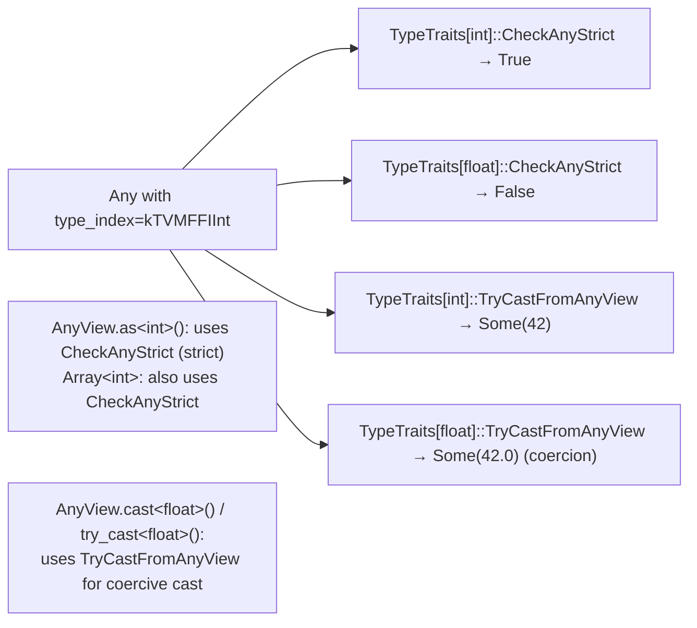

# TypeTraits — Type Conversion Protocol for Any/AnyView

**TL;DR**
- `TypeTraits<T>` is a **customization-point struct** that defines how a C++ type `T` moves in and out of `Any`/`AnyView`. Specialize it to make any type usable as a packed function argument, container element, or reflected field value.
- Two enable-flags gate participation: `convert_enabled` (allows implicit `AnyView` construction) and `storage_enabled` (allows container element storage). Both default to `false` — unregistered types produce compile errors.
- `CheckAnyStrict` (formerly `CheckAnyStorage`) is the key invariant for containers: an `Array<T>` guarantees `TypeTraits<T>::CheckAnyStrict(elem)` for every element, separating "can be converted to T" (weaker, e.g., int→float) from "is stored as T" (stronger, exact match).

## Problem Statement

### Background
A type-erased value system like `Any` needs a way to map from a concrete C++ type `T` to its `TVMFFIAny` wire representation and back. A single switch statement over all types doesn't scale as users add custom types. A virtual method on each type would require heap allocation for POD values.

### Solution
`TypeTraits<T>` is a non-inheriting struct with static methods. New types opt in by specializing the template. The compiler enforces the protocol via `static_assert` or SFINAE; missing methods are link errors. The struct is stateless — all methods are static — so it has zero runtime overhead.

### Goals
- Zero overhead for POD types (int, float, bool): no virtual calls, no heap allocation in `CopyToAnyView`.
- Extensible: user types specialize `TypeTraits<MyType>` without modifying TVM FFI headers.
- Deterministic type-checking: `CheckAnyStrict` tells containers whether an element is stored as the exact target type (no coercion).
- Non-goal: runtime reflection of type metadata (use `TVMFFITypeInfo` for that).

## Design

### Protocol Definition

```python
class TypeTraits(Generic[T]):
    """Customization-point protocol. Specialize for each type T that should be FFI-compatible.
    All methods are static. Default instance has convert_enabled=False (opt-out by default).
    """
    # --- Gate flags ---
    convert_enabled: bool = False
    # If True: AnyView/Any accept implicit construction from T.
    # If False: AnyView(T) is a compile error.

    storage_enabled: bool = False
    # If True: T may be stored as container element (Array<T>, Map<K,T>, etc.).
    # convert_enabled must also be True. storage_enabled implies CheckAnyStrict is meaningful.

    # --- Required static methods (implement all when specializing) ---

    @staticmethod
    def CopyToAnyView(value: T, out: TVMFFIAny*) -> None:
        """Write value T into the TVMFFIAny struct. No heap allocation for POD types.
        Overflow guard (commit 86bbddfd): if T is uint64_t or size_t AND value > INT64_MAX,
        throws OverflowError instead of silently truncating/wrapping the value in int64 storage.
        """
        # Invariant: for unsigned T with sizeof(T) >= sizeof(int64_t):
        #   value must be <= std::numeric_limits<int64_t>::max() (i.e., fit in int64_t)
        #   Otherwise: TVM_FFI_THROW(OverflowError) << "Integer value " << value << " too large"
        # Note: callers needing to pass large uint64_t through FFI must bitcast to int64_t first:
        #   int64_t safe = static_cast<int64_t>(large_uint64);  // bitcast, no check triggers
        ...

    @staticmethod
    def MoveToAny(value: T, out: TVMFFIAny*) -> None:
        """Move value T into the TVMFFIAny struct. For objects, transfers ownership.
        For POD types, identical to CopyToAnyView.
        """
        ...

    @staticmethod
    def CheckAnyStrict(data: TVMFFIAny*) -> bool:
        """True iff the Any was stored via MoveToAny/CopyToAnyView of this T.
        Renamed from CheckAnyStorage in commit 37a2e7c5.
        Stricter than TryCastFromAnyView — no implicit coercion (e.g., int stored as int,
        not as float even if float could convert it).
        Used by AnyView.as<T>(), Array<T> element validation, Variant<T...> construction.
        """
        ...

    @staticmethod
    def CopyFromAnyStorageAfterCheck(data: TVMFFIAny*) -> T:
        """Extract T from Any, assuming CheckAnyStrict returned True.
        Undefined behavior if called without CheckAnyStrict passing first.
        """
        ...

    @staticmethod
    def MoveFromAnyAfterCheck(data: TVMFFIAny*) -> T:
        """Move T out of Any storage. Same precondition as CopyFromAnyStorageAfterCheck.
        Renamed from MoveFromAnyStorageAfterCheck in commit 37a2e7c5.
        For objects, the caller is responsible for setting source Any to kTVMFFINone after.
        """
        ...

    @staticmethod
    def TryCastFromAnyView(data: TVMFFIAny*) -> Optional[T]:
        """Try to convert Any to T. May apply type coercions (e.g., int → float).
        Renamed from TryConvertFromAnyView in commit 37a2e7c5.
        Returns None if conversion is impossible.
        Used by AnyView.cast<T>() and AnyView.try_cast<T>().
        """
        ...

    @staticmethod
    def GetMismatchTypeInfo(data: TVMFFIAny*) -> str:
        """Return type key of the stored value when TryCastFromAnyView fails.
        Used for error message generation. Default: TypeIndexToTypeKey(data.type_index).
        """
        return TypeIndexToTypeKey(data.type_index)

    @staticmethod
    def TypeStr() -> str:
        """Human-readable name of T for error messages."""
        ...
```

### Provided Specializations (built-in)

```python
# int, int64_t, bool, float, double:
class TypeTraits[int]:
    convert_enabled = True; storage_enabled = True
    @staticmethod
    def CopyToAnyView(v: int, out: TVMFFIAny*) -> None:
        out.type_index = kTVMFFIInt; out.v_int64 = v
    @staticmethod
    def TryCastFromAnyView(data: TVMFFIAny*) -> Optional[int]:
        # Renamed from TryConvertFromAnyView (commit 37a2e7c5)
        if data.type_index == kTVMFFIInt: return data.v_int64
        if data.type_index == kTVMFFIBool: return int(data.v_int64)
        return None   # No coercion from float to int
    @staticmethod
    def CheckAnyStrict(data: TVMFFIAny*) -> bool:
        # Renamed from CheckAnyStorage (commit 37a2e7c5)
        return data.type_index == kTVMFFIInt

# float / double:
class TypeTraits[float]:
    convert_enabled = True; storage_enabled = True
    @staticmethod
    def TryCastFromAnyView(data: TVMFFIAny*) -> Optional[float]:
        if data.type_index == kTVMFFIFloat: return data.v_float64
        if data.type_index == kTVMFFIInt:   return float(data.v_int64)  # coercion!
        return None

# IntEnum (Python-style int enum) — added in commit f7311e49:
class TypeTraits[IntEnum_T]:
    """Specialization for Python IntEnum subclasses. Converts int ↔ IntEnum."""
    convert_enabled = True; storage_enabled = True
    @staticmethod
    def CopyToAnyView(v: IntEnum_T, out: TVMFFIAny*) -> None:
        out.type_index = kTVMFFIInt; out.v_int64 = int(v)
    @staticmethod
    def TryCastFromAnyView(data: TVMFFIAny*) -> Optional[IntEnum_T]:
        if data.type_index == kTVMFFIInt: return IntEnum_T(data.v_int64)
        return None
    @staticmethod
    def CheckAnyStrict(data: TVMFFIAny*) -> bool:
        # Int enums are stored as plain int in the Any
        return data.type_index == kTVMFFIInt

# const char* (raw string):
class TypeTraits[const_char_ptr]:
    convert_enabled = True; storage_enabled = False  # NOT storable in containers
    @staticmethod
    def CopyToAnyView(v: const char*, out: TVMFFIAny*) -> None:
        out.type_index = kTVMFFIRawStr; out.v_c_str = v
    @staticmethod
    def TryCastFromAnyView(data: TVMFFIAny*) -> Optional[const char*]:
        if data.type_index == kTVMFFIRawStr: return data.v_c_str
        if data.type_index == kTVMFFIStr:
            return TVMFFIBytesGetByteArrayPtr(data.v_obj).data   # coercion!
        return None

# String ObjectRef:
class TypeTraits[String]:
    convert_enabled = True; storage_enabled = True
    @staticmethod
    def CopyToAnyView(v: String, out: TVMFFIAny*) -> None:
        out.type_index = kTVMFFIStr; out.v_obj = v.data_.get()
        IncRef(out.v_obj)
    @staticmethod
    def CheckAnyStrict(data: TVMFFIAny*) -> bool:
        return data.type_index == kTVMFFIStr
    @staticmethod
    def TryCastFromAnyView(data: TVMFFIAny*) -> Optional[String]:
        if data.type_index == kTVMFFIStr: return String.from_handle(data.v_obj)
        if data.type_index == kTVMFFIRawStr: return String(data.v_c_str)  # promotes
        return None

# ObjectRef subclasses (T derives from ObjectRef):
class TypeTraits[T_ObjectRef]:
    convert_enabled = True; storage_enabled = True
    @staticmethod
    def CopyToAnyView(v: T, out: TVMFFIAny*) -> None:
        out.type_index = v->type_index()  # actual runtime type_index
        out.v_obj = v.data_.get()
        IncRef(out.v_obj)
    @staticmethod
    def CheckAnyStrict(data: TVMFFIAny*) -> bool:
        if data.type_index < kTVMFFIStaticObjectBegin: return False
        return IsObjectInstance[T._ObjType](data.type_index)  # IsInstance check
    @staticmethod
    def TryCastFromAnyView(data: TVMFFIAny*) -> Optional[T]:
        if data.type_index < kTVMFFIStaticObjectBegin: return None
        if not IsObjectInstance[T._ObjType](data.type_index): return None
        return T.from_handle(data.v_obj)

# Optional<T>:
class TypeTraits[Optional[T]]:
    convert_enabled = True; storage_enabled = False
    @staticmethod
    def TryCastFromAnyView(data: TVMFFIAny*) -> Optional[Optional[T]]:
        if data.type_index == kTVMFFINone: return Optional[T](None)  # None → Some(None)
        inner = TypeTraits[T].TryCastFromAnyView(data)
        return Optional[T](inner) if inner else None
```

### CheckAnyStrict vs TryCastFromAnyView



### TypeTraitsBase Helper

```python
class TypeTraitsBase:
    """Provides default implementations for GetMismatchTypeInfo.
    Inherit from this when specializing TypeTraits to avoid boilerplate.
    """
    convert_enabled: bool = True
    storage_enabled: bool = True

    @staticmethod
    def GetMismatchTypeInfo(source: TVMFFIAny*) -> str:
        return TypeIndexToTypeKey(source.type_index)
```

### TypeTraitsNoCR

```python
# Alias that strips const/reference qualifiers before dispatch:
TypeTraitsNoCR[T] = TypeTraits[std::remove_const_t[std::remove_reference_t[T]]]
# Used in FromTyped to handle lambda parameter types like (const String&)
# Interacts with: Function::FromTyped arg-unpacking loop
```

### Convert-Only vs. Storable Types (`storage_enabled=false`)

Some types are **convert-enabled but not storage-enabled**: they can appear as `AnyView` function arguments but cannot be stored in `Any` or container elements. `TensorView` (commit 1ec6236) is the canonical example; `Optional<T>` and `const char*` are others.

```python
# storage_enabled=False types: only CopyToAnyView / TryCastFromAnyView are valid.
# MoveToAny and MoveFromAny are intentionally absent (deleted or not implemented).
# These types CANNOT appear in:
#   - Any a = TensorView(...);           → compile error: no MoveToAny
#   - Array<TensorView> arr = {...};     → compile error: storage_enabled=False
# But CAN appear in:
#   - void Kernel(TensorView x, TensorView y) { ... }   — as packed function args
#   - AnyView av = tv;                                  — borrowing view
#   - AnyView.cast<TensorView>()                        — coercing extract

# TypeTraits<TensorView>:
#   field_static_type_index = kTVMFFIDLTensorPtr = 7
#   storage_enabled = False
#   convert_enabled = True
#   TryCastFromAnyView: accepts kTVMFFIDLTensorPtr (DLTensor*) AND kTVMFFITensor (owning Tensor)
#   — this dual-accept enables Python Tensor objects to be implicitly coerced to TensorView

# TypeTraits<const char*>:
#   storage_enabled = False
#   convert_enabled = True
#   Rationale: raw C-string has no ownership — would dangle in Array<const char*>

# TypeTraits<Optional<T>>:
#   storage_enabled = False
#   convert_enabled = True
#   Rationale: Optional<T> in a container is ambiguous (null means missing vs. stored-None)
```

## Contracts, Assumptions and Invariants

- `TypeTraits<uint64_t>::CopyToAnyView` (and `size_t`, any unsigned type ≥ 64 bits) throws `OverflowError` if the value exceeds `INT64_MAX` (commit `86bbddfd`). This is a **behavioral breaking change**: code that previously silently stored large unsigned values (with silent truncation) now throws. Callers who genuinely need to store large unsigned values — such as hash results — must bitcast to `int64_t` before storing: `int64_t safe = static_cast<int64_t>(hash_value);`.
- If `TypeTraits<T>::convert_enabled = false`, constructing `AnyView` from `T` is a **compile error**. This prevents accidental implicit conversion of unregistered types.
- `CheckAnyStrict` is strictly stronger than `TryCastFromAnyView`: if `CheckAnyStrict(x)` is true, `TryCastFromAnyView(x)` must also succeed. The reverse is not guaranteed (int stored as kTVMFFIInt fails `CheckAnyStrict` for float, but `TryCastFromAnyView` for float succeeds via coercion).
- `MoveFromAnyAfterCheck` is only safe if called once — it steals the object pointer without DecRef. The caller must set the source Any to `kTVMFFINone` after calling it (enforced by `Any::as<T>() &&` rvalue overload).
- `TypeTraits<const char*>::storage_enabled = false` — raw C-strings cannot be stored in `Array<const char*>` because they have no ownership and may dangle. Use `Array<String>` instead.
- `TypeTraits<TensorView>::storage_enabled = false` (commit 1ec6236) — `TensorView` is a stack-allocated non-owning view; storing it in `Any` would dangle immediately. It can only appear as `AnyView` (function argument). Its `TryCastFromAnyView` accepts both `kTVMFFIDLTensorPtr` and `kTVMFFITensor`, enabling implicit coercion from owned `Tensor`. See 0007-containers for the full `TensorView` design.
- `TypeTraits<Optional<T>>::CopyToAnyView` for a `None` value must write `kTVMFFINone` into the `TVMFFIAny` — this is how Python `None` flows into a C++ `Optional<T>` parameter.
- Renamed method summary (commit 37a2e7c5): `CheckAnyStorage` → `CheckAnyStrict`, `TryConvertFromAnyView` → `TryCastFromAnyView`, `MoveFromAnyStorageAfterCheck` → `MoveFromAnyAfterCheck`, `CopyFromAnyViewAfterCheck` → `CopyFromAnyStorageAfterCheck` (unchanged name).

### Extension Points
- Specialize `TypeTraits<MyType>` to make `MyType` usable anywhere `T` appears in the FFI (function arguments, container elements, reflected fields).
- Specialize `TypeToFieldStaticTypeIndex<MyType>` to give the reflection system a more precise static hint for your type's field storage.
- Set `use_default_type_traits_v<MyType> = false` if the default template should not apply to `MyType` (advanced use: prevents accidental partial specialization conflicts).

### Usage Examples

#### Adding a new FFI-compatible type
**Context**: making a custom `Interval` struct passable as a function argument.

```cpp
// 1. Define the type (as an ObjectRef if heap-allocated, or inline for small POD)
class IntervalObj : public Object { ... };
class Interval : public ObjectRef { ... };

// 2. Specialize TypeTraits (ObjectRef subclasses get a generic specialization
//    via the ObjectRef template — but you can override for custom behavior):
template<>
struct TypeTraits<Interval> : TypeTraitsBase {
  static void CopyToAnyView(const Interval& v, TVMFFIAny* out) {
    out->type_index = v->type_index();
    out->v_obj = v.get();
    v.get()->IncRef();
  }
  static bool CheckAnyStrict(const TVMFFIAny* data) {
    return data->type_index >= kTVMFFIStaticObjectBegin &&
           details::IsObjectInstance<IntervalObj>(data->type_index);
  }
  static std::optional<Interval> TryCastFromAnyView(const TVMFFIAny* data) {
    if (!CheckAnyStrict(data)) return std::nullopt;
    return Interval(ObjectPtr<Object>(static_cast<Object*>(data->v_obj)));
  }
  static std::string TypeStr() { return "Interval"; }
};

// 3. Now Interval is usable everywhere:
TVM_FFI_STATIC_INIT_BLOCK({
    namespace refl = tvm::ffi::reflection;
    refl::GlobalDef().def("my.op", [](Interval iv) -> int { return iv->upper - iv->lower; });
});
// Python: tvm_ffi.get_global_func("my.op")(interval_object)
```

#### Using TryCastFromAnyView vs CheckAnyStrict
**Context**: understanding the difference for container element handling.

```cpp
Array<int> arr = {1, 2, 3};
Any elem = arr[0];  // elem.type_index = kTVMFFIInt

// CheckAnyStrict: is it stored AS int?
bool stored_as_int   = TypeTraits<int>::CheckAnyStrict(&elem.data_);   // true
bool stored_as_float = TypeTraits<float>::CheckAnyStrict(&elem.data_); // false

// TryCastFromAnyView: can it be CONVERTED to float?
auto as_float = TypeTraits<float>::TryCastFromAnyView(&elem.data_);  // Some(1.0)
// Float coercion works, but the element is NOT stored as float
```

### STL Bridge Extension (commit c3fc8f7f, `include/tvm/ffi/extra/stl.h`)

The opt-in header `include/tvm/ffi/extra/stl.h` provides `TypeTraits` specializations for C++ STL container, optional, variant, and function types. This is a secondary extension layer: STL types always have `storage_enabled = false` (they are bridge-copied through intermediate `ArrayObj`/`MapObj`/`FunctionObj` at the ABI boundary, never stored natively in `Any`).

```python
# Hierarchy (commit c3fc8f7f):

class STLTypeTrait(TypeTraitsBase):
    """Base CRTP helper for STL list/map specializations.
    storage_enabled = False — STL types cannot be stored directly in Any.
    # Provides: CopyToArrayImpl, MoveToTuple, ConstructMap shared helpers
    # Interacts with: ArrayObj, MapObj (target container objects)
    """
    storage_enabled: bool = False

class TypeTraits_std_vector(STLTypeTrait):
    # Converts std::vector<T> → ArrayObj → TVMFFIAny (v_obj path)
    # Converts TVMFFIAny → ArrayObj → std::vector<T>
    # Interacts with: TypeTraits<T> for each element, ArrayObj::Empty

class TypeTraits_std_array(STLTypeTrait):
    # Fixed-size: checks ABI ArrayObj length == Nm at TryCast time
    # Invariant: TryCastFromAnyView returns nullopt if ABI length != Nm

class TypeTraits_std_tuple(STLTypeTrait):
    # Fixed arity: maps to ArrayObj of size equal to tuple arity
    # Invariant: tuple arity must match ArrayObj size or TryCast returns nullopt
    # Interacts with: TypeTraits<each element type>

class TypeTraits_std_optional(TypeTraitsBase):
    # nullopt <-> kTVMFFINone in TVMFFIAny
    # Invariant: None maps to kTVMFFINone; present T maps through TypeTraits<T>

class TypeTraits_std_variant(TypeTraitsBase):
    # Tries each alternative in order during TryCastFromAnyView (first-match wins)
    # Invariant: CheckAnyStrict = OR of CheckAnyStrict over all alternatives

class TypeTraits_std_map(STLTypeTrait):
    # std::map<K,V> → MapObj via MapObj::CreateFromRange
    # Requires: MapObj friend struct TypeTraits<...> (access grant for CreateFromRange)

class TypeTraits_std_unordered_map(STLTypeTrait):
    # std::unordered_map<K,V> → MapObj

class TypeTraits_std_function(TypeTraitsBase):
    # std::function<R(Args...)> → FunctionObj via Function::FromTyped
    # Invariant: round-trip wrapping; arity + types checked at call time
    # Interacts with: FunctionObj, Function::FromTyped, TypeTraits<Args>...
```

**Key invariant for STL types**: `storage_enabled = false` means STL values are always bridge-copied through an intermediate `ObjectPtr<ArrayObj>` or `ObjectPtr<MapObj>`. They occupy `v_obj` in `TVMFFIAny` just like any `ObjectRef`, but the originating C++ `std::vector` / `std::map` is fully materialized into TVM containers at the boundary. This enables transparent Python-side access (Python `list` / `dict` <-> C++ `std::vector` / `std::map`) without exposing STL layout details across the ABI.

**Usage example (cross-layer: C++ STL → Python):**

```cpp
// C++ side: include opt-in header and define typed function
#include <tvm/ffi/extra/stl.h>
#include <tvm/ffi/function.h>

auto sum_pairs(std::optional<std::vector<std::array<int, 2>>> arg)
    -> std::optional<std::vector<int>> {
  if (!arg) return std::nullopt;
  std::vector<int> result;
  for (const auto& row : *arg) result.push_back(row[0] + row[1]);
  return result;
}
TVM_FFI_DLL_EXPORT_TYPED_FUNC(sum_pairs, sum_pairs);
```

```python
# Python side: call as if it were a Python function
import tvm_ffi
mod = tvm_ffi.load_module("libsum_pairs.so")
assert list(mod.sum_pairs([[1, 2], [3, 4]])) == [3, 7]
assert mod.sum_pairs(None) is None
```

`MapObj` gains a `friend struct TypeTraits<...>` declaration in this commit to allow `STLTypeTrait`-based map specializations to call internal `MapObj::CreateFromRange` directly.

## Implementation Notes
- The `TypeTraits<T>` default (where no specialization exists) has both flags false. This means a `static_assert` in `AnyView`'s constructor template fires before any code is generated.
- `TypeTraitsNoCR<T>` is used in function dispatch (`FromTyped`) to handle C++ reference and const qualifiers on lambda parameters without requiring separate specializations. `FromTyped` was formerly `FromUnpacked` (renamed in commit 110b8f91).
- `TypeToFieldStaticTypeIndex<T>` is a separate trait used only for reflection's static type hints — it does not affect `TypeTraits`.
- `TypeTraits<IntEnum>` (commit f7311e49) enables Python `IntEnum` subclasses to be directly stored as `kTVMFFIInt` in `Any`, making them usable in `Array<T>` and as function arguments without boxing.
- Base-class member pointers in `def_ro/def_rw` (commit e9094866) mean `TypeTraits<T>` for field types of base classes work correctly: the byte offset is relative to the top-level `Object` header, not to the base class start.
- STL TypeTraits (commit c3fc8f7f) are **opt-in**: `#include <tvm/ffi/extra/stl.h>` is required. The default `<tvm/ffi/function.h>` is not affected.

## Alternatives & Trade-offs

### Alternative A: Tag dispatch with enum codes (original TVM design)
- Pros: No template specialization needed; simple switch.
- Cons: Adding a new type requires modifying a central enum and switch; not extensible without patching TVM code.

### Alternative B: Virtual methods on a type-erased base class
- Pros: Familiar OOP; no templates.
- Cons: Every value needs a heap allocation for the vtable; POD types (int, float) become objects; terrible for ML workloads where billions of scalars pass through functions.

## Related Design Docs & ADRs
- `.knowledge/design-records/0003-any-anyview.md` — TypeTraits drives AnyView/Any construction
- `.knowledge/design-records/0004-function-system.md` — TypeTraits used in `FromTyped` arg unpacking
- `.knowledge/design-records/0006-reflection.md` — FieldGetter/FieldSetter use TypeTraits, TypeToFieldStaticTypeIndex
- `.knowledge/design-records/0007-containers.md` — `CheckAnyStrict` invariant for `Array<T>`
