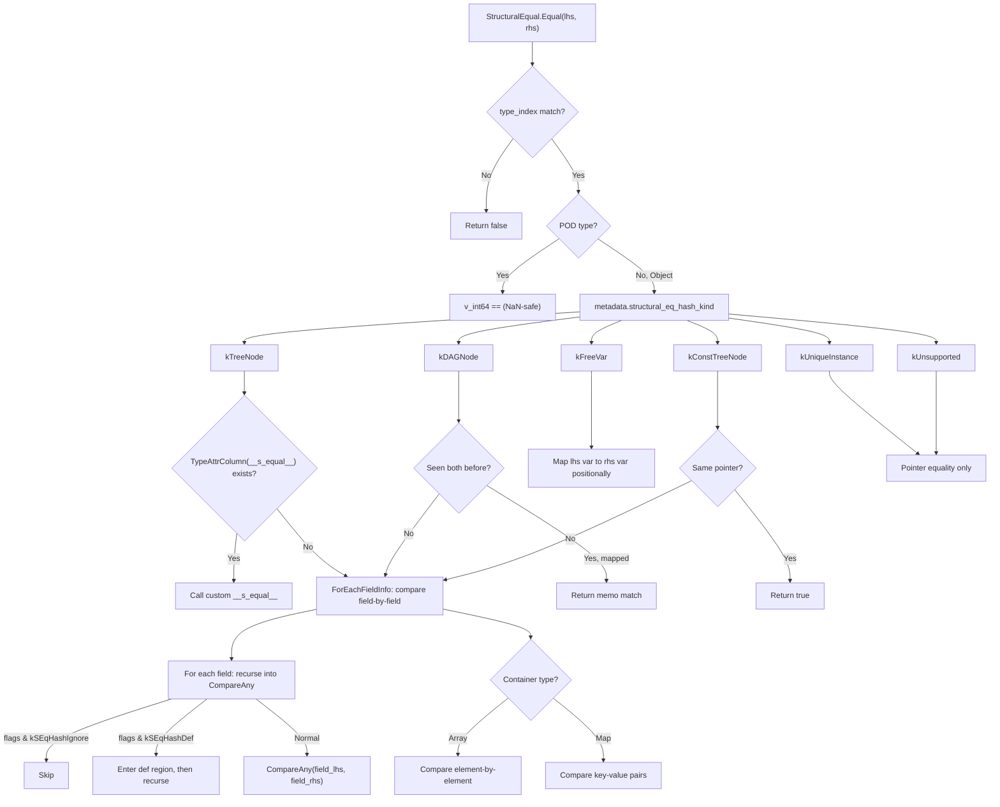

# FFI Structural Equality and Hashing

**TL;DR**.
- `StructuralEqual` and `StructuralHash` (in `tvm::ffi` namespace, `extra/` directory) compare/hash `Any` values by recursively walking reflection-registered fields, with dispatch governed by a per-type `TVMFFISEqHashKind` enum (tree, DAG, free-var, const-tree, unique-instance modes).
- Types can provide custom `__s_equal__`/`__s_hash__` implementations via `TypeAttrDef` registration, which take priority over reflection-driven field iteration. Custom callbacks receive a comparator/hasher function for recursive dispatch.
- `AccessPathObj`/`AccessPath` (parent-pointing tree) and `AccessStep` provide diagnostic error reporting: on mismatch, `GetFirstMismatch` returns the exact field/index/key path to the first differing element, enabling precise error messages.
- `StructuralKey` (6adc8df7) wraps any value with a cached structural hash for use as dictionary/map keys. It registers `__any_hash__`/`__any_equal__` TypeAttr overrides so `Map<Any, Any>` automatically uses structural comparison when keys are `StructuralKey` instances.

## Problem Statement
### Background
- IR nodes (expressions, statements, types) need structural comparison for deduplication, caching, and testing. Previously, this required per-type `SEqualReduce`/`SHashReduce` methods on every Object subclass -- a large maintenance burden.
- The new reflection subsystem registers all fields with typed metadata, enabling automatic field-by-field comparison without per-type boilerplate.

### Solution
- Leverage `ForEachFieldInfo` (parent-to-child field iteration via ancestor pointer chain) to walk all registered fields of an object and compare/hash them recursively.
- Per-type comparison strategy is controlled by `TVMFFISEqHashKind` in `TVMFFITypeMetadata`, set from `Object::_type_s_eq_hash_kind`.
- Types needing custom logic (e.g., interning, normalization) register `__s_equal__`/`__s_hash__` via `TypeAttrDef`, which the handler checks via `TypeAttrColumn` before falling back to reflection.

### Goals
- Automatic structural eq/hash for any type with reflection-registered fields.
- Support for DAG structures (memo-based deduplication), free variables (positional mapping), and constant tree nodes (pointer-equality fast path).
- Diagnostic mismatch paths for debugging structural inequality.
- Non-goal: custom serialization (separate concern, but shares reflection metadata).

## Design



### Key Classes, Fields and Interfaces

```python
# --- Per-Type Comparison Strategy ---

class TVMFFISEqHashKind(IntEnum):
    """Per-type structural comparison strategy. Stored in TVMFFITypeMetadata."""
    kUnsupported = 0        # Fallback to pointer equality
    kTreeNode = 1           # Compare all registered fields recursively
    kFreeVar = 2            # Variable binding: mapped positionally in def regions
    kDAGNode = 3            # Like tree but memo-tracks seen nodes for DAG dedup
    kConstTreeNode = 4      # Tree guaranteed free-var-free; pointer == is fast accept
    kUniqueInstance = 5     # Singleton semantics; pointer equality only
    # Invariant: kUnsupported falls back to pointer comparison (not an error for existing types)
    # Interacts with: TVMFFITypeMetadata.structural_eq_hash_kind
    # Interacts with: Object._type_s_eq_hash_kind (static constexpr on subclasses)
    # Extension: new comparison kinds can be added by extending this enum

# Per-field flags (in TVMFFIFieldFlagBitMask):
# kSEqHashIgnore (1 << 3): field excluded from structural comparison
# kSEqHashDef (1 << 4): field enters "def region" (enables free variable mapping)
# Interacts with: AttachFieldFlag::SEqHashIgnore(), AttachFieldFlag::SEqHashDef()

# --- StructuralEqual ---

class StructuralEqual:
    """Reflection-driven recursive structural equality (tvm::ffi namespace, extra/ directory)."""

    @staticmethod
    def Equal(lhs: Any, rhs: Any, map_free_vars: bool = False,
              skip_tensor_content: bool = False) -> bool: ...
        # Interacts with: TVMFFITypeMetadata.structural_eq_hash_kind
        # Interacts with: ForEachFieldInfo, FieldGetter, TypeAttrColumn("__s_equal__")
        # Invariant: type_index mismatch -> false immediately
        # Invariant: POD types compared by v_int64 bitwise equality (NaN-safe: all NaN == NaN)
        # Invariant: missing metadata or kUnsupported -> TypeError (strict, not silent fallback)

    @staticmethod
    def GetFirstMismatch(lhs: Any, rhs: Any, map_free_vars: bool = False,
                         skip_tensor_content: bool = False) -> Optional[AccessPathPair]: ...
        # Returns None on equality, or (lhs_path, rhs_path) pointing to first mismatch
        # Interacts with: AccessStep (builds reverse path during recursion, reverses for output)

    def __call__(self, lhs: Any, rhs: Any) -> bool:
        return self.Equal(lhs, rhs, map_free_vars=False, skip_tensor_content=True)

# --- StructuralHash ---

class StructuralHash:
    """Reflection-driven recursive structural hashing (tvm::ffi namespace, extra/ directory)."""

    @staticmethod
    def Hash(value: Any, map_free_vars: bool = False,
             skip_tensor_content: bool = False) -> uint64: ...
        # Interacts with: StableHashCombine, StableHashBytes, ForEachFieldInfo, FieldGetter
        # Invariant: consistent with StructuralEqual (equal objects -> same hash)
        # Invariant: NaN-safe: all NaN representations hash to canonical quiet_NaN form

    def __call__(self, value: Any) -> uint64:
        return self.Hash(value)

# --- AccessPath Diagnostics (parent-pointing tree) ---

class AccessKind(IntEnum):
    kAttr = 0               # field access (renamed from kObjectField)
    kArrayItem = 1
    kMapItem = 2
    kAttrMissing = 3        # missing attribute (NEW)
    kArrayItemMissing = 4   # error: expected item not present (renumbered from 3)
    kMapItemMissing = 5     # error: expected key not present (renumbered from 4)

class AccessStepObj(Object):
    """Single step in an access path."""
    kind: AccessKind
    key: Any  # str for field, int for index, Any for map key
    _type_key = "ffi.reflection.AccessStep"
    _type_s_eq_hash_kind = kConstTreeNode

    def StepEqual(self, other: AccessStep) -> bool: ...
        # Interacts with: AnyEqual for deep key comparison

class AccessStep(ObjectRef):
    @staticmethod
    def Attr(field_name: str) -> AccessStep: ...           # was: ObjectField()
    @staticmethod
    def AttrMissing(field_name: str) -> AccessStep: ...    # NEW
    @staticmethod
    def ArrayItem(index: int) -> AccessStep: ...
    @staticmethod
    def ArrayItemMissing(index: int) -> AccessStep: ...
    @staticmethod
    def MapItem(key: Any) -> AccessStep: ...
    @staticmethod
    def MapItemMissing(key: Any = None) -> AccessStep: ...

class AccessPathObj(Object):
    """Parent-pointing tree for space-efficient shared-prefix path representation.
    Replaces the previous Array[AccessStep] type alias."""
    parent: Optional[ObjectRef]   # None for root
    step: Optional[AccessStep]    # None for root
    depth: int32                  # 0 for root
    _type_key = "ffi.reflection.AccessPath"
    _type_s_eq_hash_kind = kConstTreeNode

    def GetParent(self) -> Optional[AccessPath]: ...
    def Extend(self, step: AccessStep) -> AccessPath: ...
        # Invariant: creates new node with self as parent, depth+1
    def Attr(self, field_name: str) -> AccessPath: ...
    def AttrMissing(self, field_name: str) -> AccessPath: ...
    def ArrayItem(self, index: int) -> AccessPath: ...
    def MapItem(self, key: Any) -> AccessPath: ...
    def ToSteps(self) -> Array[AccessStep]: ...
        # Walks parent chain to root, reverses for output
    def PathEqual(self, other: AccessPath) -> bool: ...
        # Fast path on pointer equality, short-circuit on depth mismatch
    def IsPrefixOf(self, other: AccessPath) -> bool: ...
        # Walks other up to self.depth, then delegates to PathEqual

class AccessPath(ObjectRef):
    @staticmethod
    def Root() -> AccessPath: ...
        # Creates path with parent=None, step=None, depth=0
    @staticmethod
    def FromSteps(steps: Iterable[AccessStep]) -> AccessPath: ...
        # Builds path by chaining Root().Extend(step) for each step

AccessPathPair = Tuple[AccessPath, AccessPath]  # (lhs_path, rhs_path)

# --- Custom __s_equal__ / __s_hash__ Protocol ---

def __s_equal__(
    self: ObjectRef,
    other: ObjectRef,
    cmp: TypedFunction[[AnyView, AnyView, bool, AnyView], bool]
) -> bool:
    """Custom structural equality callback registered via TypeAttrDef."""
    # Must call cmp() for each semantically significant field
    # cmp(lhs_field, rhs_field, def_region=False, field_name="name")
    # Invariant: pass def_region=True for fields that bind free variables
    # Invariant: field_name must match the field's reflection name (for AccessPath)
    # Interacts with: StructEqualHandler.CompareAny

def __s_hash__(
    self: ObjectRef,
    init_hash: int64,  # accumulated hash (int64_t, bitcast from uint64_t; changed from uint64_t in 86bbddfd)
    hash: TypedFunction[[AnyView, int64, bool], int64]  # int64_t params (was uint64_t)
) -> int64:  # int64_t return (was uint64_t; bitcast preserves hash bits)
    """Custom structural hash callback registered via TypeAttrDef."""
    # Must call hash() for each significant field and combine results
    # hash(field_value, current_hash, def_region=False)
    # Returns: combined hash (int64_t, bitcast from internal uint64_t)
    # Interacts with: StructuralHashHandler, StableHashCombine
    # Note (86bbddfd): signature changed from uint64_t to int64_t throughout to avoid
    #   triggering the new TypeTraits<Int> overflow check when returning hashes through Any

# Dispatch logic:
# 1. Check TypeAttrColumn("__s_equal__")[type_index]
# 2. If not null -> call custom callback
# 3. Else -> reflection-driven field-by-field comparison
# Custom callbacks registered via:
#   refl::TypeAttrDef<MyObj>()
#       .def("__s_equal__", &MyObj::SEqual)
#       .def("__s_hash__", &MyObj::SHash);
# Columns are pre-ensured at static init via EnsureTypeAttrColumn()

# Registered global functions:
# "ffi.GetFirstStructuralMismatch" -> StructuralEqual::GetFirstMismatch
# "ffi.StructuralHash" -> FFIStructuralHash wrapper (returns int64_t via bitcast from uint64_t; 86bbddfd)
# "ffi.StructuralEqual" -> StructuralEqual::Equal (6adc8df7)
# "ffi.StructuralKey" -> lambda(Any key) -> StructuralKey (constructor, 6adc8df7)
# "ffi.StructuralKeyEqual" -> StructuralKeyEqual (6adc8df7)

# --- StructuralKey (6adc8df7) ---

class StructuralKeyObj(Object):
    """Wraps an arbitrary value with its cached structural hash.
    Enables structural-equality-based dictionary key semantics across C++ and Python."""
    key: Any
    hash_i64: int64  # Cached via StructuralHash::Hash(key) at construction time
    # Invariant: hash_i64 == int64(StructuralHash::Hash(key)) -- computed once at construction
    # Interacts with: StructuralHash::Hash (construction), StructuralEqual::Equal (comparison)
    # Interacts with: __any_hash__ / __any_equal__ TypeAttr columns (Map<Any,Any> dispatch)
    # Extension: wrap any Any-compatible value to get structural dict key semantics

class StructuralKey(ObjectRef):
    """Ref wrapper. Usable as std::unordered_map key via std::hash specialization."""
    def __init__(self, key: Any) -> None: ...
    def __eq__(self, other: StructuralKey) -> bool: ...
        # Fast path: same_as(other) -> true; hash mismatch -> false; else StructuralEqual::Equal
    def __hash__(self) -> int: ...   # returns uint64_t(hash_i64)
    # Interacts with: std::hash<StructuralKey> specialization (delegates to hash_i64)

# TypeAttrDef<StructuralKeyObj>:
#   __any_hash__ -> StructuralKeyHash (returns cached hash_i64)
#   __any_equal__ -> StructuralKeyEqual (structural equality with hash fast-reject)
# Interacts with: Map<Any, Any> container dispatch for key equality/hashing

# Python layer (python/tvm_ffi/structural.py):
def structural_equal(lhs: Any, rhs: Any, map_free_vars: bool = False,
                     skip_tensor_content: bool = False) -> bool: ...
    # Interacts with: _ffi_api.StructuralEqual

def structural_hash(value: Any, map_free_vars: bool = False,
                    skip_tensor_content: bool = False) -> int: ...
    # Masks result with 0xFFFFFFFFFFFFFFFF to convert int64 -> unsigned Python int

def get_first_structural_mismatch(lhs: Any, rhs: Any, map_free_vars: bool = False,
                                  skip_tensor_content: bool = False) -> tuple | None: ...
    # Interacts with: _ffi_api.GetFirstStructuralMismatch
```

### Contracts, Assumptions and Invariants
- **Type mismatch -> false**: If `lhs.type_index != rhs.type_index`, `Equal` returns false immediately without deeper comparison.
- **NaN consistency**: All NaN float representations are treated as equal in comparison and hash to the same canonical value (`quiet_NaN`). This ensures hash/equality consistency.
- **Metadata required**: Objects without registered `TVMFFITypeMetadata` or with `kUnsupported` kind throw `TypeError` rather than silently falling back. Types must explicitly opt in.
- **DAG memo semantics**: For `kDAGNode` types, both `lhs` and `rhs` must map to the same memo slot if either has been seen before. This correctly handles shared subexpressions in DAG IRs.
- **Def region scoping**: When a field has `kSEqHashDef` flag, the comparison enters a "def region" where free variable bindings are established. Variables encountered in this region are mapped positionally (first `lhs` var maps to first `rhs` var, etc.).
- **Field flag interaction**: `kSEqHashIgnore` skips the field entirely (e.g., debug comments). `kSEqHashDef` wraps the field comparison in a def region push/pop.

### Extension Points
- **New types opt in**: Set `static constexpr TVMFFISEqHashKind _type_s_eq_hash_kind = kTreeNode;` on any Object subclass to enable reflection-based comparison.
- **Custom comparison**: Register `__s_equal__`/`__s_hash__` via `TypeAttrDef` for types needing non-standard semantics (e.g., interned strings, normalized expressions).
- **New comparison kinds**: Add values to `TVMFFISEqHashKind` and extend the handler switch for novel comparison strategies.

### Usage Examples

#### Declaring a Type with Structural Equality Support
**Context**: Defining IR nodes with field flags and comparing them.
```cpp
// C++ side: define objects with structural eq support
class TVarObj : public Object {
 public:
  String name;
  static constexpr TVMFFISEqHashKind _type_s_eq_hash_kind = kTVMFFISEqHashKindFreeVar;
  TVM_FFI_DECLARE_OBJECT_INFO_FINAL("ir.Var", TVarObj, Object);
};

class TFuncObj : public Object {
 public:
  Array<TVar> params;
  Array<ObjectRef> body;
  Optional<String> comment;  // changed from String to Optional<String>
  static constexpr TVMFFISEqHashKind _type_s_eq_hash_kind = kTVMFFISEqHashKindTreeNode;
  TVM_FFI_DECLARE_OBJECT_INFO_FINAL("ir.Func", TFuncObj, Object);
};

TVM_FFI_STATIC_INIT_BLOCK() {
  namespace refl = tvm::ffi::reflection;
  refl::ObjectDef<TFuncObj>()
      .def_ro("params", &TFuncObj::params, refl::AttachFieldFlag::SEqHashDef())  // def region
      .def_ro("body", &TFuncObj::body)
      .def_ro("comment", &TFuncObj::comment, refl::AttachFieldFlag::SEqHashIgnore());
}

// Compare: free vars mapped positionally, comments ignored
TVar x("x"), y("y");
TFunc fa({x}, {TInt(1), x}, String("comment a"));
TFunc fb({y}, {TInt(1), y}, String("comment b"));
StructuralEqual()(fa, fb);  // true: x<->y mapped, comments ignored

// Diagnostic path on mismatch (uses parent-pointing tree AccessPath)
TFunc fc({x}, {TInt(1), TInt(2)}, String("c"));
auto mismatch = StructuralEqual::GetFirstMismatch(fa, fc);
// mismatch->first == AccessPath::Root()->Attr("body")->ArrayItem(1)
```

#### Registering Custom __s_equal__ / __s_hash__
**Context**: A type with non-standard comparison semantics.
```cpp
class InternedStringObj : public Object {
 public:
  String value;
  uint64_t intern_id;  // unique interning ID

  static bool SEqual(InternedString self, InternedString other,
                     TypedFunction<bool(AnyView, AnyView, bool, AnyView)> cmp) {
    return self->intern_id == other->intern_id;  // compare by ID, not content
  }
  static uint64_t SHash(InternedString self, uint64_t init_hash,
                         TypedFunction<uint64_t(AnyView, uint64_t, bool)> hash_fn) {
    return StableHashCombine(init_hash, self->intern_id);
  }
  static constexpr TVMFFISEqHashKind _type_s_eq_hash_kind = kTVMFFISEqHashKindTreeNode;
  // ...
};

TVM_FFI_STATIC_INIT_BLOCK() {
  refl::TypeAttrDef<InternedStringObj>()
      .def("__s_equal__", &InternedStringObj::SEqual)
      .def("__s_hash__", &InternedStringObj::SHash);
}
```

#### Using StructuralKey for Structural Dict Keys (6adc8df7)
**Context**: When you need a dictionary/map keyed by structural equality rather than object identity.
```cpp
// C++: StructuralKey in std::unordered_map
#include <tvm/ffi/extra/structural_key.h>
StructuralKey k1(Array<int>{1, 2, 3});
StructuralKey k2(Array<int>{1, 2, 3});  // structurally equal to k1
std::unordered_map<StructuralKey, int> map;
map[k1] = 10; map[k2] = 20;  // overwrites k1's entry
assert(map.size() == 1 && map.at(k1) == 20);
```
```python
# Python: StructuralKey with tvm_ffi.Map and native dict
import tvm_ffi
k1 = tvm_ffi.StructuralKey({"a": [1, 2], "b": [3]})
k2 = tvm_ffi.StructuralKey({"b": [3], "a": [1, 2]})  # structurally equal
m = tvm_ffi.Map({k1: 1, k2: 2})
assert len(m) == 1 and m[k1] == 2  # k2 overwrites k1

d = {k1: "a"}
assert d[k2] == "a"  # works with Python dict via __hash__/__eq__
```

## Implementation Notes
- `StructuralEqual` and `StructuralHash` are implemented in `src/ffi/extra/` (not `reflection/`), gated by `TVM_FFI_USE_EXTRA_CXX_API` CMake option. Headers are in `include/tvm/ffi/extra/`.
- The handler uses `ForEachFieldInfo` to iterate all fields of an object (including inherited fields from parent types) in parent-to-child order.
- `AccessPath` is now a proper Object with parent-pointing tree structure. Each node stores a reference to its parent and a single `AccessStep`. `ToSteps()` walks the parent chain to root and reverses for flat output. This enables compact shared-prefix representation for multiple paths.
- `StableHashBytes` uses an optimized path: 8-byte-aligned reads when possible, falling back to byte-by-byte for unaligned data.
- Container comparison dispatches on static type indices: `kTVMFFIArray` -> element-by-element, `kTVMFFIMap` -> key-value pair comparison, `kTVMFFIShape` -> int64 comparison, `kTVMFFITensor` -> optional data content comparison.

## Alternatives & Trade-offs
### Reflection-Driven vs. Per-Type SEqualReduce Methods
- Pros of reflection: Zero per-type boilerplate. New types automatically get structural comparison when fields are registered. Field flags (`SEqHashIgnore`, `SEqHashDef`) provide fine-grained control.
- Cons: Types with non-standard semantics must register custom callbacks. Reflection iteration has overhead compared to hand-written comparisons.
### TypeAttr Column Dispatch vs. Dedicated Enum Value
- Originally `kCustomTreeNode = 6` was added for custom eq/hash dispatch. This was removed in favor of checking `TypeAttrColumn("__s_equal__")` presence, which is more extensible and doesn't consume enum values.
- Pros of column dispatch: No enum pollution. Multiple types of custom behavior without enum growth. Dynamic registration.
- Cons: Slightly more overhead per dispatch (column lookup vs. integer comparison).

## Evidence
| Commit | Scope | Contribution |
|--------|-------|-------------|
| 9445fe73 | ffi/reflection | Introduced StructuralEqual, StructuralHash, TVMFFISEqHashKind, AccessPath, AttachFieldFlag |
| 2ec11f5f | ffi/c-api | Added kCustomTreeNode (later removed), custom __s_equal__/__s_hash__ protocol |
| 59a837eb | ffi/reflection | Migrated to TypeAttrColumn dispatch, removed kCustomTreeNode, NaN safety |
| 3fc0391e | ffi/extra | Moved to `extra/` directory, renamed AccessKind values, `ffi` namespace |
| f4ede982 | ffi/reflection, ffi/extra | Refactored AccessPath to parent-pointing tree, renamed kObjectField->kAttr, added kAttrMissing |
| 86bbddfd | ffi/type-traits, ffi/extra | Changed __s_hash__ callback and ffi.StructuralHash FFI from uint64_t to int64_t (bitcast); added uint64 overflow check in TypeTraits<Int>::CopyToAnyView |
| 6adc8df7 | ffi/extra, python/ffi-bindings | Introduced StructuralKey wrapper, __any_hash__/__any_equal__ TypeAttr overrides, ffi.StructuralEqual/ffi.StructuralKey globals, tvm_ffi.structural module |
| Plus 2 supporting commits (e52aed53 removed legacy flags, ba0ea87d optimized string hash) |

## Related Design Docs & ADRs
- [0007-reflection.md](0007-reflection.md) -- Reflection field iteration and TypeAttr columns that this subsystem depends on
- [0001-c-abi.md](0001-c-abi.md) -- TVMFFISEqHashKind enum, TVMFFITypeMetadata struct
- [0003-object-system.md](0003-object-system.md) -- Object._type_s_eq_hash_kind convention
- [0006-containers.md](0006-containers.md) -- Container comparison dispatch (Array, Map, Shape, Tensor)
