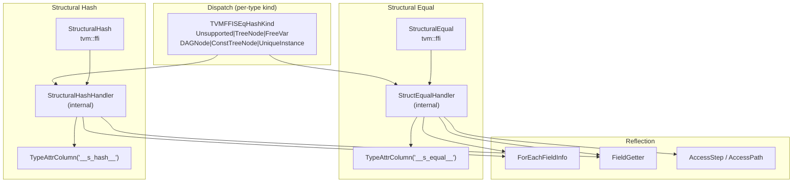
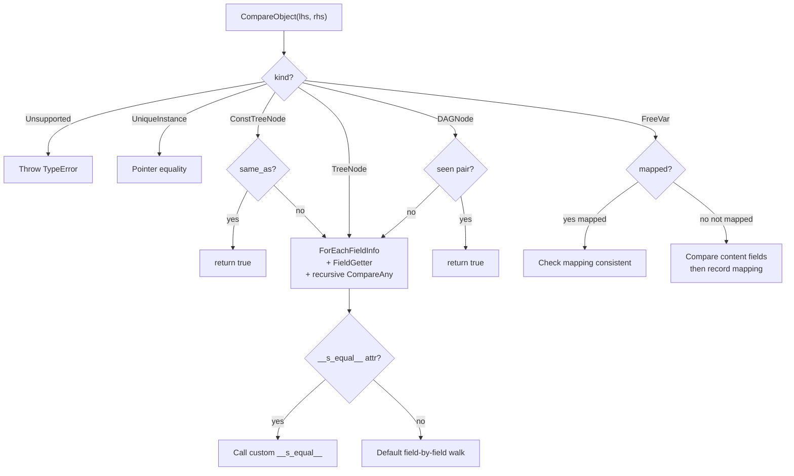

# Structural Equality and Hash

**TL;DR**.
- `StructuralEqual` and `StructuralHash` provide reflection-driven deep comparison and hashing for the entire Any value system -- POD values, strings, containers, and arbitrary object trees/DAGs with optional free-variable mapping (alpha-equivalence).
- Each Object type declares its comparison strategy via `_type_s_eq_hash_kind` (a `TVMFFISEqHashKind` enum): `TreeNode` (recursive field walk), `DAGNode` (with pointer-identity dedup), `FreeVar` (variable mapping), `ConstTreeNode` (pointer-equality fast path), `UniqueInstance` (singleton), or `Unsupported` (error). Types can also register custom `__s_equal__`/`__s_hash__` functions via `TypeAttrDef`.
- `AccessPath` / `AccessStep` types enable structured mismatch reporting -- `GetFirstMismatch` returns the exact field/index/key path where two values diverge.
- **Recursive APIs** (`6b39efb`): `RecursiveHash`, `RecursiveEq`, `RecursiveLt/Le/Gt/Ge` provide a second, simpler comparison engine backed by `ObjectGraphDFS` CRTP iterative traversal. Per-field opt-out via `refl::compare(false)` / `refl::hash(false)` traits and custom hooks via `__ffi_hash__` / `__ffi_eq__` / `__ffi_compare__` TypeAttr columns. These live in `dataclass.h` alongside `DeepCopy` and `ReprPrint`, sharing the same graph-walking engine.

## Problem Statement

### Background
- ML compiler IRs need deep structural comparison for optimization pass correctness (CSE, deduplication) and caching. Simple pointer equality is insufficient because equivalent subexpressions may be distinct objects.
- Free-variable mapping (alpha-equivalence) is needed to compare lambda-like structures where bound variable names differ but structure is identical.
- Previous approaches required per-type `SEqualReduce`/`SHashReduce` virtual methods on every node type, creating tight coupling between the comparison protocol and each IR node.

### Solution
- Leverage the reflection system to walk object fields automatically, eliminating per-type boilerplate. Only types requiring custom comparison logic need to register `__s_equal__`/`__s_hash__` via TypeAttr columns.
- Per-type `TVMFFISEqHashKind` metadata (set via `_type_s_eq_hash_kind` static field, registered through `ObjectDef`) controls the dispatch strategy without modifying the comparison engine.
- `AccessStep`/`AccessPath` provide structured breadcrumbs for diagnosing mismatches.

### Goals
- Automatic structural comparison for any reflected Object type without per-type code.
- Support for tree nodes, DAG nodes (pointer-identity dedup), and free variables (alpha-equivalence).
- Structured mismatch reporting via `AccessPath` for debugging.
- Custom override via `__s_equal__`/`__s_hash__` TypeAttr for types that need non-standard comparison.
- Non-goal: concurrent comparison; comparison across different type hierarchies.

## Design



### Key Classes, Fields and Interfaces

```python
class TVMFFISEqHashKind(IntEnum):
    """Per-type metadata controlling structural comparison strategy."""
    Unsupported = 0       # Throws TypeError on comparison attempt
    TreeNode = 1          # Recursive field-by-field comparison, no dedup
    FreeVar = 2           # Variable that can be mapped across lhs/rhs
    DAGNode = 3           # Like TreeNode but with pointer-identity dedup
    ConstTreeNode = 4     # TreeNode with pointer-equality fast path
    UniqueInstance = 5    # Singleton; always pointer equality
    # Invariant: stored in TVMFFITypeMetadata.structural_eq_hash_kind
    # Interacts with: ObjectDef.RegisterExtraInfo, Object._type_s_eq_hash_kind
    # Extension: add new kinds for new comparison semantics

# New field flag bits in TVMFFIFieldFlagBitMask:
kTVMFFIFieldFlagBitMaskSEqHashIgnore = 1 << 3  # Skip this field during eq/hash
kTVMFFIFieldFlagBitMaskSEqHashDef    = 1 << 4  # Field enters a def region
# Interacts with: TVMFFIFieldInfo.flags, ObjectDef.def_ro/def_rw
# Extension: use AttachFieldFlag.SEqHashIgnore()/SEqHashDef() in registration

class AttachFieldFlag:
    """Trait for per-field SEqHash flags, passed as variadic extra arg to ObjectDef."""
    @staticmethod
    def SEqHashIgnore() -> AttachFieldFlag: ...
        # Interacts with: TVMFFIFieldInfo.flags bit 3
    @staticmethod
    def SEqHashDef() -> AttachFieldFlag: ...
        # Interacts with: TVMFFIFieldInfo.flags bit 4

class AccessKind(IntEnum):
    """Kind of step in a mismatch access path."""
    kAttr = 0             # attribute/field access (was kObjectField)
    kArrayItem = 1
    kMapItem = 2
    kAttrMissing = 3      # attribute not found on one side
    kArrayItemMissing = 4 # renumbered from 3
    kMapItemMissing = 5   # renumbered from 4

class AccessStepObj(Object):
    """Single step in a path through nested objects/containers."""
    _type_key: ClassVar[str] = "ffi.reflection.AccessStep"
    kind: AccessKind
    key: Any               # str for attr, int for array, Any for map
    # Invariant: key type must match kind (str for kAttr/kAttrMissing, int for array, Any for map)
    # Interacts with: AccessPathObj.Extend, StructEqualHandler mismatch reporting

    def StepEqual(self, other: AccessStep) -> bool: ...

class AccessStep(ObjectRef):
    """Ref wrapper for AccessStepObj."""
    @staticmethod
    def Attr(field_name: str) -> AccessStep: ...          # was ObjectField
    @staticmethod
    def AttrMissing(field_name: str) -> AccessStep: ...   # new
    @staticmethod
    def ArrayItem(index: int) -> AccessStep: ...
    @staticmethod
    def ArrayItemMissing(index: int) -> AccessStep: ...
    @staticmethod
    def MapItem(key: Any) -> AccessStep: ...
    @staticmethod
    def MapItemMissing(key: Any) -> AccessStep: ...

class AccessPathObj(Object):
    """Parent-pointing tree for memory-efficient prefix sharing."""
    _type_key: ClassVar[str] = "ffi.reflection.AccessPath"
    parent: Optional[ObjectRef]    # None for root
    step: Optional[AccessStep]     # None for root
    depth: int32                   # 0 for root
    # Invariant: depth == count of steps from root
    # Invariant: parent.depth == depth - 1 when parent exists
    # Interacts with: StructuralEqual.GetFirstMismatch, AccessPathPair

    def GetParent(self) -> Optional[AccessPath]: ...
    def Extend(self, step: AccessStep) -> AccessPath: ...
    def Attr(self, field_name: str) -> AccessPath: ...
    def AttrMissing(self, field_name: str) -> AccessPath: ...
    def ArrayItem(self, index: int) -> AccessPath: ...
    def MapItem(self, key: Any) -> AccessPath: ...
    def ToSteps(self) -> Array[AccessStep]: ...
        # Walks parent chain to root, reverses; O(depth)
    def PathEqual(self, other: AccessPath) -> bool: ...
    def IsPrefixOf(self, other: AccessPath) -> bool: ...
        # Invariant: root is prefix of every path

class AccessPath(ObjectRef):
    """Ref wrapper for AccessPathObj (was Array[AccessStep] type alias)."""
    @staticmethod
    def Root() -> AccessPath: ...
        # Creates path with parent=None, step=None, depth=0
    @staticmethod
    def FromSteps(steps: Array[AccessStep]) -> AccessPath: ...
        # Iteratively extends from root; O(len(steps))

AccessPathPair = Tuple[AccessPath, AccessPath]

class StructuralEqual:
    """Reflection-driven deep structural equality."""
    @staticmethod
    def Equal(lhs: Any, rhs: Any, map_free_vars: bool = False,
              skip_tensor_content: bool = False) -> bool: ...
    # Dispatch:
    #   1. POD: compare type_index and value (v_int64/v_float64/v_uint64)
    #      - NaN normalization: all NaN bit patterns compare equal
    #   2. String/Bytes: memequal on content
    #   3. Array/Shape: element-wise recursive
    #   4. Map: key-set match + value-wise recursive (order-independent)
    #   5. Object: dispatch by TVMFFISEqHashKind from type metadata
    #      - If TypeAttrColumn("__s_equal__") has entry -> call custom function
    #      - Otherwise -> ForEachFieldInfo + FieldGetter recursive compare
    # Invariant: lhs and rhs must be same type_index for object comparison
    # Interacts with: ForEachFieldInfo, FieldGetter, TypeAttrColumn

    @staticmethod
    def GetFirstMismatch(lhs: Any, rhs: Any, map_free_vars: bool = False,
                         skip_tensor_content: bool = False) -> Optional[AccessPathPair]: ...
    # Returns None if equal, otherwise (lhs_path, rhs_path) to first divergence
    # Interacts with: AccessStep (builds reverse path, then reverses)

    def __call__(self, lhs: Any, rhs: Any) -> bool: ...
    # Shorthand: Equal(lhs, rhs, map_free_vars=False, skip_tensor_content=True)

class StructuralHash:
    """Reflection-driven deep structural hash."""
    @staticmethod
    def Hash(value: Any, map_free_vars: bool = False,
             skip_tensor_content: bool = False) -> int: ...
    # Dispatch mirrors StructuralEqual
    #   - NaN normalization: all NaN -> quiet_NaN before hashing
    #   - Map: order-independent (XOR of per-entry hashes)
    #   - Object: type_key_hash seeded, then field hashes combined via StableHashCombine
    # Invariant: consistent with StructuralEqual (equal => same hash)
    # Interacts with: StableHashCombine, StableHashBytes, ForEachFieldInfo, FieldGetter

    def __call__(self, value: Any) -> int: ...
```

### Recursive Comparison APIs (dataclass.h)

Since `6b39efb`, a second comparison/hashing subsystem lives in `dataclass.h`, sharing the `ObjectGraphDFS` CRTP iterative DFS engine with `DeepCopy` and `ReprPrint`. Unlike the `StructuralEqual`/`StructuralHash` system above (which supports free-variable mapping, DAG dedup, and mismatch paths), the Recursive APIs are simpler: they walk object graphs field-by-field with per-field opt-out and custom hook dispatch.

```python
# --- Public C++ APIs (include/tvm/ffi/extra/dataclass.h) ---

def RecursiveHash(value: Any) -> int64: ...
    # Interacts with: ObjectGraphDFS<RecursiveHasher>, __ffi_hash__ TypeAttr hook
    # Invariant: RecursiveEq(a, b) => RecursiveHash(a) == RecursiveHash(b)
    # Invariant: NaN canonicalization — all NaN payloads hash to same value
    # Invariant: signed zero — +0.0 and -0.0 hash identically
    # Extension: register custom __ffi_hash__ via TypeAttrDef for per-type override

def RecursiveEq(lhs: Any, rhs: Any) -> bool: ...
    # Interacts with: ObjectGraphDFS<RecursiveComparer>, __ffi_eq__ TypeAttr hook
    # Invariant: structural equality with cycle detection via paired visit tracking
    # Extension: register custom __ffi_eq__ via TypeAttrDef

def RecursiveLt(lhs: Any, rhs: Any) -> bool: ...
def RecursiveLe(lhs: Any, rhs: Any) -> bool: ...
def RecursiveGt(lhs: Any, rhs: Any) -> bool: ...
def RecursiveGe(lhs: Any, rhs: Any) -> bool: ...
    # Interacts with: __ffi_compare__ TypeAttr hook (3-way comparison)

# --- Internal CRTP engine (src/ffi/extra/dataclass.cc) ---

# class ObjectGraphDFS<Derived, Frame, Result>:
#     """Iterative heap-based DFS over object graphs with cycle/DAG handling."""
#     # Shared by: ObjectDeepCopier, ReprPrinter, RecursiveHasher, RecursiveComparer
#     # Invariant: max stack depth = 1 << 20 (configurable)
#     # Invariant: iterative (not recursive) to handle deep graphs (127+ / 1000+ levels)

# --- Per-field opt-out traits ---

# refl::compare(false) — sets kTVMFFIFieldFlagBitMaskCompareOff (bit 7)
#   Excludes field from RecursiveEq/Lt/etc. and related comparison engines
# refl::hash(false) — sets kTVMFFIFieldFlagBitMaskHashOff (bit 8)
#   Excludes field from RecursiveHash
# Invariant: compare(false) implies hash exclusion (a field excluded from eq must be excluded from hash)

# --- Custom hook TypeAttr names ---
# __ffi_hash__    — custom per-type hash function
# __ffi_eq__      — custom per-type equality function
# __ffi_compare__ — custom per-type 3-way comparison function
# Guard: registering __ffi_eq__ without __ffi_hash__ raises ValueError at runtime

# --- Python bindings (b87196f9, 5796ff4b) ---
# _ffi_api.RecursiveEq, _ffi_api.RecursiveLt/Le/Gt/Ge, _ffi_api.RecursiveHash
# Exposed via typed stubs in _ffi_api.py
```

#### Relationship to StructuralEqual/StructuralHash

| Feature | StructuralEqual/Hash | RecursiveEq/Hash |
|---------|---------------------|------------------|
| Engine | Custom handler-based | ObjectGraphDFS CRTP |
| Free-var mapping | Yes (alpha-equivalence) | No |
| DAG dedup mode | Yes (TVMFFISEqHashKind) | Cycle detection only |
| Mismatch paths | AccessPath reporting | No |
| Per-field opt-out | SEqHashIgnore flag (bit 3) | compare(false)/hash(false) flags (bits 7-8) |
| Custom hooks | `__s_equal__`/`__s_hash__` | `__ffi_hash__`/`__ffi_eq__`/`__ffi_compare__` |
| Ordering | No | RecursiveLt/Le/Gt/Ge |
| Shared with | Standalone | DeepCopy, ReprPrint |

### Object Kind Dispatch



### Contracts, Assumptions and Invariants
- **Hash-equal consistency**: If `StructuralEqual::Equal(a, b)` returns true, then `StructuralHash::Hash(a) == StructuralHash::Hash(b)`. Violations indicate a bug in custom `__s_equal__`/`__s_hash__` implementations.
- **NaN normalization**: All NaN floating-point representations compare equal and hash to the same value (`std::numeric_limits<double>::quiet_NaN()`). This ensures deterministic comparison of IR nodes containing NaN constants.
- **FreeVar mapping**: When `map_free_vars=True`, FreeVar-kind objects encountered in `SEqHashDef` field regions are mapped between lhs/rhs by encounter order. The mapping is scoped to the def region. Outside def regions, FreeVar objects use the established mapping for equality or lexical counter for hashing.
- **DAGNode dedup**: DAGNode-kind objects maintain a visited set of `(lhs_ptr, rhs_ptr)` pairs. If the same pair is encountered again, comparison returns true immediately without re-walking fields. This prevents exponential blowup on shared subexpressions.
- **Unsupported throws**: Types with `_type_s_eq_hash_kind = Unsupported` throw `TypeError` on comparison/hash attempts, never silently falling back to pointer equality.
- **SEqHashIgnore fields**: Fields marked with `kTVMFFIFieldFlagBitMaskSEqHashIgnore` are skipped during comparison and hashing. Useful for metadata fields (comments, source locations) that should not affect semantic equality.

### Extension Points
- **Custom comparison via TypeAttr**: Register `__s_equal__` and `__s_hash__` functions via `TypeAttrDef<MyObj>().def("__s_equal__", ...)` for types that need non-standard comparison logic (e.g., comparing only semantically relevant fields, custom canonicalization).
- **New SEqHashKind values**: Add new enum values to `TVMFFISEqHashKind` for novel comparison semantics. The dispatch in `StructEqualHandler`/`StructuralHashHandler` uses a switch statement that can be extended.
- **Per-field flags**: `AttachFieldFlag::SEqHashIgnore()` and `AttachFieldFlag::SEqHashDef()` can be composed with `DefaultValue` and docstrings as variadic extra args to `ObjectDef::def_ro`/`def_rw`.

### Usage Examples

#### Defining a type with structural equality and comparing instances
**Context**: Defining an IR node type that participates in structural comparison with field-level control.
```cpp
// 1. Define object with structural equality support
class MyNodeObj : public Object {
 public:
  String name;
  int64_t value;
  String comment;  // metadata, not semantically relevant
  static constexpr const char* _type_key = "my.Node";
  static constexpr TVMFFISEqHashKind _type_s_eq_hash_kind =
      kTVMFFISEqHashKindTreeNode;
  TVM_FFI_DECLARE_OBJECT_INFO_FINAL("my.Node", MyNodeObj, Object);
};

// 2. Register reflection with SEqHash flags
TVM_FFI_STATIC_INIT_BLOCK() {
  reflection::ObjectDef<MyNodeObj>()
      .def_ro("name", &MyNodeObj::name)
      .def_ro("value", &MyNodeObj::value)
      .def_ro("comment", &MyNodeObj::comment,
              reflection::AttachFieldFlag::SEqHashIgnore());
}

// 3. Compare: comment field is ignored
Any a = make_MyNode("hello", 1, "draft");
Any b = make_MyNode("hello", 1, "final");
StructuralEqual::Equal(a, b);  // true (comment ignored)

// 4. Diagnose mismatch
Any c = make_MyNode("world", 1, "draft");
auto mismatch = StructuralEqual::GetFirstMismatch(a, c);
// mismatch->first  = AccessPath::Root()->Attr("name")
// mismatch->second = AccessPath::Root()->Attr("name")
```

#### Custom structural equal/hash via TypeAttr
**Context**: A function-like type that needs alpha-equivalence for parameters.
```cpp
class TFuncObj : public Object {
 public:
  Array<TVar> params;
  Array<ObjectRef> body;
  String comment;
  static constexpr TVMFFISEqHashKind _type_s_eq_hash_kind =
      kTVMFFISEqHashKindTreeNode;

  bool SEqual(const TFuncObj* other,
              TypedFunction<bool(AnyView, AnyView, bool, AnyView)> cmp) const {
    // params: def_region=true enables free-var mapping
    return cmp(params, other->params, true, "params") &&
           cmp(body, other->body, false, "body");
    // comment intentionally not compared
  }
  uint64_t SHash(uint64_t init_hash,
                 TypedFunction<uint64_t(AnyView, uint64_t, bool)> hash) const {
    uint64_t h = init_hash;
    h = hash(params, h, true);
    h = hash(body, h, false);
    return h;
  }
};

// Register custom functions via TypeAttrDef
TVM_FFI_STATIC_INIT_BLOCK() {
  reflection::ObjectDef<TFuncObj>()
      .def_ro("params", &TFuncObj::params)
      .def_ro("body", &TFuncObj::body)
      .def_ro("comment", &TFuncObj::comment);
  reflection::TypeAttrDef<TFuncObj>()
      .def("__s_equal__", &TFuncObj::SEqual)
      .def("__s_hash__", &TFuncObj::SHash);
}

// Alpha-equivalence: different var names, same structure
TVar x("x"), y("y");
TFunc fa({x}, {body_using_x}, "a");
TFunc fb({y}, {body_using_y}, "b");
StructuralEqual::Equal(fa, fb, /*map_free_vars=*/true);  // true
```

### Evolution Timeline

| Date | Commit | Change |
|------|--------|--------|
| 2025-07-19 | `9445fe7` | Initial StructuralEqual/StructuralHash with AccessPath, TVMFFISEqHashKind enum (0-5), SEqHash field flags |
| 2025-07-22 | `162d600` | TypeAttr column system introduced; TVMFFITypeExtraInfo renamed to TVMFFITypeMetadata |
| 2025-07-26 | `2ec11f5` | Custom dispatch via TypeAttrColumn `__s_equal__`/`__s_hash__`; `kTVMFFISEqHashKindCustomTreeNode` added (value 6) |
| 2025-07-28 | `59a837e` | Remove `kTVMFFISEqHashKindCustomTreeNode`; unify dispatch via TypeAttrColumn lookup; NaN normalization; callback signature change |
| 2025-07-29 | `e52aed5` | Remove vestigial SEqualReduce/SHashReduce fields from Object base |
| 2025-07-30 | `ba0ea87` | Optimize string equality (memequal) and hash (aligned loads) |
| 2025-07-30 | `3fc0391` | Move to `ffi/extra` namespace; rename AccessStep factories to `ArrayItem`/`MapItem` |
| 2025-08-06 | `f4ede98` | AccessPath promoted from Array[AccessStep] alias to parent-pointing tree Object; kObjectField renamed to kAttr; kAttrMissing added |
| 2026-02-27 | `6b39efb` | Recursive APIs (RecursiveHash/Eq/Lt/Le/Gt/Ge) via ObjectGraphDFS CRTP engine; per-field compare(false)/hash(false) traits; __ffi_hash__/__ffi_eq__/__ffi_compare__ TypeAttr hooks; deep_copy.cc + repr_print.cc consolidated into dataclass.cc |
| 2026-02-27 | `b87196f` | Python bindings for RecursiveEq/Lt/Le/Gt/Ge; TestCompare/TestCustomCompare/TestEqWithoutHash test fixtures; 1272-line test_dataclass_compare.py |
| 2026-02-27 | `5796ff4` | Python binding for RecursiveHash; TestHash/TestCustomHash test fixtures; 971-line test_dataclass_hash.py |

## Alternatives & Trade-offs
### Virtual method per-type (SEqualReduce/SHashReduce)
- Pros: No reflection dependency; each type controls its own comparison directly.
- Cons: Requires every type to implement two virtual methods even for simple field-by-field comparison; tight coupling between comparison protocol and IR node definitions; no automatic field enumeration.

### Hash-consing (rejected for default)
- Pros: O(1) equality via pointer comparison after construction.
- Cons: Requires immutable objects; high construction overhead for interning; cannot support mutation-then-compare workflows common in IR passes.

## Related Work
### Design Records
- `0008-reflection.md` -- ForEachFieldInfo, FieldGetter, TypeAttrDef, TypeAttrColumn power the field walking and custom dispatch
- `0007-c-abi.md` -- TVMFFISEqHashKind enum, TVMFFITypeMetadata, TVMFFIFieldFlagBitMask bits
- `0006-containers.md` -- Array, Map, Shape, String/Bytes comparison and hashing paths
- `0002-object-system.md` -- Object._type_s_eq_hash_kind static field, type hierarchy for ancestor traversal

### Evidence Matrix
- StructuralEqual/StructuralHash protocol -> `commits/2025-07-19-9445fe7...md` + `9445fe7` + `StructuralEqual`, `StructuralHash`, `TVMFFISEqHashKind`
- AccessPath mismatch reporting -> `commits/2025-07-19-9445fe7...md` + `9445fe7` + `AccessStep`, `AccessPath`, `GetFirstMismatch`
- Custom dispatch via TypeAttrColumn -> `commits/2025-07-26-2ec11f5...md` + `2ec11f5` + `__s_equal__`, `__s_hash__`, `TypeAttrDef`
- NaN normalization + callback signature -> `commits/2025-07-28-59a837e...md` + `59a837e` + `isnan`, `quiet_NaN`, hash callback
- ffi/extra namespace isolation -> `commits/2025-07-30-3fc0391...md` + `3fc0391` + `ffi::StructuralEqual`, `extra/structural_equal.h`
- AccessPath tree refactor -> `commits/2025-08-06-f4ede982...md` + `f4ede98` + `AccessPathObj`, `AccessStep::Attr`, `kAttrMissing`
- Plus 4 supporting commits: `162d600` (TypeAttr columns), `e52aed5` (vestigial field removal), `ba0ea87` (string perf), `0342d85` (SmallMap fix)
- RecursiveHash/Eq/Compare APIs + ObjectGraphDFS engine -> `commits/2026-02-27-6b39efbf...md` + `6b39efb` + `RecursiveHash`, `RecursiveEq`, `ObjectGraphDFS`, `refl::compare`, `refl::hash`
- Python recursive compare/hash bindings -> `commits/2026-02-27-b87196f9...md` + `b87196f` / `commits/2026-02-27-5796ff4b...md` + `5796ff4` + `_ffi_api.RecursiveEq`, `_ffi_api.RecursiveHash`
