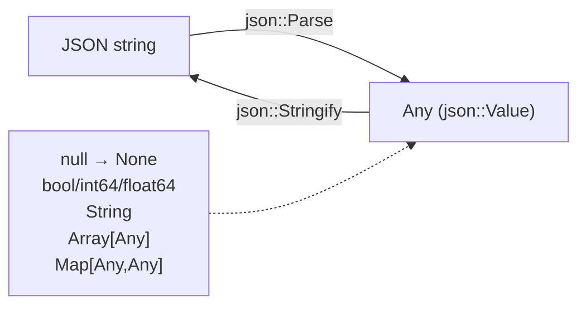

# JSON Subsystem — Parser/Writer and Object-Graph Serialization

**TL;DR**
- The `tvm::ffi::json` namespace (in `include/tvm/ffi/extra/json.h`) provides a lightweight JSON codec that maps directly to existing FFI types: `json::Value = Any`, `json::Object = Map<Any,Any>`, `json::Array = Array<Any>`. No new heap types are introduced.
- `ToJSONGraph`/`FromJSONGraph` serialize any `ffi::Any` value to/from a JSON node-array graph format, preserving shared object identity (DAG structure) and type information via the string type key. String-level wrappers `ToJSONGraphString`/`FromJSONGraphString` compose these with `json::Stringify`/`json::Parse` for Python-friendly cross-language access.
- The `__data_to_json__`/`__data_from_json__` `TypeAttrColumn` protocol provides a per-type custom serialization escape hatch, and `reflection::ObjectCreator` enables reflection-driven construction from a named-field map.

## Problem Statement

### Background
ML frameworks pass structured data (IR nodes, shapes, annotations) between languages and between sessions. Before this subsystem, serialization had to go through Python-side getattr-based attribute traversal — brittle, slow, and not language-agnostic. The existing `Any`/`Map`/`Array` container system already encodes the same value space as JSON primitives; a codec that reuses them eliminates boxing overhead.

### Solution
Two layers:
1. **Primitive JSON codec** (`json::Parse`/`json::Stringify`): Maps JSON tokens 1:1 onto FFI types. `Parse` produces `Any` values holding `nullptr` (null), `bool`, `int64_t`, `double`, `String`, `Map<Any,Any>`, or `Array<Any>`. `Stringify` reverses this.
2. **Object graph serialization** (`ToJSONGraph`/`FromJSONGraph`): Serializes arbitrary `Object` subgraphs (DAGs) by assigning each unique object a node index. Field data is captured via reflection or a custom `__data_to_json__` attribute. `ObjectCreator` reconstructs objects from name→value maps on deserialization.

### Goals
- No new heap types — JSON maps onto existing `Any`/`Map`/`Array`.
- Round-trip for DAGs — shared objects appear once in the node array.
- Cross-language access via global function registry (`ffi.ToJSONGraphString`, etc.).
- Custom serialization via `__data_to_json__`/`__data_from_json__` TypeAttrColumn protocol.
- Correct behavior under `-ffast-math` (IEEE 754 NaN/Inf via union type-punning).
- Non-goal: streaming or incremental parsing.

## Design

### Primitive JSON Codec



### Key Classes, Fields and Interfaces

```python
# ─── include/tvm/ffi/extra/json.h ───────────────────────────────────────────
# namespace tvm::ffi::json
# Compiled only when TVM_FFI_USE_EXTRA_CXX_API=ON (TVM_FFI_EXTRA_CXX_API visibility)

# Type aliases — no new heap types
Value  = Any              # Invariant: valid JSON token (null/bool/int64/float64/String/Object/Array)
Object = Map[Any, Any]    # Invariant: keys are String at serialize time
Array  = ffi.Array[Any]

def Parse(json_str: String, error_msg: Optional[String] = None) -> Value:
    """Parse a JSON string into a Value (Any).
    Extensions beyond strict JSON: Infinity / -Infinity / NaN as JS numeric literals;
    integers with no decimal/exponent parsed as int64_t (not float64).
    On error: if error_msg is provided, writes error there and returns None (no throw).
    Otherwise throws ValueError.
    """
    # Interacts with: JSONParser (internal), JSONParserContext (cursor + error tracking)
    # Interacts with: ffi.json.Parse global function registry entry
    # Invariant: returns None (kTVMFFINone) on error when error_msg is provided

def Stringify(value: Value, indent: Optional[int] = None) -> String:
    """Serialize a Value (Any) to a JSON string.
    indent=None → compact; indent=N → pretty-printed with N-space indentation.
    Float round-trip: integer-valued doubles serialized with '.0' suffix to preserve
    int/float distinction on re-parse. NaN/Inf/−Inf use JS literals.
    Unsupported types throw ValueError.
    """
    # Interacts with: JSONWriter (internal), TypeIndex dispatch on Any.type_index()
    # Invariant: float round-trip via %.17g; NaN/Inf/−Inf use JS literals

# Global function registry entries:
# registry["ffi.json.Parse"]     = json::Parse
# registry["ffi.json.Stringify"] = json::Stringify

# ─── Internal implementation (NOT exported) ──────────────────────────────────

class JSONParserContext:
    """Cursor + error state over a raw string buffer."""
    # Methods: Peek(), SkipNextAssumeNoSpace(), SkipSpaces()
    # NextString(out), NextNumber(out) — parse leaf values
    # MatchLiteral(pattern, len) — used for true/false/null/Infinity/NaN
    # FinalizeErrorMsg() → "msg: line L column C (char N)"
    # Invariant: surrogate pairs decoded to UTF-8 (RFC 8259 §7)
    # Invariant: all IEEE 754 bit-level helpers use union { double; uint64_t } type-punning
    #   (NOT reinterpret_cast) to avoid strict-aliasing violations under -ffast-math

    @staticmethod
    def FastMathSafePosInf() -> float:  # bit-cast from 0x7FF0000000000000ULL under __FAST_MATH__
    @staticmethod
    def FastMathSafeNegInf() -> float:  # bit-cast from 0xFFF0000000000000ULL
    @staticmethod
    def FastMathSafeNaN() -> float:     # bit-cast from 0x7FF8000000000000ULL

class JSONParser:
    """Recursive-descent parser using JSONParserContext."""
    ctx_: JSONParserContext
    array_temp_stack_: List[Any]            # reused across nested arrays (avoid per-array alloc)
    object_temp_stack_: List[Pair[Any,Any]] # reused across nested objects
    # Temp stack → single Array/Map construction from iterator range at end of each value
    # Interacts with: ffi::Array(begin, end) / ffi::Map(begin, end) range constructors

class JSONWriter:
    """Recursive serializer; writes to std::back_insert_iterator<string>."""
    indent_: int        # per-level indent width (0 = compact)
    total_indent_: int  # running depth * indent_
    # WriteValue dispatches on TypeIndex (kTVMFFINone/Bool/Int/Float/SmallStr/Str/Array/Map)
    # Invariant: only Map<Any,Any> whose keys are String are serializable

    @staticmethod
    def FastMathSafeIsNaN(x: float) -> bool:  # union type-pun; not std::isnan under -ffast-math
    @staticmethod
    def FastMathSafeIsInf(x: float) -> bool:  # union type-pun; not std::isinf
```

### Object Graph Serialization

```python
# ─── include/tvm/ffi/extra/serialization.h ───────────────────────────────────
# Compiled only when TVM_FFI_USE_EXTRA_CXX_API=ON

def ToJSONGraph(value: Any, metadata: Any = None) -> json.Value:
    """Serialize any ffi::Any to a JSON object-graph.
    Wire format:
      { "root_index": <int>,
        "nodes": [ {"type": "<type_key>", "data": <type_data>}, ... ],
        "metadata": <optional> }
    Primitive-typed fields (bool/int/float/DataType): data inlined directly.
    Object/container fields: stored as integer node index into nodes[].
    Bytes fields: base64-encoded as JSON strings.
    DLDataType: stored as human-readable string (e.g., "float32").
    DLDevice: stored as [device_type, device_id] int array.
    Shape: special node {"type": "ffi.Shape", "data": [int64, ...]}
    """
    # Interacts with: reflection::ForEachFieldInfo, TVMFFIFieldInfo.field_static_type_index
    # Interacts with: TypeAttrColumn("__data_to_json__") for custom serialization
    # Interacts with: Base64Encode for Bytes fields
    # Invariant: node identity is preserved — equal objects (by pointer) share the same index
    # Registered globally as: "ffi.ToJSONGraph"
    # Extension: register __data_to_json__ on a type to override field-walk serialization

def FromJSONGraph(value: json.Value) -> Any:
    """Deserialize a JSON object-graph back to ffi::Any.
    Reads "root_index" and "nodes"; each node uses "type" to look up type_info
    and "data" to populate fields via ObjectCreator.
    """
    # Interacts with: TVMFFITypeKeyToIndex, TVMFFIGetTypeInfo, TVMFFITypeMetadata.creator
    # Interacts with: reflection::ForEachFieldInfo, TVMFFIFieldInfo.setter
    # Interacts with: TypeAttrColumn("__data_from_json__"), Base64Decode
    # Invariant: value must have "root_index" (int) and "nodes" (array) fields
    # Registered globally as: "ffi.FromJSONGraph"

def ToJSONGraphString(value: Any, metadata: Any = None) -> String:
    """Convenience wrapper: json::Stringify(ToJSONGraph(value, metadata))."""
    # Interacts with: ToJSONGraph, json::Stringify
    # Registered globally as: "ffi.ToJSONGraphString"

def FromJSONGraphString(value: String) -> Any:
    """Convenience wrapper: FromJSONGraph(json::Parse(value))."""
    # Interacts with: json::Parse, FromJSONGraph
    # Registered globally as: "ffi.FromJSONGraphString"

# ─── Internal serializer state ────────────────────────────────────────────────

class ObjectGraphSerializer:
    """Stateful serializer; accumulates nodes in topological order."""
    node_index_map_: Map[Any, int64_t]  # identity dedup: object pointer → node index
    nodes_: json.Array                  # accumulated serialized node objects
    # Invariant: two pointers to the same object always receive the same node index

class ObjectGraphDeserializer:
    """Lazy deserializer; decodes nodes on demand."""
    decoded_nodes_: List[Optional[Any]]  # cache indexed by node position (None = not yet decoded)
    decoded_null_index_: int64_t         # cached position of the null sentinel node (-1 if not found)

# ─── TypeAttrColumn protocol ──────────────────────────────────────────────────
# Pre-allocated in TVM_FFI_STATIC_INIT_BLOCK:
# refl::EnsureTypeAttrColumn("__data_to_json__")
# refl::EnsureTypeAttrColumn("__data_from_json__")

# __data_to_json__: (self: T*) -> json::Value      (typically Map<String, Any>)
# __data_from_json__: (json_data: json::Value) -> T (ObjectRef subtype)
# Extension: register these attrs to override default field-reflection serialization
# Invariant: types providing __data_to_json__ need NOT have a default constructor

# ─── include/tvm/ffi/extra/base64.h ──────────────────────────────────────────

def Base64Encode(bytes: TVMFFIByteArray) -> String:
    """Encode byte array to base64 string (+/ alphabet with '=' padding)."""
    # Interacts with: String (ffi::String), TVMFFIByteArray

def Base64Decode(encoded: str) -> Bytes:
    """Decode base64 string to Bytes; raises ValueError on invalid input."""
    # Interacts with: Bytes (ffi::Bytes)

# ─── include/tvm/ffi/reflection/creator.h ────────────────────────────────────

class ObjectCreator:
    """Reflection-based factory: constructs a registered Object subtype from a
    Map<String, Any> of named field→value pairs.
    Located in tvm::ffi::reflection namespace.
    """
    def __init__(self, type_key: str_view) -> None:
        """Look up type; raise RuntimeError if no metadata or no creator."""
        # Interacts with: TVMFFIGetTypeInfo, TypeKeyToIndex
        # Invariant: type must have TVMFFITypeMetadata.creator != nullptr

    def __call__(self, fields: Map[String, Any]) -> Any:
        """Construct object and apply named fields.
        1. Call metadata.creator() to allocate default-constructed object.
        2. ForEachFieldInfo: apply provided value or default_value if HasDefault flag set;
           raise TypeError if a required field is absent.
        3. Verify no extra unknown keys in fields.
        Returns ObjectRef wrapping the constructed object.
        """
        # Interacts with: TVMFFITypeMetadata.creator, ForEachFieldInfo
        # Interacts with: TVMFFIFieldInfo.setter, kTVMFFIFieldFlagBitMaskHasDefault
        # Interacts with: ObjectUnsafe::ObjectPtrFromOwned (raw handle → ObjectPtr)
        # Invariant: all required fields must appear in fields map
        # Invariant: no unknown field names permitted (TypeError on extra keys)
        # Extension: types opt in by registering a zero-arg default constructor
        # Invariant: contrasts with MakeObjectFromPackedArgs (positional) — this is named
```

### Contracts, Assumptions and Invariants

- `json::Value` is `Any` — the type system already covers all JSON-representable values (null, bool, int64, float64, String, Array, Map). No new heap type is needed; JSON is a view onto the FFI type space.
- `json::Object` keys must be `String` at serialize time; at parse time any `Any` key is accepted, but `Stringify` will throw `ValueError` for non-string keys.
- `ObjectGraphSerializer` guarantees that two pointers to the same `Object` always receive the same node index. This is enforced via `node_index_map_` (identity-based, not structural dedup).
- `FromJSONGraph` requires every deserialized object type to have a registered zero-arg `TVMFFITypeMetadata.creator`. Object types without a default constructor must register `__data_from_json__` to control deserialization.
- `CreateObjectData` returns `json::Value` (not `json::Object`) — a custom `__data_to_json__` handler may return any JSON value (e.g., a plain array for `ffi.Shape`).
- All IEEE 754 special values (NaN, ±Inf) are handled via union-based type-punning in the parser/writer to avoid UB under `-ffast-math` (where `std::isnan`/`std::isinf`/`std::numeric_limits::infinity()` are unreliable).
- `zero_padding` in `TVMFFIAny` must be 0 for all non-small-string values; the JSON writer respects this when writing floats.

### Extension Points

- Register `__data_to_json__`/`__data_from_json__` on any type via `TypeAttrDef<T>` to override the default reflection field-walk serialization.
- New JSON-representable primitive types: extend `JSONWriter::WriteValue` dispatch and `JSONParser` leaf parsers.
- `ObjectCreator` is the named-field sibling of `MakeObjectFromPackedArgs` (positional-field); both rely on `TVMFFITypeMetadata.creator`. Use `ObjectCreator` in deserialization; `MakeObjectFromPackedArgs` in packed-call construction.

### Failure Modes

- Deserializing a type whose `TVMFFITypeMetadata.creator` is null and that has no `__data_from_json__` registered: `FromJSONGraph` throws `RuntimeError`.
- `Stringify` called on an `Any` holding a non-serializable type (e.g., a custom object not registered for `__data_to_json__` and not expressible as a JSON primitive): throws `ValueError`.
- `json::Parse` of deeply nested JSON may overflow the process stack (recursive-descent parser, no explicit recursion limit). Mitigation: caller should validate input size before parsing.
- Union-based type-punning in fast-math helpers is standard C; `reinterpret_cast` approach was UB and was replaced in `3f4f4f1`.

### Usage Examples

#### Primitive parse and navigate (C++)
**Context**: parsing configuration data received as a JSON string.

```cpp
#include <tvm/ffi/extra/json.h>
using namespace tvm::ffi;

// Parse a JSON object (non-throwing path)
String err;
auto val = json::Parse(R"({"key": 42, "arr": [1, 2.5, "x"]})", &err);
// err.empty() → parse succeeded; val.type_index() == kTVMFFIMap
auto obj = val.cast<json::Object>();
auto n   = obj.at(String("key")).cast<int64_t>();  // 42

// Pretty-print
String pretty = json::Stringify(val, 2);
```

#### Cross-layer access via global registry (C++ → Python)
**Context**: Python code round-tripping an object graph through JSON string.

```cpp
// C++ definition (src/ffi/extra/serialization.cc) — registered automatically:
// "ffi.ToJSONGraphString"  → ToJSONGraphString
// "ffi.FromJSONGraphString" → FromJSONGraphString
```

```python
import tvm_ffi
to_str   = tvm_ffi.get_global_func("ffi.ToJSONGraphString")
from_str = tvm_ffi.get_global_func("ffi.FromJSONGraphString")

json_str  = to_str(my_obj, None)   # → str
restored  = from_str(json_str)     # → Any (ObjectRef)
```

#### Object graph round-trip preserving DAG sharing (C++)
**Context**: serializing an IR graph where multiple nodes share a common sub-node.

```cpp
#include <tvm/ffi/extra/serialization.h>

TVar x = TVar("x");
TFunc fa = TFunc({x}, {x, x}, String("comment"));

// Serialize — shared 'x' appears once in nodes[], referenced by index twice
json::Value serialized = ToJSONGraph(fa);
// → {"root_index": N, "nodes": [..., {"type": "test.Var", "data": {...}}, ...]}

// Round-trip
Any recovered = FromJSONGraph(serialized);
assert(StructuralEqual()(recovered, fa));
```

#### Custom serialization via TypeAttrColumn
**Context**: a type needs a non-standard on-wire shape (e.g., a single integer instead of a struct).

```cpp
TVM_FFI_STATIC_INIT_BLOCK({
    refl::TypeAttrDef<TIntObj>()
        .def("__data_to_json__",
             [](const TIntObj* self) -> Map<String, Any> {
                 return Map<String, Any>{{"value", self->value}};
             })
        .def("__data_from_json__", [](Map<String, Any> json_obj) -> TInt {
            return TInt(json_obj.at("value").cast<int64_t>());
        });
});
// Without these, serializer falls back to ForEachFieldInfo field walk.
```

### Evolution Timeline

| Phase | Commits | What changed |
|---|---|---|
| v1: Primitive codec | de541e3 | `json::Parse`/`Stringify`; `json::Value = Any` alias; temp-stack parser; dual-mode error API; global registry |
| v2: Graph serialization | 8eaefe0 | `ToJSONGraph`/`FromJSONGraph`; `__data_to_json__`/`__data_from_json__` TypeAttrColumn; `Base64Encode`/`Decode`; default-constructor requirement |
| v3: ObjectCreator + Shape | 7cb9273 | `reflection::ObjectCreator` (named-field construction); `ffi.Shape` encode/decode path; `CreateObjectData` return type relaxed to `json::Value` |
| v4: String API | 55edee0 | `ToJSONGraphString`/`FromJSONGraphString` wrappers; all four functions registered in global registry |
| v5: Fast-math safety | 1a271f0 + 3f4f4f1 | IEEE 754 bit helpers (`FastMathSafe*`) for NaN/Inf; union-based type-punning replacing UB `reinterpret_cast` |

## Implementation Notes

- All JSON serialization lives in `src/ffi/extra/` and is compiled only when `TVM_FFI_USE_EXTRA_CXX_API=ON`.
- The primitive codec registers `ffi.json.Parse`/`ffi.json.Stringify`; the graph API registers `ffi.ToJSONGraph`/`ffi.ToJSONGraphString`/`ffi.FromJSONGraph`/`ffi.FromJSONGraphString`.
- `JSONParser` reuses two temp stacks across recursive calls to avoid per-value heap allocations during parsing. The final `Array`/`Map` is constructed from an iterator range in one shot.
- `Base64Encode`/`Decode` are header-only (inline) in `base64.h`; no .cc dependency.

## Alternatives & Trade-offs

### Alternative A: Separate JSON value type (e.g., a `JsonValue` ObjectRef)
- Pros: Explicit JSON type; easier to distinguish from arbitrary `Any`.
- Cons: Every `parse` result would need boxing into the new type; doubles the heap allocation cost for every node. The `Value = Any` alias avoids this entirely.

### Alternative B: Schema-based serialization (protobuf / flatbuffers)
- Pros: Strongly typed; efficient binary encoding.
- Cons: Requires per-type schema definitions and generated code; incompatible with the reflection-driven approach; much heavier dependency.

### Decision Record: Temp-stack Parsing vs. Incremental Container Mutation

**Decision**: `JSONParser` accumulates array/object elements in `std::vector` temp stacks, then constructs `ffi::Array`/`ffi::Map` in one shot from iterator ranges.

**Drivers**: `ffi::Array` and `ffi::Map` are immutable — they do not support incremental push_back on an existing container (no `CopyOnWrite`-based push is exposed to external callers). Building from a range is both correct and allocates exactly once.

**Rejected alternative**: Mutable `List`/`Dict` accumulation with a final conversion. This adds an extra copy and requires the extra/ Python-layer types, creating an unwanted dependency.

## Related Design Docs & ADRs
- `.knowledge/design-records/0003-any-anyview.md` — `json::Value = Any`; parsing produces `Any` values
- `.knowledge/design-records/0007-containers.md` — `json::Object = Map<Any,Any>`, `json::Array = Array<Any>`
- `.knowledge/design-records/0006-reflection.md` — `ForEachFieldInfo`, `TypeAttrColumn`, `ObjectCreator`
- `.knowledge/design-records/0001-c-abi.md` — `TVMFFITypeMetadata.creator`, `TVM_FFI_EXTRA_CXX_API`
- `.knowledge/design-records/0009-structural-eq-hash.md` — `StructuralEqual` used in serialization tests
