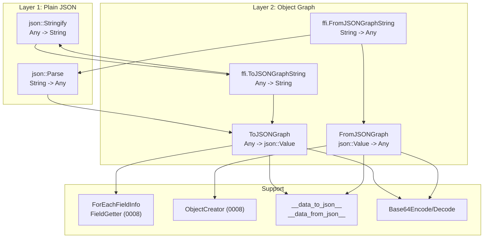

# JSON and Object Graph Serialization

**TL;DR**.
- `json::Parse`/`json::Stringify` provide a lightweight JSON parser/writer in `tvm::ffi::json` namespace, built entirely on existing FFI types (`Any`, `Array<Any>`, `Map<Any,Any>`, `String`). Supports standard JSON plus `Infinity`/`NaN` literals and `int64` integer preservation.
- `ToJSONGraph`/`FromJSONGraph` serialize arbitrary `Any` values (including full object graphs with shared references) to/from a node-indexed JSON format, using reflection to walk fields automatically. Custom per-type serialization via `__data_to_json__`/`__data_from_json__` TypeAttr columns.
- String-based wrappers (`ffi.ToJSONGraphString`/`ffi.FromJSONGraphString`) enable direct cross-language serialization without intermediate `json::Value` objects. Base64 encode/decode utilities support `Bytes` serialization within the JSON graph.

## Problem Statement

### Background
- FFI values need a human-readable, language-independent serialization format for debugging, configuration, and cross-process communication.
- Object graphs may contain shared references (DAG structure) that must be preserved during serialization/deserialization.
- Standard JSON does not distinguish `int64` from `double`, does not support `Infinity`/`NaN`, and has no built-in graph reference mechanism.

### Solution
- A two-layer approach: (1) plain JSON parse/stringify for simple values, (2) a node-indexed graph format for full object graphs with reference deduplication.
- The graph serializer uses reflection (`ForEachFieldInfo`, `FieldGetter`) to walk object fields automatically, falling back to custom `__data_to_json__`/`__data_from_json__` TypeAttr hooks when registered.
- `ObjectCreator` (from reflection system, design record 0008) handles deserialization of reflected object types from field maps.

### Goals
- Roundtrip fidelity: `Parse(Stringify(v)) == v` for supported types, including int vs float distinction.
- Shared reference preservation in object graphs.
- Extensible per-type serialization hooks without modifying core serializer.
- Non-goal: binary serialization (use `Bytes` + base64 within JSON graph for binary data).

## Design



### Key Classes, Fields and Interfaces

```python
# --- Layer 1: Plain JSON (include/tvm/ffi/extra/json.h) ---

# Type aliases (reuses existing FFI types)
json.Value = Any               # JSON values stored as type-erased Any
json.Object = Map[Any, Any]    # JSON objects; insertion-order preserved
json.Array = Array[Any]        # JSON arrays

def json.Parse(json_str: str, error_msg: Optional[str] = None) -> json.Value:
    """Parse a JSON string into an Any value."""
    # Invariant: integers that fit int64 are stored as int64, not double
    # Invariant: supports Infinity, -Infinity, NaN as JS-style float literals
    # Invariant: if error_msg provided, errors written there instead of thrown
    # Extension: extend JSONParserContext for new literal types
    # Interacts with: Any (0001), String, Array<Any> (0006), Map<Any,Any> (0006)

def json.Stringify(value: json.Value, indent: Optional[int] = None) -> str:
    """Serialize an Any value into a JSON string."""
    # Invariant: integer-valued doubles print with ".0" suffix for roundtrip fidelity
    # Invariant: floats use %.17g precision for full double precision
    # Invariant: keys must be strings; raises ValueError otherwise
    # Interacts with: Any (0001), containers (0006)

# Global FFI registrations:
# "ffi.json.Parse" -> json::Parse
# "ffi.json.Stringify" -> json::Stringify

# --- FastMath safety ---
# Under -ffast-math, std::isnan/std::isinf and numeric_limits are broken.
# JSON parser/writer use IEEE 754 bit-level helpers (union-based type punning):
#   FastMathSafePosInf()  -> +Inf via 0x7FF0000000000000
#   FastMathSafeNegInf()  -> -Inf via 0xFFF0000000000000
#   FastMathSafeNaN()     -> quiet NaN via 0x7FF8000000000000
#   FastMathSafeIsNaN(x)  -> bit-level exponent=0x7FF and mantissa!=0
#   FastMathSafeIsInf(x)  -> bit-level exponent=0x7FF and mantissa==0
# Invariant: uses union-based type punning (not reinterpret_cast) to avoid strict-aliasing violations

# --- Layer 2: Object Graph (include/tvm/ffi/extra/serialization.h) ---

def ToJSONGraph(value: Any, metadata: Any = None) -> json.Value:
    """Serialize any FFI value to a JSON object graph with shared-reference preservation."""
    # Output format: {"root_index": int, "nodes": [{"type": key, "data": ...}], "metadata": ...}
    # Interacts with: ForEachFieldInfo, FieldGetter, TypeAttrColumn("__data_to_json__")
    # Invariant: all object types must have TVMFFITypeMetadata registered
    # Invariant: shared references deduplicated via node_index_map_
    # Extension: register __data_to_json__ TypeAttr for custom serialization

def FromJSONGraph(value: json.Value) -> Any:
    """Deserialize a JSON object graph back to FFI values."""
    # Interacts with: ObjectCreator, ForEachFieldInfo, TVMFFIFieldInfo.setter,
    #   TypeAttrColumn("__data_from_json__"), TVMFFITypeInfo.metadata.creator
    # Invariant: JSON must have "root_index" (int) and "nodes" (array) fields
    # Invariant: object types need default constructor + metadata.creator

# String wrappers for cross-language convenience:
# "ffi.ToJSONGraphString"   -> lambda v, meta: json.Stringify(ToJSONGraph(v, meta))
# "ffi.FromJSONGraphString" -> lambda s: FromJSONGraph(json.Parse(s))

# --- TypeAttr serialization protocol ---
# TypeAttrColumn("__data_to_json__"):  (obj: T*) -> json::Value
#   When registered, bypasses automatic reflection-based field walking.
#   Return type is json::Value (not necessarily json::Object), allowing
#   custom types to serialize as arrays, strings, or primitives.
# TypeAttrColumn("__data_from_json__"): (json_data: json::Value) -> T
#   When registered, bypasses default ObjectCreator-based deserialization.

# --- Base64 (include/tvm/ffi/extra/base64.h) ---
def Base64Encode(data: Union[Bytes, TVMFFIByteArray]) -> String:
    """Encode bytes to base64 string."""
def Base64Decode(data: Union[String, TVMFFIByteArray]) -> Bytes:
    """Decode base64 string to bytes."""
    # Invariant: input length must be multiple of 4
```

### JSON Object Graph Format

```python
# Node-indexed graph where shared references are deduplicated:
{
    "root_index": 1,           # index into nodes array
    "nodes": [
        {"type": "ffi.String", "data": "x"},                    # node 0
        {"type": "test.Var", "data": {"name": 0}},              # node 1: name is index to node 0
        {"type": "ffi.Shape", "data": [1, 2, 3]},               # Shape: serialized as int array
    ],
    "metadata": null           # optional user metadata
}
# Rules:
# - Primitive fields (int, float, bool, null, string) stored inline in "data"
# - Object/container references stored as integer indices into "nodes"
# - ffi::Shape serialized as {"type": "ffi.Shape", "data": [i64, ...]}
# - ffi::Bytes serialized with base64-encoded "data" string
```

### Contracts, Assumptions and Invariants
- **Roundtrip property**: `json::Parse(json::Stringify(v)) == v` for all supported types. Integer values roundtrip as int64 (not coerced to double). Float precision preserved via `%.17g`.
- **Graph reference dedup**: Every object pointer appears exactly once in the `nodes` array. Subsequent references use the node index, preserving shared DAG structure.
- **Type registration required**: `ToJSONGraph` requires `TVMFFITypeMetadata` for all object types in the graph. Unregistered types throw `RuntimeError`.
- **Creator required for deserialization**: `FromJSONGraph` needs `TVMFFITypeMetadata.creator` (default constructor) for every object type being deserialized.
- **FastMath safety**: JSON parser/writer use IEEE 754 bit-level helpers for NaN/Infinity, not `std::isnan`/`std::isinf`, ensuring correctness under `-ffast-math` builds.

### Extension Points
- **Custom serialization hooks**: Register `__data_to_json__`/`__data_from_json__` via `TypeAttrDef<T>()` for types that need non-reflection serialization (e.g., types with computed fields, external resources).
- **New JSON literal types**: Extend `JSONParserContext` to parse additional non-standard literals.
- **Build gating**: All JSON/serialization code requires `TVM_FFI_USE_EXTRA_CXX_API` CMake flag.

### Usage Examples

#### Parsing and stringifying JSON
**Context**: Working with JSON values in C++ using FFI types.
```cpp
#include <tvm/ffi/extra/json.h>
using namespace tvm::ffi;

// Parse primitives -- int64 preserved, not coerced to double
int64_t n = json::Parse("123").cast<int64_t>();       // 123
String s = json::Parse("\"hello\"").cast<String>();    // "hello"

// Parse structured data
json::Object obj = json::Parse("{\"a\": 1, \"b\": [2, 3]}").cast<json::Object>();

// Roundtrip with pretty-printing
String pretty = json::Stringify(obj, 2);  // indented output
```

#### Serializing an object graph with shared references
**Context**: Persisting a reflected object tree through JSON, preserving reference sharing.
```cpp
#include <tvm/ffi/extra/serialization.h>

// Serialize object to node-indexed JSON graph
TVar x = TVar("x");
json::Value serialized = ToJSONGraph(x);
// Result: {"root_index": 1, "nodes": [
//   {"type": "ffi.String", "data": "x"},
//   {"type": "test.Var", "data": {"name": 0}}
// ]}

// Deserialize back -- structurally equal to original
Any restored = FromJSONGraph(serialized);

// Cross-language via string wrappers (Python side):
// to_json = get_global_func("ffi.ToJSONGraphString")
// json_str = to_json(my_object, None)
// restored = get_global_func("ffi.FromJSONGraphString")(json_str)
```

#### Custom serialization via TypeAttr hooks
**Context**: A type with computed fields that cannot be walked by reflection.
```cpp
// Register custom serializer
refl::TypeAttrDef<TIntObj>()
    .def("__data_to_json__",
         [](const TIntObj* self) -> Map<String, Any> {
           return Map<String, Any>{{"value", self->value}};
         })
    .def("__data_from_json__", [](Map<String, Any> json_obj) -> TInt {
      return TInt(json_obj["value"].cast<int64_t>());
    });
```

## Alternatives & Trade-offs
### Protocol Buffers / MessagePack (rejected for default)
- Pros: Binary format, smaller payloads, well-defined schemas.
- Cons: Requires schema compilation step; not human-readable; adds external dependency; FFI already has a universal type system (`Any`) so JSON is a natural text encoding.

### Per-type virtual Serialize/Deserialize methods (rejected)
- Pros: Each type controls its own serialization directly.
- Cons: Requires boilerplate on every type; reflection already provides automatic field walking; custom hooks via TypeAttr cover the cases where reflection is insufficient.

## Related Work
### Design Records
- `0001-any-anyview-value-system.md` -- JSON values stored as `Any`; type_index dispatch for serialization
- `0006-containers.md` -- `Array<Any>`, `Map<Any,Any>`, `String`, `Bytes` used as JSON types and in graph format
- `0008-reflection.md` -- `ForEachFieldInfo`, `FieldGetter`, `ObjectCreator`, `TypeAttrDef` power the graph serializer
- `0011-module-system.md` -- Module serialization uses the library binary format, not JSON graph (orthogonal)

### Evidence Matrix
- JSON parser/writer -> `commits/2025-08-04-de541e37...md` + `de541e3` + `json::Parse`, `json::Stringify`
- JSON graph serialization -> `commits/2025-08-05-8eaefe04...md` + `8eaefe0` + `ToJSONGraph`, `FromJSONGraph`, `__data_to_json__`
- ObjectCreator + Shape serialization -> `commits/2025-08-05-7cb92736...md` + `7cb9273` + `ObjectCreator`, `ffi.Shape` round-trip
- String wrappers -> `commits/2025-08-06-55edee05...md` + `55edee0` + `ffi.ToJSONGraphString`, `ffi.FromJSONGraphString`
- FastMath-safe JSON helpers -> `commits/2025-08-15-1a271f00...md` + `1a271f0` + `FastMathSafe*`
- Strict-aliasing fix -> `commits/2025-08-22-3f4f4f11...md` + `3f4f4f1` + union-based type punning
