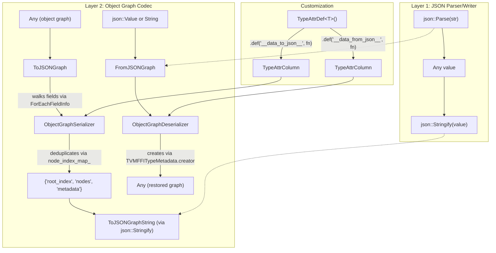

# FFI JSON Serialization Subsystem

**TL;DR**.
- The `tvm::ffi::json` namespace provides `Parse`/`Stringify` for lightweight JSON round-tripping, reusing `Any` as `json::Value`, `Map<Any,Any>` as `json::Object`, and `Array<Any>` as `json::Array` -- no new object types.
- `ToJSONGraph`/`FromJSONGraph` implement reflection-driven object graph serialization with node deduplication and shared reference preservation, producing a `{"root_index", "nodes", "metadata"}` JSON structure. Types can customize serialization via `__data_to_json__`/`__data_from_json__` TypeAttr columns.
- `reflection::ObjectCreator` complements the serialization pipeline by constructing objects from a type key and `Map<String, Any>` of field values, using the reflection metadata system.

## Problem Statement
### Background
- The FFI object system needs a language-neutral serialization format for cross-language persistence, debugging, and inter-process communication. Objects have complex graph structures with shared references (DAGs) that simple key-value serialization cannot represent.
- Before this subsystem, serialization required per-type `Save`/`Load` methods. The reflection subsystem already registers all fields with typed metadata, enabling automatic field-by-field serialization without per-type boilerplate.

### Solution
- A two-layer architecture: (1) a lightweight JSON parser/writer for primitive JSON values, and (2) a graph serializer/deserializer that walks reflection-registered fields, deduplicates shared object references, and produces a flat node array with index-based cross-references.
- Per-type custom serialization hooks (`__data_to_json__`/`__data_from_json__`) follow the same `TypeAttrDef` column pattern as `__s_equal__`/`__s_hash__`.

### Goals
- Round-trippable serialization for any type with reflection-registered fields.
- Shared reference preservation (DAG-safe, not just tree-safe).
- Extensible per-type custom serialization via TypeAttr columns.
- IEEE 754 safe: handles NaN, Infinity, -Infinity correctly even under `-ffast-math`.
- Non-goal: binary serialization format (separate concern via `ProcessLibraryBin`).

## Design



### Key Classes, Fields and Interfaces

```python
# --- Layer 1: Lightweight JSON (include/tvm/ffi/extra/json.h) ---

# Type aliases (no new types; reuse ffi containers):
# json::Value  = Any
# json::Object = Map[Any, Any]   # Invariant: keys are String at runtime
# json::Array  = Array[Any]

def json_parse(json_str: str, error_msg: Optional[str] = None) -> Any:
    """Parse a JSON string into an Any value."""
    # Interacts with: String, Any, Array<Any>, Map<Any,Any>
    # Invariant: integers that fit int64 are returned as int64, not double
    # Invariant: returns None on failure when error_msg is provided; throws ValueError otherwise
    # Extension: supports Infinity, -Infinity, NaN (JS-style literals)
    ...

def json_stringify(value: Any, indent: Optional[int] = None) -> str:
    """Serialize an Any value to a JSON string."""
    # Interacts with: TypeIndex enum for type dispatch
    # Invariant: integer-like doubles emit ".0" suffix to preserve int/float distinction
    # Invariant: NaN -> "NaN", +Inf -> "Infinity", -Inf -> "-Infinity"
    # Extension: indent=N for pretty-printing
    ...

# Global function registration:
# registry["ffi.json.Parse"] = json_parse
# registry["ffi.json.Stringify"] = json_stringify

# --- Layer 2: Object Graph Codec (include/tvm/ffi/extra/serialization.h) ---

def ToJSONGraph(value: Any, metadata: Any = None) -> json.Value:
    """Serialize any FFI value into a JSON object graph with node deduplication."""
    # Output format:
    # {
    #     "root_index": int,           # Index of root node in nodes array
    #     "nodes": [node, ...],        # Array of serialized nodes
    #     "metadata": object           # Optional caller-supplied metadata
    # }
    # Each node: {"type": "<type_key>", "data": <type_data>}
    # Interacts with: ForEachFieldInfo (walks registered fields for object types)
    # Interacts with: TypeAttrColumn("__data_to_json__") (custom per-type serialization)
    # Interacts with: Base64Encode (for Bytes values)
    # Invariant: primitive fields (bool, int, float, DataType) inlined in object data
    # Invariant: non-primitive fields stored as node index references
    # Invariant: objects without TVMFFITypeMetadata raise TypeError
    # Extension: register __data_to_json__ via TypeAttrDef for custom serialization
    ...

def FromJSONGraph(value: json.Value) -> Any:
    """Deserialize a JSON object graph back into FFI values."""
    # Interacts with: TypeAttrColumn("__data_from_json__") (custom deserialization)
    # Interacts with: TVMFFITypeMetadata.creator (default-constructs objects)
    # Interacts with: TVMFFIFieldInfo.setter (sets field values via byte-offset)
    # Invariant: type_key must resolve to a registered type via TVMFFITypeKeyToIndex
    # Invariant: objects must have metadata.creator or __data_from_json__
    # Invariant: required fields without defaults raise TypeError if absent
    ...

def ToJSONGraphString(value: Any, metadata: Any = None) -> str:
    """Convenience: serialize object graph directly to JSON string."""
    # Composes: ToJSONGraph -> json::Stringify
    # Interacts with: Python callers (avoids getattr-based field traversal of json::Value)
    ...

def FromJSONGraphString(json_str: str) -> Any:
    """Convenience: deserialize object graph directly from JSON string."""
    # Composes: json::Parse -> FromJSONGraph
    ...

# Global function registration:
# registry["ffi.ToJSONGraph"] = ToJSONGraph
# registry["ffi.FromJSONGraph"] = FromJSONGraph
# registry["ffi.ToJSONGraphString"] = ToJSONGraphString
# registry["ffi.FromJSONGraphString"] = FromJSONGraphString

# --- ObjectCreator (include/tvm/ffi/reflection/creator.h) ---

class ObjectCreator:
    """Reflection-based factory: creates objects from type key + field map."""
    # Interacts with: TVMFFITypeMetadata.creator, ForEachFieldInfo, TVMFFIFieldInfo.setter
    # Invariant: type must have reflection registered (metadata != None)
    # Invariant: type must have a default constructor (metadata.creator != None)
    # Extension: supports any type registered via ObjectDef<T>

    def __init__(self, type_key: str): ...
    def __init__(self, type_info: TVMFFITypeInfo): ...

    def __call__(self, fields: Map[str, Any]) -> Any:
        """Create object, set provided fields, apply defaults for missing fields."""
        # 1. Call metadata.creator to default-construct
        # 2. ForEachFieldInfo: set from map or apply default
        # 3. Verify no extra fields in map
        # Invariant: raises TypeError for required fields missing from map
        # Invariant: raises TypeError for unknown field names
        ...

# --- Base64 Utilities (include/tvm/ffi/extra/base64.h) ---

def Base64Encode(data: Union[TVMFFIByteArray, Bytes]) -> String:
    """Encode byte array to base64 string."""
    # Invariant: standard base64 encoding with '=' padding
    ...

def Base64Decode(data: Union[TVMFFIByteArray, String]) -> Bytes:
    """Decode base64 string to byte array."""
    # Invariant: input length must be multiple of 4
    # Interacts with: serialization.cc (Bytes serialized as base64 strings)
    ...

# --- Custom JSON TypeAttr Protocol ---
# Per-type custom serialization, analogous to __s_equal__/__s_hash__:
#
# TypeAttrDef<MyObj>()
#     .def("__data_to_json__", [](const MyObj* self) -> json::Value { ... })
#     .def("__data_from_json__", [](Map<String, Any> json_obj) -> MyObj { ... })
#
# Dispatch: serializer checks TypeAttrColumn("__data_to_json__")[type_index]
#           before falling back to reflection-driven field iteration.
# Interacts with: TypeAttrColumn system (0007-reflection)
# Extension: __data_to_json__ return type is json::Value (relaxed from json::Object)
```

### Contracts, Assumptions and Invariants
- **int64/double roundtrip**: Integers that fit `int64` are parsed as `int64`, not `double`. The writer emits `.0` suffix for integer-valued doubles to distinguish them from actual integers.
- **NaN/Infinity handling**: `NaN`, `Infinity`, `-Infinity` are parsed as special `double` values and serialized back as their JS-style literal names. Under `-ffast-math`, construction and detection use IEEE 754 bit-level operations (union-based type punning) to avoid undefined behavior from `std::isnan`/`std::isinf`.
- **Node deduplication**: `ObjectGraphSerializer` uses `Map<Any, int64_t>` keyed by object pointer identity to deduplicate shared references. If two fields point to the same object, they serialize as the same node index. `List<T>` support added (9513c2f8) with cycle detection to handle self-referencing mutable lists.
- **Primitive inlining** (clarified 3b26a09): Five specific `field_static_type_index` values enable inline serialization: `kTVMFFINone` (null), `kTVMFFIBool` (bool), `kTVMFFIInt` (int64), `kTVMFFIFloat` (float64), `kTVMFFIDataType` (DLDataType as string). All other types, including fields declared as `Any` (`kTVMFFIAny = -1`), go through the node-graph path even if their runtime value is a POD type. `kTVMFFIArray`-typed fields report the outer type index, not the element type.
- **Custom hook priority**: `__data_to_json__`/`__data_from_json__` columns are checked before reflection fallback, allowing types to fully control their serialization format.

### Extension Points
- **Custom serializers**: Register `__data_to_json__`/`__data_from_json__` via `TypeAttrDef` for types needing non-standard formats (e.g., `TInt` serializes as `{"value": 42}` instead of walking fields).
- **New built-in codecs**: The serializer has explicit handling for `Shape`, `String`, `Bytes`, `Array`, `Map`. New built-in container types can add handlers in `ObjectGraphSerializer`/`ObjectGraphDeserializer`.

### Usage Examples

#### Lightweight JSON Round-Trip
**Context**: Parsing and serializing plain JSON values.
```cpp
#include <tvm/ffi/extra/json.h>
using namespace tvm::ffi;

// Parse primitives
auto val = json::Parse("42");                    // int64_t
auto arr = json::Parse("[1, \"two\", true]");    // json::Array
auto obj = json::Parse("{\"key\": [1, 2]}");     // json::Object

// Error handling without exceptions
String error_msg;
auto bad = json::Parse("invalid", &error_msg);
// bad == nullptr, error_msg contains line/column info

// Serialize back
json::Object data{{"name", "test"}, {"numbers", json::Array{1, 2, 3}}};
String compact = json::Stringify(data);           // {"name":"test","numbers":[1,2,3]}
String pretty  = json::Stringify(data, 2);        // indented with 2 spaces
```

#### Reflection-Driven Object Graph Serialization
**Context**: Round-tripping a reflected object through JSON.
```cpp
#include <tvm/ffi/extra/serialization.h>

// Define test objects with reflection
TVar x = TVar("x");
TFunc fa = TFunc({x}, {x, x}, String("comment a"));

// Serialize to JSON graph (shared refs preserved)
json::Value serialized = ToJSONGraph(fa);
// Result: {"root_index": 5, "nodes": [
//   {"type": "ffi.String", "data": "x"},
//   {"type": "test.Var", "data": {"name": 0}},       // "name" -> node index 0
//   {"type": "ffi.Array", "data": [1]},
//   {"type": "ffi.Array", "data": [1, 1]},            // shared ref to var x
//   {"type": "ffi.String", "data": "comment a"},
//   {"type": "test.Func", "data": {"params": 2, "body": 3, "comment": 4}}
// ]}

// Deserialize back and verify structural equality
Any deserialized = FromJSONGraph(serialized);
StructuralEqual()(deserialized, fa);  // true

// String convenience wrappers (for Python interop):
String json_str = ToJSONGraphString(fa, NullOpt);
Any restored = FromJSONGraphString(json_str);
```

#### Custom Per-Type JSON Serialization
**Context**: Type with special serialization needs (e.g., opaque value).
```cpp
// Register custom __data_to_json__ / __data_from_json__ for TIntObj
refl::TypeAttrDef<TIntObj>()
    .def("__data_to_json__",
         [](const TIntObj* self) -> Map<String, Any> {
           return Map<String, Any>{{"value", self->value}};
         })
    .def("__data_from_json__", [](Map<String, Any> json_obj) -> TInt {
      return TInt(json_obj["value"].cast<int64_t>());
    });

// TInt(42) serializes as {"type": "test.Int", "data": {"value": 42}}
```

#### Map-Based Object Construction
**Context**: Creating objects dynamically from field dictionaries (used by deserialization).
```cpp
namespace refl = tvm::ffi::reflection;
refl::ObjectCreator creator("test.Int");
TInt obj = creator(Map<String, Any>({{"value", 1}})).cast<TInt>();
assert(obj->value == 1);
```

## Implementation Notes
- The JSON parser is a hand-written recursive-descent parser in `src/ffi/extra/json_parser.cc`. It supports standard JSON plus JS-style `Infinity`/`NaN` and integer detection. A fix (d3b5532f) casts `*cur_` to `uint8_t` before comparing with `' '` to avoid sign-extension of UTF-8 bytes >= 0x80 on signed-char platforms (e.g., ARM Linux), which previously triggered false `SetErrorInvalidControlCharacter()` errors for non-ASCII content.
- The JSON writer in `src/ffi/extra/json_writer.cc` uses union-based type punning (not `reinterpret_cast`) for IEEE 754 bit-level NaN/Inf detection under `-ffast-math`, avoiding strict-aliasing violations.
- `ObjectGraphSerializer` builds a flat node list and uses `Map<Any, int64_t>` with pointer identity to track already-serialized nodes. This means the same Python object appearing in two fields produces one node with two references.
- `ObjectGraphDeserializer` lazily decodes nodes, using `decoded_nodes_` array indexed by node index. Object fields are set via `TVMFFIFieldInfo.setter` (byte-offset + typed setter function pair).
- `ObjectCreator` is used internally by the deserializer and also exposed as a standalone API for programmatic object construction.

## Alternatives & Trade-offs
### JSON-Based vs. Binary Serialization
- Pros of JSON: Human-readable. Easy to debug. Language-neutral.
- Cons: Larger wire size. Slower parse/write than binary. Floating-point precision limited to text representation.
### Graph Deduplication via Node Index vs. JSON $ref
- Pros of node index: Simple flat array. No special JSON extensions. Easy to implement.
- Cons: Requires two-pass read (first allocate all nodes, then resolve references). Not standard JSON schema.
### Custom TypeAttr Hooks vs. Virtual Methods
- Pros of TypeAttr columns: No base class requirement. Dynamic registration. Follows established pattern (`__s_equal__`/`__s_hash__`).
- Cons: Runtime column lookup (mitigated by O(1) type_index array access). Must register at static init.

## Evidence
| Commit | Scope | Contribution |
|--------|-------|-------------|
| de541e3 | ffi/extra | Introduced `json::Parse`, `json::Stringify`, type aliases, global function registration |
| 8eaefe0 | ffi/extra, ffi/reflection | Added `ToJSONGraph`/`FromJSONGraph`, `Base64Encode`/`Base64Decode`, `__data_to_json__`/`__data_from_json__` TypeAttr columns |
| 7cb9273 | ffi/reflection, ffi/extra | Added `ObjectCreator`, Shape serialization, relaxed `CreateObjectData` return type |
| 55edee0 | ffi/extra | Added `ToJSONGraphString`/`FromJSONGraphString` convenience wrappers |
| d3b5532f | ffi/extra, ffi/json | Fixed JSON parser rejecting non-ASCII UTF-8 on signed-char platforms (uint8_t cast) |
| 9513c2f8 | ffi/containers, ffi/extra | Added List support with cycle detection to JSON serialization |
| 3b26a09 | tests/cpp, tests/python | Expanded serialization test coverage (98 tests); clarified field_static_type_index POD inlining semantics |
| Plus 2 supporting commits (1a271f0 fastmath-safe NaN/Inf, 3f4f4f1 strict-aliasing fix) |
| 83efe716 | ffi/extra | Serialization gate changed from `metadata == nullptr` to `!HasCreator(type_info)`, enabling `@py_class` types with `__ffi_new__` |

## Related Design Docs & ADRs
- [0002-any-value-system.md](0002-any-value-system.md) -- `json::Value` is `Any`; parser/writer dispatches on `type_index()`
- [0006-containers.md](0006-containers.md) -- Reuses `Array<Any>`, `Map<Any,Any>`, `String`, `Bytes` as JSON data model
- [0007-reflection.md](0007-reflection.md) -- `ForEachFieldInfo`, `TVMFFITypeMetadata.creator`, TypeAttr column system
- [0009-structural-eq-hash.md](0009-structural-eq-hash.md) -- Uses StructuralEqual for round-trip verification in tests
- [0004-function-system.md](0004-function-system.md) -- Global function registration via `refl::GlobalDef`
- [0025-py-class.md](0025-py-class.md) -- Python-defined FFI types that serialize via `__ffi_new__` + `HasCreator` gate
