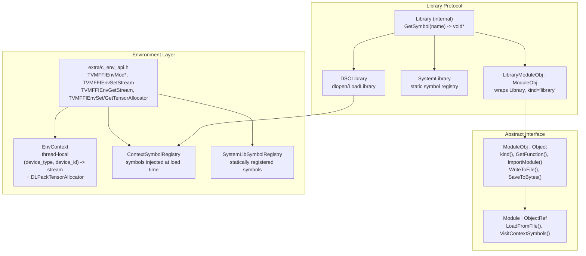

# Module System

**TL;DR**.
- `ModuleObj`/`Module` is the abstract base for dynamically-loadable FFI modules, with virtual methods for function lookup, serialization, source inspection, and import management (with cyclic import detection via BFS).
- Two concrete backends: `DSOLibrary` (dynamic shared library via `dlopen`/`LoadLibrary`) and `SystemLibrary` (statically-registered symbol table), both wrapped by `LibraryModuleObj`.
- Environment context management (`TVMFFIEnvSetStream`/`TVMFFIEnvGetStream`) provides per-device, per-thread stream tracking and tensor allocator dispatch via a thread-local `EnvContext`. Python-level `StreamContext`, `use_raw_stream`, `use_torch_stream` wrappers enable context-managed stream control. Environment C APIs use `TVMFFIEnvMod*` prefix for module-scoped symbols and are located in `extra/c_env_api.h`.

## Problem Statement

### Background
- ML deployment requires loading precompiled kernel libraries at runtime and dispatching functions by name. The FFI layer needs an abstraction for "a loadable unit of functions" that works across platforms (Linux, macOS, Windows, WebAssembly).
- System libraries (statically linked kernels in embedded/AOT deployments) need the same function-lookup interface as dynamically loaded libraries.
- GPU/accelerator workloads require stream context tracking that is shared across FFI libraries without direct coupling between them.

### Solution
- An abstract `ModuleObj` interface with virtual methods for function lookup, serialization, and import tree management. Concrete implementations (`DSOLibrary`, `SystemLibrary`) are wrapped by `LibraryModuleObj`.
- A thread-local `EnvContext` (renamed from `StreamContext` in `f81ab9c`) provides per-device stream tracking and tensor allocator dispatch via the C ABI, decoupled from any specific accelerator SDK.
- Environment C APIs are split between core (`c_api.h`) and extra (`extra/c_env_api.h`), with module-scoped symbols using the `TVMFFIEnvMod*` prefix.

### Goals
- Uniform function lookup interface across DSO, system library, and custom module types.
- Import tree with cyclic dependency detection.
- Cross-platform DSO loading (dlopen on Unix, LoadLibrary on Windows).
- Thread-safe stream context management for multi-device workloads.
- Non-goal: hot-reloading of modules; distributed module loading.

## Design



### Key Classes, Fields and Interfaces

```python
class ModuleObj(Object):
    """Abstract base for dynamically-loadable FFI modules."""
    _type_index: ClassVar[int32] = kTVMFFIModule   # 73
    _type_key: ClassVar[str] = "ffi.Module"
    imports_: Array[Any]  # child modules
    import_lookup_cache_: Map[String, Function]  # weak ref cache

    def kind(self) -> str: ...                     # pure virtual
        # Extension: subclass returns unique string identifying module type
    def GetPropertyMask(self) -> int: ...           # default returns 0
        # Returns bitmask of ModulePropertyMask values
    def GetFunction(self, name: str) -> Optional[Function]: ...  # pure virtual
        # Extension: subclass resolves functions from own namespace
    def GetFunction(self, name: str, query_imports: bool) -> Optional[Function]: ...
        # Interacts with: imports_ array, recursive lookup on each import
    def GetFunctionMetadata(self, name: str) -> Optional[str]:
        """Get metadata for a function (single module). Returns JSON string or None."""
        # Extension: subclass override to return function-specific metadata
        # Default: returns None (nullopt)
    def GetFunctionMetadata(self, name: str, query_imports: bool) -> Optional[str]:
        """Get metadata searching import chain if query_imports=True."""
        # Interacts with: imports_ array (same recursive pattern as GetFunction)
    def GetFunctionDoc(self, name: str) -> Optional[str]:
        """Get documentation for a function. Returns doc string or None."""
        # Extension: subclass override; default returns None
        # Interacts with: __tvm_ffi__doc_<name> symbol lookup (ac7bf68)
    def GetFunctionDoc(self, name: str, query_imports: bool) -> Optional[str]:
        """Get documentation searching import chain if query_imports=True."""
        # Interacts with: imports_ array (same recursive pattern as GetFunction)
    def ImplementsFunction(self, name: str) -> bool: ...
        # Default: checks GetFunction(name) is non-null
    def WriteToFile(self, file_name: str, format: str) -> None: ...
    def GetWriteFormats(self) -> Array[str]: ...
    def SaveToBytes(self) -> Bytes: ...
    def InspectSource(self, format: str = "") -> str: ...
    def ImportModule(self, other: Module) -> None: ...
        # Invariant: BFS cycle detection before appending; throws RuntimeError on cycles
    def ClearImports(self) -> None: ...
    # Interacts with: Object (0002), Function (0003), reflection::ObjectDef (0008)

class Module(ObjectRef):
    """Reference to ModuleObj. Non-nullable, mutable."""

    class ModulePropertyMask(IntEnum):
        kBinarySerializable = 0b001    # implements SaveToBytes
        kRunnable = 0b010              # GetFunction returns runnable functions
        kCompilationExportable = 0b100 # WriteToFile with compilable format

    @staticmethod
    def LoadFromFile(file_name: str) -> Module: ...
        # Interacts with: global registry "ffi.Module.load_from_file.<ext>"
        # Invariant: file_name must have extension; dll/dylib/dso mapped to "so"
        # Python: load_module(path: str | PathLike) accepts pathlib.Path (af898a2)

    @staticmethod
    def VisitContextSymbols(callback: Callable[[str, pointer], None]) -> None: ...
        # Interacts with: ContextSymbolRegistry

# --- Library (internal abstract class, no type_key) ---
class Library:
    """Abstract symbol-lookup interface."""
    def GetSymbol(self, name: str) -> void_ptr: ...
    def GetSymbolWithSymbolPrefix(self, name: str) -> void_ptr:
        """Prepend symbol::tvm_ffi_symbol_prefix ('__tvm_ffi_') and delegate to GetSymbol."""
        # Default: return GetSymbol(tvm_ffi_symbol_prefix + name)
        # Extension: SystemLibrary overrides to also prepend its own symbol_prefix_
        # Interacts with: LibraryModuleObj.GetFunction (now uses this instead of GetSymbol)
    # Interacts with: DSOLibrary, SystemLibrary

class DSOLibrary(Library):
    """Dynamic shared library loader."""
    # Unix: dlopen/dlsym; Windows: LoadLibrary/GetProcAddress
    # Invariant: library handle closed in destructor

class SystemLibrary(Library):
    """Statically-registered symbol table with dual-lookup fallback."""
    # GetSymbol(name): tries symbol_prefix_ + name first, falls back to name (315f4bb)
    # GetSymbolWithSymbolPrefix(name): tries "__tvm_ffi_" + symbol_prefix_ + name first,
    #   falls back to "__tvm_ffi_" + name (315f4bb)
    # Invariant: returns first non-null match; handles names with or without embedded prefix
    # Interacts with: SystemLibSymbolRegistry (populated by TVMFFIEnvModRegisterSystemLibSymbol)

class LibraryModuleObj(ModuleObj):
    """Concrete module wrapping a Library. kind="library"."""
    # GetPropertyMask returns kBinarySerializable | kRunnable
    # GetFunction wraps C-ABI safe_call symbols from the library
    # Interacts with: Library.GetSymbol, TVMFFISafeCallType

# --- Symbol prefix constant (include/tvm/ffi/extra/module.h, 40e8a51) ---
# namespace tvm::ffi::symbol
tvm_ffi_symbol_prefix: str = "__tvm_ffi_"
    # Invariant: all user-facing FFI function symbols in a library are prefixed with this
    # Interacts with: TVM_FFI_DLL_EXPORT_TYPED_FUNC, Library.GetSymbolWithSymbolPrefix
    # Convention: user function symbols use "__tvm_ffi_" (single underscore after "ffi")
    #             internal/infra symbols use "__tvm_ffi__" (double underscore after "ffi")

# --- Well-known library symbols (renamed in 40e8a51) ---
# "__tvm_ffi__library_ctx"       context pointer (extra _ separator for internal symbol)
# "__tvm_ffi__library_bin"       embedded binary data (extra _ separator)
# "__tvm_ffi_main"               default entry function (was "__tvm_ffi_main__")
# "__tvm_ffi__metadata_<name>"   per-function metadata (extra _ separator)
#   Convention: library exports metadata symbol for each function
#   Interacts with: GetFunctionMetadata, LibraryModuleObj

# --- Environment Context (src/ffi/extra/env_context.cc, renamed from stream_context.cc in f81ab9c) ---
TVMFFIStreamHandle = void_ptr  # Opaque handle for device streams

class EnvContext:
    """Thread-local environment context for stream and tensor allocator management."""
    _stream_table: List[List[TVMFFIStreamHandle]]  # 2D, lazily resized
    _dlpack_allocator: DLPackManagedTensorAllocator   # TLS allocator (f81ab9c, renamed 9829dec)
    # Invariant: resizes on demand (never shrinks)
    # Invariant: GetDLPackManagedTensorAllocator checks TLS first, then global static
    # Extension: new device types auto-accommodated via resize
    # Interacts with: TVMFFIEnvSetStream, TVMFFIEnvGetStream,
    #                 TVMFFIEnvSetDLPackManagedTensorAllocator, TVMFFIEnvGetDLPackManagedTensorAllocator

    @staticmethod
    def ThreadLocal() -> EnvContext: ...
        # Singleton per thread via static thread_local

# --- C ABI env functions (extra/c_env_api.h) ---
def TVMFFIEnvModLookupFromImports(library_ctx: handle, func_name: str,
                                  out: handle_ptr) -> int: ...
    # Was TVMFFIEnvLookupFromImports (renamed with Mod prefix)
    # Interacts with: ModuleObj.import_lookup_cache_, global Function registry

def TVMFFIEnvModRegisterContextSymbol(name: str, symbol: void_ptr) -> int: ...
    # Was TVMFFIEnvRegisterContextSymbol
    # Interacts with: ContextSymbolRegistry

def TVMFFIEnvModRegisterSystemLibSymbol(name: str, symbol: void_ptr) -> int: ...
    # Was TVMFFIEnvRegisterSystemLibSymbol
    # Interacts with: SystemLibSymbolRegistry

def TVMFFIEnvSetStream(device_type: int32, device_id: int32,
                       stream: TVMFFIStreamHandle,
                       out_original: Optional[TVMFFIStreamHandle_ptr]) -> int: ...
    # Invariant: stream is weak ref, not freed here
    # Returns: 0=success, nonzero=error

def TVMFFIEnvGetStream(device_type: int32, device_id: int32) -> TVMFFIStreamHandle: ...
    # Returns nullptr if no stream set for this device
    # Renamed from TVMFFIEnvGetCurrentStream in f81ab9c

def TVMFFIEnvSetDLPackManagedTensorAllocator(
    allocator: DLPackManagedTensorAllocator,
    write_to_global_context: int,
    opt_out_original: Optional[DLPackManagedTensorAllocator_ptr]
) -> int: ...
    # Renamed from TVMFFIEnvSetTensorAllocator (f679fe5)
    # Interacts with: EnvContext::ThreadLocal(), global static allocator
    # Invariant: TLS allocator takes precedence over global; save/restore pattern required

def TVMFFIEnvGetDLPackManagedTensorAllocator() -> DLPackManagedTensorAllocator: ...
    # Renamed from TVMFFIEnvGetTensorAllocator (f679fe5)
    # Checks global first, then TLS; returns nullptr if no allocator set

def TVMFFIEnvTensorAlloc(prototype: DLTensor_ptr, out: TVMFFIObjectHandle_ptr) -> int: ...
    # NEW (f679fe5): high-level tensor allocation from environment allocator.
    # Returns a fully-constructed ffi::Tensor (not raw DLManagedTensorVersioned).
    # Keeps metadata allocation inside libtvm_ffi to avoid module unloading order problems.
    # Interacts with: TVMFFIEnvSetDLPackManagedTensorAllocator, Tensor::FromEnvAlloc
    # Invariant: returns -1 and sets error if no allocator configured

def TVMFFIEnvRegisterCAPI(name: str, symbol: void_ptr) -> int: ...
    # Signature changed: was TVMFFIByteArray* -> now const char*
    # Relocated from c_api.h to extra/c_env_api.h

def TVMFFIEnvCheckSignals() -> int: ...
    # Relocated from c_api.h to extra/c_env_api.h

# --- Global function registrations ---
# "ffi.ModuleLoadFromFile"        -> Module::LoadFromFile
# "ffi.ModuleGetFunction"         -> mod.GetFunction(name, query_imports)
# "ffi.ModuleImplementsFunction"  -> mod.ImplementsFunction(name, query_imports)
# "ffi.ModuleGetPropertyMask"     -> mod.GetPropertyMask()
# "ffi.ModuleInspectSource"       -> mod.InspectSource(format)
# "ffi.ModuleGetKind"             -> mod.kind()
# "ffi.ModuleGetWriteFormats"     -> mod.GetWriteFormats()
# "ffi.ModuleWriteToFile"         -> mod.WriteToFile(file_name, format)
# "ffi.ModuleImportModule"        -> mod.ImportModule(other)
# "ffi.ModuleClearImports"        -> mod.ClearImports()
# "ffi.ModuleGetFunctionMetadata" -> mod.GetFunctionMetadata(name, query_imports)
# "ffi.Module.load_from_file.so"  -> DSO loader
# "ffi.SystemLib"                 -> SystemLibModuleRegistry.GetOrCreateModule
```

### Library Binary Format

```python
# Embedded binary data format for "__tvm_ffi_library_bin":
# <nbytes:uint64> <import_tree_CSR> <kind0:str> <val0:bytes> ...
#
# import_tree_CSR: CSR-encoded import tree
#   row_ptr: Array[int], col_idx: Array[int]
#   row_ptr[i]..row_ptr[i+1] = children of module i
#
# Each entry: (kind, value)
#   "_lib" kind marks the DSO module position in the import tree
#   Other kinds identify serialized module types (loaded via "ffi.Module.load_from_bytes.<kind>")
```

### Contracts, Assumptions and Invariants
- **Module unload hazard**: Objects returned by module functions must be destroyed before the module is unloaded. The deleter function address resides in the loaded library's code segment; if the library is unloaded first, calling the deleter invokes an invalid address. Recommended pattern: use a nested function scope so returned objects are freed before the module variable goes out of scope (`a97b7c6`).
- **Cyclic import detection**: `ImportModule` performs BFS before appending. If `other` already imports `this` (directly or transitively), throws `RuntimeError`. This prevents infinite recursion in `GetFunction(name, query_imports=true)`.
- **Import lookup cache**: `import_lookup_cache_` stores weak references to functions found via import chain. The cache is invalidated when imports change.
- **Stream context is per-thread**: `StreamContext` uses `static thread_local`, so stream state is never shared across threads. Each thread starts with no streams set (nullptr for all devices).
- **TVMFFIEnvMod prefix convention**: Module-scoped C API symbols use `TVMFFIEnvMod*` prefix, distinguishing them from general environment APIs (`TVMFFIEnv*`).
- **Build gating**: All module/stream code requires `TVM_FFI_USE_EXTRA_CXX_API` CMake flag.

### Extension Points
- **Custom module types**: Subclass `ModuleObj` and implement `kind()` and `GetFunction()`. Register via `ObjectDef<MyModuleObj>()`.
- **Custom library loaders**: Register `ffi.Module.load_from_file.<ext>` global functions for new file formats.
- **Byte-serializable modules**: Implement `SaveToBytes()`, set `kBinarySerializable` in `GetPropertyMask()`, and register `ffi.Module.load_from_bytes.<kind>`.
- **New device types**: Stream context auto-resizes for new `device_type` values.

### Usage Examples

#### Loading a shared library and calling a function
**Context**: Runtime loading of a precompiled kernel library.
```cpp
#include <tvm/ffi/extra/module.h>

// Load a dynamic shared library
Module mod = Module::LoadFromFile("my_kernel.so");

// Resolve function (also searches imports)
Optional<Function> func = mod->GetFunction("my_kernel", /*query_imports=*/true);
Any result;
(*func)(input_tensor, &result);
```

#### Import tree with cyclic detection
**Context**: Building a module dependency tree safely.
```cpp
Module parent = Module::LoadFromFile("parent.so");
Module child = Module::LoadFromFile("child.so");
parent->ImportModule(child);  // OK
// child->ImportModule(parent);  // throws RuntimeError: cyclic dependency
```

#### Stream context management (C level)
**Context**: Setting CUDA stream for a device before launching kernels.
```c
// Set stream for CUDA device 0
TVMFFIStreamHandle original = NULL;
TVMFFIEnvSetStream(kDLCUDA, 0, my_cuda_stream, &original);
// original holds previously-set stream (or NULL)

// Retrieve current stream
TVMFFIStreamHandle current = TVMFFIEnvGetStream(kDLCUDA, 0);
// current == my_cuda_stream
```

#### Stream context management (Python level, 3197cd09)
**Context**: Python context managers for save/restore stream semantics.
```python
import tvm_ffi

# Raw stream handle
device = tvm_ffi.device("cuda:0")
with tvm_ffi.use_raw_stream(device, cuda_stream_handle):
    # All FFI calls inside here see this stream
    pass  # stream auto-restored on exit

# Torch integration
import torch
with tvm_ffi.use_torch_stream(torch.cuda.stream(my_stream)):
    # Both torch and FFI see the same stream
    pass
```

### Decision Record

**Decision**: Separate env/module C APIs from core `c_api.h` into `extra/c_env_api.h`.

**Drivers**: The core `c_api.h` should contain only the minimal stable ABI needed by all FFI consumers. Module loading, system library registration, and signal checking are higher-level concerns used only by runtime environments (Python, system deployers).

**Alternative A: Keep all C APIs in `c_api.h`**
- Pros: Single header for all C APIs; simpler include graph.
- Cons: Core header grows with every new subsystem; consumers that only need value/function ABI must parse module/env declarations; harder to gate compilation of env code behind `TVM_FFI_USE_EXTRA_CXX_API`.

**Alternative B: Split into `c_api.h` (core) and `extra/c_env_api.h` (env/module)** (chosen)
- Pros: Core header stays minimal; env/module code can be conditionally compiled; clear boundary between ABI essentials and runtime features.
- Cons: Callers of `TVMFFIEnvCheckSignals` must update include paths.

**Decision**: Use `TVMFFIEnvMod*` prefix for module-scoped environment APIs.
- Rationale: Distinguishes module-specific env functions (import lookup, context symbols, system lib symbols) from general env functions (signal checking, stream context). Prevents naming collisions as the env API surface grows.

## Alternatives & Trade-offs
### Plugin-based module system with virtual dispatch (current approach)
- Pros: Familiar OOP pattern; easy to add new module types; import tree provides dependency management.
- Cons: Virtual dispatch overhead for GetFunction (mitigated by import_lookup_cache_); no hot-reloading.

### Flat function registry (no Module abstraction)
- Pros: Simpler; all functions in one global namespace.
- Cons: No encapsulation; no way to represent "this set of functions came from this library"; no serialization grouping; no import tree for dependency tracking.

## Related Work
### Design Records
- `0002-object-system.md` -- ModuleObj extends Object with mutable ref-counted pattern
- `0003-function-system.md` -- GetFunction returns Optional<Function>; LibraryModuleObj wraps C-ABI safe_call
- `0007-c-abi.md` -- C ABI conventions, TVMFFISafeCallType, TVM_FFI_DLL visibility
- `0008-reflection.md` -- ObjectDef<ModuleObj> registers imports_ field; GlobalDef registers 12+ functions
- `0010-json-serialization.md` -- Orthogonal serialization path (JSON graph); Module serialization uses binary format

### Evidence Matrix
- Module interface and LibraryModuleObj -> `commits/2025-08-17-538bef49...md` + `538bef4` + `ModuleObj`, `Module`, `DSOLibrary`, `SystemLibrary`
- Stream context API -> `commits/2025-08-19-0daaffed...md` + `0daaffed` + `TVMFFIEnvSetStream`, `StreamContext`
- Env/module C API relocation and naming -> `commits/2025-08-20-023ea448...md` + `023ea44` + `TVMFFIEnvMod*` prefix
- Plus 1 supporting commit: `6014406` (benchmark script, no lib changes)
- GetFunctionMetadata, tvm_ffi_metadata_prefix -> `commits/2025-08-30-777cf8d5...md` + `777cf8d` + `GetFunctionMetadata`, `tvm_ffi_metadata_prefix`
- Symbol prefix __tvm_ffi_, GetSymbolWithSymbolPrefix, well-known symbol renames -> `commits/2025-09-06-40e8a519...md` + `40e8a51` + `tvm_ffi_symbol_prefix`, `GetSymbolWithSymbolPrefix`
- SystemLibrary dual-lookup fallback for prefixed names -> `commits/2025-09-10-315f4bb0...md` + `315f4bb` + `SystemLibrary::GetSymbol`
- __tvm_ffi_env_stream__ protocol, TVMFFIEnvSetCurrentStream rename -> `commits/2025-09-09-db987299...md` + `db98729` + `__tvm_ffi_env_stream__`, `TVMFFIEnvSetCurrentStream`
- EnvContext (replaces StreamContext), DLPack exchange, GIL release, tensor allocator -> `commits/2025-09-12-f81ab9c2...md` + `f81ab9c` + `EnvContext`, `DLPackTensorAllocator`, `release_gil`
- Python StreamContext, use_raw_stream, use_torch_stream -> `commits/2025-09-15-3197cd09...md` + `3197cd0` + `StreamContext`, `use_raw_stream`, `use_torch_stream`
- get_raw_stream Python API -> `commits/2025-10-08-22c049b8...md` + `22c049b` + `get_raw_stream`
- DLPackTensorAllocator via DLPackExchangeAPI struct -> `commits/2025-10-11-22a78943...md` + `22a78943` + `DLPackExchangeAPI.managed_tensor_allocator`
