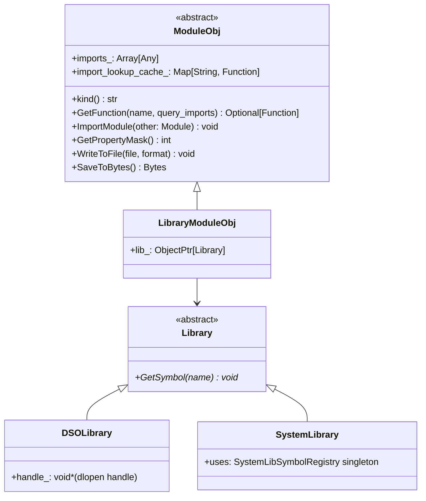

# ffi.Module — Dynamic Module Abstraction

**TL;DR**
- `ffi::Module` (`ModuleObj`/`Module`) is a stable extra-API type at static type index 73 that abstracts over dynamic shared libraries, system libraries, and any user-defined module backend. It exposes `GetFunction`, `ImportModule` (with cycle detection), and a `ModulePropertyMask` for capability discovery.
- Two built-in backends: `DSOLibrary` (dlopen-backed) and `SystemLibrary` (statically linked symbol table). Both implement the internal `Library` interface and are wrapped by `LibraryModuleObj`.
- Kernel code compiled into `.so` files communicates with the host via three C ABI symbols (`TVMFFIEnvModLookupFromImports`, `TVMFFIEnvModRegisterContextSymbol`, `TVMFFIEnvModRegisterSystemLibSymbol`) without a hard link dependency on the TVM runtime.

## Problem Statement

### Background
Compiled kernels (CUDA, Metal, CPU) are loaded at runtime from `.so` files. The prior design embedded a module abstraction in `tvm::runtime::Module`, which pulled in the full runtime. To allow standalone use of the FFI without the runtime, the module abstraction needed to be extracted into the stable `extra/` subsystem.

### Solution
`ffi::Module` defines the interface; backends implement `Library` (raw symbol table) or `ModuleObj` (full function registry). A binary blob format embedded in `.so` files encodes the import tree (CSR layout), allowing multi-library import chains to be reconstructed at load time. The `ContextSymbolRegistry` singleton injects host symbols into loaded `.so` files at load time, decoupling generated code from link-time dependencies.

### Goals
- Stable C++ interface and C ABI for kernel loading and function dispatch.
- Import chaining with cycle detection.
- System-lib support for statically linked code (no dlopen).
- Extension: pluggable loaders via `ffi.Module.load_from_file.<ext>` global functions.
- Non-goal: implement compute or schedule logic — Module is purely a symbol and import container.

## Design



### Key Classes, Fields and Interfaces

```python
# ─── include/tvm/ffi/extra/module.h ──────────────────────────────────────────

class ModuleObj(Object):
    """Abstract base for all managed dynamic modules. Type index = kTVMFFIModule = 73."""
    imports_: Array[Any]                    # protected; imported sub-modules as ObjectRef
    import_lookup_cache_: Map[String, Function]  # private; lazy cache for import lookups
    # Invariant: ImportModule checks for cycles via DFS before adding to imports_
    # Invariant: GetFunction with query_imports=True checks imports_ in order, then global registry

    def kind(self) -> str: ...              # Invariant: pure-virtual; identifies backend type
    def GetPropertyMask(self) -> int: ...   # default=0; bitmask of ModulePropertyMask flags
    def GetFunction(self, name: String, query_imports: bool = False) -> Optional[Function]: ...  # pure-virtual
    def ImplementsFunction(self, name: String, query_imports: bool = False) -> bool: ...
    def WriteToFile(self, file_name: String, format: String) -> None: ...
    def GetWriteFormats(self) -> Array[String]: ...
    def SaveToBytes(self) -> Bytes: ...
    def InspectSource(self, format: String = "") -> String: ...
    def ImportModule(self, other: Module) -> None: ...
    # Invariant: ImportModule DFS cycle check — raises RuntimeError if other transitively imports self
    def ClearImports(self) -> None: ...
    # Interacts with: ModuleObj.InternalUnsafe (import cache), ffi.Function.GetGlobal (fallback)

    def GetFunctionMetadata(self, name: String) -> Optional[String]:
        """Virtual extension point: return JSON metadata string for 'name'; default nullopt."""
        # Invariant: default returns nullopt — backward compatible for all existing subclasses
        # Extension: override in concrete ModuleObj subclass to expose per-function metadata
        # (added commit 777cf8d)
        ...

    def GetFunctionMetadata(self, name: String, query_imports: bool) -> Optional[String]:
        """Non-virtual public entry: checks self, then walks import chain if query_imports=True."""
        # Interacts with: ModuleObj.imports_ (DFS traversal), ffi.ModuleGetFunctionMetadata (global)
        ...

    def GetFunctionDoc(self, name: String) -> Optional[String]:
        """NEW (commit 935a5a07): Virtual extension point: return unstructured docstring for 'name'.
        Default: nullopt — backward compatible for all existing subclasses.
        Semantic split: doc=unstructured/potentially large prose; metadata=focused structured JSON.
        """
        # Invariant: default returns nullopt — backward compatible
        # Extension: override in concrete ModuleObj subclass to expose per-function docs
        # Interacts with: GetFunctionDoc(name, query_imports) (non-virtual public entry)
        ...

    def GetFunctionDoc(self, name: String, query_imports: bool) -> Optional[String]:
        """NEW (commit 935a5a07): Non-virtual public entry — checks self, then walks imports_ chain."""
        # Interacts with: ModuleObj.imports_ (import chain traversal), ffi.ModuleGetFunctionDoc
        ...

    _type_index = TypeIndex.kTVMFFIModule  # 73 (static range)
    _type_key = "ffi.Module"
    _type_final = True  # no subclassing through the type system

class Module(ObjectRef):
    """Not-nullable ref wrapper for ModuleObj.
    Since commit 472e10c: gains explicit ObjectPtr<ModuleObj> constructor with null ICHECK.
    """
    def __init__(self, ptr: ObjectPtr[ModuleObj]) -> None:
        TVM_FFI_ICHECK(ptr != nullptr)  # null check enforced

    class ModulePropertyMask(IntEnum):
        """Capability bitmask."""
        kBinarySerializable    = 0b001  # implements SaveToBytes; loader at ffi.Module.load_from_bytes.<kind>
        kRunnable              = 0b010  # implements GetFunction returning runnable Functions
        kCompilationExportable = 0b100  # implements WriteToFile for export to .o/.cc/.cu

    @staticmethod
    def LoadFromFile(file_name: String) -> Module: ...
    # Dispatches via global "ffi.Module.load_from_file.<ext>"
    # Normalizes .dll/.dylib/.dso extensions → "so" before dispatch
    # Interacts with: ffi.Function.GetGlobal, "ffi.Module.load_from_file.so" registered below
    # Python wrapper: tvm_ffi.load_module(path: str | PathLike) (commit af898a2c: PathLike support added)
    #   Calls os.fspath(path) before delegating to _ffi_api.ModuleLoadFromFile

    @staticmethod
    def VisitContextSymbols(callback: TypedFunction[[String, void*], None]) -> None: ...
    # Iterates ContextSymbolRegistry; used by modules needing host symbols without link dep


# ─── Python-side Module accessors (python/tvm_ffi/module.py) ─────────────────

class Module:  # Python tvm_ffi.Module
    def get_function_metadata(
        self, name: str, query_imports: bool = False
    ) -> dict[str, Any] | None:
        """NEW (commit ac7bf680): Return parsed JSON metadata dict for the function, or None.
        Example return: {"type_schema": '{"origin": "Callable", "args": [...]}'}
        """
        # Interacts with: _ffi_api.ModuleGetFunctionMetadata (C++ registered global)
        # Interacts with: json.loads() to parse the raw JSON string from C++
        # Invariant: returns None when the module does not export metadata for 'name'
        #            (backward compatible — modules compiled without TVM_FFI_DLL_EXPORT_INCLUDE_METADATA)

    def get_function_doc(
        self, name: str, query_imports: bool = False
    ) -> str | None:
        """NEW (commit ac7bf680): Return plain-text docstring for the function, or None.
        Semantic distinction from metadata: doc is unstructured prose (possibly large);
        metadata is focused structured JSON (type schema only).
        """
        # Interacts with: _ffi_api.ModuleGetFunctionDoc (C++ registered global)
        # Invariant: returns None when the module does not export a doc for 'name'


# ─── module symbols (ffi::symbol namespace, updated in commit 40e8a51) ────────

symbol.tvm_ffi_symbol_prefix   = "__tvm_ffi_"               # NEW: canonical prefix for all user FFI function symbols
symbol.tvm_ffi_main            = "__tvm_ffi_main"            # CHANGED: was "__tvm_ffi_main__" (trailing __ removed)
symbol.tvm_ffi_library_ctx     = "__tvm_ffi__library_ctx"    # CHANGED: double-_ after __tvm_ffi (was single)
symbol.tvm_ffi_library_bin     = "__tvm_ffi__library_bin"    # CHANGED: double-_ after __tvm_ffi (was single)
symbol.tvm_ffi_metadata_prefix = "__tvm_ffi__metadata_"      # CHANGED: double-_ after __tvm_ffi (was single)
symbol.tvm_ffi_doc_prefix      = "__tvm_ffi__doc_"           # NEW (commit ac7bf680): docstring symbol prefix
# Convention: internal special symbols (ctx, bin, metadata, doc) use double-_ after __tvm_ffi
#             to avoid conflict with user-exported function symbols that use single-_
# Invariant: metadata symbol = tvm_ffi_metadata_prefix + func_name → const char* JSON {"type_schema": "..."}
# Invariant: doc symbol = tvm_ffi_doc_prefix + func_name → packed safe-call returning String (plain text)
# Interacts with: DSOLibrary::GetSymbol, LibraryModuleObj::GetFunction
# Interacts with: TVM_FFI_DLL_EXPORT_TYPED_FUNC_DOC (emit side), Module.get_function_doc (query side)


# ─── Internal library abstraction (src/ffi/extra/module_internal.h) ──────────

class Library(Object):
    """Abstract interface over a raw symbol table (DSO or system-lib).
    Extension: subclass for each platform (DSOLibrary, SystemLibrary, etc.)
    """
    def GetSymbol(self, name: String) -> void*: ...
    # CHANGED in commit 40e8a51: was const char* name; now takes String& for consistent prefix concat
    # Invariant: returns nullptr if symbol not found

    def GetSymbolWithSymbolPrefix(self, name: String) -> void*:
        """Prepend tvm_ffi_symbol_prefix ('__tvm_ffi_') then delegate to GetSymbol.
        Added in commit 40e8a51.
        """
        # Invariant: SystemLibrary overrides to prepend both tvm_ffi_symbol_prefix + user symbol_prefix_
        # Interacts with: LibraryModuleObj::GetFunction (sole caller; uses this for all user function lookups)
        # Extension: override in new Library subclasses for different prefix schemes

class ModuleObj_InternalUnsafe:
    """Friend struct; grants backdoor access to Module internals for C-ABI bridge."""
    @staticmethod
    def GetImports(module: ModuleObj) -> Array[Any]*: ...
    @staticmethod
    def GetFunctionFromImports(module: ModuleObj, name: str) -> void*:
        # Acquires global mutex; returns raw FunctionObj* as void* (cached by module)
        # Interacts with: import_lookup_cache_ (writes on first lookup)
    @staticmethod
    def RegisterReflection() -> None: ...


def CreateLibraryModule(lib: ObjectPtr[Library]) -> Module: ...
# Factory: reads __tvm_ffi_library_bin from lib; if present, deserializes the import tree
# Import tree binary format (CSR layout):
#   <nbytes:u64><indptr:vec<u64>><child_indices:vec<u64>>
#   followed by <kind:str><bytes:str> pairs (one per node)
#   "_lib" kind is a placeholder for the DSO module itself
# Interacts with: ProcessLibraryBin, LibraryModuleObj, ContextSymbolRegistry


# ─── Registered global functions ─────────────────────────────────────────────
# "ffi.ModuleLoadFromFile"         → Module.LoadFromFile
# "ffi.ModuleGetFunction"          → (Module, String, bool) -> Optional[Function]
# "ffi.ModuleImplementsFunction"   → (Module, String, bool) -> bool
# "ffi.ModuleGetPropertyMask"      → (Module,) -> int
# "ffi.ModuleInspectSource"        → (Module,) -> String
# "ffi.ModuleGetKind"              → (Module,) -> String
# "ffi.ModuleGetWriteFormats"      → (Module,) -> Array[String]
# "ffi.ModuleWriteToFile"          → (Module, String, String) -> None
# "ffi.ModuleImportModule"         → (Module, Module) -> None
# "ffi.ModuleClearImports"         → (Module,) -> None
# "ffi.ModuleGetFunctionMetadata"  → (Module, String, bool) -> Optional[String]  [added commit 777cf8d]
# "ffi.ModuleGetFunctionDoc"       → (Module, String, bool) -> Optional[String]  [added commit 935a5a07]
#   Both exposed via Python Module.get_function_metadata() / Module.get_function_doc() (commit ac7bf680)
# "ffi.Module.load_from_file.so"   → (String, String) -> Module  [DSOLibrary loader]
# "ffi.SystemLib"                  → (String?) -> Module          [system-lib loader]
# "ffi.ModuleGlobalsAdd"           → (Module,) -> None            [commit 8dcaec1f, ModuleGlobals singleton]
# "ffi.ModuleGlobalsRemove"        → (Module,) -> None            [commit 8dcaec1f, ModuleGlobals singleton]


# ─── ModuleGlobals singleton (src/ffi/extra/module.cc, commit 8dcaec1f) ──────

class ModuleGlobals:
    """Thread-safe immortal singleton preventing premature dlclose of loaded modules.

    Rationale: if a Module (.so file) is unloaded (ref-count drops to 0) while Python objects
    created from it (whose deleters reside in the .so) are still alive, the deleters call into
    unmapped memory. ModuleGlobals pins the Module indefinitely.

    # Invariant: modules_ is a Map<Module, int> used as a set (value always 1)
    # Invariant: all mutations protected by mutex_
    # Invariant: Get() returns a immortal pointer — never freed, valid through all shutdown
    # Interacts with: load_module (Python), ModuleGlobalsAdd/ModuleGlobalsRemove (registered globals)
    """
    modules_: Map[Module, int]  # private
    mutex_: std.mutex            # private

    def Add(self, m: Module) -> None: ...
    def Remove(self, m: Module) -> None: ...

    @staticmethod
    def Get() -> ModuleGlobals*:
        """Meyer's singleton — static local function variable, immortal."""


# ─── Python load_module with keep_module_alive (commit 8dcaec1f) ─────────────

def load_module(path: str | PathLike, keep_module_alive: bool = True) -> Module:
    """Load module from file.
    # OLD signature: load_module(path: str | PathLike) -> Module
    # NEW signature: adds keep_module_alive: bool = True
    # Invariant: when keep_module_alive=True, calls _ffi_api.ModuleGlobalsAdd(mod) before returning
    # Invariant: mod is returned to caller regardless of keep_module_alive value
    # Interacts with: _ffi_api.ModuleLoadFromFile, _ffi_api.ModuleGlobalsAdd
    """


# ─── C ABI symbols (include/tvm/ffi/extra/c_env_api.h) ──────────────────────

def TVMFFIEnvModLookupFromImports(
    library_ctx: TVMFFIObjectHandle, func_name: const char*, out: TVMFFIObjectHandle*
) -> int:
    """Look up func_name in module's import chain + global registry; cache result."""
    # Interacts with: ModuleObj::InternalUnsafe::GetFunctionFromImports
    # Renamed from TVMFFIEnvLookupFromImports in commit 023ea44

def TVMFFIEnvModRegisterContextSymbol(name: const char*, symbol: void*) -> int:
    """Add a host symbol to ContextSymbolRegistry for injection at .so load time."""
    # Interacts with: ContextSymbolRegistry.Global, CreateLibraryModule
    # Renamed from TVMFFIEnvRegisterContextSymbol in commit 023ea44

def TVMFFIEnvModRegisterSystemLibSymbol(name: const char*, symbol: void*) -> int:
    """Register a symbol in SystemLibSymbolRegistry (for statically linked modules)."""
    # Interacts with: SystemLibSymbolRegistry.Global
    # Renamed from TVMFFIEnvRegisterSystemLibSymbol in commit 023ea44
```

### Macro Expansion (TVM_FFI_DECLARE_STATIC_OBJECT_INFO for ModuleObj)

```python
# TVM_FFI_DECLARE_STATIC_OBJECT_INFO used for ModuleObj (static type index):
# generates in ModuleObj:
#   static constexpr int32_t _type_index = TypeIndex::kTVMFFIModule;  # 73
#   static constexpr const char* _type_key = "ffi.Module";
#   static TVMFFITypeInfo* RuntimeTypeInfo();  # returns pointer to static TypeInfo
#   static int32_t _GetOrAllocRuntimeTypeIndex();
# Invariant: no call to TVMFFIGetOrAllocTypeIndex — uses fixed slot 73
# Interacts with: Object::GetRuntimeTypeIndex() on any ModuleObj instance
```

### Contracts, Assumptions and Invariants

- `kTVMFFIModule = 73` is reserved in the static type index range `[64, 127]`. Assigning this slot to any other type is a hard ABI break.
- `ImportModule` enforces acyclicity via DFS before adding to `imports_`. The check is O(n) in the depth of the import tree. Cycles throw `RuntimeError`.
- `GetFunction` with `query_imports=True` searches `imports_` in insertion order, then falls back to the global function registry. Results are cached in `import_lookup_cache_` (lazily, under a global mutex).
- The `__tvm_ffi_library_ctx` symbol in a loaded `.so` is a `void**` that the loader writes with a pointer to the owning `LibraryModuleObj` at load time. Generated kernel code passes this pointer to `TVMFFIEnvModLookupFromImports` to resolve import-chain symbols without a link-time dependency.
- The import tree binary blob (`__tvm_ffi_library_bin`) uses a CSR (Compressed Sparse Row) structure: `indptr[i]` gives the start of node `i`'s children in `child_indices`. The `"_lib"` kind is a placeholder for the top-level DSO module itself (no bytes stored for it).
- `ContextSymbolRegistry` is a singleton; symbols registered before loading a `.so` are injected at `CreateLibraryModule` time. Order matters: register before loading.

### Failure Modes

- **Module-unload-before-object-deletion hazard (commit a97b7c60)**: If a `Module` (backed by a loaded `.so`) goes out of scope before objects it created are destroyed, the objects' deleters (which reside in the `.so` code segment) will call into unmapped memory after `dlclose`. **Mitigation (commit 8dcaec1f)**: `load_module(path, keep_module_alive=True)` (default) inserts the Module into `ModuleGlobals` singleton, preventing `dlclose` until process exit. Pass `keep_module_alive=False` only when managing module lifetime manually (e.g., short-lived test fixtures that explicitly call `gc.collect()` + `del mod`). String metadata/doc `String` objects are exempt from the hazard since commit `dcacb98d` (they are allocated in `libtvm_ffi`, not in the loaded `.so`).
- `Module::LoadFromFile("kernel.so")` when `ffi.Module.load_from_file.so` is not registered: throws `RuntimeError` ("no loader found for extension so"). Mitigation: ensure the extra/ library is linked.
- `ImportModule` with a circular import chain: throws `RuntimeError("Cycle detected in module imports")`. Call `ClearImports()` before restructuring.
- `GetFunction` on a module that does not implement a function and `query_imports=False`: returns `Optional<Function>(nullopt)`. Caller must handle the missing-function case.
- `TVMFFIEnvModLookupFromImports` called with an invalid `library_ctx` pointer: UB (no bounds check). The pointer must be the `void**` written by `CreateLibraryModule`.

### Extension Points

- Register a new file extension loader: `GlobalDef().def("ffi.Module.load_from_file.<ext>", loader_fn)` in a `TVM_FFI_STATIC_INIT_BLOCK`.
- Register a new binary-load handler: `GlobalDef().def("ffi.Module.load_from_bytes.<kind>", loader_fn)` for a module kind that sets `kBinarySerializable`.
- Subclass `Library` for a new symbol source (e.g., embedded WASM module, remote symbol table).
- Subclass `ModuleObj` for a new module backend (e.g., CUDA PTX module). Register with `ObjectDef<MyModuleObj>()`.

### Usage Examples

#### Load a DSO and call a function
**Context**: host code loading a compiled kernel `.so` and invoking it.

```cpp
#include <tvm/ffi/extra/module.h>
using namespace tvm::ffi;

Module mod = Module::LoadFromFile("kernel.so");
// "ffi.Module.load_from_file.so" handler registered automatically by extra/ init

Optional<Function> fn = mod->GetFunction("__tvm_main__", /*query_imports=*/true);
if (fn) { (*fn)(/* packed args */); }

// Import another module for symbol resolution
Module helper = Module::LoadFromFile("helper.so");
mod->ImportModule(helper);  // throws if helper transitively imports mod
```

#### Statically linked system library
**Context**: code that registers its symbols at startup and retrieves the system lib module.

```cpp
// Generated kernel (compiled C) — called at startup:
TVMFFIEnvModRegisterSystemLibSymbol("my_kernel",
    reinterpret_cast<void*>(&my_kernel_impl));

// Host — retrieves the system lib module:
auto sys_func = tvm::ffi::Function::GetGlobal("ffi.SystemLib");
Module sys = (*sys_func)();  // or with prefix: (*sys_func)("prefix_")
Optional<Function> fn = sys->GetFunction("my_kernel");
```

#### GetFunctionMetadata — querying per-function metadata
**Context**: a module backend that attaches JSON metadata to each kernel function (cross-layer: C++ → Python).

```cpp
// C++: override virtual method in a concrete ModuleObj subclass
class MyModuleObj : public ModuleObj {
  Optional<String> GetFunctionMetadata(const String& name) override {
    if (name == "my_kernel")
      return String("{\"num_args\": 3, \"dtype\": \"float32\"}");
    return std::nullopt;
  }
};
```

```python
# Python (old path): access via global function registry
get_meta = tvm_ffi.get_global_func("ffi.ModuleGetFunctionMetadata")
meta = get_meta(my_module, "my_kernel", True)  # query_imports=True walks import chain
# meta -> str (JSON) or None

# Python (new path, commit ac7bf680): direct Module method
import tvm_ffi
mod = tvm_ffi.load_module("my_kernel_lib.so")
meta = mod.get_function_metadata("my_kernel")  # returns dict or None
# -> {"type_schema": '{"origin": "Callable", "args": [...], "ret": {...}}'}
doc = mod.get_function_doc("my_kernel")
# -> "Add one to an integer.\n\nParameters\n----------\n..."
```

#### Embedded function doc + metadata — kernel library (cross-layer: C++ define → Python query)
**Context**: A kernel library author wants to expose type schemas and docs to Python consumers without out-of-band documentation.

```cpp
// my_kernel_lib.cc — enable metadata embedding
#define TVM_FFI_DLL_EXPORT_INCLUDE_METADATA 1
#include <tvm/ffi/function.h>

TVM_FFI_DLL_EXPORT_TYPED_FUNC(add_one, [](int x) -> int { return x + 1; });
TVM_FFI_DLL_EXPORT_TYPED_FUNC_DOC(add_one, "Add one to an integer.");
```

```python
# Python consumer
mod = tvm_ffi.load_module("my_kernel_lib.so")
print(mod.get_function_doc("add_one"))       # "Add one to an integer."
print(mod.get_function_metadata("add_one"))  # {"type_schema": '...'}
fn = mod.get_function("add_one")
print(fn(41))  # 42
```

#### Python extension package pattern
**Context**: distributing a C++ kernel library as a pip wheel that depends on `tvm_ffi` (from `examples/packaging/`, commit `4523a83`).

```python
# 1. base.py — load the .so (registers all C++ globals under "tvm_ffi_extension.*")
import tvm_ffi, os
_LIB = tvm_ffi.load_module(os.path.join(os.path.dirname(__file__), "lib", "tvm_ffi_extension.so"))

# 2. _ffi_api.py — auto-map C++ globals into Python
import tvm_ffi
from .base import _LIB   # ensure lib loaded
tvm_ffi.init_ffi_api("tvm_ffi_extension", __name__)  # was _init_api before commit 40f4d9d

# 3. __init__.py — public API
from .base import _LIB
from . import _ffi_api

def add_one(x, y): return _ffi_api.add_one(x, y)
```

```cmake
# CMakeLists.txt — locate tvm_ffi at build time
# Preferred: standard find_package (commit df04392 moved config to share/cmake/tvm_ffi/)
find_package(Python COMPONENTS Interpreter REQUIRED)
find_package(tvm_ffi CONFIG REQUIRED)
# CMake discovers tvm_ffi automatically via Python's sys.prefix search path.
# No execute_process boilerplate needed for pip-installed tvm_ffi.

# Or from source (still works):
execute_process(COMMAND python -m tvm_ffi.config --sourcedir
    OUTPUT_VARIABLE TVM_FFI_SRC_DIR OUTPUT_STRIP_TRAILING_WHITESPACE)
add_subdirectory(${TVM_FFI_SRC_DIR} tvm_ffi_build EXCLUDE_FROM_ALL)
```

#### Kernel code resolving host symbols via C ABI (no link dependency)
**Context**: generated C kernel code in a `.so` that calls a host-provided helper.

```c
/* Generated C kernel code in kernel.so — no link dep on TVM runtime */
#include <tvm/ffi/c_api.h>       /* only C header needed */
extern void** __tvm_ffi_library_ctx;

TVMFFIObjectHandle helper_fn = NULL;
TVMFFIEnvModLookupFromImports(*__tvm_ffi_library_ctx, "host_helper_fn", &helper_fn);
/* helper_fn is resolved through the import chain + global registry; cached */
TVMFFIAny args[1]; /* ... set args ... */
TVMFFIAny result; result.type_index = kTVMFFINone;
TVMFFIFunctionCall(helper_fn, args, 1, &result);
```

## Implementation Notes

- `ModuleObj` and all module backends live in `include/tvm/ffi/extra/module.h` and `src/ffi/extra/module.cc`, `library_module.cc`, `library_module_dynamic_lib.cc`, `library_module_system_lib.cc`. All gated by `TVM_FFI_USE_EXTRA_CXX_API`.
- The global mutex protecting `import_lookup_cache_` in `GetFunctionFromImports` is a `std::mutex` singleton (`InternalUnsafe::GlobalMutex()`). This is the only cross-module locking in the FFI.
- `TVMFFIEnvMod*` functions (renamed in commit 023ea44 with `Mod` infix to distinguish module-domain functions from general env functions in `c_env_api.h`).

## Alternatives & Trade-offs

### Alternative A: Keep Module in runtime::Module (not in ffi::)
- Pros: No extra/ dependency for callers who use just the FFI.
- Cons: Prevents distributing ffi:: as a standalone library; `ffi::Function` already needs a place to call compiled kernels.

### Alternative B: Function pointer table instead of Module object
- Pros: No heap allocation; trivially serializable.
- Cons: Cannot express import chains; cannot attach properties (binary serializable, runnable, etc.); not extensible for future backends.

### Decision Record: kTVMFFIModule at static index 73

**Decision**: Reserve slot 73 in the static type index range [64, 127] for `ffi::Module`.

**Drivers**: The Module type appears in `Array<Any>` (imports list) and must be castable from `Any` without a dynamic type lookup. A static index makes `IsInstance<Module>` O(1) without `TVMFFIGetTypeInfo`.

**Trade-off**: Consuming a slot in the finite [64, 127] static range. Static slots cannot be reclaimed if the Module design changes. This is acceptable: Module is a stable interface (ported from `runtime::Module` which has been stable for years).

## Related Design Docs & ADRs
- `.knowledge/design-records/0001-c-abi.md` — `kTVMFFIModule = 73`, C ABI env symbols
- `.knowledge/design-records/0002-object-system.md` — `ModuleObj`/`Module` follows FooObj/Foo pattern
- `.knowledge/design-records/0004-function-system.md` — `Function` is the callable returned by `GetFunction`; `TVM_FFI_DLL_EXPORT_TYPED_FUNC` emits `__tvm_ffi_` prefixed symbols (commit 40e8a51)
- `.knowledge/design-records/0012-env-api.md` — `TVMFFIEnvMod*` functions and stream context live together in `c_env_api.h`
- `.knowledge/design-records/0015-load-inline.md` — `load_inline` JIT compilation produces Module-loadable `.so` files using the `__tvm_ffi_` symbol prefix convention
