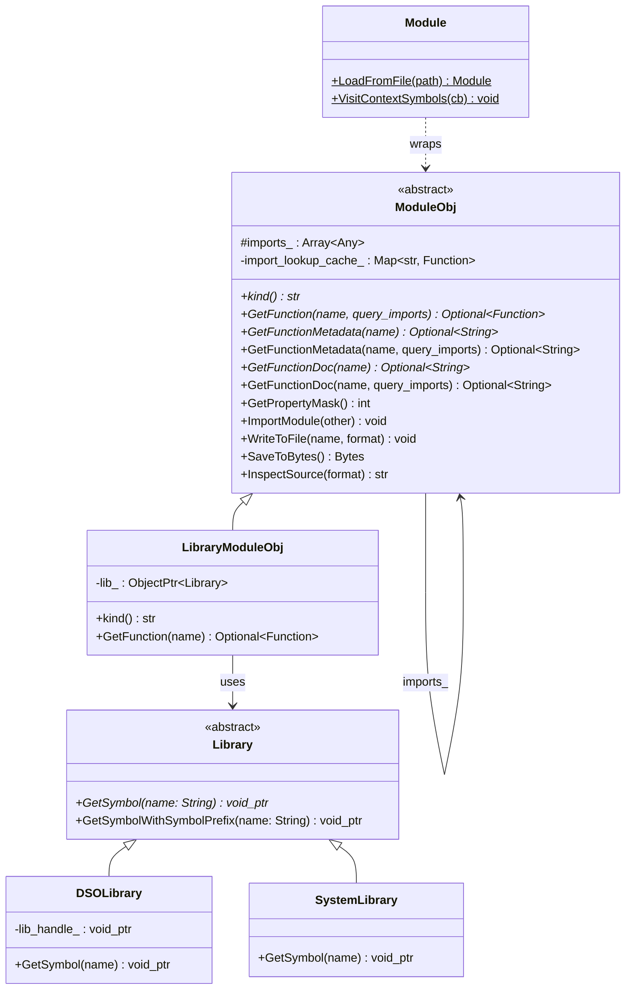

# FFI Module System

**TL;DR**.
- `ModuleObj`/`Module` (`type_index=73`, `type_key="ffi.Module"`) provide a first-class FFI Object type for dynamic module loading with virtual methods for function lookup, serialization, source inspection, and hierarchical imports with cyclic dependency detection.
- A three-tier architecture: `Library` (abstract symbol lookup) -> `LibraryModuleObj` (wraps symbols as `ffi::Function`) -> `Module` (public ref with import tree, property masks, and file loading). `DSOLibrary` (dlopen) and `SystemLibrary` (static symbol table) are the two concrete `Library` implementations.
- The C env API (`extra/c_env_api.h`) establishes a core/extra boundary: core `c_api.h` holds only ABI-essential APIs; environment-specific APIs (`TVMFFIEnvMod*` for modules, `TVMFFIEnvSetStream`/`TVMFFIEnvGetStream` for streams, `TVMFFIEnvSet/GetTensorAllocator` for env allocators, `TVMFFIEnvCheckSignals`/`TVMFFIEnvRegisterCAPI` for host integration) live in `extra/`.

## Problem Statement
### Background
- ML deployment requires loading compiled model libraries (shared objects) at runtime and calling their exported functions through the FFI. Before this subsystem, there was no standardized module abstraction -- each runtime had its own ad-hoc library loading.
- Device runtimes (CUDA, Metal, etc.) need per-thread stream context to dispatch kernels correctly, but stream management was scattered across device API implementations.

### Solution
- A `Module` Object type that wraps shared libraries, exposing their symbols as `ffi::Function` objects. Modules form import trees (parent imports child modules), enabling composite deployments where a model module imports sub-modules.
- A thread-local `EnvContext` (renamed from `StreamContext`) indexed by `(device_type, device_id)` provides centralized stream management and DLPack tensor allocator context via C env API functions.
- Clear core/extra API boundary: the core `c_api.h` contains only APIs needed by all embedders; host environment APIs and module-scoped APIs live in `extra/c_env_api.h`.

### Goals
- Standardized dynamic module loading with function lookup across import hierarchies.
- Support for binary import-tree deserialization (CSR-format embedded in DSOs).
- Thread-local per-device stream context and environment tensor allocator.
- Clear separation between core ABI and environment-specific extensions.
- Non-goal: static linking of modules (handled by `SystemLibrary` but not the primary use case).

## Design



### Key Classes, Fields and Interfaces

```python
# --- Public API: include/tvm/ffi/extra/module.h ---

class ModuleObj(Object):
    """A managed dynamic module that loads ffi::Functions or exportable source."""
    imports_: Array[Any]  # protected; child modules
    import_lookup_cache_: Map[str, Function]  # private; cached import lookups

    _type_index: int = 73  # kTVMFFIModule (static, pre-assigned)
    _type_key: str = "ffi.Module"
    # Interacts with: TVM_FFI_DECLARE_STATIC_OBJECT_INFO

    def kind(self) -> str: ...
        # Invariant: pure virtual, subclass must return stable identifier

    def GetPropertyMask(self) -> int: ...
        # Default: 0; override to declare capabilities
        # Interacts with: Module.ModulePropertyMask

    def GetFunction(self, name: str) -> Optional[Function]: ...
        # Invariant: pure virtual; returns None if not found

    def GetFunction(self, name: str, query_imports: bool) -> Optional[Function]: ...
        # When query_imports=True: recursively queries imports_ with BFS
        # Uses import_lookup_cache_ for memoization

    def GetFunctionMetadata(self, name: str) -> Optional[str]: ...
        # Invariant: virtual, default returns None (no metadata)
        # Extension: override in subclass (e.g., LibraryModuleObj) to look up
        #            DSO symbols with tvm_ffi_metadata_prefix + name
        # Interacts with: symbol::tvm_ffi_metadata_prefix ("__tvm_ffi_metadata_")

    def GetFunctionMetadata(self, name: str, query_imports: bool) -> Optional[str]: ...
        # When query_imports=True: recursively searches import hierarchy
        # Interacts with: ModuleObj.imports_ (recursive search)

    def GetFunctionDoc(self, name: str) -> Optional[str]: ...
        # Invariant: virtual, default returns None (no docstring)
        # Separates unstructured docstrings from structured metadata (JSON)
        # Rationale: docstrings can be large and unstructured; metadata is focused JSON
        # Extension: override in subclass to supply per-function docstrings

    def GetFunctionDoc(self, name: str, query_imports: bool) -> Optional[str]: ...
        # When query_imports=True: recursively searches import hierarchy
        # Interacts with: ModuleObj.imports_ (recursive search)
        # Interacts with: "ffi.ModuleGetFunctionDoc" registered global function

    def ImportModule(self, other: Module) -> None: ...
        # Invariant: detects cyclic imports via BFS before appending
        # Extension: override for custom import behavior

    def WriteToFile(self, file_name: str, format: str) -> None: ...
        # Default: throws RuntimeError

    def SaveToBytes(self) -> Bytes: ...
        # Default: throws RuntimeError

    def InspectSource(self, format: str = "") -> str: ...
        # Default: empty string

class Module(ObjectRef):
    """Ref wrapper for ModuleObj. Not nullable, mutable."""
    # Interacts with: TVM_FFI_DEFINE_OBJECT_REF_METHODS_NOTNULLABLE (auto-derives mutable from _type_mutable)

    class ModulePropertyMask(IntEnum):
        kBinarySerializable = 0b001
        kRunnable = 0b010
        kCompilationExportable = 0b100

    @staticmethod
    def LoadFromFile(file_name: str) -> Module: ...
        # Python wrapper accepts str | PathLike (af898a2): os.fspath() normalizes before FFI call
        # Maps dll/dylib/dso -> "so" extension
        # Looks up "ffi.Module.load_from_file.<format>" in global registry
        # Interacts with: Function.GetGlobal, global function registry

# Registered global functions:
# "ffi.ModuleLoadFromFile"              -> Module.LoadFromFile
# "ffi.ModuleGetFunction"               -> (mod, name, query_imports) -> Optional[Function]
# "ffi.ModuleGetFunctionMetadata"       -> (mod, name, query_imports) -> Optional[str]
# "ffi.ModuleGetFunctionDoc"            -> (mod, name, query_imports) -> Optional[str]  (ac7bf680)
# "ffi.ModuleImplementsFunction"        -> (mod, name, query_imports) -> bool
# "ffi.ModuleImportModule"              -> (mod, other) -> void
# "ffi.Module.load_from_file.so"        -> (library_path, format) -> Module
# "ffi.SystemLib"                       -> (prefix?) -> Module

# --- Internal: Library Abstraction ---

class Library(Object):
    """Abstract interface for symbol lookup in shared libraries."""
    def GetSymbol(self, name: String) -> void_ptr: ...
        # Signature changed: was const char*, now const String&

    def GetSymbolWithSymbolPrefix(self, name: String) -> void_ptr: ...
        # Default: return GetSymbol(tvm_ffi_symbol_prefix + name)
        # Interacts with: symbol::tvm_ffi_symbol_prefix ("__tvm_ffi_")
        # Extension: SystemLibrary overrides to prepend its own symbol_prefix_ too
    # Note: no type_key or type_index (internal only)

class LibraryModuleObj(ModuleObj):
    """Wraps a Library, exposing each symbol as a packed ffi::Function."""
    lib_: ObjectPtr[Library]
    # GetPropertyMask: kBinarySerializable | kRunnable
    # GetFunction: lib_.GetSymbol(name) -> wrap as Function.FromPacked
    # Invariant: returned Function captures self_strong_ref to keep Library alive

    def GetFunctionMetadata(self, name: str) -> Optional[str]:
        """Look up __tvm_ffi__metadata_<name> symbol, invoke it, return JSON string (ac7bf680)."""
        # Interacts with: Library.GetSymbol, Function.InvokeExternC
        # Invariant: symbol must follow SafeCallType signature
        # Returns: None if symbol not present in DSO
        ...

    def GetFunctionDoc(self, name: str) -> Optional[str]:
        """Look up __tvm_ffi__doc_<name> symbol, invoke it, return docstring (ac7bf680)."""
        # Interacts with: Library.GetSymbol, Function.InvokeExternC
        # Invariant: returns None (not empty string) if no doc symbol
        ...

class DSOLibrary(Library):
    """Dynamic shared library loader (dlopen/LoadLibraryW)."""
    lib_handle_: void_ptr
    def GetSymbol(self, name: String) -> void_ptr: ...
        # Interacts with: dlsym (Unix), GetProcAddress (Windows)

class SystemLibrary(Library):
    """Static symbol table for ahead-of-time compiled modules."""
    symbol_prefix_: str

    def GetSymbol(self, name: String) -> void_ptr: ...
        # Try prefixed first, fall back to unprefixed (315f4bb fix)
        # 1. result = reg_.GetSymbol(symbol_prefix_ + name)
        # 2. if result is nullptr: result = reg_.GetSymbol(name)
        # Invariant: returns non-null if name is registered under either key
        # Interacts with: SystemLibSymbolRegistry.Global()

    def GetSymbolWithSymbolPrefix(self, name: String) -> void_ptr: ...
        # Try fully-prefixed first, fall back to partially-prefixed (315f4bb fix)
        # 1. result = reg_.GetSymbol("__tvm_ffi_" + symbol_prefix_ + name)
        # 2. if result is nullptr: result = reg_.GetSymbol("__tvm_ffi_" + name)

# --- Binary Import Tree Deserialization ---

def ProcessLibraryBin(library_bin: bytes, opt_lib: ObjectPtr[Library]) -> Module:
    """Deserialize a CSR-format import tree embedded in a shared library."""
    # Format: <nbytes:u64> <indptr:vec<u64>> <child_indices:vec<u64>>
    #         then <kind:str, bytes:bytes> pairs for each module node
    # "_lib" placeholder -> LibraryModuleObj wrapping opt_lib
    # Other kinds -> LoadModuleFromBytes
    # Invariant: module[0] is the root module
    ...

def CreateLibraryModule(lib: ObjectPtr[Library]) -> Module:
    """Create a module from a Library, process embedded binary if present."""
    # Looks for __tvm_ffi_library_bin symbol -> ProcessLibraryBin
    # Initializes context symbols via ContextSymbolRegistry
    ...

# Well-known DSO symbols (renamed with double-underscore separator for internal symbols):
# symbol::tvm_ffi_symbol_prefix = "__tvm_ffi_"  # common prefix for ALL FFI-exported symbols
# "__tvm_ffi__library_ctx"  -> library context handle (was __tvm_ffi_library_ctx)
# "__tvm_ffi__library_bin"  -> embedded binary import tree (was __tvm_ffi_library_bin)
# "__tvm_ffi_main"          -> main entry point function (was __tvm_ffi_main__)
# "__tvm_ffi__metadata_"    -> prefix for per-function metadata (was __tvm_ffi_metadata_)
# "__tvm_ffi__doc_"         -> prefix for per-function documentation (ac7bf680)
# User-exported: "__tvm_ffi_<name>" -> generated by TVM_FFI_DLL_EXPORT_TYPED_FUNC
# Invariant: internal symbols use double underscore (__tvm_ffi__) to avoid collision with user exports

# --- C Env API: Environment Context (include/tvm/ffi/extra/c_env_api.h) ---

TVMFFIStreamHandle = void_ptr  # opaque stream handle

def TVMFFIEnvSetStream(
    device_type: int32, device_id: int32,
    stream: TVMFFIStreamHandle,
    opt_out_original_stream: Optional[Ptr[TVMFFIStreamHandle]]
) -> int:
    """Set the current stream for a (device_type, device_id) pair."""
    # Renamed from TVMFFIEnvSetCurrentStream (f81ab9c)
    # Interacts with: EnvContext.ThreadLocal().SetStream()
    # Invariant: stream is a weak reference -- caller owns lifetime
    # Invariant: opt_out_original_stream receives previous stream if non-null
    ...

def TVMFFIEnvGetStream(device_type: int32, device_id: int32) -> TVMFFIStreamHandle:
    """Get the current stream for a (device_type, device_id) pair."""
    # Renamed from TVMFFIEnvGetCurrentStream (f81ab9c)
    # Interacts with: EnvContext.ThreadLocal().GetStream()
    # Invariant: returns nullptr if no stream set
    ...

# --- C Env API: Environment Tensor Allocator (include/tvm/ffi/extra/c_env_api.h) ---

# DLPackManagedTensorAllocator (renamed from DLPackTensorAllocator, 9829dec)
# = Callable[[DLTensor_ptr, DLManagedTensorVersioned_ptr_ptr, void_ptr, SetErrorFn], int]
# Now defined in upstream dlpack.h (removed from c_api.h)
# Invariant: SetError must be called before returning -1

def TVMFFIEnvSetDLPackManagedTensorAllocator(
    allocator: DLPackManagedTensorAllocator,
    write_to_global_context: int,
    opt_out_original_allocator: Ptr[DLPackManagedTensorAllocator]
) -> int:
    """Set the tensor allocator for the current thread (TLS) or global."""
    # Renamed from TVMFFIEnvSetTensorAllocator (f679fe5)
    # Interacts with: EnvContext.SetDLPackManagedTensorAllocator()
    # Invariant: TLS allocator takes priority over global; global is fallback
    ...

def TVMFFIEnvGetDLPackManagedTensorAllocator() -> DLPackManagedTensorAllocator:
    """Get the current tensor allocator (TLS, then global fallback)."""
    # Renamed from TVMFFIEnvGetTensorAllocator (f679fe5)
    # Interacts with: EnvContext.GetDLPackManagedTensorAllocator()
    ...

def TVMFFIEnvTensorAlloc(prototype: Ptr[DLTensor], out: Ptr[TVMFFIObjectHandle]) -> int:
    """High-level tensor allocation through env context (f679fe5).
    Fetches allocator from TLS/global, invokes it, wraps result as TensorObj."""
    # Interacts with: TVMFFIEnvGetDLPackManagedTensorAllocator() (fetches allocator)
    # Interacts with: TensorObjFromDLPack (wraps DLManagedTensorVersioned into TensorObj)
    # Invariant: allocator must have been set via TVMFFIEnvSetDLPackManagedTensorAllocator
    # Invariant: prototype.dtype, prototype.ndim, prototype.shape, prototype.device used;
    #            other fields (data, strides, byte_offset) ignored
    # Invariant: error from allocator propagated via TVMFFIErrorSetRaisedFromCStr
    # Extension: future allocator backends can be added by extending the allocator dispatch
    ...

# Tensor::FromEnvAlloc (renamed from Tensor::FromDLPackAlloc, f679fe5):
# @staticmethod
# def FromEnvAlloc(
#     env_alloc: Callable[[Ptr[DLTensor], Ptr[TVMFFIObjectHandle]], int],
#     shape: ShapeView, dtype: DLDataType, device: DLDevice,
# ) -> Tensor: ...
#     # Canonical usage: Tensor::FromEnvAlloc(TVMFFIEnvTensorAlloc, shape, dtype, device)
#     # The function pointer indirection maintains explicit dep on c_env_api.h
#     # Invariant: env_alloc must return 0 on success, nonzero on failure

# EnvContext internal (renamed from StreamContext, f81ab9c):
class EnvContext:
    """Thread-local context managing stream table AND DLPack tensor allocator."""
    stream_table_: List[List[TVMFFIStreamHandle]]  # 2D, auto-grows
    dlpack_allocator_: DLPackManagedTensorAllocator  # TLS allocator
    # Invariant: returns nullptr for out-of-bounds stream indices
    # Invariant: TLS allocator checked first, then global static allocator as fallback

# __tvm_ffi_env_stream__ protocol (db987299):
# Python objects with __dlpack__ can also implement __tvm_ffi_env_stream__
# to expose the framework's current device stream as an integer.
# Called during make_args() when a non-CPU __dlpack__ argument is encountered
# and no stream context has been set yet.
# Invariant: only called once per FFI call (first non-CPU dlpack arg wins)

# --- C Env API: Module-Scoped Functions ---

def TVMFFIEnvModLookupFromImports(library_ctx: Handle, func_name: str, out: Handle_ptr) -> int: ...
    # Was: TVMFFIEnvLookupFromImports (renamed with Mod prefix)

def TVMFFIEnvModRegisterContextSymbol(name: str, symbol: void_ptr) -> int: ...
    # Was: TVMFFIEnvRegisterContextSymbol

def TVMFFIEnvModRegisterSystemLibSymbol(name: str, symbol: void_ptr) -> int: ...
    # Was: TVMFFIEnvRegisterSystemLibSymbol

# --- C Env API: Host Integration ---

def TVMFFIEnvCheckSignals() -> int: ...
    # Moved from c_api.h to extra/c_env_api.h
    # Acquires GIL, calls PyErr_CheckSignals

def TVMFFIEnvRegisterCAPI(name: str, symbol: void_ptr) -> int: ...
    # Moved from c_api.h to extra/c_env_api.h
    # Signature changed: was (TVMFFIByteArray*, void*), now (const char*, void*)
    # Accepts: "PyErr_CheckSignals", "PyGILState_Ensure", "PyGILState_Release"
```

### Contracts, Assumptions and Invariants
- **Cyclic import detection**: `ImportModule` performs BFS traversal of the target module's import tree to verify no cycle would be created before appending. This prevents infinite recursion in `GetFunction` with `query_imports=True`.
- **Library lifetime**: `LibraryModuleObj::GetFunction` captures a strong reference to the module itself in returned `Function` closures, ensuring the `Library` handle (and thus the shared library) stays loaded as long as any function is alive. **Caller-side invariant (a97b7c6)**: objects returned by module-loaded functions may have deleters residing in the library code. The Module must remain loaded until all such objects are destroyed. **Relaxed by `ModuleGlobals` (8dcaec1f)**: `load_module(..., keep_module_alive=True)` (the default) pins the module in a global `ModuleGlobals` singleton, eliminating the need for manual destruction ordering. Use `keep_module_alive=False` to opt back into caller-managed lifetime.
- **`ModuleGlobals` singleton (8dcaec1f)**: Thread-safe global registry (`std::mutex`-protected `Map<Module, int>`) holding strong references to loaded modules. Meyers singleton pattern, static lifetime. Exposed via `_ffi_api.ModuleGlobalsAdd` / `_ffi_api.ModuleGlobalsRemove`. Default `keep_module_alive=True` on `load_module`, `cpp.load_inline`, `cpp.load` means modules are pinned globally.
- **Core/extra boundary**: `c_api.h` contains only ABI-essential APIs; `extra/c_env_api.h` holds host environment APIs, module-scoped APIs (`TVMFFIEnvMod*`), and stream context APIs. This split ensures minimal dependencies for embedders that don't need module loading or Python integration.
- **Stream context thread safety**: `StreamContext` is thread-local (one instance per thread), so no synchronization is needed. Streams are stored as weak `void*` references -- the caller is responsible for stream lifetime.

### Extension Points
- **Custom module loaders**: Register `"ffi.Module.load_from_file.<format>"` global function for new file formats, where `<format>` is the file extension (e.g., `"so"`, `"tar"`).
- **Custom Library backends**: Subclass `Library` and override `GetSymbol` for non-standard symbol lookup (e.g., in-memory JIT compilation, remote symbol resolution).
- **Context symbols**: Use `ContextSymbolRegistry` to register initialization callbacks that run when a module is loaded (e.g., setting up device-specific state).

### Usage Examples

#### Loading and Calling a DSO Module
**Context**: Loading a compiled model from a shared library and calling its exported function.
```cpp
#include <tvm/ffi/extra/module.h>

// Load a shared library module
Module mod = Module::LoadFromFile("my_model.so");

// Look up a function (including in imported sub-modules)
Optional<Function> f = mod->GetFunction("main", /*query_imports=*/true);
Any result = (*f)(input_tensor);

// Import sub-modules (cyclic check runs automatically)
Module sub = Module::LoadFromFile("sub_module.so");
mod->ImportModule(sub);
```

#### Registering a Custom Module Loader
**Context**: Adding support for a new module file format.
```cpp
TVM_FFI_STATIC_INIT_BLOCK() {
  namespace refl = tvm::ffi::reflection;
  refl::GlobalDef().def("ffi.Module.load_from_file.myformat",
    [](String library_path, String format) -> Module {
      auto lib = make_object<MyCustomLibrary>(library_path);
      return CreateLibraryModule(lib);
    });
}
```

#### Querying Function Metadata from a Module
**Context**: Retrieving per-function metadata (e.g., schema, input/output descriptions) from a loaded DSO module.
```cpp
#include <tvm/ffi/extra/module.h>

Module mod = Module::LoadFromFile("model.so");
// Query metadata for a specific function, searching import hierarchy
Optional<String> meta = mod->GetFunctionMetadata("forward", /*query_imports=*/true);
if (meta.defined()) {
  // meta.value() is a JSON string with function-specific metadata
  // The metadata was stored in the DSO as symbol __tvm_ffi_metadata_forward
  LOG(INFO) << "Metadata: " << meta.value();
}
```

#### Managing Device Stream Context
**Context**: Setting a CUDA stream before kernel dispatch, restoring afterward.
```c
#include <tvm/ffi/extra/c_env_api.h>

// Set stream for CUDA device 0 (device_type=2 for kDLCUDA)
TVMFFIStreamHandle original = NULL;
int ret = TVMFFIEnvSetStream(2, 0, my_cuda_stream, &original);

// In kernel dispatch: retrieve the current stream
TVMFFIStreamHandle current = TVMFFIEnvGetStream(2, 0);
// current == my_cuda_stream

// Restore original stream
TVMFFIEnvSetStream(2, 0, original, NULL);
```

#### Environment Tensor Allocator
**Context**: A C++ kernel library allocates output tensors via the caller's allocator (e.g., `torch.empty`).
```cpp
#include <tvm/ffi/container/tensor.h>
#include <tvm/ffi/extra/c_env_api.h>

ffi::Tensor allocate_output(DLTensor* input) {
  DLDataType f32_dtype{kDLFloat, 32, 1};
  // Allocate using env allocator -- redirected to torch.empty when called from Python+torch
  return ffi::Tensor::FromDLPackAlloc(
    TVMFFIEnvGetTensorAllocator(), ffi::Shape({input->shape[0]}),
    f32_dtype, input->device);
}
```

## Implementation Notes
- `Module` uses `TVM_FFI_DECLARE_OBJECT_INFO_STATIC` with pre-assigned `kTVMFFIModule=73`, placing it in the static type index range alongside other built-in types.
- `DSOLibrary` uses `dlopen`/`dlsym` on Unix and `LoadLibraryW`/`GetProcAddress` on Windows. The library handle is stored as a raw `void*` and freed in the destructor.
- `ProcessLibraryBin` reads a CSR (Compressed Sparse Row) format for the import tree: `indptr` array stores the start of each node's children in `child_indices`. Then each node stores its `(kind, bytes)` pair for deserialization.
- The mutable ref macros (now consolidated into `TVM_FFI_DEFINE_OBJECT_REF_METHODS_NULLABLE`/`NOTNULLABLE` with auto-derived mutability via `_type_mutable`) previously had trailing-semicolon bugs and a `TVM_DEFINE_` -> `TVM_FFI_DEFINE_` typo (fixed in 538bef4, then consolidated in a08fa6e).

## Alternatives & Trade-offs
### Module as Object Type vs. Standalone C API
- Pros of Object type: Modules participate in the FFI type system (ref-counted, passable as `Any`). Import trees are themselves FFI objects. Python can manipulate modules natively.
- Cons: Heavier than a plain C handle. Virtual method dispatch for every function lookup.
### Thread-Local Stream Context vs. Explicit Stream Passing
- Pros of thread-local: Zero API surface change for existing function calls. Natural for CUDA-style "current stream" semantics.
- Cons: Implicit state. Must set/restore around any cross-stream work. Not composable across thread boundaries.

### Decision Record
**Decision**: Place environment APIs in `extra/c_env_api.h`, not `c_api.h`.

**Drivers**: Embedders that only need the core ABI (type erasure, function calling, error handling) should not be forced to link module loading, Python GIL management, or stream context code.

**Alternative A**: Keep all APIs in `c_api.h`.
- Pros: Single include for everything.
- Cons: Embedders link unused code. Core ABI file grows unboundedly. Mixing concerns.

**Alternative B (chosen)**: Core/extra split with `TVMFFIEnvMod*` naming convention.
- Pros: Minimal core. Clear naming distinguishes general env APIs (`TVMFFIEnv*`) from module-scoped ones (`TVMFFIEnvMod*`). Independently linkable.
- Cons: Two headers to include. Must coordinate which APIs live where.

## Evidence
| Commit | Scope | Contribution |
|--------|-------|-------------|
| 538bef4 | ffi/module, ffi/object | Introduced ModuleObj/Module, Library, LibraryModuleObj, DSOLibrary, SystemLibrary, ProcessLibraryBin, C env APIs, mutable ref macro fixes |
| 0daaffed | ffi/extra, ffi/c-env-api | Added TVMFFIStreamHandle, stream context APIs |
| db987299 | ffi/c-env-api | Added `__tvm_ffi_env_stream__` protocol, renamed `TVMFFIEnvSetStream` to `TVMFFIEnvSetCurrentStream` |
| f81ab9c2 | ffi/c-env-api | Renamed `StreamContext` to `EnvContext`, stream API rename to `SetStream`/`GetStream`, added tensor allocator APIs |
| 315f4bb0 | ffi/module | Fixed `SystemLibrary::GetSymbol` to fall back to unprefixed name |
| 023ea44 | ffi/c-api, ffi/extra | Reorganized C API: moved env/module APIs to extra, renamed TVMFFIEnvMod* prefix, EnvCAPIRegistry extraction |
| 6014406 | scripts/benchmark | Extended autodlpack benchmark for stream context (supporting evidence) |
| 777cf8d | ffi/module | Added GetFunctionMetadata virtual method, tvm_ffi_metadata_prefix symbol convention |
| 40e8a51 | ffi/module, ffi/function | Prefixed all DSO symbols with `__tvm_ffi_`, added `GetSymbolWithSymbolPrefix`, changed `GetSymbol` to `const String&` |
| 935a5a07 | ffi/module, ffi/reflection | Added `GetFunctionDoc` virtual method, separating unstructured docstrings from structured metadata |
| 9829dec | ffi/c-api | Renamed `DLPackTensorAllocator` -> `DLPackManagedTensorAllocator` across all layers |
| f679fe5 | ffi/c-env-api | Renamed `TVMFFIEnvSet/GetTensorAllocator` to DLPack-aligned names; added `TVMFFIEnvTensorAlloc` and `Tensor::FromEnvAlloc` |
| a97b7c6 | tests/python | Documented module-object lifetime invariant (objects must be destroyed before module) |
| af898a2 | python/ffi-bindings | Widened Python `load_module(path)` to accept `str \| PathLike` |
| ac7bf680 | ffi/module, ffi/function | Implemented `LibraryModuleObj::GetFunctionMetadata`/`GetFunctionDoc`; added `symbol::tvm_ffi_doc_prefix`; Python-side `Module.get_function_metadata()`/`get_function_doc()` |
| dcacb98d | ffi/function | Fixed metadata string allocation to use `TVMFFIStringFromByteArray` (libtvm_ffi heap) to avoid use-after-unload |
| 8dcaec1f | ffi/module, python | Added `ModuleGlobals` singleton and `keep_module_alive` flag on `load_module`, `cpp.load`, `cpp.load_inline` |

## Related Design Docs & ADRs
- [0001-c-abi.md](0001-c-abi.md) -- Core C ABI that module system extends; `kTVMFFIModule` type index
- [0003-object-system.md](0003-object-system.md) -- Object/ObjectRef pattern that Module follows
- [0004-function-system.md](0004-function-system.md) -- Function registration and lookup used by Module
- [0007-reflection.md](0007-reflection.md) -- ObjectDef registration for ModuleObj fields
- [0008-object-macros.md](0008-object-macros.md) -- TVM_FFI_DECLARE_OBJECT_INFO_STATIC, TVM_FFI_DEFINE_OBJECT_REF_METHODS_NOTNULLABLE
- [0012-python-package.md](0012-python-package.md) -- Python bindings for Module (module.py)
- [0013-packaging.md](0013-packaging.md) -- Extension packaging that uses Module loading
- [0014-cpp-extension.md](0014-cpp-extension.md) -- `load_inline` JIT compilation, an alternative path to create Modules from inline source
