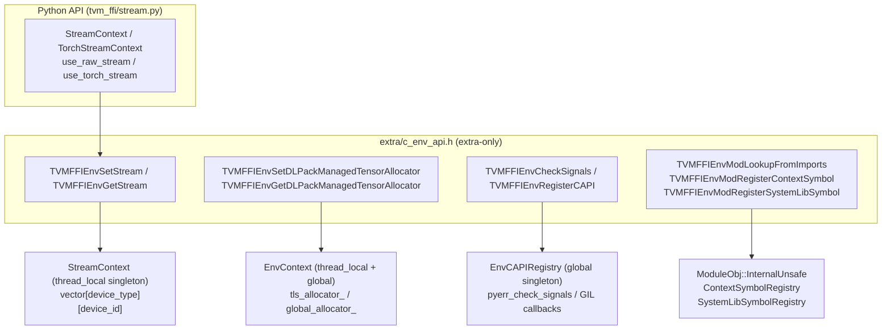

# Extra/ Env C API — Stream Context and Environment Callbacks

**TL;DR**
- `include/tvm/ffi/extra/c_env_api.h` consolidates all environment-side C ABI functions that are conditional on `TVM_FFI_USE_EXTRA_CXX_API`. These include stream context management (`TVMFFIEnvSetStream`/`TVMFFIEnvGetStream`), tensor allocator callbacks (`TVMFFIEnvSetDLPackManagedTensorAllocator`/`TVMFFIEnvGetDLPackManagedTensorAllocator`), Python callback registration (`TVMFFIEnvRegisterCAPI`/`TVMFFIEnvCheckSignals`), and module-scoped symbol APIs (`TVMFFIEnvMod*`).
- The `StreamContext` class provides a per-thread, per-device stream table backed by a `vector<vector<void*>>` with lazy resize. Streams are weak references; FFI only caches them.
- `TVMFFIEnvCheckSignals` and `TVMFFIEnvRegisterCAPI` were moved out of the core `c_api.h` into this extra-only header (commit 023ea44), trimming the minimum ABI surface.
- Python-level stream management (commit 3197cd0) adds `StreamContext`, `TorchStreamContext`, `use_raw_stream`, and `use_torch_stream` as the public Python API over the C ABI stream functions.

## Problem Statement

### Background
Accelerator frameworks (CUDA, Metal, ROCm) need the host to track which stream is active on each device so that kernel launches and copies use the correct queue. Python bindings need a way to register Ctrl-C signal checking into long-running C++ kernels. Module-loaded `.so` files need to resolve host symbols without a link-time dependency. All three requirements involve runtime callbacks — not compile-time ABI — so they live in `extra/` rather than `c_api.h`.

### Solution
One shared header (`c_env_api.h`) + implementation files (`env_context.cc`, `env_c_api.cc`) provide:
1. **Stream context** — thread-local `StreamContext` singleton indexed by `(device_type, device_id)`.
2. **Tensor allocator context** — thread-local + global `DLPackManagedTensorAllocator` function pointer for environment-controlled tensor allocation.
3. **Python callbacks** — `EnvCAPIRegistry` singleton holding function pointers registered by the Python layer at startup.
4. **Module env functions** — `TVMFFIEnvMod*` bridge between generated kernel code and the module import chain.
Note: `stream_context.cc` was merged into `env_context.cc` in commit f81ab9c25ae4 to consolidate stream + allocator context.

### Goals
- Thread-safe per-device stream tracking with O(1) get/set.
- RAII-friendly stream swap via `opt_out_original_stream` parameter.
- Python signal checking without a hard Python header dependency in C++ FFI.
- Naming convention: `TVMFFIEnvMod*` for module-scoped functions; `TVMFFIEnv*` for general env functions.
- Non-goal: ownership or lifetime of streams (FFI stores weak references only).

## Design

### Architecture



### Key Classes, Fields and Interfaces

```python
# ─── include/tvm/ffi/extra/c_env_api.h ───────────────────────────────────────

TVMFFIStreamHandle = void*  # opaque handle; weak reference, NOT owned by FFI

# Stream context
def TVMFFIEnvSetStream(
    device_type: int32_t,
    device_id: int32_t,
    stream: TVMFFIStreamHandle,
    opt_out_original_stream: TVMFFIStreamHandle* = nullptr,
) -> int:
    """Set the active stream for (device_type, device_id) on the calling thread.
    Writes the previous stream to opt_out_original_stream if non-null (RAII swap support).
    Returns 0 on success; nonzero on failure (TVM_FFI_SAFE_CALL_BEGIN/END boundary).
    NOTE: name settled at TVMFFIEnvSetStream after oscillating in commits db987299/f81ab9c25ae4.
    """
    # Interacts with: StreamContext.ThreadLocal() (internal thread-local singleton)
    # Invariant: stream is a weak reference; FFI never calls any stream API on it
    # Invariant: opt_out_original_stream receives previous value for RAII restore

def TVMFFIEnvGetStream(
    device_type: int32_t,
    device_id: int32_t,
) -> TVMFFIStreamHandle:
    """Returns the active stream for (device_type, device_id) on the calling thread.
    Returns nullptr if no stream has been set for this device.
    Uses TVM_FFI_LOG_EXCEPTION_CALL_BEGIN/END (logs on error, does not swallow).
    NOTE: renamed from TVMFFIEnvGetCurrentStream in commit f81ab9c25ae4.
    """
    # Interacts with: StreamContext.ThreadLocal()

# DLPack managed tensor allocator (added commit f81ab9c25ae4)
# RENAMED: DLPackManagedTensorAllocator -> DLPackManagedTensorAllocator (commit 9829dec9)
# RENAMED: TVMFFIEnvSetDLPackManagedTensorAllocator -> TVMFFIEnvSetDLPackManagedTensorAllocator (commit f679fe54)
# RENAMED: TVMFFIEnvGetDLPackManagedTensorAllocator -> TVMFFIEnvGetDLPackManagedTensorAllocator (commit f679fe54)
# typedef int (*DLPackManagedTensorAllocator)(
#     DLTensor* prototype, DLManagedTensorVersioned** out,
#     void* error_ctx, void (*SetError)(void* error_ctx, const char* kind, const char* message)
# )
def TVMFFIEnvSetDLPackManagedTensorAllocator(
    allocator: DLPackManagedTensorAllocator,
    write_to_global: int,
    opt_out_original: DLPackManagedTensorAllocator*,
) -> int:
    """Set the DLPack managed tensor allocator for the current context.
    write_to_global=1: updates the global allocator (process-wide fallback).
    write_to_global=0: updates the thread-local allocator.
    Interacts with: EnvContext.tls_allocator_ / global_allocator_
    Invariant: GetDLPackManagedTensorAllocator checks TLS first, then global.
    Invariant (commit 71bbe917): opt_out_original is written BEFORE the new allocator
        is installed — i.e., *opt_out_original = GetDLPackManagedTensorAllocator() happens
        first, then dlpack_allocator_ = allocator.
        Pre-71bbe917 bug: the assignment was AFTER the overwrite, so opt_out_original
        always received the NEW allocator (useless for RAII swap-restore patterns).
    RAII pattern (correct usage):
        DLPackManagedTensorAllocator original;
        TVMFFIEnvSetDLPackManagedTensorAllocator(new_alloc, 0, &original);
        // ... use new_alloc ...
        TVMFFIEnvSetDLPackManagedTensorAllocator(original, 0, nullptr);  // restore
    """

def TVMFFIEnvGetDLPackManagedTensorAllocator() -> DLPackManagedTensorAllocator:
    """Returns TLS allocator if set; else global allocator; else nullptr.
    Interacts with: TVMFFIPyCallContext.c_dlpack_tensor_allocator (0016-py-ffi-call-dispatch)
    """

# High-level tensor allocation (commit f679fe54)
def TVMFFIEnvTensorAlloc(
    prototype: DLTensor*,
    out: TVMFFIObjectHandle*,
) -> int:
    """Allocate a ffi::Tensor from the DLPackManagedTensorAllocator set in TLS context.
    Metadata (shape/strides inline array) is allocated inside libtvm_ffi, avoiding
    module-unloading-order issues where the caller allocated the object.
    Only uses dtype, ndim, shape, and device from prototype; other fields ignored.
    Returns 0 on success; nonzero + TLS error slot set on failure.
    """
    # Interacts with: TVMFFIEnvGetDLPackManagedTensorAllocator (reads TLS allocator)
    # Interacts with: TensorObjFromDLPack<DLManagedTensorVersioned> (wraps returned DLPack)
    # Invariant: out is kTVMFFITensor type; caller must DecRef when done
    # Invariant: if allocator is nullptr, returns -1 with RuntimeError
    # Invariant (commit 227bdd0): checks ret_code != 0 BEFORE checking dl_tensor != NULL,
    #   preserving allocator's TLS error message instead of generic "NULL pointer" assertion

# C++ wrapper: Tensor::FromEnvAlloc (commit f679fe54, replaces Tensor::FromDLPackAlloc)
def Tensor_FromEnvAlloc(
    env_alloc: Callable[[DLTensor*, TVMFFIObjectHandle*], int],  # typically TVMFFIEnvTensorAlloc
    shape: ShapeView,
    dtype: DLDataType,
    device: DLDevice,
) -> Tensor:
    """Create Tensor via env allocator. Simplified signature replaces old FromDLPackAlloc
    which took DLPackManagedTensorAllocator with error-context callback pattern."""
    # Interacts with: TVMFFIEnvTensorAlloc (standard env_alloc argument)
    # Extension: pass any conforming int(*)(DLTensor*, TVMFFIObjectHandle*) allocator

# Python callbacks
def TVMFFIEnvRegisterCAPI(name: const char*, symbol: void*) -> int:
    """Register a frontend C function pointer by name.
    Accepted names: "PyErr_CheckSignals", "PyGILState_Ensure", "PyGILState_Release".
    Throws ValueError for unknown names.
    NOTE: signature changed from (const TVMFFIByteArray*, void*) → (const char*, void*)
    in commit 023ea44.
    """
    # Interacts with: EnvCAPIRegistry singleton

def TVMFFIEnvCheckSignals() -> int:
    """Returns 0 if no Python signals raised; -1 if PyErr_CheckSignals returned nonzero.
    Safe to call from C++ without holding the GIL; acquires GIL internally via
    PyGILState_Ensure/Release. Returns 0 (safe) if PyErr_CheckSignals is not registered.
    """
    # Interacts with: EnvCAPIRegistry.EnvCheckSignals(), WithGIL RAII helper

# Module-scoped env functions (Mod prefix = module domain, not general env)
def TVMFFIEnvModLookupFromImports(
    library_ctx: TVMFFIObjectHandle, func_name: const char*, out: TVMFFIObjectHandle*
) -> int:
    """Look up func_name in module's import chain + global registry; cache result.
    Renamed from TVMFFIEnvLookupFromImports (commit 023ea44).
    """
    # Interacts with: ModuleObj::InternalUnsafe::GetFunctionFromImports

def TVMFFIEnvModRegisterContextSymbol(name: const char*, symbol: void*) -> int:
    """Add a host symbol to ContextSymbolRegistry for injection at .so load time.
    Renamed from TVMFFIEnvRegisterContextSymbol (commit 023ea44).
    """

def TVMFFIEnvModRegisterSystemLibSymbol(name: const char*, symbol: void*) -> int:
    """Register a symbol in SystemLibSymbolRegistry (statically linked modules).
    Renamed from TVMFFIEnvRegisterSystemLibSymbol (commit 023ea44).
    """


# ─── Internal: StreamContext (src/ffi/extra/stream_context.cc) ───────────────

class StreamContext:
    """Thread-local stream table, one entry per (device_type, device_id) pair.
    Lazily resizes as new device types/IDs are accessed.
    """
    stream_table_: List[List[TVMFFIStreamHandle]]
    # Indexed as: stream_table_[device_type][device_id]
    # Invariant: unset slots contain nullptr (initialized to nullptr on resize)

    def SetStream(self, device_type: int32_t, device_id: int32_t,
                  stream: TVMFFIStreamHandle,
                  out_original_stream: TVMFFIStreamHandle*) -> None:
        # Resizes stream_table_ lazily if device_type or device_id exceeds current size
        # Invariant: after resize, new slots are nullptr (zeroed)

    def GetStream(self, device_type: int32_t, device_id: int32_t) -> TVMFFIStreamHandle:
        # Returns nullptr for out-of-range device_type or device_id (no throw)

    @staticmethod
    def ThreadLocal() -> StreamContext*:
        # static thread_local StreamContext instance — one per OS thread, zero cost on hot path


# ─── Internal: EnvCAPIRegistry (src/ffi/extra/env_c_api.cc) ──────────────────

class EnvCAPIRegistry:
    """Singleton holding Python C-API function pointers registered at runtime."""
    pyerr_check_signals: F_PyErr_CheckSignals  # nullable; called by EnvCheckSignals
    py_gil_state_ensure: Callable[[], PyGILState_t]  # nullable
    py_gil_state_release: Callable[[PyGILState_t], None]  # nullable

    @staticmethod
    def Global() -> EnvCAPIRegistry*: ...
    def Register(symbol_name: str, fptr: void*) -> None: ...
    def EnvCheckSignals(self) -> int:
        # Acquires GIL via WithGIL RAII, calls pyerr_check_signals
        # Invariant: returns 0 if pyerr_check_signals is null (not registered)
```

### `__tvm_ffi_env_stream__` Python Protocol (commit db987299)

Any Python object that implements both `__dlpack__` and `__tvm_ffi_env_stream__()` can automatically inject its device stream into the FFI call context when passed as an argument:

```python
# Protocol: __tvm_ffi_env_stream__
# Any Python object with __dlpack__ may also define:
def __tvm_ffi_env_stream__(self) -> int:
    """Return current environment stream handle as integer (uint64 cast of void*)."""
# When detected in TVMFFIPyCallManager during arg dispatch:
#   - Reads (device_type, device_id) from ctx
#   - Calls TVMFFIEnvSetStream with the returned handle
# Invariant: only consulted for non-CPU devices; only first such arg wins (ctx_dev_type == -1 guard)
# Interacts with: TVMFFIPyCallContext (0016-py-ffi-call-dispatch), TVMFFIEnvSetStream

# DLTensorTestWrapper: test-only implementation of the protocol
class DLTensorTestWrapper:
    """Wraps tvm_ffi.Tensor and exposes __tvm_ffi_env_stream__ for testing."""
    tensor: Tensor
    def __tvm_ffi_env_stream__(self) -> int: ...  # delegates to TVMFFIEnvGetStream
    def __dlpack__(self, **kwargs) -> ...: ...
    def __dlpack_device__(self) -> ...: ...
```

### Python Stream Context API (commit 3197cd0)

```python
# ─── python/tvm_ffi/stream.py ────────────────────────────────────────────────

class StreamContext:
    """RAII context manager for the FFI thread-local stream table.
    On __enter__: calls _env_set_current_stream(device_type, device_id, stream)
                  and saves the previous stream handle in self.prev_stream.
    On __exit__:  restores self.prev_stream via _env_set_current_stream.
    """
    device_type: int   # DLPack device type int (e.g. 2 = CUDA)
    device_id: int
    stream: int        # Stream handle as Python int (uint64 cast of void*)
    prev_stream: int   # Captured on __enter__; undefined before __enter__

    def __enter__(self) -> None: ...
    def __exit__(self, *args) -> None: ...
    # Interacts with: core._env_set_current_stream → TVMFFIEnvSetStream (via opt_out_original_stream)
    # Invariant: __exit__ restores exactly the stream that existed at __enter__ time


class TorchStreamContext:
    """Wraps a torch stream/graph context + a StreamContext together.
    Only available when torch is importable (conditionally defined).
    On __enter__: enters torch context first, then reads torch.cuda.current_stream()
                  and creates FFI StreamContext from its cuda_stream pointer.
    On __exit__: restores FFI stream, then exits torch context.
    """
    torch_context: Optional[Any]   # torch.cuda.stream() or torch.cuda.graph() context
    ffi_context: StreamContext     # created lazily in __enter__
    # Invariant: ffi_context binding reflects torch context state at __enter__ time, not __init__


def use_raw_stream(device: core.Device, stream: Union[int, c_void_p]) -> StreamContext:
    """Factory: wrap a raw stream handle in a StreamContext.
    Raises ValueError for torch.cuda.Stream objects (use use_torch_stream instead).
    # Interacts with: Device.dlpack_device_type(), Device.index
    """

def use_torch_stream(context: Optional[Any] = None) -> TorchStreamContext:
    """Factory: create a TorchStreamContext from a torch stream/graph context.
    If context is None, captures torch.cuda.current_stream() at __enter__ time.
    Raises ImportError if torch is not installed.
    # Interacts with: TorchStreamContext.__enter__ → torch.cuda.current_stream()
    """

def get_raw_stream(device: core.Device) -> int:
    """Return the current FFI stream for the given device as an integer handle (commit 22c049b).
    Returns 0 (nullptr cast) if no stream has been set for this device.
    # Interacts with: core._env_get_current_stream → TVMFFIEnvGetStream (c_env_api.h)
    # Interacts with: Device.dlpack_device_type(), Device.index
    # Invariant: result is uint64 cast of void*; 0 means no stream registered
    """

# Cython bridge for get_raw_stream:
def _env_get_current_stream(device_type: int, device_id: int) -> int:
    """Query FFI thread-local stream for (device_type, device_id) (commit 22c049b).
    Returns the stream handle as Python int (uint64 cast of TVMFFIStreamHandle).
    Does NOT use TVM_FFI_SAFE_CALL_BEGIN/END — TVMFFIEnvGetStream uses
    TVM_FFI_LOG_EXCEPTION_CALL_BEGIN/END (logs on error, no TLS error slot).
    # Interacts with: TVMFFIEnvGetStream (extra/c_env_api.h)
    # Invariant: returns 0 if device_type/device_id are out-of-range (no exception)
    """

# ─── python/tvm_ffi/cython/base.pxi ──────────────────────────────────────────

def _env_set_current_stream(device_type: int, device_id: int, stream: int) -> int:
    """Cython bridge: set FFI stream for (device_type, device_id).
    Returns the previous stream handle as Python int (uint64 cast of void*).
    Calls TVMFFIEnvSetStream with opt_out_original_stream to atomically swap.
    # Invariant: stream=0 (NULL) is valid — resets the entry to no stream
    # Interacts with: TVMFFIEnvSetStream (c_env_api.h), StreamContext.__enter__/__exit__
    """
```

### Naming Convention

The `Mod` infix distinguishes module-domain env functions from general env functions within `c_env_api.h`:

| Function | Domain | Notes |
|---|---|---|
| `TVMFFIEnvSetStream` | Thread/device | Stream context management; settled name after rename oscillation in db987299+f81ab9c25ae4 |
| `TVMFFIEnvGetStream` | Thread/device | Stream context query; renamed from `TVMFFIEnvGetCurrentStream` in f81ab9c25ae4 |
| `TVMFFIEnvSetDLPackManagedTensorAllocator` | Thread/process | DLPack tensor allocator; added f81ab9c25ae4 |
| `TVMFFIEnvGetDLPackManagedTensorAllocator` | Thread/process | Returns TLS allocator or global fallback |
| `TVMFFIEnvCheckSignals` | Python/host | Python signal check |
| `TVMFFIEnvRegisterCAPI` | Python/host | Python callback registration |
| `TVMFFIEnvModLookupFromImports` | Module | Formerly `TVMFFIEnvLookupFromImports` |
| `TVMFFIEnvModRegisterContextSymbol` | Module | Formerly `TVMFFIEnvRegisterContextSymbol` |
| `TVMFFIEnvModRegisterSystemLibSymbol` | Module | Formerly `TVMFFIEnvRegisterSystemLibSymbol` |

### Contracts, Assumptions and Invariants

- `TVMFFIEnvSetStream` and `TVMFFIEnvGetStream` are thread-local by design — no mutex needed for the `StreamContext` data structure itself. Two threads managing different devices never contend.
- `StreamContext` lazily resizes `stream_table_` on demand. There is no fixed upper bound on device count. Resize zeros new slots (nullptr = no stream set).
- `TVMFFIEnvCheckSignals` must be safe to call from a background C++ thread that does not hold the GIL. The implementation acquires the GIL internally via `PyGILState_Ensure` before calling `PyErr_CheckSignals`.
- `TVMFFIEnvRegisterCAPI` must be called by the Python binding at import time, before any kernel is launched that may call `TVMFFIEnvCheckSignals`. Out-of-order registration is safe but may miss early signals.
- All three `TVMFFIEnvMod*` functions are declaration-only in `c_env_api.h`; their implementations live in the respective module source files (`module.cc`, `library_module.cc`, `library_module_system_lib.cc`).
- `TVMFFIEnvCheckSignals` and `TVMFFIEnvRegisterCAPI` are **extra-only** (compiled under `TVM_FFI_USE_EXTRA_CXX_API`) since commit 023ea44. They are NOT part of the minimal core `c_api.h` ABI.

### Failure Modes

- `TVMFFIEnvGetStream` for a device that was never set: returns `nullptr` (not an error). Callers must check for null if they require a non-default stream.
- `TVMFFIEnvRegisterCAPI` with an unknown name: throws `ValueError`. Only the three known Python callback names are accepted.
- `TVMFFIEnvCheckSignals` before `TVMFFIEnvRegisterCAPI("PyErr_CheckSignals", ...)`: returns 0 (no signal detected). Python signals will be silently missed until registration completes.
- `TVMFFIEnvModLookupFromImports` called from kernel code before `CreateLibraryModule` sets up `__tvm_ffi_library_ctx`: the `library_ctx` pointer is null, causing UB. Generated code must only call this after the `.so` is fully loaded and `__tvm_ffi_library_ctx` is set.

### Extension Points

- Register additional Python callbacks via `TVMFFIEnvRegisterCAPI`: extend `EnvCAPIRegistry::Register` to accept new names.
- Add new per-device context beyond streams: follow the `StreamContext` pattern (thread-local singleton, `[device_type][device_id]` indexing).
- Add new `TVMFFIEnvMod*` functions: declare in `c_env_api.h`; implement in the appropriate `src/ffi/extra/` module file.

### Usage Examples

#### RAII stream swap (C++ caller)
**Context**: executing a kernel on a specific CUDA stream, then restoring the original.

```cpp
#include <tvm/ffi/extra/c_env_api.h>

TVMFFIStreamHandle old_stream = nullptr;
// Set new_stream for CUDA device 0, save the previous
TVMFFIEnvSetStream(/*device_type=*/2, /*device_id=*/0, new_stream, &old_stream);

// ... launch kernel on new_stream ...

// Restore original stream (RAII pattern)
TVMFFIEnvSetStream(2, 0, old_stream, nullptr);

// Query active stream (renamed from TVMFFIEnvGetCurrentStream in commit f81ab9c25ae4)
TVMFFIStreamHandle cur = TVMFFIEnvGetStream(2, 0);
// cur == nullptr if never set
```

#### Python binding registration of C callbacks
**Context**: Python extension module registering callbacks at import time.

```c
/* In Python C extension (e.g., tvm_ffi/_ffi_api.c) */
#include <tvm/ffi/extra/c_env_api.h>
TVMFFIEnvRegisterCAPI("PyErr_CheckSignals", (void*)PyErr_CheckSignals);
TVMFFIEnvRegisterCAPI("PyGILState_Ensure",  (void*)PyGILState_Ensure);
TVMFFIEnvRegisterCAPI("PyGILState_Release", (void*)PyGILState_Release);
```

```cpp
/* C++ kernel — periodically check for Ctrl-C */
for (int i = 0; i < 1000000; ++i) {
    if (i % 1000 == 0 && TVMFFIEnvCheckSignals() != 0) {
        // Python signal raised; let FFI bubble up via -2 return
        break;
    }
    /* ... work ... */
}
```

#### Python stream context (cross-layer)
**Context**: managing CUDA stream from Python while verifying via C++ `TVMFFIEnvGetStream`.

```python
import tvm_ffi

# Compile a C++ checker that reads FFI stream and asserts equality
mod = tvm_ffi.cpp.load_inline(
    name="check_stream",
    cpp_sources="""
    #include <tvm/ffi/extra/c_env_api.h>
    void check_stream(int device_type, int device_id, uint64_t stream) {
        uint64_t cur = reinterpret_cast<uint64_t>(TVMFFIEnvGetStream(device_type, device_id));
        TVM_FFI_ICHECK_EQ(cur, stream);
    }
    """,
    functions=["check_stream"],
)

device = tvm_ffi.device("cuda:0")
with tvm_ffi.use_raw_stream(device, 123456789):
    mod.check_stream(device.dlpack_device_type(), device.index, 123456789)
    with tvm_ffi.use_raw_stream(device, 987654321):  # nested RAII
        mod.check_stream(device.dlpack_device_type(), device.index, 987654321)
    mod.check_stream(device.dlpack_device_type(), device.index, 123456789)  # restored
```

### Evolution Timeline

| Phase | Commits | What changed |
|---|---|---|
| v1: Stream context | 0daafed | `TVMFFIStreamHandle`, `TVMFFIEnvSetStream`/`TVMFFIEnvGetCurrentStream`, `StreamContext` thread-local |
| v2: API consolidation | 023ea44 | `TVMFFIEnvCheckSignals`/`TVMFFIEnvRegisterCAPI` moved from `c_api.h` to `extra/c_env_api.h`; three module env functions renamed with `Mod` prefix; `testing.cc` moved to `extra/`; `TVMFFIEnvRegisterCAPI` signature changed to `const char*` |
| v3: Protocol + tensor allocator | db987299, f81ab9c25ae4 | `__tvm_ffi_env_stream__` Python protocol added; `TVMFFIEnvGetCurrentStream` renamed to `TVMFFIEnvGetStream`; `DLPackManagedTensorAllocator` typedef + `TVMFFIEnvSetDLPackManagedTensorAllocator`/`TVMFFIEnvGetDLPackManagedTensorAllocator` added; `env_context.cc` consolidates stream + allocator; `stream_context.cc` removed |
| v4: Python API | 3197cd0 | `StreamContext`, `TorchStreamContext`, `use_raw_stream`, `use_torch_stream` added to Python package; `_env_set_current_stream` Cython bridge in `base.pxi` |

## Implementation Notes

- `stream_context.cc` and `env_c_api.cc` are both compiled under `TVM_FFI_USE_EXTRA_CXX_API`. They are separate files to allow stripping one without the other.
- `TVMFFIEnvGetStream` (formerly `TVMFFIEnvGetCurrentStream`) uses `TVM_FFI_LOG_EXCEPTION_CALL_BEGIN/END` (logs on exception + re-raises) rather than `TVM_FFI_SAFE_CALL_BEGIN/END` (stores in TLS). This is intentional: the function returns a pointer, not an int status, so TLS-based error storage is not applicable.

## Alternatives & Trade-offs

### Alternative A: Global stream table (not thread-local)
- Pros: Simpler; single lookup.
- Cons: Requires a mutex for every get/set; degrades concurrent multi-device code. Thread-local is lock-free.

### Alternative B: Store stream in TVMFFIAny / Any directly
- Pros: Passable through packed calls.
- Cons: Breaks the weak-reference invariant — if FFI owns or ref-counts a stream handle, stream lifetime becomes entangled with FFI lifetime. Streams are owned externally (e.g., by `torch.cuda.Stream`).

## Related Design Docs & ADRs
- `.knowledge/design-records/0001-c-abi.md` — `TVM_FFI_DLL`, `TVM_FFI_SAFE_CALL_BEGIN/END`, `c_env_api.h` header, `TVM_FFI_EXTRA_CXX_API`
- `.knowledge/design-records/0005-error-system.md` — safe-call boundary macros wrapping env C API functions
- `.knowledge/design-records/0011-module-system.md` — `TVMFFIEnvMod*` functions implement the module import-chain bridge
