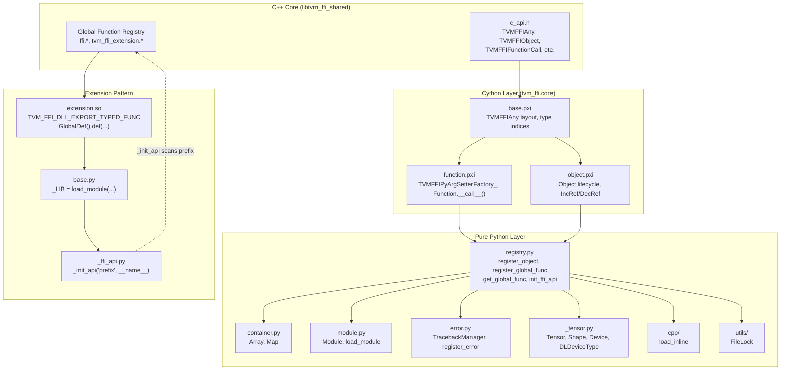
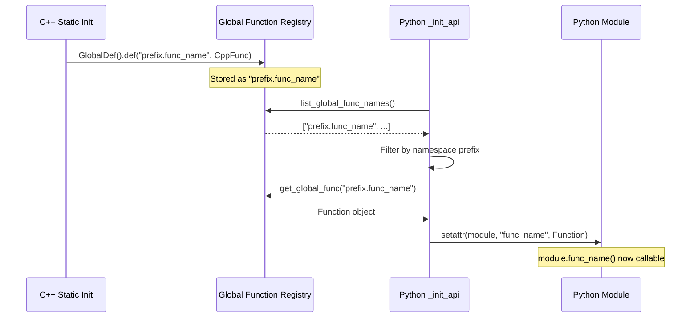

# Python Bindings and Packaging

**TL;DR**.
- The `tvm_ffi` Python package is a standalone, pip-installable binding layer built with Cython (compiled via scikit-build-core). It wraps all core FFI abstractions: Object, Function, Tensor, Array, Map, Shape, Module, error handling, serialization, and testing. Subpackages `tvm_ffi.cpp` (inline C++ compilation) and `tvm_ffi.utils` (FileLock) extend the toolkit.
- The `init_ffi_api` pattern (renamed from `_init_api` in `40f4d9d`) auto-populates Python modules from C++ global function registrations by namespace prefix, enabling zero-boilerplate Python wrappers for C++ libraries.
- Python traceback synthesis (`TracebackManager`) reconstructs mixed C++/Python stack traces at the Python level, controlled by the `cross_ffi_boundary` parameter in `TVMFFITraceback`.

## Problem Statement

### Background
- The C++ FFI provides all core abstractions (Any, Object, Function, containers) but these are only usable from C++. Python is the primary user-facing language for ML frameworks.
- ctypes-based bindings are simple but lack performance for tight loops and cannot express the full C++ type system. Cython provides C-speed interop with Python type safety.
- Extension libraries (precompiled kernel packages) need a standardized pattern for building wheels that depend on `tvm_ffi` at the ABI level without recompiling the core library.

### Solution
- A Cython-based `core` module provides the native interface layer (object lifecycle, function calling, type conversion, error handling), while pure-Python modules provide ergonomic wrappers.
- The `init_ffi_api` pattern plus `tvm_ffi.load_module` enables a canonical three-file extension pattern: `base.py` (loads DSO), `_ffi_api.py` (binds functions by prefix), `__init__.py` (public API).
- scikit-build-core with `wheel.py-api = "py3"` builds ABI-agnostic wheels, and RPATH configuration ensures the Cython extension finds the shared library in the wheel layout.

### Goals
- Full coverage of C++ FFI surface from Python (Object, Function, containers, errors, serialization).
- Zero-boilerplate Python module generation from C++ global function registrations.
- Pip-installable wheel packaging for both the core library and extension libraries.
- Non-goal: pure-Python fallback without Cython; async/await support.

## Design



### Key Classes, Fields and Interfaces

```python
# --- Library Loading (python/tvm_ffi/base.py) ---
_LIB: ctypes.CDLL  # Singleton: loaded at import time via libinfo.find_libtvm_ffi()
# Interacts with: libinfo.find_libtvm_ffi(), ctypes.CDLL(RTLD_GLOBAL)
# Invariant: Python >= 3.8 enforced at import (lowered from 3.9 in 5e2a0e5)
# Invariant: _LIB must be loaded before any Cython core module functions are called

# --- Registry (python/tvm_ffi/registry.py) ---
def register_object(type_key: str = None) -> Callable:
    """Decorator: maps a C++ type_key to a Python class via type index."""
    # Interacts with: core._object_type_key_to_index, core._register_object_by_index
    # Extension: subclass Object, decorate with @register_object("ffi.Foo")
    # Invariant: type_key must match the _type_key in C++ TVM_FFI_DECLARE_*_OBJECT_INFO

def register_global_func(func_name: str, f=None, override: bool = False) -> Function:
    """Register a Python callable into the global FFI function registry (renamed from register_func in 40f4d9d)."""
    # Interacts with: core._register_global_func (C ABI: TVMFFIFunctionSetGlobal)
    # Extension: any Python callable can be registered; wrapped in a Function object

def get_global_func(name: str, allow_missing: bool = False) -> Optional[Function]:
    """Retrieve a packed function by name from the global registry."""
    # Interacts with: core._get_global_func (C ABI: TVMFFIFunctionGetGlobal)
    # Invariant: returns None if allow_missing=True and function not found; else raises

def init_ffi_api(namespace: str, target_module_name: str = None) -> None:
    """Auto-populate a Python module's attributes from global FFI functions matching a prefix (renamed from _init_api in 40f4d9d)."""
    # Interacts with: list_global_func_names(), get_global_func()
    # Invariant: strips "tvm." prefix from namespace for C++ name matching
    # Extension: the canonical bridge pattern for C++ -> Python module binding

# --- Containers (python/tvm_ffi/container.py) ---
class Array(Object, collections.abc.Sequence):
    """Immutable array container backed by ffi.Array."""
    def __init__(self, input_list: Sequence[Any]): ...
    def __getitem__(self, idx: int) -> Any: ...
    def __len__(self) -> int: ...
    # Interacts with: _ffi_api.Array, _ffi_api.ArrayGetItem, _ffi_api.ArraySize
    # Invariant: immutable after construction (append/remove not supported)

class Map(Object, collections.abc.Mapping):
    """Immutable map container backed by ffi.Map."""
    def __init__(self, input_dict: Mapping[Any, Any]): ...
    def __getitem__(self, key: Any) -> Any: ...
    def __len__(self) -> int: ...
    # Interacts with: _ffi_api.Map, _ffi_api.MapGetItem, _ffi_api.MapCount

# --- Module (python/tvm_ffi/module.py) ---
class Module(Object):
    """Runtime module wrapping ffi.Module."""
    entry_name: str = "main"  # was "__tvm_ffi_main__"; prefix applied at C++ layer (40e8a51)
    def get_function(self, name: str, query_imports: bool = False) -> Function: ...
    # Interacts with: _ffi_api.ModuleGetFunction
    # Extension: __getattr__ delegates to get_function for attribute-style access

def load_module(path: str) -> Module: ...
    # Interacts with: _ffi_api.ModuleLoadFromFile
    # Invariant: file extension determines loader (dll/dylib/dso -> "so")

# --- Tensor, Shape, Device (python/tvm_ffi/_tensor.py, renamed from ndarray.py in 40f4d9d) ---
class Shape(tuple, PyNativeObject):
    """Immutable integer tuple backed by ffi.Shape."""
    # Interacts with: _ffi_api.Shape, core._shape_obj_get_py_tuple
    # Invariant: all elements must be integers

class Tensor(Object):
    """DLPack-compatible tensor (renamed from NDArray in 3a551d8)."""
    # Interacts with: DLTensor, core.from_dlpack, core._to_dlpack (was to_dlpack)

class DLDeviceType(IntEnum):
    """Device type enum extracted from Device class (40f4d9d), mirrors DLDeviceType in DLPack."""
    kDLCPU = 1; kDLCUDA = 2; kDLCUDAHost = 3  # ... 14 members total
    # Interacts with: Device.__init__, Device.dlpack_device_type()

class Device:
    """Thin wrapper around DLDevice (aligned with torch.device conventions in 40f4d9d)."""
    @property
    def type(self) -> str: ...         # was device_type (int property)
    @property
    def index(self) -> int: ...        # was device_id
    def dlpack_device_type(self) -> int: ...  # was device_type property
    # Interacts with: DLDeviceType, DLPack spec

class ObjectConvertible:  # was ObjectGeneric
    """Base class for objects convertible to TVM FFI Object."""
    def asobject(self) -> Object: ...

def device(device_type: Union[str, int], index: int = None) -> Device: ...
    # Convenience functions cpu(), cuda() etc. removed from tvm_ffi root (40f4d9d)

class OpaquePyObject(Object):
    """Cython wrapper for opaque PyObject container (91d69f0)."""
    def pyobject(self) -> object:
        """Recover the original Python object from the opaque handle."""
        # Invariant: returns the exact same Python object (identity-preserving)
    # Interacts with: TVMFFIOpaqueObjectGetCellPtr, _convert_to_opaque_object

# --- Inline C++ compilation (python/tvm_ffi/cpp/, 83805ec + 825aeb9) ---
# See design record 0013-load-inline.md for full details.

# --- Error Handling (python/tvm_ffi/error.py) ---
class TracebackManager:
    """Synthesizes Python traceback frames from C++ traceback strings."""
    def append_traceback(self, tb, filename, lineno, func) -> TracebackType: ...
    # Interacts with: core._WITH_APPEND_TRACEBACK (callback hook)
    # Extension: caches code objects per (filename, lineno, func) triple

def register_error(name_or_cls=None, cls=None) -> Callable:
    """Register a Python exception class for cross-FFI error propagation."""
    # Interacts with: core.ERROR_NAME_TO_TYPE, core.ERROR_TYPE_TO_NAME

# --- Conversion (python/tvm_ffi/convert.py) ---
def convert(value: Any) -> Any:
    """Convert Python values to FFI-compatible types."""
    # Interacts with: Array, Map, String, from_dlpack
    # Extension: falls through to core._convert_to_ffi_func for callables

# --- Cython Setter Dispatch Architecture (38d2cda, replaces make_args) ---
# TVMFFIPyCallManager: thread-local C++ call dispatcher with type-based setter cache.
#   - dispatch_map_: unordered_map<PyTypeObject*, TVMFFIPyArgSetter> (thread-local, no locking)
#   - FuncCall(setter_factory, func_handle, args, result, ret_code, release_gil): main call path
#   - ConstructorCall(setter_factory, func_handle, args, result, ret_code, parent_ctx):
#       constructor path, propagates stream/device/allocator to parent context (043d9f6)
#   Interacts with: TVMFFIPyArgSetterFactory_ (Cython), TVMFFIFunctionCall (C ABI)
#   Invariant: dispatch_map_ is thread-local, no locking needed

# TVMFFIPyArgSetter: per-type argument converter
#   func: setter function pointer
#   c_dlpack_exchange_api: const DLPackExchangeAPI*  # unified struct (22a78943, was 3 separate fields)
#   Interacts with: TVMFFIPyCallManager.SetArgument (dispatch cache)

# TVMFFIPyArgSetterFactory_(value, out): Cython factory mapping Python type -> setter
#   Dispatch order: Tensor > Object > DLPackCExporter > DType > Device >
#     str > bytes > ctypes_void_p > __tvm_ffi_opaque_ptr__ > ObjectRValueRef > __tvm_ffi_object__ >
#     DLPackExchangeAPI > __cuda_stream__ > __dlpack__ > Torch > Callable >
#     __dlpack_data_type__ > __dlpack_device__ > Exception > Fallback
#   Plus C++ predefined setters: Float, Int, Bool, None
#   Dedicated setters for tuple/list/dict/ObjectConvertible/PyNativeObject subtypes (043d9f6)
#   Invariant: numpy and torch imports are lazy (deferred to first use, not import time)
#   Note: __tvm_ffi_object__ (8873700), DLPackExchangeAPI (22a78943), __cuda_stream__ (b0537f0)
#   all use class-level hasattr (not instance-level) for consistent dispatch

# --- DLPack Exchange Protocol (22a78943, replaces f81ab9c/4dee97f separate dunders) ---
# Unified DLPackExchangeAPI struct (see 0007-c-abi.md) bundling 5 function pointers:
#   managed_tensor_allocator, managed_tensor_from_py_object_no_sync,
#   managed_tensor_to_py_object_no_sync, dltensor_from_py_object_no_sync, current_work_stream
# Detected via single class-level dunder attribute on tensor classes:
#   __c_dlpack_exchange_api__   (replaces __c_dlpack_from_pyobject__, __c_dlpack_to_pyobject__,
#                                __c_dlpack_tensor_allocator__ dunders)
# TVMFFIPyArgSetter now stores: c_dlpack_exchange_api (replaces 3 separate fields)
# TVMFFIPyCallContext now stores: c_dlpack_exchange_api (replaces c_dlpack_to_pyobject + allocator)
# Stream querying is decoupled from conversion: current_work_stream called separately
# All conversions are _no_sync -- consumer must handle synchronization explicitly
# Torch integration: TorchDLPackExchangeAPI singleton via TorchDLPackExchangeAPIPtr()
# Fallback: GetTorchFallbackExchangeAPI() provides managed_tensor_to_py_object_no_sync only
# Interacts with: _optional_torch_c_dlpack.py (JIT-compiled C++ extension for PyTorch)
# Invariant: env var TVM_FFI_SKIP_c_dlpack_from_pyobject still works (factory check path unchanged)

# --- __tvm_ffi_object__ Protocol (4bc89254 introduced as __tvm_ffi_tensor__, 8873700a generalized) ---
# Duck-type protocol method on any Python class to make instances passable through FFI:
#   def __tvm_ffi_object__(self) -> ffi.Object:
#       """Return the backing FFI object for argument passing."""
# Setter: TVMFFIPyArgSetterFFIObjectCompatible_ (renamed from TVMFFIPyArgSetterFFITensorCompatible_)
# Uses TVMFFIObjectGetTypeIndex(chandle) to determine actual type (not hardcoded kTVMFFITensor)
# Works with any Object type, not just Tensor
# Dispatch: TVMFFIPyArgSetterFactory_ checks hasattr(__tvm_ffi_object__)

# --- Internal cache attribute: _tvm_ffi_cached_object (8873700a, renamed from __tvm_ffi_object__) ---
# Used by PyNativeObject subclasses (String, Bytes, Shape) to cache the backing FFI object.
# __init_cached_object_by_constructor__ (renamed from __init_tvm_ffi_object_by_constructor__)
# Not a protocol -- just an implementation detail, hence single-underscore prefix.

# --- __cuda_stream__ Protocol (b0537f04) ---
# Duck-typed dunder attribute on any torch.cuda.Stream-like object:
#   __cuda_stream__: int  # raw CUDA stream pointer as integer
# Used by TVMFFIPyArgSetterFactory_ to detect and extract CUDA streams

# --- __dlpack_device__ Protocol (0f8bf9f) ---
# Duck-type protocol on any Python class to make instances passable as Device through FFI:
#   def __dlpack_device__(self) -> tuple[int, int]:
#       """Return (device_type, device_id) pair following DLPack convention."""
# Setter: TVMFFIPyArgSetterDLPackDeviceProtocol_
#   Calls arg.__dlpack_device__() -> (int, int) and converts via TVMFFIDLDeviceFromIntPair
# Invariant: class must NOT have __dlpack__ (to avoid conflict with tensor types that expose both;
#   tensor types are handled by the DLPack exchange path instead)
# Dispatch position: after __dlpack_data_type__, before Exception

# --- __dlpack_data_type__ Protocol (5e648f0) ---
# Duck-type protocol on any Python class to make instances passable as dtype through FFI:
#   def __dlpack_data_type__(self) -> tuple[int, int, int]:
#       """Return (type_code, bits, lanes) DLDataType tuple."""
# Setter: TVMFFIPyArgSetterDLPackDataTypeProtocol_
# Detection: class-level hasattr(arg_class, "__dlpack_data_type__")
# Dispatch position: after Callable, before __dlpack_device__
# Invariant: the returned tuple must contain exactly 3 integers matching DLDataType struct fields
# Related: dtype.from_dlpack_data_type(tuple[int,int,int]) -> dtype  (static factory)

# --- __tvm_ffi_opaque_ptr__ Protocol (42e0612) ---
# Duck-type protocol on any Python class to pass opaque C struct pointers through FFI:
#   def __tvm_ffi_opaque_ptr__(self) -> int:
#       """Return an integer representing the opaque C pointer value."""
# Setter: TVMFFIPyArgSetterFFIOpaquePtrCompatible_
# Uses kTVMFFIOpaquePtr type index and v_ptr field (same wire format as ctypes.c_void_p path)
# Dispatch position: after ctypes_void_p, before ObjectRValueRef
# Extension: DSL can wrap opaque C structs in Python objects and pass them to internal functions

# --- dtype.from_dlpack_data_type (5e648f0) ---
class dtype(str):
    _tvm_ffi_dtype: core.DataType  # Renamed from __tvm_ffi_dtype__ (5e648f0)

    @staticmethod
    def from_dlpack_data_type(dltype_data_type: tuple[int, int, int]) -> dtype:
        """Create a dtype from a DLPack data type tuple (type_code, bits, lanes)."""
        # Interacts with: core._create_dtype_from_tuple, core.DataType
        # Extension: enables round-tripping dtype from any __dlpack_data_type__ provider

# --- TypeSchema (Python side, 28fe3cc) ---
# TypeSchema: frozen dataclass for structured JSON type schema representation
#   origin: str        # Python-ized type name (via _TYPE_SCHEMA_ORIGIN_CONVERTER)
#   args: tuple[TypeSchema, ...] = ()
#   from_json_obj(obj: dict) -> TypeSchema
#   from_json_str(s: str) -> TypeSchema
#   repr(ty_map=None) -> str  # (dd4fb0a) optional ty_map for configurable type name rendering
# TypeField.metadata: dict[str, Any]  # parsed from JSON metadata
# TypeMethod.metadata: dict[str, Any]  # parsed from JSON metadata
# get_global_func_metadata(name: str) -> dict[str, Any]  # from registry.py

# --- Function construction from C/MLIR (a1536474, f6303b23) ---
# Function.__from_extern_c__(c_symbol: int, *, keep_alive_object=None) -> Function
#   Creates FFI Function from C-ABI safe_call function pointer
#   keep_alive_object is keyword-only (was positional before f6303b23)
# Function.__from_mlir_packed_safe_call__(mlir_packed_symbol: int, *, keep_alive_object=None) -> Function
#   Creates FFI Function from MLIR packed calling convention pointer (void(void**))
#   Adapter: TVMFFIPyMLIRPackedSafeCall bridges MLIR void(void**) to TVM FFI safe_call
#   MLIR packed args layout: void** -> {&handle, &args, &num_args, &rv, &ret_code}

# --- tvm-ffi-stubgen CLI (ea02e646) ---
# Command-line tool for regenerating inline type stubs:
#   uv run tvm-ffi-stubgen python
# Updates inline stub blocks (between tvm-ffi-stubgen(begin) / tvm-ffi-stubgen(end) markers)
# inside .py files with type annotations from C++ reflection registry

# --- Tensor.strides Python property (83770118) ---
# Python Tensor gains .strides property returning tuple of stride values
# Aligns with DLPack v1.2 semantics

# --- get_raw_stream Python API (22c049b8) ---
# tvm_ffi.get_raw_stream(device) -> int: retrieve current raw stream handle for a device

# --- Free-threaded Python 3.14t support (b64b46f3) ---
# Cython/C++ adaptations for free-threaded Python (no GIL):
# OpaquePyObject now proper child of Object hierarchy (not ReserveBuiltinTypeIndex workaround)

# --- __tvm_ffi_env_stream__ Protocol (db98729) ---
# Duck-typed dunder method on any object implementing __dlpack__:
#   def __tvm_ffi_env_stream__(self) -> int:
#       """Return the device stream handle for automatic stream forwarding in FFI calls."""
# Interacts with: TVMFFIEnvSetStream (C ABI), TVMFFIPyArgSetterFactory_ dispatch
# Invariant: only consulted for non-CPU devices when no prior stream context set

# --- Function.release_gil (f81ab9c) ---
# Function (now cdef class) has c_release_gil: int property
#   Default from TVM_FFI_RELEASE_GIL_BY_DEFAULT env var (default "1")
#   When False, GIL is held during FFI call (useful for short-running functions)
#   Interacts with: TVMFFIPyCallManager.FuncCall, Py_BEGIN_ALLOW_THREADS

# --- Auto-__init__ from __ffi_init__ (0729193) ---
# _add_class_attrs auto-generates __init__ for FFI classes during @register_object:
#   - If __ffi_init__ in type_info.methods AND __init__ not in type_cls.__dict__:
#       type_cls.__init__ = type_cls.__ffi_init__  (auto-forwarding)
#   - If no __ffi_init__ and not PyNativeObject subclass:
#       type_cls.__init__ = __init__invalid  (raises RuntimeError: "not implemented")
#   - Existing manual __init__ definitions (checked via __dict__) take precedence
# Interacts with: __ffi_init__ convention from C++ ObjectDef<T> reflection (0008)
# Invariant: eliminates silent chandle=None failures from missing constructors

# --- Stream Context Python Wrappers (3197cd09) ---
# tvm_ffi.StreamContext: context manager wrapping TVMFFIEnvSetStream
# tvm_ffi.use_raw_stream(device, handle): factory for StreamContext
# tvm_ffi.use_torch_stream(context=None): factory with torch integration
# Interacts with: EnvContext (0011), core._env_set_current_stream (Cython bridge)
```

### _init_api Bridge Pattern

The canonical pattern for exposing C++ functions to Python:



### Wheel Packaging Pattern

Extension libraries use a three-file pattern inside their Python package:

```python
# 1. base.py: Load the extension shared library
import tvm_ffi, os
_LIB = tvm_ffi.load_module(
    os.path.join(os.path.dirname(__file__), "my_extension.so")
)
# Invariant: shared lib must be co-located with __init__.py in the wheel

# 2. _ffi_api.py: Auto-bind C++ global functions by prefix
import tvm_ffi
from .base import _LIB  # noqa: F401  (side effect: ensures lib loaded)
tvm_ffi.init_ffi_api("my_extension", __name__)
# Extension: all functions registered under "my_extension.*" become module attrs

# 3. __init__.py: Public API
from . import _ffi_api
def my_func(x):
    return _ffi_api.my_func(x)
```

Built via scikit-build-core with `pyproject.toml`:
- `wheel.py-api = "py3"` for ABI-agnostic wheels
- RPATH set to `$ORIGIN` (Linux) / `@loader_path` (macOS) so Cython extension finds the shared library

### Contracts, Assumptions and Invariants
- **Library load order**: `tvm_ffi.base` must be imported before any Cython core functions are called. The `__init__.py` enforces this by importing `base` first.
- **Type key consistency**: `@register_object(type_key)` must match the `_type_key` in the C++ `TVM_FFI_DECLARE_*_OBJECT_INFO` macro. Mismatches cause `IsInstance` failures.
- **Zero-padding on None**: The `TVMFFIPyArgSetterNone_` setter must set `v_int64 = 0` when packing `None`, satisfying the C++ zero-padding invariant for `same_as()` and hashing. Failure to do so causes non-deterministic comparisons.
- **Optional dependency isolation**: `numpy` and `torch` are optional; their imports are guarded by try/except. `_dtype._NUMPY_DTYPE_TO_STR` (prefixed with `_` in 40f4d9d) is lazily populated. CUDA stream retrieval uses `torch._C._cuda_getCurrentRawStream(device_id)` directly (JIT compilation path removed in `1b07159`).
- **Opaque object fallback**: `convert()` wraps unknown Python types as `OpaquePyObject` (was `TypeError`) with identity-preserving round-trip (`91d69f0`). Deleter uses shared `tvm_ffi_pyobject_deleter` (renamed from `tvm_ffi_callback_deleter`).
- **Tensor DLPack ownership in `make_tensor_from_chandle`**: When a Tensor allocated in a C++ FFI function is returned to Python, the Cython helper `make_tensor_from_chandle` must call `TVMFFIObjectDecRef(chandle)` after DLPack conversion succeeds, because ownership transfers to `DLManagedTensor`'s deleter. On DLPack conversion failure, `dlpack.deleter(dlpack)` must be called to free the intermediate `DLManagedTensor` memory before falling back to the plain Tensor path. Without this, each returned Tensor permanently leaks one ref-count (`70927743`).
- **Docstring location convention**: Docstrings live in Cython `.pxi` source files (not `.pyi` stubs). `.pyi` files contain only bare type signatures with `...` bodies. The `# cython: annotation_typing=False` directive in `core.pyx` allows Python-style type annotations (e.g., `str | int`) without Cython interpreting them as Cython-level type declarations (`e10d1ed`).
- **setuptools_scm versioning**: `tvm_ffi.__version__` is dynamically derived from git tags via `setuptools_scm` (replaces hardcoded `pyproject.toml` version). `__version_tuple__` is a structured tuple for programmatic access. `_version.py` is auto-generated at build time and gitignored. Cross-language version consistency validated by `check_version.py --cpp --rust` (`ac63fb9`).
- **Version-gated dtype registration**: `MLDTYPES_DTYPE_TO_DTYPE` entries for `ml_dtypes >= 0.5` types (`int2`, `uint2`, `float8_e3m4`, etc.) are gated by `hasattr(ml_dtypes, "int2")`. This mirrors the existing `hasattr(torch, ...)` pattern for torch dtypes (`9574e9d`).

### Extension Points
- **Custom object types from Python**: Subclass `Object`, decorate with `@register_object("my.TypeKey")`. Fields are accessed via reflection attributes.
- **Custom FFI functions from Python**: Use `@register_func("name")` to register any Python callable. It becomes available to C++ and other languages via the global registry.
- **New extension packages**: Follow the `base.py` + `_ffi_api.py` + `__init__.py` pattern. The C++ side uses `TVM_FFI_DLL_EXPORT_TYPED_FUNC` for direct symbol export or `GlobalDef().def(...)` for reflection-based registration. See also `tvm_ffi.cpp.load_inline` (0013) for inline compilation.
- **`tvm-ffi-config` CLI**: Exposes include paths, lib paths, cmake paths, cxxflags, ldflags for downstream C++ consumers. Extension CMakeLists use `find_package(tvm_ffi)`.

### Usage Examples

#### Registering and calling FFI objects and functions (end-to-end)
**Context**: Complete Python workflow showing object registration, function registration, and container usage.
```python
import tvm_ffi

# Register a Python class for a C++ object type
@tvm_ffi.register_object("testing.TestObjectBase")
class TestObjectBase(tvm_ffi.Object):
    pass

# Register a global function
@tvm_ffi.register_global_func("my.add")
def my_add(a, b):
    return a + b

# Call through the global registry
f = tvm_ffi.get_global_func("my.add")
assert f(1, 2) == 3

# Use containers
arr = tvm_ffi.Array([1, 2, 3])
assert len(arr) == 3
m = tvm_ffi.Map({"key": "value"})
assert m["key"] == "value"

# Load a module and call exported functions
mod = tvm_ffi.load_module("path/to/extension.so")
func = mod.get_function("my_kernel")
```

#### Building an extension wheel (C++ to Python)
**Context**: Complete C++ extension export pattern with both DLL symbol export and reflection-based registration.
```cpp
// extension.cc: Two patterns for exporting functions
#include <tvm/ffi/function.h>
#include <tvm/ffi/reflection/registry.h>

// Pattern 1: Direct C-symbol export (found by DSOLibrary::GetSymbol)
int AddOne(DLTensor* x, DLTensor* y) { /* kernel code */ return 0; }
TVM_FFI_DLL_EXPORT_TYPED_FUNC(add_one, AddOne);

// Pattern 2: Reflection-based global registration (found by _init_api prefix scan)
void RaiseError(ffi::String msg) {
    TVM_FFI_THROW(RuntimeError) << msg;
}
TVM_FFI_STATIC_INIT_BLOCK() {
    ffi::reflection::GlobalDef().def("my_ffi_extension.raise_error", RaiseError);
}
```

```python
# Python side: auto-binding via _init_api
import my_ffi_extension
my_ffi_extension.add_one(x_tensor, y_tensor)    # calls DLL-exported symbol
my_ffi_extension.raise_error("test")             # calls reflection-registered func
```

## Alternatives & Trade-offs
### ctypes-only bindings (rejected)
- Pros: No build step for bindings; pure Python; simpler packaging.
- Cons: Performance overhead on tight loops; cannot express full C++ type system; manual struct layout management; no compile-time type safety.

### pybind11 (rejected)
- Pros: Automatic C++ to Python wrapping; header-only; large community.
- Cons: Generates per-function wrapper code (binary bloat); couples to specific Python ABI version (no ABI-agnostic wheels); does not integrate with the existing C ABI and packed calling convention.

## Related Work
### Design Records
- `0001-any-anyview-value-system.md` -- TVMFFIAny is the wire format for all Python-to-C++ value passing
- `0002-object-system.md` -- Object/ObjectRef lifecycle managed by Cython IncRef/DecRef
- `0003-function-system.md` -- Function objects and packed calling convention used by registry.py
- `0004-error-propagation.md` -- Error objects and traceback synthesis consumed by error.py
- `0006-containers.md` -- Array, Map, String backed containers wrapped in container.py
- `0007-c-abi.md` -- C ABI functions called by Cython core module
- `0008-reflection.md` -- _add_class_attrs_by_reflection, register_object_by_index
- `0011-module-system.md` -- Module.LoadFromFile consumed by module.py/load_module

### Evidence Matrix
- tvm_ffi package structure, _init_api, TracebackManager -> `commits/2025-08-24-2d41a511...md` + `2d41a51` + `tvm_ffi`, `_init_api`, `TracebackManager`
- Wheel packaging example, cmake install fix -> `commits/2025-08-30-4523a834...md` + `4523a83` + `examples/packaging`, `tvm_ffi_extension`
- Extension source and runner examples -> `commits/2025-09-01-5a3e3cbd...md` + `5a3e3cb` + `extension.cc`, `run_example.py`
- Cython make_args None zero-padding fix -> `commits/2025-08-31-3702e505...md` + `3702e50` + `make_args`, `v_int64 = 0`
- Optional dependency isolation (numpy/torch lazy) -> `commits/2025-08-25-2cf211f1...md` + `2cf211f` + `NUMPY_DTYPE_TO_STR`, `torch_get_current_cuda_stream`
- Plus 3 supporting commits: `7358796` (Windows compat), `ad8e5d2` (RPATH fix), `b245f1f`+`7d09d6a` (cmake libbacktrace revert pair)
- NDArray->Tensor rename -> `commits/2025-09-06-3a551d83...md` + `3a551d8` + `Tensor`, `_tensor.py`
- Python API cleanup: register_func->register_global_func, _init_api->init_ffi_api, DLDeviceType, Device alignment -> `commits/2025-09-07-40f4d9dc...md` + `40f4d9d`
- OpaquePyObject, convert() fallback -> `commits/2025-09-05-91d69f06...md` + `91d69f0` + `OpaquePyObject`, `_convert_to_opaque_object`
- Torch stream simplification -> `commits/2025-09-04-1b071590...md` + `1b07159` + `torch._C._cuda_getCurrentRawStream`
- Plus 3 supporting commits: `c695f5f` (docs scaffolding), `86ba210` (docs favicon), `236e9e9` (test xfail gating)
- Setter dispatch architecture (TVMFFIPyCallManager, TVMFFIPyArgSetter) -> `commits/2025-09-11-38d2cdaa...md` + `38d2cda` + `TVMFFIPyCallManager`, `TVMFFIPyArgSetterFactory_`
- DLPack exchange protocol, GIL release, EnvContext -> `commits/2025-09-12-f81ab9c2...md` + `f81ab9c` + `DLPackFromPyObject`, `release_gil`, `EnvContext`
- DLPack symbol rename (Exporter->FromPyObject) -> `commits/2025-09-12-4dee97f1...md` + `4dee97f` + `DLPackFromPyObject`, `DLPackToPyObject`
- String/Bytes C API, ConstructorCall, dedicated container setters -> `commits/2025-09-13-043d9f64...md` + `043d9f6` + `TVMFFIStringFromByteArray`, `TVMFFIPyConstructorCall`
- __tvm_ffi_env_stream__ protocol -> `commits/2025-09-09-db987299...md` + `db98729` + `__tvm_ffi_env_stream__`
- Python StreamContext wrappers -> `commits/2025-09-15-3197cd09...md` + `3197cd0` + `StreamContext`, `use_torch_stream`
- Plus 4 supporting commits: `af82dbb` (method __name__ fix), `cc93373` (bytearray helpers), `c665fa3` (torch CUDA optional), `7b813f8` (static init block syntax)
- TypeSchema, get_global_func_metadata, TypeField.metadata, TypeMethod.metadata -> `commits/2025-10-03-28fe3cc7...md` + `28fe3cc` + `TypeSchema`, `get_global_func_metadata`
- DataType->dtype schema rendering fix -> `commits/2025-10-07-c046b171...md` + `c046b17` + `DataType`, `dtype`
- TypeSchema.repr(ty_map) configurable display -> `commits/2025-10-08-dd4fb0ae...md` + `dd4fb0a` + `TypeSchema.repr`, `ty_map`
- get_raw_stream Python API -> `commits/2025-10-08-22c049b8...md` + `22c049b` + `get_raw_stream`
- Free-threaded Python 3.14t, OpaquePyObject hierarchy fix -> `commits/2025-10-10-b64b46f3...md` + `b64b46f` + free-threaded Python, `OpaquePyObject`
- Function.__from_extern_c__ -> `commits/2025-10-10-a1536474...md` + `a153647` + `__from_extern_c__`
- Function.__from_mlir_packed_safe_call__ -> `commits/2025-10-11-f6303b23...md` + `f6303b2` + `__from_mlir_packed_safe_call__`, `TVMFFIPyMLIRPackedSafeCall`
- DLPackExchangeAPI, __c_dlpack_exchange_api__ -> `commits/2025-10-11-22a78943...md` + `22a78943` + `DLPackExchangeAPI`, `__c_dlpack_exchange_api__`
- Tensor.strides Python property, DLPack v1.2 -> `commits/2025-10-12-83770118...md` + `8377011` + `Tensor.strides`
- tvm-ffi-stubgen CLI -> `commits/2025-10-12-ea02e646...md` + `ea02e64` + `tvm-ffi-stubgen`
- __tvm_ffi_tensor__ protocol -> `commits/2025-10-13-4bc89254...md` + `4bc8925` + `__tvm_ffi_tensor__`
- __tvm_ffi_tensor__ -> __tvm_ffi_object__ generalization -> `commits/2025-10-14-8873700a...md` + `8873700` + `__tvm_ffi_object__`, `_tvm_ffi_cached_object`
- __cuda_stream__ protocol -> `commits/2025-10-13-b0537f04...md` + `b0537f0` + `__cuda_stream__`
- TVMFFIErrorSetRaisedFromCStrParts -> `commits/2025-10-13-550e92fc...md` + `550e92f` + `TVMFFIErrorSetRaisedFromCStrParts`
- Tensor DLPack ref-count leak fix in make_tensor_from_chandle -> `commits/2025-10-03-70927743...md` + `7092774` + `TVMFFIObjectDecRef(chandle)`, `dlpack.deleter(dlpack)`
- __dlpack_device__ protocol -> `commits/2025-10-20-0f8bf9fc...md` + `0f8bf9f` + `__dlpack_device__`, `TVMFFIPyArgSetterDLPackDeviceProtocol_`
- __dlpack_data_type__ protocol, dtype.from_dlpack_data_type -> `commits/2025-10-20-5e648f05...md` + `5e648f0` + `__dlpack_data_type__`, `dtype.from_dlpack_data_type`
- __tvm_ffi_opaque_ptr__ protocol -> `commits/2025-10-16-42e06128...md` + `42e0612` + `__tvm_ffi_opaque_ptr__`, `TVMFFIPyArgSetterFFIOpaquePtrCompatible_`
- Auto-__init__ from __ffi_init__ -> `commits/2025-10-19-0729193f...md` + `0729193` + `_add_class_attrs`, `__init__invalid`
- Docstring convention: .pxi sources, annotation_typing=False -> `commits/2025-10-20-e10d1ed7...md` + `e10d1ed` + `annotation_typing=False`, `.pxi` docstrings
- setuptools_scm versioning, __version_tuple__ -> `commits/2025-10-26-ac63fb9b...md` + `ac63fb9` + `setuptools_scm`, `__version_tuple__`, `check_version.py`
- Version-gated ml_dtypes dtype registration -> `commits/2025-10-28-9574e9d0...md` + `9574e9d` + `MLDTYPES_DTYPE_TO_DTYPE`, `hasattr(ml_dtypes, "int2")`
