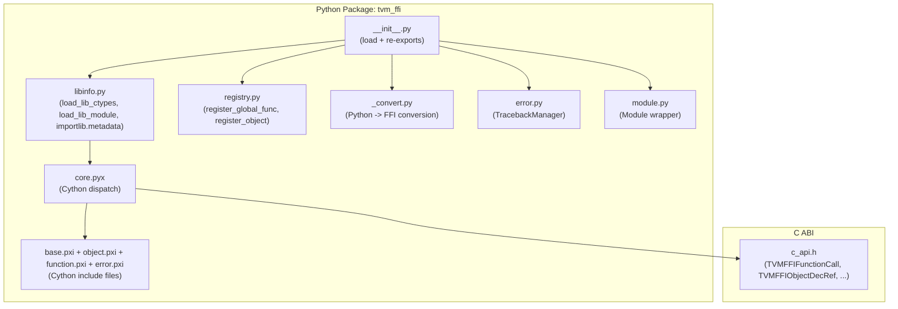

# FFI Python Package (`tvm_ffi`)

**TL;DR**.
- `tvm_ffi` is a standalone pip-installable Python package that provides Cython bindings over the C ABI, exposing all FFI types (Object, Function, Error, Tensor, Module, String, etc.) as first-class Python objects with reference-counted handles.
- Library loading: `libinfo.load_lib_ctypes()` (6887892d, replacing `base.py`/`find_library_by_basename`) uses `importlib.metadata` RECORD-based discovery as primary strategy, with env-var and relative-path fallbacks. `tvm_ffi.LIB` is the public module-level `ctypes.CDLL` handle. Cython `core.pyx` (composed from `*.pxi` includes) provides the C-level type dispatch table keyed by `TVMFFITypeIndex`.
- Cross-language function registration uses `register_global_func` / `get_global_func` (renamed from `register_func`), and the `init_ffi_api` pattern (renamed from `_init_api`) auto-populates Python modules from C++-registered function namespaces.
- The `convert()` function wraps unrecognized Python objects as `OpaquePyObject` (no longer raises `TypeError`), enabling arbitrary Python objects to be stored in FFI containers and passed through FFI function calls.

## Problem Statement
### Background
- The C++ FFI core defines types, functions, and error handling behind a stable C ABI. Python users need idiomatic access to all of this -- calling packed functions, constructing objects, handling errors with Python tracebacks -- without manually managing C pointers.
- Prior to this package, Python bindings were embedded in the broader TVM project. Extracting `tvm_ffi` as a standalone pip-installable package enables independent distribution and reuse by downstream projects.

### Solution
- A Cython extension module (`core.pyx`) that directly calls C ABI functions (`TVMFFIFunctionCall`, `TVMFFIObjectDecRef`, etc.) and maintains a Python-side dispatch table mapping `type_index` -> Python class for automatic return value wrapping.
- Library discovery (`libinfo.py`) uses `importlib.metadata` RECORD parsing as the primary strategy (6887892d), with fallbacks to relative/dev paths and env vars (`LD_LIBRARY_PATH`/`DYLD_LIBRARY_PATH`/`PATH`). `__init__.py` calls `libinfo.load_lib_ctypes("apache-tvm-ffi", "tvm_ffi", "RTLD_GLOBAL")` directly. `base.py` has been removed.
- `registry.py` provides decorators and lookup functions that bridge the C++ global function/object registries to Python.

### Goals
- Standalone `pip install` via scikit-build-core (CMake + Cython build).
- Full coverage of C ABI types: Object, Function, Error, String, Bytes, Tensor (was NDArray), Shape, Array, Map, Module.
- Cross-language traceback reconstruction so C++ errors surface with meaningful Python stack frames.
- Non-goal: pure-Python fallback (Cython is required for performance-critical arg packing).

## Design



### Key Classes, Fields and Interfaces

```python
# --- Cython core: Object hierarchy (core.pyx + object.pxi) ---

cdef class CObject:
    """Cython extension type; owns the C handle. Low-level only (49a5d71).
    Renamed from `Object` to allow pure-Python `Object` with metaclass."""
    chandle: void_ptr  # cdef field; pointer to TVMFFIObject-derived struct
    # Invariant: chandle is NULL-initialized; __dealloc__ guarded by NULL check
    # Interacts with: TVMFFIObjectDecRef (C ABI), _register_object_by_index (dispatch table)

    def __dealloc__(self):
        TVMFFIObjectDecRef(self.chandle)

    def __init_handle_by_constructor__(self, constructor: Function, *args):
        """Call a C++ constructor and take ownership of the returned handle."""
        # Interacts with: TVMFFIFunctionCall
        # Invariant: steals the returned object ref (no extra IncRef)

    def __reduce__(self):
        return (_new_object, (type(self),), self.__getstate__())
        # Interacts with: _OBJECT_TO_JSON_GRAPH_STR / _OBJECT_FROM_JSON_GRAPH_STR

    def same_as(self, other: "CObject") -> bool:
        return self.chandle == other.chandle  # pointer identity

class _ObjectSlotsMeta(ABCMeta):
    """Metaclass that auto-injects __slots__=() into every Object subclass (49a5d71).
    Prevents accidental instance attribute creation on FFI objects.
    NOTE (721d878): __instancecheck__/__subclasscheck__ overrides REMOVED — they were broken,
    causing isinstance(Map(...), Array) to return True. Standard Python MRO now governs
    isinstance/issubclass for the Object hierarchy."""
    def __new__(mcls, name, bases, ns, **kwargs):
        if "__slots__" not in ns:
            ns["__slots__"] = ()
        return super().__new__(mcls, name, bases, ns, **kwargs)
    # Invariant: __slots__ always present in class namespace after metaclass processing
    # Invariant: isinstance/issubclass use standard Python MRO (no metaclass overrides)
    # Extension: subclasses needing __dict__ must declare __slots__ = ("__dict__",) explicitly
    # Failure mode: without __slots__, setting arbitrary attrs on FFI objects wastes memory
    #   and can mask bugs where users set Python attrs thinking they persist in C++

class Object(CObject, metaclass=_ObjectSlotsMeta):
    """Python base for all TVM FFI objects. Enforces slots policy (49a5d71).
    All subclasses auto-get __slots__ = () via _ObjectSlotsMeta."""
    __slots__ = ()
    # Interacts with: CObject (handle ownership), _ObjectSlotsMeta (slots enforcement)
    # Invariant: obj.x = 1 raises AttributeError unless __slots__ declares "x"

class Function(Object):  # now cdef class (f81ab9c)
    """Cython wrapper for FunctionObj. Callable with packed args."""
    release_gil: bool  # default from TVM_FFI_RELEASE_GIL_BY_DEFAULT env var (default "1")
    # Invariant: when True, GIL released during TVMFFIFunctionCall; when False, GIL held

    def __call__(self, *args) -> Any:
        # Dispatched via TVMFFIPyCallManager (38d2cdaa refactor):
        # 1. TVMFFIPyArgSetterFactory_ classifies each arg type ONCE per PyTypeObject*,
        #    caches the setter function pointer in thread-local dispatch_map_
        # 2. TVMFFIPyCallManager::Call() uses cached setters for subsequent calls
        # 3. CallStack RAII manages packed_args memory + temp object lifetimes
        # 4. Sets stream context if non-CPU device detected
        # 5. Releases GIL if release_gil=True, calls TVMFFIFunctionCall
        # 6. make_ret: dispatches result.type_index to construct Python object
        #    (auto-converts Tensor to torch.Tensor when DLPackToPyObject importer active)
        ...
    # Interacts with: TVMFFIPyFuncCall -> TVMFFIPyCallManager::Call -> TVMFFIFunctionCall
    # Interacts with: TVMFFIPyArgSetter (cached per-type setter dispatch)
    # Extension: new type setters registered via TVMFFIPyArgSetterFactory_ in Cython

class Error(Object):
    """FFI error object wrapper."""
    kind: str       # property -> C++ ErrorObj.kind
    message: str    # property -> C++ ErrorObj.message
    traceback: str  # property -> C++ ErrorObj.traceback

    def py_error(self) -> Exception:
        """Convert to Python exception with reconstructed traceback."""
        # Interacts with: TracebackManager._get_cached_code_object
        # Interacts with: ERROR_NAME_TO_TYPE registry (maps kind -> Python exception class)
        # Interacts with: _WITH_APPEND_TRACEBACK hook
        ...

    def update_traceback(self, traceback: str):
        """Append Python-side traceback info to the error."""
        ...

# Additional Cython types sharing chandle pattern:
# String(Object), Tensor(Object) (renamed from NDArray), Device, DataType

class OpaquePyObject(Object):
    """Cython wrapper for opaque Python objects managed by FFI."""
    def pyobject(self) -> object:
        """Extract the original Python object from the opaque wrapper."""
        # Casts TVMFFIOpaqueObjectCell.handle back to PyObject*
        # Interacts with: TVMFFIOpaqueObjectGetCellPtr
    # Invariant: Python refcount balanced -- INCREF on wrap, DECREF on FFI release
    # Interacts with: convert() fallback (wraps unrecognized types as OpaquePyObject)

# --- Dispatch table (core.pyx) ---
# _object_class_table: dict[int, type]
# Populated by _register_object_by_index(type_index, cls)
# make_ret() looks up type_index -> cls to construct the right Python type
# Extension: register_object decorator calls _object_type_key_to_index to get index,
#            then _register_object_by_index to bind the Python class

# --- Arg packing: TVMFFIPyCallManager dispatcher (38d2cdaa refactor) ---
# Replaces the old make_args/FuncCall/FuncCall3 pattern.

class TVMFFIPyCallContext:
    """Per-call context tracking device, stream, and temp object lifetime."""
    packed_args: TVMFFIAny_ptr      # workspace for packed args
    device_type: int                 # detected device type (-1 = unset)
    device_id: int
    stream: void_ptr
    dlpack_c_exchange_api: const_DLPackExchangeAPI_ptr  # renamed from c_dlpack_exchange_api (539364726)
    call_stack: TVMFFIPyCallStack_ptr  # NEW (3dd7a817): pointer to shared thread-local memory
    temp_ffi_objects: void_ptr_array # dec-refed on scope exit
    temp_py_objects: void_ptr_array  # Py_DecRef'd on scope exit
    # Invariant: destructor also cleans up call_stack->extra_temp_py_objects_stack entries

class TVMFFIPyCallStack:
    """Thread-local reusable memory for FFI call argument packing (3dd7a817)."""
    args_stack: list[TVMFFIAny]              # pre-allocated 4K-aligned stack
    args_stack_top: int                       # current stack top index
    extra_temp_py_objects_stack: list[void_ptr]  # overflow temp storage for __tvm_ffi_value__
    # Invariant: args_stack is 4096/sizeof(TVMFFIAny) entries by default
    # Interacts with: TVMFFIPyCallContext (reads/writes stack_top and extra stack)

class TVMFFIPyArgSetter:
    """Cached function-pointer struct for converting one Python type to TVMFFIAny."""
    func: Callable[[TVMFFIPyArgSetter*, TVMFFIPyCallContext*, PyObject*, TVMFFIAny*], int]
    dlpack_c_exchange_api: const_DLPackExchangeAPI_ptr  # renamed from c_dlpack_exchange_api (539364726)
    # Interacts with: TVMFFIPyCallManager.dispatch_map_ (cached by PyTypeObject*)
    # Extension: implement new setter function with this signature, register via factory

class TVMFFIPyCallManager:
    """Thread-local manager that dispatches Python->C arg conversion."""
    # dispatch_map_: dict[PyTypeObject*, TVMFFIPyArgSetter]  (thread-local cache)
    # Interacts with: TVMFFIFunctionCall, TVMFFIEnvSetStream
    # Invariant: dispatch_map_ is thread-local, no synchronization needed
    # Invariant: dispatch_map_ keys (PyTypeObject*) remain valid because
    #   _DISPATCH_TYPE_KEEP_ALIVE (module-level set) holds strong refs to every
    #   registered type, preventing GC and pointer reuse. Without this, a GC'd
    #   type's memory address could be reused by a new type, causing wrong setter dispatch.
    # _DISPATCH_TYPE_KEEP_ALIVE_LOCK: threading.Lock guards concurrent writes
    # Free-threaded Python (b64b46f3): TVMFFIPyWithGILIfNotFreeThreaded RAII guard
    #   acquires GIL on traditional Python, no-op on free-threaded (Py_GIL_DISABLED).
    #   TVMFFIPyObjectDeleter replaces old Cython tvm_ffi_pyobject_deleter (with gil).
    #   CMake detects Py_GIL_DISABLED, disables USE_SABI for free-threaded builds.
    def Call(setter_factory, func_handle, py_args, result, ret_code) -> int: ...
        # 1. Allocates CallStack RAII scope from reusable stack
        # 2. Iterates tuple, calls SetArgument per arg (cached setter dispatch)
        # 3. Sets stream context if device detected
        # 4. Releases GIL (if enabled), calls TVMFFIFunctionCall
        # 5. Restores stream, returns
    def ConstructorCall(setter_factory, func_handle, py_args, result, ret_code, parent_ctx) -> int: ...
        # Recursive arg conversion for nested containers (043d9f64)
        # Invariant: does NOT release GIL; propagates device/stream from child to parent

# Predefined POD setters (C++ noexcept, bypass Python dispatch):
# TVMFFIPyArgSetterFloat_, TVMFFIPyArgSetterInt_, TVMFFIPyArgSetterBool_, TVMFFIPyArgSetterNone_

# Cython-side typed setters (registered via TVMFFIPyArgSetterFactory_):
# TVMFFIPyArgSetterTensor_, TVMFFIPyArgSetterObject_,
# TVMFFIPyArgSetterFFIObjectProtocol_ (for __tvm_ffi_object__ protocol; renamed from FFIObjectCompatible_ by c1df05f3),
# TVMFFIPyArgSetterDLPackExchangeAPI_ (for __dlpack_c_exchange_api__, renamed from __c_dlpack_exchange_api__, 539364726),
# TVMFFIPyArgSetterCUDAStreamProtocol_ (for __cuda_stream__ protocol; renamed from CUDAStream_ by 6c85e562),
# TVMFFIPyArgSetterCUDADriverStreamFallback_ (for cuda.bindings.driver.CUstream; 6c85e562),
# TVMFFIPyArgSetterIntProtocol_ (for __tvm_ffi_int__ protocol; c1df05f3),
# TVMFFIPyArgSetterFloatProtocol_ (for __tvm_ffi_float__ protocol; c1df05f3),
# TVMFFIPyArgSetterIntegral_ (for numbers.Integral subclasses; c1df05f3),
# TVMFFIPyArgSetterReal_ (for numbers.Real subclasses; c1df05f3),
# TVMFFIPyArgSetterCtypesVoidPtr_ (for ctypes.c_void_p),
# TVMFFIPyArgSetterFFIOpaquePtrCompatible_ (for __tvm_ffi_opaque_ptr__ protocol, 42e0612),
# TVMFFIPyArgSetterDLPackDataTypeProtocol_ (for __dlpack_data_type__ protocol, 5e648f0),
# TVMFFIPyArgSetterDLPackDeviceProtocol_ (for __dlpack_device__ protocol, 0f8bf9f),
# TVMFFIPyArgSetterFFIValueProtocol_ (for __tvm_ffi_value__ protocol; 3dd7a817; after __tvm_ffi_float__, before Exception;
#     calls arg.__tvm_ffi_value__(), pushes to extra_temp_py_objects_stack, re-dispatches via
#     TVMFFIPySetArgumentGenericDispatcher; supports recursive resolution),
# TVMFFIPyArgSetterTorchFallback_, TVMFFIPyArgSetterDLPack_, TVMFFIPyArgSetterDType_,
# TVMFFIPyArgSetterDevice_, TVMFFIPyArgSetterStr_, TVMFFIPyArgSetterBytes_,
# TVMFFIPyArgSetterTuple_, TVMFFIPyArgSetterTupleLike_, TVMFFIPyArgSetterMap_,
# TVMFFIPyArgSetterObjectConvertible_, TVMFFIPyArgSetterCallable_, TVMFFIPyArgSetterFallback_

# String/bytes setters now use C ABI (043d9f64):
# TVMFFIPyArgSetterStr_ -> encodes to UTF-8 -> TVMFFIStringFromByteArray (owned String)
# TVMFFIPyArgSetterBytes_ -> TVMFFIBytesFromByteArray (owned Bytes)

# __dlpack_c_exchange_api__ protocol (22a78943, renamed from __c_dlpack_exchange_api__ by 539364726):
# Zero-overhead C-level DLPack exchange via unified DLPackExchangeAPI struct.
# Bundles 5 function pointers: managed_tensor_allocator, managed_tensor_from_py_object_no_sync,
# managed_tensor_to_py_object_no_sync, dltensor_from_py_object_no_sync (non-owning), current_work_stream.
# Versioned header with prev_api chain for forward compatibility.
# Set as class attribute: type(arg).__dlpack_c_exchange_api__ (checked on class, not instance; renamed from __c_dlpack_exchange_api__ by 539364726).
# Attribute type: int | PyCapsule (7f3bb771). PyCapsule name must be "dlpack_exchange_api".
# Backward compatibility: _check_and_update_dlpack_c_exchange_api() detects legacy __c_dlpack_exchange_api__ and auto-upgrades (539364726).
# Env var: TVM_FFI_SKIP_DLPACK_C_EXCHANGE_API (renamed from TVM_FFI_SKIP_C_DLPACK_EXCHANGE_API, 539364726).
# Cython _get_dlpack_exchange_api() dispatches on either type, extracting DLPackExchangeAPI* pointer.
# _create_dlpack_exchange_api_capsule(ptr_as_int) wraps int -> PyCapsule at import time.
# Eager upgrade: load_torch_c_dlpack_extension() converts legacy int attribute to PyCapsule in place.
# load_torch_c_dlpack_extension() has been refactored (e6a654aa, 70577053):
# - Old: inline C++ compiled via torch.utils.cpp_extension.load_inline
# - New: ctypes.CDLL of pre-built or JIT-built shared library
# - Build script: _build_optional_torch_c_dlpack.py with AOT (--build-dir) and JIT modes
# - Library naming: libtorch_c_dlpack_addon_torch{major}{minor}-{cpu|cuda|rocm}.so (752ac8ed)
# - TVM_FFI_DISABLE_TORCH_C_DLPACK env var gates addon loading (e6a654aa)
# - TVM_FFI_JIT_EXTRA_CFLAGS / TVM_FFI_JIT_EXTRA_LDFLAGS for cross-compilation (6d8b134f)
# - ROCm backend support via --build-with-rocm (752ac8ed)
# - Platform-split build (7a355c77): _run_build_on_linux_like() (direct c++ invocation) vs
#   _generate_ninja_build_windows() (Ninja retained). Non-Windows no longer requires ninja.
# - Symbol visibility: -fvisibility=hidden default (7cd2e500)
# - CUDA detection uses torch.cuda.is_available() then version.cuda/version.hip (4fc83d78)
# - DLPackExchangeAPI integrated into from_dlpack() as highest-priority path (7f3f8726)
# Skips JIT compile when torch.Tensor already provides
# __c_dlpack_exchange_api__ natively (33738534).

# __tvm_ffi_object__ protocol (4bc8925, generalized from __tvm_ffi_tensor__ by 8873700a):
# Any class implementing __tvm_ffi_object__() -> Object can be passed to FFI calls.
# TVMFFIPyArgSetterFFIObjectProtocol_ reads type_index dynamically via TVMFFIObjectGetTypeIndex.
# Handles temporary object lifetime: if ref_count==1, keeps obj alive via ctx.temp_py_objects.

# __cuda_stream__ protocol (b0537f04):
# Objects implementing __cuda_stream__() -> tuple[str, int] are converted to opaque void*.
# TVMFFIPyArgSetterCUDAStreamProtocol_ extracts the stream pointer from tuple[1].
# Fallback: cuda.bindings.driver.CUstream without __cuda_stream__ protocol uses
# TVMFFIPyArgSetterCUDADriverStreamFallback_ which calls int(arg) (6c85e562).

# __tvm_ffi_int__ protocol (c1df05f3):
# Any class implementing __tvm_ffi_int__() -> int is auto-converted to kTVMFFIInt.
# TVMFFIPyArgSetterIntProtocol_ calls arg.__tvm_ffi_int__() and packs as int64.
# Dispatch priority: after __dlpack_device__, before Exception.

# __tvm_ffi_float__ protocol (c1df05f3):
# Any class implementing __tvm_ffi_float__() -> float is auto-converted to kTVMFFIFloat.
# TVMFFIPyArgSetterFloatProtocol_ calls arg.__tvm_ffi_float__() and packs as float64.

# numbers.Integral / numbers.Real setters (c1df05f3):
# Dedicated setters TVMFFIPyArgSetterIntegral_ and TVMFFIPyArgSetterReal_
# use Cython-level <long long> / <double> casts instead of reusing exact-type setters.
# Invariant: Integral check comes BEFORE Real check (Integral is subclass of Real).

# __tvm_ffi_opaque_ptr__ protocol (42e0612):
# Any class implementing __tvm_ffi_opaque_ptr__() -> int can pass a raw pointer to FFI calls.
# TVMFFIPyArgSetterFFIOpaquePtrCompatible_ packs as kTVMFFIOpaquePtr in TVMFFIAny.v_ptr.
# Invariant: __tvm_ffi_opaque_ptr__() must return an integer castable to void*;
#            lifetime of the pointed-to memory is the caller's responsibility.
# Dispatch priority: after ctypes.c_void_p, before callable.

# __dlpack_data_type__ protocol (5e648f0):
# Any class implementing __dlpack_data_type__() -> tuple[int, int, int] is auto-converted
# to DLDataType when passed as FFI argument (type_code, bits, lanes).
# TVMFFIPyArgSetterDLPackDataTypeProtocol_ unpacks into TVMFFIAny.v_dtype.
# Dispatch priority: after numpy.dtype, before Exception.

# __dlpack_device__ protocol (0f8bf9f):
# Any class implementing __dlpack_device__() -> tuple[int, int] (but NOT __dlpack__)
# is auto-converted to Device when passed as FFI argument.
# TVMFFIPyArgSetterDLPackDeviceProtocol_ packs as kTVMFFIDevice.
# Invariant: only dispatched when class has __dlpack_device__ but NOT __dlpack__.
# Dispatch priority: after __dlpack_data_type__, before Exception.

# _tvm_ffi_cached_object (renamed from __tvm_ffi_object__ attribute by 8873700a):
# PyNativeObject internal attribute caching the underlying FFI Object handle.

# --- Registry (python/tvm_ffi/registry.py) ---

def register_object(type_key: str | type) -> type:
    """Decorator: bind Python class to a C++ object type."""
    # 1. core._object_type_key_to_index(type_key) -> type_index
    # 2. core._add_class_attrs_by_reflection(cls, type_index)
    # 3. core._register_object_by_index(type_index, cls)
    # 4. _install_init(cls, enabled=True) (6973d22): universally wires __init__
    #    - If auto-init available: __init__ = _make_init(cls, type_info)
    #    - Elif class is not constructable: install guard __init__ with descriptive error
    #    (Previously only @c_class did this; now all register_object classes get it)
    # Invariant: type_key must be registered in C++ reflection first
    # Invariant: every registered class either has working __init__ or explicit error sentinel
    # Interacts with: Object dispatch table, ObjectDef reflection, _make_init, _install_init

def register_global_func(func_name: str | Callable, f=None, override=False):
    """Register a Python callable as a global FFI function. Renamed from register_func."""
    # Interacts with: core._register_global_func -> TVMFFIFuncRegisterGlobal

def get_global_func(name: str, allow_missing: bool = False) -> Function | None:
    """Retrieve a global FFI function by name."""
    # Interacts with: core._get_global_func -> TVMFFIFuncGetGlobal

def init_ffi_api(namespace: str, target_module_name: str | None = None):
    """Auto-populate a Python module with global funcs matching a namespace prefix.
    Renamed from _init_api."""
    # Convention: strips "tvm." prefix, scans registry for matching names,
    #             injects each function as module-level attribute
    # Interacts with: list_global_func_names, get_global_func
    # Extension: downstream packages use this to expose C++ functions

# --- Library loading (python/tvm_ffi/libinfo.py + base.py) ---

def find_library_by_basename(base: str) -> str:
    """Generic library discovery: find a shared library by base name across known dirs (da7007f).
    Delegates to get_dll_directories() for candidate paths."""
    # Interacts with: get_dll_directories()
    # Invariant: raises RuntimeError if no matching library found
    # Extension: use for any co-packaged library (e.g., "tvm_ffi_testing", future addons)

def find_libtvm_ffi() -> str:
    """Now delegates to find_library_by_basename('tvm_ffi')."""
    # Invariant: must succeed before any Cython import

def find_cmake_path() -> str:
    """Find cmake/ directory for find_package(tvm_ffi) in extensions."""
    # Returns: <prefix>/share/cmake/tvm_ffi/ (relocated from <prefix>/cmake/, df04392)

# --- Traceback reconstruction (python/tvm_ffi/error.py) ---

class TracebackManager:
    """Reconstructs Python traceback frames from C++ backtrace strings."""
    def _get_cached_code_object(self, filename: str, lineno: int, func: str):
        """Create synthetic code objects from C++ frame info."""
        # Uses ast.parse to create CodeType, caches by (filename, func)
        # Interacts with: Error.py_error() via _WITH_APPEND_TRACEBACK hook
        # Interacts with: types.FrameType (constructs frame chain)

# --- convert.py ---

def convert(value: Any) -> Any:
    """Convert Python object to FFI value."""
    # Handles: int, float, bool, str, bytes, list->Array, dict->Map,
    #          Object (passthrough), DLPack-compatible (numpy, torch),
    #          Function, Error
    #          Unrecognized types -> OpaquePyObject (no longer raises TypeError)
    # Note: nested containers (list, tuple, dict) are now recursively converted
    #   in-band via Cython setters (TVMFFIPyArgSetterTuple_, Map_, etc.) using
    #   TVMFFIPyConstructorCall, NOT via Python-level convert() (043d9f64).
    #   The old _FUNC_CONVERT_TO_OBJECT callback registration was removed.
    # Extension: add elif branch for new Python types before the opaque fallback

class ObjectConvertible:
    """Base for Python classes convertible to FFI objects. Renamed from ObjectGeneric."""
    def asobject(self): ...
    # Interacts with: convert() dispatch, make_args in function.pxi

# --- Python Stream Context Managers (python/tvm_ffi/_stream.py, 3197cd09) ---

class StreamContext:
    """Python context manager wrapping TVMFFIEnvSetStream with save/restore."""
    device_type: int; device_id: int; stream: int; prev_stream: int
    def __enter__(self) -> None: ...
    # Interacts with: core._env_set_current_stream -> TVMFFIEnvSetStream (C ABI)
    # Invariant: __exit__ restores prev_stream; nesting is safe if enter/exit balanced
    def __exit__(self, *args) -> None: ...

def use_torch_stream(context: Optional[Any] = None) -> TorchStreamContext: ...
    # Interacts with: torch.cuda.Stream, torch.cuda.CUDAGraph
    # Enters torch context first, then reads current_stream handle for FFI sync

def use_raw_stream(device: Device, stream: Union[int, c_void_p]) -> StreamContext: ...
    # Direct stream handle usage without torch dependency

def get_raw_stream(device: Device) -> int: ...
    # Read-side counterpart to use_raw_stream (22c049b8)
    # Delegates to core._env_get_current_stream -> TVMFFIEnvGetStream (C env API)
    # Returns 0 if no stream has been set

class DLDeviceType(IntEnum):
    """Standalone enum for DLPack device type codes. Extracted from Device class constants."""
    kDLCPU = 1; kDLCUDA = 2; kDLCUDAHost = 3  # ... 14 total
    # Interacts with: Device.dlpack_device_type()

class Device:
    """Thin wrapper around DLDevice. Properties renamed for torch consistency."""
    @property
    def type(self) -> str: ...       # was device_type (which returned int)
    @property
    def index(self) -> int: ...      # was device_id
    def dlpack_device_type(self) -> int: ...  # new method, returns DLDeviceType int
    # Internal: _DEVICE_TYPE_TO_NAME, _DEVICE_NAME_TO_TYPE (prefixed with underscore)
```

### Contracts, Assumptions and Invariants
- **Import order**: `base.py` must be imported before any Cython code. The `__init__.py` enforces this by importing `base` first. Loading the `.so` via `ctypes.CDLL` with `RTLD_GLOBAL` ensures symbols are available to the Cython extension.
- **Dispatch table completeness**: Every C++ object type that should round-trip through Python must have a registered Python class via `register_object`. Otherwise `make_ret()` falls back to the generic `Object` base class.
- **Zero-padding invariant in make_args**: When packing `None` arguments, `v_int64` must be explicitly zeroed (not left as stack garbage). This ensures `same_as()` and `AnyEqual` comparisons work correctly across language boundaries.
- **Torch stream access**: CUDA stream is retrieved via `torch._C._cuda_getCurrentRawStream(device_id)` -- the same native torch C API used by dynamo. The previous lazy JIT-compiled `torch_get_current_cuda_stream` sentinel pattern was removed. Torch is still optional (imported with try/except).
- **GIL release control**: `Function.release_gil` (default `True`, configurable via `TVM_FFI_RELEASE_GIL_BY_DEFAULT` env var) determines whether GIL is released during `TVMFFIFunctionCall`. Set to `False` for short-running calls where GIL release overhead dominates.
- **Nested container conversion**: `tuple`, `list`, `dict` args are now recursively converted via Cython setters using `TVMFFIPyConstructorCall`, which propagates device/stream/DLPack allocator context from child to parent. The old Python-level `_FUNC_CONVERT_TO_OBJECT` callback was removed.
- **`make_tensor_from_chandle` ownership protocol**: When `c_dlpack_to_pyobject` is active (e.g., torch DLPack auto-import), the return path involves a three-way ref-count handoff: (1) `TVMFFITensorToDLPackVersioned` creates a `DLManagedTensorVersioned` that holds its own reference to the underlying tensor object, (2) `c_dlpack_to_pyobject` wraps the DLPack into a Python tensor (e.g., `torch.Tensor`), (3) the original `chandle` reference must be explicitly released via `TVMFFIObjectDecRef(chandle)` to avoid leaking one ref per return. On the error path, if `c_dlpack_to_pyobject` throws, `dlpack.deleter(dlpack)` is called to free the DLManagedTensor before falling through to the default chandle path.

### Extension Points
- **Custom Python types via `register_object`**: Any C++ object type with reflection registration can be bound to a Python class by decorating with `@register_object("type.Key")`.
- **`init_ffi_api` for downstream packages**: Extensions call `tvm_ffi.init_ffi_api("pkg_name", __name__)` to auto-import all C++-registered functions matching the namespace prefix.
- **`convert()` dispatch**: Add new Python-to-FFI type conversions by extending the elif chain in `_convert.py`. Unrecognized types fall through to `OpaquePyObject` wrapping.
- **Error class mapping**: Register custom Python exception classes via `register_error` to map C++ error kinds to specific Python exception types.

### Usage Examples

#### Loading a Compiled Module and Calling a Function
**Context**: The most common workflow -- load a compiled shared library and call its exported functions from Python.
```python
import tvm_ffi
import numpy as np

# Load compiled .so (wraps DSOLibrary -> LibraryModuleObj)
mod = tvm_ffi.load_module("build/add_one_cpu.so")

# Call exported function (numpy arrays auto-converted via DLPack)
x = np.array([1, 2, 3, 4, 5], dtype=np.float32)
y = np.empty_like(x)
mod.add_one_cpu(x, y)  # make_args packs DLTensor, function dispatches
```

#### Registering Functions and Objects from Python
**Context**: Defining a Python function and object that are callable from C++ or other languages via the global registry.
```python
import tvm_ffi

@tvm_ffi.register_func("my.add")
def my_add(a: int, b: int) -> int:
    return a + b

@tvm_ffi.register_object("my.MyNode")
class MyNode(tvm_ffi.Object):
    pass  # reflection attrs injected by register_object

f = tvm_ffi.get_global_func("my.add")
print(f(1, 2))  # 3 -- round-trips through TVMFFIFunctionCall
```

#### Cross-FFI Traceback (C++ Error Surfaced in Python)
**Context**: When C++ throws via `TVM_FFI_THROW`, Python reconstructs a traceback with both C++ and Python frames.
```python
f = tvm_ffi.get_global_func("some.c_func_that_throws")
try:
    f()
except ValueError as e:
    # TracebackManager reconstructed Python-visible frames from C++ backtrace
    # e.__tvm_ffi_error__ holds the raw Error object
    print(e.__tvm_ffi_error__.traceback)
```

## Implementation Notes
- `core.pyx` is composed via Cython `include` directives from `base.pxi`, `object.pxi`, `function.pxi`, and `error.pxi`. This keeps the single compilation unit small enough for Cython while allowing logical separation.
- `make_ret()` in `object.pxi` uses the dispatch table (`_object_class_table[type_index]`) to construct the correct Python wrapper. For POD types (int, float, bool, string, None), it returns native Python objects directly.
- `TVMFFITraceback` (C ABI) accepts a `cross_ffi_boundary` parameter: `0` stops traceback capture at the FFI boundary (default for `TVM_FFI_THROW`), `1` captures across the boundary for full Python-C++-Python traces.
- numpy is an optional dependency: `NUMPY_DTYPE_TO_STR` in `dtype.py` is populated inside a `try/except ImportError` block.

## Alternatives & Trade-offs
### Cython vs. ctypes-Only Bindings
- Pros of Cython: Near-zero overhead for argument packing (stack-allocated `TVMFFIAny[]`), direct C struct access, typed dispatch. Enables efficient arg packing for hot function call paths.
- Cons: Requires C compilation. Limits platform support (no pure-Python fallback). Increases build complexity.
### Single Cython Module vs. Multiple Extension Modules
- Pros of single module: One `.so` to load, simpler packaging. Cython `include` keeps it logically separated.
- Cons: All-or-nothing compilation. Cannot lazy-load subsets.

## Evidence
| Commit | Scope | Contribution |
|--------|-------|-------------|
| 2d41a51 | python/packaging, python/ffi-bindings | Established tvm_ffi Python package with Cython bindings, registry, convert, error, module |
| 3702e50 | ffi/cython | Fixed uninitialized v_int64 when packing None (zero_padding invariant) |
| plus 3 supporting commits | build/cmake, python/packaging | Robustified pyproject setup (2cf211f), RPATH fix (ad8e5d2), missing example files (5a3e3cb) |
| 91d69f0 | ffi/object, python/ffi-bindings | Added `OpaquePyObject`, `_convert_to_opaque_object`, `convert()` fallback wraps unrecognized types |
| 1b07159 | python/ffi-bindings | Replaced JIT-compiled CUDA stream getter with `torch._C._cuda_getCurrentRawStream` |
| 3a551d8 | python/ffi-bindings | Renamed NDArray -> Tensor in Cython bindings |
| 40f4d9d | python/ffi-bindings | Renamed `register_func`->`register_global_func`, `_init_api`->`init_ffi_api`, restructured Device/DLDeviceType |
| 38d2cdaa | python/ffi-bindings | Replaced make_args/FuncCall with `TVMFFIPyCallManager` C++ dispatcher with cached per-type setters |
| f81ab9c2 | python/ffi-bindings | `Function` -> cdef class with `release_gil`, DLPack C-level exchange protocols, result-path auto-import |
| 043d9f64 | python/ffi-bindings | `TVMFFIStringFromByteArray`/`TVMFFIBytesFromByteArray` C ABI, `TVMFFIPyConstructorCall` for nested containers |
| 3197cd09 | python/ffi-bindings | Added `StreamContext`, `use_torch_stream`, `use_raw_stream` Python stream context managers |
| plus 3 supporting commits | cc93373b (bytearray helpers), db987299 (env stream protocol), 4dee97f1 (DLPack rename) |
| cfff30bd | python/ffi-bindings | Fixed type-pointer reuse flaky: added `_DISPATCH_TYPE_KEEP_ALIVE` set + lock to prevent registered type GC |
| 7092774 | python/cython, ffi/containers | Fixed ref-count leak in `make_tensor_from_chandle`: release original chandle after DLPack-to-PyObject success; added error-path DLPack cleanup |
| 22a78943 | python/ffi-bindings | Unified DLPack exchange into DLPackExchangeAPI struct; replaced 3-attribute protocol with `__c_dlpack_exchange_api__`; added non-owning dltensor and stream query |
| 22c049b8 | python/ffi-bindings | Added `get_raw_stream(device)` read-side API for stream management |
| b64b46f3 | python/ffi-bindings | Free-threaded Python support: TVMFFIPyWithGILIfNotFreeThreaded, TVMFFIPyObjectDeleter, OpaqueObject as proper Object child |
| 4bc89254/8873700a | python/ffi-bindings | Introduced `__tvm_ffi_object__` protocol (initially `__tvm_ffi_tensor__`), generalized from Tensor-only to any Object subclass |
| b0537f04 | python/ffi-bindings | Added `__cuda_stream__` protocol support in Cython arg setter dispatch |
| a1536474 | python/ffi-bindings | Added `Function.__from_extern_c__` Python construction from raw C symbol |
| f6303b23 | python/ffi-bindings | Added `Function.__from_mlir_packed_safe_call__` for MLIR JIT interop |
| 42e0612 | python/ffi-bindings | Added `__tvm_ffi_opaque_ptr__` protocol for passing raw C struct pointers through arg dispatch |
| 5e648f0 | python/ffi-bindings | Added `__dlpack_data_type__` protocol for dtype ingestion from arbitrary objects |
| 0f8bf9f | python/ffi-bindings | Added `__dlpack_device__` protocol for Device arg dispatch |
| da7007f | python/libinfo | Added `find_library_by_basename()` generic library discovery; split testing into separate `libtvm_ffi_testing` |
| 0729193 | python/ffi-bindings | Auto-generate `__init__` from `__ffi_init__` or install error sentinel in `_add_class_attrs` |
| 70caf4c | python/cython | Fixed DLPack callback typedefs from `noexcept` to `except -1` for exception propagation |
| plus 5 supporting commits | python/ffi-bindings, python/packaging | Version bumps, DLPack JIT skip guard, Cython fixes, torch compat |
| e6a654aa | python/torch-dlpack-addon | Replaced inline JIT with standalone AOT/JIT build script for torch DLPack addon |
| c1df05f3 | python/ffi-bindings | Added `__tvm_ffi_int__`/`__tvm_ffi_float__` protocols; separated Integral/Real setters; renamed FFIObjectCompatible_ to FFIObjectProtocol_ |
| 6c85e562 | python/ffi-bindings | Added `CUDADriverStreamFallback_` setter; renamed CUDAStream_ to CUDAStreamProtocol_ |
| 7f3f8726 | python/ffi-bindings | Integrated DLPackExchangeAPI into from_dlpack() as highest-priority path; fixed memory leak |
| ae346ec9 | ffi/dtype, python/ffi-bindings | Aligned bool dtype to DLPack standard (kDLBool=6, 8 bits) |
| 408aa78c | python/ffi-bindings | Added 20 pre-defined dtype literal constants (tvm_ffi.float32, etc.) |
| 7f3bb771 | python/ffi-bindings | Upgraded `__c_dlpack_exchange_api__` to support PyCapsule transport alongside legacy int; `_create_dlpack_exchange_api_capsule`, `_get_dlpack_exchange_api` dual dispatch |
| 7a355c77 | python/torch-dlpack-addon | Platform-split build: `_run_build_on_linux_like` (direct c++ invocation) / `_generate_ninja_build_windows`; removed ninja dep on non-Windows |
| plus 10 supporting commits | addons, CI, packaging, bugfixes | torch_c_dlpack_ext packaging, ROCm support, dtype fixes, CUDA detection fixes |
| 3dd7a817 | python/ffi-bindings, python/cython | Added `__tvm_ffi_value__` protocol, refactored CallStack into `TVMFFIPyCallContext`/`TVMFFIPyCallStack`, added `extra_temp_py_objects_stack` |
| 539364726 | python/ffi-bindings | Renamed `__c_dlpack_exchange_api__` to `__dlpack_c_exchange_api__` with backward compat shim |
| 4147ba7d | python/cython | Fixed `from_dlpack` to use `_get_dlpack_exchange_api` dispatcher instead of raw int cast |
| 6887892d | python/libinfo | Refactored library discovery to `importlib.metadata` RECORD-based; removed `base.py`; added `load_lib_ctypes` |
| 6ccbdb6b | python/ffi-bindings, ffi/error | Fixed CPython reference cycle in error traceback injection (cycle-free `_with_append_backtrace`) |
| 438f6439 | python/ffi-bindings, ffi/containers | Widened `Device.__init__` index to accept `numbers.Integral` and `.item()` protocol |
| 49a5d71a | python/ffi-bindings, ffi/c-api | CObject/Object split, `_ObjectSlotsMeta` for __slots__ enforcement, `kDLMAIA=17`/`kDLTrn=18` |
| 6973d225 | python/ffi-bindings | `register_object` now calls `_install_init` universally |
| 721d8781 | python/ffi-bindings | Removed broken `__instancecheck__`/`__subclasscheck__` from `_ObjectSlotsMeta` |

## Related Design Docs & ADRs
- [0001-c-abi.md](0001-c-abi.md) -- C ABI functions that Cython bindings call directly
- [0003-object-system.md](0003-object-system.md) -- Object/ObjectRef pattern that Python Object wraps
- [0004-function-system.md](0004-function-system.md) -- Function system and global registry consumed by registry.py
- [0005-error-protocol.md](0005-error-protocol.md) -- Error protocol consumed by Cython Error class and TracebackManager
- [0011-module-system.md](0011-module-system.md) -- Module system consumed by module.py
- [0013-packaging.md](0013-packaging.md) -- Wheel packaging and extension authoring patterns
