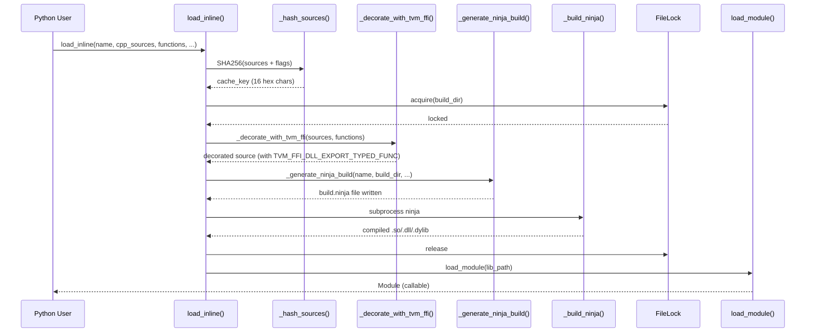

# Inline C++/CUDA Module Compilation (load_inline)

**TL;DR**.
- `tvm_ffi.cpp.load_inline()` compiles inline C++/CUDA source strings into a shared library at runtime, loads it via the existing module system, and returns a `Module` with callable FFI functions. It is the Python-side equivalent of PyTorch's `torch.utils.cpp_extension.load_inline`.
- The pipeline: source hashing -> ninja build file generation -> cached compilation -> `load_module()`. A `FileLock` utility coordinates concurrent builds in a shared cache directory (`~/.cache/tvm-ffi`).
- Cross-platform: supports GCC/Clang on Linux/macOS and MSVC on Windows, with optional CUDA compilation via nvcc. Platform-specific adaptations handle symbol visibility, linker flags, path escaping, and file extensions.

## Problem Statement

### Background
- Prototyping FFI-callable C++ kernels requires a full build cycle (write `.cc` file, run CMake, compile, load). This is slow for iterative development and incompatible with notebook-style workflows.
- PyTorch's `torch.utils.cpp_extension.load_inline` set the user expectation for inline C++ compilation from Python.
- The existing module system (`Module.LoadFromFile`) can load precompiled `.so`/`.dll` files, but nothing generates them from source at runtime.

### Solution
- A Python-only compilation pipeline that generates a ninja build file, invokes the compiler, and uses the existing `load_module()` to return a callable `Module`.
- Content-addressable caching (SHA256 hash of all sources + flags) avoids redundant recompilation. An advisory file lock prevents concurrent builds from corrupting the cache.
- Source decoration automatically wraps user functions with `TVM_FFI_DLL_EXPORT_TYPED_FUNC` macros so they appear as FFI-callable symbols.

### Goals
- Zero-boilerplate inline C++/CUDA compilation from Python.
- Cached builds with content-addressable hash keys.
- Cross-platform support (Linux, macOS, Windows) with automatic compiler/flag detection.
- Non-goal: incremental compilation; full project builds; multi-file source dependencies beyond the inline fragments.

## Design



### Key Classes, Fields and Interfaces

```python
def load_inline(
    name: str,
    *,
    cpp_sources: str | Sequence[str] | None = None,
    cuda_sources: str | Sequence[str] | None = None,
    functions: Sequence[str] | Mapping[str, str] | str | None = None,
    extra_cflags: Sequence[str] | None = None,
    extra_cuda_cflags: Sequence[str] | None = None,
    extra_ldflags: Sequence[str] | None = None,
    extra_include_paths: Sequence[str] | None = None,
    build_directory: str | None = None,
) -> Module: ...
    # Interacts with: _decorate_with_tvm_ffi, _generate_ninja_build, _build_ninja,
    #   load_module (from tvm_ffi.module), FileLock, TVM_FFI_DLL_EXPORT_TYPED_FUNC
    # Invariant: when functions is Sequence[str], exported name == function name in source
    # Invariant: when cpp_sources provided, exports go to cpp_source; otherwise to cuda_source (1ce0f6f)
    # Extension: build_directory bypasses cache hashing; useful for reproducible builds

# Internal helpers:
def _decorate_with_tvm_ffi(source: str, functions: Mapping[str, str]) -> str: ...
    # Prepends TVM FFI includes, appends TVM_FFI_DLL_EXPORT_TYPED_FUNC(func_name, func_name)
    # for each function. Result symbol is __tvm_ffi_<func_name> in the compiled DSO.
    # Interacts with: TVM_FFI_DLL_EXPORT_TYPED_FUNC macro (0003-function-system)

def _generate_ninja_build(name: str, build_dir: str, with_cuda: bool, ...) -> str: ...
    # Platform-specific:
    #   Linux/macOS: -shared -fPIC -L<lib_path> -ltvm_ffi (4ffbc88 fixed macOS linking)
    #   Windows: /MD /EHsc /link /LIBPATH:<lib_path> tvm_ffi.lib (2df07e5 fixed Windows)
    #   CUDA: nvcc with architecture detection via TVM_FFI_CUDA_ARCH_LIST or auto
    # Interacts with: find_include_path(), find_dlpack_include_path(), find_libtvm_ffi()

def _hash_sources(cpp_source: str, cuda_source: str, ...) -> str: ...
    # SHA256-based content hash (truncated to 16 hex chars) for cache keying

class FileLock:
    """Cross-platform advisory file lock (Unix: fcntl, Windows: msvcrt)."""
    lock_file_path: str
    _file_descriptor: Optional[int]
    def __enter__(self) -> FileLock: ...
    def __exit__(self, ...) -> bool: ...
    def acquire(self) -> bool: ...          # Non-blocking
    def blocking_acquire(self, timeout: Optional[float] = None, poll_interval: float = 0.1) -> bool: ...
        # Invariant: raises TimeoutError if timeout exceeded
    def release(self) -> None: ...
    # Interacts with: load_inline (guards build cache writes)
```

### Contracts, Assumptions and Invariants
- **Cache coherence**: The build cache key is a SHA256 hash of source content, compiler flags, and include paths. Changing any input produces a new cache directory. The `FileLock` ensures only one process builds a given cache key at a time.
- **Exported name == source name**: Unlike the original API (83805ec) where `cpp_functions` mapped export names to source names, the current API (825aeb9) requires `functions` entries to match source function names. `TVM_FFI_DLL_EXPORT_TYPED_FUNC(f, f)` is always used.
- **Symbol prefix applied**: Compiled functions have C symbols `__tvm_ffi_<func_name>`. The `Module` lookup applies the symbol prefix automatically via `Library::GetSymbolWithSymbolPrefix`.
- **libtvm_ffi linking required**: The compiled DSO links against `libtvm_ffi` on all platforms (fixed in 4ffbc88 for macOS, 2df07e5 for Windows). Without this, FFI symbols in the compiled module are unresolved.
- **CUDA export routing**: `TVM_FFI_DLL_EXPORT_TYPED_FUNC` decoration is routed conditionally: if `cpp_sources` is provided, exports go to cpp_source (CUDA functions need forward declarations there); if `cpp_sources` is empty/absent, exports go directly to cuda_source (`1ce0f6f`). Determined by internal `with_cpp = len(cpp_sources) > 0` flag.
- **Windows MSVC environment**: On Windows, `_build_ninja()` dispatches through `_run_command_in_dev_prompt()` which locates `VsDevCmd.bat` via `vswhere.exe` and sources it before invoking ninja, ensuring `cl.exe`/`link.exe` are available (`4383b1a`).
- **Optional CUDA**: The torch C DLPack extension (`_optional_torch_c_dlpack.py`) guards CUDA code behind `#ifdef BUILD_WITH_CUDA` / `torch.cuda.is_available()`, enabling compilation on CPU-only systems (`c665fa3`).

### Extension Points
- **New source languages**: Add new `*_sources` parameters and corresponding ninja rules for other compilers (e.g., HIP, SYCL).
- **Custom build directory**: `build_directory` parameter bypasses hash-based caching, enabling reproducible or persistent builds.
- **Additional compilers**: `CXX` env var overrides the default C++ compiler. `TVM_FFI_CUDA_ARCH_LIST` overrides auto-detected CUDA architectures.

### Usage Examples

#### Compiling and calling a C++ function
**Context**: Rapid prototyping of a C++ kernel from a Jupyter notebook.
```python
import numpy as np
from tvm_ffi.cpp import load_inline

mod = load_inline(
    name="hello",
    cpp_sources=r"""
        void add_one_cpu(DLTensor* x, DLTensor* y) {
          for (int i = 0; i < x->shape[0]; ++i)
            static_cast<float*>(y->data)[i] = static_cast<float*>(x->data)[i] + 1;
        }
    """,
    functions=["add_one_cpu"],
)

x = np.array([1, 2, 3], dtype=np.float32)
y = np.empty_like(x)
mod.add_one_cpu(x, y)  # calls compiled C++ via FFI
np.testing.assert_equal(y, x + 1)
```

#### CUDA-only source (no forward declaration needed, 1ce0f6f)
**Context**: CUDA kernel with exports applied directly to cuda_sources.
```python
mod = load_inline(
    name="cuda_add",
    cuda_sources=r"""
        __global__ void kernel(float* x, float* y, int n) {
          int i = blockIdx.x * blockDim.x + threadIdx.x;
          if (i < n) y[i] = x[i] + 1;
        }
        void add_one_cuda(DLTensor* x, DLTensor* y) {
          int n = x->shape[0];
          kernel<<<(n+255)/256, 256>>>(
              static_cast<float*>(x->data), static_cast<float*>(y->data), n);
        }
    """,
    functions=["add_one_cuda"],  # exported directly from cuda_sources
)
```

#### CUDA source with forward declaration
**Context**: Inline CUDA kernel requiring cpp_sources forward declaration.
```python
mod = load_inline(
    name="cuda_add",
    cpp_sources="void add_one_cuda(DLTensor* x, DLTensor* y);",
    cuda_sources=r"""
        __global__ void kernel(float* x, float* y, int n) {
          int i = blockIdx.x * blockDim.x + threadIdx.x;
          if (i < n) y[i] = x[i] + 1;
        }
        void add_one_cuda(DLTensor* x, DLTensor* y) {
          int n = x->shape[0];
          kernel<<<(n+255)/256, 256>>>(
              static_cast<float*>(x->data), static_cast<float*>(y->data), n);
        }
    """,
    functions=["add_one_cuda"],
)
```

### Evolution Timeline

| Commit | Change | Impact |
|--------|--------|--------|
| `83805ec` | Initial `load_inline` with `cpp_source`/`cuda_source`/`cpp_functions`/`cuda_functions` params | New feature, Linux-only |
| `825aeb9` | Rename params to match torch conventions; unify `functions`; add `build_directory` | Breaking API change |
| `2df07e5` | Windows MSVC support (flags, path escaping, DLL extension) | Platform fix |
| `4ffbc88` | macOS support (link libtvm_ffi on all platforms) | Platform fix |
| `236e9e9` | Skip tests on non-Linux, add ninja to optional deps | Test infrastructure |
| `1ce0f6f` | Allow CUDA-only load_inline without cpp_sources forward declarations | Feature: CUDA export routing |
| `4383b1a` | Fix Windows: run ninja inside MSVC Developer Command Prompt | Platform fix |
| `c665fa3` | Make torch C DLPack extension optionally depend on CUDA | Platform fix |

## Alternatives & Trade-offs
### torch.utils.cpp_extension.load_inline (reference implementation)
- Pros: Mature, widely used, handles complex build scenarios.
- Cons: Requires PyTorch installation; tight coupling to PyTorch's extension ABI; does not produce TVM FFI-compatible symbols.

### CMake-based compilation
- Pros: Full build system; handles complex dependency graphs; familiar to C++ developers.
- Cons: Heavyweight for single-file compilation; slow startup; requires CMake installation; not suitable for notebook-style iteration.

## Related Work
### Design Records
- `0003-function-system.md` -- `TVM_FFI_DLL_EXPORT_TYPED_FUNC` is the macro used to export compiled functions
- `0011-module-system.md` -- `load_module` and `Library::GetSymbolWithSymbolPrefix` are the module loading path
- `0012-python-bindings.md` -- `tvm_ffi.cpp` subpackage is part of the Python package structure

### Evidence Matrix
- Initial load_inline feature -> `commits/2025-09-05-83805ec9...md` + `83805ec` + `load_inline`, `_decorate_with_tvm_ffi`
- Parameter rename to match torch -> `commits/2025-09-06-825aeb9a...md` + `825aeb9` + `functions`, `build_directory`
- Windows MSVC support -> `commits/2025-09-08-2df07e52...md` + `2df07e5` + `_generate_ninja_build` MSVC flags
- macOS linker fix -> `commits/2025-09-08-4ffbc88b...md` + `4ffbc88` + `-L<path> -ltvm_ffi`
- Plus 1 supporting commit: `236e9e9` (test gating + ninja dep)
- CUDA-only export routing -> `commits/2025-09-12-1ce0f6fa...md` + `1ce0f6f` + `with_cpp` flag
- Windows MSVC _run_command_in_dev_prompt -> `commits/2025-09-14-4383b1a6...md` + `4383b1a` + `_run_command_in_dev_prompt`
- Torch C DLPack extension optional CUDA -> `commits/2025-09-13-c665fa36...md` + `c665fa3` + `BUILD_WITH_CUDA`
- TorchDLPackExchangeAPI replaces separate function pointers -> `commits/2025-10-11-22a78943...md` + `22a78943` + `TorchDLPackExchangeAPI`, `__c_dlpack_exchange_api__`
