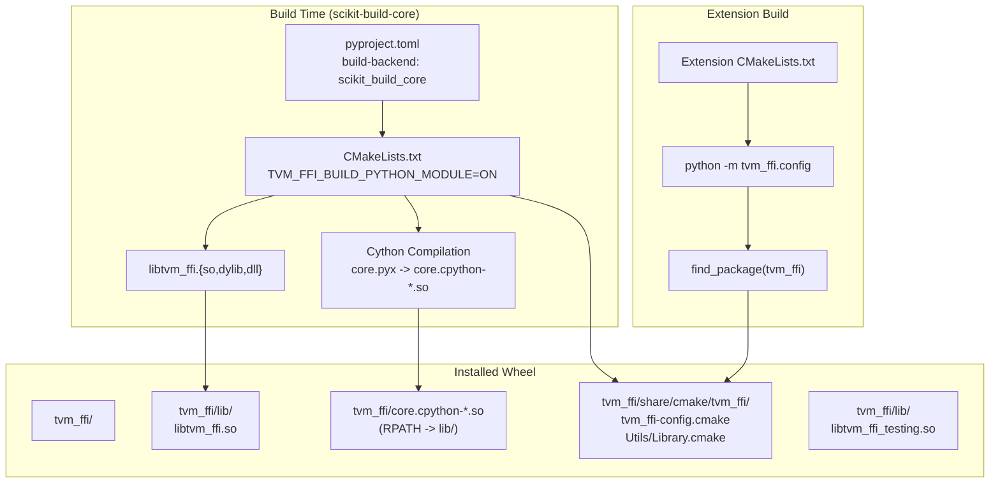

# FFI Packaging and Distribution

**TL;DR**.
- `tvm_ffi` ships as an ABI3-compatible Python wheel (`apache-tvm-ffi`) built with scikit-build-core, bundling `libtvm_ffi.so` alongside the Cython extension with correct RPATH for standalone distribution.
- Extension projects use a two-mode CMake pattern: `add_subdirectory` for from-source builds or `find_package(tvm_ffi)` for pip-installed packages, with `python -m tvm_ffi.config` providing path resolution.
- The canonical extension pattern (`examples/packaging/`) demonstrates the full lifecycle: C++ library with `TVM_FFI_DLL_EXPORT_TYPED_FUNC` + `refl::GlobalDef`, Python-side `_load_lib` + `_init_api`, and scikit-build-core wheel packaging.

## Problem Statement
### Background
- The FFI C++ library, Cython bindings, and shared library must be distributed as a single installable package. Users should `pip install apache-tvm-ffi` and immediately use it from Python without compiling anything.
- Downstream projects that build C++ extensions need to link against `tvm_ffi` headers and shared library. They need a CMake config module that works whether `tvm_ffi` was pip-installed or built from source.

### Solution
- scikit-build-core as the build backend: drives CMake to compile `libtvm_ffi.so` + Cython extension, installs both into the wheel.
- RPATH configuration ensures the Cython extension finds `libtvm_ffi.so` via relative path (`@loader_path/lib` on macOS, `$ORIGIN/lib` on Linux).
- `tvm_ffi.config` CLI tool exposes `--cmakedir`, `--sourcedir`, and `--cxxflags` for downstream CMake integration.

### Goals
- Single `pip install` produces a working package on Linux, macOS, and Windows.
- cibuildwheel-compatible for CI-driven wheel builds (cp39-cp312, skip musllinux).
- Extensions can link against either pip-installed or from-source tvm_ffi.
- Non-goal: conda packaging (not covered by this design).

## Design



### Key Classes, Fields and Interfaces

```python
# --- pyproject.toml configuration ---
# package_name = "apache-tvm-ffi"
# build-backend = "scikit_build_core.build"
# cmake.args = ["-DTVM_FFI_BUILD_PYTHON_MODULE=ON"]
# wheel.install-dir = "tvm_ffi"
# Invariant: version must be bumped for ABI-breaking changes (e.g., 0.1.0a3 for type index reorder)

# --- tvm_ffi.config CLI (python/tvm_ffi/config.py) ---
def config(flag: str) -> str:
    """Resolve build paths for downstream CMake projects."""
    # --cmakedir: returns <tvm_ffi_root>/cmake/
    #     Used by: find_package(tvm_ffi CONFIG REQUIRED)
    # --sourcedir: returns repo root (for add_subdirectory builds)
    #     Used by: add_subdirectory(${tvm_ffi_ROOT} tvm_ffi)
    # --cxxflags: returns C++ compiler flags
    # Interacts with: Extension CMakeLists.txt

# --- RPATH configuration (CMakeLists.txt) ---
# macOS: INSTALL_RPATH = "@loader_path/lib"
# Linux: INSTALL_RPATH = "$ORIGIN/lib"
# Invariant: BUILD_WITH_INSTALL_RPATH must NOT be set (breaks scikit-build-core packaging)
# Interacts with: tvm_ffi_cython target, libtvm_ffi_shared

# --- CMake install layout ---
# <prefix>/cmake/tvm_ffi-config.cmake     (find_package entry point)
# <prefix>/cmake/Utils/Library.cmake       (debug symbol utilities)
# Interacts with: Extension's find_package(tvm_ffi)

# --- Extension project pattern (examples/packaging/) ---

# C++ side: two export mechanisms
# 1. Direct C symbol export (for performance-critical functions):
#    TVM_FFI_DLL_EXPORT_TYPED_FUNC(add_one, my_ns::AddOne)
#    # Generates: extern "C" __tvm_ffi_add_one symbol with packed calling convention
#    # Interacts with: LibraryModuleObj (looked up by symbol name)

# 2. Global function registry (for general functions):
#    TVM_FFI_STATIC_INIT_BLOCK() {
#        refl::GlobalDef().def("pkg.func_name", MyFunction);
#    }
#    # Interacts with: _init_api namespace injection on Python side

# Python side: canonical load_lib_module pattern (f255650b, replaces _load_lib boilerplate)
def load_lib_module(
    package: str, target_name: str, keep_module_alive: bool = True,
) -> Module:
    """High-level API combining library discovery with load_module."""
    # Interacts with: _find_library_by_basename (importlib.metadata primary, env fallback)
    # Interacts with: tvm_ffi.module.load_module (DSOLibrary -> LibraryModuleObj)
    # Handles Windows DLL search path setup automatically
    # Invariant: target_name is CMake target name, not platform-specific filename
    # Extension: downstream extensions call this instead of writing custom _load_lib()
    ...

# Legacy pattern (still works but superseded):
# def _load_lib() -> Module: ...

# _ffi_api.py:
# tvm_ffi.init_ffi_api("pkg_namespace", __name__)  # was: tvm_ffi._init_api(...)
# Scans global function registry for "pkg_namespace.*", injects as module attrs
# Interacts with: global function registry

# __init__.py: thin Python wrappers around FFI functions
def add_one(x, y):
    _LIB.add_one(x, y)  # calls through LibraryModuleObj
```

### Contracts, Assumptions and Invariants
- **RPATH correctness**: The Cython extension and `libtvm_ffi_testing.so` (da7007f) both resolve `libtvm_ffi.so` via relative RPATH. `BUILD_WITH_INSTALL_RPATH` must not be set -- scikit-build-core applies RPATH at install time, not build time. Linux detection uses `UNIX AND NOT APPLE` (not CMake 3.25+ `LINUX`) for portability (5dd60e6).
- **numpy optional**: The package loads without numpy. `NUMPY_DTYPE_TO_STR` in `dtype.py` is populated inside `try/except ImportError`.
- **torch optional**: Torch is still imported via try/except, but the old lazy-loaded `torch_get_current_cuda_stream` sentinel is removed. CUDA stream is now retrieved via `torch._C._cuda_getCurrentRawStream(device_id)` directly.
- **Version-ABI coupling**: The package version must be bumped when ABI-breaking changes occur (e.g., `TVMFFITypeIndex` reordering bumped to `0.1.0a3`, packaging fixes to `0.1.0a5`). `TVMFFIGetVersion` (f0058a9) provides runtime version detection.
- **Separate testing library**: Testing utilities (`testing.echo`, `testing.add_one`, etc.) are compiled into a separate `libtvm_ffi_testing.so` (da7007f), not bundled into `libtvm_ffi.so`. `tvm_ffi.testing` is not auto-imported; explicit `from tvm_ffi import testing` required. The Cython extension links `libtvm_ffi_testing` at compile time (d183a95) to ensure correct unloading order.
- **CMake config path**: CMake config installed to `<prefix>/share/cmake/tvm_ffi/` (df04392), matching CMake's standard search pattern. `find_package(tvm_ffi CONFIG REQUIRED)` works automatically after `find_package(Python)` adds `sys.prefix` to search paths. Ninja is the sole build generator (`ninja.make-fallback = false`).

### Extension Points
- **Custom wheel packaging**: Use the `examples/python_packaging/` template as a starting point (renamed from `examples/packaging/`, dc0dd2f6). Use `find_package(tvm_ffi)` for pre-built. `tvm_ffi_configure_target(target STUB_DIR "./python" STUB_INIT ON)` bundles all configuration into one call (ccd19f82). CMake import targets use namespaced form `tvm_ffi::shared`/`tvm_ffi::header`/`tvm_ffi::static` (a1cb7462). ALIAS targets are now created in both source builds (`add_subdirectory`) and installed package builds (ac80ea39), so `tvm_ffi_configure_target` works uniformly in both modes.
- **New file format loaders**: Register `"ffi.Module.load_from_file.<format>"` in the global function registry to support loading custom module formats.

### Usage Examples

#### Building an Extension Wheel
**Context**: A downstream project that compiles a C++ extension and packages it as a wheel.
```cmake
# CMakeLists.txt for an extension package
cmake_minimum_required(VERSION 3.18)
project(my_ffi_extension)  # renamed from tvm_ffi_extension

# Mode 1: Build tvm_ffi from source (cross-compilation, dev)
execute_process(COMMAND python -m tvm_ffi.config --sourcedir
                OUTPUT_VARIABLE tvm_ffi_ROOT OUTPUT_STRIP_TRAILING_WHITESPACE)
add_subdirectory(${tvm_ffi_ROOT} tvm_ffi)

# Mode 2: Use pip-installed tvm_ffi
execute_process(COMMAND python -m tvm_ffi.config --cmakedir
                OUTPUT_VARIABLE tvm_ffi_ROOT OUTPUT_STRIP_TRAILING_WHITESPACE)
find_package(tvm_ffi CONFIG REQUIRED)

# Link extension
add_library(my_ext SHARED src/extension.cc)
target_link_libraries(my_ext tvm_ffi::header tvm_ffi::shared)  # namespaced targets (a1cb7462)
```

#### C++ Extension Source with Two Export Mechanisms
**Context**: Authoring a C++ library that exports functions via both direct symbols and the global registry.
```cpp
#include <tvm/ffi/tvm_ffi.h>  // umbrella header (8caa0cbe)

namespace my_ext {
void AddOne(const AnyView* args, int num_args, Any* rv) {
    // ... implementation using Tensor/DLTensor
}
}  // namespace my_ext

// Direct C symbol export (for LibraryModuleObj lookup)
TVM_FFI_DLL_EXPORT_TYPED_FUNC(add_one, my_ext::AddOne);

// Global function registry (for _init_api injection)
TVM_FFI_STATIC_INIT_BLOCK() {
    refl::GlobalDef().def("my_ext.raise_error", my_ext::RaiseError);
}
```

#### Python-Side Extension Loading (Canonical Pattern After f255650b)
**Context**: The recommended one-liner for loading a co-packaged native library.
```python
# my_ext/base.py — entire file
import tvm_ffi
_LIB = tvm_ffi.libinfo.load_lib_module("my-ffi-extension", "my_ffi_extension")
```
This replaces the previous 25+ line `_load_lib()` function with manual platform detection.

#### CMake Extension Setup (Canonical Pattern After ccd19f82)
**Context**: Using `tvm_ffi_configure_target` to set up a C++ extension.
```cmake
cmake_minimum_required(VERSION 3.18)
project(my_ffi_extension)
find_package(tvm_ffi CONFIG REQUIRED)
add_library(my_ffi_extension SHARED src/extension.cc)
# One call replaces manual target_link_libraries + tvm_ffi_add_prefix_map + dsymutil
tvm_ffi_configure_target(my_ffi_extension STUB_DIR "./python" STUB_INIT ON)
install(TARGETS my_ffi_extension DESTINATION .)
tvm_ffi_install(my_ffi_extension)
```

## Implementation Notes
- cibuildwheel configuration explicitly builds cp39-cp312, skips musllinux, and tests only on cp312 (the ABI3-tagged wheel works across all versions).
- `tvm_ffi_extra_objs_sources` is a named CMake list separating core vs. extra source files for the shared library build.
- `Utils/Library.cmake` provides `tvm_ffi_add_prefix_map()`, `tvm_ffi_add_apple_dsymutil()`, `tvm_ffi_configure_target()` (ccd19f82), and `tvm_ffi_install()` (ccd19f82) for extension builds. `tvm_ffi_configure_target` bundles header/shared linking, prefix map, debug symbols, MSVC flags, and stub generation into a single call.

## Alternatives & Trade-offs
### scikit-build-core vs. setuptools + CMake Extension
- Pros of scikit-build-core: Native CMake integration, proper RPATH handling, cibuildwheel compatibility out of the box.
- Cons: Less familiar to Python-only developers. Requires CMake knowledge for debugging build issues.
### Bundled .so vs. System Library
- Pros of bundled: Self-contained wheel, no system-level dependencies.
- Cons: Larger wheel size. Must rebuild for each platform.

## Evidence
| Commit | Scope | Contribution |
|--------|-------|-------------|
| 4523a83 | examples/packaging | Added reference packaging example, cmake install path fixes, lazy torch loading |
| 2d41a51 | python/packaging | Established pyproject.toml, scikit-build-core integration |
| 2cf211f | python/packaging | Robustified RPATH, optional numpy, cibuildwheel config |
| ad8e5d2 | build/cmake | Fixed BUILD_WITH_INSTALL_RPATH for scikit-build-core |
| plus 2 supporting commits | cmake, examples | libbacktrace submodule (7d09d6a), missing example files (5a3e3cb) |
| c695f5f | examples/packaging | Renamed canonical example from `tvm_ffi_extension` to `my_ffi_extension` |
| 40f4d9d | python/ffi-bindings | Renamed `_init_api` -> `init_ffi_api` in extension pattern |
| 40e8a51 | ffi/function | `TVM_FFI_DLL_EXPORT_TYPED_FUNC` now generates `__tvm_ffi_<name>` symbols |
| da7007f | build/cmake, python | Split testing into separate `libtvm_ffi_testing.so`; added `find_library_by_basename()` |
| df04392 | build/cmake | Relocated CMake config to `share/cmake/tvm_ffi/` for standard `find_package` discovery |
| 5dd60e6 | build/cmake | Fixed RPATH for `tvm_ffi_testing`, portable Linux detection |
| d183a95 | build/cmake | Replaced runtime `load_module` with compile-time link for `tvm_ffi_testing` unload ordering |
| 78d3c42 | python/packaging | Added `dev` dependency group, Ninja enforcement, torch pre-import for Windows compat |
| f255650b | python/packaging | Added `tvm_ffi.libinfo.load_lib_module` replacing manual `_load_lib()` boilerplate |
| ccd19f82 | build/cmake | Added `tvm_ffi_configure_target` and `tvm_ffi_install` CMake helpers |
| a1cb7462 | build/cmake | Renamed CMake import targets to namespaced `tvm_ffi::shared`/`tvm_ffi::header` with backward-compat shim in EmbedCubin.cmake |
| 8b9f28d4 | build/cmake | Fixed missing pthread and dl link dependencies for tvm_ffi shared/static |
| 8caa0cbe | ffi/headers | Introduced `<tvm/ffi/tvm_ffi.h>` umbrella header for core C++ APIs |
| 0d157dc | build/cmake | Made Threads linkage optional via `TVM_FFI_USE_THREADS` CMake option |
| 3b4a532 | build/cmake | Added explicit `TVM_FFI_USE_THREADS` option (default ON) for cross-compilation |
| dcd07cf | build/cmake | Added `TVM_FFI_USE_DL_LIBS` option (default ON) to gate dl library linking |
| ac80ea39 | build/cmake | Added ALIAS targets `tvm_ffi::header`/`shared`/`static` in source builds (CMakeLists.txt + Library.cmake) |
| 5c0deb94 | python/packaging | Config mode skips expensive imports (`_is_config_mode()` in `__init__.py`) |
| bad3896f | python/packaging | Windows DLL search path fix in config mode |

## Related Design Docs & ADRs
- [0012-python-package.md](0012-python-package.md) -- Python package internals that this packaging wraps
- [0011-module-system.md](0011-module-system.md) -- Module loading (load_module, DSOLibrary) used by extensions
- [0004-function-system.md](0004-function-system.md) -- Global function registry used by init_ffi_api and refl::GlobalDef
- [0014-cpp-extension.md](0014-cpp-extension.md) -- `load_inline` JIT compilation pattern (complement to static CMake packaging)
