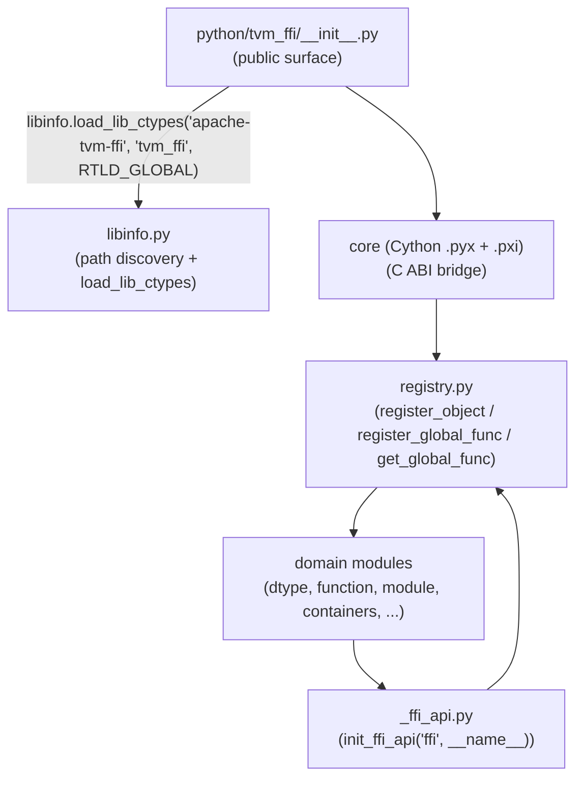

# Python Package Architecture

**TL;DR**
- `tvm_ffi` is a standalone pip-installable Python package built with `scikit-build-core` + Cython. The package wraps the C ABI through a thin Cython extension (`core.pyx` + seven `.pxi` fragment files) and exposes all major FFI concepts — `Object`, `Function`, `Module`, containers, `dtype` — as Python types. Two additional subpackages: `tvm_ffi.cpp` (JIT compilation via `load_inline`) and `tvm_ffi.utils` (cross-platform `FileLock`).
- A four-stage import protocol governs loading order: `base` (library loading) -> `libinfo` (path discovery) -> `registry` (type/function registration) -> domain modules. Downstream extension packages follow the same pattern via `init_ffi_api` (renamed from `_init_api` in commit 40f4d9d) and `load_module`.
- The `tvm-ffi-config` CLI enables downstream C++ consumers to locate headers, cmake files, and the shared library at build time. `--cflags` (added commit c100338d) prints include paths without `-std=c++17` for pure-C consumers.
- The FFI call dispatch path was rewritten (commit 38d2cdaa) around a C++-backed `TVMFFIPyCallManager` that caches per-`PyTypeObject*` setter functions, eliminating repeated `isinstance` checks. See `0016-py-ffi-call-dispatch.md` for the full design.

## Problem Statement

### Background
TVM FFI needs to be independently installable as a minimal pip package so that downstream kernel-library authors can depend on `tvm_ffi` without pulling in the full TVM compiler stack. Prior to commit `2d41a51`, there was no standalone Python package — bindings were embedded inside the larger TVM project.

### Solution
A `pyproject.toml` using `scikit-build-core >= 0.10.0` drives a CMake build that compiles the Cython extension (`tvm_ffi_cython`) and bundles it next to `libtvm_ffi_shared.so` inside the wheel under `tvm_ffi/lib/`. RPATH (`@loader_path/lib` on macOS, `$ORIGIN/lib` on Linux) ensures the extension finds the shared library at runtime without `LD_LIBRARY_PATH`.

### Goals
- Independently installable from PyPI or source: `pip install apache-tvm-ffi` or `pip install ./ffi`.
- Optional numpy/torch — package loads without either dependency.
- Stable ABI wheel (`abi3`) targeting Python 3.9–3.12+; SABI mode (`core.abi3.so`) for Python ≥ 3.12.
- Extensible: downstream packages can build their own Cython extensions against the installed headers + cmake config via the `tvm-ffi-config` CLI.
- Non-goal: expose a pure-Python fallback — Cython is always required for the core object/function layer.

## Design

### Import Order and Module Graph



**Invariant (commit 6887892d)**: `base.py` is **deleted**. `__init__.py` now calls `libinfo.load_lib_ctypes("apache-tvm-ffi", "tvm_ffi", "RTLD_GLOBAL")` directly. The `LIB: ctypes.CDLL` result is module-level in `tvm_ffi.__init__` and in `__all__`. `RTLD_GLOBAL` exposes C symbols to all subsequent `dlopen` calls; `libinfo` import must precede any Cython extension imports.

### Key Classes, Fields and Interfaces

```python
# python/tvm_ffi/libinfo.py — public DSO loading API (commit 6887892d + f255650b)

def load_lib_ctypes(package: str, target_name: str, mode: str) -> ctypes.CDLL:
    """Load a shared library by pip package name + CMake target name, return ctypes.CDLL.
    # package:     pip distribution name, e.g. "apache-tvm-ffi" or "my-extension"
    # target_name: CMake target name, e.g. "tvm_ffi" → platform resolves to
    #              libtvm_ffi.so / libtvm_ffi.dylib / tvm_ffi.dll
    # mode:        "RTLD_LOCAL" or "RTLD_GLOBAL" (attr name on ctypes)
    # Invariant: on Windows, adds lib_path.parent to os.add_dll_directory()
    # Interacts with: _find_library_by_basename(), ctypes.CDLL
    # NEW (commit 6887892d): replaces _load_lib() in deleted base.py
    """

def load_lib_module(
    package: str,
    target_name: str,
    keep_module_alive: bool = True,
) -> Module:
    """Load a downstream shared library as a tvm_ffi.Module (commit f255650b).
    # Same path-resolution logic as load_lib_ctypes but returns Module, not ctypes.CDLL
    # keep_module_alive: if True, Module is held in ModuleGlobals singleton to prevent unload
    # Interacts with: _find_library_by_basename (path resolution)
    # Interacts with: tvm_ffi.module.load_module (Module construction + lifetime mgmt)
    # Invariant: target_name follows CMake lib naming (no "lib" prefix in arg)
    # Extension: recommended for downstream extension packages; replaces hand-rolled base.py patterns
    """

def _find_library_by_basename(package: str, target_name: str) -> Path:
    """Primary lookup: parse importlib.metadata RECORD for package (commit 6887892d).
    Fallback: search build/lib, lib directories, and PATH-family env vars.
    # CHANGED (commit 6887892d): old single-arg form find_library_by_basename(base) removed;
    #   new private two-arg form uses importlib.metadata RECORD as primary lookup
    # Invariant: returns a Path that .is_file() — raises RuntimeError if not found
    # Interacts with: importlib.metadata.distribution(package).read_text("RECORD")
    """

def find_libtvm_ffi() -> str:
    """Unchanged public API — delegates to _find_library_by_basename("apache-tvm-ffi", "tvm_ffi")."""
    # Interacts with: _find_library_by_basename, tvm-ffi-config --libdir

def find_cmake_path() -> str:
    """Return path to installed share/cmake/tvm_ffi/ directory. (updated commit df04392)"""
    # First candidate: share/cmake/tvm_ffi/ (standard pip-installed layout)
    # Second candidate: ../../cmake (development-mode fallback)
    # Changed (commit df04392): was checking cmake/ first; now checks share/cmake/tvm_ffi/
    # Interacts with: tvm-ffi-config --cmakedir, downstream CMakeLists.txt

def find_include_path() -> str: ...      # → include/
def find_dlpack_include_path() -> str: ... # → 3rdparty/dlpack/include/
def find_source_path() -> str: ...       # → source root (for in-tree builds)
def find_cython_lib() -> str: ...        # → core.cpython-*.so or core.abi3.so

# python/tvm_ffi/__init__.py — library bootstrap (commit 6887892d, replaces deleted base.py)
from . import libinfo
LIB: ctypes.CDLL = libinfo.load_lib_ctypes("apache-tvm-ffi", "tvm_ffi", "RTLD_GLOBAL")
# DELETED: base.py, _load_lib(), get_dll_directories(), split_env_var(), find_library_by_basename(base: str)
# Invariant: LIB is in __all__; downstream code can import it as tvm_ffi.LIB

# python/tvm_ffi/cython/object.pxi — CObject (Cython base) + Object (Python subclass)
# Split introduced in commit 49a5d71a (was single cdef class Object before).

cdef class CObject:
    """Cython base class for all TVM FFI heap objects (wraps void* chandle).
    Renamed from 'Object' in commit 49a5d71a to make room for a Python-layer Object.
    Direct use: only from within Cython (.pxi) files and type dispatch code.
    """
    cdef void* chandle   # Invariant: NULL only during __cinit__ or after _move()

    def __dealloc__(self): ...
    # Calls TVMFFIObjectDecRef (was TVMFFIObjectFree before commit ca9c3d1)

    def __init_handle_by_constructor__(self, fconstructor, *args): ...
    # Interacts with: ConstructorCall (Cython helper), TVMFFIFunctionCall

    def __getstate__(self) -> str: ...   # serialize via _OBJECT_TO_JSON_GRAPH_STR
    def __setstate__(self, state: str): ... # deserialize via _OBJECT_FROM_JSON_GRAPH_STR
    # Invariant: __getstate__/__setstate__ require extra/ API to be compiled in

    def same_as(self, other: CObject) -> bool: ...  # pointer identity (chandle comparison)
    def _move(self) -> ObjectRValueRef: ...
    # Interacts with: kTVMFFIObjectRValueRef in AnyView

# Python-layer Object wraps CObject (commit 49a5d71a):
class _ObjectSlotsMeta(type):
    """Metaclass that auto-injects __slots__=() on every Object subclass.
    # Invariant: all Object subclasses get __slots__=() even if they don't declare it
    # Invariant: prevents __dict__ creation on each instance (memory saving)
    # Interacts with: Object, all @register_object-decorated classes
    """
    def __new__(mcs, name, bases, namespace, **kwargs):
        if "__slots__" not in namespace:
            namespace["__slots__"] = ()
        return super().__new__(mcs, name, bases, namespace, **kwargs)

class Object(CObject, metaclass=_ObjectSlotsMeta):
    """Python-layer base class for all FFI objects (commit 49a5d71a).
    Wraps CObject with _ObjectSlotsMeta to ensure __slots__=() on subclasses.
    This is the base class users should inherit from in @register_object / @c_class decorated classes.
    Pre-commit 49a5d71a: Cython 'cdef class Object' was the direct base.
    Post-commit 49a5d71a: Object(CObject) is a Python class; Cython code references CObject.
    """
    __slots__ = ()
    # Interacts with: _ObjectSlotsMeta, CObject (Cython base), _add_class_attrs

class ObjectConvertible:
    """Mixin for Python objects convertible to Object via .asobject().
    Renamed from ObjectGeneric in commit 40f4d9d."""
    def asobject(self) -> Object: ...   # Invariant: subclass must override

# python/tvm_ffi/cython/type_info.pxi — TypeInfo metadata (commit 53b2e00)
@dataclasses.dataclass(eq=False)
class TypeField:
    """Single reflected field. getter/setter are Cython cdef callables backed by C ABI."""
    name: str; doc: str | None; size: int; offset: int; frozen: bool
    getter: FieldGetter; setter: FieldSetter
    dataclass_field: object | None   # deprecated; was populated by old @c_class (commit e98b94e)
    # NEW (commit b1abaeac): three boolean flags decoded from C++ TVMFFIFieldInfo.flags bitmask
    c_init: bool = True       # field participates in auto-generated __init__ (refl::init(false) opt-out)
    c_kw_only: bool = False   # field is keyword-only in auto-generated __init__ (refl::kw_only)
    c_has_default: bool = False  # field has a C++ default value (kTVMFFIFieldFlagBitMaskHasDefault)
    # c_init decoded from: kTVMFFIFieldFlagBitMaskInitOff (bit 9) — absent means True
    # c_kw_only decoded from: kTVMFFIFieldFlagBitMaskKwOnly (bit 10)
    # c_has_default decoded from: kTVMFFIFieldFlagBitMaskHasDefault (bit 1)
    # Interacts with: _make_init_signature (builds inspect.Signature from c_init/c_kw_only/c_has_default)
    def as_property(self, cls: type) -> property:
        # CHANGED (commit 43ffe571): __doc__ is only attached to the property and fget/fset
        # when self.doc is truthy. If self.doc is falsy (None or ""), property.__doc__ == None.
        # Old behavior: generated a synthetic fallback "Property 'x' of class 'Foo'" string.
        # Invariant: undocumented fields yield property.__doc__ == None → Sphinx autodoc can auto-generate
        # Interacts with: FieldGetter, FieldSetter (Cython extension types)
        ...
    # Interacts with: _make_init_signature, _add_class_attrs, make_fallback_cls_for_type_index

@dataclasses.dataclass(eq=False)
class TypeMethod:
    """Single reflected method."""
    name: str; doc: str | None; func: object; is_static: bool
    def as_callable(self, cls: type) -> Callable:
        # CHANGED (commit 43ffe571): func.__doc__ is only set when self.doc is truthy.
        # Old behavior: generated a synthetic fallback "Method 'm' of class 'Foo'" string.
        # Invariant: undocumented methods yield callable.__doc__ == None → Sphinx autodoc can auto-generate
        # Invariant: static methods remain wrapped with staticmethod() regardless of doc presence
        ...  # commit 98cb8af
    # Interacts with: _member_method_wrapper, make_fallback_cls_for_type_index

@dataclasses.dataclass(eq=False)
class TypeInfo:
    """Aggregated type metadata for one registered FFI type."""
    type_cls: type | None; type_index: int; type_key: str
    type_ancestors: list[int]  # root→parent order (commit 98cb8af; renamed from type_acenstors)
    fields: list[TypeField]; methods: list[TypeMethod]
    parent_type_info: TypeInfo | None  # auto-resolved in __post_init__ from type_ancestors
    # Interacts with: TYPE_INDEX_TO_INFO, TYPE_KEY_TO_INFO, _register_object_by_index

# Global registries (commit 53b2e00, extended commit 035975a)
cdef list TYPE_INDEX_TO_INFO = []    # type_index → TypeInfo (or None)
cdef list TYPE_INDEX_TO_CLS  = []    # type_index → type (fast-path, commit 035975a)
cdef dict TYPE_KEY_TO_INFO   = {}    # type_key → TypeInfo
# Invariant: len(TYPE_INDEX_TO_INFO) == len(TYPE_INDEX_TO_CLS) at all times

# python/tvm_ffi/registry.py — object/function registry
def _add_class_attrs(type_cls: type, type_info: TypeInfo) -> type:
    """Install methods from TypeInfo onto type_cls.
    # INVARIANT (commit b97ff1ae): __c_ffi_init__ is ALWAYS overridden per type.
    # Reason: derived classes must NOT inherit a base class's __c_ffi_init__ (different arg count).
    # INVARIANT (commit b1abaeac ordering fix): __tvm_ffi_type_info__ is set on type_cls
    #   BEFORE _add_class_attrs runs (was after). Ensures method resolution sees type info.
    # Pre-b97ff1ae: __c_ffi_init__ was only set if not hasattr(type_cls, name)
    #   → derived classes inherited base's __c_ffi_init__ (WRONG, silent corruption)
    """
    for method in type_info.methods:
        name = method.name
        if name in ("__ffi_shallow_copy__", "__c_ffi_init__"):
            setattr(type_cls, name, method.as_callable(type_cls))  # always override
        elif not hasattr(type_cls, name):
            setattr(type_cls, name, method.as_callable(type_cls))

def _install_init(cls: type, *, enabled: bool) -> None:
    """Install __init__ from C++ reflection, or a TypeError guard.
    # No-op if '__init__' already in cls.__dict__
    # No-op if __tvm_ffi_type_info__ absent
    # Path 1 (auto_init=True):  ffi_init_method.metadata['auto_init'] == True
    #   → setattr(__init__, _make_init(cls, type_info))  — full kw support
    # Path 2: __ffi_init__ exists but no auto_init
    #   → setattr(__init__, cls.__ffi_init__)  — positional args
    # Path 3: no __ffi_init__, not PyNativeObject → TypeError-raising guard
    # Path 4: enabled=False → TypeError-raising guard (for @c_class(init=False) or explicit disable)
    # Interacts with: _make_init(), TypeMethod.metadata['auto_init'], core.PyNativeObject
    """

def _make_init(type_cls: type, type_info: TypeInfo) -> Callable[..., None]:
    """Build Python __init__ delegating to __ffi_init__ via KWARGS sentinel protocol.
    Only called when __ffi_init__.metadata['auto_init'] == True (commit b1abaeac).
    # Invariant: signature derived from TypeInfo.fields (parent-first chain) filtered by c_init=True
    # Invariant: synthesized __init__ sets __signature__, __qualname__, __module__
    # Interacts with: core.KWARGS sentinel, TypeField.c_init/c_kw_only/c_has_default
    """
    kwargs_obj = core.KWARGS
    def __init__(self: Any, *args: Any, **kwargs: Any) -> None:
        ffi_args: list[Any] = list(args)
        ffi_args.append(kwargs_obj)          # KWARGS sentinel
        for key, val in kwargs.items():
            ffi_args.append(key)
            ffi_args.append(val)
        self.__ffi_init__(*ffi_args)
    __init__.__signature__ = _make_init_signature(type_info)
    return __init__

def _make_init_signature(type_info: TypeInfo) -> inspect.Signature:
    """Build inspect.Signature by walking TypeInfo parent chain (parent-first).
    # Invariant: fields with c_init=False excluded
    # Invariant: required positional < optional positional < required kw < optional kw
    # Invariant: c_kw_only=True → KEYWORD_ONLY kind; c_has_default=True → default=inspect.Parameter.empty
    # Interacts with: TypeInfo.parent_type_info chain, TypeField.c_init/c_kw_only/c_has_default
    """
    ...

# core.pyx module-level variables (commit 86c4042d and b1abaeac):
MISSING: Object   # = _get_global_func("ffi.GetInvalidObject", False)()
# Initialized once in core.pyx after Function is registered (not lazily in container.py)
# Invariant: MISSING.same_as(x) for identity check; not ==
# Interacts with: Map.get(), Dict.get(), MapGetItemOrMissing, DictGetItemOrMissing

KWARGS: Object    # = _get_global_func("ffi.GetKwargsObject", False)()
# KWARGS sentinel signals start of keyword section in __ffi_init__ packed calls
# Interacts with: _make_init, C++ KWARGS-protocol parsing in MakeInit/RegisterAutoInit

def register_object(type_key: str | type) -> Callable:
    """Decorator: map Python class -> C++ type_index via core._object_type_key_to_index()."""
    # Invariant: type_key must exist in C++ reflection BEFORE Python import runs
    # Calls core._register_object_by_index(type_index, cls) -> TypeInfo (commit 53b2e00)
    # Then calls _add_class_attrs(type_cls, type_info) to inject fields/methods
    # Then calls _install_init to wire __init__
    # Interacts with: TYPE_INDEX_TO_INFO, TYPE_INDEX_TO_CLS, TYPE_KEY_TO_INFO
    # Extension: _SKIP_UNKNOWN_OBJECTS flag silently ignores unrecognized type keys

def register_global_func(func_name: str | Callable, f=None, override=False) -> Callable:
    """Register a Python callable into the global C++ function table.
    Renamed from register_func in commit 40f4d9d."""
    # Interacts with: core._register_global_func(), GlobalFunctionTable (C++)

def get_global_func(name: str, allow_missing=False) -> Optional[Function]:
    # Interacts with: core._get_global_func(), C++ GlobalFunctionTable

def init_ffi_api(namespace: str, target_module_name: str | None = None) -> None:
    """Populate a Python module with all global functions matching a namespace prefix.
    Renamed from _init_api in commit 40f4d9d."""
    # Pattern: for each name in list_global_func_names() where name.startswith(namespace + "."):
    #   fname = name[len(namespace)+1:]; setattr(target_module, fname, get_global_func(name))
    # Invariant: target library .so must be loaded BEFORE init_ffi_api call so functions are registered
    # Interacts with: list_global_func_names(), get_global_func()
    # Extension: every downstream package uses this to expose its C++ functions in Python

# Auto-fallback class generation (commit 98cb8af)
# When make_ret_object encounters a type_index not registered via @register_object,
# it auto-generates a Python class with fields, methods, correct __name__/__module__.
cdef inline object make_fallback_cls_for_type_index(int32_t type_index) -> type:
    """Generate proxy class on demand. Called once per unregistered type (slow path).
    Recursively ensures parent class exists. Sets TypeInfo.type_cls and updates all registries.
    """
    # Invariant: after slow path, TYPE_INDEX_TO_CLS[type_index] is always non-None
    # Interacts with: _type_index_to_key(), _lookup_or_register_type_info_from_type_key(),
    #                 TypeField.as_property(), TypeMethod.as_callable(), _update_registry()

# python/tvm_ffi/core.pyi — PEP 484 stub for Cython core module (commit 785e8ca)
# Hand-authored stub exposing Object, Function, Tensor, Device, DLDeviceType, DataType,
# Error, String, Bytes, PyNativeObject, OpaquePyObject, ObjectRValueRef, ObjectConvertible.
#
# PyNativeObject renames (commit 8873700a):
#   __tvm_ffi_object__ (attribute) → _tvm_ffi_cached_object (data attribute for cached FFI handle)
#   __init_tvm_ffi_object_by_constructor__ → __init_cached_object_by_constructor__
#   String/Bytes __slots__ = ["_tvm_ffi_cached_object"] (was ["__tvm_ffi_object__"])
# Free-threaded Python (commit b64b46f): core.pyx gains `# cython: freethreading_compatible = True`
#   CMake detects Py_GIL_DISABLED and skips USE_SABI 3.12.
# python/tvm_ffi/py.typed — PEP 561 marker (commit 5cfd705) enabling mypy/pyright discovery.
# python/tvm_ffi/_ffi_api.pyi — stub for auto-populated FFI namespace (commit 40e9c83).

# python/tvm_ffi/_ffi_api.py — auto-populated FFI namespace
# _init_api("ffi", __name__) → populates with all "ffi.*" global functions
# Interacts with: registry._init_api(), GlobalFunctionTable (C++)

# python/tvm_ffi/config.py — tvm-ffi-config CLI
# Entry point: project.scripts → "tvm-ffi-config = tvm_ffi.config:__main__"
# Flags (all print a path then exit):
#   --includedir        → find_include_path()
#   --dlpack-includedir → find_dlpack_include_path()
#   --cmakedir          → find_cmake_path()
#   --sourcedir         → find_source_path()
#   --libfiles          → list absolute paths to .so/.dylib/.dll
#   --libdir            → directory containing libtvm_ffi_shared
#   --libs              → linker flags: "-L<libdir> -ltvm_ffi_shared"
#   --cython-lib-path   → find_cython_lib()
#   --cxxflags          → "-I<includedir> -I<dlpack-includedir>"  (includes -std=c++17)
#   --cflags            → "-I<includedir> -I<dlpack-includedir>"  (NO -std=c++17; for pure-C users)
#                         Added in commit c100338de52825097ddc44bbac3d03a92f45b33a
#   --ldflags           → "-L<libdir> -Wl,-rpath,<libdir>"
# Invariant: invoked by downstream CMakeLists.txt before find_package(tvm_ffi CONFIG REQUIRED)
# Interacts with: libinfo (all path lookups), cmake/tvm_ffi-config.cmake (consumed output)
```

### Cython Build Pipeline

```python
# pyproject.toml:
#   name = "apache-tvm-ffi", version = "0.1.0a5"
#   build-system: scikit-build-core >= 0.10.0 + cython
#   cmake.args: -DTVM_FFI_BUILD_PYTHON_MODULE=ON, -DTVM_FFI_ATTACH_DEBUG_SYMBOLS=ON
#   wheel.packages = ["python/tvm_ffi"], wheel.install-dir = "tvm_ffi"

# CMake options related to Python:
#   TVM_FFI_BUILD_PYTHON_MODULE (default OFF):
#     when ON: builds tvm_ffi_cython target (Python_add_library)
#              installs tvm_ffi_cython.so + libtvm_ffi_shared.so into tvm_ffi/lib/
#   TVM_FFI_ATTACH_DEBUG_SYMBOLS (default OFF): adds -g1 for debug info in wheels
#   Root-project guard: if NOT ${PROJECT_NAME} STREQUAL ${CMAKE_PROJECT_NAME}: return()
#     → tests and wheel install only run when tvm_ffi is the top-level cmake project,
#       enabling it to be consumed as a cmake subproject without side effects

# Cython extension structure:
# python/tvm_ffi/cython/
#   core.pyx          — entry point, cimports all .pxi fragments
#   base.pxi          — TVMFFITypeIndex enum, TVMFFIAny C struct cdef
#   object.pxi        — Object cdef class, ObjectConvertible (was ObjectGeneric), OpaquePyObject
#   function.pxi      — Function, make_args (Cython->C ABI marshaling), TVMFFIPyObjectDeleter (C++)
#                        freethreading_compatible = True (commit b64b46f; core.pyx)
#   tensor.pxi        — Tensor (DLPack bridge; was ndarray.pxi before commit 3a551d8)
#   device.pxi        — Device, DLDeviceType IntEnum (extracted from dtype.pxi in commit 40f4d9d)
#   dtype.pxi         — DataType, TORCH_DTYPE_TO_DTYPE, NUMPY_DTYPE_TO_DTYPE (commit d77606a)
#   module.pxi        — Module Cython wrapper
#   container.pxi     — Array, Map, String, Bytes, Shape
#   type_info.pxi     — TypeField, TypeMethod, TypeInfo, FieldGetter, FieldSetter (commit 53b2e00)

# SABI / abi3 distinction:
#   Python >= 3.12: SABI (Py_LIMITED_API 3.12), output: core.abi3.so
#   Python 3.9–3.11: WITH_SOABI, output: core.cpython-3NN-<platform>.so
#   Both modes: tvm_ffi_cython links only tvm_ffi_shared (no direct Python link)
```

### RPATH Layout

```python
# Wheel layout (inside site-packages/tvm_ffi/):
# tvm_ffi/
#   __init__.py
#   cython/
#     core.abi3.so  (or core.cpython-3NN-*.so)
#   lib/
#     libtvm_ffi_shared.so  (or .dylib/.dll)
#   cmake/
#     tvm_ffi-config.cmake
#     Utils/Library.cmake
#   include/
#     tvm/ffi/*.h

# RPATH wiring (CMakeLists.txt SET_TARGET_PROPERTIES tvm_ffi_cython):
#   macOS: INSTALL_RPATH = "@loader_path/lib"   (relative to .so location)
#   Linux: INSTALL_RPATH = "$ORIGIN/lib"
# Note: BUILD_WITH_INSTALL_RPATH was removed (commit ad8e5d2) — scikit-build-core
#       manages build-vs-install RPATH separately; only INSTALL_RPATH is needed.
```

### Stream API (Python, commit 3197cd0)

`tvm_ffi.stream` provides the public Python stream management API:
- `StreamContext` — RAII context manager wrapping `TVMFFIEnvSetStream` (see `0012-env-api` for full pseudocode).
- `TorchStreamContext` — synchronizes a `torch.cuda.stream()` context with the FFI stream table.
- `use_raw_stream(device, stream)` / `use_torch_stream(context)` — public factory functions exported from `tvm_ffi.__init__`.

The Cython bridge `_env_set_current_stream(device_type, device_id, stream) -> int` in `base.pxi` calls `TVMFFIEnvSetStream` using the `opt_out_original_stream` parameter to atomically swap and return the previous handle. See `0012-env-api` for the full API.

### Contracts, Assumptions and Invariants

- `_load_lib()` uses `RTLD_GLOBAL` — all subsequently dlopen'd extensions (including downstream packages) inherit the `libtvm_ffi_shared` symbols without needing to explicitly link against it.
- `@register_object(type_key)` is only valid after the C++ reflection has registered `type_key`. If the C++ `.so` is not loaded (e.g., `base.py` not imported first), `_object_type_key_to_index` raises.
- `_init_api` is idempotent: calling it twice on the same target module with the same namespace overwrites attributes with identical values.
- `numpy` and `torch` are optional imports. `dtype.NUMPY_DTYPE_TO_STR` starts as an empty dict and is populated on first successful `import numpy` (commit `2cf211f`). The CUDA stream getter in `function.pxi` now calls `torch._C._cuda_getCurrentRawStream(device_id)` directly (commit 1b07159) — the old lazy-compiled `load_torch_get_current_cuda_stream` helper and its module-level mutable state were removed entirely.
- The `TVMFFIObjectFree` C ABI call in Cython `__dealloc__` was renamed to `TVMFFIObjectDecRef` in commit `ca9c3d1`. All `object.pxi`, `dtype.pxi`, and `base.pxi` call-sites were updated in the same commit.
- In `_add_class_attrs_by_reflection`, `method_pyfunc.__name__ = name` is set unconditionally for every reflected method wrapper, regardless of whether a docstring is present (bugfix commit af82dbb9). Previously it was incorrectly nested inside `if doc is not None:`, causing methods without docstrings to have `__name__` unset in tracebacks.
- **CObject/Object split (commit 49a5d71a)**: Cython `cdef class Object` renamed to `CObject`; a new Python-layer `Object(CObject, metaclass=_ObjectSlotsMeta)` class wraps it. All user-facing code (`@register_object`, `@c_class`) should inherit from `Object`. Cython internal code references `CObject`. `_ObjectSlotsMeta` auto-injects `__slots__=()` on all subclasses, preventing `__dict__` creation.
- **`__c_ffi_init__` always-override (commit b97ff1ae)**: `_add_class_attrs` always sets `__c_ffi_init__` per type (previously skipped if `hasattr(type_cls, name)`). Without this fix, a derived class would inherit the base class's `__c_ffi_init__`, calling it with the wrong argument count — a silent corruption bug.
- **`__tvm_ffi_type_info__` ordering (commit b1abaeac)**: `__tvm_ffi_type_info__` is set on `type_cls` BEFORE `_add_class_attrs` runs (was after). Methods installed by `_add_class_attrs` can now see the type info during installation.
- **`MISSING` and `KWARGS` in `core.pyx`**: Both are initialized in `core.pyx` after `Function` registration — earlier in the import chain than `container.py`. `MISSING` = `ffi.GetInvalidObject()`; `KWARGS` = `ffi.GetKwargsObject()`. Both are process-lifetime singletons.
- **Auto `__init__` registration (commit 6973d225 + b1abaeac)**: `_install_init` is called after `_add_class_attrs`. When `__ffi_init__.metadata['auto_init'] == True`, `_make_init` builds a typed Python `__init__` with full keyword support via KWARGS sentinel protocol. When `auto_init` is absent, `__ffi_init__` is forwarded directly (positional-only). Classes without `__ffi_init__` and not subclassing `PyNativeObject` get a `TypeError`-raising guard.
- **`tvm_ffi.cpp` submodule (commit e10d1ed7)**: now exposed in `tvm_ffi.__init__` and `__all__` as a top-level submodule. Provides `load_inline`, `build_inline`, and related C++/CUDA JIT compilation utilities.
- **`tvm_ffi.testing` eager loading (commit da7007fd)**: `testing` module removed from `tvm_ffi.__all__`; importing `tvm_ffi.testing` eagerly loads `libtvm_ffi_testing.so` (a separate shared library) via `load_module(find_library_by_basename("tvm_ffi_testing"))`.
- FFI argument dispatch (`FuncCall`/`FuncCall3` in `function.pxi`) now delegates to `TVMFFIPyFuncCall` from `tvm_ffi_python_helpers.h` (C++ header; see `0016-py-ffi-call-dispatch`). The old Python-side `make_args` if-chain was replaced. External Python API is unchanged.
- `bytearray_to_bytes(const TVMFFIByteArray* x) -> bytes` is a Cython `cdef inline` helper in `base.pxi` (commit cc93373) for converting `TVMFFIByteArray` to Python `bytes`, mirroring the existing `bytearray_to_str`.

### Extension Points

- New global C++ functions under a custom namespace prefix `"mypkg.*"` are auto-exposed in Python by calling `_init_api("mypkg", __name__)` in `_ffi_api.py` — no Cython changes needed.
- New `Object` subclasses in Python: decorate with `@register_object("type.Key")`; fields and methods are added via `_add_class_attrs_by_reflection` which reads from the C++ `ObjectDef<T>` registration.
- Downstream extension packages (see packaging example) follow a three-file pattern:
  1. `base.py` — `_LIB = tvm_ffi.load_module("libextension.so")` (loads the .so; registers C++ functions)
  2. `_ffi_api.py` — `tvm_ffi._init_api("extension", __name__)` (maps names into module)
  3. `__init__.py` — imports from `_ffi_api` and re-exports public API

### Usage Examples

#### End-to-end: load a compiled kernel and call it from Python
**Context**: script using `tvm_ffi` to load a compiled `.so` kernel and invoke it with numpy arrays.

```python
import tvm_ffi
import numpy as np

# Load compiled kernel module
mod = tvm_ffi.load_module("build/add_one_cpu.so")

x = np.array([1.0, 2.0, 3.0], dtype=np.float32)
y = np.empty_like(x)

# Attribute access on Module → ModuleGetFunction → packed call
mod.add_one_cpu(x, y)   # DLPack-compatible tensors auto-converted by make_args

# Global function registry access
fn = tvm_ffi.get_global_func("ffi.FunctionListGlobalNamesFunctor")()
names = [fn(i) for i in range(fn(-1))]
```

#### Downstream extension package pattern
**Context**: distributing a C++ extension as an ABI-agnostic Python wheel (from `examples/packaging/`).

```python
# 1. base.py — loads the .so and registers all C++ globals
import tvm_ffi, os
_LIB = tvm_ffi.load_module(os.path.join(os.path.dirname(__file__), "lib", "tvm_ffi_extension.so"))

# 2. _ffi_api.py — auto-maps all "tvm_ffi_extension.*" globals into this module
import tvm_ffi
from .base import _LIB  # ensure lib is loaded first
tvm_ffi.init_ffi_api("tvm_ffi_extension", __name__)  # was _init_api before commit 40f4d9d
# Result: _ffi_api.raise_error(), _ffi_api.add_one(), etc. are now available

# 3. __init__.py — public API
from .base import _LIB
from . import _ffi_api

def add_one(x, y):
    return _ffi_api.add_one(x, y)
```

```cmake
# CMakeLists.txt of the extension (calls tvm-ffi-config for paths):
execute_process(COMMAND python -m tvm_ffi.config --cmakedir
    OUTPUT_VARIABLE TVM_FFI_CMAKE_DIR OUTPUT_STRIP_TRAILING_WHITESPACE)
find_package(tvm_ffi CONFIG REQUIRED PATHS ${TVM_FFI_CMAKE_DIR})
# Or from source:
execute_process(COMMAND python -m tvm_ffi.config --sourcedir
    OUTPUT_VARIABLE TVM_FFI_SOURCE_DIR OUTPUT_STRIP_TRAILING_WHITESPACE)
add_subdirectory(${TVM_FFI_SOURCE_DIR} tvm_ffi_build)
```

#### `@register_object` — cross-layer type wiring
**Context**: when C++ defines a new `ObjectDef<MyObj>`, Python must be told which class wraps it.

```python
# C++ side (inside TVM_FFI_STATIC_INIT_BLOCK):
#   ObjectDef<MyObj>("my.MyType").def_field("value", &MyObj::value);

# Python side:
import tvm_ffi

@tvm_ffi.register_object("my.MyType")
class MyType(tvm_ffi.Object):
    pass  # .value field injected by _add_class_attrs_by_reflection at decoration time

# Usage:
obj = tvm_ffi.get_global_func("my.create")()
assert isinstance(obj, MyType)
print(obj.value)   # reads field via reflected getter
```

## Implementation Notes

- **isinstance fix** (commit 721d8781): `_ObjectSlotsMeta.__instancecheck__`/`__subclasscheck__` were removed — they unconditionally returned `True` for any `CObject` instance, making `isinstance(Map(...), Array)` return `True`. Standard Python MRO checks are correct because all FFI objects are constructed as proper `Object` subclasses.
- **Config-mode import guard** (commit 5c0deb94, fixed for Windows in bad3896f): `_is_config_mode()` detects `tvm-ffi-config` or `-m tvm_ffi.config` invocations; wraps all eager `tvm_ffi/__init__.py` imports in `if TYPE_CHECKING or not _is_config_mode()` to skip loading `libtvm_ffi`, Cython, and containers in CLI mode. Windows special case: still calls `libinfo.load_lib_ctypes` for DLL search path setup.
- **`register_object` auto-wires `__init__`** (commit 6973d225): `_register()` now calls `_install_init(cls, enabled=True)` after `_add_class_attrs`, so any class with `__ffi_init__` gets `__init__` wired automatically without `@c_class`.
- The `traceback` subsystem changed in commit `2d41a51`: `TVMFFITraceback(filename, lineno, func)` gained a 4th parameter `cross_ffi_boundary: int` — when 0 the traceback stops at the FFI boundary (Python→C++ calls); when 1 it captures the full stack (segfault handler). Internal helpers renamed: `ShouldStopTraceback` → `DetectFFIBoundary`, `backtrace_handler` → `TVMFFISegFaultHandler`, `install_signal_handler` → `TVMFFIInstallSignalHandler`. `TracebackStorage` gained `skip_frame_count` (skips 2 frames to avoid duplicates) and `stop_at_boundary`.
- `cibuildwheel` CI targets cp39–cp312 abi3 wheels (commit `2cf211f`). The `test-extras = ["test"]` option runs `pytest {package}/tests/python -vvs` inside the wheel environment.
- `tvm_ffi-config.cmake` was moved from `lib/cmake/tvm_ffi/` to `cmake/` (commit `4523a83`). `include(Utils/Library.cmake)` is included in the installed config so downstream CMake can call `tvm_ffi_add_prefix_map` / `tvm_ffi_add_apple_dsymutil`.

## Alternatives & Trade-offs

### Alternative A: ctypes-only bindings (no Cython)
- Pros: No C extension to compile; pure-Python installable.
- Cons: ctypes marshaling of AnyView/Any arrays requires manual struct layout code; performance-critical `make_args` hot path would be much slower; no typed Cython types for C structs.

### Alternative B: pybind11 bindings instead of Cython
- Pros: More idiomatic C++ binding code; automatic type conversion.
- Cons: pybind11 adds a header-only C++ dependency and generates larger extensions; Cython's `cdef extern` maps directly to C ABI structs without a C++ layer, matching TVM FFI's design goal of a stable C boundary.

### Decision Record: Cython fragment (.pxi) architecture

**Decision**: Split the Cython binding across `core.pyx` + seven `.pxi` fragment files, `#include`-d into `core.pyx` at build time.

**Drivers**: (1) Each `.pxi` handles one domain (object, function, ndarray, dtype, module, container, base). (2) Cython must see all `cdef class` definitions in a single compilation unit for cross-referencing. (3) `cimport` between `.pyx` files requires `.pxd` declarations and separate `.so` files — too much overhead for types that directly reference each other.

**Alternatives considered**:
- Separate `.pyx` per domain with `cimport`: requires a `.pxd` pair for every cross-domain type reference; significantly more boilerplate for a package where all types share the `TVMFFIAny` struct.
- Single monolithic `.pyx`: equivalent outcome but harder to navigate; `.pxi` fragments allow logical separation while compiling as one unit.

**Consequences**: Adding a new Cython type requires adding it to the appropriate `.pxi` and registering the `cdef class` in the same `core.pyx` compilation unit. It is not possible to extend the Cython layer from a downstream package without recompiling `core`.

## Related Design Docs & ADRs
- `.knowledge/design-records/0001-c-abi.md` — C ABI functions called from Cython (TVMFFIObjectDecRef, TVMFFIFunctionCall, TVMFFITraceback)
- `.knowledge/design-records/0002-object-system.md` — Object/ObjectRef pattern mirrored as Cython cdef class Object
- `.knowledge/design-records/0004-function-system.md` — Function, global registry, _init_api destination
- `.knowledge/design-records/0011-module-system.md` — load_module, Module Python wrapper, extension package load pattern
- `.knowledge/design-records/0012-env-api.md` — stream context C ABI; Python StreamContext/use_raw_stream API
- `.knowledge/design-records/0014-opaque-pyobject.md` — `OpaquePyObject` Cython class, `_convert_to_opaque_object`
- `.knowledge/design-records/0015-load-inline.md` — `tvm_ffi.cpp.load_inline` JIT compilation, `tvm_ffi.utils.FileLock`
- `.knowledge/design-records/0016-py-ffi-call-dispatch.md` — `TVMFFIPyCallManager` C++-backed dispatch cache, `TVMFFIPyArgSetter`, `tvm_ffi_python_helpers.h`

## Evidence Matrix

| Commit | Contribution |
|--------|-------------|
| 2d41a51 | Establishes complete tvm_ffi Python package: pyproject.toml, Cython pipeline, libinfo, registry, _init_api, tvm-ffi-config CLI, TVMFFITraceback v2 |
| 38d2cdaa | Introduces TVMFFIPyCallManager C++-backed dispatch; replaces make_args if-chain in function.pxi |
| f81ab9c25ae4 | DLPackTensorAllocator, load_torch_c_dlpack_extension, func.release_gil; DLPackFromPyObject/ToPyObject typedefs |
| 4dee97f1b647 | Renames DLPackPyObjectExporter→DLPackFromPyObject and DLPackPyObjectImporter→DLPackToPyObject |
| 3197cd0 | Adds stream.py with StreamContext, TorchStreamContext, use_raw_stream, use_torch_stream |
| c100338d | --cflags flag added to tvm-ffi-config CLI for pure-C consumers |
| af82dbb9 | Bugfix: __name__ now always set on reflection-generated method wrappers |
| 4383b1a6 | Windows ninja build: _run_command_in_dev_prompt via vswhere.exe + VsDevCmd.bat |
| ca9c3d1 | Updates Cython __dealloc__ to call TVMFFIObjectDecRef (was TVMFFIObjectFree) |
| plus 4 supporting commits | 2cf211f (RPATH, numpy optional), 4523a83 (packaging example), cc93373 (bytearray_to_bytes helper), 5a3e3cb (packaging example files) |
