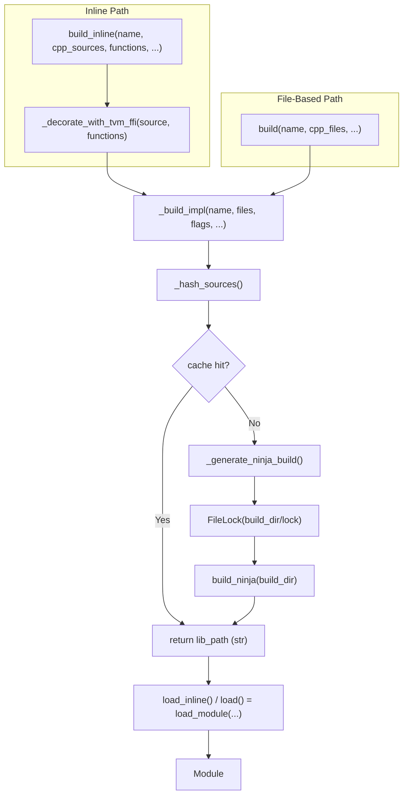

# FFI C++ Extension Building (`tvm_ffi.cpp`)

**TL;DR**.
- `tvm_ffi.cpp` provides two API tiers for compiling C++/CUDA extensions: (1) **inline** -- `build_inline()`/`load_inline()` compile source strings with automatic FFI header decoration, and (2) **file-based** -- `build()`/`load()` compile source files where the user is responsible for includes and export macros.
- The subsystem uses a SHA-256 content-hash-based cache (`~/.cache/tvm-ffi/<name>_<hash16>/`) with Ninja as the build driver, guarded by a cross-platform `FileLock` for safe concurrent compilation.
- Both tiers delegate to a shared `_build_impl()` backend. The module was renamed from `load_inline.py` to `extension.py` to reflect this broadened scope (c897e4c9).
- `load_inline`/`load` are thin wrappers: `load_module(build_inline(...))`/`load_module(build(...))`.
- Cross-compilation is supported via `TVM_FFI_JIT_EXTRA_CFLAGS`/`TVM_FFI_JIT_EXTRA_LDFLAGS` environment variables (6d8b134f).

## Problem Statement
### Background
- Extension developers often need to quickly compile and test C++/CUDA code that uses FFI types without setting up a full CMake project. The static extension pattern (`examples/packaging/`) is powerful but requires boilerplate: CMakeLists.txt, scikit-build-core config, and a build step.
- PyTorch provides `torch.utils.cpp_extension.load_inline` for this purpose. TVM FFI needed an equivalent that: (a) aligns with torch's interface conventions, (b) uses the FFI's own `TVM_FFI_DLL_EXPORT_TYPED_FUNC` macro for symbol export, and (c) returns a `tvm_ffi.Module` for seamless integration with the module system.

### Solution
- A Python-level `load_inline()` function that: (1) decorates user source with FFI headers and export macros, (2) generates a `build.ninja` file, (3) compiles via Ninja, (4) returns the result as a `Module` via `load_module`.
- Content-addressed caching avoids recompilation when sources and flags have not changed.

### Goals
- Zero-boilerplate JIT compilation of C++/CUDA code from Python strings.
- Cache-based rebuild avoidance for unchanged sources.
- Cross-platform: Linux, macOS, and Windows (MSVC).
- Non-goal: production deployment (use the static CMake pattern from 0013 for that).

## Design



### Key Classes, Fields and Interfaces

```python
def build_inline(
    name: str,
    *,
    cpp_sources: str | Sequence[str] | None = None,
    cuda_sources: str | Sequence[str] | None = None,
    functions: Mapping[str, str] | Sequence[str] | str | None = None,
    extra_cflags: Sequence[str] | None = None,
    extra_cuda_cflags: Sequence[str] | None = None,
    extra_ldflags: Sequence[str] | None = None,
    extra_include_paths: Sequence[str] | None = None,
    build_directory: str | None = None,
    embed_cubin: Mapping[str, bytes] | None = None,  # (d49effdb)
    backend: str | None = None,  # "cuda", "hip", or None (auto-detect) (65b5e90)
) -> str:
    """Compile C++/CUDA source to shared library; return path without loading."""
    # Interacts with: _decorate_with_tvm_ffi, _hash_sources, _generate_ninja_build, _build_ninja
    # Interacts with: FileLock (concurrent build serialization)
    # Invariant: returns resolved absolute path to .so (Unix) or .dll (Windows)
    # Invariant: same content-hash cache as load_inline (same cache key = same binary)
    # Invariant: embed_cubin not supported on Windows (raises NotImplementedError)
    # Extension: use returned path with load_module() for deferred or conditional loading
    ...

def load_inline(
    name: str,
    *,
    cpp_sources: str | Sequence[str] | None = None,
    cuda_sources: str | Sequence[str] | None = None,
    functions: Sequence[str] | Mapping[str, str] | str | None = None,
    extra_cflags: Sequence[str] | None = None,
    extra_cuda_cflags: Sequence[str] | None = None,
    extra_ldflags: Sequence[str] | None = None,
    extra_include_paths: Sequence[str] | None = None,
    build_directory: str | None = None,
    embed_cubin: Mapping[str, bytes] | None = None,  # (d49effdb)
    backend: str | None = None,  # "cuda", "hip", or None (auto-detect) (65b5e90)
) -> Module:
    """Compile and load a C++/CUDA tvm_ffi module from inline source code."""
    # Refactored to: load_module(build_inline(...))
    # Interacts with: build_inline (compile step, passes embed_cubin through), load_module (load step)
    # Invariant: functions registered in cpp_sources when present, otherwise in cuda_sources (1ce0f6fa)
    # Invariant: when functions is a Sequence[str], exported name == function name in source
    # Invariant: when build_directory is None, uses TVM_FFI_CACHE_DIR or ~/.cache/tvm-ffi
    # Extension: pass Mapping[str, str] for functions to attach docstrings (values are docstrings)
    ...

def build(
    name: str,
    *,
    cpp_files: Sequence[str] | str | None = None,
    cuda_files: Sequence[str] | str | None = None,
    extra_cflags: Sequence[str] | None = None,
    extra_cuda_cflags: Sequence[str] | None = None,
    extra_ldflags: Sequence[str] | None = None,
    extra_include_paths: Sequence[str] | None = None,
    build_directory: str | None = None,
    backend: str | None = None,  # "cuda", "hip", or None (auto-detect) (65b5e90)
) -> str:
    """Compile C++/CUDA source files into a shared library; return path."""
    # Interacts with: _build_impl, _hash_sources, _generate_ninja_build, build_ninja
    # Interacts with: FileLock (concurrent build serialization)
    # Invariant: user must manually add TVM_FFI_DLL_EXPORT_TYPED_FUNC in source files
    # Invariant: paths resolved to absolute via Path.resolve() before hashing
    # Extension: use returned path with load_module() for deferred loading
    ...

def load(
    name: str,
    *,
    cpp_files: Sequence[str] | str | None = None,
    cuda_files: Sequence[str] | str | None = None,
    extra_cflags: Sequence[str] | None = None,
    extra_cuda_cflags: Sequence[str] | None = None,
    extra_ldflags: Sequence[str] | None = None,
    extra_include_paths: Sequence[str] | None = None,
    build_directory: str | None = None,
    backend: str | None = None,  # "cuda", "hip", or None (auto-detect) (65b5e90)
) -> Module:
    """Compile C++/CUDA source files and load as a tvm_ffi Module."""
    # Refactored to: load_module(build(...))
    # Interacts with: build (compile step), load_module (load step)
    ...

# Internal shared backend (architecturally significant):
def _build_impl(
    name: str, cpp_files: ..., cuda_files: ..., flags: ...,
    need_lock: bool = True,
    backend: str | None = None,  # (65b5e90)
) -> str:
    """Shared build backend for both build() and build_inline()."""
    # Interacts with: _hash_sources, _generate_ninja_build, build_ninja, FileLock
    # Invariant: need_lock=False only when caller already holds the lock (build_inline path)
    # Invariant: asserts at least one of cpp_files or cuda_files is non-empty
    ...

def _decorate_with_tvm_ffi(source: str, functions: Mapping[str, str]) -> str:
    """Prepend standard FFI headers and append TVM_FFI_DLL_EXPORT_TYPED_FUNC calls."""
    # Adds: tvm/ffi/container/tensor.h (742b16e5), tvm/ffi/dtype.h, tvm/ffi/error.h, tvm/ffi/extra/c_env_api.h, tvm/ffi/function.h
    # For each function name: appends TVM_FFI_DLL_EXPORT_TYPED_FUNC(func_name, func_name)
    # For each function with non-empty docstring: also appends
    #   TVM_FFI_DLL_EXPORT_TYPED_FUNC_DOC(func_name, "escaped_doc") (ac7bf680)
    # Interacts with: _escape_cpp_string_literal (escapes \, ", \n, \r, \t for C++ literal)
    # Interacts with: TVM_FFI_DLL_EXPORT_TYPED_FUNC macro (generates __tvm_ffi_<func_name> symbol)
    ...

def _escape_cpp_string_literal(s: str) -> str:
    """Escape special characters for embedding in C++ string literals (ac7bf680)."""
    # Interacts with: _CPP_ESCAPE_TABLE (translation table for \\, \", \\n, \\r, \\t)
    ...

def _hash_sources(
    name: str, cpp_sources: str, cuda_sources: str,
    functions: Mapping[str, str],
    cflags: Sequence[str], cuda_cflags: Sequence[str],
    ldflags: Sequence[str], include_paths: Sequence[str],
    embed_cubin: Mapping[str, bytes] | None = None,  # (d49effdb)
) -> str:
    """SHA-256 over all inputs; returns first 16 hex chars."""
    # Invariant: sorted iteration over functions ensures deterministic hash
    # Invariant: embed_cubin bytes are included in hash (d49effdb)
    ...

def _generate_ninja_build(
    name: str, build_dir: str,
    extra_cflags: Sequence[str], extra_cuda_cflags: Sequence[str],
    extra_ldflags: Sequence[str], extra_include_paths: Sequence[str],
    backend: str | None = None,  # "cuda" | "hip" | None (65b5e90, was with_cuda: bool)
) -> str:
    """Generate build.ninja content. Platform-aware (Windows MSVC vs. Unix GCC/Clang).
    Backend selects compiler toolchain: 'cuda' -> nvcc, 'hip' -> hipcc."""
    # Unix: -std=c++17, -fPIC, -O2, -shared, -L<lib_path> -ltvm_ffi
    # Windows: /MD, /EHsc, /std:c++17, /O2, /link /out:<name>.dll, /LIBPATH:<lib_path> tvm_ffi.lib
    # CUDA backend: auto-detect arch via nvidia-smi; override with TVM_FFI_CUDA_ARCH_LIST
    # HIP backend: uses hipcc, arch via rocm_agent_enumerator/rocminfo or TVM_FFI_ROCM_ARCH_LIST
    #   Note: HIP omits --generate-dependencies-with-compile (not supported by hipcc)
    # Interacts with: find_libtvm_ffi() for linker flags on all platforms
    # Interacts with: _find_rocm_home(), _get_rocm_target() for HIP builds (65b5e90)
    # Invariant: colons in paths escaped as $: for ninja compatibility on Windows
    ...

# --- GPU Backend Detection (65b5e90) ---

BACKEND_STR = Literal["cuda", "hip"]

@functools.lru_cache
def _detect_gpu_backend() -> BACKEND_STR:
    """Auto-detect CUDA or HIP. Returns 'hip' if ROCm available, else 'cuda'."""
    # Priority: TVM_FFI_GPU_BACKEND env var -> _find_rocm_home() success -> "cuda"
    # Invariant: result is cached per-process; restart Python to re-detect
    ...

def _resolve_gpu_backend(backend: str | None) -> BACKEND_STR:
    """Validate explicit backend or fall back to _detect_gpu_backend()."""
    # Invariant: raises ValueError for any backend not in ("cuda", "hip")
    ...

@functools.lru_cache
def _find_rocm_home() -> str:
    """Find ROCm install path: ROCM_HOME/ROCM_PATH env -> hipcc in PATH -> /opt/rocm."""
    # Invariant: raises RuntimeError if all three discovery strategies fail
    # Interacts with: _get_rocm_target, _generate_ninja_build (rocm_home/include + lib paths)
    ...

def _get_rocm_target() -> list[str]:
    """Return --offload-arch=<gfxXXXX> flags for all present AMD GPUs."""
    # Priority: TVM_FFI_ROCM_ARCH_LIST env var -> rocm_agent_enumerator -> rocminfo
    # Invariant: raises RuntimeError if no GPU detected and env var absent
    # Extension: set TVM_FFI_ROCM_ARCH_LIST="gfx90a gfx942" to pin target arches
    ...

def build_ninja(build_dir: str) -> None:
    """Run ninja -v in build_dir. On Windows, delegates to _run_command_in_dev_prompt.
    Renamed from _build_ninja to build_ninja (public) in e6a654aa."""
    # MAX_JOBS env var controls -j parallelism
    # Windows: _run_command_in_dev_prompt(command, build_dir, capture_output=True)
    #   discovers VS via vswhere.exe, sources VsDevCmd.bat -arch=x64 (4383b1a6)
    # Unix: subprocess.run(args=command, cwd=build_dir, capture_output=True)
    # Invariant: uses 'oem' encoding on Windows, 'utf-8' elsewhere
    ...

def _run_command_in_dev_prompt(args: list[str], cwd: str, capture_output: bool) -> subprocess.CompletedProcess:
    """(Windows only) Locate MSVC Developer Command Prompt and run a command within its env."""
    # Discovery: vswhere.exe -> VS install path -> Common7/Tools/VsDevCmd.bat
    # Execution: cmd.exe /c "VsDevCmd.bat -arch=x64 & <command>"
    # Invariant: raises RuntimeError wrapping original exception on discovery failure
    ...

class FileLock:
    """Cross-platform advisory file lock using fcntl.flock (Unix) or msvcrt.locking (Windows)."""
    lock_file_path: str
    _file_descriptor: int | None

    def __enter__(self) -> "FileLock": ...   # calls blocking_acquire()
    def __exit__(self, *args) -> bool: ...   # calls release(), propagates exceptions

    def acquire(self) -> bool: ...
        # Invariant: opens lock_file_path (creating if absent), applies exclusive lock

    def blocking_acquire(self, timeout: float | None = None, poll_interval: float = 0.1) -> bool: ...
        # Invariant: raises TimeoutError (not RuntimeError) on timeout

    def release(self) -> None: ...
        # Invariant: safe to call even if acquire failed (no-op if _file_descriptor is None)
```

### Contracts, Assumptions and Invariants
- **Content-addressed cache**: Recompilation only occurs when the SHA-256 hash of (sources + functions + flags) changes. The cache key is `<name>_<hash16>`.
- **FileLock serialization**: Concurrent `load_inline` calls targeting the same cache directory are serialized via `FileLock` to prevent partial builds. The lock file lives at `<cache_dir>/lock`.
- **Platform-aware compilation**: On Windows, the build emits MSVC-compatible flags and `.dll` output; on Unix, GCC/Clang flags and `.so` output. macOS and Linux both link `-ltvm_ffi`.
- **GPU backend discovery** (65b5e90): Backend auto-detected via `_detect_gpu_backend()`: `TVM_FFI_GPU_BACKEND` env var takes priority, then ROCm presence, then CUDA default. CUDA: `CUDA_HOME`/`CUDA_PATH`/`nvcc` path; arch from `nvidia-smi` or `TVM_FFI_CUDA_ARCH_LIST`. HIP/ROCm: `ROCM_HOME`/`ROCM_PATH`/`hipcc` path/`/opt/rocm`; arch from `TVM_FFI_ROCM_ARCH_LIST`, `rocm_agent_enumerator`, or `rocminfo`.
- **HIP dependency tracking**: HIP compile rule omits `--generate-dependencies-with-compile`/`--dependency-output` (not supported by hipcc), so incremental dependency tracking is weaker for HIP builds.
- **Failure mode**: If Ninja compilation fails, `_build_ninja` raises `RuntimeError` with the full stdout+stderr output for diagnostic.

### Extension Points
- **Custom build directories**: Pass `build_directory` to bypass the cache and place build artifacts at a known location.
- **Custom compilers**: `CXX` env var overrides the C++ compiler.
- **Additional flags**: `extra_cflags`, `extra_cuda_cflags`, `extra_ldflags`, `extra_include_paths` for project-specific configuration.
- **Cross-compilation env vars**: `TVM_FFI_JIT_EXTRA_CFLAGS` and `TVM_FFI_JIT_EXTRA_LDFLAGS` inject compiler/linker flags into JIT builds (appended after all platform-specific flags). Uses `shlex.split` for shell-aware parsing (6d8b134f).

### Usage Examples

#### Compile and call a CPU C++ function
**Context**: Quick iteration on a C++ kernel without setting up a CMake project.
```python
import numpy
import tvm_ffi.cpp

mod = tvm_ffi.cpp.load_inline(
    name="hello",
    cpp_sources=r"""
        void add_one_cpu(tvm::ffi::Tensor x, tvm::ffi::Tensor y) {
            for (int i = 0; i < x->shape[0]; ++i)
                static_cast<float*>(y->data)[i] = static_cast<float*>(x->data)[i] + 1;
        }
    """,
    functions=["add_one_cpu"],
)

x = numpy.array([1, 2, 3, 4, 5], dtype=numpy.float32)
y = numpy.empty_like(x)
mod.add_one_cpu(x, y)  # calls through Module.__getattr__ -> GetFunction -> packed call
numpy.testing.assert_equal(x + 1, y)
```

#### Compile a CUDA kernel with stream context
**Context**: Inline CUDA code that uses FFI stream context for correct dispatch.
```python
# CUDA-only module -- no cpp_sources needed (1ce0f6fa)
mod = tvm_ffi.cpp.load_inline(
    name="cuda_add",
    cuda_sources=r"""
        __global__ void AddOneKernel(float* x, float* y, int n) {
            int i = blockIdx.x * blockDim.x + threadIdx.x;
            if (i < n) y[i] = x[i] + 1;
        }
        void add_one_cuda(DLTensor* x, DLTensor* y) {
            int n = x->shape[0];
            cudaStream_t stream = static_cast<cudaStream_t>(
                TVMFFIEnvGetStream(x->device.device_type, x->device.device_id));
            AddOneKernel<<<(n+255)/256, 256, 0, stream>>>(
                static_cast<float*>(x->data), static_cast<float*>(y->data), n);
        }
    """,
    functions=["add_one_cuda"],  # registered directly in cuda_sources
)
```

#### Compile C++/CUDA from source files (file-based API)
**Context**: When you have existing `.cc` source files with their own headers and export macros.
```python
import tvm_ffi.cpp

# Source file must include FFI headers and TVM_FFI_DLL_EXPORT_TYPED_FUNC manually
output_lib_path = tvm_ffi.cpp.build(
    name="hello",
    cpp_files=["my_extension.cc"],
)
mod = tvm_ffi.load_module(output_lib_path)
mod.my_function(x, y)

# Or compile and load in one step:
mod = tvm_ffi.cpp.load(name="hello", cpp_files=["my_extension.cc"])
```

#### Compile a HIP kernel on AMD GPU (65b5e90)
**Context**: Using the `backend` parameter for AMD ROCm/HIP compilation.
```python
import tvm_ffi.cpp

mod = tvm_ffi.cpp.load_inline(
    name="hip_add",
    cuda_sources=r"""
        #include <hip/hip_runtime.h>
        __global__ void add_one_kernel(const float* x, float* y, int64_t n) {
            int64_t i = (int64_t)blockIdx.x * blockDim.x + threadIdx.x;
            if (i < n) y[i] = x[i] + 1.0f;
        }
        void add_one_hip(tvm::ffi::TensorView x, tvm::ffi::TensorView y) { ... }
    """,
    functions="add_one_hip",
    backend="hip",  # explicit HIP; or omit for auto-detection on AMD hardware
)
# Note: HIP source is passed via cuda_sources parameter; backend selects the compiler toolchain
```

#### Cross-compilation with extra flags
**Context**: Cross-compiling the torch C DLPack addon or inline modules for a different target.
```bash
export TVM_FFI_JIT_EXTRA_CFLAGS="--target=riscv64-unknown-linux-gnu --sysroot=/"
export TVM_FFI_JIT_EXTRA_LDFLAGS="--target=riscv64-linux-gnu --sysroot=/ -L/prefix/lib"
python -c "import tvm_ffi"  # JIT build will use the extra flags
```

### Evolution Timeline

| Commit | Change | Impact |
|--------|--------|--------|
| `83805ec` | Initial `load_inline` API with `cpp_source`/`cuda_source`/`cpp_functions`/`cuda_functions` | Created subsystem |
| `825aeb9` | Renamed params to match torch: `cpp_sources`/`cuda_sources`/`functions`, added `build_directory` | Breaking API change |
| `2df07e5` | Windows MSVC support: platform-aware ninja rules, `.dll` output, `oem` encoding | Cross-platform fix |
| `4ffbc88` | macOS fix: link `libtvm_ffi` on non-Windows platforms | Cross-platform fix |
| `236e9e9` | Added `ninja` to optional deps, xfail tests on non-Linux | Chore |
| `1ce0f6fa` | CUDA-only function routing: functions registered in cuda_sources when cpp_sources absent | Feature |
| `742b16e5` | Added `tvm/ffi/container/tensor.h` to default header set, migrated examples to `tvm::ffi::Tensor` | Convention shift |
| `4383b1a6` | Windows Ninja fix: `_run_command_in_dev_prompt` auto-discovers MSVC via `vswhere.exe` | Cross-platform fix |
| `65b5e90` | Added `backend` parameter on all 4 public APIs; HIP/ROCm support with `_detect_gpu_backend`, `_find_rocm_home`, `_get_rocm_target`; env vars `TVM_FFI_GPU_BACKEND`, `TVM_FFI_ROCM_ARCH_LIST` | Feature: AMD GPU support |

## Implementation Notes
- `_decorate_with_tvm_ffi` injects `TVM_FFI_DLL_EXPORT_TYPED_FUNC(func_name, func_name)` for each function, which generates the `__tvm_ffi_<func_name>` C symbol. The Module's `GetFunction` -> `GetSymbolWithSymbolPrefix` transparently prepends `__tvm_ffi_` during lookup.
- CUDA functions are wrapped with `TVM_FFI_DLL_EXPORT_TYPED_FUNC` either in `cpp_sources` (when present) or directly in `cuda_sources` (when `cpp_sources` is empty). The `with_cpp = len(cpp_sources) > 0` flag determines the routing target (1ce0f6fa).
- The `ninja` build tool is a required dependency (added to `[project.optional-dependencies]` under `cpp`, `torch`, and `test` groups).

## Alternatives & Trade-offs
### Ninja-based build vs. Direct compiler invocation
- Pros of Ninja: Handles dependency tracking, supports incremental rebuilds, standard build tool.
- Cons: Requires `ninja` as an additional dependency. Generating `build.ninja` adds complexity.
### Content-hash cache vs. Timestamp-based rebuild
- Pros of content-hash: Deterministic. Same sources always produce the same cache key. Safe for concurrent processes.
- Cons: Full re-hash on every call (mitigated by fast SHA-256 of small source strings).
### Torch-compatible interface vs. Independent API design
- Pros of torch-compatible: Users familiar with `torch.utils.cpp_extension.load_inline` can migrate directly. Parameter names and semantics match.
- Cons: Locked into torch's conventions (e.g., `functions` as either list or mapping).

## Evidence
| Commit | Scope | Contribution |
|--------|-------|-------------|
| 83805ec | python/tvm_ffi, ffi/module | Introduced `load_inline`, `FileLock`, `_decorate_with_tvm_ffi`, Ninja build pipeline, `tvm_ffi.cpp` and `tvm_ffi.utils` subpackages |
| 825aeb9 | python/cpp-extensions | Renamed API to match torch conventions: `cpp_sources`/`cuda_sources`/`functions`/`build_directory` |
| 2df07e5 | python/cpp-load-inline | Windows MSVC support with platform-aware ninja rules |
| 4ffbc88 | python/ffi-bindings | macOS fix: link libtvm_ffi on non-Windows platforms |
| 1ce0f6fa | python/tvm_ffi/cpp | CUDA-only function routing when cpp_sources absent |
| 742b16e5 | python/tvm_ffi/cpp | Added `tensor.h` to default headers, migrated examples to `tvm::ffi::Tensor` |
| 4383b1a6 | python/tvm_ffi/cpp | Windows Ninja fix via `_run_command_in_dev_prompt` (vswhere discovery) |
| Plus 1 supporting commit: 236e9e9 (ninja dependency, test xfail) |
| 4fcf94f6 | python/tvm_ffi/cpp | Extracted `build_inline` from `load_inline`; `load_inline` refactored to `load_module(build_inline(...))` |
| e6a654aa | python/torch-dlpack-addon | `_build_ninja` renamed to `build_ninja` (public); torch DLPack addon build reuses it |
| c897e4c9 | python/tvm_ffi/cpp | Added `build()`/`load()` file-based APIs; extracted `_build_impl`; renamed `load_inline.py` to `extension.py` |
| 6d8b134f | python/packaging | Added `TVM_FFI_JIT_EXTRA_CFLAGS`/`TVM_FFI_JIT_EXTRA_LDFLAGS` env vars for cross-compilation |
| ac7bf680 | ffi/function, python/tvm_ffi/cpp | `_decorate_with_tvm_ffi` now emits `TVM_FFI_DLL_EXPORT_TYPED_FUNC_DOC` for docstrings; added `_escape_cpp_string_literal` |
| d49effdb | ffi/extra/cuda, python/tvm_ffi/cpp | Added `embed_cubin` parameter on build_inline/load_inline/build; NVRTC compilation utility; Ninja merge_objects+embed_cubin rules |
| 65b5e90 | python/tvm_ffi/cpp | Added `backend` parameter, HIP/ROCm support, GPU backend detection, ROCm home/arch discovery |

## Related Design Docs & ADRs
- [0011-module-system.md](0011-module-system.md) -- `load_module` used to load the compiled shared library as a `Module`
- [0013-packaging.md](0013-packaging.md) -- Static CMake-based extension pattern that `load_inline` complements; `TVM_FFI_DLL_EXPORT_TYPED_FUNC` macro
- [0012-python-package.md](0012-python-package.md) -- `find_include_path()`, `find_libtvm_ffi()` used for header and library discovery
- [0019-cuda-extras.md](0019-cuda-extras.md) -- CUBIN launcher, DeviceGuard, and NVRTC utilities that leverage embed_cubin
