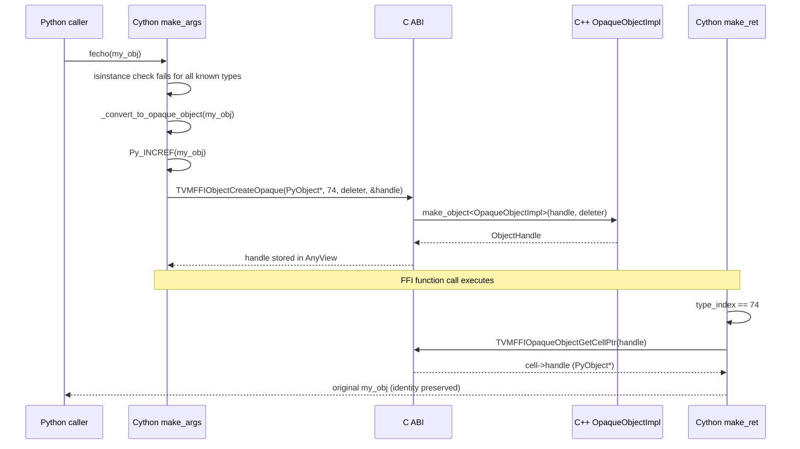

# OpaquePyObject — Cross-Language Lifecycle Bridge

**TL;DR**
- `OpaquePyObject` wraps arbitrary Python objects that the FFI doesn't natively recognize into ref-counted `Object` instances, allowing them to round-trip through FFI calls with identity preserved (`y is x`).
- A new static type index `kTVMFFIOpaquePyObject = 74` and C ABI function `TVMFFIObjectCreateOpaque` provide the language-agnostic creation path; a user-supplied `deleter` callback ties the external handle's lifecycle to FFI ref-counting.
- Python's `convert(value)` no longer raises `TypeError` for unknown types — it silently wraps them as `OpaquePyObject`. The Cython `make_ret` path unwraps transparently, so the caller never sees the wrapper.

## Problem Statement

### Background
Before this design, any Python object not natively recognized by the FFI (not a `Function`, `Object`, `Tensor`, numpy array, torch tensor, or scalar) caused `convert()` to raise `TypeError`. This blocked use cases like passing opaque ML model handles, custom Python objects, or framework-specific structures through FFI function calls.

### Solution
Introduce a transparent wrapping protocol: unrecognized Python objects get `Py_INCREF`'d and stored in a heap-allocated `OpaqueObjectImpl` with `type_index = kTVMFFIOpaquePyObject`. On return, `make_ret_opaque_object` recognizes the type index and extracts the original `PyObject*` via `TVMFFIOpaqueObjectGetCellPtr`. Identity is preserved because the same `PyObject*` is returned without copying.

### Goals
- Any Python object can pass through FFI calls transparently (no `TypeError`).
- Round-trip identity: `ffi_echo(x) is x` holds for arbitrary `x`.
- Language-agnostic C ABI: `TVMFFIObjectCreateOpaque` works for any language binding, not just Python.
- Non-goal: making opaque objects inspectable from C++ (they are truly opaque — the handle is `void*`).

## Design



### Key Classes, Fields and Interfaces

```python
# C ABI (include/tvm/ffi/c_api.h)
kTVMFFIOpaquePyObject = 74  # static type index in [kTVMFFIStaticObjectBegin, kTVMFFIStaticObjectEnd)
# Invariant: kTVMFFIStaticObjectEnd is now >= 75 (was effectively 74 before this type)
# Interacts with: TVMFFIAny.type_index, IsInstance checks, 0001-c-abi type index table
# Registration fix (commit b64b46f): previously registered via ReserveBuiltinTypeIndex (commit bdad218)
#   which did NOT set parent_type_index — so IsInstance<Object>() returned false for OpaquePyObject.
#   Fixed to use GetOrAllocTypeIndex with type_depth=1, parent=kTVMFFIObject.
#   Now properly a depth-1 child of Object (registered in TypeTable ctor via ReserveDepthOneObjectTypeIndex).
#   StaticTypeKey::kTVMFFIOpaquePyObject = "ffi.OpaquePyObject"
# Without this registration, type-mismatch errors on OpaquePyObject arguments caused abort()
#   instead of raising TypeError (the GetMismatchTypeInfo -> TypeTable::GetTypeEntry(74) path
#   returned nullptr, triggering InternalError caught by LOG_EXCEPTION_CALL_END -> exit(-1)).

class TVMFFIOpaqueObjectCell:
    """C ABI struct immediately following TVMFFIObject header (offset 24)."""
    handle: void*  # for Python: stores PyObject*; for other languages: any external handle
    # Invariant: layout is TVMFFIObject (24 bytes) | TVMFFIOpaqueObjectCell (8 bytes)
    # Interacts with: TVMFFIOpaqueObjectGetCellPtr (inline accessor)

def TVMFFIObjectCreateOpaque(
    handle: void*,
    type_index: int32_t,
    deleter: Callable[[void*], None],
    out: TVMFFIObjectHandle*,
) -> int:
    """Create a ref-counted opaque object wrapping an external handle."""
    # Invariant: type_index must equal kTVMFFIOpaquePyObject; other values raise RuntimeError
    # Invariant: deleter is called exactly once when strong_ref_count drops to zero
    # Interacts with: OpaqueObjectImpl (C++ impl), TVMFFIPyObjectDeleter (Cython)

def TVMFFIOpaqueObjectGetCellPtr(obj: TVMFFIObjectHandle) -> TVMFFIOpaqueObjectCell*:
    """Inline accessor: returns pointer to cell at byte offset 24 from obj."""
    # Interacts with: TVMFFIObject header (24-byte offset, same pattern as TensorGetDLTensorPtr)

# C++ implementation (src/ffi/object.cc)
class OpaqueObjectImpl(Object, TVMFFIOpaqueObjectCell):
    """Internal heap object wrapping an arbitrary external handle with a custom deleter."""
    handle: void*             # inherited from TVMFFIOpaqueObjectCell
    deleter_: FnPtr[void*]   # stored function pointer
    # Invariant: destructor calls deleter_(handle) exactly once
    # Interacts with: make_object<OpaqueObjectImpl>, ObjectUnsafe::GetHeader (for type_index override)
    # Extension: could support other type_index values for language-specific opaque types

# Cython layer (python/tvm_ffi/cython/object.pxi)
class OpaquePyObject(Object):
    """Cython wrapper around kTVMFFIOpaquePyObject handle."""
    def pyobject(self) -> object:
        """Retrieve original Python object via TVMFFIOpaqueObjectGetCellPtr."""
        # Interacts with: TVMFFIOpaqueObjectGetCellPtr, Python reference counting

# Cython layer (python/tvm_ffi/cython/function.pxi)
def _convert_to_opaque_object(pyobject: object) -> OpaquePyObject:
    """Wrap a Python object: Py_INCREF, then TVMFFIObjectCreateOpaque."""
    # Interacts with: TVMFFIPyObjectDeleter, OpaquePyObject

extern "C" void TVMFFIPyObjectDeleter(py_obj: void*) noexcept:
    """C++-side deleter (commit b64b46f): replaces former Cython-level tvm_ffi_pyobject_deleter.
    Lives in tvm_ffi_python_helpers.h. Conditionally acquires GIL only when NOT running
    free-threaded Python (via TVMFFIPyWithGILIfNotFreeThreaded RAII guard).
    Shared between Function wrapping (TVMFFIFunctionCreate) and OpaquePyObject (TVMFFIObjectCreateOpaque).
    """
    # TVMFFIPyWithGILIfNotFreeThreaded gil_state;  // no-op under Py_GIL_DISABLED
    # Py_DecRef((PyObject*)py_obj);
    # Invariant: called exactly once per wrapped handle; decrements Python refcount exactly once
    # Interacts with: TVMFFIObjectCreateOpaque (passed as deleter), TVMFFIFunctionCreate
    # Interacts with: TVMFFIPyWithGILIfNotFreeThreaded (GIL-conditional guard, commit b64b46f)
```

### Contracts, Assumptions and Invariants

- `TVMFFIObjectCreateOpaque` currently only accepts `type_index == kTVMFFIOpaquePyObject (74)`. Passing any other value raises `RuntimeError`. This is an artificial restriction that could be relaxed for other opaque type indices.
- The `deleter` callback is called exactly once when the last strong reference is released. For Python objects, this means `Py_DECREF` happens on the GIL thread via `TVMFFIPyObjectDeleter`.
- Identity preservation: `_convert_to_opaque_object` calls `Py_INCREF`, and `make_ret_opaque_object` returns the raw `PyObject*` without creating a copy. This guarantees `ffi_echo(x) is x`.
- Python's `convert(value)` fallback changed from raising `TypeError` to wrapping as `OpaquePyObject`. This is a behavioral change for all callers that relied on the `TypeError` to detect unsupported types.
- Opaque objects stored in containers (`Array`, `Map`) are also transparently unwrapped on element access in Python.

### Failure Modes
- Deleter called without GIL: if a non-Python thread drops the last reference, `TVMFFIPyObjectDeleter` acquires the GIL (via `TVMFFIPyWithGILIfNotFreeThreaded` RAII guard). In free-threaded Python (3.14t, `Py_GIL_DISABLED`), the guard is a no-op. Deadlock if the GIL holder is waiting on the same FFI lock. Mitigation: avoid holding FFI-internal locks when calling Python callbacks.
- `TVMFFIOpaqueObjectGetCellPtr` on a non-opaque object: undefined behavior (byte-offset cast to wrong type). Mitigation: always check `type_index == kTVMFFIOpaquePyObject` before calling.

### Extension Points
- Support additional opaque type indices (e.g., `kTVMFFIOpaqueRustObject`) by relaxing the `type_index == kTVMFFIOpaquePyObject` check in `TVMFFIObjectCreateOpaque`.
- Other language bindings (Rust, Java) can implement their own `deleter` callbacks following the same pattern.

### Usage Examples

#### Round-trip arbitrary Python objects through FFI
**Context**: passing non-FFI-native Python objects through registered functions.

```python
import tvm_ffi

class MyModel:
    def __init__(self, name):
        self.name = name

fecho = tvm_ffi.get_global_func("testing.echo")
model = MyModel("resnet50")
result = fecho(model)
assert result is model  # identity preserved — same Python object

# Works with callbacks too
def py_callback(obj):
    assert obj is model
    return obj

f = tvm_ffi.convert(py_callback)
assert f(model) is model
```

#### Container storage with transparent unwrapping
**Context**: storing opaque Python objects in FFI arrays.

```python
a = tvm_ffi.convert([MyModel("a"), MyModel("b")])
assert isinstance(a, tvm_ffi.Array)
assert isinstance(a[0], MyModel)  # unwrapped transparently on access
```

#### Lifecycle management
**Context**: verifying ref-count correctness.

```python
import sys
obj = MyModel("test")
assert sys.getrefcount(obj) == 2          # local + arg
wrapped = tvm_ffi.convert(obj)            # Py_INCREF -> 3
assert isinstance(wrapped, tvm_ffi.core.OpaquePyObject)
unwrapped = wrapped.pyobject()            # another ref -> 4
wrapped = None                            # FFI GC -> Py_DECREF -> 3
unwrapped = None                          # -> 2
```

## Implementation Notes

- `OpaqueObjectImpl` uses `make_object<OpaqueObjectImpl>` for allocation, then calls `SetTypeIndex(kTVMFFIOpaquePyObject)` post-construction via `ObjectUnsafe::GetHeader`. This is because the type index is a parameter, not a compile-time constant.
- `TVMFFIPyObjectDeleter` was renamed from `tvm_ffi_callback_deleter`. The same function pointer is shared between `TVMFFIFunctionCreate` (for Python callback wrapping) and `TVMFFIObjectCreateOpaque` (for opaque object wrapping).

## Alternatives & Trade-offs

### Alternative A: Explicit wrapping API (require user to call `tvm_ffi.wrap(obj)`)
- Pros: No silent behavioral change in `convert()`; users opt in explicitly.
- Cons: Breaks the ergonomic promise that any Python object can be passed to FFI functions.

### Alternative B: Use a dynamic type index (>= 128) instead of a static one
- Pros: Doesn't consume a scarce static slot [64-127].
- Cons: Makes `IsInstance<OpaquePyObject>` slower (no fast-path slot check); opaque objects are fundamental enough to warrant a static slot.

## Related Design Docs & ADRs
- `.knowledge/design-records/0001-c-abi.md` — `kTVMFFIOpaquePyObject = 74`, `TVMFFIOpaqueObjectCell` ABI struct
- `.knowledge/design-records/0002-object-system.md` — `OpaqueObjectImpl` inherits from `Object`; uses `make_object`, dual ref-count lifecycle
- `.knowledge/design-records/0004-function-system.md` — shares `TVMFFIPyObjectDeleter` with Function wrapping
- `.knowledge/design-records/0013-python-package.md` — Cython `OpaquePyObject` class, `_convert_to_opaque_object`

## Evidence Matrix

| Commit | Contribution |
|--------|-------------|
| 91d69f0 | Introduces kTVMFFIOpaquePyObject=74, TVMFFIOpaqueObjectCell, TVMFFIObjectCreateOpaque, OpaqueObjectImpl, Cython OpaquePyObject, _convert_to_opaque_object, TVMFFIPyObjectDeleter rename, convert() fallback change |
