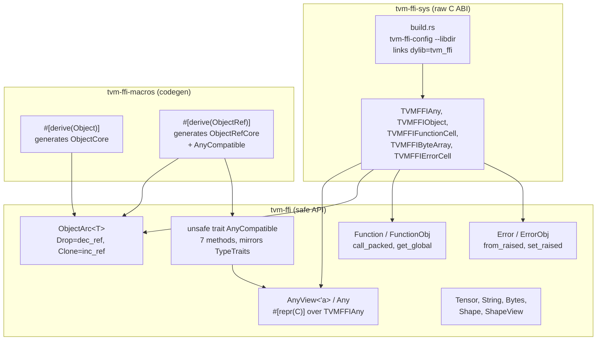

# Rust Bindings

**TL;DR**.
- The `rust/` workspace provides three crates (`tvm-ffi-sys`, `tvm-ffi`, `tvm-ffi-macros`) that mirror the C++/Python FFI layer in idiomatic Rust: `AnyView<'a>`/`Any` for type-erased values, `ObjectArc<T>` for ref-counted ownership, `Function` for packed callables, and `Error` for cross-ABI error propagation.
- The `unsafe trait AnyCompatible` is the Rust mirror of C++ `TypeTraits<T>`, defining 7 methods for bidirectional conversion between Rust types and `TVMFFIAny`. `#[derive(Object)]` and `#[derive(ObjectRef)]` proc-macros generate all boilerplate, including `AnyCompatible` implementations.
- Marked `[experimental]`, secondary to C++/Python; links against the same `libtvm_ffi` shared library via `tvm-ffi-config --libdir`.

## Problem Statement

### Background
- The FFI layer already supports C++ and Python as first-class languages. Adding Rust requires wrapping the same C ABI (`TVMFFIAny`, `TVMFFIObject`, `TVMFFIFunctionCell`) in safe Rust abstractions.
- Rust's ownership model (borrow checker, lifetimes, `Drop`) must align with the C ABI's ref-counting protocol (`combined_ref_count`, deleter flags).
- Without proc-macros, every Object subtype requires ~50 lines of boilerplate for `ObjectCore`, `AnyCompatible`, and `TryFrom` impls.

### Solution
- `tvm-ffi-sys`: raw `extern "C"` bindings to all `TVMFFI*` symbols, plus a `build.rs` that discovers `libtvm_ffi` via `tvm-ffi-config --libdir`.
- `tvm-ffi`: safe Rust wrappers with `#[repr(C)]` layout compatibility. `ObjectArc<T>` implements `Drop` (calls native `dec_ref`), `Clone` (calls native `inc_ref`), `Deref`/`DerefMut`. `AnyView<'a>` carries a `PhantomData` lifetime to prevent dangling views.
- `tvm-ffi-macros`: proc-macros `#[derive(Object)]` and `#[derive(ObjectRef)]` that generate `ObjectCore`, `ObjectRefCore`, and `AnyCompatible` implementations from struct annotations.

### Goals
- Mirror C++ FFI abstractions (`Any`, `ObjectPtr`, `Function`, `Error`) in safe Rust.
- Enable Rust code to call global FFI functions and register new ones.
- Support loading shared libraries (modules) from Rust.
- Non-goal: implement reflection/field registration from Rust (deferred).
- Non-goal: full feature parity with Python bindings.

## Design



### Key Classes, Fields and Interfaces

```python
# --- tvm-ffi-sys linkage (build.rs) ---
# Runs `tvm-ffi-config --libdir` at build time to discover libtvm_ffi.
# Sets cargo:rustc-link-search=native=<libdir>, cargo:rustc-link-lib=dylib=tvm_ffi.
# Sets DYLD_LIBRARY_PATH/LD_LIBRARY_PATH for cargo test/run.
# Invariant: requires Python editable install to have been run first (provides tvm-ffi-config).

# --- AnyView / Any (any.rs) ---
class AnyView:  # #[repr(C)], lifetime 'a via PhantomData
    """Non-owning type-erased value. Maps to TVMFFIAny with lifetime tracking."""
    data: TVMFFIAny
    _phantom: PhantomData  # lifetime 'a — prevents outliving source
    def type_index(self) -> int: ...
    def try_as(self, T) -> Option[T]:
        """Strict downcast via AnyCompatible::try_cast_from_any_view."""
        ...
    # Invariant: lifetime 'a must outlive the data source
    # Interacts with: AnyCompatible trait for conversions

class Any:  # #[repr(C)]
    """Owning type-erased value. Manages ref-counts for object payloads."""
    data: TVMFFIAny
    def new() -> Any: ...  # creates kTVMFFINone value
    def try_as(self, T) -> Option[T]: ...
    # unsafe: as_data_ptr, into_raw_ffi_any, from_raw_ffi_any
    # Interacts with: AnyCompatible::move_to_any / move_from_any_after_check
    # Drop: calls TVMFFIObjectDecRef if type_index >= kTVMFFIStaticObjectBegin

# --- AnyCompatible trait (type_traits.rs) ---
class AnyCompatible:  # unsafe trait, mirrors C++ TypeTraits<T>
    """Compile-time interface for types that participate in AnyView/Any."""
    def copy_to_any_view(src: Self, data: TVMFFIAny) -> None: ...
    def move_to_any(src: Self, data: TVMFFIAny) -> None: ...
    def check_any_strict(data: TVMFFIAny) -> bool: ...
    def copy_from_any_view_after_check(data: TVMFFIAny) -> Self: ...
    def move_from_any_after_check(data: TVMFFIAny) -> Self: ...
    def try_cast_from_any_view(data: TVMFFIAny) -> Result[Self, ()]: ...
    def type_str() -> str: ...
    # Extension: implement for new types to make them Any-compatible
    # Built-in impls: bool, i8..i64, u8..u64, f32, f64, (), Option<T>,
    #                 *mut c_void, DLDevice, DLDataType, all ObjectRef types
    # Interacts with: C++ TypeTraits<T> — same conversion semantics

# --- Object system (object.rs) ---
class Object:  # #[repr(C)]
    """Base object wrapping TVMFFIObject header."""
    header: TVMFFIObject  # 24 bytes: combined_ref_count, type_index, __padding, deleter

class ObjectArc[T: ObjectCore]:  # #[repr(C)], Arc-like smart pointer
    """Strong ref-counted pointer. Drop calls dec_ref, Clone calls inc_ref."""
    ptr: NonNull[T]
    # Invariant: ptr always points to live ObjectCore with combined_ref_count >= 1
    # Drop: calls unsafe_::dec_ref which implements the same 3-path deletion
    #   as C++ DecRef: fast path (both_one), strong-only path, two-phase weak path
    # Clone: atomic fetch_add(1, Relaxed) on combined_ref_count
    # Interacts with: TVMFFIObjectDeleterFlagBitMask (kStrong/kWeak/kBoth)
    def new(data: T) -> ObjectArc[T]:
        """Allocate T, overwrite header with type_index + deleter, refcount=BOTH_ONE."""
        ...
    def new_with_extra_items(data: T) -> ObjectArc[T]:
        """Allocate T + trailing ExtraItem[] for inplace array pattern."""
        ...
    def strong_count(self) -> int: ...
    def weak_count(self) -> int: ...
    # unsafe: from_raw, into_raw, as_raw, as_raw_mut

class ObjectCore:  # unsafe trait
    """Provides type metadata for Object subtypes."""
    TYPE_KEY: str       # e.g., "ffi.Function"
    def type_index() -> int: ...
    def object_header_mut(this: Self) -> TVMFFIObject: ...
    # Extension: use #[derive(Object)] to auto-implement

class ObjectCoreWithExtraItems(ObjectCore):  # unsafe trait
    """For objects with trailing element storage (array/string pattern)."""
    type ExtraItem
    def extra_items_count(this: Self) -> int: ...
    def extra_items(this: Self) -> slice[ExtraItem]: ...
    # Interacts with: ObjectArc::new_with_extra_items (allocator aware)
    # Invariant: sizeof(T) % align_of(ExtraItem) == 0

class ObjectRefCore:  # unsafe trait
    """Bridges ObjectArc to user-facing ref wrappers."""
    type ContainerType: ObjectCore
    def data(this: Self) -> ObjectArc[ContainerType]: ...
    def into_data(this: Self) -> ObjectArc[ContainerType]: ...
    def from_data(data: ObjectArc[ContainerType]) -> Self: ...
    # Extension: use #[derive(ObjectRef)] to auto-implement

# --- Function system (function.rs) ---
class FunctionObj:  # #[repr(C)], #[derive(Object)], type_key="ffi.Function"
    """Packed callable object."""
    object: Object
    cell: TVMFFIFunctionCell  # safe_call + cxx_call pointers

class Function:  # #[derive(ObjectRef)]
    """User-facing packed callable."""
    data: ObjectArc[FunctionObj]
    def call_packed(self, args: list[AnyView]) -> Result[Any]:
        """Invoke safe_call, check return code, call Error::from_raised on failure."""
        ...
    def call_tuple(self, tuple_args: TupleType) -> Result[Any]:
        """Small-vector optimized call: stack buffer for <=4 args, heap for more."""
        ...
    def call_tuple_with_len[LEN](self, tuple_args) -> Result[Any]:
        """Const-generic call with compile-time known arg count."""
        ...
    def get_global(name: str) -> Result[Function]:
        """Look up global function by name via TVMFFIFunctionGetGlobal."""
        ...
    def register_global(name: str, func: Function) -> Result[()]:
        """Register function in global registry via TVMFFIFunctionSetGlobal."""
        ...
    def from_packed(func: Fn([AnyView]) -> Result[Any]) -> Function:
        """Wrap Rust closure via CallbackFunctionObjImpl."""
        ...
    def from_typed(func: F) -> Function:
        """Wrap typed Rust function; auto-converts args via AsPackedCallable."""
        ...
    # Interacts with: CallbackFunctionObjImpl (extends FunctionObj with closure field)
    # Interacts with: AsPackedCallable trait (typed function dispatch)

# CallbackFunctionObjImpl<F> (internal):
#   Memory layout: [FunctionObj | F callback]
#   ObjectCore delegates to FunctionObj (same TYPE_KEY, type_index)
#   safe_call = Self::invoke_callback (extern "C")
#   Invariant: ObjectArc<CallbackFunctionObjImpl<F>> can be cast to ObjectArc<FunctionObj>
#     because FunctionObj is the #[repr(C)] prefix

# --- Error system (error.rs) ---
class ErrorObj:  # #[repr(C)], type_key="ffi.Error"
    object: Object
    cell: TVMFFIErrorCell  # kind, message, backtrace, update_backtrace fn ptr

class Error:  # #[derive(ObjectRef)], implements std::error::Error
    data: ObjectArc[ErrorObj]
    def new(kind: ErrorKind, message: str, backtrace: str) -> Error: ...
    def from_raised() -> Error:
        """Read error from TLS after safe_call returns -1."""
        ...
    def set_raised(error: Error) -> None:
        """Set error in TLS before returning -1 from safe_call."""
        ...
    def kind(self) -> ErrorKind: ...
    def message(self) -> str: ...
    def backtrace(self) -> str: ...
    def with_appended_backtrace(self, bt: str) -> Error:
        """COW append: mutate if unique ref, else create new Error."""
        ...
    # Interacts with: check_safe_call! macro, bail! macro, ensure! macro

# Error kinds (constants):
# VALUE_ERROR, TYPE_ERROR, RUNTIME_ERROR, ATTRIBUTE_ERROR, KEY_ERROR, INDEX_ERROR

# --- Declarative macros (macros.rs) ---
# check_safe_call!(expr) — wraps C ABI call, returns Result<(), Error>
# bail!(kind, fmt, args...) — creates Error with file/line backtrace, returns Err
# ensure!(cond, kind, fmt, args...) — conditional bail!
# attach_context!(result) — appends file/line to Error backtrace on Err path
# tvm_ffi_dll_export_typed_func!(name, func) — generates __tvm_ffi_<name> C symbol
# into_typed_fn!(func, Fn(T0, T1) -> Result<R>) — type-safe wrapper (0-8 args)
# impl_try_from_any! — TryFrom<AnyView>/TryFrom<Any> for types
# impl_arg_into_ref! / impl_into_arg_holder_default! — function arg conversion helpers

# --- Collections ---
class Tensor:  # ObjectRef, DLPack-compatible
    def from_dlpack(managed: DLManagedTensor) -> Tensor: ...
    def shape(self) -> ShapeView: ...
    def dtype(self) -> DLDataType: ...
    # Interacts with: NDAllocator trait, CPUNDAlloc default allocator

class ShapeView:  # non-owning slice[int64]
    data: ptr[int64]
    ndim: int32

class RustString:  # ObjectRef, backed by BytesBaseCell-compatible storage
    # Uses ObjectCoreWithExtraItems for inline char storage

# --- Module loading (extra/module.rs) ---
class Module:
    def load(path: str) -> Result[Module]:
        """Load shared library via TVMFFIModLoad."""
        ...
    def get_function(self, name: str) -> Result[Function]: ...
```

### Macro Expansions

```python
# --- #[derive(Object)] expansion ---
# Input:
#   #[derive(Object)]
#   #[type_key = "my.Foo"]
#   #[type_index(TVMFFITypeIndex::kTVMFFICustom)]  # optional
#   struct FooObj { object: Object, value: i64 }
#
# Generates:
#   unsafe impl ObjectCore for FooObj {
#       const TYPE_KEY: &'static str = "my.Foo";
#       fn type_index() -> i32 { TVMFFITypeIndex::kTVMFFICustom as i32 }
#       // OR if no #[type_index]: lazy lookup via TVMFFITypeKeyToIndex
#       unsafe fn object_header_mut(this: &mut Self) -> &mut TVMFFIObject {
#           Object::object_header_mut(&mut this.object)  // delegates to first field
#       }
#   }
# Key: first field must be an ObjectCore type; header delegation is transitive.
# Static type_index: hardcoded constant (used for built-in types like Function, Error)
# Dynamic type_index: LazyLock<i32> calling TVMFFITypeKeyToIndex at first access

# --- #[derive(ObjectRef)] expansion ---
# Input:
#   #[derive(Clone, ObjectRef)]
#   struct Foo { data: ObjectArc<FooObj> }
#
# Generates:
#   unsafe impl ObjectRefCore for Foo {
#       type ContainerType = FooObj;
#       fn data(this: &Self) -> &ObjectArc<FooObj> { &this.data }
#       fn into_data(this: Self) -> ObjectArc<FooObj> { this.data }
#       fn from_data(data: ObjectArc<FooObj>) -> Self { Self { data } }
#   }
#   unsafe impl AnyCompatible for Foo {
#       // copy_to_any_view: sets type_index, writes v_obj = raw ptr (no IncRef)
#       // move_to_any: sets type_index, moves ObjectArc via into_raw (no IncRef)
#       // check_any_strict: type_index == FooObj::type_index()
#       // copy_from_any_view_after_check: inc_ref + ObjectArc::from_raw
#       // move_from_any_after_check: ObjectArc::from_raw (takes ownership)
#       // try_cast_from_any_view: exact type_index match only (no IsInstance)
#       // type_str: returns FooObj::TYPE_KEY
#   }
#   impl_try_from_any!(Foo);         // TryFrom<AnyView> + TryFrom<Any>
#   impl_arg_into_ref!(Foo);         // function arg conversion
#   impl_into_arg_holder_default!(Foo);

# --- tvm_ffi_dll_export_typed_func!(name, func) expansion ---
# Generates:
#   pub unsafe extern "C" fn __tvm_ffi_<name>(
#       _handle: *mut c_void,
#       args: *const TVMFFIAny, num_args: i32,
#       result: *mut TVMFFIAny,
#   ) -> i32 {
#       // cast args to &[AnyView], call func via call_packed_callable
#       // on Ok: write result, return 0
#       // on Err: Error::set_raised, return -1
#   }
# Interacts with: Module system (__tvm_ffi_ prefix for module function lookup)
```

### Contracts, Assumptions and Invariants
- **`ObjectArc` ref-count ownership**: `ObjectArc::new` initializes `combined_ref_count` to `COMBINED_REF_COUNT_BOTH_ONE` (1 strong + 1 weak packed into a `u64`). Drop implements the same 3-path deletion as C++: fast path when both counts reach zero simultaneously, strong-only destruction, and deferred weak-only memory freeing.
- **`#[repr(C)]` layout compatibility**: All types exchanged through the C ABI (`AnyView`, `Any`, `Object`, `FunctionObj`, `ErrorObj`) use `#[repr(C)]` to guarantee layout matches the C struct definitions in `c_api.h`.
- **`CallbackFunctionObjImpl<F>` prefix cast**: The struct layout is `[FunctionObj | F]`. Since `FunctionObj` is the first field with `#[repr(C)]`, a pointer to `CallbackFunctionObjImpl<F>` can be safely cast to `*mut FunctionObj`. The deleter knows the true type because `ObjectArc::new` installs a monomorphized `object_deleter_for_new::<CallbackFunctionObjImpl<F>>`.
- **`tvm-ffi-config` dependency**: `tvm-ffi-sys/build.rs` requires the Python package to be installed first (provides `tvm-ffi-config` CLI). Without it, `cargo build` fails at the link step.
- **Exact type matching in `try_cast_from_any_view`**: Unlike C++ `ObjectRefTypeTraitsBase` which uses `IsInstance` (accepts subtypes), the Rust proc-macro-generated `try_cast_from_any_view` checks `type_index == T::type_index()` exactly. This means casting to a parent ObjectRef type fails if the runtime type is a subtype. This is a known limitation of the initial bringup.

### Extension Points
- **Custom Object types**: Use `#[derive(Object)]` + `#[derive(ObjectRef)]` on new structs to create Rust Object types callable from C++/Python.
- **Typed function wrappers**: `Function::from_typed` + `AsPackedCallable` trait enable registering strongly-typed Rust functions. The `into_typed_fn!` macro creates type-safe callers with compile-time arg count.
- **Extra items pattern**: `ObjectCoreWithExtraItems` supports types with trailing inline storage (strings, arrays), mirroring C++ `InplaceArrayBase`.

### Usage Examples

#### Defining a new Object type and registering a function
**Context**: Creating a Rust-defined Object and exposing it through the global function registry.
```rust
use tvm_ffi::*;
use tvm_ffi::derive::{Object, ObjectRef};

// Define the Object struct
#[repr(C)]
#[derive(Object)]
#[type_key = "my.Counter"]
pub struct CounterObj {
    object: Object,       // must be first field (ObjectCore delegation)
    count: i64,
}

// Define the ObjectRef wrapper
#[derive(Clone, ObjectRef)]
pub struct Counter {
    data: ObjectArc<CounterObj>,
}

// Create and register a factory function
let factory = Function::from_typed(|init: i64| -> Result<Counter> {
    Ok(Counter {
        data: ObjectArc::new(CounterObj {
            object: Object::new(),
            count: init,
        }),
    })
});
Function::register_global("my.Counter.create", factory)?;

// Call from any language via the global registry:
// Python: tvm_ffi.get_global_func("my.Counter.create")(42)
```

#### Loading a shared library and calling functions
**Context**: Using Rust to load a compiled TVM FFI module and invoke its exported functions.
```rust
use tvm_ffi::{Module, Function, Result, Any, AnyView};

let module = Module::load("path/to/libkernel.so")?;
let add_func: Function = module.get_function("vector_add")?;
let result: Any = add_func.call_packed(&[
    AnyView::from(&x_tensor),
    AnyView::from(&y_tensor),
])?;
```

## Alternatives & Trade-offs
### Bindgen-generated FFI (rejected for ergonomic layer)
- Pros: Automatic C header parsing; zero maintenance for raw bindings.
- Cons: Generates unidiomatic Rust; no lifetime tracking for `AnyView`; no proc-macro-driven boilerplate reduction. Used for `tvm-ffi-sys` but wrapped by `tvm-ffi`.

### Safe wrappers via C API only, no native ref-counting (rejected)
- Pros: Simpler; all ref-counting done through `TVMFFIObjectIncRef`/`TVMFFIObjectDecRef` C calls.
- Cons: Function call overhead on every clone/drop (foreign function call vs inline atomic). The chosen approach implements `inc_ref`/`dec_ref` natively in Rust with matching atomic semantics, avoiding cross-language call overhead on the hot path.

## Related Work
### Design Records
- `0001-any-anyview-value-system.md` -- `AnyView`/`Any` are `#[repr(C)]` wrappers over the same `TVMFFIAny` 16-byte tagged union
- `0002-object-system.md` -- `ObjectArc<T>` mirrors `ObjectPtr<T>`, implementing the same `combined_ref_count` / deleter-flag protocol
- `0003-function-system.md` -- `Function` wraps `TVMFFIFunctionCell`; `CallbackFunctionObjImpl` mirrors C++ `FuncObjImpl`
- `0004-error-propagation.md` -- `Error` wraps `TVMFFIErrorCell`; `from_raised`/`set_raised` use TLS error propagation
- `0005-type-traits-protocol.md` -- `AnyCompatible` is the Rust mirror of `TypeTraits<T>` with matching conversion semantics
- `0007-c-abi.md` -- All Rust types are `#[repr(C)]` wrappers over C ABI structs
- `0011-module-system.md` -- `Module::load` wraps `TVMFFIModLoad`

### Evidence Matrix
- Rust workspace bringup (3 crates) -> `commits/2025-10-01-09477ce1...md` + `09477ce1` + `tvm-ffi`, `tvm-ffi-sys`, `tvm-ffi-macros`
- `AnyCompatible` trait (7 methods) -> `commits/2025-10-01-09477ce1...md` + `09477ce1` + `AnyCompatible`, `type_traits.rs`
- `ObjectArc` native ref-counting -> `commits/2025-10-01-09477ce1...md` + `09477ce1` + `ObjectArc`, `unsafe_::dec_ref`
- `#[derive(Object)]`/`#[derive(ObjectRef)]` macros -> `commits/2025-10-01-09477ce1...md` + `09477ce1` + `object_macros.rs`
- `CallbackFunctionObjImpl` prefix cast pattern -> `commits/2025-10-01-09477ce1...md` + `09477ce1` + `CallbackFunctionObjImpl`, `from_packed`
- `tvm-ffi-sys` build.rs linkage -> `commits/2025-10-01-09477ce1...md` + `09477ce1` + `build.rs`, `tvm-ffi-config`
